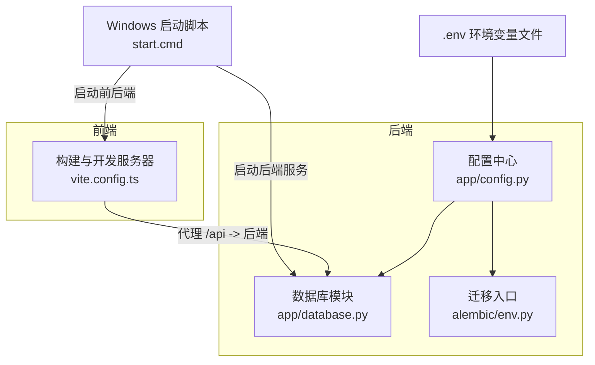
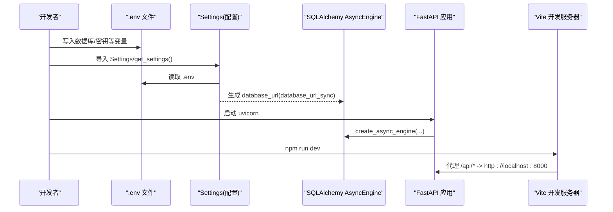
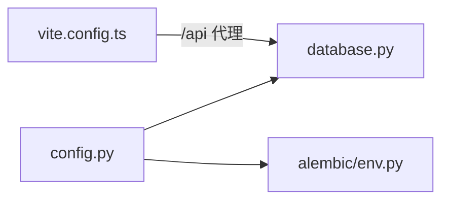

# 环境配置管理

<cite>
**本文引用的文件**   
- [backEnd/app/config.py](file://backEnd/app/config.py)
- [backEnd/app/database.py](file://backEnd/app/database.py)
- [backEnd/alembic/env.py](file://backEnd/alembic/env.py)
- [frontEnd/vite.config.ts](file://frontEnd/vite.config.ts)
- [start.cmd](file://start.cmd)
- [backEnd/.gitignore](file://backEnd/.gitignore)
</cite>

## 目录
1. [简介](#简介)
2. [项目结构](#项目结构)
3. [核心组件](#核心组件)
4. [架构总览](#架构总览)
5. [详细组件分析](#详细组件分析)
6. [依赖关系分析](#依赖关系分析)
7. [性能与连接池](#性能与连接池)
8. [常见问题排查](#常见问题排查)
9. [结论](#结论)
10. [附录：环境变量清单与默认值](#附录环境变量清单与默认值)

## 简介
本文件面向 HR XF 系统的环境配置管理，覆盖开发环境与生产环境的差异、环境变量设置、数据库连接配置、API 密钥管理、前端构建与代理配置，以及 Windows/Linux 下的启动脚本策略。文档以代码仓库中的实际实现为依据，帮助读者快速完成本地联调与上线部署。

## 项目结构
后端使用 FastAPI + SQLAlchemy Async + Alembic，配置通过 pydantic-settings 从 .env 加载；前端基于 Vite + Vue3，提供开发代理与路径别名。根目录提供 Windows 一键启动脚本，Linux 需自行创建等效脚本。

图表来源
- [backEnd/app/config.py:1-71](file://backEnd/app/config.py#L1-L71)
- [backEnd/app/database.py:1-58](file://backEnd/app/database.py#L1-L58)
- [backEnd/alembic/env.py:1-54](file://backEnd/alembic/env.py#L1-L54)
- [frontEnd/vite.config.ts:1-22](file://frontEnd/vite.config.ts#L1-L22)
- [start.cmd:1-36](file://start.cmd#L1-L36)

章节来源
- [backEnd/app/config.py:1-71](file://backEnd/app/config.py#L1-L71)
- [backEnd/app/database.py:1-58](file://backEnd/app/database.py#L1-L58)
- [backEnd/alembic/env.py:1-54](file://backEnd/alembic/env.py#L1-L54)
- [frontEnd/vite.config.ts:1-22](file://frontEnd/vite.config.ts#L1-L22)
- [start.cmd:1-36](file://start.cmd#L1-L36)

## 核心组件
- 配置中心（pydantic-settings）：集中定义所有运行时配置项，统一从 .env 读取并提供属性访问器。
- 数据库模块：基于 SQLAlchemy AsyncEngine 和 Session 工厂，暴露 get_db 依赖注入函数。
- 迁移入口：Alembic 在 env.py 中覆盖 sqlalchemy.url，确保迁移使用 .env 中的同步 URL。
- 前端构建：Vite 插件、路径别名、开发服务器代理到后端。
- 启动脚本：Windows 一键启动前后端；Linux 需自建等效脚本。

章节来源
- [backEnd/app/config.py:1-71](file://backEnd/app/config.py#L1-L71)
- [backEnd/app/database.py:1-58](file://backEnd/app/database.py#L1-L58)
- [backEnd/alembic/env.py:1-54](file://backEnd/alembic/env.py#L1-L54)
- [frontEnd/vite.config.ts:1-22](file://frontEnd/vite.config.ts#L1-L22)
- [start.cmd:1-36](file://start.cmd#L1-L36)

## 架构总览
下图展示配置加载、数据库连接与前端代理的关键流程。

图表来源
- [backEnd/app/config.py:1-71](file://backEnd/app/config.py#L1-L71)
- [backEnd/app/database.py:1-58](file://backEnd/app/database.py#L1-L58)
- [frontEnd/vite.config.ts:1-22](file://frontEnd/vite.config.ts#L1-L22)
- [start.cmd:1-36](file://start.cmd#L1-L36)

## 详细组件分析

### 配置中心（config.py）
- 配置来源：通过 SettingsConfigDict 指定 .env 文件路径与编码，优先从 .env 读取，未设置的字段使用类内默认值。
- 关键配置项与默认值：
  - 数据库：主机、端口、用户名、密码、库名。
  - JWT：密钥、算法、令牌过期时间。
  - MinIO（预留）：端点、访问密钥、桶名。
  - CORS：允许的源列表（逗号分隔）。
  - Deepseek API：Key、URL、模型名。
  - 编译器路径（可选）：Python/GCC/G++/Java/Javac/Node 可执行路径，未设置时自动从 PATH 检测。
- 便捷属性：
  - database_url：异步 MySQL URL（aiomysql）。
  - database_url_sync：同步 MySQL URL（pymysql），供 Alembic 使用。
  - cors_origins_list：将逗号分隔字符串解析为列表。
- 缓存：get_settings 使用 lru_cache 避免重复实例化。

章节来源
- [backEnd/app/config.py:1-71](file://backEnd/app/config.py#L1-L71)

### 数据库连接（database.py）
- 引擎与会话：
  - 使用 create_async_engine 创建异步引擎，参数包括 echo、pool_pre_ping、pool_size、max_overflow。
  - async_sessionmaker 创建会话工厂，expire_on_commit=False。
- 兼容性补丁：对 aiomysql >= 0.3 的 ping 签名进行 monkey-patch，避免 pool_pre_ping 报错。
- 依赖注入：get_db 作为异步生成器，请求结束时提交或回滚。

章节来源
- [backEnd/app/database.py:1-58](file://backEnd/app/database.py#L1-L58)

### 迁移入口（alembic/env.py）
- 覆盖 URL：从 Settings 获取 database_url_sync，并设置到 alembic 配置中，保证迁移使用同步连接。
- 元数据注册：导入 Base 与各模型，使 Alembic 能发现表结构变更。
- 运行模式：支持离线与在线两种迁移执行方式。

章节来源
- [backEnd/alembic/env.py:1-54](file://backEnd/alembic/env.py#L1-L54)

### 前端构建与开发（vite.config.ts）
- 插件：Vue 与 TailwindCSS 插件启用。
- 路径别名：@ 指向 src 目录。
- 开发服务器：
  - 代理规则：将 /api 请求转发至 http://localhost:8000，并开启 changeOrigin。
  - 静态资源：由 Vite 默认处理，无需额外配置。
- 构建产物：默认输出到 dist 目录（由 Vite 默认行为决定）。

章节来源
- [frontEnd/vite.config.ts:1-22](file://frontEnd/vite.config.ts#L1-L22)

### 启动脚本与环境差异
- Windows：
  - 提供 start.cmd，自动激活 Python 虚拟环境，分别启动后端（uvicorn）与前端（npm run dev），并在控制台打印访问地址。
- Linux：
  - 仓库未提供 shell 启动脚本，建议参考 Windows 脚本逻辑自建脚本，例如：
    - 进入 backEnd，激活虚拟环境，执行 uvicorn app.main:app --host 0.0.0.0 --port 8000。
    - 进入 frontEnd，执行 npm run dev。
  - 若需要 systemd 管理，可将上述命令封装为 service 单元文件。

章节来源
- [start.cmd:1-36](file://start.cmd#L1-L36)

## 依赖关系分析
- 配置依赖：
  - database.py 依赖 config.get_settings 获取数据库 URL。
  - alembic/env.py 同样依赖 config.get_settings 获取同步 URL。
- 前端依赖：
  - vite.config.ts 通过代理将 /api 请求转发到后端，形成前后端联调链路。

图表来源
- [backEnd/app/config.py:1-71](file://backEnd/app/config.py#L1-L71)
- [backEnd/app/database.py:1-58](file://backEnd/app/database.py#L1-L58)
- [backEnd/alembic/env.py:1-54](file://backEnd/alembic/env.py#L1-L54)
- [frontEnd/vite.config.ts:1-22](file://frontEnd/vite.config.ts#L1-L22)

## 性能与连接池
- 连接池参数：
  - pool_size：基础连接数。
  - max_overflow：超出基础连接数的最大溢出连接数。
  - pool_pre_ping：每次使用前检查连接有效性，避免“死连接”。
- 建议：
  - 开发环境保持默认即可。
  - 生产环境根据并发量调整 pool_size 与 max_overflow，并结合数据库最大连接数限制。

章节来源
- [backEnd/app/database.py:1-58](file://backEnd/app/database.py#L1-L58)

## 常见问题排查
- 无法连接数据库
  - 检查 .env 中的 db_host/db_port/db_user/db_password/db_name 是否正确。
  - 确认数据库服务已启动且允许本机或远程访问。
  - 验证 database_url 拼接是否符合预期（注意字符集 utf8mb4）。
- Alembic 迁移失败
  - 确认 alembic/env.py 正确覆盖 sqlalchemy.url 为同步 URL。
  - 检查 .env 是否包含正确的数据库凭据。
- 跨域问题
  - 在 .env 中设置 cors_origins，包含前端开发地址（如 http://localhost:5173）。
- 前端代理无效
  - 确认 vite.config.ts 中 server.proxy 的 target 指向后端地址。
  - 确保后端已在 8000 端口监听。
- Windows 启动异常
  - 检查虚拟环境路径 .venv\Scripts\activate 是否存在。
  - 确认 Node.js 与 npm 已安装且在 PATH 中。
- Linux 启动缺失
  - 仓库未提供 shell 脚本，请参照 Windows 脚本自建启动流程。

章节来源
- [backEnd/app/config.py:1-71](file://backEnd/app/config.py#L1-L71)
- [backEnd/app/database.py:1-58](file://backEnd/app/database.py#L1-L58)
- [backEnd/alembic/env.py:1-54](file://backEnd/alembic/env.py#L1-L54)
- [frontEnd/vite.config.ts:1-22](file://frontEnd/vite.config.ts#L1-L22)
- [start.cmd:1-36](file://start.cmd#L1-L36)

## 结论
HR XF 的环境配置围绕 .env 统一管理，后端通过 pydantic-settings 集中加载，数据库连接与迁移均依赖该配置；前端通过 Vite 代理简化联调。生产环境应严格区分 .env 内容，尤其是数据库凭据、JWT 密钥与第三方 API Key，并根据负载调整连接池参数。Windows 用户可直接使用提供的启动脚本，Linux 用户需自建等效脚本。

## 附录：环境变量清单与默认值
以下为后端配置项说明与默认值（来自 Settings 类定义）：
- 数据库
  - db_host：默认 localhost
  - db_port：默认 3306
  - db_user：默认 root
  - db_password：默认空
  - db_name：默认 hr_interview
- JWT
  - secret_key：默认开发用占位符
  - algorithm：默认 HS256
  - access_token_expire_minutes：默认 1440（分钟）
- MinIO（预留）
  - minio_endpoint：默认 localhost:9000
  - minio_access_key：默认 minioadmin
  - minio_secret_key：默认 minioadmin
  - minio_bucket：默认 hr-interview
- CORS
  - cors_origins：默认 http://localhost:3000,http://localhost:5173
- Deepseek API
  - deepseek_api_key：默认空
  - deepseek_api_url：默认 https://api.deepseek.com
  - deepseek_model：默认 deepseek-v4-flash
- 编译器路径（可选）
  - python_bin/gcc_bin/gpp_bin/java_bin/javac_bin/node_bin：默认 None（自动从 PATH 检测）

安全提示
- .env 已被加入 .gitignore，请勿提交敏感信息。
- 生产环境务必更换 JWT secret_key 与数据库凭据，并最小化权限。

章节来源
- [backEnd/app/config.py:1-71](file://backEnd/app/config.py#L1-L71)
- [backEnd/.gitignore:1-20](file://backEnd/.gitignore#L1-L20)