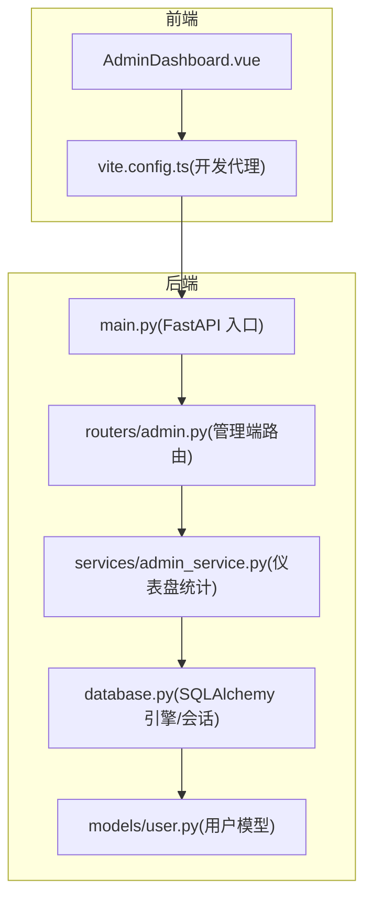
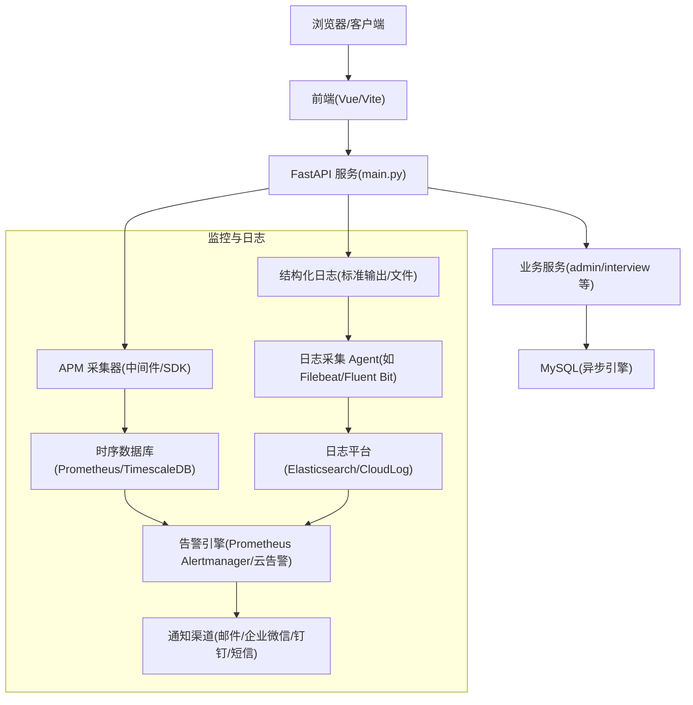
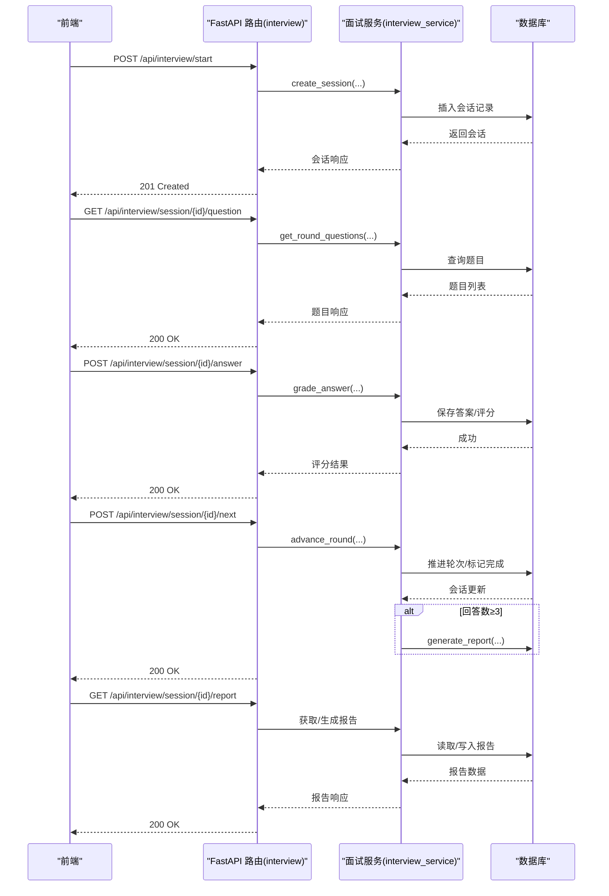
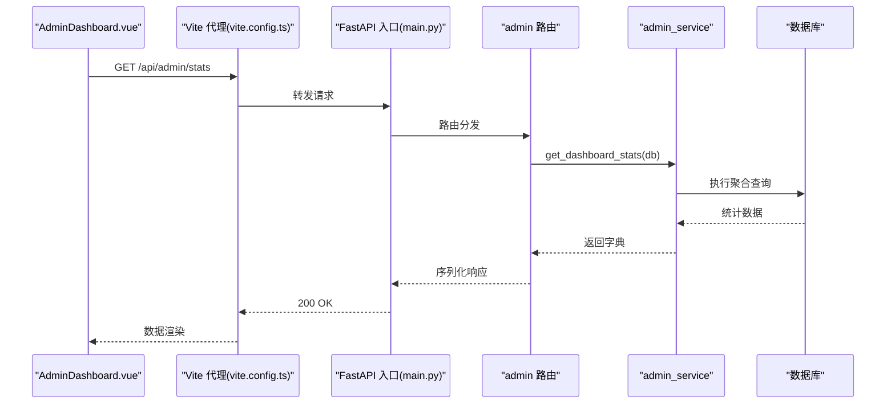

# 监控告警系统

<cite>
**本文引用的文件**   
- [backEnd/app/main.py](file://backEnd/app/main.py)
- [backEnd/requirements.txt](file://backEnd/requirements.txt)
- [backEnd/app/config.py](file://backEnd/app/config.py)
- [backEnd/app/database.py](file://backEnd/app/database.py)
- [backEnd/app/routers/admin.py](file://backEnd/app/routers/admin.py)
- [backEnd/app/services/admin_service.py](file://backEnd/app/services/admin_service.py)
- [backEnd/app/routers/interview.py](file://backEnd/app/routers/interview.py)
- [backEnd/app/services/interview_service.py](file://backEnd/app/services/interview_service.py)
- [backEnd/app/models/user.py](file://backEnd/app/models/user.py)
- [frontEnd/src/views/admin/AdminDashboard.vue](file://frontEnd/src/views/admin/AdminDashboard.vue)
- [frontEnd/vite.config.ts](file://frontEnd/vite.config.ts)
</cite>

## 目录
1. [引言](#引言)
2. [项目结构](#项目结构)
3. [核心组件](#核心组件)
4. [架构总览](#架构总览)
5. [详细组件分析](#详细组件分析)
6. [依赖分析](#依赖分析)
7. [性能考虑](#性能考虑)
8. [故障排查指南](#故障排查指南)
9. [结论](#结论)
10. [附录](#附录)

## 引言
本文件为 HR XF 系统的“监控告警系统”配置与实施方案，覆盖以下目标：
- 应用性能监控（APM）集成方案：请求响应时间、错误率、吞吐量的采集与展示。
- 结构化日志收集：统一格式、集中存储与检索。
- 业务指标监控：用户活跃度、面试完成率、代码提交量等业务 KPI。
- 告警规则：系统异常、性能瓶颈、业务异常等告警策略。
- 监控面板自定义方法与告警通知渠道设置。

当前仓库未内置 APM 与日志收集组件，本文基于现有后端 FastAPI 服务、数据库模型与管理端接口，给出可落地的集成步骤与配置建议，确保在不侵入核心业务逻辑的前提下完成监控与告警能力构建。

## 项目结构
HR XF 采用前后端分离架构：
- 后端：FastAPI + SQLAlchemy 异步 + MySQL；提供管理端统计接口与面试流程 API。
- 前端：Vue 3 + Vite；管理端页面通过 /api 代理访问后端。



图表来源
- [backEnd/app/main.py:44-68](file://backEnd/app/main.py#L44-L68)
- [backEnd/app/routers/admin.py:39-45](file://backEnd/app/routers/admin.py#L39-L45)
- [backEnd/app/services/admin_service.py:14-33](file://backEnd/app/services/admin_service.py#L14-L33)
- [backEnd/app/database.py:31-43](file://backEnd/app/database.py#L31-L43)
- [backEnd/app/models/user.py:10-45](file://backEnd/app/models/user.py#L10-L45)
- [frontEnd/src/views/admin/AdminDashboard.vue:1-49](file://frontEnd/src/views/admin/AdminDashboard.vue#L1-L49)
- [frontEnd/vite.config.ts:13-21](file://frontEnd/vite.config.ts#L13-L21)

章节来源
- [backEnd/app/main.py:44-68](file://backEnd/app/main.py#L44-L68)
- [backEnd/app/routers/admin.py:39-45](file://backEnd/app/routers/admin.py#L39-L45)
- [backEnd/app/services/admin_service.py:14-33](file://backEnd/app/services/admin_service.py#L14-L33)
- [backEnd/app/database.py:31-43](file://backEnd/app/database.py#L31-L43)
- [backEnd/app/models/user.py:10-45](file://backEnd/app/models/user.py#L10-L45)
- [frontEnd/src/views/admin/AdminDashboard.vue:1-49](file://frontEnd/src/views/admin/AdminDashboard.vue#L1-L49)
- [frontEnd/vite.config.ts:13-21](file://frontEnd/vite.config.ts#L13-L21)

## 核心组件
- 应用入口与中间件：FastAPI 应用初始化、CORS、静态资源挂载、健康检查与健康探针。
- 管理端统计接口：管理员获取平台统计数据（用户、题目、帖子、面试会话总量及新增趋势）。
- 数据库连接池：异步引擎与会话工厂，支持连接池大小与溢出配置。
- 前端管理面板：数据概览页，展示关键统计卡片与增长趋势。

章节来源
- [backEnd/app/main.py:44-90](file://backEnd/app/main.py#L44-L90)
- [backEnd/app/routers/admin.py:39-45](file://backEnd/app/routers/admin.py#L39-L45)
- [backEnd/app/services/admin_service.py:14-33](file://backEnd/app/services/admin_service.py#L14-L33)
- [backEnd/app/database.py:31-43](file://backEnd/app/database.py#L31-L43)
- [frontEnd/src/views/admin/AdminDashboard.vue:1-49](file://frontEnd/src/views/admin/AdminDashboard.vue#L1-L49)

## 架构总览
下图展示了在现有代码基础上接入 APM、日志与告警的整体架构。APM 通过中间件或 SDK 采集 HTTP 指标并上报至时序数据库；结构化日志经 Log Agent 采集到日志平台；告警引擎从时序/日志平台读取指标与事件，触发通知渠道。



[此图为概念性架构图，不直接映射具体源码文件]

## 详细组件分析

### 应用性能监控（APM）集成方案
- 指标范围
  - 请求级：HTTP 方法、路径、状态码、耗时、入参摘要（脱敏）、调用栈（可选）。
  - 服务级：QPS、P50/P95/P99 延迟、错误率、并发数、GC/内存（若适用）。
  - 数据库：连接池使用率、慢查询数量、事务耗时。
- 集成方式
  - 在 FastAPI 入口添加 APM 中间件或使用官方 SDK 自动埋点，统一注入请求上下文。
  - 对关键业务路径（如面试答题、AI 对话流式返回）增加自定义指标（如答题耗时、流式首包时延）。
  - 将指标以 Prometheus 兼容格式暴露或直接上报至时序数据库。
- 展示与看板
  - 在时序数据库中创建仪表盘，按模块/路由维度聚合指标，支持阈值与同比环比。
- 与现有代码的衔接点
  - 入口与中间件注册位置位于应用初始化处，便于全局拦截。
  - 健康检查端点可用于存活/就绪探针。

章节来源
- [backEnd/app/main.py:44-90](file://backEnd/app/main.py#L44-L90)

### 结构化日志收集系统
- 日志规范
  - 统一 JSON 格式，包含字段：时间戳、级别、模块、请求 ID、用户标识（脱敏）、操作对象、结果、耗时、错误堆栈（仅错误级别）。
  - 敏感信息脱敏（密码、令牌、身份证号等）。
- 采集与存储
  - 后端输出到标准输出或本地文件，由日志采集 Agent 抓取并转发至日志平台。
  - 建立索引策略：按模块、级别、请求 ID、用户 ID 建索引，提升检索效率。
- 与现有代码的衔接点
  - 可在中间件层统一写入请求/响应日志与异常日志。
  - 业务服务中已有部分 logging 使用，可作为规范化改造示例。

章节来源
- [backEnd/app/main.py:44-90](file://backEnd/app/main.py#L44-L90)

### 业务指标监控（KPI）
- 指标定义
  - 用户活跃度：日活/周活、新增用户、活跃会话数。
  - 面试完成率：已完成会话/开始会话比例、各轮次完成率。
  - 代码提交量：问题提交次数、通过率、平均用时。
- 数据来源
  - 管理端统计接口已提供基础计数与新增趋势，可直接作为 KPI 源。
  - 面试相关会话与答案记录用于计算完成率与质量指标。
- 采集与更新
  - 定时任务或增量 SQL 聚合，写入时序数据库或专用指标表。
  - 前端管理面板可对接该指标接口进行可视化展示。

章节来源
- [backEnd/app/routers/admin.py:39-45](file://backEnd/app/routers/admin.py#L39-L45)
- [backEnd/app/services/admin_service.py:14-33](file://backEnd/app/services/admin_service.py#L14-L33)
- [frontEnd/src/views/admin/AdminDashboard.vue:1-49](file://frontEnd/src/views/admin/AdminDashboard.vue#L1-L49)

### 告警规则设计
- 系统异常告警
  - 健康检查失败、数据库连接池耗尽、外部依赖超时。
- 性能瓶颈告警
  - P95/P99 延迟超过阈值、错误率突增、QPS 异常波动。
- 业务异常告警
  - 面试完成率骤降、切屏异常增多、AI 对话失败率上升。
- 告警通道
  - 邮件、企业微信、钉钉、短信等多通道，支持分级与静默期。

[本节为通用策略说明，不直接分析具体文件]

### 监控面板自定义配置方法
- 指标看板
  - 基于时序数据库创建仪表盘，按模块/路由/状态码维度聚合。
  - 支持多时间窗口对比、阈值线、联动跳转。
- 日志看板
  - 按模块、级别、请求 ID 过滤，关联错误堆栈与上下文。
- 业务看板
  - 结合管理端统计接口，展示用户增长、面试进度、题目提交等。

[本节为通用配置指导，不直接分析具体文件]

### 告警通知渠道设置
- 渠道类型
  - 即时通讯（企业微信/钉钉）、邮件、短信、电话。
- 策略
  - 按严重等级分流，避免告警风暴；支持升级与确认闭环。
- 与现有代码的衔接点
  - 可通过独立告警服务调用通知 API，无需侵入业务代码。

[本节为通用配置指导，不直接分析具体文件]

## 依赖分析
- 运行时依赖
  - FastAPI、Uvicorn、Pydantic Settings、SQLAlchemy 异步、Alembic、加密库、HTTP 客户端、PDF 解析、TTS 等。
- 监控与日志扩展
  - 建议在 requirements 中引入 APM SDK 与日志采集依赖，保持与现有版本管理一致。

章节来源
- [backEnd/requirements.txt:1-27](file://backEnd/requirements.txt#L1-L27)

## 性能考虑
- 连接池与超时
  - 合理设置连接池大小与溢出，避免高并发下连接争用。
- 指标采样
  - 对高频接口启用采样上报，降低监控开销。
- 日志级别控制
  - 生产环境默认 INFO/WARN，DEBUG 按需开启，避免 I/O 压力。
- 流式接口优化
  - AI 对话等长连接需关注背压与缓冲策略，避免阻塞事件循环。

章节来源
- [backEnd/app/database.py:31-43](file://backEnd/app/database.py#L31-L43)
- [backEnd/app/routers/interview.py:161-189](file://backEnd/app/routers/interview.py#L161-L189)

## 故障排查指南
- 常见问题定位
  - 健康检查失败：检查 /api/health 端点与进程状态。
  - 数据库连接异常：查看连接池配置与网络连通性。
  - 验证错误：参考自定义验证错误处理器返回的结构化错误。
- 日志与指标辅助
  - 通过请求 ID 追踪链路，结合 APM 耗时与错误堆栈快速定位。
  - 使用日志平台检索错误级别与模块标签，缩小范围。

章节来源
- [backEnd/app/main.py:76-84](file://backEnd/app/main.py#L76-L84)
- [backEnd/app/main.py:87-90](file://backEnd/app/main.py#L87-L90)
- [backEnd/app/database.py:31-43](file://backEnd/app/database.py#L31-L43)

## 结论
通过在 FastAPI 入口与关键业务路径集成 APM、标准化日志输出与告警引擎，HR XF 可实现端到端的可观测性与稳定性保障。结合管理端统计接口与前端面板，既能满足运维监控需求，也能支撑业务决策与持续优化。

[本节为总结性内容，不直接分析具体文件]

## 附录

### 关键接口与数据模型关系
```mermaid
classDiagram
class AdminRouter {
+GET "/api/admin/stats"
+GET "/api/admin/users"
+PUT "/api/admin/users/{user_id}"
+DELETE "/api/admin/users/{user_id}"
+GET "/api/admin/problems"
+POST "/api/admin/problems"
+PUT "/api/admin/problems/{problem_id}"
+DELETE "/api/admin/problems/{problem_id}"
+GET "/api/admin/posts"
+DELETE "/api/admin/posts/{post_id}"
}
class AdminService {
+get_dashboard_stats(db) dict
+get_users(db, keyword, page, size) tuple
+update_user(db, user_id, data) User
+delete_user(db, user_id) bool
+get_problems_admin(db, keyword, difficulty, page, size) tuple
+create_problem(db, data) Problem
+update_problem(db, problem_id, data) Problem
+delete_problem(db, problem_id) bool
+get_posts_admin(db, keyword, page, size) tuple
+delete_post(db, post_id) bool
}
class Database {
+engine
+async_session_factory
+get_db() AsyncGenerator
}
class UserModel {
+id
+username
+email
+password_hash
+is_active
+nickname
+avatar
+avatar_color
+bio
+phone
+gender
+birth_date
+created_at
+updated_at
}
AdminRouter --> AdminService : "调用"
AdminService --> Database : "读写"
Database --> UserModel : "ORM 映射"
```

图表来源
- [backEnd/app/routers/admin.py:39-198](file://backEnd/app/routers/admin.py#L39-L198)
- [backEnd/app/services/admin_service.py:14-33](file://backEnd/app/services/admin_service.py#L14-L33)
- [backEnd/app/database.py:31-57](file://backEnd/app/database.py#L31-L57)
- [backEnd/app/models/user.py:10-45](file://backEnd/app/models/user.py#L10-L45)

### 面试会话关键流程（含报告生成）


图表来源
- [backEnd/app/routers/interview.py:36-317](file://backEnd/app/routers/interview.py#L36-L317)
- [backEnd/app/services/interview_service.py:858-888](file://backEnd/app/services/interview_service.py#L858-L888)

### 管理端统计接口调用序列


图表来源
- [frontEnd/src/views/admin/AdminDashboard.vue:1-49](file://frontEnd/src/views/admin/AdminDashboard.vue#L1-L49)
- [frontEnd/vite.config.ts:13-21](file://frontEnd/vite.config.ts#L13-L21)
- [backEnd/app/main.py:44-68](file://backEnd/app/main.py#L44-L68)
- [backEnd/app/routers/admin.py:39-45](file://backEnd/app/routers/admin.py#L39-L45)
- [backEnd/app/services/admin_service.py:14-33](file://backEnd/app/services/admin_service.py#L14-L33)