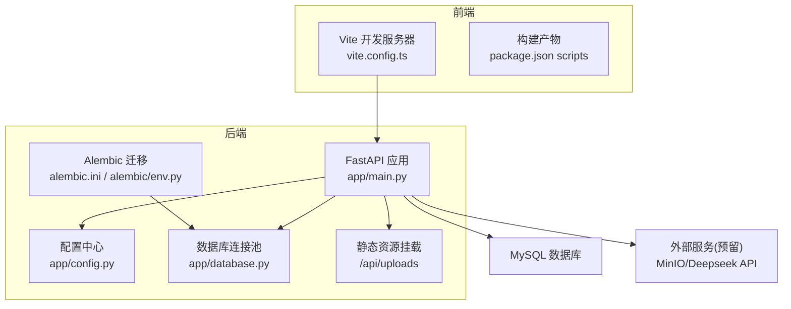
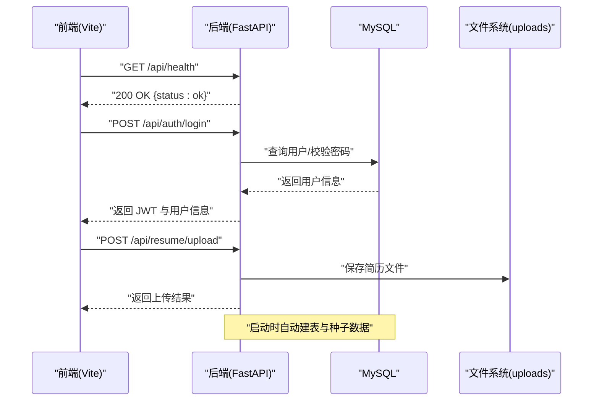
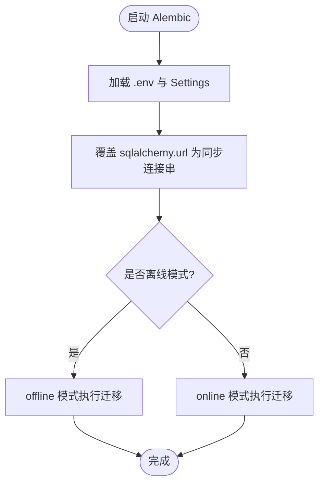
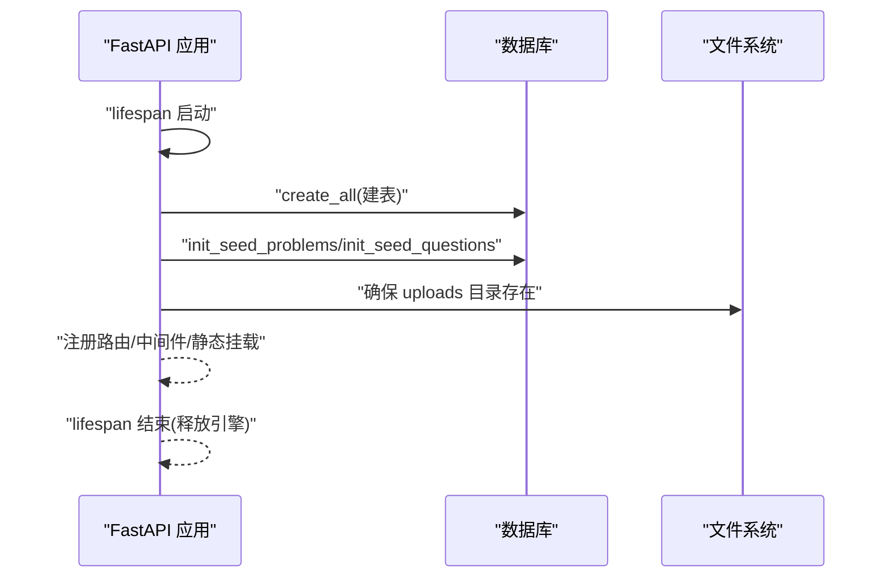
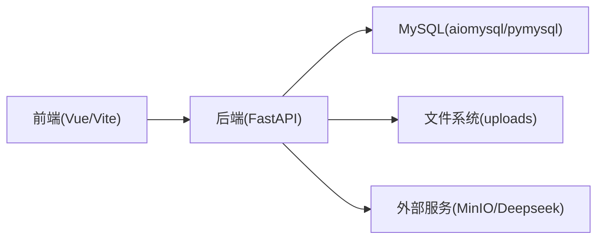

# 部署与运维

<cite>
**本文引用的文件**   
- [backEnd/app/config.py](file://backEnd/app/config.py)
- [backEnd/app/database.py](file://backEnd/app/database.py)
- [backEnd/app/main.py](file://backEnd/app/main.py)
- [backEnd/alembic.ini](file://backEnd/alembic.ini)
- [backEnd/alembic/env.py](file://backEnd/alembic/env.py)
- [backEnd/requirements.txt](file://backEnd/requirements.txt)
- [frontEnd/vite.config.ts](file://frontEnd/vite.config.ts)
- [frontEnd/package.json](file://frontEnd/package.json)
- [start.cmd](file://start.cmd)
</cite>

## 目录
1. [简介](#简介)
2. [项目结构](#项目结构)
3. [核心组件](#核心组件)
4. [架构总览](#架构总览)
5. [详细组件分析](#详细组件分析)
6. [依赖关系分析](#依赖关系分析)
7. [性能考虑](#性能考虑)
8. [故障排查指南](#故障排查指南)
9. [结论](#结论)
10. [附录](#附录)

## 简介
本文件为 HR XF 系统的部署与运维手册，覆盖开发环境与生产环境的配置差异、容器化与编排方案、CI/CD 流水线建议、监控告警策略、安全加固、备份恢复、负载均衡与水平扩展，以及面向运维人员的日常维护与排障操作。文档内容严格基于仓库现有代码与配置进行说明，并提供可操作的步骤与图示。

## 项目结构
HR XF 采用前后端分离架构：
- 后端：FastAPI + SQLAlchemy 异步驱动 + Alembic 迁移 + MySQL（通过 aiomysql/pymysql）
- 前端：Vue 3 + Vite + TailwindCSS
- 启动脚本：Windows 一键启动脚本用于本地开发

图表来源
- [backEnd/app/main.py:1-90](file://backEnd/app/main.py#L1-L90)
- [backEnd/app/config.py:1-71](file://backEnd/app/config.py#L1-L71)
- [backEnd/app/database.py:1-58](file://backEnd/app/database.py#L1-L58)
- [backEnd/alembic.ini:1-40](file://backEnd/alembic.ini#L1-L40)
- [backEnd/alembic/env.py:1-53](file://backEnd/alembic/env.py#L1-L53)
- [frontEnd/vite.config.ts:1-22](file://frontEnd/vite.config.ts#L1-L22)
- [frontEnd/package.json:1-35](file://frontEnd/package.json#L1-L35)

章节来源
- [backEnd/app/main.py:1-90](file://backEnd/app/main.py#L1-L90)
- [backEnd/app/config.py:1-71](file://backEnd/app/config.py#L1-L71)
- [backEnd/app/database.py:1-58](file://backEnd/app/database.py#L1-L58)
- [backEnd/alembic.ini:1-40](file://backEnd/alembic.ini#L1-L40)
- [backEnd/alembic/env.py:1-53](file://backEnd/alembic/env.py#L1-L53)
- [frontEnd/vite.config.ts:1-22](file://frontEnd/vite.config.ts#L1-L22)
- [frontEnd/package.json:1-35](file://frontEnd/package.json#L1-L35)

## 核心组件
- 配置管理：使用 pydantic-settings 从 .env 加载环境变量，提供数据库 URL、CORS、JWT、MinIO、AI 接口等配置项，并缓存实例。
- 数据库层：SQLAlchemy 异步引擎与 Session 工厂，包含对 aiomysql 兼容性补丁；提供 get_db 依赖注入。
- 应用入口：FastAPI 应用生命周期中自动建表与种子数据初始化；挂载上传目录为静态资源；统一验证错误处理与健康检查。
- 迁移工具：Alembic 通过 env.py 读取 Settings 的同步数据库 URL，支持在线/离线模式执行迁移。
- 前端开发：Vite 开发服务器代理 /api 到后端；构建脚本由 package.json 定义。

章节来源
- [backEnd/app/config.py:1-71](file://backEnd/app/config.py#L1-L71)
- [backEnd/app/database.py:1-58](file://backEnd/app/database.py#L1-L58)
- [backEnd/app/main.py:1-90](file://backEnd/app/main.py#L1-L90)
- [backEnd/alembic/env.py:1-53](file://backEnd/alembic/env.py#L1-L53)
- [frontEnd/vite.config.ts:1-22](file://frontEnd/vite.config.ts#L1-L22)
- [frontEnd/package.json:1-35](file://frontEnd/package.json#L1-L35)

## 架构总览
下图展示运行时关键交互：前端通过 Vite 代理访问后端 API，后端通过 SQLAlchemy 异步连接 MySQL，并在启动时创建表结构与种子数据；静态资源通过 FastAPI 静态挂载暴露。

图表来源
- [backEnd/app/main.py:27-41](file://backEnd/app/main.py#L27-L41)
- [backEnd/app/main.py:87-90](file://backEnd/app/main.py#L87-L90)
- [backEnd/app/main.py:70-73](file://backEnd/app/main.py#L70-L73)
- [backEnd/app/database.py:31-43](file://backEnd/app/database.py#L31-L43)

## 详细组件分析

### 配置与环境变量
- 配置文件位置：.env（被 .gitignore 忽略，避免泄露敏感信息）
- 主要配置项：
  - 数据库：db_host, db_port, db_user, db_password, db_name
  - JWT：secret_key, algorithm, access_token_expire_minutes
  - MinIO（预留）：minio_endpoint, minio_access_key, minio_secret_key, minio_bucket
  - CORS：cors_origins（逗号分隔）
  - Deepseek API：deepseek_api_key, deepseek_api_url, deepseek_model
  - 编译器路径（可选）：python_bin, gcc_bin, gpp_bin, java_bin, javac_bin, node_bin
- 动态属性：
  - database_url：异步连接串（aiomysql）
  - database_url_sync：同步连接串（pymysql），供 Alembic 使用
  - cors_origins_list：解析为列表

开发与生产差异要点：
- 开发环境：默认 localhost 数据库、宽松 CORS、开发用 secret_key
- 生产环境：需设置强 secret_key、限制 CORS 白名单、指向外部 MySQL、按需配置 MinIO/AI 接口

章节来源
- [backEnd/app/config.py:1-71](file://backEnd/app/config.py#L1-L71)
- [backEnd/.gitignore:15-16](file://backEnd/.gitignore#L15-L16)

### 数据库连接与迁移
- 连接池参数：pool_size=10, max_overflow=20, pool_pre_ping=True
- 兼容性补丁：针对 aiomysql 0.3.x ping 签名变更进行 monkey-patch
- 会话工厂：expire_on_commit=False，减少重复查询开销
- 迁移：
  - alembic.ini 中默认连接串（会被 env.py 覆盖）
  - env.py 从 Settings 读取同步 URL 并覆盖 sqlalchemy.url
  - 支持 offline/online 两种运行模式

图表来源
- [backEnd/alembic/env.py:16-18](file://backEnd/alembic/env.py#L16-L18)
- [backEnd/alembic/env.py:23-53](file://backEnd/alembic/env.py#L23-L53)
- [backEnd/alembic.ini:1-40](file://backEnd/alembic.ini#L1-L40)

章节来源
- [backEnd/app/database.py:10-25](file://backEnd/app/database.py#L10-L25)
- [backEnd/app/database.py:31-43](file://backEnd/app/database.py#L31-L43)
- [backEnd/alembic/env.py:1-53](file://backEnd/alembic/env.py#L1-L53)
- [backEnd/alembic.ini:1-40](file://backEnd/alembic.ini#L1-L40)

### 应用生命周期与静态资源
- 启动阶段：
  - 自动创建所有模型表（dev 便利）
  - 初始化问题与面试题目种子数据
- 关闭阶段：释放数据库引擎
- 静态资源：将 uploads 目录挂载至 /api/uploads
- 健康检查：/api/health 返回状态

图表来源
- [backEnd/app/main.py:27-41](file://backEnd/app/main.py#L27-L41)
- [backEnd/app/main.py:70-73](file://backEnd/app/main.py#L70-L73)
- [backEnd/app/main.py:87-90](file://backEnd/app/main.py#L87-L90)

章节来源
- [backEnd/app/main.py:27-41](file://backEnd/app/main.py#L27-L41)
- [backEnd/app/main.py:70-73](file://backEnd/app/main.py#L70-L73)
- [backEnd/app/main.py:87-90](file://backEnd/app/main.py#L87-L90)

### 前端开发与代理
- 开发服务器：Vite 监听本地端口，默认通过 proxy 将 /api 转发到 http://localhost:8000
- 构建脚本：vue-tsc 类型检查后 vite build 生成静态资源
- 预览：vite preview 用于本地预览构建产物

章节来源
- [frontEnd/vite.config.ts:13-20](file://frontEnd/vite.config.ts#L13-L20)
- [frontEnd/package.json:6-10](file://frontEnd/package.json#L6-L10)

### 本地快速启动
- Windows 一键启动脚本 start.cmd：
  - 激活 Python 虚拟环境并启动 Uvicorn（带 --reload）
  - 等待后端初始化后启动前端 dev 服务器
  - 输出前端、后端与 API 文档地址

章节来源
- [start.cmd:1-35](file://start.cmd#L1-L35)

## 依赖关系分析
- 后端依赖：
  - FastAPI、Uvicorn、Pydantic Settings
  - SQLAlchemy 异步、aiomysql、pymysql、Alembic、cryptography
  - python-jose、passlib、python-multipart、email-validator
  - httpx、PyMuPDF、edge-tts
- 前端依赖：
  - Vue 3、Pinia、Vue Router、ECharts、TailwindCSS、Vite、TypeScript

图表来源
- [backEnd/requirements.txt:1-27](file://backEnd/requirements.txt#L1-L27)
- [frontEnd/package.json:11-33](file://frontEnd/package.json#L11-L33)

章节来源
- [backEnd/requirements.txt:1-27](file://backEnd/requirements.txt#L1-L27)
- [frontEnd/package.json:11-33](file://frontEnd/package.json#L11-L33)

## 性能考虑
- 数据库连接池：
  - 根据并发量调整 pool_size 与 max_overflow
  - 开启 pool_pre_ping 提升连接健壮性
- 会话优化：
  - expire_on_commit=False 减少重复查询
- 静态资源：
  - 生产环境建议使用反向代理或对象存储（如 MinIO）替代本地静态挂载
- 外部调用：
  - AI 接口与 TTS 调用应增加超时与重试策略（当前未实现，建议在网关或服务层补充）

[本节为通用指导，不直接分析具体文件]

## 故障排查指南
- 认证失败（401）：
  - 检查 JWT secret_key 是否与客户端一致
  - 确认 Token 未过期且载荷包含 sub 字段
- 跨域错误：
  - 核对 cors_origins 是否包含前端域名
- 数据库连接异常：
  - 检查 .env 中的数据库凭据与网络可达性
  - 关注 aiomysql ping 兼容性问题（已内置补丁）
- 上传失败：
  - 确认 uploads 目录存在且进程有写入权限
  - 检查文件大小与类型限制
- 健康检查：
  - 访问 /api/health 判断后端存活

章节来源
- [backEnd/app/dependencies.py:13-40](file://backEnd/app/dependencies.py#L13-L40)
- [backEnd/app/utils/security.py:26-47](file://backEnd/app/utils/security.py#L26-L47)
- [backEnd/app/main.py:76-84](file://backEnd/app/main.py#L76-L84)
- [backEnd/app/main.py:87-90](file://backEnd/app/main.py#L87-L90)

## 结论
HR XF 系统具备清晰的配置管理与分层架构，适合在容器化环境中部署。通过合理的环境变量管理、数据库连接池调优、静态资源策略与监控告警体系，可在生产环境获得稳定可靠的运行表现。建议在生产中引入反向代理、对象存储、日志与指标采集、密钥管理等基础设施以增强安全性与可观测性。

[本节为总结，不直接分析具体文件]

## 附录

### 环境变量清单（节选）
- 数据库
  - db_host, db_port, db_user, db_password, db_name
- JWT
  - secret_key, algorithm, access_token_expire_minutes
- MinIO（预留）
  - minio_endpoint, minio_access_key, minio_secret_key, minio_bucket
- CORS
  - cors_origins
- Deepseek API
  - deepseek_api_key, deepseek_api_url, deepseek_model
- 编译器路径（可选）
  - python_bin, gcc_bin, gpp_bin, java_bin, javac_bin, node_bin

章节来源
- [backEnd/app/config.py:13-45](file://backEnd/app/config.py#L13-L45)

### 数据库连接串生成规则
- 异步：mysql+aiomysql://{user}:{password}@{host}:{port}/{name}?charset=utf8mb4
- 同步：mysql+pymysql://{user}:{password}@{host}:{port}/{name}?charset=utf8mb4

章节来源
- [backEnd/app/config.py:47-61](file://backEnd/app/config.py#L47-L61)

### 静态资源路径
- 后端挂载点：/api/uploads
- 物理目录：backEnd/uploads（自动创建）

章节来源
- [backEnd/app/main.py:70-73](file://backEnd/app/main.py#L70-L73)

### 前端代理与构建
- 开发代理：/api -> http://localhost:8000
- 构建命令：npm run build（vue-tsc + vite build）
- 预览命令：npm run preview

章节来源
- [frontEnd/vite.config.ts:13-20](file://frontEnd/vite.config.ts#L13-L20)
- [frontEnd/package.json:6-10](file://frontEnd/package.json#L6-L10)

### 本地启动脚本
- 启动后端：uvicorn app.main:app --host 127.0.0.1 --port 8000 --reload
- 启动前端：npm run dev
- 打开浏览器：http://localhost:5173

章节来源
- [start.cmd:14-22](file://start.cmd#L14-L22)
- [start.cmd:28-31](file://start.cmd#L28-L31)