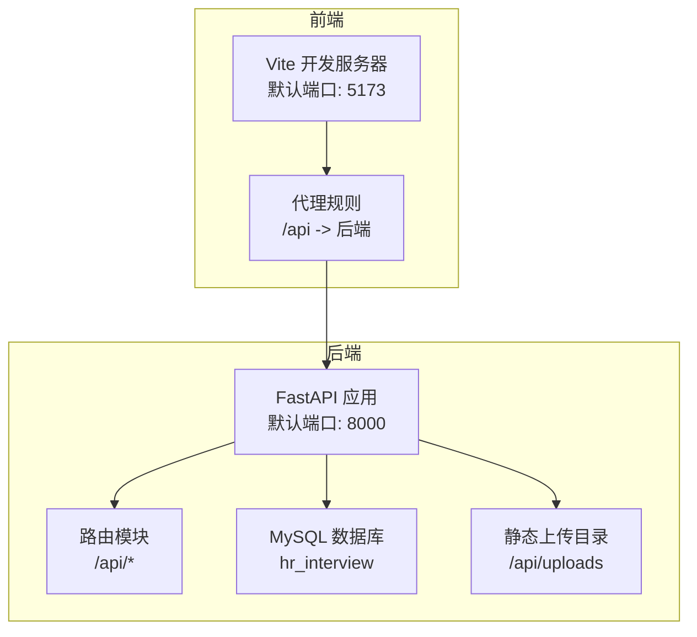
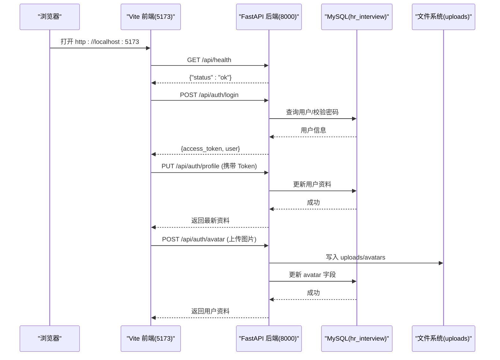
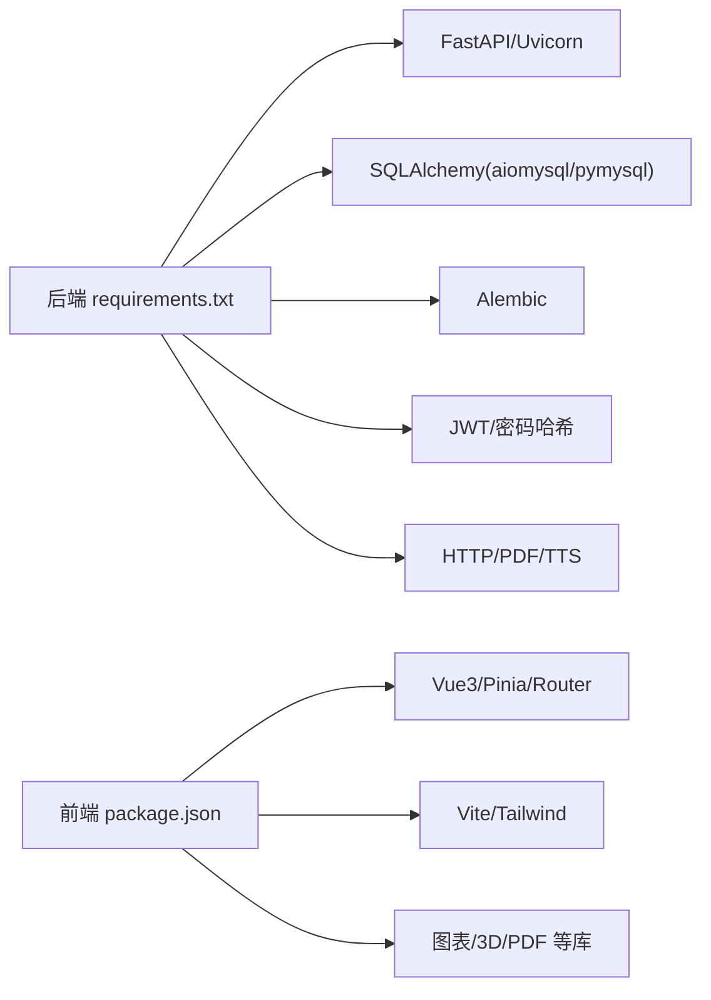

# 快速开始指南

<cite>
**本文引用的文件**   
- [backEnd\requirements.txt](file://backEnd/requirements.txt)
- [frontEnd\package.json](file://frontEnd/package.json)
- [start.cmd](file://start.cmd)
- [backEnd\app\config.py](file://backEnd/app/config.py)
- [backEnd\app\database.py](file://backEnd/app/database.py)
- [backEnd\app\main.py](file://backEnd/app/main.py)
- [backEnd\alembic.ini](file://backEnd/alembic.ini)
- [hr_interview.sql](file://hr_interview.sql)
- [backEnd\app\models\user.py](file://backEnd/app/models/user.py)
- [backEnd\app\routers\auth.py](file://backEnd/app/routers/auth.py)
- [frontEnd\vite.config.ts](file://frontEnd/vite.config.ts)
- [frontEnd\src\main.ts](file://frontEnd/src/main.ts)
</cite>

## 目录
1. [简介](#简介)
2. [项目结构](#项目结构)
3. [核心组件](#核心组件)
4. [架构总览](#架构总览)
5. [详细组件分析](#详细组件分析)
6. [依赖关系分析](#依赖关系分析)
7. [性能与配置建议](#性能与配置建议)
8. [故障排查指南](#故障排查指南)
9. [结论](#结论)
10. [附录：从零到运行第一个功能](#附录从零到运行第一个功能)

## 简介
本指南面向新开发者，提供 HR XF（AI 面试系统）的完整本地环境搭建、数据库初始化、前后端启动与验证流程。你将学会如何安装 Node.js、Python、MySQL，完成数据库初始化与迁移，配置环境变量与端口，并快速体验认证、面经浏览、模拟面试等核心功能。

## 项目结构
- 后端（FastAPI + SQLAlchemy 异步 + Alembic）
  - 应用入口与路由挂载：[backEnd\app\main.py](file://backEnd/app/main.py)
  - 配置与环境变量：[backEnd\app\config.py](file://backEnd/app/config.py)
  - 数据库连接与会话管理：[backEnd\app\database.py](file://backEnd/app/database.py)
  - 模型示例（用户）：[backEnd\app\models\user.py](file://backEnd/app/models/user.py)
  - 认证路由示例：[backEnd\app\routers\auth.py](file://backEnd/app/routers/auth.py)
  - Alembic 配置：[backEnd\alembic.ini](file://backEnd/alembic.ini)
  - 依赖清单：[backEnd\requirements.txt](file://backEnd/requirements.txt)
- 前端（Vue3 + Vite + Tailwind）
  - 构建脚本与依赖：[frontEnd\package.json](file://frontEnd/package.json)
  - 开发代理配置（转发 /api 到后端）：[frontEnd\vite.config.ts](file://frontEnd/vite.config.ts)
  - 应用入口与登录态恢复：[frontEnd\src\main.ts](file://frontEnd/src/main.ts)
- 一键启动脚本：[start.cmd](file://start.cmd)
- 数据库初始 SQL（含表结构与种子数据）：[hr_interview.sql](file://hr_interview.sql)

**图示来源** 
- [start.cmd:1-36](file://start.cmd#L1-L36)
- [frontEnd\vite.config.ts:1-22](file://frontEnd/vite.config.ts#L1-L22)
- [backEnd\app\main.py:44-74](file://backEnd/app/main.py#L44-L74)

**章节来源**
- [backEnd\app\main.py:44-74](file://backEnd/app/main.py#L44-L74)
- [frontEnd\vite.config.ts:13-21](file://frontEnd/vite.config.ts#L13-L21)
- [start.cmd:14-31](file://start.cmd#L14-L31)

## 核心组件
- 后端服务
  - FastAPI 应用生命周期：启动时创建表与初始化种子数据；关闭时释放引擎。
  - CORS 中间件：允许前端跨域访问。
  - 静态文件挂载：uploads 目录通过 /api/uploads 暴露。
  - 健康检查接口：/api/health。
- 数据库层
  - 异步引擎与会话工厂：基于 aiomysql/pymysql。
  - Base 元数据：供 create_all 使用。
  - get_db 依赖注入：自动提交或回滚。
- 配置与环境
  - Settings 类集中读取 .env 环境变量。
  - 数据库 URL 生成器（异步/同步）。
  - CORS 源列表解析。
- 认证与用户
  - 注册/登录/登出、个人信息更新、头像上传等接口。
  - JWT 令牌签发与校验（由服务层实现）。
- 前端
  - Vite 开发服务器与 Tailwind 插件。
  - 代理转发 /api 请求至后端 8000 端口。
  - 应用启动后恢复登录态（从本地 token）。

**章节来源**
- [backEnd\app\main.py:27-42](file://backEnd/app/main.py#L27-L42)
- [backEnd\app\main.py:51-74](file://backEnd/app/main.py#L51-L74)
- [backEnd\app\database.py:31-58](file://backEnd/app/database.py#L31-L58)
- [backEnd\app\config.py:7-71](file://backEnd/app/config.py#L7-L71)
- [backEnd\app\routers\auth.py:25-86](file://backEnd/app/routers/auth.py#L25-L86)
- [frontEnd\vite.config.ts:13-21](file://frontEnd/vite.config.ts#L13-L21)
- [frontEnd\src\main.ts:14-18](file://frontEnd/src/main.ts#L14-L18)

## 架构总览
下图展示了前后端交互、数据库与静态资源的关系，以及关键端口与路径。

**图示来源** 
- [backEnd\app\main.py:87-90](file://backEnd/app/main.py#L87-L90)
- [backEnd\app\routers\auth.py:69-86](file://backEnd/app/routers/auth.py#L69-L86)
- [backEnd\app\routers\auth.py:103-114](file://backEnd/app/routers/auth.py#L103-L114)
- [backEnd\app\routers\auth.py:182-216](file://backEnd/app/routers/auth.py#L182-L216)
- [backEnd\app\database.py:31-58](file://backEnd/app/database.py#L31-L58)

## 详细组件分析

### 环境与配置（Settings）
- 配置文件位置：[backEnd\app\config.py](file://backEnd/app/config.py)
- 关键配置项
  - 数据库：db_host、db_port、db_user、db_password、db_name
  - JWT：secret_key、algorithm、access_token_expire_minutes
  - MinIO（预留）：minio_endpoint、minio_access_key、minio_secret_key、minio_bucket
  - CORS：cors_origins（逗号分隔）
  - Deepseek API：deepseek_api_key、deepseek_api_url、deepseek_model
  - 编译器路径（可选）：python_bin/gcc_bin/gpp_bin/java_bin/javac_bin/node_bin
- 便捷属性
  - database_url：异步 MySQL URL（aiomysql）
  - database_url_sync：同步 MySQL URL（pymysql）
  - cors_origins_list：将字符串拆分为列表

**章节来源**
- [backEnd\app\config.py:13-66](file://backEnd/app/config.py#L13-L66)

### 数据库连接与会话（Database）
- 异步引擎与会话工厂：[backEnd\app\database.py](file://backEnd/app/database.py)
- 特性
  - pool_pre_ping=True 提升连接健壮性
  - 会话自动提交/回滚
  - Base 元数据用于 create_all
- 兼容性补丁：对 aiomysql 0.3.x ping 签名差异进行兼容处理

**章节来源**
- [backEnd\app\database.py:31-58](file://backEnd/app/database.py#L31-L58)

### 应用入口与生命周期（Main）
- 生命周期钩子：启动时建表与初始化种子数据；关闭时释放引擎。
- 中间件：CORS 允许前端跨域。
- 路由挂载：认证、帖子、题目、职业测评、简历、面试、管理员、TTS 等。
- 静态文件：/api/uploads 映射到 uploads 目录。
- 健康检查：/api/health。

**章节来源**
- [backEnd\app\main.py:27-42](file://backEnd/app/main.py#L27-L42)
- [backEnd\app\main.py:51-74](file://backEnd/app/main.py#L51-L74)
- [backEnd\app\main.py:87-90](file://backEnd/app/main.py#L87-L90)

### 认证与用户（Auth）
- 路由前缀：/api/auth
- 主要接口
  - 注册：邮箱/用户名注册
  - 登录：账号+密码
  - 登出：无状态（客户端丢弃 token）
  - 获取当前用户：/me
  - 个人资料：查看/更新
  - 修改用户名/邮箱：成功后重新签发 token
  - 修改密码
  - 注销账号
  - 上传头像：限制类型与大小，旧头像覆盖删除
- 安全与校验
  - 图片类型白名单与大小上限
  - 错误统一抛出 HTTPException

**章节来源**
- [backEnd\app\routers\auth.py:25-86](file://backEnd/app/routers/auth.py#L25-L86)
- [backEnd\app\routers\auth.py:97-176](file://backEnd/app/routers/auth.py#L97-L176)
- [backEnd\app\routers\auth.py:182-216](file://backEnd/app/routers/auth.py#L182-L216)

### 前端开发与代理（Frontend）
- 开发脚本：npm run dev（Vite）
- 代理配置：/api 转发到 http://localhost:8000
- 应用入口：初始化 Pinia、Router，恢复登录态后再挂载根组件

**章节来源**
- [frontEnd\package.json:6-10](file://frontEnd/package.json#L6-L10)
- [frontEnd\vite.config.ts:13-21](file://frontEnd/vite.config.ts#L13-L21)
- [frontEnd\src\main.ts:14-18](file://frontEnd/src/main.ts#L14-L18)

## 依赖关系分析
- 后端依赖（部分）
  - FastAPI、Uvicorn、Pydantic Settings
  - SQLAlchemy 2.0 异步、aiomysql、pymysql、Alembic
  - python-jose、passlib、python-multipart、email-validator
  - httpx、PyMuPDF、edge-tts
- 前端依赖（部分）
  - Vue3、Pinia、Vue Router
  - Vite、Tailwind、ECharts、Three.js、VRM、PDF.js 等

**图示来源** 
- [backEnd\requirements.txt:1-27](file://backEnd/requirements.txt#L1-L27)
- [frontEnd\package.json:11-33](file://frontEnd/package.json#L11-L33)

**章节来源**
- [backEnd\requirements.txt:1-27](file://backEnd/requirements.txt#L1-L27)
- [frontEnd\package.json:11-33](file://frontEnd/package.json#L11-L33)

## 性能与配置建议
- 数据库连接池
  - 根据并发调整 pool_size 与 max_overflow（见数据库配置处）。
- 日志与调试
  - 可开启 SQLAlchemy echo 以打印 SQL（仅开发环境）。
- 静态资源
  - 生产环境建议使用对象存储（MinIO/S3），避免直接挂载本地目录。
- 前端代理
  - 开发阶段保持 /api 代理到后端 8000；生产环境应通过反向代理统一域名与 HTTPS。

[本节为通用建议，不直接分析具体文件]

## 故障排查指南
- 端口冲突
  - 现象：后端 8000 或前端 5173 被占用导致启动失败。
  - 解决：修改 start.cmd 中的端口参数，或停止占用进程。
- 数据库连接失败
  - 现象：启动时报错无法连接 MySQL。
  - 排查：确认 MySQL 已启动、用户名/密码/端口/库名正确；检查 alembic.ini 与 .env 中 db_* 配置一致。
- 依赖安装错误
  - 现象：pip install 报错（如编译失败）。
  - 解决：确保 Python 版本满足要求；必要时安装对应 C/C++ 编译工具链；使用虚拟环境隔离依赖。
- 跨域问题
  - 现象：前端控制台报 CORS 错误。
  - 解决：在 Settings.cors_origins 中添加前端地址（例如 http://localhost:5173）。
- 上传失败
  - 现象：头像上传报错或无法访问。
  - 解决：检查 uploads 目录权限；确认文件大小与类型在白名单内；确认 /api/uploads 静态挂载生效。

**章节来源**
- [start.cmd:14-31](file://start.cmd#L14-L31)
- [backEnd\app\config.py:13-36](file://backEnd/app/config.py#L13-L36)
- [backEnd\alembic.ini:6](file://backEnd/alembic.ini#L6)
- [backEnd\app\main.py:70-74](file://backEnd/app/main.py#L70-L74)
- [backEnd\app\routers\auth.py:182-216](file://backEnd/app/routers/auth.py#L182-L216)

## 结论
通过以上步骤，你可以在最短时间内完成 HR XF 的本地搭建与运行，体验认证、面经、模拟面试等核心能力。建议在后续迭代中逐步引入对象存储、完善测试与监控，以提升稳定性与可维护性。

[本节为总结，不直接分析具体文件]

## 附录：从零到运行第一个功能

### 前置环境准备
- 安装 Node.js（推荐 LTS）
- 安装 Python 3.10+（建议 3.11）
- 安装 MySQL 8.0+，并确保服务已启动
- 可选：安装 Git、IDE（VS Code / PyCharm / WebStorm）

### 克隆与目录说明
- 仓库根目录包含 backEnd、frontEnd、start.cmd、hr_interview.sql 等关键文件。

### 后端环境搭建
- 进入 backEnd 目录，创建并激活虚拟环境（示例）
  - Windows: python -m venv .venv && .venv\Scripts\activate
  - macOS/Linux: python3 -m venv .venv && source .venv/bin/activate
- 安装依赖
  - pip install -r requirements.txt
- 创建数据库 hr_interview（若不存在）
- 执行初始 SQL（导入表结构与种子数据）
  - 使用 MySQL 客户端执行 hr_interview.sql
- 配置环境变量（在 backEnd 目录下创建 .env）
  - 参考配置项：db_host、db_port、db_user、db_password、db_name、secret_key、cors_origins、deepseek_api_key 等
- 初始化数据库（可选，若需要 Alembic 迁移）
  - 在 backEnd 目录执行：alembic upgrade head
  - 注意：alembic.ini 中的 sqlalchemy.url 需与你的数据库一致
- 启动后端服务
  - 方式一：python -m uvicorn app.main:app --host 127.0.0.1 --port 8000 --reload
  - 方式二：双击运行 start.cmd（会同时启动前后端）

**章节来源**
- [backEnd\requirements.txt:1-27](file://backEnd/requirements.txt#L1-L27)
- [hr_interview.sql](file://hr_interview.sql)
- [backEnd\alembic.ini:6](file://backEnd/alembic.ini#L6)
- [backEnd\app\config.py:13-36](file://backEnd/app/config.py#L13-L36)
- [start.cmd:14-31](file://start.cmd#L14-L31)

### 前端环境搭建
- 进入 frontEnd 目录
- 安装依赖
  - npm install
- 启动开发服务器
  - npm run dev
- 确认代理配置
  - vite.config.ts 已将 /api 代理到 http://localhost:8000

**章节来源**
- [frontEnd\package.json:6-10](file://frontEnd/package.json#L6-L10)
- [frontEnd\vite.config.ts:13-21](file://frontEnd/vite.config.ts#L13-L21)

### 数据库初始化与迁移
- 方案一：直接导入 SQL
  - 执行 hr_interview.sql 创建表与种子数据
- 方案二：使用 Alembic
  - 确保 alembic.ini 的 sqlalchemy.url 指向 hr_interview
  - 执行 alembic upgrade head 应用迁移
  - 如需回滚：alembic downgrade <revision>

**章节来源**
- [hr_interview.sql](file://hr_interview.sql)
- [backEnd\alembic.ini:6](file://backEnd/alembic.ini#L6)

### 启动与验证
- 启动后端
  - 访问 http://localhost:8000/docs 查看 OpenAPI 文档
  - 访问 http://localhost:8000/api/health 验证健康检查
- 启动前端
  - 访问 http://localhost:5173
- 基本功能演示
  - 注册/登录：POST /api/auth/register/email 或 /register/username
  - 获取个人信息：GET /api/auth/me
  - 更新资料：PUT /api/auth/profile
  - 上传头像：POST /api/auth/avatar（JPG/PNG/WebP/GIF，≤5MB）
  - 查看面经与评论：通过 /api 相关路由（由路由模块提供）

**章节来源**
- [backEnd\app\main.py:87-90](file://backEnd/app/main.py#L87-L90)
- [backEnd\app\routers\auth.py:41-86](file://backEnd/app/routers/auth.py#L41-L86)
- [backEnd\app\routers\auth.py:97-114](file://backEnd/app/routers/auth.py#L97-L114)
- [backEnd\app\routers\auth.py:182-216](file://backEnd/app/routers/auth.py#L182-L216)

### 常见问题速查
- 端口冲突：修改 start.cmd 或 vite.config.ts 的端口
- 数据库连接失败：核对 .env 与 alembic.ini 的数据库连接信息
- 跨域错误：在 Settings.cors_origins 添加前端地址
- 上传失败：检查文件类型与大小限制，确认 uploads 目录存在且有写权限

**章节来源**
- [start.cmd:14-31](file://start.cmd#L14-L31)
- [frontEnd\vite.config.ts:13-21](file://frontEnd/vite.config.ts#L13-L21)
- [backEnd\app\config.py:31-36](file://backEnd/app/config.py#L31-L36)
- [backEnd\app\routers\auth.py:182-216](file://backEnd/app/routers/auth.py#L182-L216)

### 开发工具与 IDE 建议
- VS Code
  - 推荐插件：Python、Pylance、ESLint、Prettier、Vue - Official、Tailwind CSS IntelliSense
- PyCharm / WebStorm
  - 内置 Python/Node.js 支持，可直接运行 uvicorn 与 Vite
- 代码规范
  - 后端：Black/Ruff（可选）
  - 前端：ESLint + Prettier + Tailwind 插件

[本节为通用建议，不直接分析具体文件]