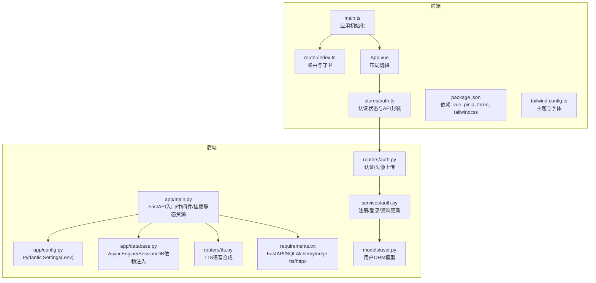
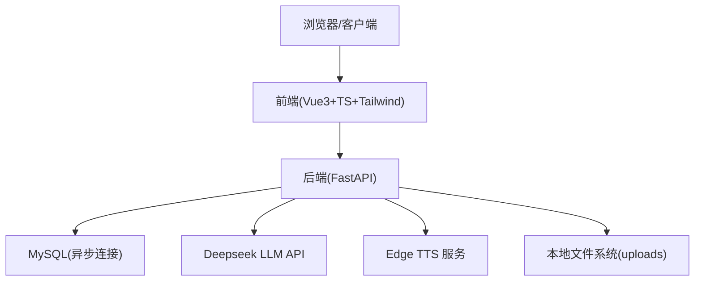
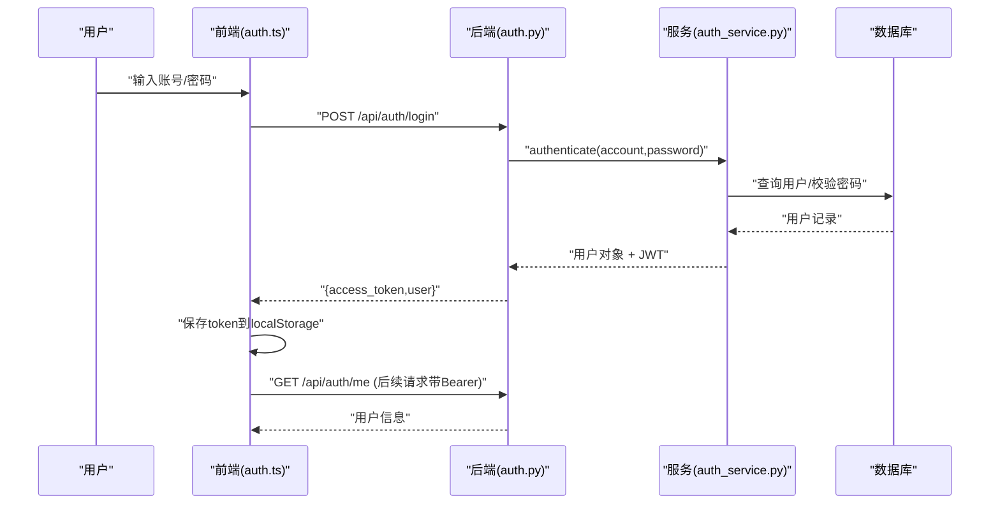
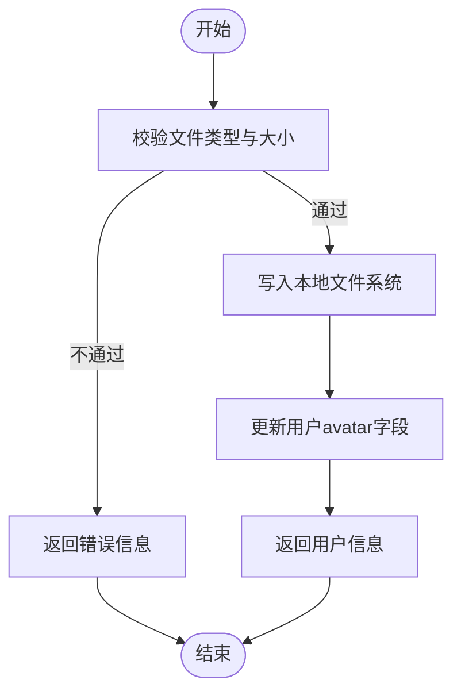
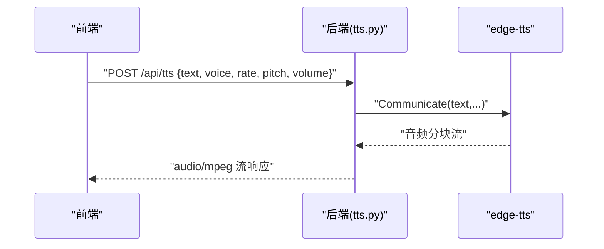
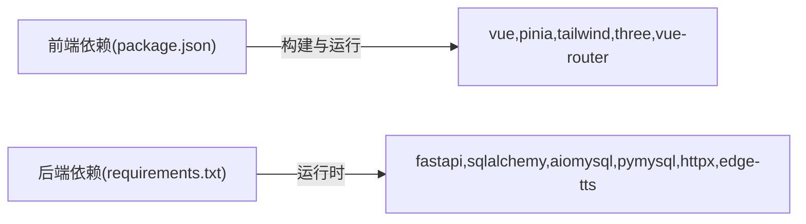

# 技术架构概览

<cite>
**本文引用的文件**
- [backEnd/app/main.py](file://backEnd/app/main.py)
- [backEnd/app/config.py](file://backEnd/app/config.py)
- [backEnd/app/database.py](file://backEnd/app/database.py)
- [backEnd/requirements.txt](file://backEnd/requirements.txt)
- [backEnd/app/routers/auth.py](file://backEnd/app/routers/auth.py)
- [backEnd/app/routers/tts.py](file://backEnd/app/routers/tts.py)
- [backEnd/app/services/auth.py](file://backEnd/app/services/auth.py)
- [backEnd/app/models/user.py](file://backEnd/app/models/user.py)
- [frontEnd/src/main.ts](file://frontEnd/src/main.ts)
- [frontEnd/src/router/index.ts](file://frontEnd/src/router/index.ts)
- [frontEnd/src/App.vue](file://frontEnd/src/App.vue)
- [frontEnd/src/stores/auth.ts](file://frontEnd/src/stores/auth.ts)
- [frontEnd/package.json](file://frontEnd/package.json)
- [frontEnd/tailwind.config.ts](file://frontEnd/tailwind.config.ts)
</cite>

## 目录
1. [简介](#简介)
2. [项目结构](#项目结构)
3. [核心组件](#核心组件)
4. [架构总览](#架构总览)
5. [详细组件分析](#详细组件分析)
6. [依赖关系分析](#依赖关系分析)
7. [性能考量](#性能考量)
8. [故障排查指南](#故障排查指南)
9. [结论](#结论)
10. [附录](#附录)

## 简介
本文件为 HR XF 系统的全面技术架构概览，面向前后端分离的现代化工程实践。系统采用前端 Vue3 + TypeScript + TailwindCSS 与后端 FastAPI + SQLAlchemy(异步) + MySQL 的技术栈，并集成 Deepseek LLM 用于 AI 对话与评分、Edge TTS 用于语音合成、Three.js + VRM 用于 3D 模型展示。文档将阐述架构设计、数据流、组件交互、状态管理、安全机制、微服务思想与模块化扩展性，并提供架构图与数据流向图，帮助读者快速理解系统全貌与关键实现路径。

## 项目结构
仓库采用前后端分离的组织方式：
- 前端 frontEnd：基于 Vite + Vue3 + TypeScript，使用 Pinia 进行状态管理，TailwindCSS 构建样式体系，Vue Router 管理路由与权限守卫，集成 Three.js 与 @pixiv/three-vrm 渲染 VRM 模型。
- 后端 backEnd：基于 FastAPI，使用 SQLAlchemy 2.0 异步 ORM 与 aiomysql/pymysql 连接 MySQL，Alembic 管理迁移；通过 Pydantic Settings 加载配置（含 .env），提供认证、简历、面试、论坛、题目、TTS 等路由与服务层。

图表来源
- [frontEnd/src/main.ts:1-19](file://frontEnd/src/main.ts#L1-L19)
- [frontEnd/src/router/index.ts:1-167](file://frontEnd/src/router/index.ts#L1-L167)
- [frontEnd/src/App.vue:1-21](file://frontEnd/src/App.vue#L1-L21)
- [frontEnd/src/stores/auth.ts:1-314](file://frontEnd/src/stores/auth.ts#L1-L314)
- [frontEnd/package.json:1-35](file://frontEnd/package.json#L1-L35)
- [frontEnd/tailwind.config.ts:1-31](file://frontEnd/tailwind.config.ts#L1-L31)
- [backEnd/app/main.py:1-90](file://backEnd/app/main.py#L1-L90)
- [backEnd/app/config.py:1-71](file://backEnd/app/config.py#L1-L71)
- [backEnd/app/database.py:1-58](file://backEnd/app/database.py#L1-L58)
- [backEnd/app/routers/auth.py:1-217](file://backEnd/app/routers/auth.py#L1-L217)
- [backEnd/app/routers/tts.py:1-63](file://backEnd/app/routers/tts.py#L1-L63)
- [backEnd/app/services/auth.py:1-174](file://backEnd/app/services/auth.py#L1-L174)
- [backEnd/app/models/user.py:1-45](file://backEnd/app/models/user.py#L1-L45)
- [backEnd/requirements.txt:1-27](file://backEnd/requirements.txt#L1-L27)

章节来源
- [frontEnd/src/main.ts:1-19](file://frontEnd/src/main.ts#L1-L19)
- [frontEnd/src/router/index.ts:1-167](file://frontEnd/src/router/index.ts#L1-L167)
- [frontEnd/src/App.vue:1-21](file://frontEnd/src/App.vue#L1-L21)
- [frontEnd/src/stores/auth.ts:1-314](file://frontEnd/src/stores/auth.ts#L1-L314)
- [frontEnd/package.json:1-35](file://frontEnd/package.json#L1-L35)
- [frontEnd/tailwind.config.ts:1-31](file://frontEnd/tailwind.config.ts#L1-L31)
- [backEnd/app/main.py:1-90](file://backEnd/app/main.py#L1-L90)
- [backEnd/app/config.py:1-71](file://backEnd/app/config.py#L1-L71)
- [backEnd/app/database.py:1-58](file://backEnd/app/database.py#L1-L58)
- [backEnd/app/routers/auth.py:1-217](file://backEnd/app/routers/auth.py#L1-L217)
- [backEnd/app/routers/tts.py:1-63](file://backEnd/app/routers/tts.py#L1-L63)
- [backEnd/app/services/auth.py:1-174](file://backEnd/app/services/auth.py#L1-L174)
- [backEnd/app/models/user.py:1-45](file://backEnd/app/models/user.py#L1-L45)
- [backEnd/requirements.txt:1-27](file://backEnd/requirements.txt#L1-L27)

## 核心组件
- 前端应用启动与状态恢复
  - main.ts 创建 Vue 应用与 Pinia，调用认证 store 的 init 方法从本地恢复 token 并校验，完成后挂载根组件。
  - App.vue 根据路由 meta.layout 动态选择 AdminLayout/DefaultLayout 或直接渲染视图。
- 路由与权限控制
  - router/index.ts 定义业务路由与元信息，beforeEach 中实现管理员与普通用户的访问控制与跳转策略。
- 认证与用户状态管理
  - stores/auth.ts 封装统一 API 请求（自动携带 Bearer Token）、登录/注册/登出、个人资料获取与更新、头像上传、账号注销等，并通过 localStorage 持久化会话。
- 后端应用生命周期与中间件
  - app/main.py 定义 lifespan 钩子，在启动时创建数据库表与种子数据，关闭时释放引擎；注册 CORS 中间件、挂载静态资源、包含各功能路由、自定义验证错误处理器与健康检查。
- 配置与数据库
  - app/config.py 使用 Pydantic Settings 从 .env 加载数据库、JWT、CORS、Deepseek API、编译器路径等配置，并提供 database_url 属性。
  - app/database.py 创建异步引擎与会话工厂，提供 get_db 依赖注入函数，并对 pymysql ping 兼容性做补丁。
- 认证路由与服务
  - routers/auth.py 暴露注册、登录、个人信息、修改用户名/邮箱/密码、注销账号、头像上传等接口，内部委托 services/auth.py 完成业务逻辑。
  - services/auth.py 实现用户查询、注册、认证、资料更新、密码修改、软删除等，使用加密工具生成/校验令牌与密码。
- 语音合成(TTS)
  - routers/tts.py 提供文本转音频接口，返回 MP3 流，并支持列出中文可用语音。
- 第三方依赖
  - requirements.txt 声明 FastAPI、SQLAlchemy(asyncio)、aiomysql/pymysql、alembic、httpx、edge-tts 等。
  - package.json 声明 Vue3、Pinia、Three.js、@pixiv/three-vrm、TailwindCSS、ECharts 等。

章节来源
- [frontEnd/src/main.ts:1-19](file://frontEnd/src/main.ts#L1-L19)
- [frontEnd/src/App.vue:1-21](file://frontEnd/src/App.vue#L1-L21)
- [frontEnd/src/router/index.ts:1-167](file://frontEnd/src/router/index.ts#L1-L167)
- [frontEnd/src/stores/auth.ts:1-314](file://frontEnd/src/stores/auth.ts#L1-L314)
- [backEnd/app/main.py:1-90](file://backEnd/app/main.py#L1-L90)
- [backEnd/app/config.py:1-71](file://backEnd/app/config.py#L1-L71)
- [backEnd/app/database.py:1-58](file://backEnd/app/database.py#L1-L58)
- [backEnd/app/routers/auth.py:1-217](file://backEnd/app/routers/auth.py#L1-L217)
- [backEnd/app/services/auth.py:1-174](file://backEnd/app/services/auth.py#L1-L174)
- [backEnd/app/routers/tts.py:1-63](file://backEnd/app/routers/tts.py#L1-L63)
- [backEnd/requirements.txt:1-27](file://backEnd/requirements.txt#L1-L27)
- [frontEnd/package.json:1-35](file://frontEnd/package.json#L1-L35)

## 架构总览
系统采用前后端分离与领域分层架构：
- 前端：Vue3 单页应用，Pinia 全局状态，TailwindCSS 原子化样式，Three.js + VRM 负责 3D 角色展示。
- 后端：FastAPI 作为 API 网关，路由层按领域划分（认证、面试、题目、论坛、TTS 等），服务层封装业务逻辑，ORM 层通过 SQLAlchemy 异步访问 MySQL。
- 外部服务：Deepseek LLM 提供 AI 对话与评分能力；Edge TTS 提供高质量中文语音合成；静态资源通过 FastAPI 挂载 uploads 目录。

图表来源
- [backEnd/app/main.py:1-90](file://backEnd/app/main.py#L1-L90)
- [backEnd/app/config.py:1-71](file://backEnd/app/config.py#L1-L71)
- [backEnd/app/database.py:1-58](file://backEnd/app/database.py#L1-L58)
- [backEnd/app/routers/tts.py:1-63](file://backEnd/app/routers/tts.py#L1-L63)
- [frontEnd/src/stores/auth.ts:1-314](file://frontEnd/src/stores/auth.ts#L1-L314)

## 详细组件分析

### 认证与安全流程
- 前端发起登录/注册请求，stores/auth.ts 统一封装 fetch 并附加 Authorization 头；成功后将 access_token 与用户信息写入 localStorage。
- 后端 routers/auth.py 接收请求，调用 services/auth.py 完成用户查找、密码校验、令牌签发；返回 TokenResponse。
- 路由守卫在 router/index.ts 中依据 requiresAuth/requiresAdmin 元信息进行访问控制。

图表来源
- [frontEnd/src/stores/auth.ts:1-314](file://frontEnd/src/stores/auth.ts#L1-L314)
- [backEnd/app/routers/auth.py:1-217](file://backEnd/app/routers/auth.py#L1-L217)
- [backEnd/app/services/auth.py:1-174](file://backEnd/app/services/auth.py#L1-L174)
- [backEnd/app/models/user.py:1-45](file://backEnd/app/models/user.py#L1-L45)

章节来源
- [frontEnd/src/stores/auth.ts:1-314](file://frontEnd/src/stores/auth.ts#L1-L314)
- [frontEnd/src/router/index.ts:1-167](file://frontEnd/src/router/index.ts#L1-L167)
- [backEnd/app/routers/auth.py:1-217](file://backEnd/app/routers/auth.py#L1-L217)
- [backEnd/app/services/auth.py:1-174](file://backEnd/app/services/auth.py#L1-L174)
- [backEnd/app/models/user.py:1-45](file://backEnd/app/models/user.py#L1-L45)

### 头像上传与静态资源
- 前端 stores/auth.ts 以 FormData 上传头像至 /api/auth/avatar，后端校验类型与大小后保存到 uploads/avatars，并更新用户记录的 avatar 字段。
- 后端 main.py 将 uploads 目录挂载为静态资源，前端可通过相对路径访问图片。

图表来源
- [backEnd/app/routers/auth.py:182-217](file://backEnd/app/routers/auth.py#L182-L217)
- [backEnd/app/main.py:70-74](file://backEnd/app/main.py#L70-L74)
- [frontEnd/src/stores/auth.ts:189-218](file://frontEnd/src/stores/auth.ts#L189-L218)

章节来源
- [backEnd/app/routers/auth.py:182-217](file://backEnd/app/routers/auth.py#L182-L217)
- [backEnd/app/main.py:70-74](file://backEnd/app/main.py#L70-L74)
- [frontEnd/src/stores/auth.ts:189-218](file://frontEnd/src/stores/auth.ts#L189-L218)

### 语音合成(TTS)
- 前端可调用 /api/tts 接口传入文本与可选参数，后端使用 edge-tts 生成 MP3 流并返回。
- 同时提供 /api/tts/voices 列出中文可用语音，便于前端选择音色。

图表来源
- [backEnd/app/routers/tts.py:1-63](file://backEnd/app/routers/tts.py#L1-L63)

章节来源
- [backEnd/app/routers/tts.py:1-63](file://backEnd/app/routers/tts.py#L1-L63)

### 3D 模型展示(Three.js + VRM)
- 前端依赖 package.json 中的 three 与 @pixiv/three-vrm，结合 public/models 下的 VRM 模型文件，可在面试或展示页面渲染 3D 面试官形象。
- 该能力由前端独立实现，与后端无直接耦合，体现前后端职责边界清晰。

章节来源
- [frontEnd/package.json:1-35](file://frontEnd/package.json#L1-L35)

### 配置与环境变量
- 后端通过 config.py 的 Settings 类集中管理数据库、JWT、CORS、Deepseek API、编译器路径等，默认读取 .env 文件。
- 提供 database_url 与 cors_origins_list 等便捷属性，供其他模块直接使用。

章节来源
- [backEnd/app/config.py:1-71](file://backEnd/app/config.py#L1-L71)

### 数据库与异步会话
- database.py 使用 create_async_engine 与 async_sessionmaker 建立异步连接池，get_db 提供请求级会话注入，确保事务提交与回滚。
- 对 pymysql ping 兼容性问题做了 monkey-patch，避免 pool_pre_ping 报错。

章节来源
- [backEnd/app/database.py:1-58](file://backEnd/app/database.py#L1-L58)

## 依赖关系分析
- 前端依赖
  - Vue3、Pinia、Vue Router、TailwindCSS、Three.js、@pixiv/three-vrm、ECharts、PDFJS、Mammoth 等。
- 后端依赖
  - FastAPI、Uvicorn、Pydantic Settings、SQLAlchemy(asyncio)、aiomysql/pymysql、Alembic、cryptography、python-jose、passlib、httpx、PyMuPDF、edge-tts。

图表来源
- [frontEnd/package.json:1-35](file://frontEnd/package.json#L1-L35)
- [backEnd/requirements.txt:1-27](file://backEnd/requirements.txt#L1-L27)

章节来源
- [frontEnd/package.json:1-35](file://frontEnd/package.json#L1-L35)
- [backEnd/requirements.txt:1-27](file://backEnd/requirements.txt#L1-L27)

## 性能考量
- 异步 I/O
  - 后端使用 SQLAlchemy 异步引擎与 httpx 异步客户端，减少阻塞，提升并发处理能力。
- 连接池与预检
  - 数据库连接池配置了 pool_size 与 max_overflow，并启用 pool_pre_ping 保障连接健康。
- 流式传输
  - TTS 与可能的 LLM 流式响应采用 StreamingResponse 与 SSE 模式，降低首字节延迟。
- 静态资源
  - 通过 StaticFiles 挂载本地 uploads，避免额外存储开销，适合开发与小规模部署。
- 前端渲染
  - Three.js 场景按需加载与 VRM 模型优化可减少初始包体与渲染压力。

[本节为通用指导，无需具体文件引用]

## 故障排查指南
- 认证失败
  - 检查前端是否携带正确的 Authorization 头；确认后端 CORS 允许源；查看路由守卫是否正确跳转。
- 数据库连接异常
  - 核对 .env 中数据库配置；确认 pymysql/aiomysql 版本兼容；关注 do_ping 补丁是否生效。
- 文件上传失败
  - 校验 Content-Type 与文件大小限制；确认 uploads 目录存在且可写；检查静态资源挂载路径。
- TTS 无法生成语音
  - 检查网络连通性与 edge-tts 可用性；确认文本长度与参数格式；查看日志输出。
- 验证错误处理
  - 后端已自定义 RequestValidationError 处理器，避免二进制内容导致解码异常；前端统一捕获 detail 字段提示。

章节来源
- [backEnd/app/main.py:76-84](file://backEnd/app/main.py#L76-L84)
- [backEnd/app/database.py:10-25](file://backEnd/app/database.py#L10-L25)
- [backEnd/app/routers/auth.py:182-217](file://backEnd/app/routers/auth.py#L182-L217)
- [backEnd/app/routers/tts.py:1-63](file://backEnd/app/routers/tts.py#L1-L63)
- [frontEnd/src/stores/auth.ts:37-61](file://frontEnd/src/stores/auth.ts#L37-L61)

## 结论
HR XF 系统采用前后端分离与领域分层架构，前端以 Vue3 + TS + TailwindCSS 构建高效交互界面，后端以 FastAPI + SQLAlchemy 异步 ORM 提供高并发 API，并通过 Alembic 管理数据库演进。系统集成 Deepseek LLM 与 Edge TTS，增强 AI 面试与语音体验；Three.js + VRM 提供沉浸式 3D 展示。整体设计强调模块化与可扩展性，清晰的职责边界与良好的错误处理机制保障了系统的稳定性与可维护性。

[本节为总结性内容，无需具体文件引用]

## 附录
- 技术选型对比与优势
  - 前端
    - Vue3 + TS：类型安全与生态成熟，配合 Pinia 简化状态管理；TailwindCSS 提高样式开发效率。
    - Three.js + VRM：原生 Web 3D 能力，VRM 标准模型便于跨平台复用。
  - 后端
    - FastAPI：高性能异步框架，自动生成 OpenAPI 文档，易于扩展。
    - SQLAlchemy 2.0 异步：统一的 ORM 抽象，支持异步 I/O，提升吞吐。
    - MySQL：稳定可靠的关系型数据库，适合结构化数据存储。
    - Edge TTS：高质量中文语音，免服务端复杂部署。
    - Deepseek LLM：灵活的对话与评分能力，通过 HTTP 接口集成。
  - 替代方案权衡
    - 若需更强实时通信，可考虑 WebSocket 或 Server-Sent Events 的更广泛使用。
    - 若文件规模增长，可引入对象存储（如 MinIO）替代本地文件系统。
    - 若需要更强的多语言执行环境，可评估沙箱隔离与容器化方案。

[本节为概念性内容，无需具体文件引用]