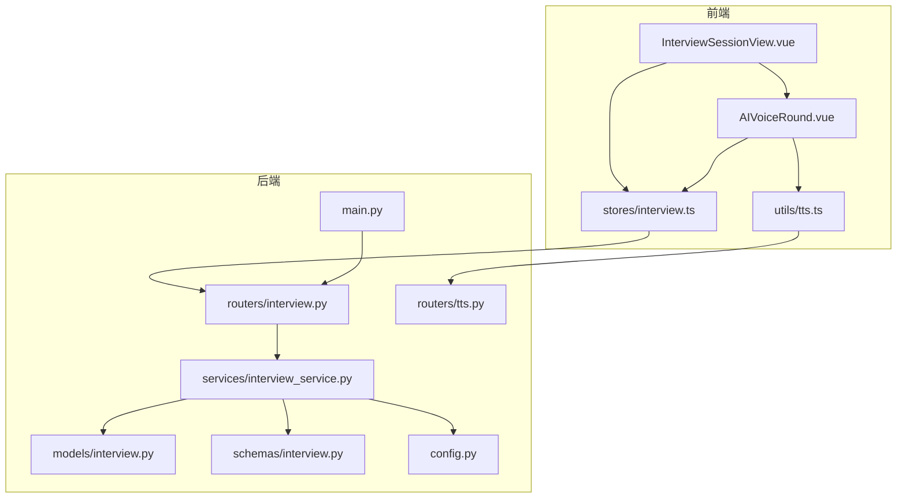
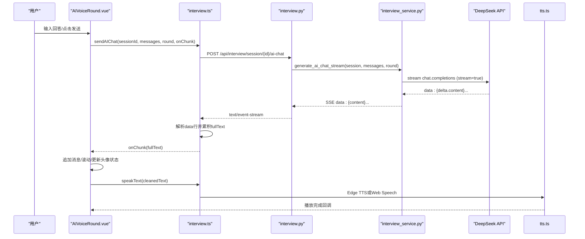
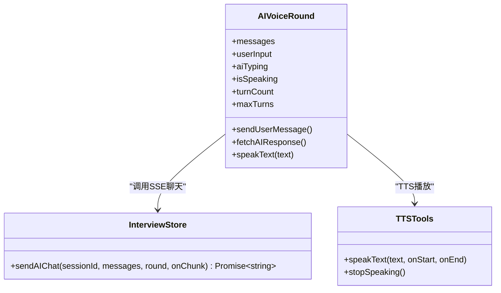
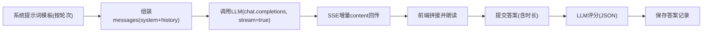
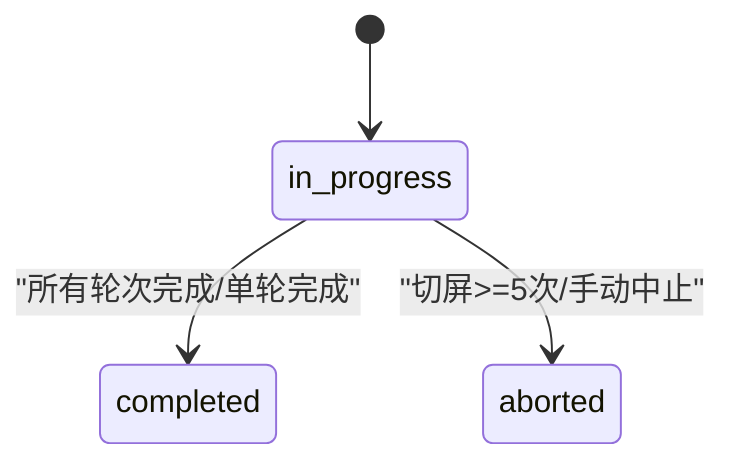
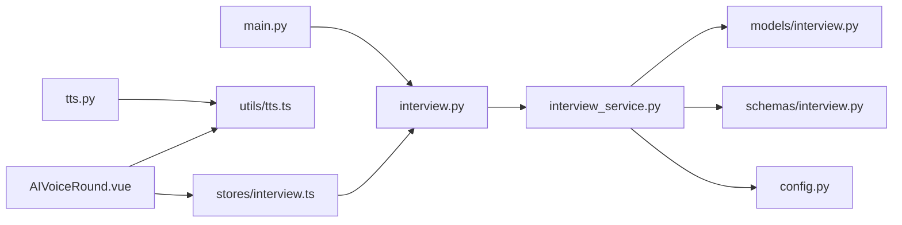

# AI智能对话流程

<cite>
**本文引用的文件**
- [backEnd/app/main.py](file://backEnd/app/main.py)
- [backEnd/app/routers/interview.py](file://backEnd/app/routers/interview.py)
- [backEnd/app/services/interview_service.py](file://backEnd/app/services/interview_service.py)
- [backEnd/app/models/interview.py](file://backEnd/app/models/interview.py)
- [backEnd/app/schemas/interview.py](file://backEnd/app/schemas/interview.py)
- [backEnd/app/config.py](file://backEnd/app/config.py)
- [backEnd/app/routers/tts.py](file://backEnd/app/routers/tts.py)
- [frontEnd/src/stores/interview.ts](file://frontEnd/src/stores/interview.ts)
- [frontEnd/src/components/interview/AIVoiceRound.vue](file://frontEnd/src/components/interview/AIVoiceRound.vue)
- [frontEnd/src/views/InterviewSessionView.vue](file://frontEnd/src/views/InterviewSessionView.vue)
- [frontEnd/src/utils/tts.ts](file://frontEnd/src/utils/tts.ts)
</cite>

## 目录
1. [简介](#简介)
2. [项目结构](#项目结构)
3. [核心组件](#核心组件)
4. [架构总览](#架构总览)
5. [详细组件分析](#详细组件分析)
6. [依赖关系分析](#依赖关系分析)
7. [性能与可靠性](#性能与可靠性)
8. [故障排查指南](#故障排查指南)
9. [结论](#结论)
10. [附录：API与数据模型](#附录api与数据模型)

## 简介
本文件面向“AI智能对话流程”的功能文档，聚焦于基于大语言模型的AI面试官实现。内容涵盖多轮对话管理、上下文保持、动态问题生成、SSE流式响应、对话状态管理、消息格式定义、错误处理与重试机制、前端语音面试界面与TTS集成、Prompt工程设计与AI模型集成方案等。目标是帮助开发者快速理解并扩展该能力。

## 项目结构
后端采用FastAPI分层架构：路由层负责HTTP接口与鉴权；服务层封装业务逻辑（会话、题目、评分、报告、AI对话）；模型与Schema定义数据库结构与请求/响应契约；配置集中管理环境变量。前端使用Vue 3 + Pinia，提供面试主视图与各轮次子组件，其中AI语音面试组件负责SSE消费、ASR/TTS控制与数字人交互。



图表来源
- [backEnd/app/main.py:44-68](file://backEnd/app/main.py#L44-L68)
- [backEnd/app/routers/interview.py:26-26](file://backEnd/app/routers/interview.py#L26-L26)
- [backEnd/app/services/interview_service.py:29-29](file://backEnd/app/services/interview_service.py#L29-L29)
- [frontEnd/src/views/InterviewSessionView.vue:292-300](file://frontEnd/src/views/InterviewSessionView.vue#L292-L300)
- [frontEnd/src/components/interview/AIVoiceRound.vue:143-148](file://frontEnd/src/components/interview/AIVoiceRound.vue#L143-L148)
- [frontEnd/src/stores/interview.ts:103-124](file://frontEnd/src/stores/interview.ts#L103-L124)
- [frontEnd/src/utils/tts.ts:7-7](file://frontEnd/src/utils/tts.ts#L7-L7)

章节来源
- [backEnd/app/main.py:44-68](file://backEnd/app/main.py#L44-L68)
- [backEnd/app/routers/interview.py:26-26](file://backEnd/app/routers/interview.py#L26-L26)
- [backEnd/app/services/interview_service.py:29-29](file://backEnd/app/services/interview_service.py#L29-L29)
- [frontEnd/src/views/InterviewSessionView.vue:292-300](file://frontEnd/src/views/InterviewSessionView.vue#L292-L300)
- [frontEnd/src/components/interview/AIVoiceRound.vue:143-148](file://frontEnd/src/components/interview/AIVoiceRound.vue#L143-L148)
- [frontEnd/src/stores/interview.ts:103-124](file://frontEnd/src/stores/interview.ts#L103-L124)
- [frontEnd/src/utils/tts.ts:7-7](file://frontEnd/src/utils/tts.ts#L7-L7)

## 核心组件
- 面试会话与会话推进：支持全流程与单轮模式，维护当前轮次、状态、切屏计数、目标轮次等。
- 题库与评分：测评题、业务面题、技术题（复用OJ），AI开放题由LLM评分。
- AI对话（SSE）：后端以SSE流式转发LLM增量token，前端实时拼接并朗读。
- TTS语音合成：优先Edge TTS高质量中文语音，失败降级到浏览器Web Speech API。
- 防作弊与录制：可选全屏保护、切屏检测、摄像头悬浮窗与本地录制。

章节来源
- [backEnd/app/models/interview.py:19-57](file://backEnd/app/models/interview.py#L19-L57)
- [backEnd/app/services/interview_service.py:489-511](file://backEnd/app/services/interview_service.py#L489-L511)
- [backEnd/app/services/interview_service.py:851-872](file://backEnd/app/services/interview_service.py#L851-L872)
- [backEnd/app/services/interview_service.py:797-845](file://backEnd/app/services/interview_service.py#L797-L845)
- [backEnd/app/routers/tts.py:27-50](file://backEnd/app/routers/tts.py#L27-L50)
- [frontEnd/src/utils/tts.ts:151-167](file://frontEnd/src/utils/tts.ts#L151-L167)
- [frontEnd/src/views/InterviewSessionView.vue:372-491](file://frontEnd/src/views/InterviewSessionView.vue#L372-L491)

## 架构总览
AI面试端到端时序如下：用户在前端发起AI对话请求，Store通过fetch建立SSE连接，后端路由校验会话后调用服务层生成AI回复流，服务层以httpx流式调用大模型，将增量content回写为SSE事件，前端逐块渲染并触发TTS播放。



图表来源
- [backEnd/app/routers/interview.py:161-189](file://backEnd/app/routers/interview.py#L161-L189)
- [backEnd/app/services/interview_service.py:797-845](file://backEnd/app/services/interview_service.py#L797-L845)
- [frontEnd/src/stores/interview.ts:209-253](file://frontEnd/src/stores/interview.ts#L209-L253)
- [frontEnd/src/components/interview/AIVoiceRound.vue:312-358](file://frontEnd/src/components/interview/AIVoiceRound.vue#L312-L358)
- [frontEnd/src/utils/tts.ts:151-167](file://frontEnd/src/utils/tts.ts#L151-L167)

## 详细组件分析

### 后端：AI对话与SSE流式响应
- 路由层
  - 校验会话存在且进行中，构造异步事件生成器，返回text/event-stream，设置缓存与连接头。
- 服务层
  - 根据轮次选择系统提示词模板，组装messages，调用大模型chat.completions并开启stream。
  - 按行读取SSE，过滤非data行，解析JSON，提取delta.content，逐块yield。
  - 遇到[DONE]终止流。
- 错误处理
  - 网络异常、JSON解析异常均跳过或中断，保证流稳定。

```mermaid
flowchart TD
Start(["进入 ai_chat 路由"]) --> CheckSession["校验会话与权限"]
CheckSession --> |通过| BuildGen["构建事件生成器<br/>generate_ai_chat_stream(...)"]
BuildGen --> CallLLM["httpx.stream POST chat.completions(stream=true)"]
CallLLM --> ReadLine{"读取一行"}
ReadLine --> |data: ...| ParseJSON["解析JSON并取delta.content"]
ParseJSON --> HasContent{"有content?"}
HasContent --> |是| YieldChunk["yield SSE chunk"]
HasContent --> |否| ReadLine
YieldChunk --> ReadLine
ReadLine --> |data: [DONE]| End(["结束流"])
ReadLine --> |其他行| ReadLine
```

图表来源
- [backEnd/app/routers/interview.py:161-189](file://backEnd/app/routers/interview.py#L161-L189)
- [backEnd/app/services/interview_service.py:797-845](file://backEnd/app/services/interview_service.py#L797-L845)

章节来源
- [backEnd/app/routers/interview.py:161-189](file://backEnd/app/routers/interview.py#L161-L189)
- [backEnd/app/services/interview_service.py:797-845](file://backEnd/app/services/interview_service.py#L797-L845)

### 前端：AI语音面试组件与SSE消费
- AIVoiceRound.vue
  - 维护消息列表、打字态、说话态、录音态、轮次计数与最大轮次。
  - 发送用户消息后提交答案（含时长），然后调用store.sendAIChat获取流式回复。
  - 对AI回复进行“去舞台指示”清洗，追加消息，自动滚动，触发TTS朗读。
  - 数字人头像状态随对话阶段变化（思考、满意、追问）。
- stores/interview.ts
  - sendAIChat使用fetch+ReadableStream，逐行解析SSE，累积完整文本并通过onChunk回调实时更新UI。
- utils/tts.ts
  - 优先Edge TTS（后端MP3流），失败降级到Web Speech API，内置声线预热与最佳中文声线选择。



图表来源
- [frontEnd/src/components/interview/AIVoiceRound.vue:143-358](file://frontEnd/src/components/interview/AIVoiceRound.vue#L143-L358)
- [frontEnd/src/stores/interview.ts:209-253](file://frontEnd/src/stores/interview.ts#L209-L253)
- [frontEnd/src/utils/tts.ts:151-167](file://frontEnd/src/utils/tts.ts#L151-L167)

章节来源
- [frontEnd/src/components/interview/AIVoiceRound.vue:143-358](file://frontEnd/src/components/interview/AIVoiceRound.vue#L143-L358)
- [frontEnd/src/stores/interview.ts:209-253](file://frontEnd/src/stores/interview.ts#L209-L253)
- [frontEnd/src/utils/tts.ts:151-167](file://frontEnd/src/utils/tts.ts#L151-L167)

### Prompt工程与动态问题生成
- 系统提示词模板
  - 三面与四面分别定义了不同的角色、重点方向、规则与约束（如禁止括号动作描述、限定轮次、岗位信息注入）。
- 首问生成
  - 根据岗位标题与类别格式化首问，作为open_ended类型题目返回给前端。
- 评分Prompt
  - 针对AI面试回答，要求LLM以JSON形式返回分数与反馈，便于结构化解析。
- 建议与分析生成
  - 综合各维度得分与轮次详情，调用LLM生成改进建议与综合分析段落。



图表来源
- [backEnd/app/services/interview_service.py:415-456](file://backEnd/app/services/interview_service.py#L415-L456)
- [backEnd/app/services/interview_service.py:606-621](file://backEnd/app/services/interview_service.py#L606-L621)
- [backEnd/app/services/interview_service.py:743-791](file://backEnd/app/services/interview_service.py#L743-L791)
- [backEnd/app/services/interview_service.py:1034-1106](file://backEnd/app/services/interview_service.py#L1034-L1106)
- [backEnd/app/services/interview_service.py:1108-1167](file://backEnd/app/services/interview_service.py#L1108-L1167)

章节来源
- [backEnd/app/services/interview_service.py:415-456](file://backEnd/app/services/interview_service.py#L415-L456)
- [backEnd/app/services/interview_service.py:606-621](file://backEnd/app/services/interview_service.py#L606-L621)
- [backEnd/app/services/interview_service.py:743-791](file://backEnd/app/services/interview_service.py#L743-L791)
- [backEnd/app/services/interview_service.py:1034-1106](file://backEnd/app/services/interview_service.py#L1034-L1106)
- [backEnd/app/services/interview_service.py:1108-1167](file://backEnd/app/services/interview_service.py#L1108-L1167)

### 对话状态管理与轮次推进
- 会话模型包含当前轮次、状态、切屏计数、模式与目标轮次等字段。
- 轮次推进逻辑：
  - 单轮模式：完成后直接标记completed。
  - 全流程模式：按预置顺序推进至下一轮，全部完成后标记completed。
- 报告生成：答题数≥3时自动生成多维评分报告并持久化。



图表来源
- [backEnd/app/models/interview.py:19-57](file://backEnd/app/models/interview.py#L19-L57)
- [backEnd/app/services/interview_service.py:851-872](file://backEnd/app/services/interview_service.py#L851-L872)
- [backEnd/app/services/interview_service.py:879-886](file://backEnd/app/services/interview_service.py#L879-L886)
- [backEnd/app/services/interview_service.py:893-1019](file://backEnd/app/services/interview_service.py#L893-L1019)

章节来源
- [backEnd/app/models/interview.py:19-57](file://backEnd/app/models/interview.py#L19-L57)
- [backEnd/app/services/interview_service.py:851-872](file://backEnd/app/services/interview_service.py#L851-L872)
- [backEnd/app/services/interview_service.py:879-886](file://backEnd/app/services/interview_service.py#L879-L886)
- [backEnd/app/services/interview_service.py:893-1019](file://backEnd/app/services/interview_service.py#L893-L1019)

### 前端组件使用示例（AI语音面试）
- 在面试主视图中，当current_round为ai_voice_3或ai_voice_4时渲染AIVoiceRound组件，并传入questions、sessionId与round。
- 组件内部：
  - 初始化时显示首问并自动朗读。
  - 用户输入或语音识别结果作为回答，提交答案后进入下一轮对话。
  - 达到最大轮次后展示完成卡片，可进入下一轮或查看报告。
- TTS控制：
  - 支持重新朗读、模型切换（VRM数字人）、停止播放。
- ASR支持：
  - 使用浏览器SpeechRecognition进行实时转写，兼容性与降级提示完善。

章节来源
- [frontEnd/src/views/InterviewSessionView.vue:278-286](file://frontEnd/src/views/InterviewSessionView.vue#L278-L286)
- [frontEnd/src/components/interview/AIVoiceRound.vue:362-378](file://frontEnd/src/components/interview/AIVoiceRound.vue#L362-L378)
- [frontEnd/src/components/interview/AIVoiceRound.vue:223-271](file://frontEnd/src/components/interview/AIVoiceRound.vue#L223-L271)
- [frontEnd/src/components/interview/AIVoiceRound.vue:205-219](file://frontEnd/src/components/interview/AIVoiceRound.vue#L205-L219)

## 依赖关系分析
- 后端
  - FastAPI应用注册路由与中间件，启动时创建表并初始化种子数据。
  - interview路由依赖interview_service，后者依赖数据库模型与配置。
  - TTS路由独立提供音频合成能力。
- 前端
  - Store统一封装API调用，包括SSE消费。
  - AIVoiceRound依赖Store与TTS工具，同时与数字人组件协作。



图表来源
- [backEnd/app/main.py:44-68](file://backEnd/app/main.py#L44-L68)
- [backEnd/app/routers/interview.py:26-26](file://backEnd/app/routers/interview.py#L26-L26)
- [backEnd/app/services/interview_service.py:29-29](file://backEnd/app/services/interview_service.py#L29-L29)
- [backEnd/app/routers/tts.py:10-10](file://backEnd/app/routers/tts.py#L10-L10)
- [frontEnd/src/stores/interview.ts:103-124](file://frontEnd/src/stores/interview.ts#L103-L124)
- [frontEnd/src/components/interview/AIVoiceRound.vue:143-148](file://frontEnd/src/components/interview/AIVoiceRound.vue#L143-L148)

章节来源
- [backEnd/app/main.py:44-68](file://backEnd/app/main.py#L44-L68)
- [backEnd/app/routers/interview.py:26-26](file://backEnd/app/routers/interview.py#L26-L26)
- [backEnd/app/services/interview_service.py:29-29](file://backEnd/app/services/interview_service.py#L29-L29)
- [backEnd/app/routers/tts.py:10-10](file://backEnd/app/routers/tts.py#L10-L10)
- [frontEnd/src/stores/interview.ts:103-124](file://frontEnd/src/stores/interview.ts#L103-L124)
- [frontEnd/src/components/interview/AIVoiceRound.vue:143-148](file://frontEnd/src/components/interview/AIVoiceRound.vue#L143-L148)

## 性能与可靠性
- 流式传输
  - 后端以httpx.stream方式拉取LLM增量，避免整段等待，降低首字延迟。
  - 前端边收边渲染，提升用户体验。
- 超时与重试
  - LLM调用设置较长超时（SSE场景），TTS与常规API使用合理超时。
  - 建议在关键路径增加指数退避重试（例如网络抖动、LLM限流），当前代码未显式实现，可在Store层补充。
- 资源释放
  - 组件卸载时停止录音与TTS，避免后台任务泄漏。
- 并发与连接
  - SSE需确保代理不缓冲（已设置相关头部），生产环境建议Nginx关闭缓冲并启用keep-alive。

[本节为通用指导，无需具体文件引用]

## 故障排查指南
- SSE无响应或中断
  - 检查后端日志中httpx.stream是否抛出异常；确认代理未缓冲SSE。
  - 前端reader循环是否正确处理空行与[DONE]。
- TTS无声
  - 确认Edge TTS后端可达；若不可用，应自动降级到Web Speech API。
  - 检查浏览器是否允许自动播放与媒体权限。
- 语音识别不可用
  - 浏览器不支持SpeechRecognition时给出提示，引导使用文字输入。
- 会话状态异常
  - 检查会话是否存在且处于in_progress；注意切屏次数阈值导致的中止。

章节来源
- [backEnd/app/routers/interview.py:161-189](file://backEnd/app/routers/interview.py#L161-L189)
- [frontEnd/src/stores/interview.ts:209-253](file://frontEnd/src/stores/interview.ts#L209-L253)
- [frontEnd/src/utils/tts.ts:151-167](file://frontEnd/src/utils/tts.ts#L151-L167)
- [frontEnd/src/components/interview/AIVoiceRound.vue:223-271](file://frontEnd/src/components/interview/AIVoiceRound.vue#L223-L271)
- [backEnd/app/services/interview_service.py:879-886](file://backEnd/app/services/interview_service.py#L879-L886)

## 结论
本方案通过SSE流式响应实现了低延迟的AI面试体验，结合Prompt工程与多维度评分，形成完整的AI面试官闭环。前后端职责清晰，易于扩展更多轮次与题型。后续可引入更稳健的重试策略、离线容错与更丰富的数字人交互。

[本节为总结性内容，无需具体文件引用]

## 附录：API与数据模型

### 关键API定义（节选）
- 开始面试
  - POST /api/interview/start
  - 请求体：{ job_category, job_title, interview_mode, target_round }
  - 响应：会话对象（含进度）
- 获取题目
  - GET /api/interview/session/{session_id}/question
  - 响应：{ round, questions[] }
- 提交答案
  - POST /api/interview/session/{session_id}/answer
  - 请求体：{ question_id, answer, duration_seconds }
  - 响应：{ correct, score, feedback, correct_answer }
- AI对话（SSE）
  - POST /api/interview/session/{session_id}/ai-chat
  - 请求体：{ messages[], round }
  - 响应：text/event-stream，每行形如 data: {"content":"..."} 或 data: [DONE]
- 进入下一轮
  - POST /api/interview/session/{session_id}/next
- 上报切屏
  - POST /api/interview/session/{session_id}/cheat
- 中止面试
  - POST /api/interview/session/{session_id}/abort
- 获取报告
  - GET /api/interview/session/{session_id}/report
- 历史记录
  - GET /api/interview/history

章节来源
- [backEnd/app/routers/interview.py:36-317](file://backEnd/app/routers/interview.py#L36-L317)
- [backEnd/app/schemas/interview.py:27-152](file://backEnd/app/schemas/interview.py#L27-L152)

### 数据模型（节选）
- InterviewSession：会话主键、用户ID、岗位信息、当前轮次、状态、切屏计数、模式、目标轮次、总分、报告JSON、时间戳。
- InterviewQuestion：分类、岗位类别、题型、题目内容JSON、标准答案JSON、难度。
- InterviewAnswer：关联会话、题目ID、轮次、答案文本、分数、反馈、用时、创建时间。

章节来源
- [backEnd/app/models/interview.py:19-114](file://backEnd/app/models/interview.py#L19-L114)

### 配置项（节选）
- DeepSeek API：key、base_url、model
- CORS：允许的源列表
- 数据库连接：MySQL异步/同步URL

章节来源
- [backEnd/app/config.py:34-37](file://backEnd/app/config.py#L34-L37)
- [backEnd/app/config.py:31-32](file://backEnd/app/config.py#L31-L32)
- [backEnd/app/config.py:47-61](file://backEnd/app/config.py#L47-L61)