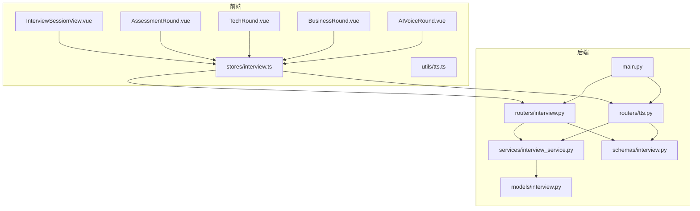
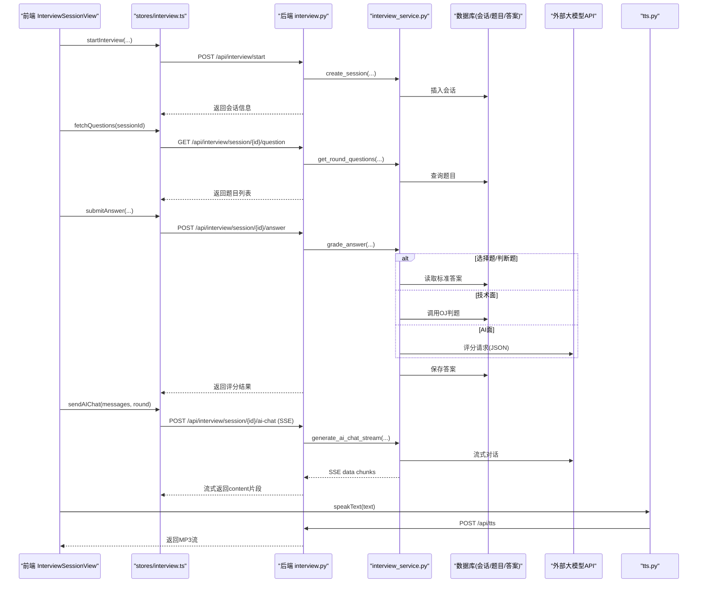
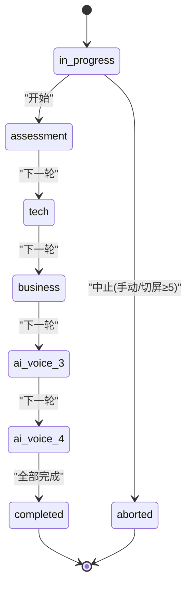
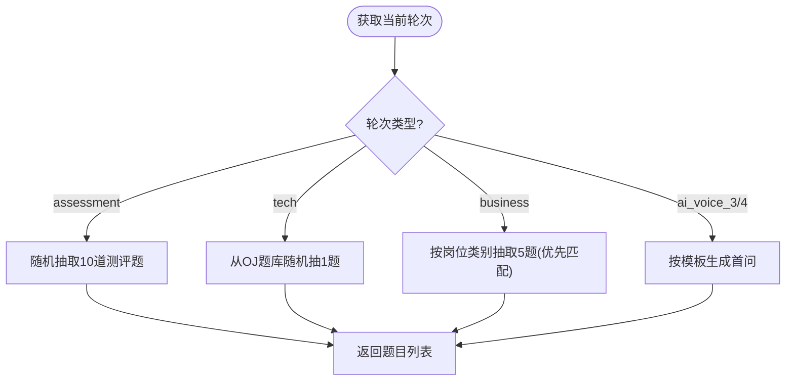
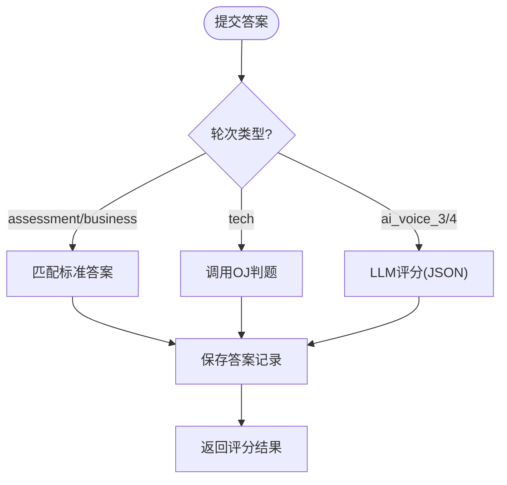
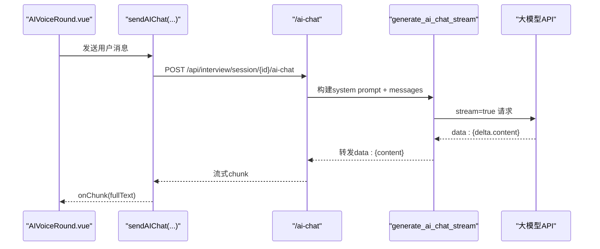
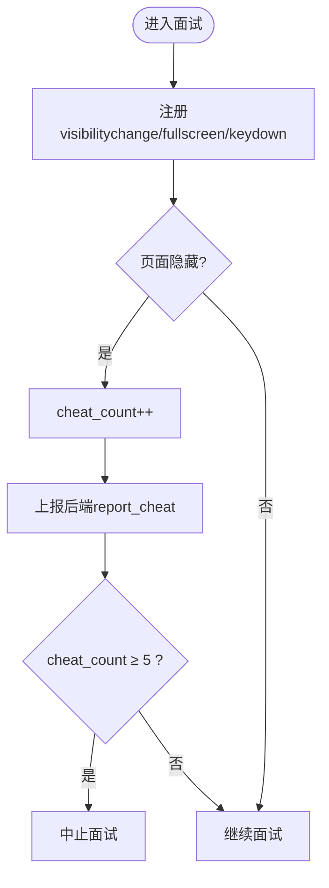
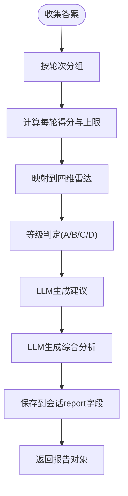
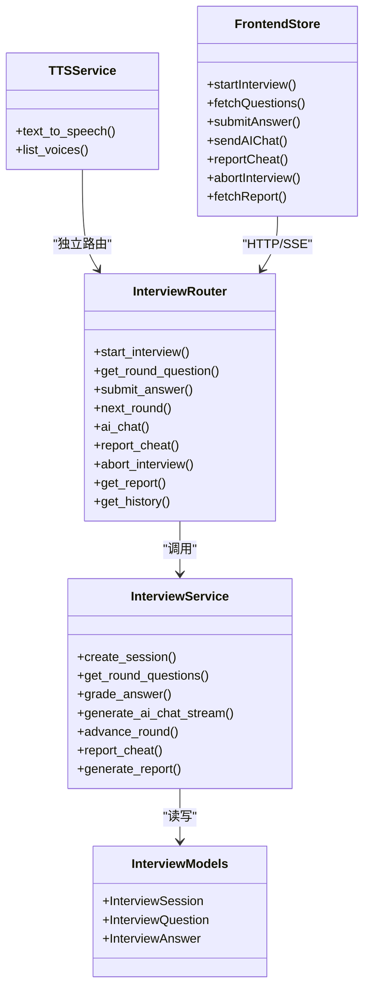

# AI面试模拟系统

<cite>
**本文引用的文件**   
- [backEnd/app/main.py](file://backEnd/app/main.py)
- [backEnd/app/models/interview.py](file://backEnd/app/models/interview.py)
- [backEnd/app/routers/interview.py](file://backEnd/app/routers/interview.py)
- [backEnd/app/services/interview_service.py](file://backEnd/app/services/interview_service.py)
- [backEnd/app/schemas/interview.py](file://backEnd/app/schemas/interview.py)
- [backEnd/app/routers/tts.py](file://backEnd/app/routers/tts.py)
- [frontEnd/src/stores/interview.ts](file://frontEnd/src/stores/interview.ts)
- [frontEnd/src/views/InterviewSessionView.vue](file://frontEnd/src/views/InterviewSessionView.vue)
- [frontEnd/src/components/interview/AssessmentRound.vue](file://frontEnd/src/components/interview/AssessmentRound.vue)
- [frontEnd/src/components/interview/TechRound.vue](file://frontEnd/src/components/interview/TechRound.vue)
- [frontEnd/src/components/interview/BusinessRound.vue](file://frontEnd/src/components/interview/BusinessRound.vue)
- [frontEnd/src/components/interview/AIVoiceRound.vue](file://frontEnd/src/components/interview/AIVoiceRound.vue)
- [frontEnd/src/utils/tts.ts](file://frontEnd/src/utils/tts.ts)
</cite>

## 目录
1. [简介](#简介)
2. [项目结构](#项目结构)
3. [核心组件](#核心组件)
4. [架构总览](#架构总览)
5. [详细组件分析](#详细组件分析)
6. [依赖关系分析](#依赖关系分析)
7. [性能与可扩展性](#性能与可扩展性)
8. [故障排查指南](#故障排查指南)
9. [结论](#结论)
10. [附录：API与前端使用示例](#附录api与前端使用示例)

## 简介
本系统为AI驱动的面试模拟平台，支持多轮次面试流程（综合素质测评、技术能力面试、业务能力面试、AI语音面试等），提供会话管理、题目生成算法、实时评分机制、AI对话流式处理、切屏防作弊、报告自动生成等功能。后端基于FastAPI+SQLAlchemy异步ORM，前端采用Vue3+Pinia，集成TTS语音合成与Web Speech API，实现沉浸式AI面试官体验。

## 项目结构
- 后端
  - 路由层：按业务域划分（认证、帖子、题库、职业测评、简历、面试、管理员、TTS）
  - 服务层：封装业务逻辑（面试流程、评分、报告、AI对话、种子数据初始化）
  - 模型层：定义数据库表结构（面试会话、题目、答案）
  - 配置与启动：应用生命周期、CORS、静态资源挂载、健康检查
- 前端
  - 视图层：面试主流程页面、报告页、历史页等
  - 组件层：各轮次答题组件（测评、技术面、业务面、AI语音）、进度条、数字人头像
  - 状态管理：面试会话、题目、AI对话、报告、历史记录
  - 工具：TTS语音合成封装（Edge TTS优先，浏览器降级）

图表来源
- [backEnd/app/main.py:44-68](file://backEnd/app/main.py#L44-L68)
- [backEnd/app/routers/interview.py:26-26](file://backEnd/app/routers/interview.py#L26-L26)
- [backEnd/app/routers/tts.py:10-10](file://backEnd/app/routers/tts.py#L10-L10)
- [backEnd/app/services/interview_service.py:35-41](file://backEnd/app/services/interview_service.py#L35-L41)
- [backEnd/app/schemas/interview.py:27-46](file://backEnd/app/schemas/interview.py#L27-L46)
- [backEnd/app/models/interview.py:19-56](file://backEnd/app/models/interview.py#L19-L56)
- [frontEnd/src/views/InterviewSessionView.vue:292-300](file://frontEnd/src/views/InterviewSessionView.vue#L292-L300)
- [frontEnd/src/stores/interview.ts:128-136](file://frontEnd/src/stores/interview.ts#L128-L136)
- [frontEnd/src/utils/tts.ts:151-167](file://frontEnd/src/utils/tts.ts#L151-L167)

章节来源
- [backEnd/app/main.py:44-68](file://backEnd/app/main.py#L44-L68)
- [backEnd/app/routers/interview.py:26-26](file://backEnd/app/routers/interview.py#L26-L26)
- [backEnd/app/routers/tts.py:10-10](file://backEnd/app/routers/tts.py#L10-L10)
- [backEnd/app/services/interview_service.py:35-41](file://backEnd/app/services/interview_service.py#L35-L41)
- [backEnd/app/schemas/interview.py:27-46](file://backEnd/app/schemas/interview.py#L27-L46)
- [backEnd/app/models/interview.py:19-56](file://backEnd/app/models/interview.py#L19-L56)
- [frontEnd/src/views/InterviewSessionView.vue:292-300](file://frontEnd/src/views/InterviewSessionView.vue#L292-L300)
- [frontEnd/src/stores/interview.ts:128-136](file://frontEnd/src/stores/interview.ts#L128-L136)
- [frontEnd/src/utils/tts.ts:151-167](file://frontEnd/src/utils/tts.ts#L151-L167)

## 核心组件
- 面试会话与会题答模型
  - InterviewSession：记录用户、岗位、轮次、模式、状态、作弊次数、总分、报告JSON、时间戳
  - InterviewQuestion：题目分类、题型、内容、标准答案、难度
  - InterviewAnswer：关联会话、题目、轮次、答案文本、分数、反馈、用时
- 面试服务
  - 轮次定义与推进（全流程/单轮）
  - 题目生成（测评随机抽取、技术面从OJ题库抽取、业务面按岗位类别抽取、AI面首问模板）
  - 评分策略（选择题/判断题直接匹配；技术面复用判题；AI面调用LLM评分）
  - AI对话流式（SSE转发LLM流式响应）
  - 报告生成（维度聚合、等级判定、建议与分析生成）
- 前端组件
  - AssessmentRound：选择题计时、提交、结果汇总
  - TechRound：编程题展示、调试运行、提交代码、结果反馈
  - BusinessRound：判断/选择混合题型、计时与结果汇总
  - AIVoiceRound：AI对话、ASR语音输入、TTS朗读、数字人表情联动
  - InterviewSessionView：会话编排、轮次切换、防作弊、摄像头录制、报告入口

章节来源
- [backEnd/app/models/interview.py:19-114](file://backEnd/app/models/interview.py#L19-L114)
- [backEnd/app/services/interview_service.py:35-41](file://backEnd/app/services/interview_service.py#L35-L41)
- [backEnd/app/services/interview_service.py:536-621](file://backEnd/app/services/interview_service.py#L536-L621)
- [backEnd/app/services/interview_service.py:628-741](file://backEnd/app/services/interview_service.py#L628-L741)
- [backEnd/app/services/interview_service.py:797-845](file://backEnd/app/services/interview_service.py#L797-L845)
- [backEnd/app/services/interview_service.py:893-1019](file://backEnd/app/services/interview_service.py#L893-L1019)
- [frontEnd/src/components/interview/AssessmentRound.vue:97-227](file://frontEnd/src/components/interview/AssessmentRound.vue#L97-L227)
- [frontEnd/src/components/interview/TechRound.vue:232-427](file://frontEnd/src/components/interview/TechRound.vue#L232-L427)
- [frontEnd/src/components/interview/BusinessRound.vue:126-258](file://frontEnd/src/components/interview/BusinessRound.vue#L126-L258)
- [frontEnd/src/components/interview/AIVoiceRound.vue:143-385](file://frontEnd/src/components/interview/AIVoiceRound.vue#L143-L385)
- [frontEnd/src/views/InterviewSessionView.vue:292-729](file://frontEnd/src/views/InterviewSessionView.vue#L292-L729)

## 架构总览
系统采用前后端分离架构，前端通过REST与SSE接口与后端交互，后端以服务层为核心编排业务逻辑，并持久化到数据库。AI能力通过HTTP调用外部大模型服务，TTS由独立路由提供音频流。

图表来源
- [backEnd/app/routers/interview.py:36-58](file://backEnd/app/routers/interview.py#L36-L58)
- [backEnd/app/routers/interview.py:85-99](file://backEnd/app/routers/interview.py#L85-L99)
- [backEnd/app/routers/interview.py:102-119](file://backEnd/app/routers/interview.py#L102-L119)
- [backEnd/app/routers/interview.py:161-189](file://backEnd/app/routers/interview.py#L161-L189)
- [backEnd/app/services/interview_service.py:489-511](file://backEnd/app/services/interview_service.py#L489-L511)
- [backEnd/app/services/interview_service.py:536-621](file://backEnd/app/services/interview_service.py#L536-L621)
- [backEnd/app/services/interview_service.py:628-741](file://backEnd/app/services/interview_service.py#L628-L741)
- [backEnd/app/services/interview_service.py:797-845](file://backEnd/app/services/interview_service.py#L797-L845)
- [backEnd/app/routers/tts.py:27-50](file://backEnd/app/routers/tts.py#L27-L50)
- [frontEnd/src/stores/interview.ts:149-171](file://frontEnd/src/stores/interview.ts#L149-L171)
- [frontEnd/src/stores/interview.ts:209-253](file://frontEnd/src/stores/interview.ts#L209-L253)
- [frontEnd/src/utils/tts.ts:151-167](file://frontEnd/src/utils/tts.ts#L151-L167)

## 详细组件分析

### 面试会话与状态机
- 会话字段包含岗位、轮次、模式（全流程/单轮）、目标轮次、状态、作弊计数、总分、报告JSON、时间戳
- 轮次顺序：assessment → tech → business → ai_voice_3 → ai_voice_4
- 推进逻辑：单轮模式完成后直接结束；全流程模式按顺序推进至完成
- 中止逻辑：手动中止或切屏≥5次自动中止，均可能触发报告生成（答题数≥3）

图表来源
- [backEnd/app/models/interview.py:19-56](file://backEnd/app/models/interview.py#L19-L56)
- [backEnd/app/services/interview_service.py:35-41](file://backEnd/app/services/interview_service.py#L35-L41)
- [backEnd/app/services/interview_service.py:851-872](file://backEnd/app/services/interview_service.py#L851-L872)
- [backEnd/app/services/interview_service.py:879-886](file://backEnd/app/services/interview_service.py#L879-L886)

章节来源
- [backEnd/app/models/interview.py:19-56](file://backEnd/app/models/interview.py#L19-L56)
- [backEnd/app/services/interview_service.py:35-41](file://backEnd/app/services/interview_service.py#L35-L41)
- [backEnd/app/services/interview_service.py:851-872](file://backEnd/app/services/interview_service.py#L851-L872)
- [backEnd/app/services/interview_service.py:879-886](file://backEnd/app/services/interview_service.py#L879-L886)

### 题目生成算法
- 综合素质测评：从固定题库中随机抽取10道选择题，每题限时30秒
- 技术面：从OJ题库随机抽取一道编程题，附带样例、限制、提示，限时约15分钟
- 业务能力面：优先按岗位类别抽取，不足时补充通用题，共5题，每题限时60秒
- AI语音面试：根据轮次模板生成首问，后续通过LLM流式对话推进

图表来源
- [backEnd/app/services/interview_service.py:536-621](file://backEnd/app/services/interview_service.py#L536-L621)

章节来源
- [backEnd/app/services/interview_service.py:536-621](file://backEnd/app/services/interview_service.py#L536-L621)

### 实时评分机制
- 选择题/判断题：比对标准答案，正确得满分，错误0分，附加解释反馈
- 技术面：复用OJ判题服务，根据状态判定得分（通过/部分通过/编译错误）
- AI面：构造Prompt调用LLM进行评分，解析JSON返回分数与建议
- 所有答案均持久化，含用时、反馈、轮次标记

图表来源
- [backEnd/app/services/interview_service.py:628-741](file://backEnd/app/services/interview_service.py#L628-L741)

章节来源
- [backEnd/app/services/interview_service.py:628-741](file://backEnd/app/services/interview_service.py#L628-L741)

### AI对话流式处理
- 前端通过SSE接收LLM增量内容，逐块拼接显示
- 后端将LLM的SSE事件转换为统一格式转发
- 结合TTS模块，朗读AI回复，驱动数字人表情变化

图表来源
- [backEnd/app/routers/interview.py:161-189](file://backEnd/app/routers/interview.py#L161-L189)
- [backEnd/app/services/interview_service.py:797-845](file://backEnd/app/services/interview_service.py#L797-L845)
- [frontEnd/src/stores/interview.ts:209-253](file://frontEnd/src/stores/interview.ts#L209-L253)
- [frontEnd/src/components/interview/AIVoiceRound.vue:312-358](file://frontEnd/src/components/interview/AIVoiceRound.vue#L312-L358)

章节来源
- [backEnd/app/routers/interview.py:161-189](file://backEnd/app/routers/interview.py#L161-L189)
- [backEnd/app/services/interview_service.py:797-845](file://backEnd/app/services/interview_service.py#L797-L845)
- [frontEnd/src/stores/interview.ts:209-253](file://frontEnd/src/stores/interview.ts#L209-L253)
- [frontEnd/src/components/interview/AIVoiceRound.vue:312-358](file://frontEnd/src/components/interview/AIVoiceRound.vue#L312-L358)

### 切屏检测与防作弊机制
- 监听visibilitychange，检测到切屏则上报作弊计数
- 可选全屏保护（强制全屏、拦截ESC、键盘锁定），退出全屏弹出确认
- 作弊计数≥5自动中止面试，并尝试生成报告（答题数≥3）
- 前端提供摄像头悬浮窗与本地录制（不上传），辅助监考

图表来源
- [frontEnd/src/views/InterviewSessionView.vue:380-424](file://frontEnd/src/views/InterviewSessionView.vue#L380-L424)
- [backEnd/app/routers/interview.py:192-216](file://backEnd/app/routers/interview.py#L192-L216)
- [backEnd/app/services/interview_service.py:879-886](file://backEnd/app/services/interview_service.py#L879-L886)

章节来源
- [frontEnd/src/views/InterviewSessionView.vue:380-424](file://frontEnd/src/views/InterviewSessionView.vue#L380-L424)
- [backEnd/app/routers/interview.py:192-216](file://backEnd/app/routers/interview.py#L192-L216)
- [backEnd/app/services/interview_service.py:879-886](file://backEnd/app/services/interview_service.py#L879-L886)

### 面试报告自动生成
- 收集所有答案并按轮次分组，计算每轮得分与上限
- 映射到四维雷达图（专业能力、逻辑思维、沟通表达、岗位匹配度）
- 综合等级判定（A/B/C/D），生成改进建议与综合分析（LLM）
- 报告持久化到会话JSON字段，供前端展示

图表来源
- [backEnd/app/services/interview_service.py:893-1019](file://backEnd/app/services/interview_service.py#L893-L1019)
- [backEnd/app/services/interview_service.py:1034-1105](file://backEnd/app/services/interview_service.py#L1034-L1105)
- [backEnd/app/services/interview_service.py:1108-1167](file://backEnd/app/services/interview_service.py#L1108-L1167)

章节来源
- [backEnd/app/services/interview_service.py:893-1019](file://backEnd/app/services/interview_service.py#L893-L1019)
- [backEnd/app/services/interview_service.py:1034-1105](file://backEnd/app/services/interview_service.py#L1034-L1105)
- [backEnd/app/services/interview_service.py:1108-1167](file://backEnd/app/services/interview_service.py#L1108-L1167)

### 前端组件使用方式
- AssessmentRound
  - 属性：questions、sessionId
  - 事件：roundComplete
  - 行为：倒计时、选项选择、提交答案、结果汇总
- TechRound
  - 属性：questions、sessionId
  - 事件：roundComplete
  - 行为：题目展示、调试运行、提交代码、结果反馈
- BusinessRound
  - 属性：questions、sessionId
  - 事件：roundComplete
  - 行为：判断/选择混合题型、计时、结果汇总
- AIVoiceRound
  - 属性：questions、sessionId、round
  - 事件：roundComplete
  - 行为：AI对话、ASR语音输入、TTS朗读、数字人表情联动
- InterviewSessionView
  - 职责：会话加载、轮次渲染、防作弊、摄像头录制、报告入口

章节来源
- [frontEnd/src/components/interview/AssessmentRound.vue:97-227](file://frontEnd/src/components/interview/AssessmentRound.vue#L97-L227)
- [frontEnd/src/components/interview/TechRound.vue:232-427](file://frontEnd/src/components/interview/TechRound.vue#L232-L427)
- [frontEnd/src/components/interview/BusinessRound.vue:126-258](file://frontEnd/src/components/interview/BusinessRound.vue#L126-L258)
- [frontEnd/src/components/interview/AIVoiceRound.vue:143-385](file://frontEnd/src/components/interview/AIVoiceRound.vue#L143-L385)
- [frontEnd/src/views/InterviewSessionView.vue:292-729](file://frontEnd/src/views/InterviewSessionView.vue#L292-L729)

## 依赖关系分析
- 路由与服务耦合
  - interview.py路由依赖interview_service.py的业务方法
  - tts.py路由独立，提供TTS音频流
- 服务与模型
  - interview_service.py操作InterviewSession/Question/Answer模型
- 前端与后端
  - stores/interview.ts封装API调用，组件通过store访问状态与方法
  - utils/tts.ts封装TTS调用，AIVoiceRound组件使用

图表来源
- [backEnd/app/routers/interview.py:36-317](file://backEnd/app/routers/interview.py#L36-L317)
- [backEnd/app/services/interview_service.py:489-1202](file://backEnd/app/services/interview_service.py#L489-L1202)
- [backEnd/app/models/interview.py:19-114](file://backEnd/app/models/interview.py#L19-L114)
- [backEnd/app/routers/tts.py:27-63](file://backEnd/app/routers/tts.py#L27-L63)
- [frontEnd/src/stores/interview.ts:149-313](file://frontEnd/src/stores/interview.ts#L149-L313)

章节来源
- [backEnd/app/routers/interview.py:36-317](file://backEnd/app/routers/interview.py#L36-L317)
- [backEnd/app/services/interview_service.py:489-1202](file://backEnd/app/services/interview_service.py#L489-L1202)
- [backEnd/app/models/interview.py:19-114](file://backEnd/app/models/interview.py#L19-L114)
- [backEnd/app/routers/tts.py:27-63](file://backEnd/app/routers/tts.py#L27-L63)
- [frontEnd/src/stores/interview.ts:149-313](file://frontEnd/src/stores/interview.ts#L149-L313)

## 性能与可扩展性
- 并发与流式
  - AI对话使用SSE流式传输，降低首字延迟，提升用户体验
  - 后端使用httpx异步客户端与大模型交互，避免阻塞
- 数据库
  - 使用异步ORM，减少IO等待
  - 索引优化：会话user_id、status、题目category/job_category等
- 扩展点
  - 轮次可配置（ROUNDS数组），便于新增面试环节
  - 题目库支持按岗位类别扩展
  - TTS支持多声线，可按角色定制音色

[本节为通用指导，无需具体文件引用]

## 故障排查指南
- 验证错误处理
  - 自定义RequestValidationError处理器，避免二进制内容导致解码异常
- 常见错误
  - 会话不存在：检查session_id与用户权限
  - 面试已结束：确保状态为in_progress再提交答案或获取题目
  - AI对话失败：检查网络与LLM服务可用性，前端有降级提示
  - TTS不可用：自动降级到浏览器内置语音
- 定位步骤
  - 查看后端日志与异常堆栈
  - 检查前端控制台错误与网络请求状态码
  - 核对数据库记录（会话、答案、报告）

章节来源
- [backEnd/app/main.py:76-84](file://backEnd/app/main.py#L76-L84)
- [backEnd/app/routers/interview.py:61-82](file://backEnd/app/routers/interview.py#L61-L82)
- [backEnd/app/routers/interview.py:85-99](file://backEnd/app/routers/interview.py#L85-L99)
- [backEnd/app/routers/interview.py:102-119](file://backEnd/app/routers/interview.py#L102-L119)
- [frontEnd/src/stores/interview.ts:113-124](file://frontEnd/src/stores/interview.ts#L113-L124)
- [frontEnd/src/utils/tts.ts:151-167](file://frontEnd/src/utils/tts.ts#L151-L167)

## 结论
本系统实现了完整的AI面试模拟流程，涵盖多轮次设计、智能题目生成、实时评分、AI对话流式处理、防作弊与报告生成。前后端协作清晰，模块化良好，具备较强的可扩展性与用户体验。建议在后续迭代中增强题库规模、引入更精细的评分模型与可视化报告，同时完善监控与告警体系。

[本节为总结，无需具体文件引用]

## 附录：API与前端使用示例

### 后端API定义（节选）
- 岗位列表
  - GET /api/interview/jobs
- 开始面试
  - POST /api/interview/start
  - 请求体：{ job_category, job_title, interview_mode="full"/"single", target_round? }
  - 响应：InterviewSessionResponse
- 获取会话状态
  - GET /api/interview/session/{session_id}
- 获取当前轮次题目
  - GET /api/interview/session/{session_id}/question
- 提交答案
  - POST /api/interview/session/{session_id}/answer
  - 请求体：{ question_id, answer, duration_seconds }
  - 响应：AnswerResponse
- 进入下一轮
  - POST /api/interview/session/{session_id}/next
- AI对话（SSE）
  - POST /api/interview/session/{session_id}/ai-chat
  - 请求体：{ messages:[{role,content}], round:"ai_voice_3"/"ai_voice_4" }
  - 响应：SSE data: {content}
- 上报切屏
  - POST /api/interview/session/{session_id}/cheat
  - 请求体：{ cheat_count }
- 中止面试
  - POST /api/interview/session/{session_id}/abort
- 获取报告
  - GET /api/interview/session/{session_id}/report
- 历史记录
  - GET /api/interview/history

章节来源
- [backEnd/app/routers/interview.py:29-317](file://backEnd/app/routers/interview.py#L29-L317)
- [backEnd/app/schemas/interview.py:27-152](file://backEnd/app/schemas/interview.py#L27-L152)

### 前端使用示例（节选）
- 创建会话
  - store.startInterview(jobCategory, jobTitle, interviewMode, targetRound)
- 获取题目
  - store.fetchQuestions(sessionId)
- 提交答案
  - store.submitAnswer(sessionId, questionId, answer, durationSeconds)
- AI对话
  - store.sendAIChat(sessionId, messages, round, onChunk)
- 上报切屏
  - store.reportCheat(sessionId, cheatCount)
- 中止面试
  - store.abortInterview(sessionId)
- 获取报告
  - store.fetchReport(sessionId)

章节来源
- [frontEnd/src/stores/interview.ts:149-313](file://frontEnd/src/stores/interview.ts#L149-L313)