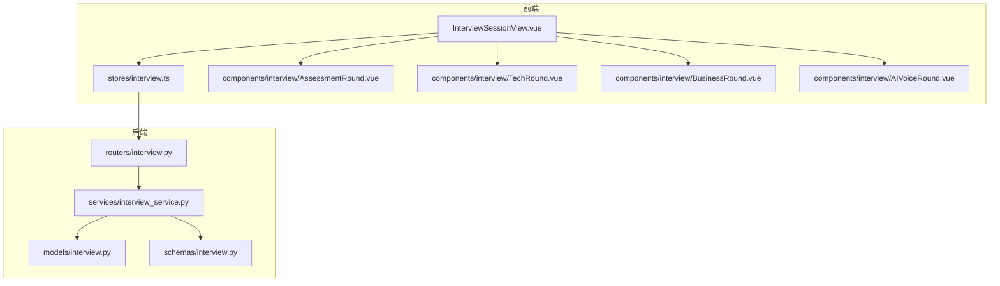
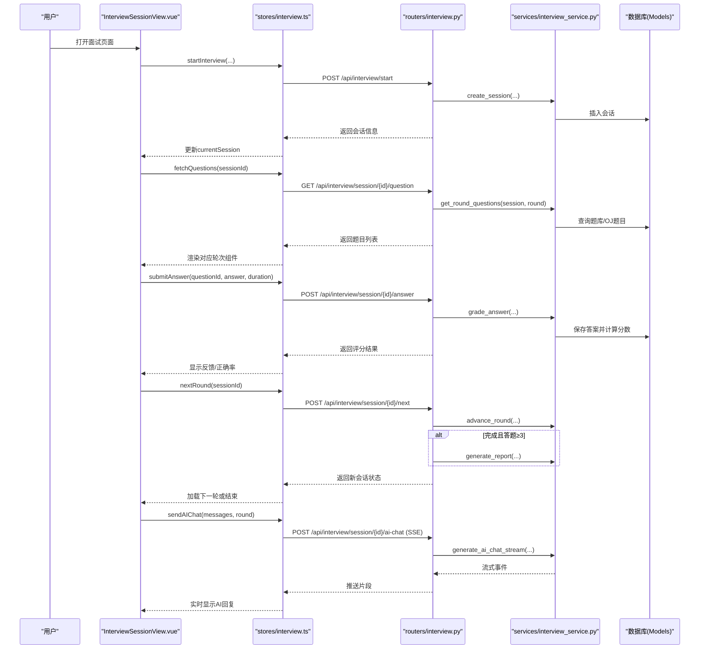
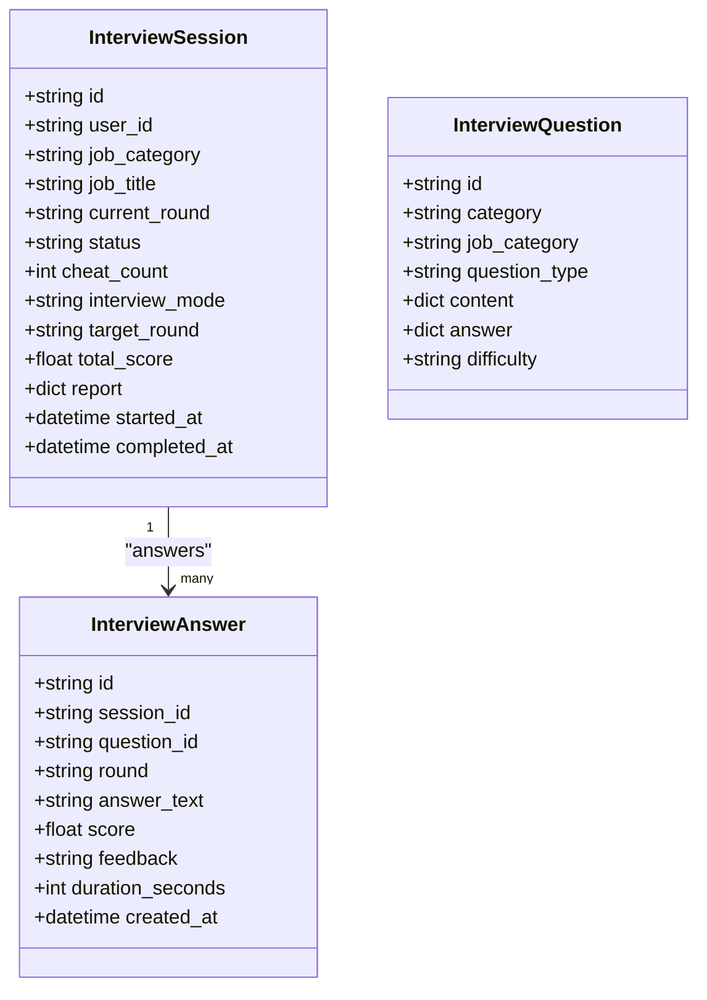
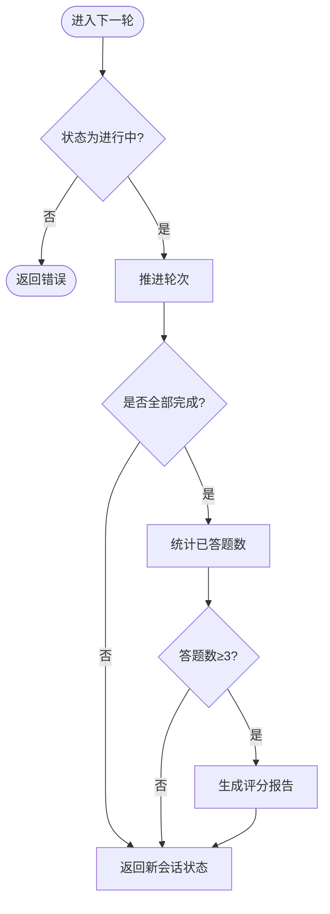
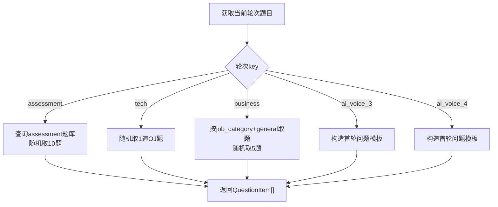
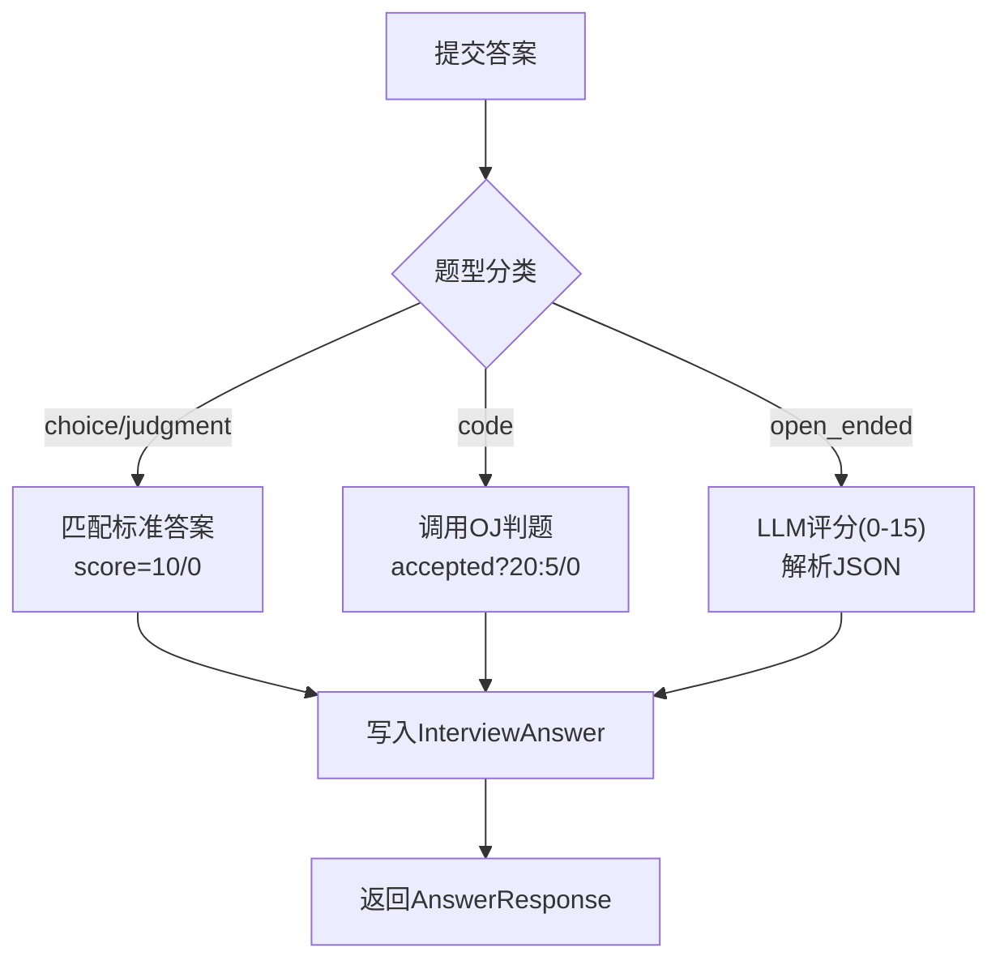
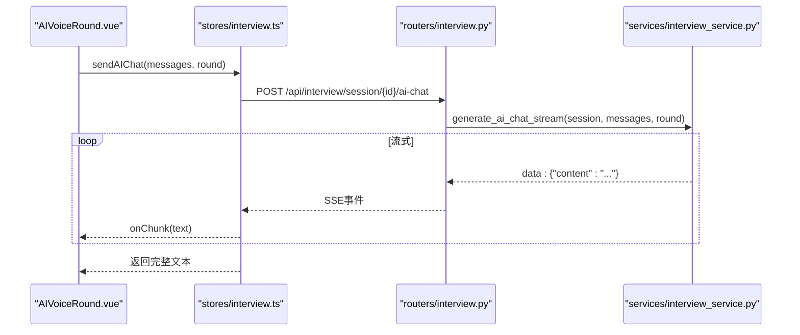
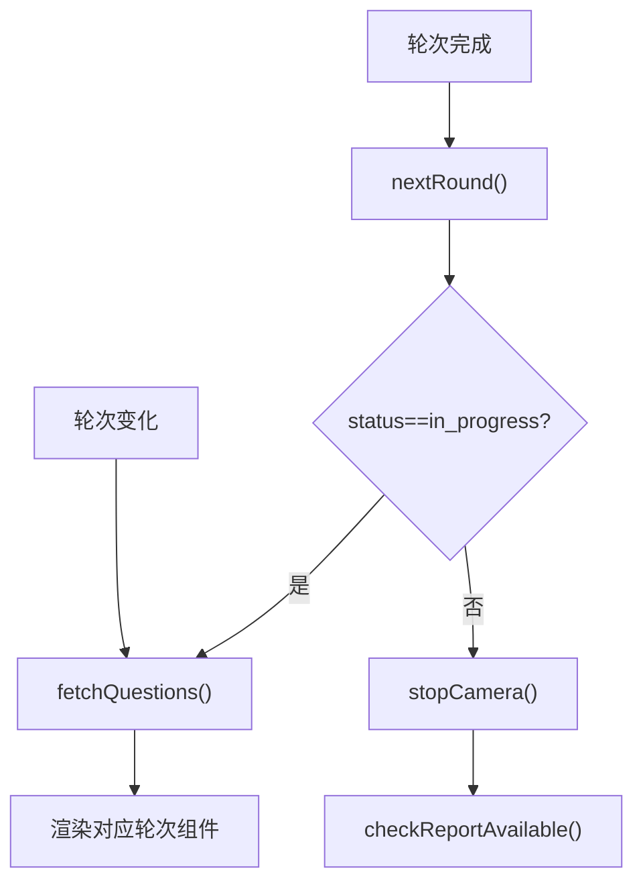
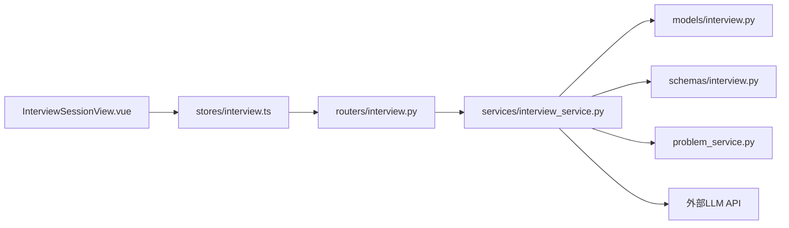

# 多轮次面试系统

<cite>
**本文引用的文件**   
- [backEnd/app/models/interview.py](file://backEnd/app/models/interview.py)
- [backEnd/app/routers/interview.py](file://backEnd/app/routers/interview.py)
- [backEnd/app/services/interview_service.py](file://backEnd/app/services/interview_service.py)
- [backEnd/app/schemas/interview.py](file://backEnd/app/schemas/interview.py)
- [frontEnd/src/stores/interview.ts](file://frontEnd/src/stores/interview.ts)
- [frontEnd/src/views/InterviewSessionView.vue](file://frontEnd/src/views/InterviewSessionView.vue)
- [frontEnd/src/components/interview/AssessmentRound.vue](file://frontEnd/src/components/interview/AssessmentRound.vue)
- [frontEnd/src/components/interview/TechRound.vue](file://frontEnd/src/components/interview/TechRound.vue)
- [frontEnd/src/components/interview/BusinessRound.vue](file://frontEnd/src/components/interview/BusinessRound.vue)
- [frontEnd/src/components/interview/AIVoiceRound.vue](file://frontEnd/src/components/interview/AIVoiceRound.vue)
- [frontEnd/src/router/index.ts](file://frontEnd/src/router/index.ts)
</cite>

## 目录
1. [简介](#简介)
2. [项目结构](#项目结构)
3. [核心组件](#核心组件)
4. [架构总览](#架构总览)
5. [详细组件分析](#详细组件分析)
6. [依赖关系分析](#依赖关系分析)
7. [性能与可扩展性](#性能与可扩展性)
8. [故障排查指南](#故障排查指南)
9. [结论](#结论)
10. [附录：API 定义与使用示例](#附录api-定义与使用示例)

## 简介
本技术文档面向“多轮次面试系统”，覆盖后端数据模型、服务逻辑、路由接口，以及前端轮次组件、状态同步与一致性保障。重点说明以下能力：
- 轮次类型与业务规则：综合素质测评、技术面、业务面、AI三面、AI四面
- 轮次切换与题目分发机制
- 答题时间控制与切屏防作弊
- 评分标准与报告生成
- 前端各轮次组件的使用方式与交互流程
- 前后端状态同步与数据一致性保证

## 项目结构
系统采用前后端分离架构：
- 后端（FastAPI + SQLAlchemy）：提供面试会话管理、题库分发、答案提交与评分、AI对话流式返回、报告生成等能力
- 前端（Vue3 + Pinia）：实现轮次渲染、计时器、代码调试、语音识别与TTS、摄像头录制、全屏保护与切屏检测

图表来源
- [frontEnd/src/views/InterviewSessionView.vue:1-729](file://frontEnd/src/views/InterviewSessionView.vue#L1-L729)
- [frontEnd/src/stores/interview.ts:1-313](file://frontEnd/src/stores/interview.ts#L1-L313)
- [backEnd/app/routers/interview.py:1-317](file://backEnd/app/routers/interview.py#L1-L317)
- [backEnd/app/services/interview_service.py:1-800](file://backEnd/app/services/interview_service.py#L1-L800)
- [backEnd/app/models/interview.py:1-114](file://backEnd/app/models/interview.py#L1-L114)
- [backEnd/app/schemas/interview.py:1-152](file://backEnd/app/schemas/interview.py#L1-L152)

章节来源
- [frontEnd/src/router/index.ts:73-83](file://frontEnd/src/router/index.ts#L73-L83)
- [frontEnd/src/views/InterviewSessionView.vue:292-330](file://frontEnd/src/views/InterviewSessionView.vue#L292-L330)

## 核心组件
- 面试会话与会题答模型
  - InterviewSession：记录用户、岗位、当前轮次、状态、作弊次数、模式（全流程/单轮）、总分与报告等
  - InterviewQuestion：题库项，支持选择题、判断题、编程题、开放题
  - InterviewAnswer：每道题的作答记录，含得分、反馈、用时
- 服务层
  - 轮次定义与进度构建
  - 题目获取策略（按轮次分类抽取）
  - 答案评分（选择/判断直接匹配；技术面复用OJ判题；AI面调用LLM评分）
  - AI对话SSE流式输出
  - 报告生成（满足答题数阈值后）
- 前端
  - Store封装API调用与状态管理
  - 视图负责轮次调度、防作弊、摄像头录制、报告入口
  - 各轮次组件分别处理题型交互、计时、提交与结果展示

章节来源
- [backEnd/app/models/interview.py:19-114](file://backEnd/app/models/interview.py#L19-L114)
- [backEnd/app/services/interview_service.py:35-67](file://backEnd/app/services/interview_service.py#L35-L67)
- [backEnd/app/services/interview_service.py:536-622](file://backEnd/app/services/interview_service.py#L536-L622)
- [backEnd/app/services/interview_service.py:628-741](file://backEnd/app/services/interview_service.py#L628-L741)
- [frontEnd/src/stores/interview.ts:128-313](file://frontEnd/src/stores/interview.ts#L128-L313)
- [frontEnd/src/views/InterviewSessionView.vue:252-286](file://frontEnd/src/views/InterviewSessionView.vue#L252-L286)

## 架构总览
下图展示了从前端到后端的完整请求链路，包括开始面试、获取题目、提交答案、进入下一轮、AI对话与报告生成。

图表来源
- [frontEnd/src/views/InterviewSessionView.vue:503-530](file://frontEnd/src/views/InterviewSessionView.vue#L503-L530)
- [frontEnd/src/stores/interview.ts:149-207](file://frontEnd/src/stores/interview.ts#L149-L207)
- [backEnd/app/routers/interview.py:36-158](file://backEnd/app/routers/interview.py#L36-L158)
- [backEnd/app/services/interview_service.py:489-530](file://backEnd/app/services/interview_service.py#L489-L530)
- [backEnd/app/services/interview_service.py:536-622](file://backEnd/app/services/interview_service.py#L536-L622)
- [backEnd/app/services/interview_service.py:628-741](file://backEnd/app/services/interview_service.py#L628-L741)
- [backEnd/app/routers/interview.py:161-189](file://backEnd/app/routers/interview.py#L161-L189)

## 详细组件分析

### 数据结构与模型
- 会话模型包含轮次、状态、作弊计数、模式与报告字段，用于驱动前端进度条与报告入口
- 题目模型以JSON存储内容与答案，便于扩展不同题型
- 答案模型关联会话与题目，记录得分与反馈，支撑报告聚合

图表来源
- [backEnd/app/models/interview.py:19-114](file://backEnd/app/models/interview.py#L19-L114)

章节来源
- [backEnd/app/models/interview.py:19-114](file://backEnd/app/models/interview.py#L19-L114)

### 轮次定义与切换逻辑
- 轮次常量定义了五类轮次：assessment、tech、business、ai_voice_3、ai_voice_4
- 全流程模式下，根据当前轮次标记已完成/进行中/未开始；单轮模式仅显示目标轮次
- 进入下一轮时，若达到完成状态且答题数≥3，则生成报告

图表来源
- [backEnd/app/services/interview_service.py:35-67](file://backEnd/app/services/interview_service.py#L35-L67)
- [backEnd/app/routers/interview.py:122-158](file://backEnd/app/routers/interview.py#L122-L158)

章节来源
- [backEnd/app/services/interview_service.py:35-67](file://backEnd/app/services/interview_service.py#L35-L67)
- [backEnd/app/routers/interview.py:122-158](file://backEnd/app/routers/interview.py#L122-L158)

### 题目分发机制
- 综合素质测评：随机抽取10道选择题，每题限时30秒
- 技术面：从OJ题库随机抽取一道编程题，限时900秒，复用判题服务
- 业务面：优先岗位类别题目，不足则补充通用题，共5道，每题限时60秒
- AI三面/四面：构造首问提示，题型为开放题，限时120秒

图表来源
- [backEnd/app/services/interview_service.py:536-622](file://backEnd/app/services/interview_service.py#L536-L622)

章节来源
- [backEnd/app/services/interview_service.py:536-622](file://backEnd/app/services/interview_service.py#L536-L622)

### 评分标准与答案处理
- 选择/判断题：与标准答案比对，正确得10分，错误0分，附带解释
- 技术面：通过OJ判题，Accepted得20分，非编译错误但失败得5分，编译错误0分
- AI面：调用外部LLM进行评分（0-15分），解析JSON返回score与feedback
- 所有答案均持久化至InterviewAnswer表，记录时长与反馈

图表来源
- [backEnd/app/services/interview_service.py:628-741](file://backEnd/app/services/interview_service.py#L628-L741)

章节来源
- [backEnd/app/services/interview_service.py:628-741](file://backEnd/app/services/interview_service.py#L628-L741)

### AI对话与流式响应
- 前端通过SSE接收AI回复片段，逐步拼接并朗读
- 后端以StreamingResponse返回text/event-stream，逐块推送content
- 三轮/四轮AI面试分别配置不同的面试官人设与提问方向

图表来源
- [backEnd/app/routers/interview.py:161-189](file://backEnd/app/routers/interview.py#L161-L189)
- [frontEnd/src/stores/interview.ts:209-253](file://frontEnd/src/stores/interview.ts#L209-L253)
- [frontEnd/src/components/interview/AIVoiceRound.vue:312-358](file://frontEnd/src/components/interview/AIVoiceRound.vue#L312-L358)

章节来源
- [backEnd/app/routers/interview.py:161-189](file://backEnd/app/routers/interview.py#L161-L189)
- [frontEnd/src/stores/interview.ts:209-253](file://frontEnd/src/stores/interview.ts#L209-L253)
- [frontEnd/src/components/interview/AIVoiceRound.vue:312-358](file://frontEnd/src/components/interview/AIVoiceRound.vue#L312-L358)

### 前端轮次组件使用示例
- AssessmentRound（综合素质测评）
  - 输入：questions数组、sessionId
  - 行为：倒计时30秒/题，自动提交超时答案，累计得分，完成后触发roundComplete
  - 参考路径：[AssessmentRound.vue:1-227](file://frontEnd/src/components/interview/AssessmentRound.vue#L1-L227)
- TechRound（技术面）
  - 输入：questions数组、sessionId
  - 行为：左侧题目描述+样例，右侧代码编辑器，支持调试运行与提交，限时900秒
  - 参考路径：[TechRound.vue:1-427](file://frontEnd/src/components/interview/TechRound.vue#L1-L427)
- BusinessRound（业务面）
  - 输入：questions数组、sessionId
  - 行为：支持判断题与选择题，限时60秒/题，完成后触发roundComplete
  - 参考路径：[BusinessRound.vue:1-258](file://frontEnd/src/components/interview/BusinessRound.vue#L1-L258)
- AIVoiceRound（AI三面/四面）
  - 输入：questions数组、sessionId、round
  - 行为：消息列表、语音识别、TTS朗读、最大轮次控制，完成后触发roundComplete
  - 参考路径：[AIVoiceRound.vue:1-385](file://frontEnd/src/components/interview/AIVoiceRound.vue#L1-L385)

章节来源
- [frontEnd/src/components/interview/AssessmentRound.vue:1-227](file://frontEnd/src/components/interview/AssessmentRound.vue#L1-L227)
- [frontEnd/src/components/interview/TechRound.vue:1-427](file://frontEnd/src/components/interview/TechRound.vue#L1-L427)
- [frontEnd/src/components/interview/BusinessRound.vue:1-258](file://frontEnd/src/components/interview/BusinessRound.vue#L1-L258)
- [frontEnd/src/components/interview/AIVoiceRound.vue:1-385](file://frontEnd/src/components/interview/AIVoiceRound.vue#L1-L385)

### 轮次状态同步与数据一致性
- 前端在轮次变化时监听currentRound，自动拉取下一轮题目
- 进入下一轮成功后，若状态变为completed或aborted，停止摄像头并检查报告可用性
- 报告生成条件：答题数≥3；否则前端提示不可用
- 防作弊：visibilitychange与fullscreenchange事件上报cheat_count，达到阈值自动中止

图表来源
- [frontEnd/src/views/InterviewSessionView.vue:679-683](file://frontEnd/src/views/InterviewSessionView.vue#L679-L683)
- [frontEnd/src/views/InterviewSessionView.vue:516-530](file://frontEnd/src/views/InterviewSessionView.vue#L516-L530)
- [frontEnd/src/views/InterviewSessionView.vue:571-578](file://frontEnd/src/views/InterviewSessionView.vue#L571-L578)
- [frontEnd/src/views/InterviewSessionView.vue:380-390](file://frontEnd/src/views/InterviewSessionView.vue#L380-L390)

章节来源
- [frontEnd/src/views/InterviewSessionView.vue:679-683](file://frontEnd/src/views/InterviewSessionView.vue#L679-L683)
- [frontEnd/src/views/InterviewSessionView.vue:516-530](file://frontEnd/src/views/InterviewSessionView.vue#L516-L530)
- [frontEnd/src/views/InterviewSessionView.vue:571-578](file://frontEnd/src/views/InterviewSessionView.vue#L571-L578)
- [frontEnd/src/views/InterviewSessionView.vue:380-390](file://frontEnd/src/views/InterviewSessionView.vue#L380-L390)

## 依赖关系分析
- 路由层依赖服务层，服务层依赖模型与Schema
- 前端Store封装HTTP请求，视图组件消费Store状态与方法
- 技术面依赖OJ判题服务（problem_service）
- AI对话依赖外部LLM API（DeepSeek兼容）

图表来源
- [backEnd/app/routers/interview.py:1-317](file://backEnd/app/routers/interview.py#L1-L317)
- [backEnd/app/services/interview_service.py:1-800](file://backEnd/app/services/interview_service.py#L1-L800)
- [frontEnd/src/stores/interview.ts:1-313](file://frontEnd/src/stores/interview.ts#L1-L313)
- [frontEnd/src/views/InterviewSessionView.vue:1-729](file://frontEnd/src/views/InterviewSessionView.vue#L1-L729)

章节来源
- [backEnd/app/routers/interview.py:1-317](file://backEnd/app/routers/interview.py#L1-L317)
- [backEnd/app/services/interview_service.py:1-800](file://backEnd/app/services/interview_service.py#L1-L800)
- [frontEnd/src/stores/interview.ts:1-313](file://frontEnd/src/stores/interview.ts#L1-L313)
- [frontEnd/src/views/InterviewSessionView.vue:1-729](file://frontEnd/src/views/InterviewSessionView.vue#L1-L729)

## 性能与可扩展性
- 题目抽取采用随机与限制数量，避免一次性加载过多数据
- AI对话使用SSE流式传输，降低首字节延迟，提升用户体验
- 报告生成仅在满足答题阈值时执行，减少不必要的计算
- 建议优化点：
  - 题库缓存：对高频轮次的题目集合做短期缓存
  - 判题异步化：将OJ判题放入任务队列，避免阻塞主流程
  - LLM评分降级：当外部API异常时回退默认评分，确保稳定性

## 故障排查指南
- 无法获取题目
  - 检查会话状态是否为进行中，确认session_id有效
  - 查看后端日志，确认get_round_questions是否正确查询题库
- 提交答案失败
  - 校验answer格式是否符合题型要求（字符串/字典）
  - 技术面需确保language与code字段齐全
- AI对话无响应
  - 检查网络与SSE连接，确认后端StreamingResponse正常
  - 验证LLM API密钥与模型配置
- 报告不可用
  - 确认答题数≥3，否则前端会提示不可用
  - 检查generate_report是否被触发

章节来源
- [backEnd/app/routers/interview.py:85-119](file://backEnd/app/routers/interview.py#L85-L119)
- [backEnd/app/routers/interview.py:161-189](file://backEnd/app/routers/interview.py#L161-L189)
- [backEnd/app/routers/interview.py:259-303](file://backEnd/app/routers/interview.py#L259-L303)
- [frontEnd/src/views/InterviewSessionView.vue:571-578](file://frontEnd/src/views/InterviewSessionView.vue#L571-L578)

## 结论
本系统通过清晰的轮次定义、稳定的题目分发与评分机制、完善的AI对话与报告生成能力，实现了多轮次面试的端到端闭环。前端组件职责明确，状态同步可靠，配合防作弊与摄像头录制，提升了面试体验与公平性。后续可在题库缓存、判题异步化与LLM降级方面进一步优化性能与鲁棒性。

## 附录：API 定义与使用示例
- 开始面试
  - 方法：POST /api/interview/start
  - 请求体：{ job_category, job_title, interview_mode, target_round }
  - 响应：InterviewSessionResponse
  - 参考：[routers/interview.py:36-58](file://backEnd/app/routers/interview.py#L36-L58)
- 获取题目
  - 方法：GET /api/interview/session/{session_id}/question
  - 响应：{ round, questions: QuestionItem[] }
  - 参考：[routers/interview.py:85-99](file://backEnd/app/routers/interview.py#L85-L99)
- 提交答案
  - 方法：POST /api/interview/session/{session_id}/answer
  - 请求体：{ question_id, answer, duration_seconds }
  - 响应：AnswerResponse
  - 参考：[routers/interview.py:102-119](file://backEnd/app/routers/interview.py#L102-L119)
- 进入下一轮
  - 方法：POST /api/interview/session/{session_id}/next
  - 响应：InterviewSessionResponse
  - 参考：[routers/interview.py:122-158](file://backEnd/app/routers/interview.py#L122-L158)
- AI对话（SSE）
  - 方法：POST /api/interview/session/{session_id}/ai-chat
  - 请求体：{ messages, round }
  - 响应：text/event-stream
  - 参考：[routers/interview.py:161-189](file://backEnd/app/routers/interview.py#L161-L189)
- 上报切屏
  - 方法：POST /api/interview/session/{session_id}/cheat
  - 请求体：{ cheat_count }
  - 响应：InterviewSessionResponse
  - 参考：[routers/interview.py:192-216](file://backEnd/app/routers/interview.py#L192-L216)
- 中止面试
  - 方法：POST /api/interview/session/{session_id}/abort
  - 响应：InterviewSessionResponse
  - 参考：[routers/interview.py:219-256](file://backEnd/app/routers/interview.py#L219-L256)
- 获取报告
  - 方法：GET /api/interview/session/{session_id}/report
  - 响应：InterviewReport
  - 参考：[routers/interview.py:259-303](file://backEnd/app/routers/interview.py#L259-L303)
- 历史记录
  - 方法：GET /api/interview/history
  - 响应：{ total, sessions: InterviewHistoryItem[] }
  - 参考：[routers/interview.py:306-317](file://backEnd/app/routers/interview.py#L306-L317)

章节来源
- [backEnd/app/routers/interview.py:36-317](file://backEnd/app/routers/interview.py#L36-L317)
- [backEnd/app/schemas/interview.py:19-152](file://backEnd/app/schemas/interview.py#L19-L152)
- [frontEnd/src/stores/interview.ts:149-280](file://frontEnd/src/stores/interview.ts#L149-L280)