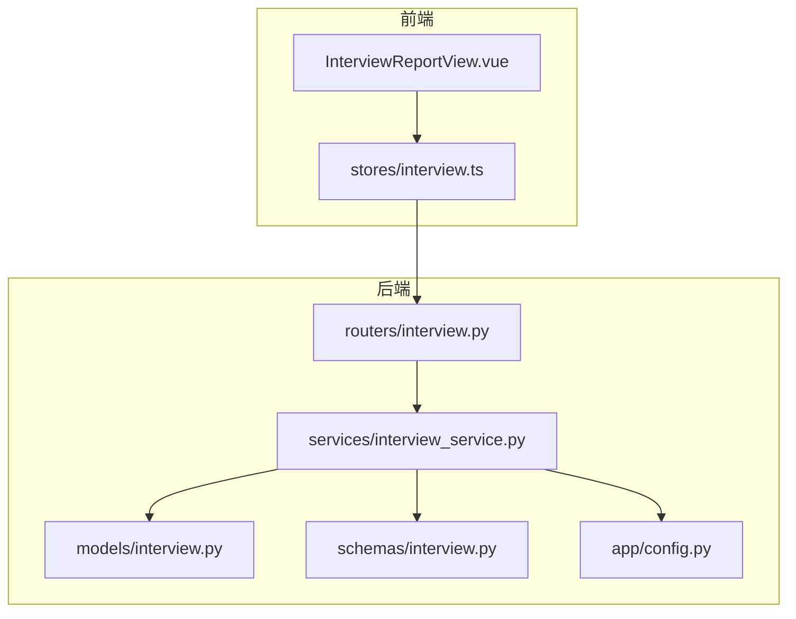
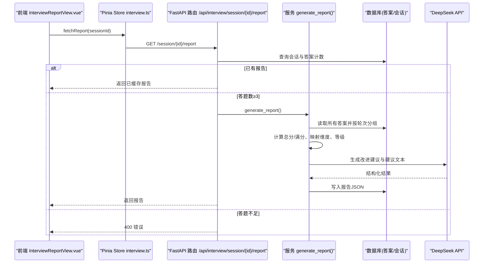
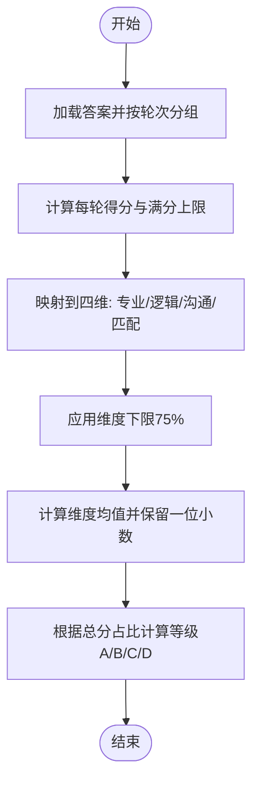
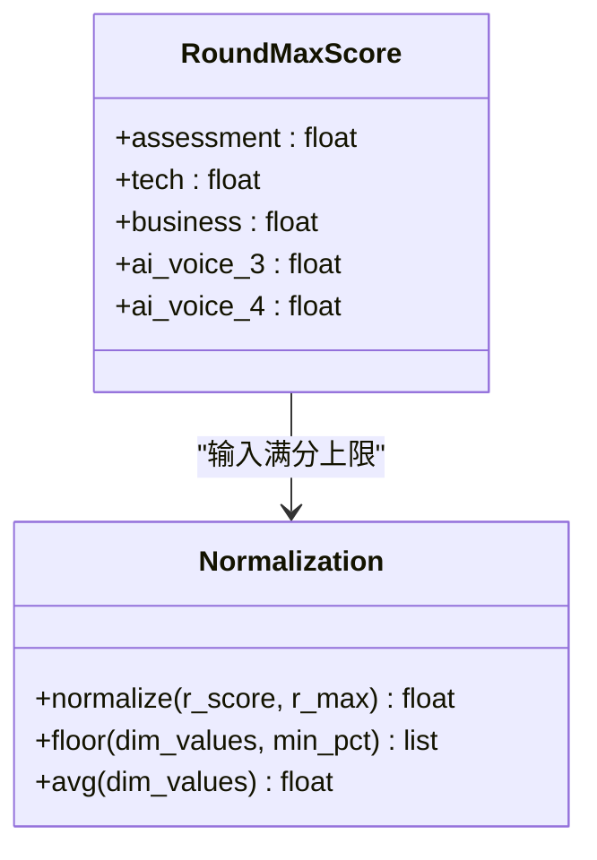
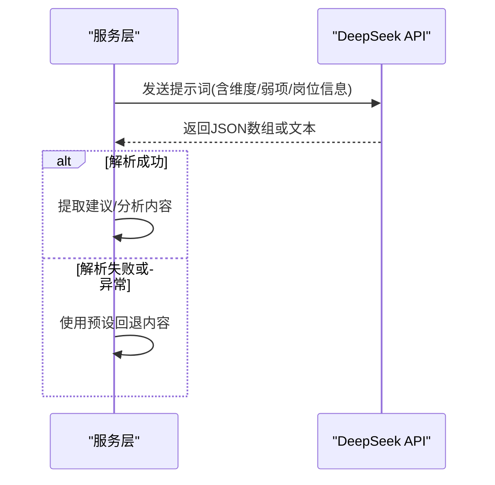
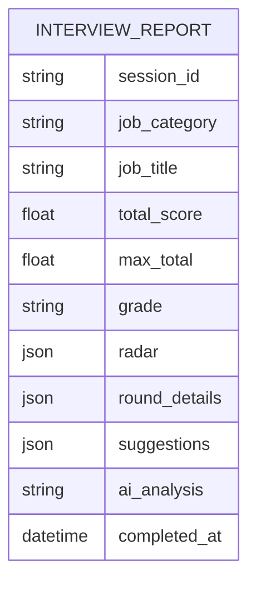
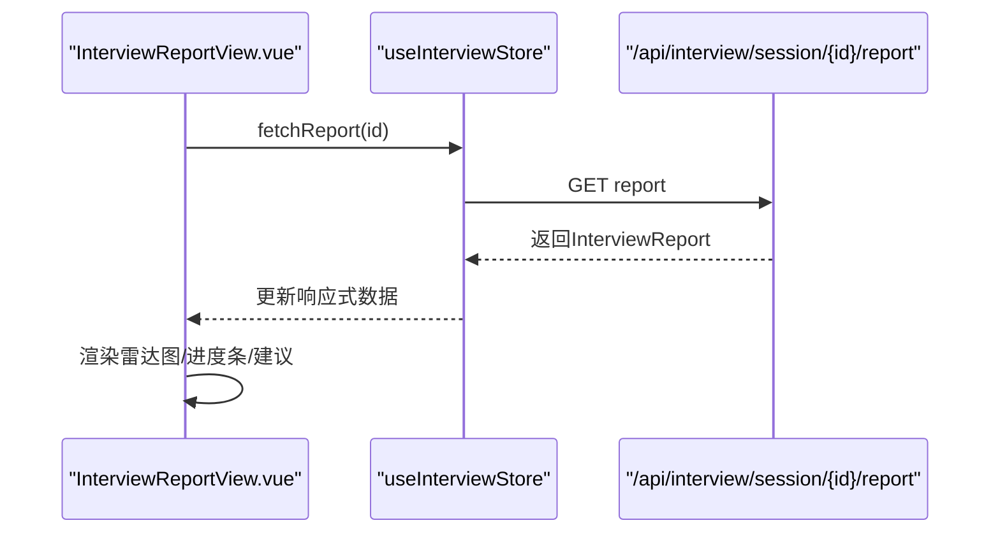
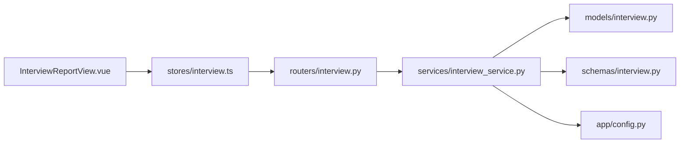

# 评分与报告生成

<cite>
**本文引用的文件**
- [interview_service.py](file://backEnd/app/services/interview_service.py)
- [interview.py（路由）](file://backEnd/app/routers/interview.py)
- [interview.py（模型）](file://backEnd/app/models/interview.py)
- [interview.py（Schema）](file://backEnd/app/schemas/interview.py)
- [config.py](file://backEnd/app/config.py)
- [InterviewReportView.vue](file://frontEnd/src/views/InterviewReportView.vue)
- [interview.ts（前端 Store）](file://frontEnd/src/stores/interview.ts)
</cite>

## 目录
1. [简介](#简介)
2. [项目结构](#项目结构)
3. [核心组件](#核心组件)
4. [架构总览](#架构总览)
5. [详细组件分析](#详细组件分析)
6. [依赖关系分析](#依赖关系分析)
7. [性能考量](#性能考量)
8. [故障排查指南](#故障排查指南)
9. [结论](#结论)
10. [附录](#附录)

## 简介
本技术文档聚焦“AI驱动的面试评分与报告生成”能力，覆盖多维度评分模型、等级评定、雷达图数据计算、个性化建议生成、权重与标准化处理、报告模板管理、前后端数据结构与渲染流程，以及算法的可配置性与扩展性设计。目标是帮助开发者快速理解并二次开发该模块。

## 项目结构
后端采用 FastAPI + SQLAlchemy 异步 ORM，服务层封装了题库、答题评分、AI对话、轮次推进与报告生成；前端使用 Vue3 + Pinia + ECharts 展示报告与可视化图表。

图示来源
- [InterviewReportView.vue:1-252](file://frontEnd/src/views/InterviewReportView.vue#L1-L252)
- [interview.ts（前端 Store）:1-313](file://frontEnd/src/stores/interview.ts#L1-L313)
- [interview.py（路由）:1-317](file://backEnd/app/routers/interview.py#L1-L317)
- [interview_service.py:1-1202](file://backEnd/app/services/interview_service.py#L1-L1202)
- [interview.py（模型）:1-114](file://backEnd/app/models/interview.py#L1-L114)
- [interview.py（Schema）:1-152](file://backEnd/app/schemas/interview.py#L1-L152)
- [config.py:1-71](file://backEnd/app/config.py#L1-L71)

章节来源
- [interview_service.py:1-1202](file://backEnd/app/services/interview_service.py#L1-L1202)
- [interview.py（路由）:1-317](file://backEnd/app/routers/interview.py#L1-L317)
- [interview.py（模型）:1-114](file://backEnd/app/models/interview.py#L1-L114)
- [interview.py（Schema）:1-152](file://backEnd/app/schemas/interview.py#L1-L152)
- [config.py:1-71](file://backEnd/app/config.py#L1-L71)
- [InterviewReportView.vue:1-252](file://frontEnd/src/views/InterviewReportView.vue#L1-L252)
- [interview.ts（前端 Store）:1-313](file://frontEnd/src/stores/interview.ts#L1-L313)

## 核心组件
- 评分与报告服务：负责按轮次聚合得分、映射到维度、计算等级、调用LLM生成建议与分析、持久化报告。
- 路由接口：提供获取题目、提交答案、推进轮次、中止面试、获取报告的REST API。
- 数据模型与Schema：定义会话、题目、答案、报告等实体及序列化结构。
- 前端视图与Store：拉取报告、渲染雷达图与维度进度条、展示AI建议与分析。

章节来源
- [interview_service.py:890-1202](file://backEnd/app/services/interview_service.py#L890-L1202)
- [interview.py（路由）:259-303](file://backEnd/app/routers/interview.py#L259-L303)
- [interview.py（Schema）:96-129](file://backEnd/app/schemas/interview.py#L96-L129)
- [InterviewReportView.vue:150-252](file://frontEnd/src/views/InterviewReportView.vue#L150-L252)
- [interview.ts（前端 Store）:128-313](file://frontEnd/src/stores/interview.ts#L128-L313)

## 架构总览
评分与报告生成的端到端流程如下：

图示来源
- [interview.py（路由）:259-303](file://backEnd/app/routers/interview.py#L259-L303)
- [interview_service.py:890-1019](file://backEnd/app/services/interview_service.py#L890-L1019)
- [interview_service.py:1034-1167](file://backEnd/app/services/interview_service.py#L1034-L1167)
- [InterviewReportView.vue:241-251](file://frontEnd/src/views/InterviewReportView.vue#L241-L251)
- [interview.ts（前端 Store）:270-273](file://frontEnd/src/stores/interview.ts#L270-L273)

## 详细组件分析

### 多维度评分模型与等级评定
- 轮次与维度映射
  - 综合素质测评 → 逻辑思维
  - 一面·技术面 → 专业能力
  - 二面·业务面 → 专业能力
  - 三面·AI面试、四面·综合面试 → 沟通表达
  - 岗位匹配度 = 总分占比
- 等级划分
  - A ≥ 85%，B ≥ 70%，C ≥ 55%，D < 55%
- 分数下限保护
  - 各维度得分不低于75%，避免极端低分影响可视化与体验

图示来源
- [interview_service.py:919-992](file://backEnd/app/services/interview_service.py#L919-L992)

章节来源
- [interview_service.py:919-992](file://backEnd/app/services/interview_service.py#L919-L992)

### 评分权重配置与分数标准化
- 轮次满分上限
  - 综合素质测评：固定满分（由题量×每题分值决定）
  - 技术面：固定满分（判题通过即满分，否则部分分）
  - 业务面：固定满分（由题量×每题分值决定）
  - AI面试：按对话轮数×单轮分值动态计算
- 标准化策略
  - 将每轮得分归一化为百分比后参与维度计算
  - 维度内多轮取平均，最终统一四舍五入至一位小数
  - 整体匹配度=总分/总满分×100%

图示来源
- [interview_service.py:1022-1031](file://backEnd/app/services/interview_service.py#L1022-L1031)
- [interview_service.py:956-981](file://backEnd/app/services/interview_service.py#L956-L981)

章节来源
- [interview_service.py:1022-1031](file://backEnd/app/services/interview_service.py#L1022-L1031)
- [interview_service.py:956-981](file://backEnd/app/services/interview_service.py#L956-L981)

### AI建议与综合分析生成
- 改进建议
  - 基于四维得分与弱项识别，调用LLM输出5-6条具体可执行建议（每条80-120字），包含行动步骤与资源推荐
- 综合分析
  - 结合各轮得分与等级，生成200-300字的综合分析报告，语气专业且温暖
- 容错机制
  - 当LLM异常时回退为预设建议与通用分析文本

图示来源
- [interview_service.py:1034-1105](file://backEnd/app/services/interview_service.py#L1034-L1105)
- [interview_service.py:1108-1167](file://backEnd/app/services/interview_service.py#L1108-L1167)

章节来源
- [interview_service.py:1034-1105](file://backEnd/app/services/interview_service.py#L1034-L1105)
- [interview_service.py:1108-1167](file://backEnd/app/services/interview_service.py#L1108-L1167)

### 报告数据结构与模板管理
- 报告Schema
  - 包含会话信息、总分/满分、等级、雷达四维、各轮详情、建议列表、AI分析、完成时间等
- 存储格式
  - 以JSON字段持久化在会话记录中，便于历史查看与复用
- 模板管理
  - 当前实现为硬编码的Prompt模板与默认回退文案，可通过配置中心或外部模板库进行替换

图示来源
- [interview.py（Schema）:96-129](file://backEnd/app/schemas/interview.py#L96-L129)
- [interview.py（模型）:48-50](file://backEnd/app/models/interview.py#L48-L50)

章节来源
- [interview.py（Schema）:96-129](file://backEnd/app/schemas/interview.py#L96-L129)
- [interview.py（模型）:48-50](file://backEnd/app/models/interview.py#L48-L50)

### 前端可视化与渲染
- 雷达图
  - 使用ECharts雷达图，指标包括专业能力、逻辑思维、沟通表达、岗位匹配
- 维度进度条
  - 每个维度显示百分比与颜色区分
- 数据来源
  - 通过Store调用后端报告接口，渲染报告头部、等级、雷达图与建议

图示来源
- [InterviewReportView.vue:210-239](file://frontEnd/src/views/InterviewReportView.vue#L210-L239)
- [interview.ts（前端 Store）:270-273](file://frontEnd/src/stores/interview.ts#L270-L273)

章节来源
- [InterviewReportView.vue:150-252](file://frontEnd/src/views/InterviewReportView.vue#L150-L252)
- [interview.ts（前端 Store）:128-313](file://frontEnd/src/stores/interview.ts#L128-L313)

## 依赖关系分析
- 路由层依赖服务层，服务层依赖模型与Schema，同时通过配置访问LLM API
- 前端通过Store与路由交互，渲染依赖ECharts

图示来源
- [InterviewReportView.vue:1-252](file://frontEnd/src/views/InterviewReportView.vue#L1-L252)
- [interview.ts（前端 Store）:1-313](file://frontEnd/src/stores/interview.ts#L1-L313)
- [interview.py（路由）:1-317](file://backEnd/app/routers/interview.py#L1-L317)
- [interview_service.py:1-1202](file://backEnd/app/services/interview_service.py#L1-L1202)
- [interview.py（模型）:1-114](file://backEnd/app/models/interview.py#L1-L114)
- [interview.py（Schema）:1-152](file://backEnd/app/schemas/interview.py#L1-L152)
- [config.py:1-71](file://backEnd/app/config.py#L1-L71)

章节来源
- [interview.py（路由）:1-317](file://backEnd/app/routers/interview.py#L1-L317)
- [interview_service.py:1-1202](file://backEnd/app/services/interview_service.py#L1-L1202)
- [interview.py（模型）:1-114](file://backEnd/app/models/interview.py#L1-L114)
- [interview.py（Schema）:1-152](file://backEnd/app/schemas/interview.py#L1-L152)
- [config.py:1-71](file://backEnd/app/config.py#L1-L71)
- [InterviewReportView.vue:1-252](file://frontEnd/src/views/InterviewReportView.vue#L1-L252)
- [interview.ts（前端 Store）:1-313](file://frontEnd/src/stores/interview.ts#L1-L313)

## 性能考量
- 报告生成触发时机
  - 仅在面试完成或中止且答题数≥3时生成，避免频繁计算
- 维度下限保护
  - 防止极端低分导致雷达图失真，提升用户体验
- LLM调用开销
  - 建议对建议与分析内容进行缓存（如按会话ID或哈希），减少重复请求
- 前端渲染
  - ECharts雷达图按需初始化，避免重复创建实例

[本节为通用指导，不直接分析具体文件]

## 故障排查指南
- 报告无法生成
  - 检查答题数量是否≥3，若不足会返回400错误
- LLM异常
  - 服务层具备回退逻辑，仍会返回基础建议与分析文本
- 前端渲染异常
  - 确认Store是否正确拉取报告数据，雷达图option配置是否完整

章节来源
- [interview.py（路由）:292-303](file://backEnd/app/routers/interview.py#L292-L303)
- [interview_service.py:1095-1105](file://backEnd/app/services/interview_service.py#L1095-L1105)
- [interview_service.py:1161-1167](file://backEnd/app/services/interview_service.py#L1161-L1167)
- [InterviewReportView.vue:241-251](file://frontEnd/src/views/InterviewReportView.vue#L241-L251)

## 结论
该模块实现了从答题到多维评分、等级评定、雷达图数据计算、AI建议与分析生成的完整闭环。通过明确的轮次与维度映射、分数标准化与下限保护、以及可回退的LLM集成，保证了系统的稳定性与可扩展性。后续可在权重配置、模板管理与缓存策略方面进一步增强灵活性。

[本节为总结，不直接分析具体文件]

## 附录

### 报告数据结构定义（节选）
- 会话与报告字段
  - 会话：用户、岗位、轮次、状态、作弊次数、模式、目标轮次、总分、报告JSON、时间戳
  - 报告：会话ID、岗位信息、总分/满分、等级、雷达四维、各轮详情、建议列表、AI分析、完成时间

章节来源
- [interview.py（模型）:19-56](file://backEnd/app/models/interview.py#L19-L56)
- [interview.py（Schema）:96-129](file://backEnd/app/schemas/interview.py#L96-L129)

### 使用示例（路径指引）
- 后端生成报告
  - 参考：[generate_report:890-1019](file://backEnd/app/services/interview_service.py#L890-L1019)、[_get_round_max_score:1022-1031](file://backEnd/app/services/interview_service.py#L1022-L1031)、[_generate_suggestions:1034-1105](file://backEnd/app/services/interview_service.py#L1034-L1105)、[_generate_ai_analysis:1108-1167](file://backEnd/app/services/interview_service.py#L1108-L1167)
- 前端渲染可视化
  - 参考：[雷达图option:210-239](file://frontEnd/src/views/InterviewReportView.vue#L210-L239)、[fetchReport:270-273](file://frontEnd/src/stores/interview.ts#L270-L273)

### 可配置性与扩展性设计
- 配置项
  - DeepSeek API密钥、URL、模型名称等通过配置类集中管理
- 扩展点
  - 新增轮次：在轮次定义与映射处扩展，并在满分上限函数中补充规则
  - 新增维度：在维度映射与雷达图配置处扩展
  - 模板管理：将Prompt模板迁移至外部配置或模板引擎，支持运行时切换

章节来源
- [config.py:34-37](file://backEnd/app/config.py#L34-L37)
- [interview_service.py:35-43](file://backEnd/app/services/interview_service.py#L35-L43)
- [interview_service.py:956-981](file://backEnd/app/services/interview_service.py#L956-L981)
- [InterviewReportView.vue:210-239](file://frontEnd/src/views/InterviewReportView.vue#L210-L239)