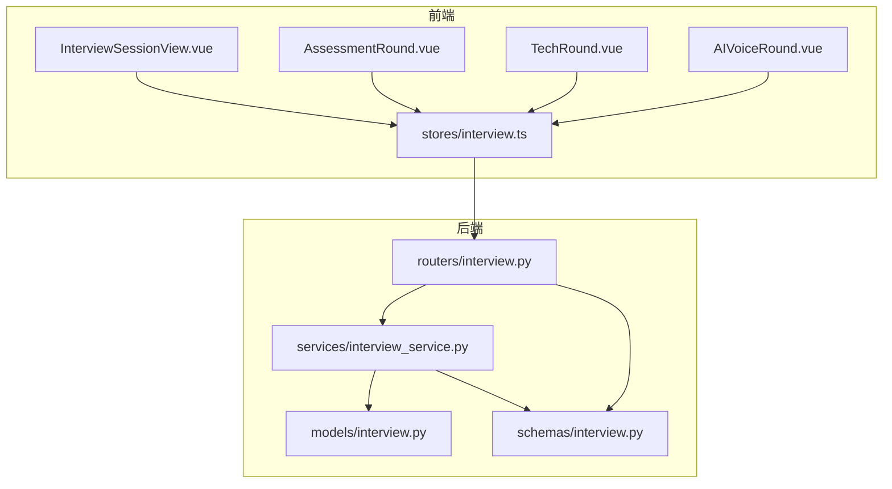
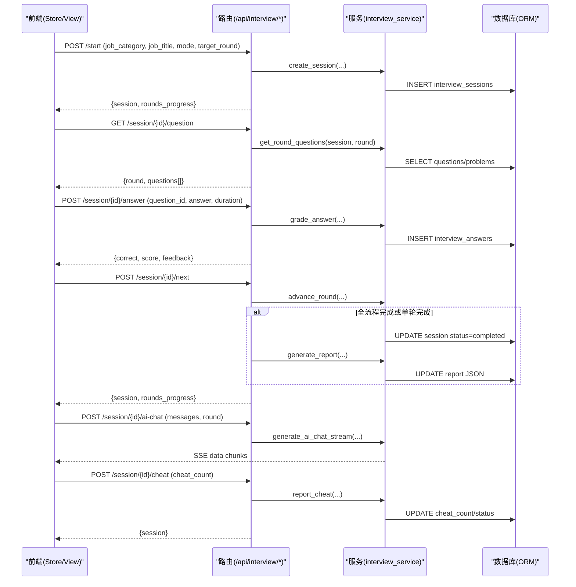
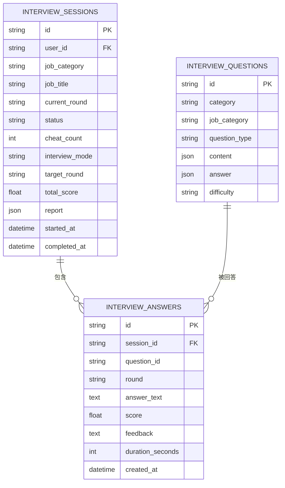
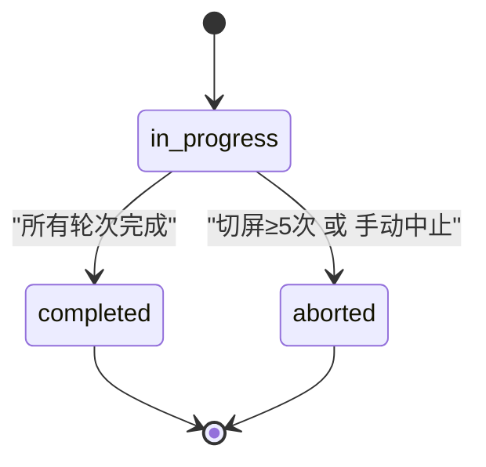
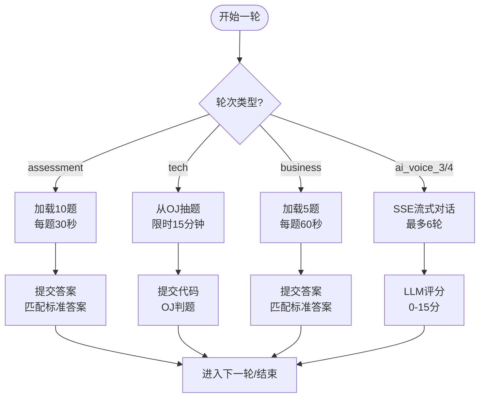
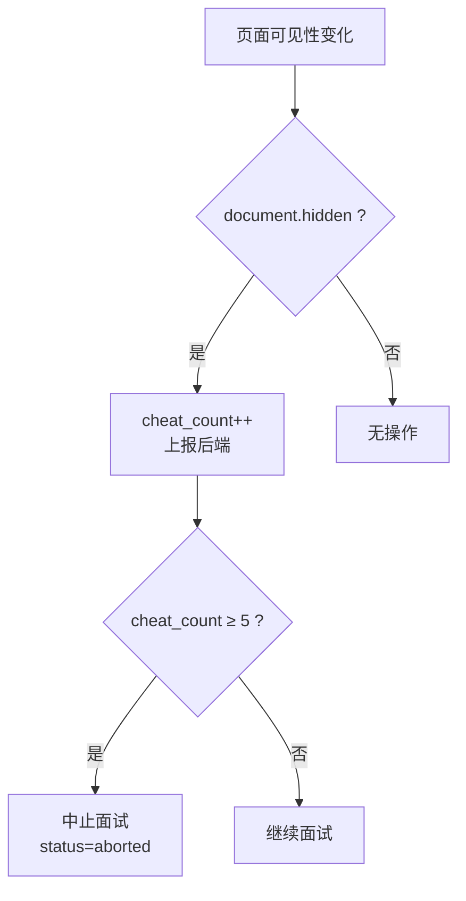
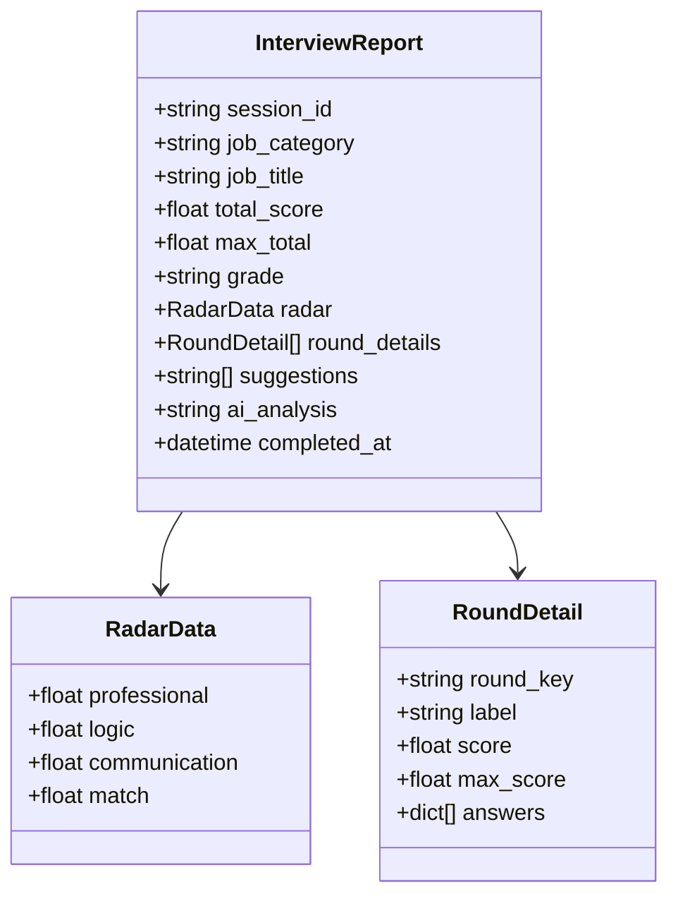
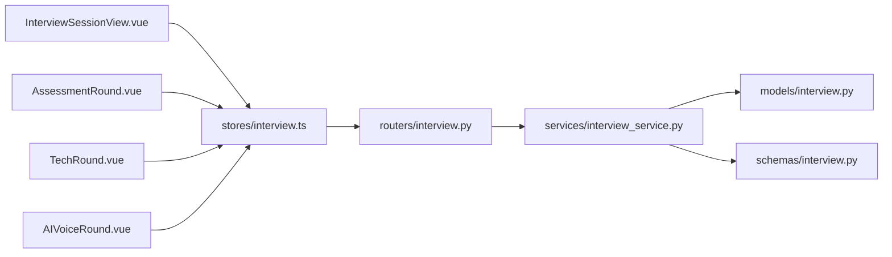

# 面试会话管理

<cite>
**本文引用的文件**   
- [interview.py（模型）](file://backEnd/app/models/interview.py)
- [interview.py（路由）](file://backEnd/app/routers/interview.py)
- [interview_service.py（服务）](file://backEnd/app/services/interview_service.py)
- [interview.py（Schema）](file://backEnd/app/schemas/interview.py)
- [interview.ts（前端状态与API封装）](file://frontEnd/src/stores/interview.ts)
- [InterviewSessionView.vue（面试主视图）](file://frontEnd/src/views/InterviewSessionView.vue)
- [AssessmentRound.vue（综合素质测评轮次组件）](file://frontEnd/src/components/interview/AssessmentRound.vue)
- [TechRound.vue（技术能力面试轮次组件）](file://frontEnd/src/components/interview/TechRound.vue)
- [AIVoiceRound.vue（AI语音面试轮次组件）](file://frontEnd/src/components/interview/AIVoiceRound.vue)
</cite>

## 目录
1. [简介](#简介)
2. [项目结构](#项目结构)
3. [核心组件](#核心组件)
4. [架构总览](#架构总览)
5. [详细组件分析](#详细组件分析)
6. [依赖关系分析](#依赖关系分析)
7. [性能考量](#性能考量)
8. [故障排查指南](#故障排查指南)
9. [结论](#结论)
10. [附录：API 示例](#附录api-示例)

## 简介
本文件面向“面试会话管理”功能，系统性梳理从会话创建、状态流转、进度跟踪到评分报告生成的完整生命周期；覆盖四种面试模式（综合素质测评、技术能力面试、业务能力面试、AI语音面试）的会话配置与流程控制；并深入解析会话状态机设计、轮次管理机制、切屏检测防作弊系统、数据模型与持久化策略。文末提供常用 API 示例，帮助快速集成与调试。

## 项目结构
后端采用 FastAPI + SQLAlchemy 异步 ORM，前后端通过 REST/SSE 接口交互。面试相关代码主要分布在以下模块：
- 数据模型：定义面试会话、题目、答案等实体
- 路由层：暴露 REST API，负责鉴权、参数校验与服务调用
- 服务层：实现业务逻辑（题库加载、评分、轮次推进、报告生成、SSE 流式对话）
- Schema：请求/响应数据结构定义
- 前端：Pinia Store 封装 API，Vue 组件承载各轮次 UI 与交互

图表来源
- [InterviewSessionView.vue:1-120](file://frontEnd/src/views/InterviewSessionView.vue#L1-L120)
- [interview.ts:100-170](file://frontEnd/src/stores/interview.ts#L100-L170)
- [interview.py（路由）:1-60](file://backEnd/app/routers/interview.py#L1-L60)
- [interview_service.py:480-560](file://backEnd/app/services/interview_service.py#L480-L560)
- [interview.py（模型）:19-56](file://backEnd/app/models/interview.py#L19-L56)
- [interview.py（Schema）:27-46](file://backEnd/app/schemas/interview.py#L27-L46)

章节来源
- [InterviewSessionView.vue:1-120](file://frontEnd/src/views/InterviewSessionView.vue#L1-L120)
- [interview.ts:100-170](file://frontEnd/src/stores/interview.ts#L100-L170)
- [interview.py（路由）:1-60](file://backEnd/app/routers/interview.py#L1-L60)
- [interview_service.py:480-560](file://backEnd/app/services/interview_service.py#L480-L560)
- [interview.py（模型）:19-56](file://backEnd/app/models/interview.py#L19-L56)
- [interview.py（Schema）:27-46](file://backEnd/app/schemas/interview.py#L27-L46)

## 核心组件
- 数据模型
  - InterviewSession：会话主表，记录用户、岗位、当前轮次、状态、作弊次数、面试模式、目标轮次、总分、报告 JSON、时间戳等
  - InterviewQuestion：题库表，支持多类别、题型、难度、JSON 内容/答案
  - InterviewAnswer：答题记录，关联会话与题目，记录得分、反馈、耗时等
- 路由与 Schema
  - 路由提供会话创建、获取、题目获取、答案提交、下一轮、AI 对话、切屏上报、中止、报告、历史等接口
  - Schema 定义输入输出结构，包括 RoundProgress、InterviewSessionResponse、QuestionItem、AnswerResponse、InterviewReport 等
- 服务层
  - 轮次定义与进度计算
  - 题库种子初始化与按轮次取题
  - 评分逻辑（选择题/判断题、OJ 判题、AI 回答 LLM 评分）
  - SSE 流式 AI 对话
  - 轮次推进与结束判定
  - 切屏上报与自动中止
  - 综合评分报告生成（含雷达图维度、等级、建议与分析）
- 前端
  - Pinia Store 统一封装 API 调用与会话状态
  - 主视图负责入场须知、全屏保护、摄像头录制、轮次切换、报告可用性检查
  - 各轮次组件分别处理测评、编程题、AI 对话交互

章节来源
- [interview.py（模型）:19-114](file://backEnd/app/models/interview.py#L19-L114)
- [interview.py（路由）:26-317](file://backEnd/app/routers/interview.py#L26-L317)
- [interview.py（Schema）:1-152](file://backEnd/app/schemas/interview.py#L1-L152)
- [interview_service.py:35-67](file://backEnd/app/services/interview_service.py#L35-L67)
- [interview_service.py:489-511](file://backEnd/app/services/interview_service.py#L489-L511)
- [interview_service.py:536-621](file://backEnd/app/services/interview_service.py#L536-L621)
- [interview_service.py:628-740](file://backEnd/app/services/interview_service.py#L628-L740)
- [interview_service.py:797-845](file://backEnd/app/services/interview_service.py#L797-L845)
- [interview_service.py:851-872](file://backEnd/app/services/interview_service.py#L851-L872)
- [interview_service.py:879-886](file://backEnd/app/services/interview_service.py#L879-L886)
- [interview_service.py:893-1019](file://backEnd/app/services/interview_service.py#L893-L1019)
- [interview.ts:128-313](file://frontEnd/src/stores/interview.ts#L128-L313)
- [InterviewSessionView.vue:292-530](file://frontEnd/src/views/InterviewSessionView.vue#L292-L530)
- [AssessmentRound.vue:97-227](file://frontEnd/src/components/interview/AssessmentRound.vue#L97-L227)
- [TechRound.vue:232-427](file://frontEnd/src/components/interview/TechRound.vue#L232-L427)
- [AIVoiceRound.vue:143-385](file://frontEnd/src/components/interview/AIVoiceRound.vue#L143-L385)

## 架构总览
面试会话管理的端到端流程如下：
- 前端选择岗位与模式，调用 /api/interview/start 创建会话
- 根据 current_round 拉取对应轮次题目
- 用户作答后提交至 /api/interview/session/{id}/answer，后端按轮次评分并落库
- 进入下一轮 /api/interview/session/{id}/next，若完成则触发报告生成
- AI 语音面试使用 /api/interview/session/{id}/ai-chat 进行 SSE 流式对话
- 切屏事件通过 /api/interview/session/{id}/cheat 上报，达到阈值自动中止
- 完成后通过 /api/interview/session/{id}/report 获取评分报告

图表来源
- [interview.py（路由）:36-158](file://backEnd/app/routers/interview.py#L36-L158)
- [interview_service.py:489-511](file://backEnd/app/services/interview_service.py#L489-L511)
- [interview_service.py:536-621](file://backEnd/app/services/interview_service.py#L536-L621)
- [interview_service.py:628-740](file://backEnd/app/services/interview_service.py#L628-L740)
- [interview_service.py:851-872](file://backEnd/app/services/interview_service.py#L851-L872)
- [interview_service.py:893-1019](file://backEnd/app/services/interview_service.py#L893-L1019)
- [interview_service.py:797-845](file://backEnd/app/services/interview_service.py#L797-L845)
- [interview_service.py:879-886](file://backEnd/app/services/interview_service.py#L879-L886)

## 详细组件分析

### 数据模型与持久化策略
- 会话模型
  - 关键字段：user_id、job_category、job_title、current_round、status、cheat_count、interview_mode、target_round、total_score、report(JSON)、started_at、completed_at
  - 索引：user_id、status 用于查询优化
- 题目模型
  - 关键字段：category、job_category、question_type、content(JSON)、answer(JSON)、difficulty
- 答案模型
  - 关键字段：session_id、question_id、round、answer_text、score、feedback、duration_seconds、created_at
- 持久化策略
  - 使用 SQLAlchemy 异步 Session，事务内批量写入
  - 报告以 JSON 字段存储，便于扩展多维度评分与建议
  - 时间戳默认值由数据库函数设置，减少应用层负担

图表来源
- [interview.py（模型）:19-114](file://backEnd/app/models/interview.py#L19-L114)

章节来源
- [interview.py（模型）:19-114](file://backEnd/app/models/interview.py#L19-L114)

### 会话状态机与轮次管理
- 状态集合
  - in_progress、completed、aborted
- 轮次顺序
  - assessment → tech → business → ai_voice_3 → ai_voice_4
- 推进规则
  - 单轮模式：完成后直接标记 completed
  - 全流程模式：按顺序推进，到达末尾时标记 completed
- 进度计算
  - _build_rounds_progress 根据 current_round 与模式计算每轮状态（pending/active/completed）

图表来源
- [interview_service.py:851-872](file://backEnd/app/services/interview_service.py#L851-L872)
- [interview_service.py:879-886](file://backEnd/app/services/interview_service.py#L879-L886)
- [interview_service.py:35-67](file://backEnd/app/services/interview_service.py#L35-L67)

章节来源
- [interview_service.py:35-67](file://backEnd/app/services/interview_service.py#L35-L67)
- [interview_service.py:851-872](file://backEnd/app/services/interview_service.py#L851-L872)
- [interview_service.py:879-886](file://backEnd/app/services/interview_service.py#L879-L886)

### 不同面试模式的配置与流程控制
- 综合素质测评（assessment）
  - 题库：固定 10 道选择题，每题限时 30 秒
  - 评分：匹配标准答案，正确得 10 分，错误 0 分
  - 前端：逐题展示选项，计时器倒计时，提交后显示结果并自动下一题
- 技术能力面试（tech）
  - 题库：从 OJ 题库随机抽取一道编程题，限时 15 分钟
  - 评分：复用 OJ 判题服务，accepted 得 20 分，非编译错误得 5 分，编译错误 0 分
  - 前端：左侧题目描述，右侧代码编辑器，支持调试运行与提交
- 业务能力面试（business）
  - 题库：优先岗位类别，补充通用题，共 5 题，题型为判断/选择，每题限时 60 秒
  - 评分：同测评，正确 10 分，错误 0 分
- AI 语音面试（ai_voice_3 / ai_voice_4）
  - 流程：SSE 流式对话，最多 6 轮，每轮先由面试官提问，候选人回答后评分
  - 评分：调用 LLM 对回答打分（0-15 分），返回结构化反馈
  - 前端：数字人面试官、TTS 朗读、ASR 语音识别、消息气泡展示

图表来源
- [interview_service.py:536-621](file://backEnd/app/services/interview_service.py#L536-L621)
- [interview_service.py:628-740](file://backEnd/app/services/interview_service.py#L628-L740)
- [interview_service.py:797-845](file://backEnd/app/services/interview_service.py#L797-L845)
- [AssessmentRound.vue:97-227](file://frontEnd/src/components/interview/AssessmentRound.vue#L97-L227)
- [TechRound.vue:232-427](file://frontEnd/src/components/interview/TechRound.vue#L232-L427)
- [AIVoiceRound.vue:143-385](file://frontEnd/src/components/interview/AIVoiceRound.vue#L143-L385)

章节来源
- [interview_service.py:536-621](file://backEnd/app/services/interview_service.py#L536-L621)
- [interview_service.py:628-740](file://backEnd/app/services/interview_service.py#L628-L740)
- [interview_service.py:797-845](file://backEnd/app/services/interview_service.py#L797-L845)
- [AssessmentRound.vue:97-227](file://frontEnd/src/components/interview/AssessmentRound.vue#L97-L227)
- [TechRound.vue:232-427](file://frontEnd/src/components/interview/TechRound.vue#L232-L427)
- [AIVoiceRound.vue:143-385](file://frontEnd/src/components/interview/AIVoiceRound.vue#L143-L385)

### 切屏检测与防作弊系统
- 前端监听
  - visibilitychange：检测到页面隐藏即计数 +1，超过 5 次自动中止
  - fullscreenchange：可选全屏保护，退出全屏弹窗确认是否离开
  - keydown/contextmenu/beforeunload：拦截 F12、Ctrl+U、右键菜单、关闭提示
- 后端处理
  - report_cheat 更新 cheat_count，达到阈值将状态置为 aborted 并记录完成时间
- 用户体验
  - 顶部实时显示切屏次数与警告横幅
  - 中止后可查看评分报告（答题数≥3）

图表来源
- [InterviewSessionView.vue:380-424](file://frontEnd/src/views/InterviewSessionView.vue#L380-L424)
- [interview_service.py:879-886](file://backEnd/app/services/interview_service.py#L879-L886)

章节来源
- [InterviewSessionView.vue:380-424](file://frontEnd/src/views/InterviewSessionView.vue#L380-L424)
- [interview_service.py:879-886](file://backEnd/app/services/interview_service.py#L879-L886)

### 评分报告生成与雷达图维度
- 维度映射
  - 专业能力：tech、business 轮次得分占比
  - 逻辑思维：assessment 轮次得分占比
  - 沟通表达：ai_voice_3、ai_voice_4 轮次得分占比
  - 岗位匹配度：整体得分百分比
- 等级划分
  - A≥85%，B≥70%，C≥55%，D<55%
- 建议与分析
  - 基于 LLM 生成个性化改进建议与综合分析段落
- 存储
  - 报告 JSON 写入会话表，避免重复生成

图表来源
- [interview.py（Schema）:98-128](file://backEnd/app/schemas/interview.py#L98-L128)
- [interview_service.py:893-1019](file://backEnd/app/services/interview_service.py#L893-L1019)

章节来源
- [interview.py（Schema）:98-128](file://backEnd/app/schemas/interview.py#L98-L128)
- [interview_service.py:893-1019](file://backEnd/app/services/interview_service.py#L893-L1019)

## 依赖关系分析
- 路由依赖服务，服务依赖模型与外部 LLM/OJ 服务
- 前端 Store 依赖路由 API，组件依赖 Store 提供的状态与方法
- 关键耦合点
  - 轮次定义集中管理，新增轮次需同步更新 ROUNDS、ROUND_KEYS、_get_round_max_score 等
  - AI 对话与评分强依赖 DeepSeek 配置与可用性
  - 技术面依赖 OJ 判题服务，需保证问题存在且可执行

图表来源
- [interview.py（路由）:1-60](file://backEnd/app/routers/interview.py#L1-L60)
- [interview_service.py:1-28](file://backEnd/app/services/interview_service.py#L1-L28)
- [interview.ts:100-170](file://frontEnd/src/stores/interview.ts#L100-L170)
- [InterviewSessionView.vue:292-330](file://frontEnd/src/views/InterviewSessionView.vue#L292-L330)

章节来源
- [interview.py（路由）:1-60](file://backEnd/app/routers/interview.py#L1-L60)
- [interview_service.py:1-28](file://backEnd/app/services/interview_service.py#L1-L28)
- [interview.ts:100-170](file://frontEnd/src/stores/interview.ts#L100-L170)
- [InterviewSessionView.vue:292-330](file://frontEnd/src/views/InterviewSessionView.vue#L292-L330)

## 性能考量
- 数据库
  - 对 user_id、status 建立索引，提升会话查询效率
  - 报告 JSON 字段避免频繁 JOIN，读取时按需解析
- 网络
  - AI 对话使用 SSE 流式传输，降低首字节延迟，提升体验
  - 超时与重试：LLM 调用设置合理超时，异常降级返回默认评分/建议
- 前端
  - 组件级状态隔离，避免全量重渲染
  - 计时器与事件监听在卸载时清理，防止内存泄漏

[本节为通用指导，不直接分析具体文件]

## 故障排查指南
- 常见问题
  - 会话不存在：检查 session_id 与用户权限
  - 面试已结束：确保状态为 in_progress 再提交答案或进入下一轮
  - 报告不可用：答题数量不足 3 题无法生成报告
  - AI 对话失败：检查 LLM 配置与网络连通性
  - 切屏自动中止：确认浏览器权限与全屏保护开关
- 定位方法
  - 查看路由层 HTTPException 的 detail 信息
  - 检查服务层 LLM/OJ 调用的异常日志
  - 前端控制台捕获 fetch 错误与 SSE 解析异常

章节来源
- [interview.py（路由）:61-158](file://backEnd/app/routers/interview.py#L61-L158)
- [interview_service.py:743-791](file://backEnd/app/services/interview_service.py#L743-L791)
- [interview.ts:113-124](file://frontEnd/src/stores/interview.ts#L113-L124)

## 结论
面试会话管理通过清晰的状态机与轮次机制，结合多种面试模式与智能评分，提供了完整的在线面试体验。前后端职责明确，数据模型与持久化策略兼顾可扩展性与性能。防作弊系统与报告生成为面试质量与公平性提供了保障。后续可在题库扩充、评分模型优化、AI 行为增强等方面持续迭代。

[本节为总结，不直接分析具体文件]

## 附录：API 示例
以下为常用接口的请求/响应要点（路径与参数以实际实现为准）：
- 创建面试会话
  - POST /api/interview/start
  - 请求体：job_category、job_title、interview_mode（full/single）、target_round（single 模式指定）
  - 响应：InterviewSessionResponse（含 rounds_progress）
- 获取会话状态
  - GET /api/interview/session/{session_id}
  - 响应：InterviewSessionResponse
- 获取当前轮次题目
  - GET /api/interview/session/{session_id}/question
  - 响应：QuestionListResponse（round、questions[]）
- 提交答案
  - POST /api/interview/session/{session_id}/answer
  - 请求体：question_id、answer（字符串/字典）、duration_seconds
  - 响应：AnswerResponse（correct、score、feedback、correct_answer）
- 进入下一轮
  - POST /api/interview/session/{session_id}/next
  - 响应：InterviewSessionResponse（可能已 completed）
- AI 对话（SSE）
  - POST /api/interview/session/{session_id}/ai-chat
  - 请求体：messages[]、round（ai_voice_3/ai_voice_4）
  - 响应：text/event-stream 流式数据块
- 上报切屏
  - POST /api/interview/session/{session_id}/cheat
  - 请求体：cheat_count
  - 响应：InterviewSessionResponse
- 中止面试
  - POST /api/interview/session/{session_id}/abort
  - 响应：InterviewSessionResponse
- 获取评分报告
  - GET /api/interview/session/{session_id}/report
  - 响应：InterviewReport（含雷达图、轮次详情、建议与分析）
- 面试历史
  - GET /api/interview/history
  - 响应：InterviewHistoryResponse（total、sessions[]）

章节来源
- [interview.py（路由）:29-317](file://backEnd/app/routers/interview.py#L29-L317)
- [interview.py（Schema）:27-152](file://backEnd/app/schemas/interview.py#L27-L152)