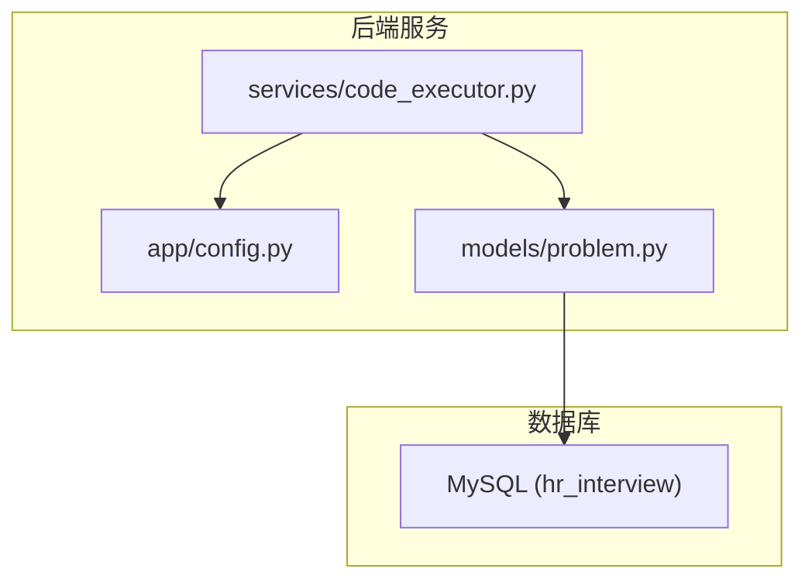
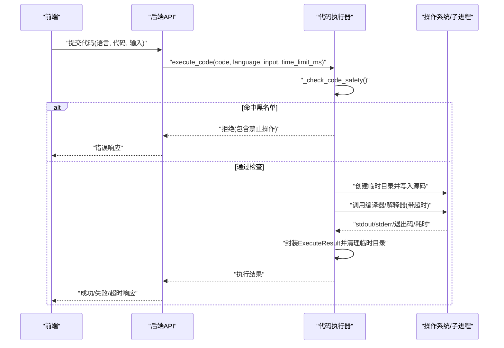
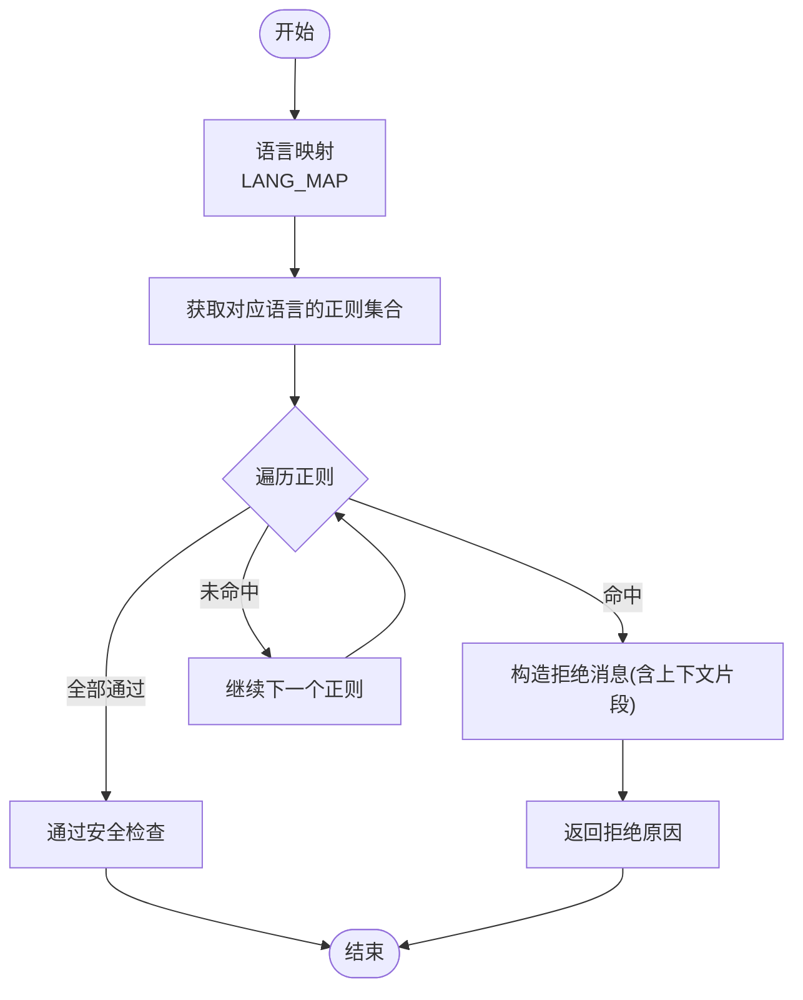
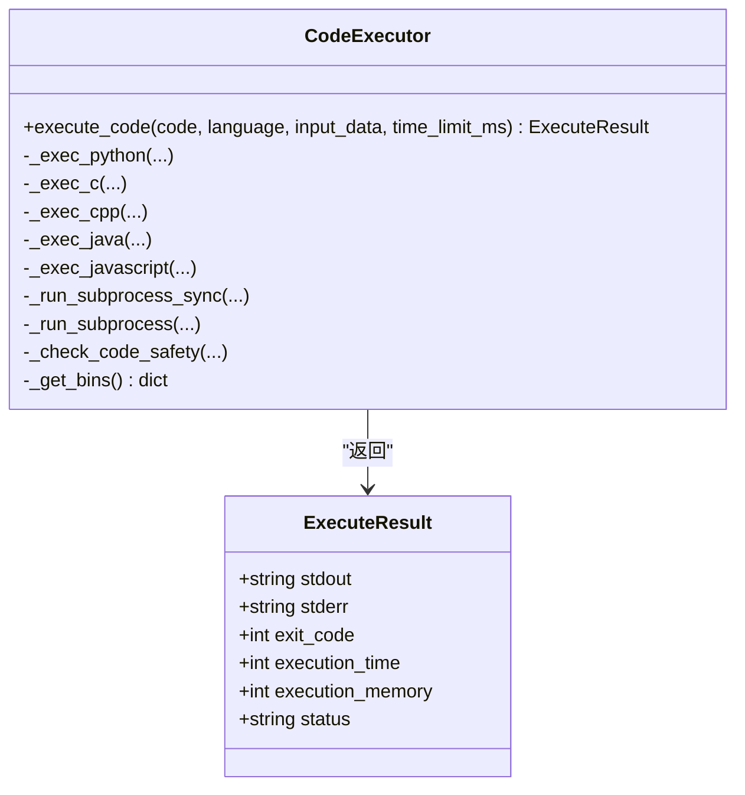
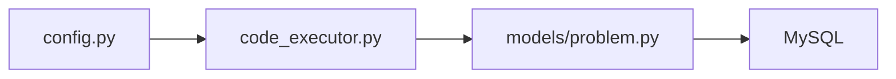

# 代码执行沙箱

<cite>
**本文引用的文件**
- [code_executor.py](file://backEnd/app/services/code_executor.py)
- [config.py](file://backEnd/app/config.py)
- [problem.py](file://backEnd/app/models/problem.py)
- [hr_interview.sql](file://hr_interview.sql)
</cite>

## 目录
1. [简介](#简介)
2. [项目结构](#项目结构)
3. [核心组件](#核心组件)
4. [架构总览](#架构总览)
5. [详细组件分析](#详细组件分析)
6. [依赖关系分析](#依赖关系分析)
7. [性能与资源限制](#性能与资源限制)
8. [故障排查指南](#故障排查指南)
9. [结论](#结论)
10. [附录：扩展与最佳实践](#附录扩展与最佳实践)

## 简介
本技术文档围绕“代码执行沙箱”展开，聚焦多语言代码执行的安全隔离机制、编译器集成方案、运行时环境配置、异常处理与超时控制等关键能力。当前实现通过子进程方式运行用户代码，结合关键词黑名单进行静态安全检查，并以临时目录隔离文件系统访问；同时提供 Python、C/C++、Java、JavaScript 的编译/执行流程封装，支持基于题目配置的内存与时间限制展示（后端执行器目前仅实现了时间限制）。

## 项目结构
与代码执行沙箱直接相关的后端模块位于 backEnd/app/services 与 backEnd/app/config，数据模型定义在 backEnd/app/models，数据库表结构见根目录 SQL 脚本。

图表来源
- [code_executor.py:1-444](file://backEnd/app/services/code_executor.py#L1-L444)
- [config.py:1-71](file://backEnd/app/config.py#L1-L71)
- [problem.py:1-88](file://backEnd/app/models/problem.py#L1-L88)

章节来源
- [code_executor.py:1-444](file://backEnd/app/services/code_executor.py#L1-L444)
- [config.py:1-71](file://backEnd/app/config.py#L1-L71)
- [problem.py:1-88](file://backEnd/app/models/problem.py#L1-L88)

## 核心组件
- 代码执行器：负责安全校验、编译器路径解析、子进程调度、结果封装与清理。
- 配置中心：集中管理编译器二进制路径与环境变量。
- 问题模型：定义题目元信息（含 time_limit、memory_limit）及提交记录字段。

章节来源
- [code_executor.py:1-444](file://backEnd/app/services/code_executor.py#L1-L444)
- [config.py:1-71](file://backEnd/app/config.py#L1-L71)
- [problem.py:1-88](file://backEnd/app/models/problem.py#L1-L88)

## 架构总览
整体执行流程：前端提交代码与语言类型 → 后端路由调用执行器 → 执行器进行安全扫描 → 根据语言选择对应编译器/解释器 → 在受限工作目录下以子进程运行 → 捕获输出与状态 → 返回统一结果对象。

图表来源
- [code_executor.py:270-321](file://backEnd/app/services/code_executor.py#L270-L321)
- [code_executor.py:220-267](file://backEnd/app/services/code_executor.py#L220-L267)

## 详细组件分析

### 安全策略与黑名单
- 通用危险模式：覆盖系统命令、注册表、计划任务、网络配置等跨语言风险点。
- 语言特定模式：
  - Python：拦截 os/shutil/subprocess/ctypes/socket/http.server 等高危接口，以及 eval/exec/compile 动态执行。
  - C/C++：拦截 system/popen/exec*、Windows API 相关函数与头文件。
  - Java：拦截 Runtime/ProcessBuilder/反射/网络/文件删除移动等。
  - JavaScript/Node.js：拦截 child_process/fs/path/os/net/http/https 等模块与 process.* 敏感属性。
- 匹配逻辑：按语言映射到对应正则集合，命中后提取上下文片段并返回拒绝原因。

图表来源
- [code_executor.py:144-167](file://backEnd/app/services/code_executor.py#L144-L167)
- [code_executor.py:25-142](file://backEnd/app/services/code_executor.py#L25-L142)

章节来源
- [code_executor.py:25-167](file://backEnd/app/services/code_executor.py#L25-L167)

### 编译器集成与路径解析
- 路径解析优先级：优先使用 .env 中显式配置的二进制路径，否则从 PATH 自动检测。
- 支持的编译器/解释器：python/python3、gcc、g++、javac/java、node。
- 统一入口：_get_bins() 聚合所有工具路径，供各语言执行分支复用。

章节来源
- [code_executor.py:173-197](file://backEnd/app/services/code_executor.py#L173-L197)
- [config.py:39-45](file://backEnd/app/config.py#L39-L45)

### 语言执行流程
- Python：将代码写入 main.py，直接以 python3 运行。
- C/C++：先 gcc/g++ 编译为可执行文件，再运行；编译阶段设置优化与数学库链接。
- Java：指定 UTF-8 编码编译 Main.java，再以 java -cp 运行。
- JavaScript：将代码写入 main.js，以 node 运行。
- 统一结果：返回 ExecuteResult，包含 stdout、stderr、exit_code、execution_time、execution_memory、status。

图表来源
- [code_executor.py:210-218](file://backEnd/app/services/code_executor.py#L210-L218)
- [code_executor.py:270-443](file://backEnd/app/services/code_executor.py#L270-L443)

章节来源
- [code_executor.py:270-443](file://backEnd/app/services/code_executor.py#L270-L443)

### 运行时环境与资源限制
- 时间限制：通过 _run_subprocess_sync 的 timeout 参数实现，超时后返回“Time Limit Exceeded”。
- 内存限制：
  - 题目模型包含 memory_limit 字段，前端展示该值。
  - 当前执行器未对子进程施加内存限制，execution_memory 字段固定为 0。
- 文件系统访问控制：
  - 每个执行在独立临时目录中进行，执行结束后清理。
  - 黑名单拦截系统目录路径与危险文件操作。
- 网络访问控制：
  - 黑名单拦截常见网络模块与 socket 相关调用。
  - 未在网络层做强制阻断，建议配合容器或系统级防火墙策略。

章节来源
- [problem.py:36-37](file://backEnd/app/models/problem.py#L36-L37)
- [hr_interview.sql:391-392](file://hr_interview.sql#L391-L392)
- [code_executor.py:220-267](file://backEnd/app/services/code_executor.py#L220-L267)
- [code_executor.py:210-218](file://backEnd/app/services/code_executor.py#L210-L218)

### 异常处理与错误信息过滤
- 超时处理：子进程抛出超时异常时，统一转换为“time_limit_exceeded”状态。
- 非零退出码：视为“runtime_error”，保留 stderr 以便诊断。
- 编译错误：返回“compilation_error”，附带编译器输出。
- 安全拦截：返回“compilation_error”状态，并在 stderr 中包含安全策略提示。
- 日志记录：对安全拦截进行警告级别日志，便于审计。

章节来源
- [code_executor.py:220-267](file://backEnd/app/services/code_executor.py#L220-L267)
- [code_executor.py:270-321](file://backEnd/app/services/code_executor.py#L270-L321)

## 依赖关系分析
- 执行器依赖配置模块获取编译器路径。
- 题目模型定义时间与内存限制字段，用于前端展示与后续扩展。
- 数据库表结构与模型一致，确保持久化字段完整。

图表来源
- [config.py:1-71](file://backEnd/app/config.py#L1-L71)
- [code_executor.py:1-444](file://backEnd/app/services/code_executor.py#L1-L444)
- [problem.py:1-88](file://backEnd/app/models/problem.py#L1-L88)

章节来源
- [config.py:1-71](file://backEnd/app/config.py#L1-L71)
- [code_executor.py:1-444](file://backEnd/app/services/code_executor.py#L1-L444)
- [problem.py:1-88](file://backEnd/app/models/problem.py#L1-L88)

## 性能与资源限制
- 并发执行：使用线程池执行子进程，默认最大工作线程数为 4，避免阻塞事件循环。
- 超时控制：统一通过 subprocess.run 的 timeout 参数实现，防止长时间占用。
- 磁盘 I/O：每次执行在独立临时目录中读写，完成后清理，降低交叉污染风险。
- 可扩展性：如需更严格的资源限制（CPU、内存、IO），建议在容器或系统层面（如 cgroups、seccomp、AppArmor）实施。

[本节为通用指导，不直接分析具体文件]

## 故障排查指南
- 编译器未找到：检查 .env 中的编译器路径配置，或确认 PATH 中存在对应命令。
- 编译错误：查看返回的 stderr 内容，定位语法或依赖问题。
- 运行时错误：根据 stderr 与退出码判断异常原因。
- 超时：确认 time_limit_ms 是否过小，或代码是否存在死循环。
- 安全拦截：若出现“包含禁止的操作”，请调整代码以避免触发黑名单规则。

章节来源
- [code_executor.py:173-197](file://backEnd/app/services/code_executor.py#L173-L197)
- [code_executor.py:220-267](file://backEnd/app/services/code_executor.py#L220-L267)
- [code_executor.py:270-321](file://backEnd/app/services/code_executor.py#L270-L321)

## 结论
当前沙箱通过子进程隔离与关键词黑名单实现基础安全边界，支持多种语言的编译与执行，具备超时控制与临时目录隔离能力。内存限制尚未在执行器侧落地，建议结合容器或系统级资源限制增强安全性与稳定性。

[本节为总结，不直接分析具体文件]

## 附录：扩展与最佳实践

### 新增语言支持步骤
- 在语言映射中添加新语言键值。
- 实现对应的 _exec_xxx 方法，完成编译/运行命令组装与结果封装。
- 在 _DANGEROUS_PATTERNS 中为新语言添加安全正则集合。
- 在配置中心增加相应编译器/解释器的路径字段（可选）。

章节来源
- [code_executor.py:199-207](file://backEnd/app/services/code_executor.py#L199-L207)
- [code_executor.py:144-151](file://backEnd/app/services/code_executor.py#L144-L151)
- [config.py:39-45](file://backEnd/app/config.py#L39-L45)

### 强化安全隔离的建议
- 引入容器化执行（如 Docker/LXC），为每个任务分配独立命名空间。
- 使用系统级资源限制（cgroups/seccomp/AppArmor）限制 CPU、内存、文件描述符与网络访问。
- 在反向代理或网关层限制出站网络访问，仅允许必要域名/IP。
- 对黑名单进行持续维护与测试，结合白名单策略减少误报。

[本节为通用指导，不直接分析具体文件]