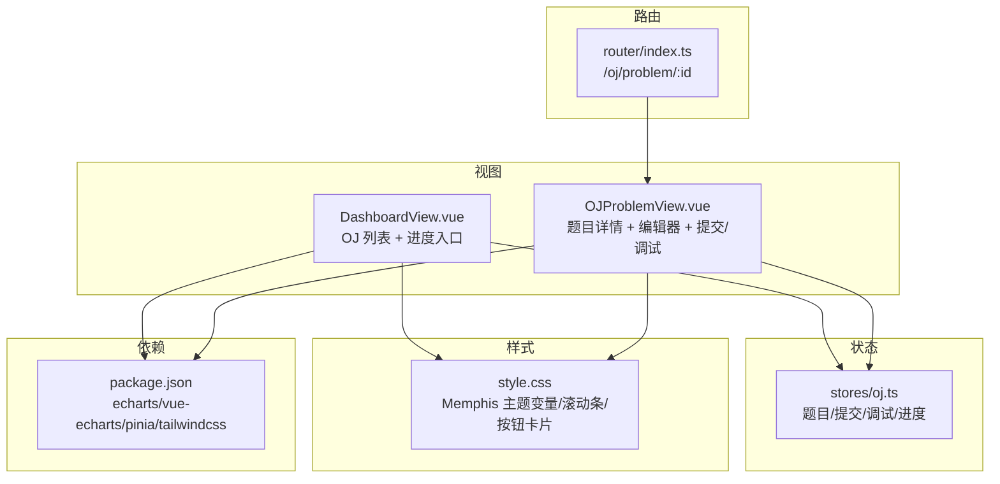
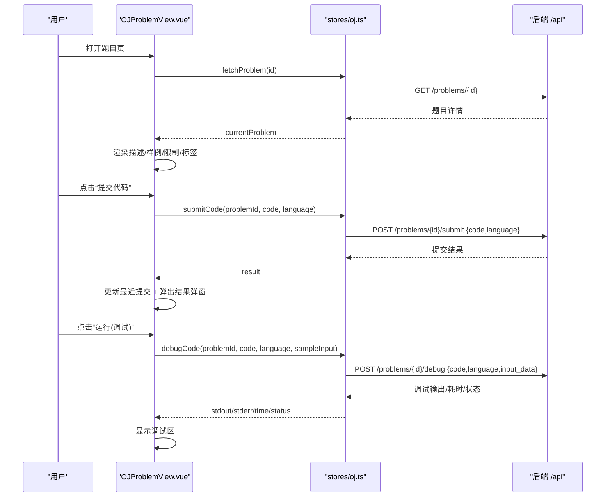
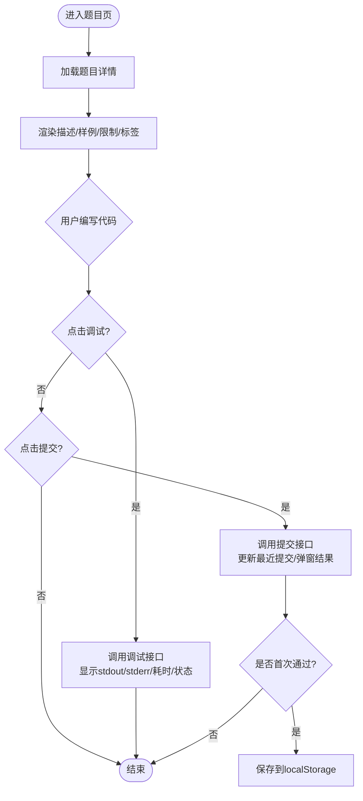
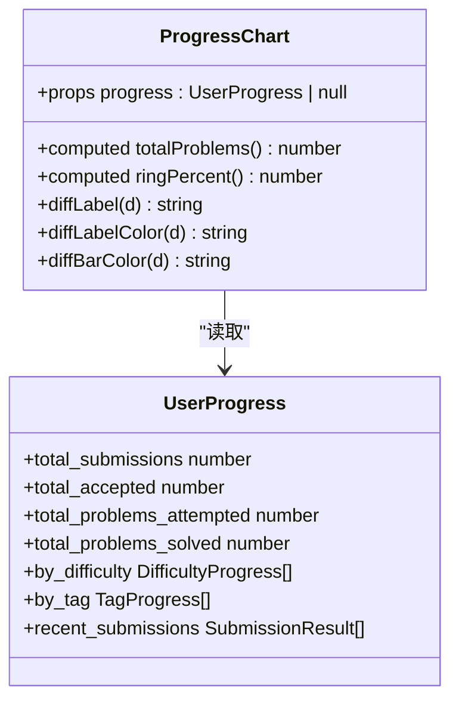
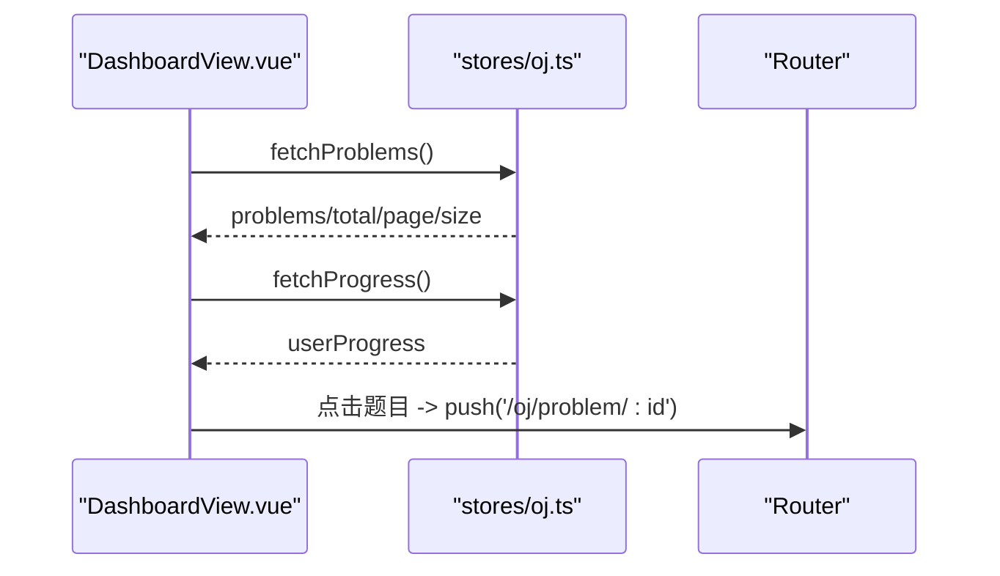
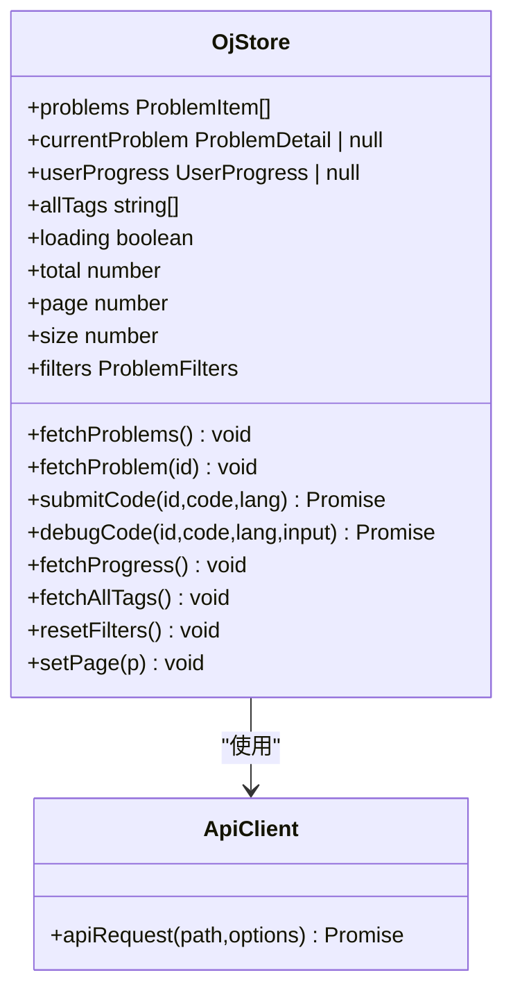
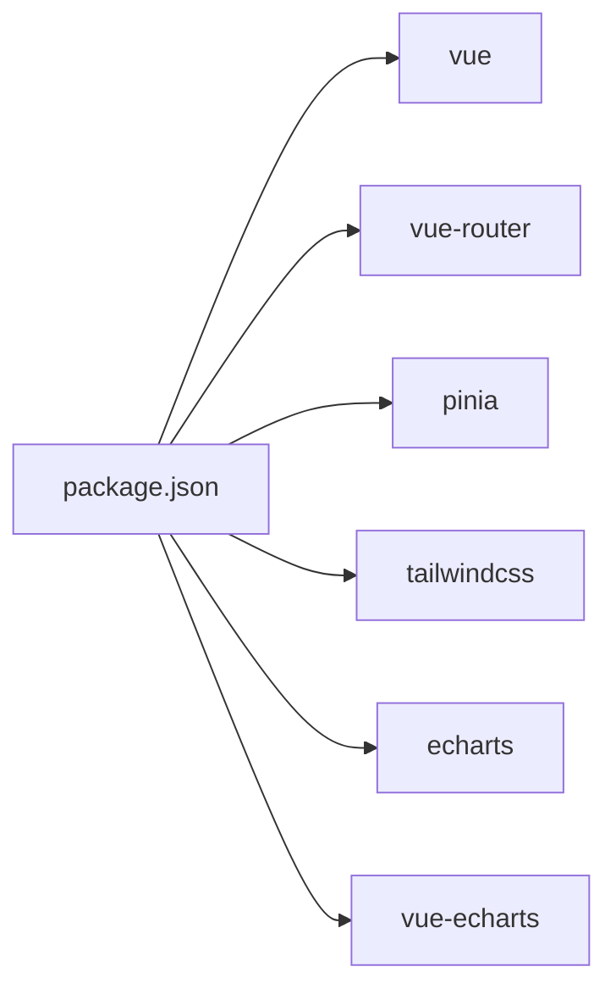

# 前端OJ界面

<cite>
**本文引用的文件**   
- [OJProblemView.vue](file://frontEnd/src/views/OJProblemView.vue)
- [ProgressChart.vue](file://frontEnd/src/components/oj/ProgressChart.vue)
- [oj.ts](file://frontEnd/src/stores/oj.ts)
- [DashboardView.vue](file://frontEnd/src/views/DashboardView.vue)
- [index.ts](file://frontEnd/src/router/index.ts)
- [style.css](file://frontEnd/src/style.css)
- [package.json](file://frontEnd/package.json)
</cite>

## 目录
1. [简介](#简介)
2. [项目结构](#项目结构)
3. [核心组件](#核心组件)
4. [架构总览](#架构总览)
5. [详细组件分析](#详细组件分析)
6. [依赖关系分析](#依赖关系分析)
7. [性能与体验优化](#性能与体验优化)
8. [故障排查指南](#故障排查指南)
9. [结论](#结论)
10. [附录：定制与主题切换方案](#附录定制与主题切换方案)

## 简介
本技术文档面向前端开发者，系统化梳理 OJ（在线判题）界面的设计与实现，覆盖题目展示、代码编辑器集成、调试与提交执行、结果可视化、进度图表、响应式适配、主题风格与可定制性。文档以仓库实际源码为依据，提供架构图、时序图、流程图与关键路径定位，帮助快速理解并扩展功能。

## 项目结构
OJ 相关的前端模块主要分布在以下位置：
- 视图层：题目详情与编辑提交页面、仪表盘中的 OJ 列表与进度面板
- 状态管理：Pinia Store 封装题目、提交、调试、进度等数据与 API 调用
- 路由：OJ 题目详情页路由定义与鉴权守卫
- 样式与主题：全局 Memphis 风格主题变量与组件样式
- 依赖：ECharts 与 Vue ECharts 用于图表渲染

图示来源
- [DashboardView.vue:246-376](file://frontEnd/src/views/DashboardView.vue#L246-L376)
- [OJProblemView.vue:1-287](file://frontEnd/src/views/OJProblemView.vue#L1-L287)
- [index.ts:37-41](file://frontEnd/src/router/index.ts#L37-L41)
- [style.css:3-16](file://frontEnd/src/style.css#L3-L16)
- [package.json:11-24](file://frontEnd/package.json#L11-L24)

章节来源
- [DashboardView.vue:246-376](file://frontEnd/src/views/DashboardView.vue#L246-L376)
- [OJProblemView.vue:1-287](file://frontEnd/src/views/OJProblemView.vue#L1-L287)
- [index.ts:37-41](file://frontEnd/src/router/index.ts#L37-L41)
- [style.css:3-16](file://frontEnd/src/style.css#L3-L16)
- [package.json:11-24](file://frontEnd/package.json#L11-L24)

## 核心组件
- 题目详情与交互页：负责题目描述渲染、样例展示、语言选择、代码输入、调试运行、提交执行、结果弹窗与最近提交记录。
- 进度图表组件：展示总完成度环形图、难度分布条形图、标签进度列表。
- OJ Store：统一封装题目列表/详情、提交/调试、用户进度与标签选项的 API 请求与错误处理。
- 仪表盘 OJ 模块：题目筛选、分页、跳转详情、加载进度图表。

章节来源
- [OJProblemView.vue:289-499](file://frontEnd/src/views/OJProblemView.vue#L289-L499)
- [ProgressChart.vue:118-153](file://frontEnd/src/components/oj/ProgressChart.vue#L118-L153)
- [oj.ts:123-267](file://frontEnd/src/stores/oj.ts#L123-L267)
- [DashboardView.vue:522-590](file://frontEnd/src/views/DashboardView.vue#L522-L590)

## 架构总览
OJ 前端采用“视图 + Pinia Store + 后端 REST”的分层架构。视图通过 Store 发起网络请求，Store 统一处理鉴权头、错误解析与返回类型；视图将结果绑定到模板进行渲染与交互。

图示来源
- [OJProblemView.vue:378-459](file://frontEnd/src/views/OJProblemView.vue#L378-L459)
- [oj.ts:168-218](file://frontEnd/src/stores/oj.ts#L168-L218)

## 详细组件分析

### 题目详情与交互页（OJProblemView.vue）
- 布局与导航
  - 顶部返回题库、题目标识、标题、难度标签、通过率与提交数统计。
  - 主内容区左右分栏：左侧题目信息，右侧代码编辑器与调试/提交区域。
- 题目描述渲染
  - 分段展示：题目描述、输入格式、输出格式、数据范围、样例数据、样例解释、判题限制、标签。
  - 样例数据支持一键复制输入+输出组合文本。
- 代码编辑器集成
  - 使用原生 textarea 作为编辑器，按语言动态生成占位模板。
  - 支持多语言选择（Python3/C/C++/Java/JavaScript）。
- 调试与提交
  - 调试：自动取第一组样例输入，调用调试接口，展示标准输出、错误输出、执行时间与状态。
  - 提交：调用提交接口，维护最近提交记录（最多10条），首次通过时保存代码与语言至 localStorage。
- 结果可视化
  - 弹窗集中展示通过/未通过、执行时间、错误详情等。
- 用户体验优化
  - 响应式网格布局，移动端单列、桌面端双列。
  - 强对比 Memphis 风格边框与阴影，提升可读性与操作反馈。
  - 键盘友好：禁用拼写检查，聚焦高亮阴影提示。

图示来源
- [OJProblemView.vue:31-154](file://frontEnd/src/views/OJProblemView.vue#L31-L154)
- [OJProblemView.vue:162-244](file://frontEnd/src/views/OJProblemView.vue#L162-L244)
- [OJProblemView.vue:378-459](file://frontEnd/src/views/OJProblemView.vue#L378-L459)
- [OJProblemView.vue:465-498](file://frontEnd/src/views/OJProblemView.vue#L465-L498)

章节来源
- [OJProblemView.vue:1-287](file://frontEnd/src/views/OJProblemView.vue#L1-L287)
- [OJProblemView.vue:289-499](file://frontEnd/src/views/OJProblemView.vue#L289-L499)

### 进度图表组件（ProgressChart.vue）
- 总览统计卡片
  - SVG 环形图展示总完成率，配合已通过/已尝试/未尝试计数。
  - 总提交与通过提交两格统计。
- 难度分布
  - 按简单/中等/困难三档绘制进度条，颜色区分难度。
- 标签进度
  - 列出各标签的解决/总数，支持滚动查看。
- 计算逻辑
  - 根据 by_difficulty 汇总 total_problems，计算环形百分比。
  - 难度标签与颜色映射函数复用。

图示来源
- [ProgressChart.vue:118-153](file://frontEnd/src/components/oj/ProgressChart.vue#L118-L153)
- [oj.ts:74-82](file://frontEnd/src/stores/oj.ts#L74-L82)

章节来源
- [ProgressChart.vue:1-154](file://frontEnd/src/components/oj/ProgressChart.vue#L1-L154)
- [oj.ts:74-82](file://frontEnd/src/stores/oj.ts#L74-L82)

### 仪表盘 OJ 模块（DashboardView.vue）
- 题目列表
  - 难度筛选、关键词搜索、分页控件。
  - 表格展示 ID、标题、难度、标签、通过率、是否已解。
- 进度面板
  - 右侧嵌入 ProgressChart 组件，实时展示用户刷题进度。
- 交互流程
  - 点击行跳转到 /oj/problem/:id。
  - 初始化时拉取题目列表与用户进度。

图示来源
- [DashboardView.vue:522-590](file://frontEnd/src/views/DashboardView.vue#L522-L590)
- [oj.ts:147-179](file://frontEnd/src/stores/oj.ts#L147-L179)

章节来源
- [DashboardView.vue:246-376](file://frontEnd/src/views/DashboardView.vue#L246-L376)
- [DashboardView.vue:522-590](file://frontEnd/src/views/DashboardView.vue#L522-L590)

### 路由与鉴权（router/index.ts）
- OJ 题目详情页路由：/oj/problem/:id，标记需要登录。
- 全局前置守卫：未登录访问需认证页面跳转至 /auth；已登录访问 /auth 跳转至 /dashboard。

章节来源
- [index.ts:37-41](file://frontEnd/src/router/index.ts#L37-L41)
- [index.ts:138-164](file://frontEnd/src/router/index.ts#L138-L164)

### 状态管理与 API 封装（stores/oj.ts）
- 数据结构
  - ProblemItem/ProblemDetail/SubmissionResult/DebugResult/UserProgress 等类型定义。
- API 客户端
  - 统一 apiRequest 方法：注入 Authorization 头、处理非 200 响应、抛出结构化错误。
- Actions
  - fetchProblems/fetchProblem：带分页与过滤参数构建查询字符串。
  - submitCode/debugCode：提交与调试接口封装，返回成功/失败包装对象。
  - fetchProgress/fetchAllTags：获取用户进度与标签选项。
  - resetFilters/setPage：重置与翻页控制。

图示来源
- [oj.ts:94-113](file://frontEnd/src/stores/oj.ts#L94-L113)
- [oj.ts:123-267](file://frontEnd/src/stores/oj.ts#L123-L267)

章节来源
- [oj.ts:1-268](file://frontEnd/src/stores/oj.ts#L1-L268)

## 依赖关系分析
- 运行时依赖
  - vue、vue-router、pinia：框架与路由、状态管理。
  - tailwindcss/@tailwindcss/vite：原子化样式与构建插件。
  - echarts、vue-echarts：图表库（当前进度图表使用原生 SVG，但已引入 ECharts 便于后续扩展）。
- 构建与开发
  - vite、@vitejs/plugin-vue、typescript、vue-tsc：开发与类型检查。

图示来源
- [package.json:11-24](file://frontEnd/package.json#L11-L24)

章节来源
- [package.json:1-35](file://frontEnd/package.json#L1-L35)

## 性能与体验优化
- 渲染与交互
  - 使用 computed 缓存派生数据（如 samples、ringPercent、paginatedProblems），减少重复计算。
  - 列表分页与局部刷新，避免全量重绘。
- 网络与错误
  - 统一错误捕获与消息提示，避免 UI 崩溃。
  - 提交/调试前校验空输入与题目加载状态，降低无效请求。
- 本地持久化
  - 首次通过的代码与语言保存在 localStorage，提升复练效率。
- 视觉与可访问性
  - 固定字体族与等宽字体，增强代码可读性。
  - 强对比边框与阴影，明确交互边界与焦点态。
  - 自定义滚动条样式，保持整体风格一致。

[本节为通用指导，不直接分析具体文件]

## 故障排查指南
- 无法加载题目详情
  - 检查路由参数 id 是否正确传入。
  - 确认后端 /problems/{id} 可达且返回正常 JSON。
  - 查看控制台错误信息，关注 apiRequest 抛出的 detail 字段。
- 提交/调试失败
  - 确认 Authorization 头存在（token 是否过期或丢失）。
  - 检查请求体字段是否符合后端期望（如 input_data、language）。
  - 若返回 204 或其他非 JSON 响应，注意 apiRequest 的处理分支。
- 进度图表无数据
  - 确认 /problems/progress 接口可用。
  - 检查 UserProgress 结构是否与组件预期一致（by_difficulty/by_tag/recent_submissions）。
- 本地存储异常
  - 清理浏览器 localStorage 中对应 key，重新触发一次通过流程。

章节来源
- [oj.ts:94-113](file://frontEnd/src/stores/oj.ts#L94-L113)
- [OJProblemView.vue:378-459](file://frontEnd/src/views/OJProblemView.vue#L378-L459)
- [ProgressChart.vue:118-153](file://frontEnd/src/components/oj/ProgressChart.vue#L118-L153)

## 结论
该 OJ 前端界面以清晰的层次结构与一致的 Memphis 风格设计，实现了从题目浏览、详情阅读、代码编写、调试与提交到结果可视化的完整闭环。通过 Pinia Store 统一管理数据与网络请求，结合响应式布局与本地持久化，提供了良好的用户体验与可扩展性。后续可在图表维度（时间趋势、标签热度）、编辑器能力（语法高亮、自动补全）与主题系统方面持续演进。

[本节为总结性内容，不直接分析具体文件]

## 附录：定制与主题切换方案
- 主题变量与风格
  - 在 style.css 的 @theme 块中定义 Memphis 色系与字体变量，所有组件通过 Tailwind 类名引用这些变量，便于统一替换。
  - 全局滚动条、按钮、卡片等样式集中在 style.css，确保一致性。
- 主题切换机制建议
  - 在根节点挂载 data-theme 属性，利用 CSS 变量与 Tailwind 的 theme 配置实现明暗/品牌色切换。
  - 将常用配色抽取为可配置对象，由设置页或用户偏好驱动切换。
- 代码高亮与实时预览
  - 当前使用原生 textarea，如需语法高亮与智能提示，可接入 monaco-editor 或 codemirror，并在 OJProblemView 中替换编辑器区域。
  - 实时预览可通过监听输入事件，对正则/小片段进行轻量级校验与提示（注意性能与防抖）。
- 进度图表扩展
  - 当前使用原生 SVG 与 CSS 动画，如需更丰富的交互与动画，可迁移至 echarts/vue-echarts，增加折线/柱状/饼图等。
  - 新增“时间趋势分析”可按周/月聚合提交与通过数量，形成趋势图。
- 响应式适配
  - 使用 Tailwind 栅格与断点，保证移动端单列、桌面端双列布局。
  - 针对小屏设备优化字号与间距，确保可读性与触控友好。

章节来源
- [style.css:3-16](file://frontEnd/src/style.css#L3-L16)
- [style.css:53-86](file://frontEnd/src/style.css#L53-L86)
- [style.css:92-136](file://frontEnd/src/style.css#L92-L136)
- [package.json:11-24](file://frontEnd/package.json#L11-L24)