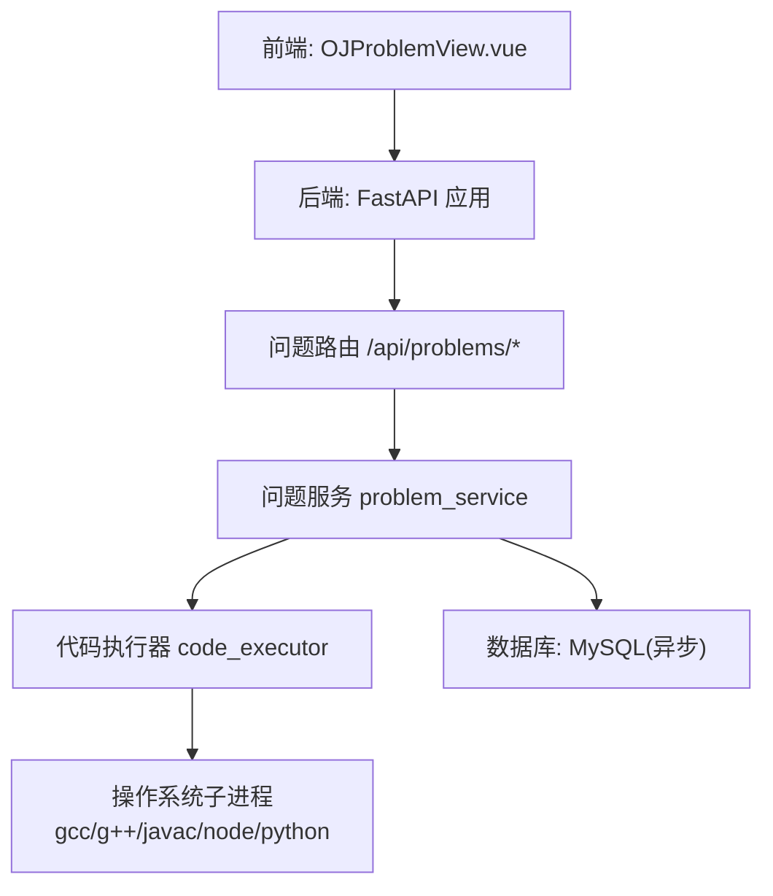
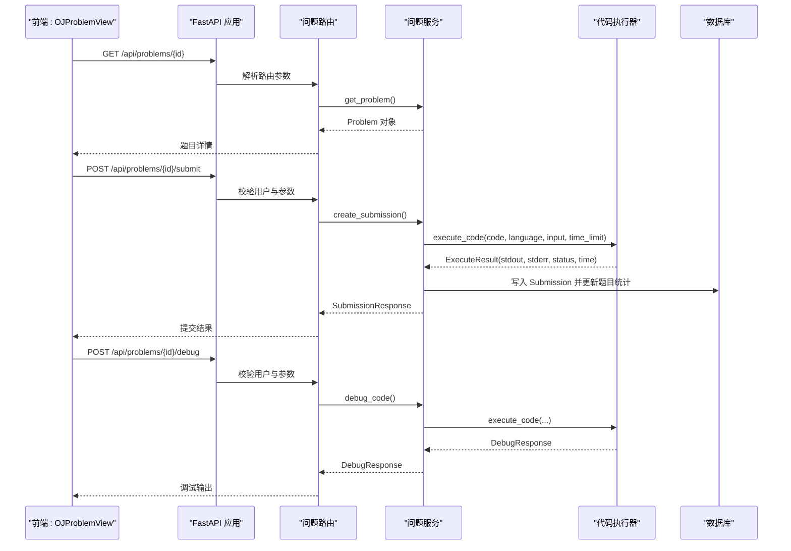
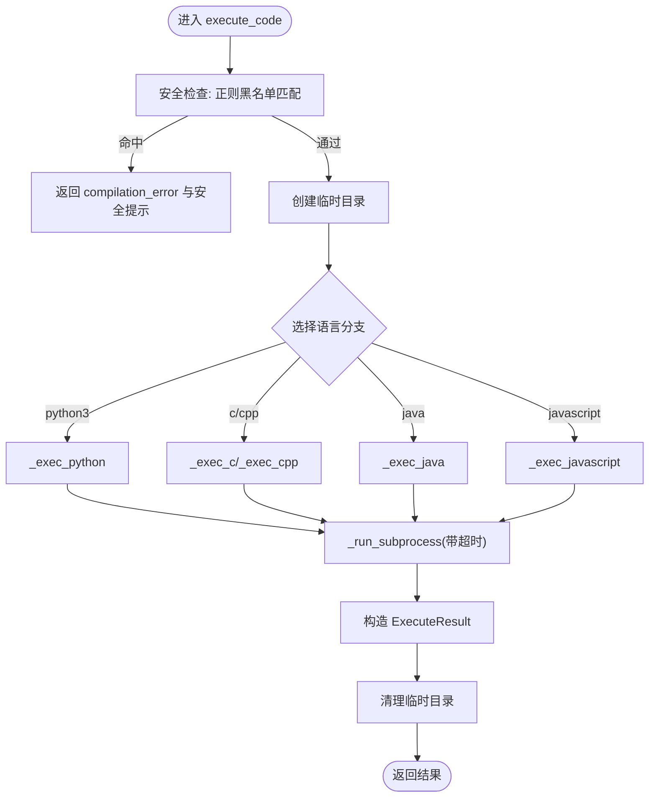
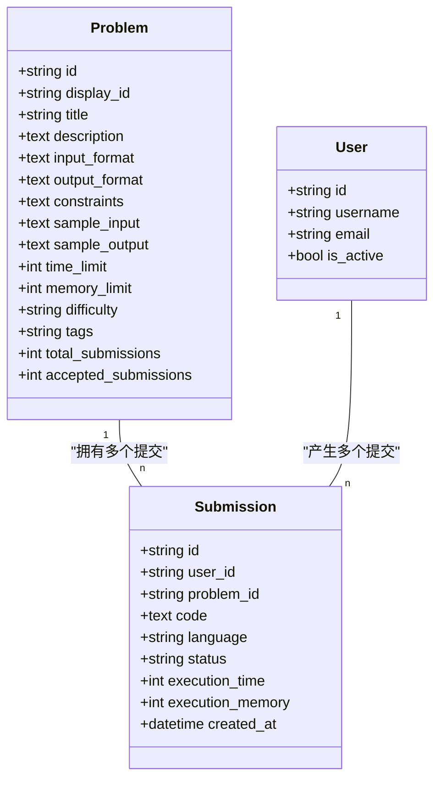
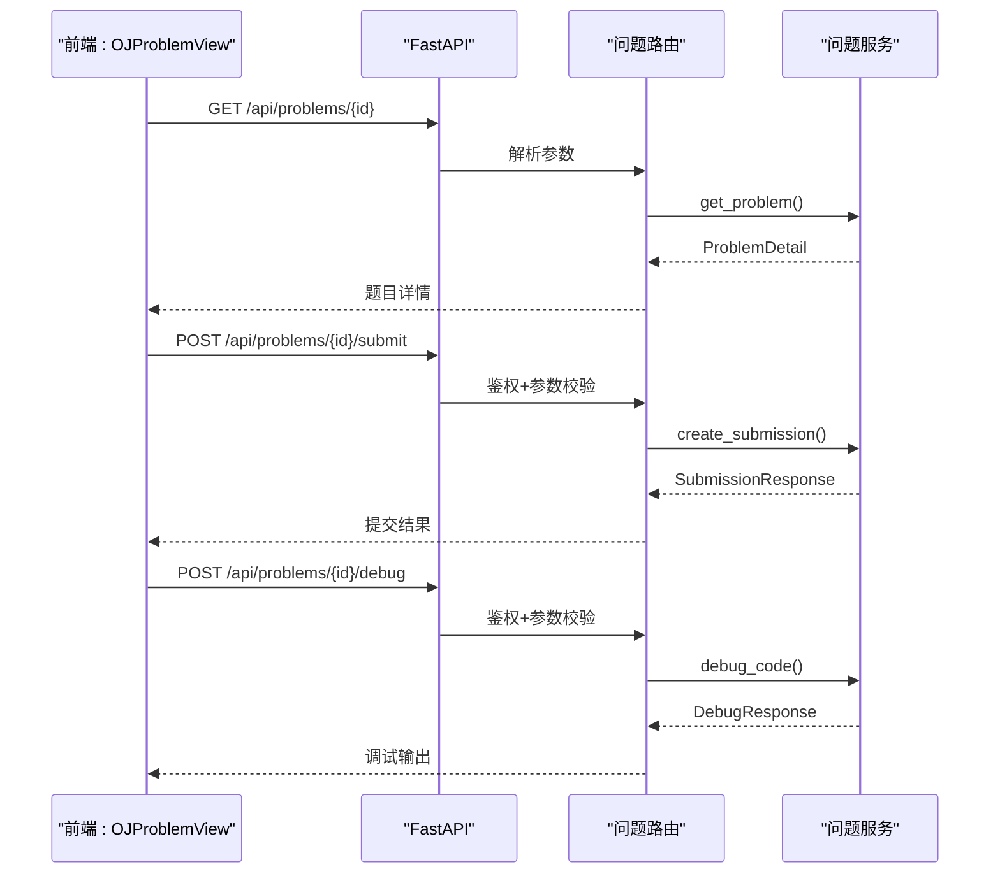
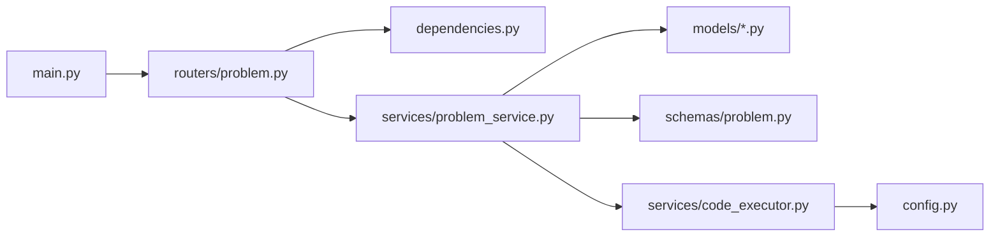

# 在线编程平台

<cite>
**本文引用的文件**   
- [backEnd/app/main.py](file://backEnd/app/main.py)
- [backEnd/app/config.py](file://backEnd/app/config.py)
- [backEnd/app/database.py](file://backEnd/app/database.py)
- [backEnd/app/dependencies.py](file://backEnd/app/dependencies.py)
- [backEnd/app/models/problem.py](file://backEnd/app/models/problem.py)
- [backEnd/app/models/user.py](file://backEnd/app/models/user.py)
- [backEnd/app/routers/problem.py](file://backEnd/app/routers/problem.py)
- [backEnd/app/schemas/problem.py](file://backEnd/app/schemas/problem.py)
- [backEnd/app/services/code_executor.py](file://backEnd/app/services/code_executor.py)
- [backEnd/app/services/problem_service.py](file://backEnd/app/services/problem_service.py)
- [frontEnd/src/views/OJProblemView.vue](file://frontEnd/src/views/OJProblemView.vue)
</cite>

## 目录
1. [简介](#简介)
2. [项目结构](#项目结构)
3. [核心组件](#核心组件)
4. [架构总览](#架构总览)
5. [详细组件分析](#详细组件分析)
6. [依赖关系分析](#依赖关系分析)
7. [性能与扩展性](#性能与扩展性)
8. [故障排查指南](#故障排查指南)
9. [结论](#结论)
10. [附录：API 参考](#附录api-参考)

## 简介
本仓库实现了一个面向在线编程（OJ）的后端服务与前端刷题界面，支持多语言代码提交、样例判题、调试运行、用户进度统计等能力。后端基于 FastAPI + SQLAlchemy 异步 ORM，使用子进程执行器在安全策略下编译并运行用户代码；前端采用 Vue 3 + TypeScript 提供题目展示、代码编辑、调试与提交交互。

## 项目结构
- 后端
  - 应用入口与中间件：路由挂载、CORS、静态资源、健康检查
  - 配置与环境变量：数据库、JWT、编译器路径、CORS 白名单
  - 数据模型：题目、提交记录、用户
  - 路由层：题目列表/详情、提交判题、调试接口
  - 服务层：题目查询、提交判题流程、进度统计、种子数据初始化
  - 代码执行器：多语言安全沙箱、编译器集成、超时控制
- 前端
  - OJ 页面：题目信息展示、代码编辑器、调试区、最近提交记录、结果弹窗

图表来源
- [backEnd/app/main.py:44-68](file://backEnd/app/main.py#L44-L68)
- [backEnd/app/routers/problem.py:1-175](file://backEnd/app/routers/problem.py#L1-L175)
- [backEnd/app/services/problem_service.py:95-202](file://backEnd/app/services/problem_service.py#L95-L202)
- [backEnd/app/services/code_executor.py:270-321](file://backEnd/app/services/code_executor.py#L270-L321)
- [backEnd/app/database.py:31-43](file://backEnd/app/database.py#L31-L43)

章节来源
- [backEnd/app/main.py:44-90](file://backEnd/app/main.py#L44-L90)
- [backEnd/app/routers/problem.py:1-175](file://backEnd/app/routers/problem.py#L1-L175)
- [backEnd/app/services/problem_service.py:1-202](file://backEnd/app/services/problem_service.py#L1-L202)
- [backEnd/app/services/code_executor.py:1-321](file://backEnd/app/services/code_executor.py#L1-L321)
- [backEnd/app/database.py:1-58](file://backEnd/app/database.py#L1-L58)
- [frontEnd/src/views/OJProblemView.vue:1-500](file://frontEnd/src/views/OJProblemView.vue#L1-L500)

## 核心组件
- 应用启动与生命周期
  - 启动时自动建表并初始化种子题目与面试题库
  - 注册 CORS、挂载上传目录、统一验证错误处理与健康检查
- 配置管理
  - 从 .env 加载数据库、JWT、MinIO、CORS、编译器路径等
  - 提供数据库 URL 拼接与 CORS 源解析
- 数据库连接
  - 异步引擎与会话工厂，兼容 aiomysql ping 签名差异
  - 请求级依赖注入 get_db
- 认证依赖
  - Bearer Token 校验，解析 JWT 载荷并获取当前用户
- 题目与提交模型
  - Problem 包含题目元数据、样例输入输出、限制与统计字段
  - Submission 记录每次提交的代码、语言、状态、耗时等
- 路由与服务
  - 题目列表/详情、标签选项、用户进度
  - 提交判题：解析样例、逐组执行、比较输出、持久化提交记录
  - 调试接口：直接执行并返回 stdout/stderr/状态
- 代码执行器
  - 多语言黑名单安全检查
  - 通过子进程调用编译器/解释器，设置超时
  - 临时目录隔离，执行后清理

章节来源
- [backEnd/app/main.py:27-90](file://backEnd/app/main.py#L27-L90)
- [backEnd/app/config.py:1-71](file://backEnd/app/config.py#L1-L71)
- [backEnd/app/database.py:1-58](file://backEnd/app/database.py#L1-L58)
- [backEnd/app/dependencies.py:1-41](file://backEnd/app/dependencies.py#L1-L41)
- [backEnd/app/models/problem.py:1-88](file://backEnd/app/models/problem.py#L1-L88)
- [backEnd/app/models/user.py:1-45](file://backEnd/app/models/user.py#L1-L45)
- [backEnd/app/routers/problem.py:1-175](file://backEnd/app/routers/problem.py#L1-L175)
- [backEnd/app/services/problem_service.py:1-202](file://backEnd/app/services/problem_service.py#L1-L202)
- [backEnd/app/services/code_executor.py:1-321](file://backEnd/app/services/code_executor.py#L1-L321)

## 架构总览
系统采用前后端分离的 RESTful 架构。前端通过 HTTP 调用后端 API，后端在服务层编排业务逻辑，并通过代码执行器以子进程方式运行用户代码，最终将结果持久化到数据库并返回给前端。

图表来源
- [backEnd/app/routers/problem.py:102-175](file://backEnd/app/routers/problem.py#L102-L175)
- [backEnd/app/services/problem_service.py:95-202](file://backEnd/app/services/problem_service.py#L95-L202)
- [backEnd/app/services/code_executor.py:270-321](file://backEnd/app/services/code_executor.py#L270-L321)

## 详细组件分析

### 代码执行器与安全沙箱
- 安全策略
  - 跨语言通用危险关键词拦截（如系统命令、网络监听、进程控制等）
  - 按语言定制的危险模式集合（Python/C/C++/Java/JavaScript），覆盖文件系统、动态导入、反射、环境变量泄露等
  - 匹配失败即拒绝执行，并返回明确的安全拦截消息
- 编译器集成
  - 支持 Python3、C、C++、Java、JavaScript
  - 编译器路径优先从配置读取，否则自动从 PATH 检测
  - C/C++ 使用 gcc/g++ 编译，Java 使用 javac 指定 UTF-8 编码，Node.js 直接运行脚本
- 运行时环境
  - 为每次执行创建独立临时目录，避免文件污染
  - 通过线程池异步包装子进程执行，支持超时控制
  - 统一封装执行结果（标准输出、标准错误、退出码、耗时、状态）
- 内存与时间限制
  - 时间限制由调用方传入（题目 time_limit），执行器内部通过 subprocess timeout 控制
  - 内存限制目前未做进程级限制，可在部署侧通过容器或系统资源限制实现

图表来源
- [backEnd/app/services/code_executor.py:154-167](file://backEnd/app/services/code_executor.py#L154-L167)
- [backEnd/app/services/code_executor.py:270-321](file://backEnd/app/services/code_executor.py#L270-L321)
- [backEnd/app/services/code_executor.py:323-444](file://backEnd/app/services/code_executor.py#L323-L444)

章节来源
- [backEnd/app/services/code_executor.py:1-444](file://backEnd/app/services/code_executor.py#L1-L444)

### 题目管理与提交判题
- 数据模型
  - Problem：题目描述、输入输出格式、约束、样例、难度、标签、通过率统计、时间/内存限制
  - Submission：用户、题目、代码、语言、状态、耗时、创建时间
- 提交判题流程
  - 解析题目中的样例输入/输出 JSON
  - 对每组样例调用执行器，累计最大耗时
  - 根据执行状态判定：编译错误、超时、运行时错误、答案不匹配、通过
  - 持久化提交记录，并更新题目总提交数与通过数
- 调试接口
  - 直接执行用户代码并返回 stdout/stderr/退出码/耗时/状态，便于本地联调
- 进度统计
  - 计算用户总提交/通过数、尝试/通过题目数
  - 按难度与标签维度聚合统计
  - 返回最近提交记录（截断代码片段）

图表来源
- [backEnd/app/models/problem.py:17-88](file://backEnd/app/models/problem.py#L17-L88)
- [backEnd/app/models/user.py:10-45](file://backEnd/app/models/user.py#L10-L45)

章节来源
- [backEnd/app/models/problem.py:1-88](file://backEnd/app/models/problem.py#L1-L88)
- [backEnd/app/models/user.py:1-45](file://backEnd/app/models/user.py#L1-L45)
- [backEnd/app/services/problem_service.py:95-202](file://backEnd/app/services/problem_service.py#L95-L202)
- [backEnd/app/services/problem_service.py:249-367](file://backEnd/app/services/problem_service.py#L249-L367)

### 路由与前端交互
- 路由设计
  - 列表与筛选：GET /api/problems，支持难度、标签、关键字、分页
  - 详情：GET /api/problems/{problem_id}
  - 提交：POST /api/problems/{problem_id}/submit
  - 调试：POST /api/problems/{problem_id}/debug
  - 标签选项：GET /api/problems/tags/options
  - 用户进度：GET /api/problems/progress
- 前端页面
  - 展示题目描述、输入输出格式、数据范围、样例与限制
  - 提供代码编辑器与语言选择，支持“提交”和“调试运行”
  - 显示最近提交记录与结果弹窗（含错误详情）

图表来源
- [backEnd/app/routers/problem.py:47-175](file://backEnd/app/routers/problem.py#L47-L175)
- [backEnd/app/services/problem_service.py:182-202](file://backEnd/app/services/problem_service.py#L182-L202)
- [frontEnd/src/views/OJProblemView.vue:378-459](file://frontEnd/src/views/OJProblemView.vue#L378-L459)

章节来源
- [backEnd/app/routers/problem.py:1-175](file://backEnd/app/routers/problem.py#L1-L175)
- [frontEnd/src/views/OJProblemView.vue:1-500](file://frontEnd/src/views/OJProblemView.vue#L1-L500)

### 配置与环境
- 配置文件
  - 数据库连接字符串生成（MySQL 异步/同步）
  - JWT 密钥、算法、过期时间
  - CORS 白名单解析
  - 编译器路径可选配置，未配置则自动检测
- 应用启动
  - 生命周期钩子中创建表与初始化种子数据
  - 挂载静态上传目录，暴露 /api/uploads

章节来源
- [backEnd/app/config.py:1-71](file://backEnd/app/config.py#L1-L71)
- [backEnd/app/main.py:27-73](file://backEnd/app/main.py#L27-L73)

## 依赖关系分析
- 模块耦合
  - main.py 负责组装路由与中间件，低耦合地引入各 router
  - routers/problem.py 依赖 dependencies.get_current_user 进行鉴权，依赖 services.problem_service 执行业务
  - services.problem_service 依赖 models 与 schemas，同时调用 services.code_executor
  - code_executor 仅依赖 config 获取编译器路径，无外部框架耦合
- 外部依赖
  - FastAPI、SQLAlchemy 异步、aiomysql/pymysql、Pydantic Settings
  - 操作系统子进程（gcc/g++/javac/node/python）

图表来源
- [backEnd/app/main.py:44-68](file://backEnd/app/main.py#L44-L68)
- [backEnd/app/routers/problem.py:1-45](file://backEnd/app/routers/problem.py#L1-L45)
- [backEnd/app/services/problem_service.py:1-18](file://backEnd/app/services/problem_service.py#L1-L18)
- [backEnd/app/services/code_executor.py:17-19](file://backEnd/app/services/code_executor.py#L17-L19)

章节来源
- [backEnd/app/main.py:44-68](file://backEnd/app/main.py#L44-L68)
- [backEnd/app/routers/problem.py:1-45](file://backEnd/app/routers/problem.py#L1-L45)
- [backEnd/app/services/problem_service.py:1-18](file://backEnd/app/services/problem_service.py#L1-L18)
- [backEnd/app/services/code_executor.py:17-19](file://backEnd/app/services/code_executor.py#L17-L19)

## 性能与扩展性
- 并发与阻塞
  - 子进程执行通过线程池异步包装，避免阻塞事件循环
  - 建议在生产环境调整线程池大小与队列长度，结合系统 CPU 核数与 I/O 负载
- 超时与资源限制
  - 时间限制通过子进程超时控制；内存限制建议在容器或系统层面实施（cgroups、Docker 限制）
- 编译器路径
  - 支持 .env 显式配置，提升部署可移植性与稳定性
- 可扩展点
  - 新增语言：在 LANG_MAP 与 _DANGEROUS_PATTERNS 中添加规则，并实现对应 _exec_xxx 函数
  - 增强安全：引入更严格的白名单机制或沙箱（如 gVisor、Firecracker）
  - 性能分析：在执行器中采集进程 RSS/峰值内存，完善 execution_memory 估算

[本节为通用指导，不涉及具体文件分析]

## 故障排查指南
- 常见错误
  - 编译错误：查看提交响应中的 error_detail，通常为编译器 stderr 内容
  - 运行时错误：stderr 包含异常堆栈或崩溃信息
  - 超时：status 为 time_limit_exceeded，需优化算法复杂度
  - 答案错误：stdout 与期望输出不一致，注意换行与空白处理
- 调试技巧
  - 使用调试接口 POST /api/problems/{id}/debug 快速验证代码行为
  - 前端调试区域会显示 stdout/stderr/耗时/状态，便于定位问题
- 安全拦截
  - 若出现“代码包含禁止的操作”，说明触发了黑名单规则，请移除危险调用或重构实现

章节来源
- [backEnd/app/services/problem_service.py:130-156](file://backEnd/app/services/problem_service.py#L130-L156)
- [backEnd/app/services/code_executor.py:154-167](file://backEnd/app/services/code_executor.py#L154-L167)
- [frontEnd/src/views/OJProblemView.vue:418-459](file://frontEnd/src/views/OJProblemView.vue#L418-L459)

## 结论
该在线编程平台在后端实现了多语言代码执行的安全沙箱与编译器集成，在前端提供了完整的刷题体验。通过清晰的分层设计与模块化组织，系统在安全性、可维护性与可扩展性方面具备良好基础。生产部署建议加强资源限制与日志审计，持续完善安全策略与性能监控。

[本节为总结，不涉及具体文件分析]

## 附录：API 参考
- 题目列表
  - 方法：GET
  - 路径：/api/problems
  - 查询参数：difficulty、tag、keyword、page、size
  - 响应：ProblemListResponse
- 标签选项
  - 方法：GET
  - 路径：/api/problems/tags/options
  - 响应：{tags: string[]}
- 用户进度
  - 方法：GET
  - 路径：/api/problems/progress
  - 鉴权：需要 Bearer Token
  - 响应：UserProgressResponse
- 题目详情
  - 方法：GET
  - 路径：/api/problems/{problem_id}
  - 响应：ProblemDetail
- 提交代码
  - 方法：POST
  - 路径：/api/problems/{problem_id}/submit
  - 鉴权：需要 Bearer Token
  - 请求体：SubmissionCreate
  - 响应：SubmissionResponse
- 调试代码
  - 方法：POST
  - 路径：/api/problems/{problem_id}/debug
  - 鉴权：需要 Bearer Token
  - 请求体：DebugRequest
  - 响应：DebugResponse

章节来源
- [backEnd/app/routers/problem.py:47-175](file://backEnd/app/routers/problem.py#L47-L175)
- [backEnd/app/schemas/problem.py:59-130](file://backEnd/app/schemas/problem.py#L59-L130)