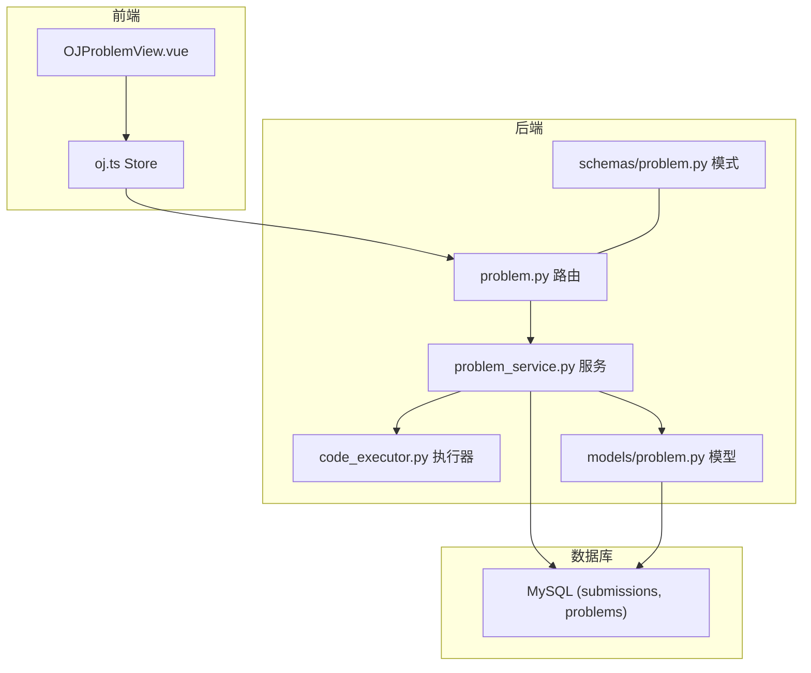
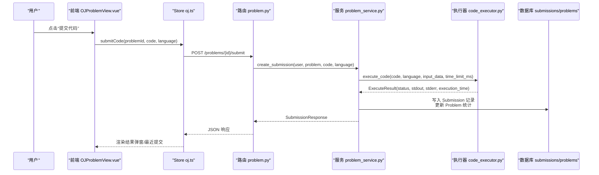
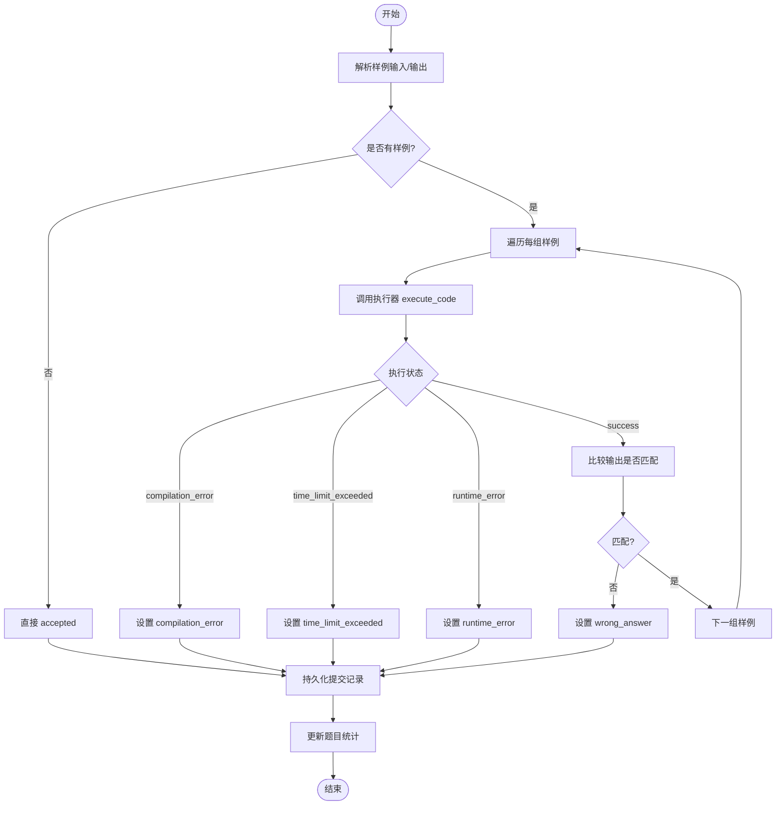
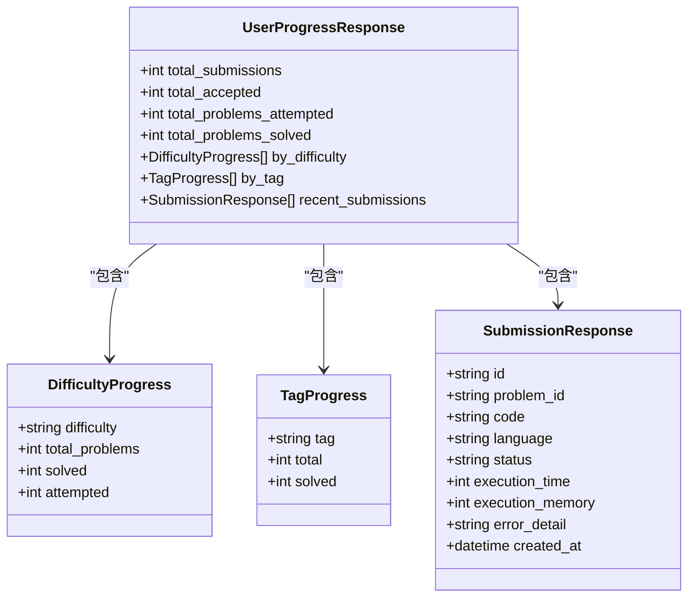
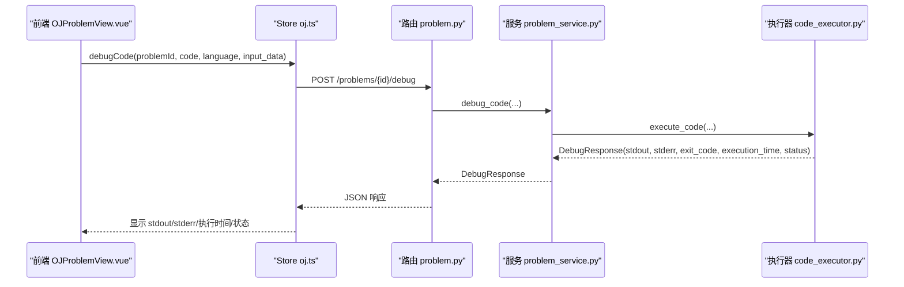
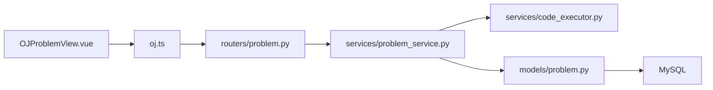

# 提交记录追踪

<cite>
**本文引用的文件**   
- [backEnd/app/services/code_executor.py](file://backEnd/app/services/code_executor.py)
- [backEnd/app/services/problem_service.py](file://backEnd/app/services/problem_service.py)
- [backEnd/app/models/problem.py](file://backEnd/app/models/problem.py)
- [backEnd/app/routers/problem.py](file://backEnd/app/routers/problem.py)
- [backEnd/app/schemas/problem.py](file://backEnd/app/schemas/problem.py)
- [frontEnd/src/stores/oj.ts](file://frontEnd/src/stores/oj.ts)
- [frontEnd/src/views/OJProblemView.vue](file://frontEnd/src/views/OJProblemView.vue)
- [hr_interview.sql](file://hr_interview.sql)
</cite>

## 目录
1. [简介](#简介)
2. [项目结构](#项目结构)
3. [核心组件](#核心组件)
4. [架构总览](#架构总览)
5. [详细组件分析](#详细组件分析)
6. [依赖关系分析](#依赖关系分析)
7. [性能与优化](#性能与优化)
8. [故障排查指南](#故障排查指南)
9. [结论](#结论)
10. [附录：API 定义](#附录api-定义)

## 简介
本技术文档围绕“提交记录追踪系统”展开，聚焦代码提交的生命周期管理、状态流转、执行队列处理、结果缓存机制、用户进度统计（解题数量、通过率、难度分布）、调试日志收集与分析（标准输出捕获、错误堆栈解析、性能指标记录），以及提交历史查询、代码对比与版本回溯等高级能力。同时提供提交优化策略与性能监控方案，帮助开发者提升代码执行效率与可观测性。

## 项目结构
后端采用 FastAPI + SQLAlchemy 异步 ORM，前端使用 Vue 3 + Pinia。核心路径：
- 路由层：/api/problems/*
- 服务层：题目与提交业务逻辑、判题编排
- 执行器：子进程隔离执行用户代码，支持多语言
- 数据模型：题目、提交记录
- 前端：题库浏览、题目详情、提交与调试、进度可视化

图表来源
- [backEnd/app/routers/problem.py:1-175](file://backEnd/app/routers/problem.py#L1-L175)
- [backEnd/app/services/problem_service.py:1-206](file://backEnd/app/services/problem_service.py#L1-L206)
- [backEnd/app/services/code_executor.py:1-444](file://backEnd/app/services/code_executor.py#L1-L444)
- [backEnd/app/models/problem.py:1-88](file://backEnd/app/models/problem.py#L1-L88)
- [backEnd/app/schemas/problem.py:1-130](file://backEnd/app/schemas/problem.py#L1-L130)
- [frontEnd/src/views/OJProblemView.vue:1-500](file://frontEnd/src/views/OJProblemView.vue#L1-L500)
- [frontEnd/src/stores/oj.ts:1-268](file://frontEnd/src/stores/oj.ts#L1-L268)

章节来源
- [backEnd/app/routers/problem.py:1-175](file://backEnd/app/routers/problem.py#L1-L175)
- [backEnd/app/services/problem_service.py:1-206](file://backEnd/app/services/problem_service.py#L1-L206)
- [backEnd/app/services/code_executor.py:1-444](file://backEnd/app/services/code_executor.py#L1-L444)
- [backEnd/app/models/problem.py:1-88](file://backEnd/app/models/problem.py#L1-L88)
- [backEnd/app/schemas/problem.py:1-130](file://backEnd/app/schemas/problem.py#L1-L130)
- [frontEnd/src/views/OJProblemView.vue:1-500](file://frontEnd/src/views/OJProblemView.vue#L1-L500)
- [frontEnd/src/stores/oj.ts:1-268](file://frontEnd/src/stores/oj.ts#L1-L268)

## 核心组件
- 路由层：提供题目列表、详情、提交、调试、进度统计接口
- 服务层：封装提交判题流程、用户进度统计、标签聚合
- 执行器：安全校验、编译/运行、超时控制、资源清理
- 数据模型：题目与提交记录持久化
- 前端：交互、调用 API、展示结果与进度

章节来源
- [backEnd/app/routers/problem.py:1-175](file://backEnd/app/routers/problem.py#L1-L175)
- [backEnd/app/services/problem_service.py:1-206](file://backEnd/app/services/problem_service.py#L1-L206)
- [backEnd/app/services/code_executor.py:1-444](file://backEnd/app/services/code_executor.py#L1-L444)
- [backEnd/app/models/problem.py:1-88](file://backEnd/app/models/problem.py#L1-L88)
- [frontEnd/src/stores/oj.ts:1-268](file://frontEnd/src/stores/oj.ts#L1-L268)
- [frontEnd/src/views/OJProblemView.vue:1-500](file://frontEnd/src/views/OJProblemView.vue#L1-L500)

## 架构总览
提交生命周期从前端发起，经路由到服务层，服务层组织样例输入并调用执行器；执行器在隔离环境中编译/运行用户代码，返回统一结果；服务层根据结果判定状态并落库，更新题目统计；前端展示提交结果与调试信息。

图表来源
- [backEnd/app/routers/problem.py:121-151](file://backEnd/app/routers/problem.py#L121-L151)
- [backEnd/app/services/problem_service.py:95-179](file://backEnd/app/services/problem_service.py#L95-L179)
- [backEnd/app/services/code_executor.py:270-321](file://backEnd/app/services/code_executor.py#L270-L321)
- [frontEnd/src/views/OJProblemView.vue:378-416](file://frontEnd/src/views/OJProblemView.vue#L378-L416)
- [frontEnd/src/stores/oj.ts:181-198](file://frontEnd/src/stores/oj.ts#L181-L198)

## 详细组件分析

### 提交状态流转与判题流程
- 入口：POST /problems/{id}/submit
- 步骤：
  - 解析题目样例输入/输出
  - 逐组样例调用执行器
  - 根据执行结果判定状态：accepted、compilation_error、time_limit_exceeded、runtime_error、wrong_answer
  - 持久化提交记录，更新题目总提交数与通过数
- 关键实现位置：
  - 路由：[backEnd/app/routers/problem.py:121-151](file://backEnd/app/routers/problem.py#L121-L151)
  - 服务：[backEnd/app/services/problem_service.py:95-179](file://backEnd/app/services/problem_service.py#L95-L179)
  - 执行器：[backEnd/app/services/code_executor.py:270-321](file://backEnd/app/services/code_executor.py#L270-L321)

图表来源
- [backEnd/app/services/problem_service.py:102-179](file://backEnd/app/services/problem_service.py#L102-L179)
- [backEnd/app/services/code_executor.py:270-321](file://backEnd/app/services/code_executor.py#L270-L321)

章节来源
- [backEnd/app/routers/problem.py:121-151](file://backEnd/app/routers/problem.py#L121-L151)
- [backEnd/app/services/problem_service.py:95-179](file://backEnd/app/services/problem_service.py#L95-L179)
- [backEnd/app/services/code_executor.py:270-321](file://backEnd/app/services/code_executor.py#L270-L321)

### 执行队列与并发处理
- 当前实现：每个提交同步串行执行所有样例，无后台队列
- 并发控制：执行器内部使用线程池将子进程执行放入线程池，避免阻塞事件循环
- 建议扩展：引入消息队列（如 Redis/RabbitMQ）进行任务排队与重试，结合分布式执行器节点提升吞吐

章节来源
- [backEnd/app/services/code_executor.py:169-170](file://backEnd/app/services/code_executor.py#L169-L170)
- [backEnd/app/services/code_executor.py:252-267](file://backEnd/app/services/code_executor.py#L252-L267)

### 结果缓存机制
- 现状：未实现基于输入+语言的提交结果缓存
- 建议：以 {user_id, problem_id, code_hash, language} 为键，缓存最近 N 次结果，减少重复执行开销

章节来源
- [backEnd/app/services/problem_service.py:95-179](file://backEnd/app/services/problem_service.py#L95-L179)

### 用户进度统计算法
- 维度：
  - 总提交数、总通过数
  - 尝试题目数、通过题目数
  - 按难度分布：简单/中等/困难，分别统计总题数、已解、已尝试
  - 按标签分布：Top N 标签的总题数与已解数
  - 最近提交记录（限条数）
- 实现要点：
  - 使用 SQL 聚合函数与子查询统计
  - 标签集合从题目 tags 字段拆分去重
- 关键实现位置：
  - 服务：[backEnd/app/services/problem_service.py:249-367](file://backEnd/app/services/problem_service.py#L249-L367)
  - 路由：[backEnd/app/routers/problem.py:93-99](file://backEnd/app/routers/problem.py#L93-L99)
  - 前端展示：[frontEnd/src/components/oj/ProgressChart.vue:60-153](file://frontEnd/src/components/oj/ProgressChart.vue#L60-L153)

图表来源
- [backEnd/app/schemas/problem.py:106-130](file://backEnd/app/schemas/problem.py#L106-L130)

章节来源
- [backEnd/app/services/problem_service.py:249-367](file://backEnd/app/services/problem_service.py#L249-L367)
- [backEnd/app/routers/problem.py:93-99](file://backEnd/app/routers/problem.py#L93-L99)
- [frontEnd/src/components/oj/ProgressChart.vue:60-153](file://frontEnd/src/components/oj/ProgressChart.vue#L60-L153)

### 调试日志收集与分析
- 功能：
  - 标准输出捕获：stdout
  - 标准错误捕获：stderr
  - 退出码：exit_code
  - 执行时间：execution_time
  - 状态：success/compilation_error/runtime_error/time_limit_exceeded
- 入口：POST /problems/{id}/debug
- 实现位置：
  - 路由：[backEnd/app/routers/problem.py:154-174](file://backEnd/app/routers/problem.py#L154-L174)
  - 服务：[backEnd/app/services/problem_service.py:182-201](file://backEnd/app/services/problem_service.py#L182-L201)
  - 执行器：[backEnd/app/services/code_executor.py:270-321](file://backEnd/app/services/code_executor.py#L270-L321)
  - 前端展示：[frontEnd/src/views/OJProblemView.vue:418-459](file://frontEnd/src/views/OJProblemView.vue#L418-L459)

图表来源
- [backEnd/app/routers/problem.py:154-174](file://backEnd/app/routers/problem.py#L154-L174)
- [backEnd/app/services/problem_service.py:182-201](file://backEnd/app/services/problem_service.py#L182-L201)
- [backEnd/app/services/code_executor.py:270-321](file://backEnd/app/services/code_executor.py#L270-L321)
- [frontEnd/src/views/OJProblemView.vue:418-459](file://frontEnd/src/views/OJProblemView.vue#L418-L459)

章节来源
- [backEnd/app/routers/problem.py:154-174](file://backEnd/app/routers/problem.py#L154-L174)
- [backEnd/app/services/problem_service.py:182-201](file://backEnd/app/services/problem_service.py#L182-L201)
- [backEnd/app/services/code_executor.py:270-321](file://backEnd/app/services/code_executor.py#L270-L321)
- [frontEnd/src/views/OJProblemView.vue:418-459](file://frontEnd/src/views/OJProblemView.vue#L418-L459)

### 提交历史记录查询、代码对比与版本回溯
- 提交历史查询：
  - 接口：GET /problems/progress 返回最近提交记录
  - 服务：[backEnd/app/services/problem_service.py:204-222](file://backEnd/app/services/problem_service.py#L204-L222)
  - 前端：[frontEnd/src/views/OJProblemView.vue:224-243](file://frontEnd/src/views/OJProblemView.vue#L224-L243)
- 代码对比与版本回溯：
  - 当前未实现服务端 diff 与版本管理
  - 建议：
    - 新增提交版本表，保存每次提交的快照
    - 提供 diff 接口，基于文本差异算法生成变更
    - 前端增加“查看历史版本”与“对比差异”视图

章节来源
- [backEnd/app/services/problem_service.py:204-222](file://backEnd/app/services/problem_service.py#L204-L222)
- [frontEnd/src/views/OJProblemView.vue:224-243](file://frontEnd/src/views/OJProblemView.vue#L224-L243)

## 依赖关系分析
- 路由依赖服务，服务依赖执行器与模型
- 前端依赖路由 API
- 数据库表结构与索引支撑高效查询

图表来源
- [backEnd/app/routers/problem.py:1-175](file://backEnd/app/routers/problem.py#L1-L175)
- [backEnd/app/services/problem_service.py:1-206](file://backEnd/app/services/problem_service.py#L1-L206)
- [backEnd/app/services/code_executor.py:1-444](file://backEnd/app/services/code_executor.py#L1-L444)
- [backEnd/app/models/problem.py:1-88](file://backEnd/app/models/problem.py#L1-L88)
- [frontEnd/src/views/OJProblemView.vue:1-500](file://frontEnd/src/views/OJProblemView.vue#L1-L500)
- [frontEnd/src/stores/oj.ts:1-268](file://frontEnd/src/stores/oj.ts#L1-L268)

章节来源
- [backEnd/app/routers/problem.py:1-175](file://backEnd/app/routers/problem.py#L1-L175)
- [backEnd/app/services/problem_service.py:1-206](file://backEnd/app/services/problem_service.py#L1-L206)
- [backEnd/app/services/code_executor.py:1-444](file://backEnd/app/services/code_executor.py#L1-L444)
- [backEnd/app/models/problem.py:1-88](file://backEnd/app/models/problem.py#L1-L88)
- [frontEnd/src/views/OJProblemView.vue:1-500](file://frontEnd/src/views/OJProblemView.vue#L1-L500)
- [frontEnd/src/stores/oj.ts:1-268](file://frontEnd/src/stores/oj.ts#L1-L268)

## 性能与优化
- 执行器优化
  - 编译器路径自动检测与环境变量覆盖，降低部署成本
  - 临时目录隔离与及时清理，避免磁盘占用
  - 线程池并发限制，防止过多子进程导致系统抖动
- 判题流程优化
  - 样例输出规范化比较（换行符统一、空白去除、逐行对比）
  - 快速失败：遇到编译错误或运行时错误立即终止后续样例
- 统计查询优化
  - 使用聚合函数与子查询减少多次往返
  - 标签统计限制 Top N，避免全量扫描
- 建议
  - 引入结果缓存（基于代码哈希）
  - 引入任务队列与执行器集群，水平扩展
  - 对高频查询建立物化视图或预聚合表

章节来源
- [backEnd/app/services/code_executor.py:173-197](file://backEnd/app/services/code_executor.py#L173-L197)
- [backEnd/app/services/code_executor.py:220-267](file://backEnd/app/services/code_executor.py#L220-L267)
- [backEnd/app/services/problem_service.py:146-156](file://backEnd/app/services/problem_service.py#L146-L156)
- [backEnd/app/services/problem_service.py:249-367](file://backEnd/app/services/problem_service.py#L249-L367)

## 故障排查指南
- 常见错误类型
  - 编译错误：检查语法、头文件、编译器路径配置
  - 运行时错误：数组越界、空指针、除零等
  - 超时：优化算法复杂度，减少 I/O
  - 答案错误：输出格式不一致、换行/空格处理
- 定位方法
  - 使用调试接口获取 stdout/stderr 与执行时间
  - 查看最近提交记录中的错误详情
  - 核对题目样例输入输出格式
- 相关实现位置
  - 调试接口与服务：[backEnd/app/routers/problem.py:154-174](file://backEnd/app/routers/problem.py#L154-L174)、[backEnd/app/services/problem_service.py:182-201](file://backEnd/app/services/problem_service.py#L182-L201)
  - 执行器错误映射：[backEnd/app/services/code_executor.py:335-343](file://backEnd/app/services/code_executor.py#L335-L343)
  - 前端展示：[frontEnd/src/views/OJProblemView.vue:418-459](file://frontEnd/src/views/OJProblemView.vue#L418-L459)

章节来源
- [backEnd/app/routers/problem.py:154-174](file://backEnd/app/routers/problem.py#L154-L174)
- [backEnd/app/services/problem_service.py:182-201](file://backEnd/app/services/problem_service.py#L182-L201)
- [backEnd/app/services/code_executor.py:335-343](file://backEnd/app/services/code_executor.py#L335-L343)
- [frontEnd/src/views/OJProblemView.vue:418-459](file://frontEnd/src/views/OJProblemView.vue#L418-L459)

## 结论
本系统实现了完整的提交记录追踪闭环：从前端提交到后端判题、结果持久化与统计、再到前端展示与调试。当前实现简洁可靠，具备可扩展性。建议在后续迭代中引入任务队列、结果缓存、版本管理与更丰富的监控指标，以提升吞吐与可观测性。

## 附录：API 定义
- 题目列表
  - GET /api/problems
  - 参数：difficulty、tag、keyword、page、size
  - 响应：问题列表、总数、分页信息
- 题目详情
  - GET /api/problems/{problem_id}
  - 响应：题目详细信息、通过率、是否已通过
- 提交代码
  - POST /api/problems/{problem_id}/submit
  - 请求体：code、language
  - 响应：提交结果（状态、耗时、错误详情）
- 调试代码
  - POST /api/problems/{problem_id}/debug
  - 请求体：code、language、input_data
  - 响应：stdout、stderr、exit_code、execution_time、status
- 用户进度
  - GET /api/problems/progress
  - 响应：总提交/通过、尝试/通过题目数、难度分布、标签分布、最近提交

章节来源
- [backEnd/app/routers/problem.py:47-99](file://backEnd/app/routers/problem.py#L47-L99)
- [backEnd/app/routers/problem.py:102-151](file://backEnd/app/routers/problem.py#L102-L151)
- [backEnd/app/routers/problem.py:154-174](file://backEnd/app/routers/problem.py#L154-L174)
- [backEnd/app/schemas/problem.py:1-130](file://backEnd/app/schemas/problem.py#L1-L130)

## 数据模型与表结构
- 题目表 problems
  - 字段：id、display_id、title、description、input_format、output_format、constraints、sample_input、sample_output、hint、time_limit、memory_limit、difficulty、tags、total_submissions、accepted_submissions、created_at、updated_at
- 提交表 submissions
  - 字段：id、user_id、problem_id、code、language、status、execution_time、execution_memory、created_at
- 索引：problem_id、user_id、status

章节来源
- [backEnd/app/models/problem.py:17-88](file://backEnd/app/models/problem.py#L17-L88)
- [hr_interview.sql:462-480](file://hr_interview.sql#L462-L480)