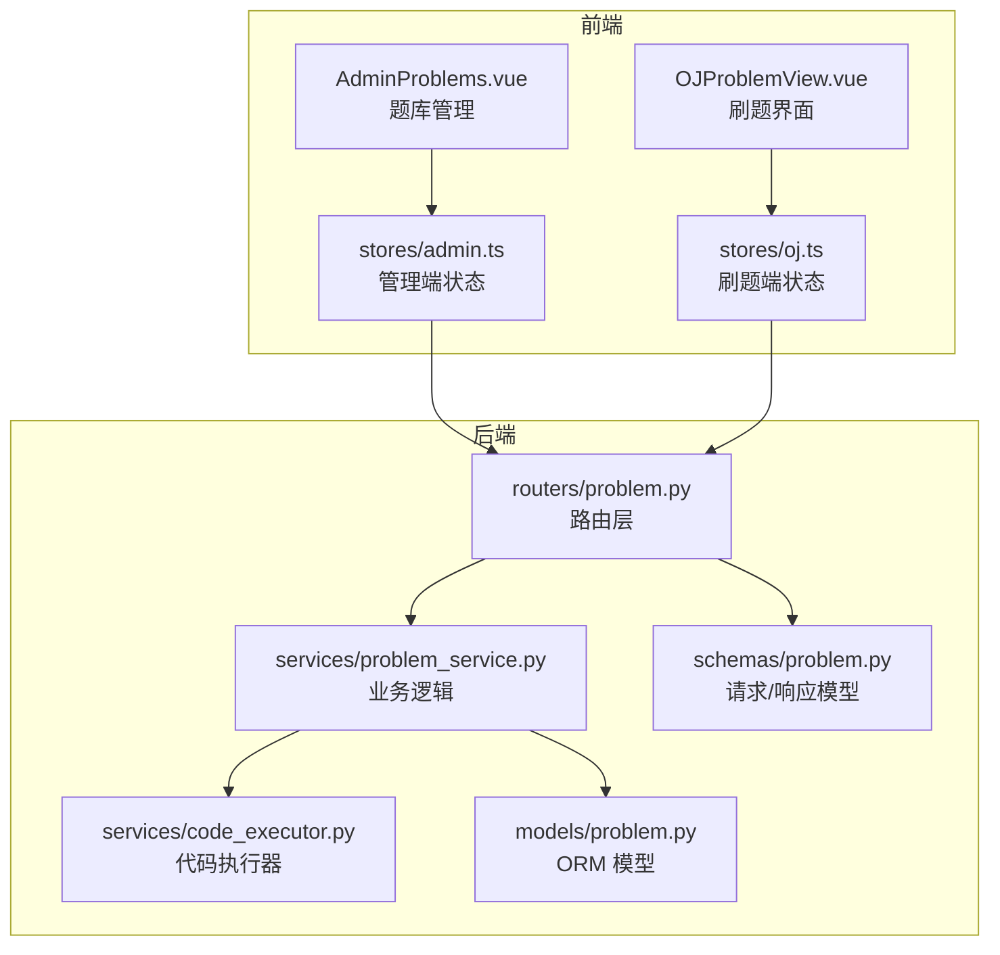
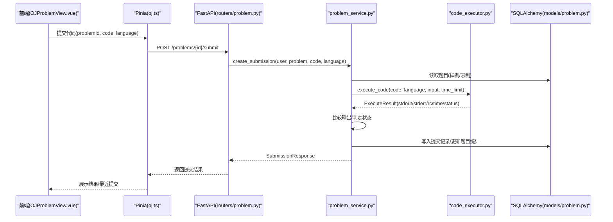
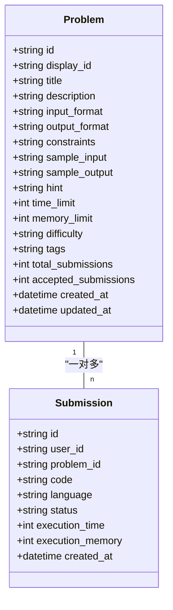
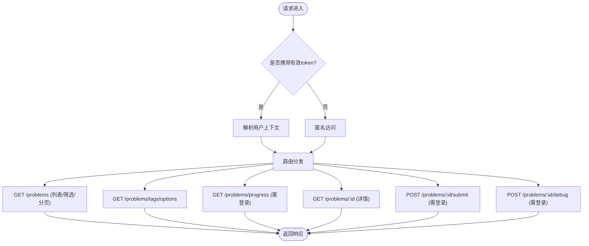
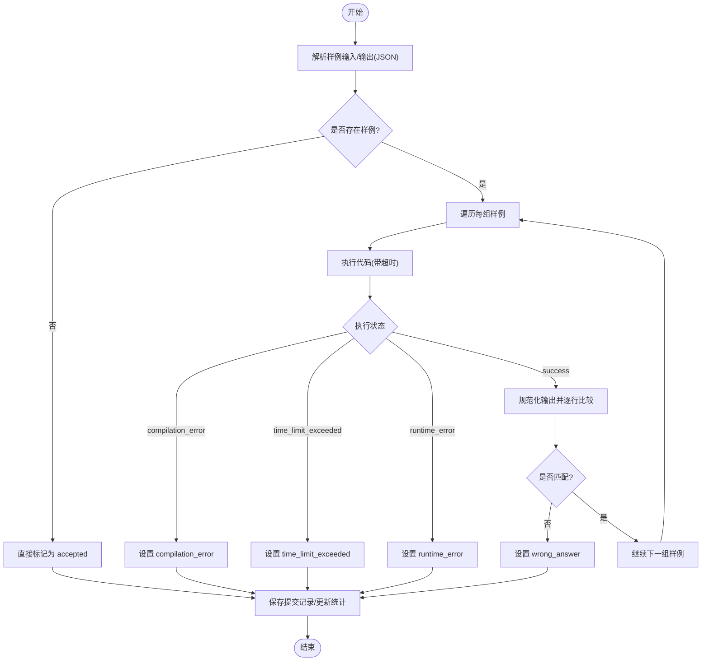
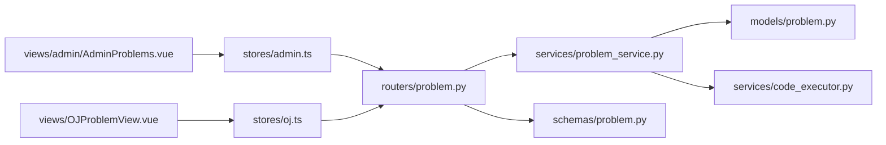

# 题目管理系统

<cite>
**本文引用的文件**   
- [backEnd/app/models/problem.py](file://backEnd/app/models/problem.py)
- [backEnd/app/routers/problem.py](file://backEnd/app/routers/problem.py)
- [backEnd/app/schemas/problem.py](file://backEnd/app/schemas/problem.py)
- [backEnd/app/services/problem_service.py](file://backEnd/app/services/problem_service.py)
- [backEnd/app/services/code_executor.py](file://backEnd/app/services/code_executor.py)
- [frontEnd/src/views/admin/AdminProblems.vue](file://frontEnd/src/views/admin/AdminProblems.vue)
- [frontEnd/src/views/OJProblemView.vue](file://frontEnd/src/views/OJProblemView.vue)
- [frontEnd/src/stores/admin.ts](file://frontEnd/src/stores/admin.ts)
- [frontEnd/src/stores/oj.ts](file://frontEnd/src/stores/oj.ts)
</cite>

## 目录
1. [简介](#简介)
2. [项目结构](#项目结构)
3. [核心组件](#核心组件)
4. [架构总览](#架构总览)
5. [详细组件分析](#详细组件分析)
6. [依赖关系分析](#依赖关系分析)
7. [性能与可扩展性](#性能与可扩展性)
8. [故障排查指南](#故障排查指南)
9. [结论](#结论)
10. [附录：API 参考与最佳实践](#附录api-参考与最佳实践)

## 简介
本技术文档围绕“题目管理系统”的后端数据模型、API 接口、判题执行器、前端管理/刷题界面进行系统化说明。重点覆盖：
- 题目数据模型设计（基本信息、难度等级、标签分类、测试用例结构等）
- 题目 CRUD 与查询筛选 API 设计
- 测试用例验证算法（输入输出匹配、边界条件检查、性能指标评估）
- 题目状态管理与用户进度统计
- 版本控制与批量导入导出建议
- 题目模板设计与自动化测试集成最佳实践

## 项目结构
系统采用前后端分离架构：
- 后端基于 FastAPI + SQLAlchemy，提供题目列表、详情、提交判题、调试运行、标签选项、用户进度等接口
- 前端使用 Vue 3 + Pinia，包含管理员题库管理与用户刷题界面

图表来源
- [backEnd/app/routers/problem.py:1-175](file://backEnd/app/routers/problem.py#L1-L175)
- [backEnd/app/services/problem_service.py:1-442](file://backEnd/app/services/problem_service.py#L1-L442)
- [backEnd/app/services/code_executor.py:1-444](file://backEnd/app/services/code_executor.py#L1-L444)
- [backEnd/app/models/problem.py:1-88](file://backEnd/app/models/problem.py#L1-L88)
- [backEnd/app/schemas/problem.py:1-130](file://backEnd/app/schemas/problem.py#L1-L130)
- [frontEnd/src/views/admin/AdminProblems.vue:1-340](file://frontEnd/src/views/admin/AdminProblems.vue#L1-L340)
- [frontEnd/src/views/OJProblemView.vue:1-500](file://frontEnd/src/views/OJProblemView.vue#L1-L500)
- [frontEnd/src/stores/admin.ts:1-250](file://frontEnd/src/stores/admin.ts#L1-L250)
- [frontEnd/src/stores/oj.ts:1-268](file://frontEnd/src/stores/oj.ts#L1-L268)

章节来源
- [backEnd/app/routers/problem.py:1-175](file://backEnd/app/routers/problem.py#L1-L175)
- [backEnd/app/services/problem_service.py:1-442](file://backEnd/app/services/problem_service.py#L1-L442)
- [backEnd/app/services/code_executor.py:1-444](file://backEnd/app/services/code_executor.py#L1-L444)
- [backEnd/app/models/problem.py:1-88](file://backEnd/app/models/problem.py#L1-L88)
- [backEnd/app/schemas/problem.py:1-130](file://backEnd/app/schemas/problem.py#L1-L130)
- [frontEnd/src/views/admin/AdminProblems.vue:1-340](file://frontEnd/src/views/admin/AdminProblems.vue#L1-L340)
- [frontEnd/src/views/OJProblemView.vue:1-500](file://frontEnd/src/views/OJProblemView.vue#L1-L500)
- [frontEnd/src/stores/admin.ts:1-250](file://frontEnd/src/stores/admin.ts#L1-L250)
- [frontEnd/src/stores/oj.ts:1-268](file://frontEnd/src/stores/oj.ts#L1-L268)

## 核心组件
- 数据模型层：定义题目 Problem 与提交 Submission 的 ORM 结构，包含基础信息、难度、标签、样例、限制、统计字段等
- 服务层：实现题目查询、提交判题、调试运行、用户进度统计、标签聚合等
- 路由层：暴露 RESTful 接口，支持列表分页、筛选、详情、提交、调试、进度、标签选项
- 执行器：安全沙箱策略（关键词黑名单）、多语言编译/运行、超时/内存控制、结果标准化
- 前端：管理端题库维护与用户刷题界面，封装状态与 API 调用

章节来源
- [backEnd/app/models/problem.py:1-88](file://backEnd/app/models/problem.py#L1-L88)
- [backEnd/app/services/problem_service.py:1-442](file://backEnd/app/services/problem_service.py#L1-L442)
- [backEnd/app/routers/problem.py:1-175](file://backEnd/app/routers/problem.py#L1-L175)
- [backEnd/app/services/code_executor.py:1-444](file://backEnd/app/services/code_executor.py#L1-L444)
- [frontEnd/src/views/admin/AdminProblems.vue:1-340](file://frontEnd/src/views/admin/AdminProblems.vue#L1-L340)
- [frontEnd/src/views/OJProblemView.vue:1-500](file://frontEnd/src/views/OJProblemView.vue#L1-L500)
- [frontEnd/src/stores/admin.ts:1-250](file://frontEnd/src/stores/admin.ts#L1-L250)
- [frontEnd/src/stores/oj.ts:1-268](file://frontEnd/src/stores/oj.ts#L1-L268)

## 架构总览
从请求到判题的核心流程如下：

图表来源
- [backEnd/app/routers/problem.py:121-151](file://backEnd/app/routers/problem.py#L121-L151)
- [backEnd/app/services/problem_service.py:95-179](file://backEnd/app/services/problem_service.py#L95-L179)
- [backEnd/app/services/code_executor.py:270-321](file://backEnd/app/services/code_executor.py#L270-L321)
- [backEnd/app/models/problem.py:57-88](file://backEnd/app/models/problem.py#L57-L88)
- [frontEnd/src/views/OJProblemView.vue:378-416](file://frontEnd/src/views/OJProblemView.vue#L378-L416)
- [frontEnd/src/stores/oj.ts:181-198](file://frontEnd/src/stores/oj.ts#L181-L198)

## 详细组件分析

### 数据模型设计
- 题目表 problems
  - 标识与元信息：id、display_id、title、description、hint、created_at、updated_at
  - 输入输出规范：input_format、output_format、constraints、sample_input、sample_output
  - 难度与标签：difficulty、tags（逗号分隔字符串）
  - 资源限制：time_limit(ms)、memory_limit(MB)
  - 统计：total_submissions、accepted_submissions
- 提交表 submissions
  - 关联：user_id、problem_id
  - 内容：code、language、status、execution_time、execution_memory、created_at

图表来源
- [backEnd/app/models/problem.py:17-54](file://backEnd/app/models/problem.py#L17-L54)
- [backEnd/app/models/problem.py:57-88](file://backEnd/app/models/problem.py#L57-L88)

章节来源
- [backEnd/app/models/problem.py:17-88](file://backEnd/app/models/problem.py#L17-L88)

### 题目 API 设计
- 列表查询 GET /api/problems
  - 参数：difficulty、tag、keyword、page、size
  - 可选认证：若携带 token，则返回 user_solved 标记
  - 返回：分页列表、总数、页码、每页大小
- 标签选项 GET /api/problems/tags/options
  - 返回：所有标签集合
- 用户进度 GET /api/problems/progress
  - 需要登录；返回按难度/标签的统计与最近提交
- 详情获取 GET /api/problems/{problem_id}
  - 可选认证；返回完整题目信息与 user_solved
- 提交代码 POST /api/problems/{problem_id}/submit
  - 需要登录；执行判题并返回提交结果
- 调试运行 POST /api/problems/{problem_id}/debug
  - 需要登录；执行并返回 stdout/stderr/退出码/耗时/状态

图表来源
- [backEnd/app/routers/problem.py:47-175](file://backEnd/app/routers/problem.py#L47-L175)

章节来源
- [backEnd/app/routers/problem.py:47-175](file://backEnd/app/routers/problem.py#L47-L175)

### 判题与验证算法
- 样例解析：从题目 JSON 数组中读取 sample_input/sample_output
- 执行策略：对每组样例依次执行，取最大耗时与最高内存
- 状态判定优先级：
  - compilation_error：编译失败
  - time_limit_exceeded：超过时间限制
  - runtime_error：运行时异常
  - wrong_answer：输出不匹配
  - accepted：全部通过
- 输出比对规则：统一换行符、去除首尾空白、逐行对比非空行

图表来源
- [backEnd/app/services/problem_service.py:95-179](file://backEnd/app/services/problem_service.py#L95-L179)
- [backEnd/app/services/code_executor.py:270-321](file://backEnd/app/services/code_executor.py#L270-L321)

章节来源
- [backEnd/app/services/problem_service.py:95-179](file://backEnd/app/services/problem_service.py#L95-L179)
- [backEnd/app/services/code_executor.py:270-321](file://backEnd/app/services/code_executor.py#L270-L321)

### 用户进度与标签统计
- 总体统计：总提交数、总通过数、尝试题目数、通过题目数
- 按难度统计：easy/medium/hard 的题目总量、已尝试、已通过
- 按标签统计：从 tags 字段拆分聚合，限制最多 15 个标签
- 最近提交：返回最近 10 条提交摘要

章节来源
- [backEnd/app/services/problem_service.py:249-367](file://backEnd/app/services/problem_service.py#L249-L367)
- [backEnd/app/services/problem_service.py:370-381](file://backEnd/app/services/problem_service.py#L370-L381)

### 前端交互与管理
- 管理端 AdminProblems.vue
  - 列表展示、搜索过滤（关键词、难度）、分页
  - 新建/编辑弹窗（表单校验、保存、删除）
  - 调用 admin store 的 CRUD 方法
- 刷题端 OJProblemView.vue
  - 题目详情渲染（描述、输入/输出格式、约束、样例、提示、限制）
  - 代码编辑器（多语言模板）、提交与调试
  - 最近提交记录、首次通过代码本地缓存

章节来源
- [frontEnd/src/views/admin/AdminProblems.vue:1-340](file://frontEnd/src/views/admin/AdminProblems.vue#L1-L340)
- [frontEnd/src/views/OJProblemView.vue:1-500](file://frontEnd/src/views/OJProblemView.vue#L1-L500)
- [frontEnd/src/stores/admin.ts:144-191](file://frontEnd/src/stores/admin.ts#L144-L191)
- [frontEnd/src/stores/oj.ts:147-235](file://frontEnd/src/stores/oj.ts#L147-L235)

## 依赖关系分析
- 路由层依赖服务层与 Pydantic Schema
- 服务层依赖 ORM 模型与代码执行器
- 执行器依赖系统编译器/解释器路径配置与子进程调度
- 前端 Store 封装 API 请求，视图负责 UI 与交互

图表来源
- [backEnd/app/routers/problem.py:1-175](file://backEnd/app/routers/problem.py#L1-L175)
- [backEnd/app/services/problem_service.py:1-442](file://backEnd/app/services/problem_service.py#L1-L442)
- [backEnd/app/models/problem.py:1-88](file://backEnd/app/models/problem.py#L1-L88)
- [backEnd/app/services/code_executor.py:1-444](file://backEnd/app/services/code_executor.py#L1-L444)
- [backEnd/app/schemas/problem.py:1-130](file://backEnd/app/schemas/problem.py#L1-L130)
- [frontEnd/src/views/admin/AdminProblems.vue:1-340](file://frontEnd/src/views/admin/AdminProblems.vue#L1-L340)
- [frontEnd/src/views/OJProblemView.vue:1-500](file://frontEnd/src/views/OJProblemView.vue#L1-L500)
- [frontEnd/src/stores/admin.ts:1-250](file://frontEnd/src/stores/admin.ts#L1-L250)
- [frontEnd/src/stores/oj.ts:1-268](file://frontEnd/src/stores/oj.ts#L1-L268)

章节来源
- [backEnd/app/routers/problem.py:1-175](file://backEnd/app/routers/problem.py#L1-L175)
- [backEnd/app/services/problem_service.py:1-442](file://backEnd/app/services/problem_service.py#L1-L442)
- [backEnd/app/models/problem.py:1-88](file://backEnd/app/models/problem.py#L1-L88)
- [backEnd/app/services/code_executor.py:1-444](file://backEnd/app/services/code_executor.py#L1-L444)
- [backEnd/app/schemas/problem.py:1-130](file://backEnd/app/schemas/problem.py#L1-L130)
- [frontEnd/src/views/admin/AdminProblems.vue:1-340](file://frontEnd/src/views/admin/AdminProblems.vue#L1-L340)
- [frontEnd/src/views/OJProblemView.vue:1-500](file://frontEnd/src/views/OJProblemView.vue#L1-L500)
- [frontEnd/src/stores/admin.ts:1-250](file://frontEnd/src/stores/admin.ts#L1-L250)
- [frontEnd/src/stores/oj.ts:1-268](file://frontEnd/src/stores/oj.ts#L1-L268)

## 性能与可扩展性
- 判题并发：执行器使用线程池并行执行子进程，注意 max_workers 与系统资源上限
- 超时控制：通过子进程 timeout 实现 TLE 判定，避免长时间占用
- 输出比对优化：统一换行与空白处理，减少误判
- 统计查询优化：使用 SQL 聚合函数与 distinct 降低重复计算
- 扩展建议：
  - 引入消息队列异步判题，提升吞吐
  - 增加容器化隔离（如 Docker/轻量沙箱）增强安全性
  - 将 tags 拆分为独立表与多对多关系，便于索引与统计
  - 引入 Redis 缓存热门题目与标签选项

[本节为通用指导，无需特定文件引用]

## 故障排查指南
- 提交后显示“答案错误”
  - 检查样例输入/输出是否为合法 JSON 数组
  - 确认输出格式与期望一致（换行、空格、大小写）
- 编译错误
  - 检查语言选择与编译器路径配置
  - 查看 stderr 中的具体错误信息
- 运行时错误
  - 常见原因：数组越界、除零、空指针、未初始化变量
  - 使用调试接口打印中间结果定位问题
- 超时
  - 优化算法复杂度或减少 IO
  - 调整 time_limit 以符合题目预期
- 标签统计不准确
  - 确认 tags 字段使用逗号分隔且无多余空白
  - 检查 get_all_tags 的分词逻辑

章节来源
- [backEnd/app/services/problem_service.py:95-179](file://backEnd/app/services/problem_service.py#L95-L179)
- [backEnd/app/services/code_executor.py:270-321](file://backEnd/app/services/code_executor.py#L270-L321)
- [backEnd/app/services/problem_service.py:370-381](file://backEnd/app/services/problem_service.py#L370-L381)

## 结论
该系统提供了完整的题目管理、判题与刷题体验。数据模型清晰、API 设计简洁、判题流程健壮。建议在后续迭代中引入异步判题、容器化沙箱、标签规范化与缓存机制，以提升性能与安全。

[本节为总结，无需特定文件引用]

## 附录：API 参考与最佳实践

### 接口清单
- GET /api/problems
  - 功能：题目列表（支持难度、标签、关键词、分页）
  - 可选认证：携带 token 时返回 user_solved
- GET /api/problems/tags/options
  - 功能：获取所有标签
- GET /api/problems/progress
  - 功能：用户进度统计（需登录）
- GET /api/problems/{problem_id}
  - 功能：题目详情（可选认证）
- POST /api/problems/{problem_id}/submit
  - 功能：提交代码并判题（需登录）
- POST /api/problems/{problem_id}/debug
  - 功能：调试运行（需登录）

章节来源
- [backEnd/app/routers/problem.py:47-175](file://backEnd/app/routers/problem.py#L47-L175)

### 数据模型字段说明
- 题目 fields
  - 基本信息：id、display_id、title、description、hint、created_at、updated_at
  - 输入输出：input_format、output_format、constraints、sample_input、sample_output
  - 难度与标签：difficulty、tags
  - 限制与统计：time_limit、memory_limit、total_submissions、accepted_submissions
- 提交 fields
  - 关联：user_id、problem_id
  - 内容：code、language、status、execution_time、execution_memory、created_at

章节来源
- [backEnd/app/models/problem.py:17-88](file://backEnd/app/models/problem.py#L17-L88)

### 判题与验证最佳实践
- 样例设计
  - 至少包含正常、边界、极端情况（空输入、最大值、最小值）
  - 输出格式严格约定，避免歧义
- 输出比对
  - 统一换行与空白处理，逐行比较
  - 对浮点数输出考虑精度容差（当前实现为字符串精确匹配）
- 安全策略
  - 关键词黑名单拦截危险操作
  - 子进程隔离与超时控制
- 性能评估
  - 记录执行时间与内存占用
  - 结合题目 time_limit/memory_limit 进行阈值判断

章节来源
- [backEnd/app/services/problem_service.py:95-179](file://backEnd/app/services/problem_service.py#L95-L179)
- [backEnd/app/services/code_executor.py:154-167](file://backEnd/app/services/code_executor.py#L154-L167)
- [backEnd/app/services/code_executor.py:270-321](file://backEnd/app/services/code_executor.py#L270-L321)

### 版本控制与批量导入导出建议
- 版本控制
  - 在题目表增加 version 字段，变更时递增
  - 保留历史版本快照（JSON 序列化），用于回溯与审计
- 批量导入
  - 提供 CSV/JSON 模板，服务端校验必填字段与样例格式
  - 事务性写入，失败回滚
- 批量导出
  - 导出题目元数据与样例，供离线评审与归档

[本节为概念性建议，无需特定文件引用]

### 题目模板与自动化测试集成
- 模板字段
  - 标题、难度、标签、输入/输出格式、约束、样例、提示、限制
- 自动化测试
  - 使用 CI 构建各语言环境，预置编译器/解释器
  - 对每个题目运行内置样例集，生成通过率报告
  - 引入随机生成器构造压力测试，评估稳定性

[本节为概念性建议，无需特定文件引用]