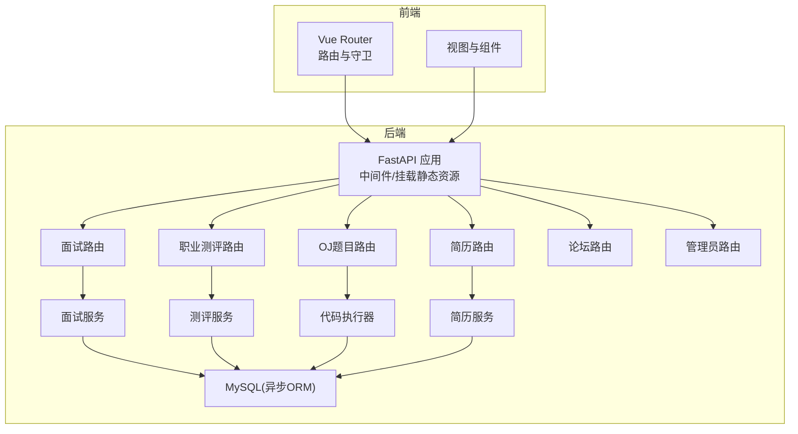
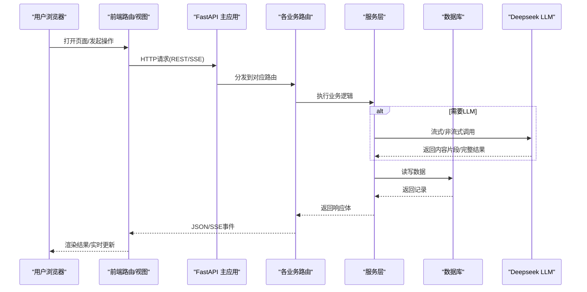
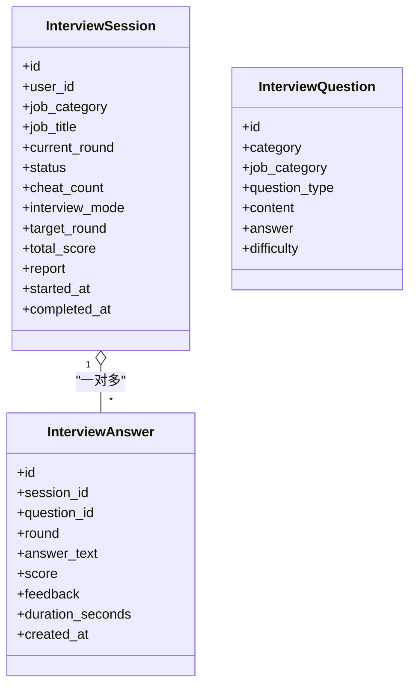
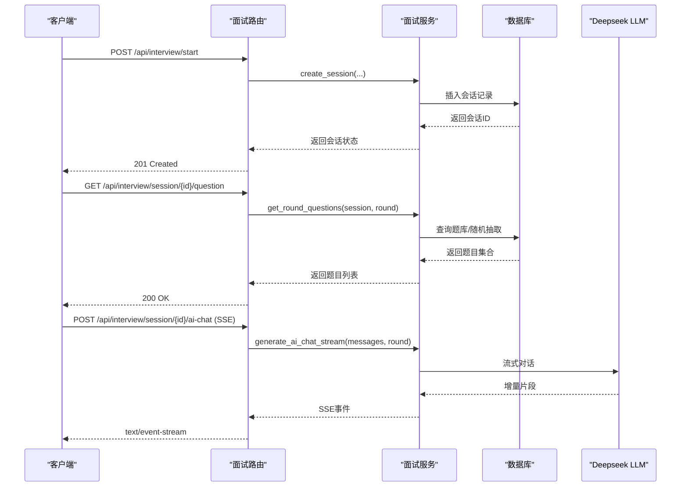
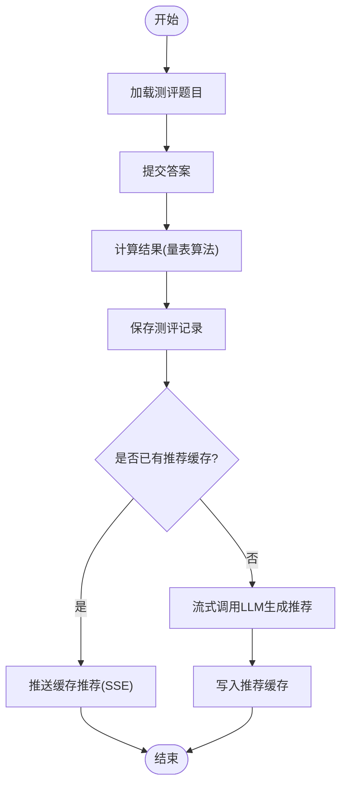
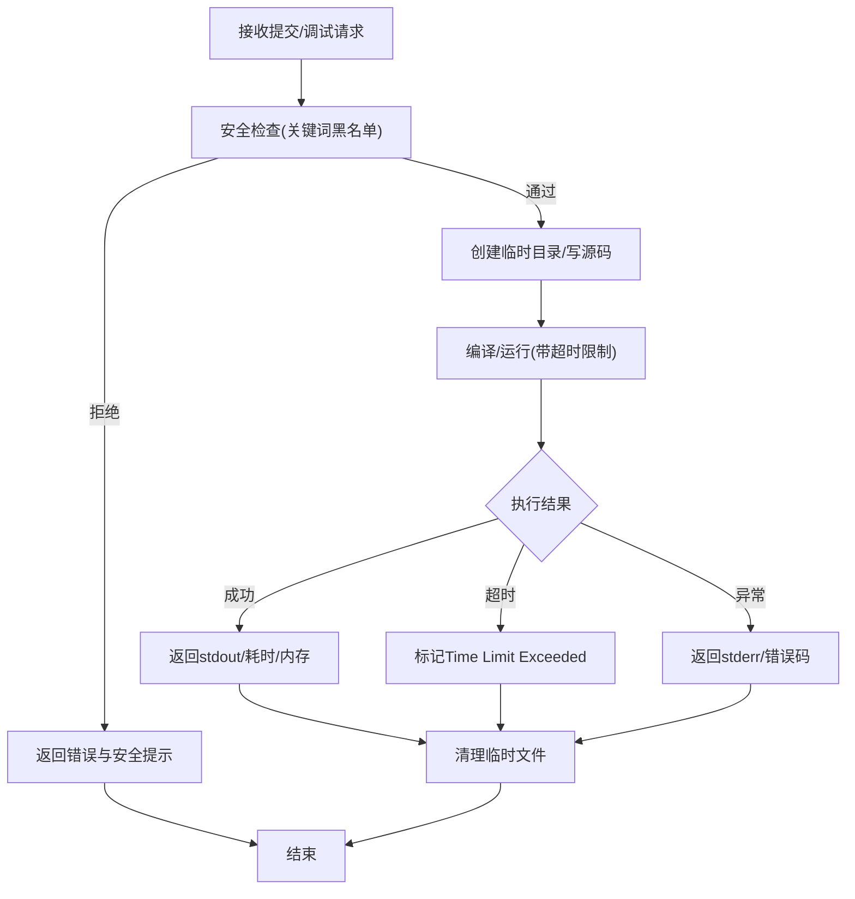
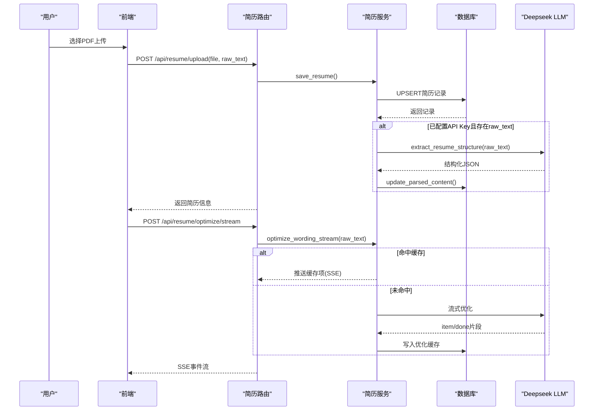
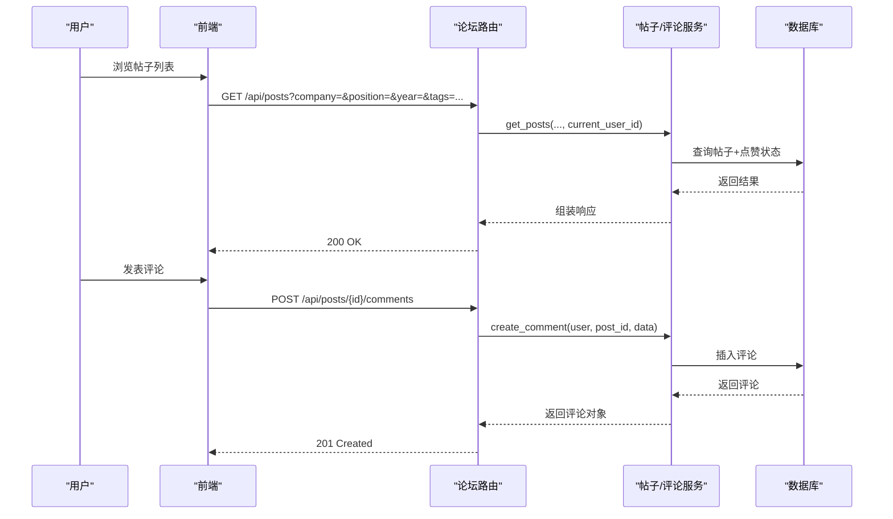
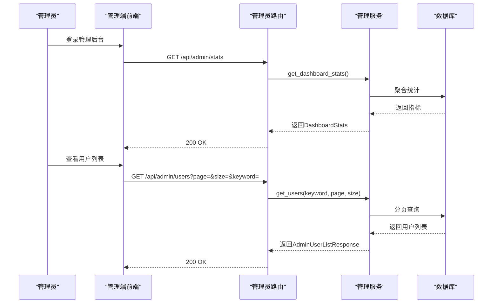
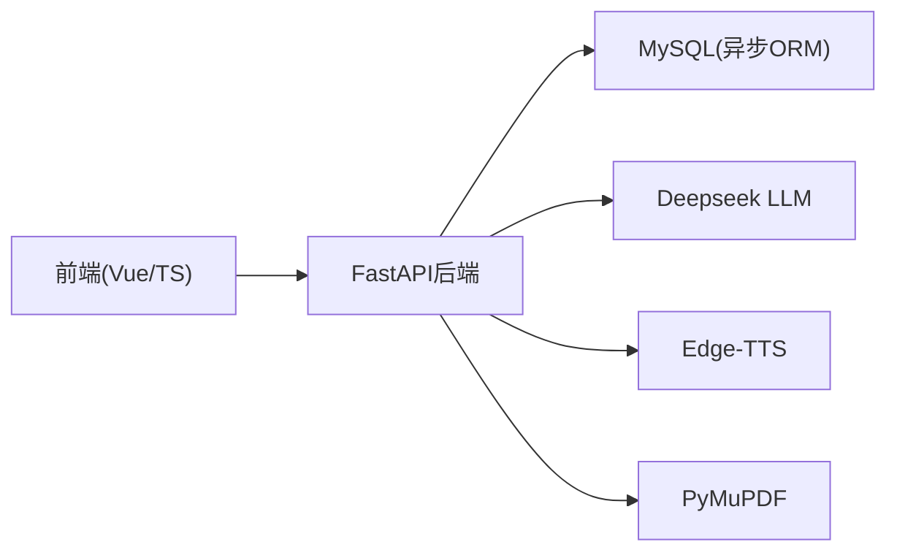

# 核心功能特性

<cite>
**本文引用的文件**   
- [backEnd/app/main.py](file://backEnd/app/main.py)
- [frontEnd/src/router/index.ts](file://frontEnd/src/router/index.ts)
- [backEnd/requirements.txt](file://backEnd/requirements.txt)
- [backEnd/app/models/__init__.py](file://backEnd/app/models/__init__.py)
- [backEnd/app/routers/interview.py](file://backEnd/app/routers/interview.py)
- [backEnd/app/services/interview_service.py](file://backEnd/app/services/interview_service.py)
- [backEnd/app/models/interview.py](file://backEnd/app/models/interview.py)
- [backEnd/app/routers/career.py](file://backEnd/app/routers/career.py)
- [backEnd/app/services/career_service.py](file://backEnd/app/services/career_service.py)
- [backEnd/app/models/career.py](file://backEnd/app/models/career.py)
- [backEnd/app/routers/problem.py](file://backEnd/app/routers/problem.py)
- [backEnd/app/services/code_executor.py](file://backEnd/app/services/code_executor.py)
- [backEnd/app/models/problem.py](file://backEnd/app/models/problem.py)
- [backEnd/app/routers/resume.py](file://backEnd/app/routers/resume.py)
- [backEnd/app/services/resume_service.py](file://backEnd/app/services/resume_service.py)
- [backEnd/app/models/resume.py](file://backEnd/app/models/resume.py)
- [backEnd/app/routers/post.py](file://backEnd/app/routers/post.py)
- [backEnd/app/routers/admin.py](file://backEnd/app/routers/admin.py)
</cite>

## 目录
1. [简介](#简介)
2. [项目结构](#项目结构)
3. [核心组件](#核心组件)
4. [架构总览](#架构总览)
5. [详细组件分析](#详细组件分析)
6. [依赖关系分析](#依赖关系分析)
7. [性能考量](#性能考量)
8. [故障排查指南](#故障排查指南)
9. [结论](#结论)
10. [附录](#附录)

## 简介
本文件面向HR XF系统的开发者与产品人员，系统化梳理六大核心模块：AI面试模拟系统、职业发展测评系统、在线编程平台（OJ）、简历优化服务、社区论坛系统与管理员后台。文档从业务价值、技术实现亮点、使用场景出发，结合后端路由、服务层、数据模型与前端路由的映射关系，提供流程图与类图帮助理解整体设计与关键流程。

## 项目结构
- 后端采用 FastAPI + SQLAlchemy 异步 ORM，按“路由-服务-模型”分层组织；通过 Alembic 管理迁移，启动时自动建表并初始化种子数据。
- 前端基于 Vue Router 进行页面路由与权限守卫，覆盖用户端与管理端入口。
- 外部能力集成包括 Deepseek LLM（用于面试评分、岗位推荐、简历解析与优化）、Edge-TTS（语音合成）、PyMuPDF（PDF文本提取）等。

**图表来源** 
- [backEnd/app/main.py:44-73](file://backEnd/app/main.py#L44-L73)
- [frontEnd/src/router/index.ts:122-166](file://frontEnd/src/router/index.ts#L122-L166)

**章节来源**
- [backEnd/app/main.py:27-49](file://backEnd/app/main.py#L27-L49)
- [backEnd/requirements.txt:1-27](file://backEnd/requirements.txt#L1-L27)
- [frontEnd/src/router/index.ts:1-166](file://frontEnd/src/router/index.ts#L1-L166)

## 核心组件
- AI面试模拟系统：支持综合素质测评、技术面、业务面、AI语音多轮面试；SSE流式对话；切屏上报；报告生成。
- 职业发展测评系统：Holland/MBTI/价值观三套量表；结果计算与摘要；AI岗位匹配推荐（SSE）。
- 在线编程平台：题目列表/详情、提交判题、调试运行；多语言安全沙箱执行；进度统计。
- 简历优化服务：上传/解析PDF；结构化提取；措辞优化（同步+流式）；缓存命中。
- 社区论坛系统：帖子CRUD、点赞、评论、标签统计、筛选排序、分享链接。
- 管理员后台：仪表盘统计、用户/题目/帖子管理、分页搜索。

**章节来源**
- [backEnd/app/routers/interview.py:1-317](file://backEnd/app/routers/interview.py#L1-L317)
- [backEnd/app/services/interview_service.py:35-96](file://backEnd/app/services/interview_service.py#L35-96)
- [backEnd/app/routers/career.py:1-158](file://backEnd/app/routers/career.py#L1-L158)
- [backEnd/app/services/career_service.py:191-207](file://backEnd/app/services/career_service.py#L191-L207)
- [backEnd/app/routers/problem.py:1-175](file://backEnd/app/routers/problem.py#L1-L175)
- [backEnd/app/services/code_executor.py:1-170](file://backEnd/app/services/code_executor.py#L1-L170)
- [backEnd/app/routers/resume.py:1-215](file://backEnd/app/routers/resume.py#L1-L215)
- [backEnd/app/services/resume_service.py:1-120](file://backEnd/app/services/resume_service.py#L1-L120)
- [backEnd/app/routers/post.py:1-249](file://backEnd/app/routers/post.py#L1-L249)
- [backEnd/app/routers/admin.py:1-198](file://backEnd/app/routers/admin.py#L1-L198)

## 架构总览
系统采用前后端分离架构，后端以 FastAPI 暴露 REST/SSE 接口，服务层封装业务逻辑与外部LLM调用，数据持久化通过 SQLAlchemy 异步 ORM 访问 MySQL。前端通过 Vue Router 控制页面导航与鉴权跳转。

**图表来源** 
- [backEnd/app/main.py:60-73](file://backEnd/app/main.py#L60-L73)
- [backEnd/app/routers/interview.py:161-189](file://backEnd/app/routers/interview.py#L161-L189)
- [backEnd/app/services/interview_service.py:797-800](file://backEnd/app/services/interview_service.py#L797-L800)
- [backEnd/app/services/career_service.py:568-669](file://backEnd/app/services/career_service.py#L568-L669)
- [backEnd/app/services/resume_service.py:186-285](file://backEnd/app/services/resume_service.py#L186-L285)

## 详细组件分析

### AI面试模拟系统
- 业务价值：提供多轮次、多形态的模拟面试体验，覆盖综合测评、技术编码、业务问答与AI语音对话，辅助求职者提升实战表现。
- 技术亮点：
  - 全流程/单轮模式切换，动态构建轮次进度。
  - SSE流式AI对话，降低首字延迟，提升交互流畅度。
  - 切屏上报与答题时长采集，增强过程可信度。
  - 报告生成条件控制（答题数≥3），多维度雷达评分与建议。
- 使用场景：校招/社招候选人自测、企业内训模拟面试、面试复盘与能力提升。

**图表来源** 
- [backEnd/app/models/interview.py:19-114](file://backEnd/app/models/interview.py#L19-L114)

**图表来源** 
- [backEnd/app/routers/interview.py:36-100](file://backEnd/app/routers/interview.py#L36-L100)
- [backEnd/app/routers/interview.py:161-189](file://backEnd/app/routers/interview.py#L161-L189)
- [backEnd/app/services/interview_service.py:489-520](file://backEnd/app/services/interview_service.py#L489-L520)
- [backEnd/app/services/interview_service.py:536-621](file://backEnd/app/services/interview_service.py#L536-L621)
- [backEnd/app/services/interview_service.py:797-800](file://backEnd/app/services/interview_service.py#L797-L800)

**章节来源**
- [backEnd/app/routers/interview.py:1-317](file://backEnd/app/routers/interview.py#L1-L317)
- [backEnd/app/services/interview_service.py:35-96](file://backEnd/app/services/interview_service.py#L35-96)
- [backEnd/app/models/interview.py:19-114](file://backEnd/app/models/interview.py#L19-L114)

### 职业发展测评系统
- 业务价值：通过 Holland/MBTI/价值观三大量表帮助用户自我认知，并结合简历技能关键词输出个性化岗位匹配与准备建议。
- 技术亮点：
  - 量表定义与评分算法集中管理，支持扩展新量表。
  - SSE流式岗位推荐，边生成边展示，提升用户体验。
  - 结果缓存策略，避免重复LLM调用。
- 使用场景：职业规划探索、求职方向定位、面试准备清单生成。

**图表来源** 
- [backEnd/app/routers/career.py:96-158](file://backEnd/app/routers/career.py#L96-L158)
- [backEnd/app/services/career_service.py:568-669](file://backEnd/app/services/career_service.py#L568-L669)

**章节来源**
- [backEnd/app/routers/career.py:1-158](file://backEnd/app/routers/career.py#L1-L158)
- [backEnd/app/services/career_service.py:191-207](file://backEnd/app/services/career_service.py#L191-L207)
- [backEnd/app/models/career.py:11-56](file://backEnd/app/models/career.py#L11-L56)

### 在线编程平台（OJ）
- 业务价值：提供多语言题目练习与判题环境，支持难度/标签筛选、用户进度统计与调试运行。
- 技术亮点：
  - 子进程隔离执行，线程池并发调度，超时保护。
  - 多语言编译器路径可配置，自动检测 PATH。
  - 严格的安全黑名单策略，拦截危险系统调用与敏感模块。
- 使用场景：算法训练、笔试模拟、面试前刷题巩固。

**图表来源** 
- [backEnd/app/services/code_executor.py:154-170](file://backEnd/app/services/code_executor.py#L154-L170)
- [backEnd/app/services/code_executor.py:270-321](file://backEnd/app/services/code_executor.py#L270-L321)

**章节来源**
- [backEnd/app/routers/problem.py:1-175](file://backEnd/app/routers/problem.py#L1-L175)
- [backEnd/app/services/code_executor.py:1-170](file://backEnd/app/services/code_executor.py#L1-L170)
- [backEnd/app/models/problem.py:17-88](file://backEnd/app/models/problem.py#L17-L88)

### 简历优化服务
- 业务价值：一键上传简历，自动解析结构化信息，智能优化措辞，输出对比与统计指标，助力快速提升简历质量。
- 技术亮点：
  - PDF服务端文本提取（PyMuPDF），兼容复杂排版。
  - 结构化提取与措辞优化均支持缓存命中与SSE流式输出。
  - 技能关键词抽取，为后续岗位推荐提供输入。
- 使用场景：求职前简历打磨、投递前自检、面试材料准备。

**图表来源** 
- [backEnd/app/routers/resume.py:47-77](file://backEnd/app/routers/resume.py#L47-L77)
- [backEnd/app/routers/resume.py:140-192](file://backEnd/app/routers/resume.py#L140-L192)
- [backEnd/app/services/resume_service.py:174-184](file://backEnd/app/services/resume_service.py#L174-L184)
- [backEnd/app/services/resume_service.py:186-285](file://backEnd/app/services/resume_service.py#L186-L285)

**章节来源**
- [backEnd/app/routers/resume.py:1-215](file://backEnd/app/routers/resume.py#L1-L215)
- [backEnd/app/services/resume_service.py:1-120](file://backEnd/app/services/resume_service.py#L1-L120)
- [backEnd/app/models/resume.py:11-67](file://backEnd/app/models/resume.py#L11-L67)

### 社区论坛系统
- 业务价值：构建面经分享与互动社区，支持公司/岗位/年份/标签等多维筛选，促进经验沉淀与社交连接。
- 技术亮点：
  - 可选认证浏览（匿名可读），登录态下显示点赞状态。
  - 热门标签统计与筛选选项聚合，提升检索效率。
  - 分享链接生成，便于跨平台传播。
- 使用场景：面试经验分享、招聘情报收集、社群运营。

**图表来源** 
- [backEnd/app/routers/post.py:63-105](file://backEnd/app/routers/post.py#L63-L105)
- [backEnd/app/routers/post.py:182-215](file://backEnd/app/routers/post.py#L182-L215)

**章节来源**
- [backEnd/app/routers/post.py:1-249](file://backEnd/app/routers/post.py#L1-L249)

### 管理员后台
- 业务价值：提供统一的管理入口，涵盖用户、题目、帖子管理与数据统计，保障平台健康运行。
- 技术亮点：
  - 简易管理员校验（邮箱/用户名包含“admin”）。
  - 分页+关键词搜索，支持批量删除与更新。
  - 仪表盘统计数据聚合，辅助运营决策。
- 使用场景：平台运维、内容审核、数据治理。

**图表来源** 
- [backEnd/app/routers/admin.py:39-67](file://backEnd/app/routers/admin.py#L39-L67)

**章节来源**
- [backEnd/app/routers/admin.py:1-198](file://backEnd/app/routers/admin.py#L1-L198)

## 依赖关系分析
- 后端依赖：
  - FastAPI、uvicorn、SQLAlchemy异步、Alembic、PyMySQL/AioMySQL、httpx、PyMuPDF、edge-tts、python-jose/passlib等。
- 前端依赖：
  - Vue Router、TypeScript、TailwindCSS（配置文件可见）。
- 外部服务：
  - Deepseek LLM（聊天补全接口，支持流式）。
  - Edge-TTS（语音合成，供面试语音模块使用）。
  - PyMuPDF（PDF文本提取）。

**图表来源** 
- [backEnd/requirements.txt:1-27](file://backEnd/requirements.txt#L1-L27)

**章节来源**
- [backEnd/requirements.txt:1-27](file://backEnd/requirements.txt#L1-L27)

## 性能考量
- SSE流式输出显著降低首字节延迟，适用于AI对话、岗位推荐、简历优化等长耗时任务。
- 代码执行器使用线程池并发调度子进程，配合超时保护与临时目录隔离，兼顾吞吐与安全性。
- 简历与测评推荐结果采用缓存策略，减少重复LLM调用成本。
- 数据库索引设计（如用户ID、状态、时间戳）提升查询性能；分页与过滤参数限制范围，避免大结果集。

[本节为通用指导，不直接分析具体文件]

## 故障排查指南
- 验证错误处理：自定义 RequestValidationError 处理器避免二进制字段导致解码异常。
- 健康检查：/api/health 可用于服务存活探测。
- 常见错误：
  - 未配置 Deepseek API Key：相关接口将返回明确错误提示。
  - 代码执行失败：根据返回状态区分编译错误、运行时错误、超时等，结合 stderr 定位问题。
  - 面试报告无法生成：需满足答题数量阈值（≥3）。

**章节来源**
- [backEnd/app/main.py:76-89](file://backEnd/app/main.py#L76-L89)
- [backEnd/app/routers/resume.py:80-98](file://backEnd/app/routers/resume.py#L80-L98)
- [backEnd/app/routers/interview.py:259-303](file://backEnd/app/routers/interview.py#L259-L303)

## 结论
HR XF系统围绕“面试—测评—刷题—简历—社区—管理”形成闭环，既关注用户体验（SSE流式、缓存命中、友好错误提示），又重视工程实践（分层架构、安全沙箱、异步ORM、迁移管理）。建议在后续迭代中持续完善题库与Prompt模板、引入更细粒度的权限控制与审计日志，并对执行器进一步容器化以提升隔离性与可扩展性。

[本节为总结性内容，不直接分析具体文件]

## 附录
- 前端路由与页面映射：
  - 首页、认证、仪表盘、简历、简历优化、OJ题目、职业测评、面试会话/历史/报告、管理后台等。
- 模型汇总：
  - 面试会话/题目/答案、测评记录、题目/提交、简历、用户/帖子/评论/点赞/标签等。

**章节来源**
- [frontEnd/src/router/index.ts:5-120](file://frontEnd/src/router/index.ts#L5-L120)
- [backEnd/app/models/__init__.py:1-12](file://backEnd/app/models/__init__.py#L1-L12)