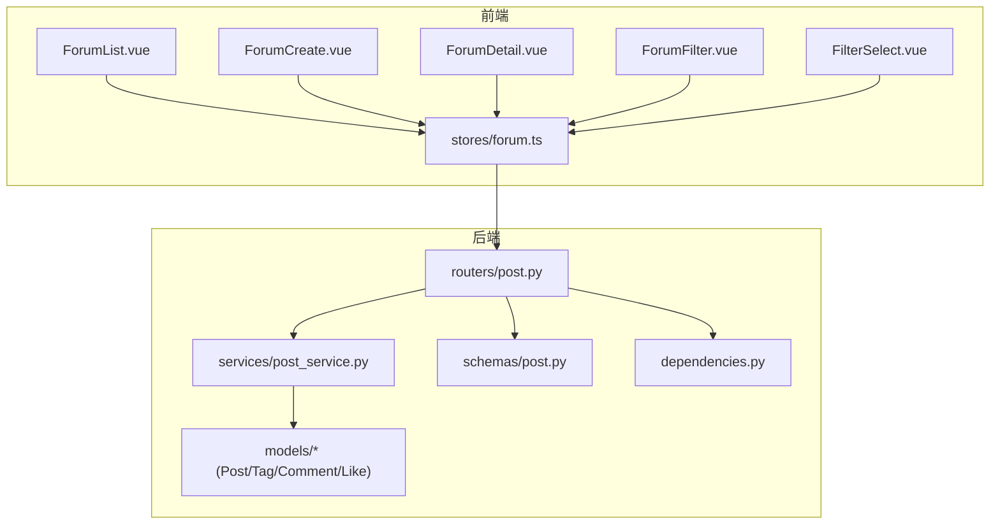
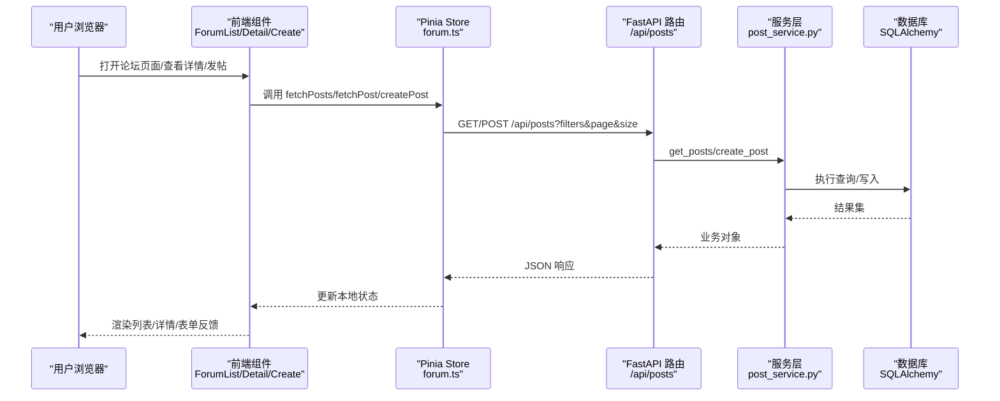
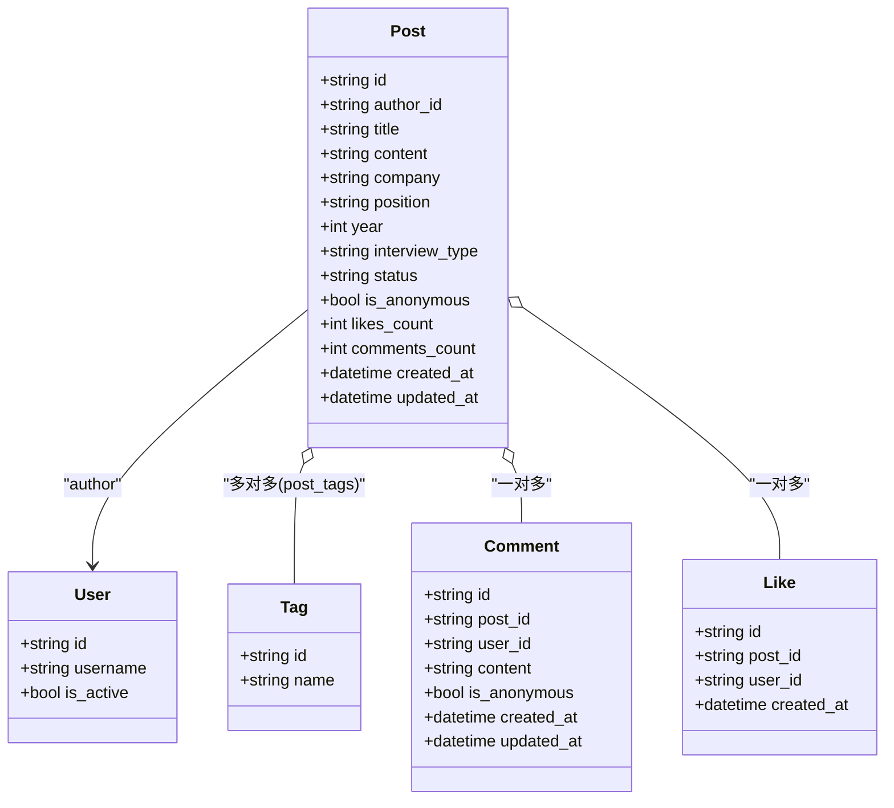
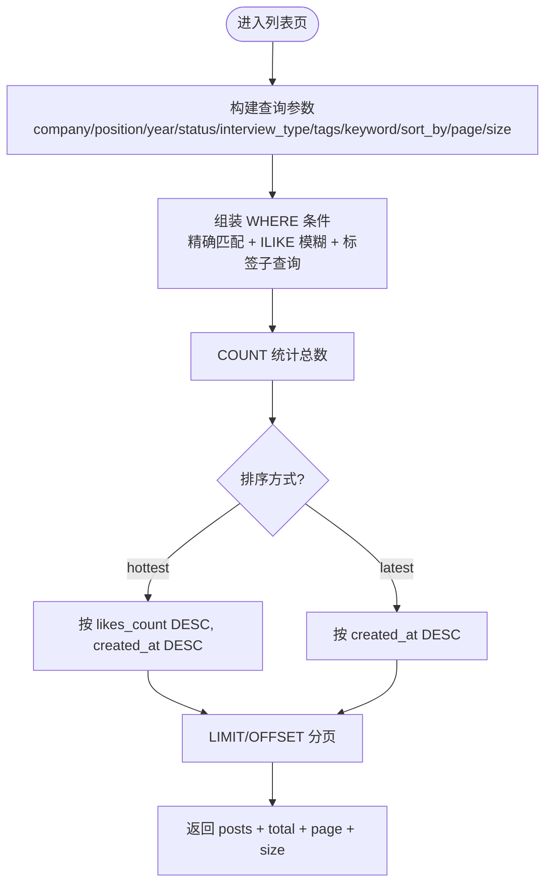
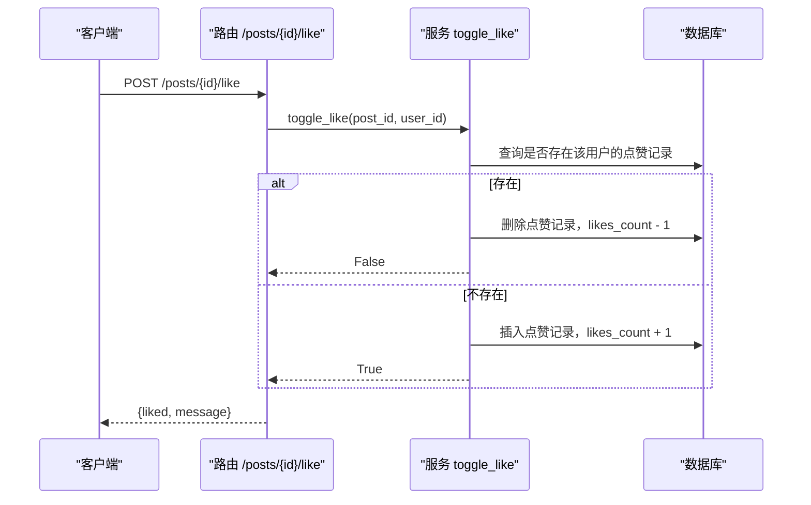
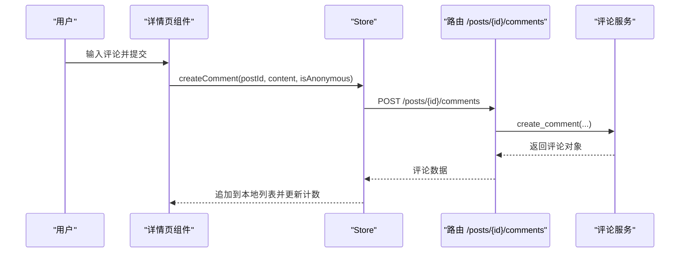
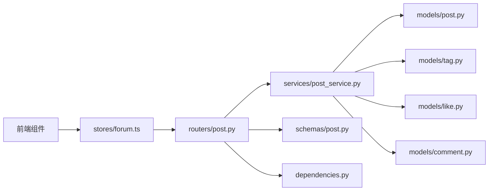

# 帖子管理系统

<cite>
**本文引用的文件**   
- [post.py](file://backEnd/app/models/post.py)
- [tag.py](file://backEnd/app/models/tag.py)
- [comment.py](file://backEnd/app/models/comment.py)
- [like.py](file://backEnd/app/models/like.py)
- [post.py](file://backEnd/app/routers/post.py)
- [post_service.py](file://backEnd/app/services/post_service.py)
- [post.py](file://backEnd/app/schemas/post.py)
- [dependencies.py](file://backEnd/app/dependencies.py)
- [forum.ts](file://frontEnd/src/stores/forum.ts)
- [ForumList.vue](file://frontEnd/src/components/forum/ForumList.vue)
- [ForumCreate.vue](file://frontEnd/src/components/forum/ForumCreate.vue)
- [ForumDetail.vue](file://frontEnd/src/components/forum/ForumDetail.vue)
- [ForumFilter.vue](file://frontEnd/src/components/forum/ForumFilter.vue)
- [FilterSelect.vue](file://frontEnd/src/components/forum/FilterSelect.vue)
</cite>

## 目录
1. [简介](#简介)
2. [项目结构](#项目结构)
3. [核心组件](#核心组件)
4. [架构总览](#架构总览)
5. [详细组件分析](#详细组件分析)
6. [依赖关系分析](#依赖关系分析)
7. [性能考虑](#性能考虑)
8. [故障排查指南](#故障排查指南)
9. [结论](#结论)
10. [附录](#附录)

## 简介
本文件系统性地梳理“帖子管理系统”的完整功能与实现，覆盖面经帖子的发布、列表查询（支持公司、岗位、年份、状态、面试类型、标签、关键词等多维交叉筛选）、详情查看、删除、点赞与评论等核心能力。文档同时深入解析：
- 交叉组合筛选机制与分页优化策略
- 权限控制策略（作者可删、匿名发布）
- 富文本内容处理现状与扩展建议
- 图片上传集成方案与落地路径
- SEO 友好的 URL 生成与分享链接
- 前端组件复用模式与扩展方法

## 项目结构
后端采用 FastAPI + SQLAlchemy 异步 ORM，分层清晰：路由层负责参数校验与鉴权，服务层封装业务逻辑与数据库操作，模型层定义数据表结构与关系，Schema 层统一请求/响应契约。前端基于 Vue 3 + Pinia，按功能域组织组件与状态管理。

图表来源
- [post.py:1-249](file://backEnd/app/routers/post.py#L1-L249)
- [post_service.py:1-249](file://backEnd/app/services/post_service.py#L1-L249)
- [post.py:1-91](file://backEnd/app/schemas/post.py#L1-L91)
- [post.py:1-65](file://backEnd/app/models/post.py#L1-L65)
- [tag.py:1-46](file://backEnd/app/models/tag.py#L1-L46)
- [comment.py:1-53](file://backEnd/app/models/comment.py#L1-L53)
- [like.py:1-47](file://backEnd/app/models/like.py#L1-L47)
- [dependencies.py:1-41](file://backEnd/app/dependencies.py#L1-L41)
- [forum.ts:1-315](file://frontEnd/src/stores/forum.ts#L1-L315)
- [ForumList.vue:1-259](file://frontEnd/src/components/forum/ForumList.vue#L1-L259)
- [ForumCreate.vue:1-287](file://frontEnd/src/components/forum/ForumCreate.vue#L1-L287)
- [ForumDetail.vue:1-297](file://frontEnd/src/components/forum/ForumDetail.vue#L1-L297)
- [ForumFilter.vue:1-186](file://frontEnd/src/components/forum/ForumFilter.vue#L1-L186)
- [FilterSelect.vue:1-26](file://frontEnd/src/components/forum/FilterSelect.vue#L1-L26)

章节来源
- [post.py:1-249](file://backEnd/app/routers/post.py#L1-L249)
- [post_service.py:1-249](file://backEnd/app/services/post_service.py#L1-L249)
- [post.py:1-91](file://backEnd/app/schemas/post.py#L1-L91)
- [post.py:1-65](file://backEnd/app/models/post.py#L1-L65)
- [tag.py:1-46](file://backEnd/app/models/tag.py#L1-L46)
- [comment.py:1-53](file://backEnd/app/models/comment.py#L1-L53)
- [like.py:1-47](file://backEnd/app/models/like.py#L1-L47)
- [dependencies.py:1-41](file://backEnd/app/dependencies.py#L1-L41)
- [forum.ts:1-315](file://frontEnd/src/stores/forum.ts#L1-L315)
- [ForumList.vue:1-259](file://frontEnd/src/components/forum/ForumList.vue#L1-L259)
- [ForumCreate.vue:1-287](file://frontEnd/src/components/forum/ForumCreate.vue#L1-L287)
- [ForumDetail.vue:1-297](file://frontEnd/src/components/forum/ForumDetail.vue#L1-L297)
- [ForumFilter.vue:1-186](file://frontEnd/src/components/forum/ForumFilter.vue#L1-L186)
- [FilterSelect.vue:1-26](file://frontEnd/src/components/forum/FilterSelect.vue#L1-L26)

## 核心组件
- 数据模型
  - Post：帖子主实体，包含结构化字段（公司、岗位、年份、面试类型、状态）、匿名开关、计数字段（点赞数、评论数）及时间戳；与用户、标签、评论、点赞建立关联。
  - Tag：技术标签，与帖子多对多关联。
  - Comment：评论实体，支持匿名评论。
  - Like：点赞实体，唯一约束保证用户对同一帖子仅一次点赞。
- 接口契约
  - PostCreate/PostResponse/PostListResponse：创建、详情与列表响应结构。
  - CommentCreate/CommentListResponse：评论创建与列表响应结构。
  - ShareResponse：分享链接返回结构。
- 路由与服务
  - 路由层提供帖子 CRUD、点赞、评论、标签统计、筛选选项等 API。
  - 服务层实现交叉筛选、分页、去重值获取、标签统计、点赞切换等核心逻辑。
- 前端组件与状态
  - ForumList/ForumFilter/ForumCreate/ForumDetail 构成论坛页面主体。
  - Pinia store 统一管理帖子、评论、筛选条件、分页与网络请求。

章节来源
- [post.py:1-65](file://backEnd/app/models/post.py#L1-L65)
- [tag.py:1-46](file://backEnd/app/models/tag.py#L1-L46)
- [comment.py:1-53](file://backEnd/app/models/comment.py#L1-L53)
- [like.py:1-47](file://backEnd/app/models/like.py#L1-L47)
- [post.py:1-91](file://backEnd/app/schemas/post.py#L1-L91)
- [post.py:1-249](file://backEnd/app/routers/post.py#L1-L249)
- [post_service.py:1-249](file://backEnd/app/services/post_service.py#L1-L249)
- [forum.ts:1-315](file://frontEnd/src/stores/forum.ts#L1-L315)
- [ForumList.vue:1-259](file://frontEnd/src/components/forum/ForumList.vue#L1-L259)
- [ForumCreate.vue:1-287](file://frontEnd/src/components/forum/ForumCreate.vue#L1-L287)
- [ForumDetail.vue:1-297](file://frontEnd/src/components/forum/ForumDetail.vue#L1-L297)
- [ForumFilter.vue:1-186](file://frontEnd/src/components/forum/ForumFilter.vue#L1-L186)
- [FilterSelect.vue:1-26](file://frontEnd/src/components/forum/FilterSelect.vue#L1-L26)

## 架构总览
系统遵循典型的前后端分离架构：前端通过 RESTful API 与后端交互，后端以 FastAPI 暴露接口，使用 SQLAlchemy 异步会话访问数据库。认证通过 Bearer Token 注入当前用户上下文，可选认证用于公开读取场景。

图表来源
- [post.py:1-249](file://backEnd/app/routers/post.py#L1-L249)
- [post_service.py:1-249](file://backEnd/app/services/post_service.py#L1-L249)
- [forum.ts:1-315](file://frontEnd/src/stores/forum.ts#L1-L315)
- [ForumList.vue:1-259](file://frontEnd/src/components/forum/ForumList.vue#L1-L259)
- [ForumDetail.vue:1-297](file://frontEnd/src/components/forum/ForumDetail.vue#L1-L297)
- [ForumCreate.vue:1-287](file://frontEnd/src/components/forum/ForumCreate.vue#L1-L287)

## 详细组件分析

### 数据模型与关系

图表来源
- [post.py:1-65](file://backEnd/app/models/post.py#L1-L65)
- [tag.py:1-46](file://backEnd/app/models/tag.py#L1-L46)
- [comment.py:1-53](file://backEnd/app/models/comment.py#L1-L53)
- [like.py:1-47](file://backEnd/app/models/like.py#L1-L47)

章节来源
- [post.py:1-65](file://backEnd/app/models/post.py#L1-L65)
- [tag.py:1-46](file://backEnd/app/models/tag.py#L1-L46)
- [comment.py:1-53](file://backEnd/app/models/comment.py#L1-L53)
- [like.py:1-47](file://backEnd/app/models/like.py#L1-L47)

### 帖子列表与交叉筛选
- 筛选维度：公司、岗位、年份、状态、面试类型、标签（多标签且需全部匹配）、关键词（标题或内容模糊匹配）。
- 排序：最新（按创建时间倒序）、最热（按点赞数倒序，次级按创建时间倒序）。
- 分页：page、size 参数，服务端计算总数并返回。
- 标签筛选：通过子查询聚合 post_tags 与 tags，要求命中所有指定标签名。

图表来源
- [post.py:63-105](file://backEnd/app/routers/post.py#L63-L105)
- [post_service.py:96-166](file://backEnd/app/services/post_service.py#L96-L166)

章节来源
- [post.py:63-105](file://backEnd/app/routers/post.py#L63-L105)
- [post_service.py:96-166](file://backEnd/app/services/post_service.py#L96-L166)

### 帖子详情与点赞
- 详情：根据 ID 获取帖子，若不存在返回 404。
- 点赞：切换点赞状态，原子更新点赞计数，返回布尔表示是否已点赞。
- 批量检查：列表页一次性检查当前用户对多个帖子的点赞状态，减少往返。

图表来源
- [post.py:165-176](file://backEnd/app/routers/post.py#L165-L176)
- [post_service.py:189-209](file://backEnd/app/services/post_service.py#L189-L209)

章节来源
- [post.py:131-144](file://backEnd/app/routers/post.py#L131-L144)
- [post.py:165-176](file://backEnd/app/routers/post.py#L165-L176)
- [post_service.py:169-209](file://backEnd/app/services/post_service.py#L169-L209)

### 评论模块
- 创建评论：需要登录，支持匿名评论。
- 列表评论：分页返回，附带作者名（匿名时显示“匿名用户”）。
- 删除评论：仅作者可删。

图表来源
- [post.py:182-215](file://backEnd/app/routers/post.py#L182-L215)
- [forum.ts:221-240](file://frontEnd/src/stores/forum.ts#L221-L240)
- [ForumDetail.vue:267-285](file://frontEnd/src/components/forum/ForumDetail.vue#L267-L285)

章节来源
- [post.py:182-215](file://backEnd/app/routers/post.py#L182-L215)
- [forum.ts:221-240](file://frontEnd/src/stores/forum.ts#L221-L240)
- [ForumDetail.vue:267-285](file://frontEnd/src/components/forum/ForumDetail.vue#L267-L285)

### 发布面经（富文本与图片上传）
- 当前实现：正文为纯文本，最小长度校验在前端与后端共同保障。
- 富文本扩展建议：
  - 前端引入富文本编辑器（如 Tiptap/Quill），提交前将 HTML 或 Delta 序列化为字符串存储。
  - 后端在入库前进行 XSS 过滤与长度限制，输出侧按需渲染。
- 图片上传集成建议：
  - 前端选择图片后先上传至后端（或对象存储），获得 URL 后再嵌入富文本内容。
  - 后端提供上传接口，校验 MIME 与大小，落盘到 uploads 目录并返回可访问 URL。
  - 安全策略：白名单后缀、随机文件名、防盗链、CDN 加速。

章节来源
- [ForumCreate.vue:148-161](file://frontEnd/src/components/forum/ForumCreate.vue#L148-L161)
- [post.py:11-27](file://backEnd/app/schemas/post.py#L11-L27)
- [post_service.py:70-94](file://backEnd/app/services/post_service.py#L70-L94)

### 权限控制策略
- 写操作（发帖、删帖、删评、点赞）：强制 Bearer Token 认证，依赖注入解析当前用户。
- 读操作（列表、详情）：支持可选认证，未登录也能浏览，但无法参与互动。
- 删除权限：仅作者可删除自己的帖子/评论，非作者抛 403。
- 匿名发布/评论：允许隐藏真实用户名，展示“匿名用户”。

章节来源
- [dependencies.py:13-40](file://backEnd/app/dependencies.py#L13-L40)
- [post.py:26-46](file://backEnd/app/routers/post.py#L26-L46)
- [post.py:147-159](file://backEnd/app/routers/post.py#L147-L159)
- [post_service.py:176-186](file://backEnd/app/services/post_service.py#L176-L186)

### SEO 友好的 URL 与分享
- 分享链接：后端提供生成分享链接接口，前端拼接站点基础地址形成最终 URL。
- 建议增强：
  - 为帖子生成 slug（基于标题与 ID），路由映射到 /forum/post/{slug}，便于搜索引擎抓取。
  - 在详情页设置 meta 信息（title/description/og:image），提升社交分享效果。

章节来源
- [post.py:236-241](file://backEnd/app/routers/post.py#L236-L241)
- [ForumList.vue:244-252](file://frontEnd/src/components/forum/ForumList.vue#L244-L252)
- [ForumDetail.vue:216-224](file://frontEnd/src/components/forum/ForumDetail.vue#L216-L224)

### 前端组件复用与扩展
- 组件职责
  - ForumList：列表展示、搜索、分页、热门标签、点赞与分享。
  - ForumFilter：筛选面板（公司/岗位/年份/状态/面试类型/标签/排序）。
  - FilterSelect：通用下拉选择器。
  - ForumCreate：发布面经弹窗，含匿名开关、结构化字段、标签管理与校验。
  - ForumDetail：详情弹窗，含点赞、评论、图片保存（截图导出）。
- 复用模式
  - 通过 Pinia store 集中管理状态与网络请求，组件只关注 UI 与事件派发。
  - 筛选与排序通过 props/events 双向绑定，保持组件无状态化。
- 扩展建议
  - 新增筛选维度：在后端增加 Query 参数与服务层 where 条件，前端 Filter 组件增加对应控件。
  - 富文本与图片：在 ForumCreate 中接入富文本编辑器与图片上传流程。
  - 评论嵌套：后端增加 parent_id 字段，前端递归渲染评论树。

章节来源
- [ForumList.vue:1-259](file://frontEnd/src/components/forum/ForumList.vue#L1-L259)
- [ForumFilter.vue:1-186](file://frontEnd/src/components/forum/ForumFilter.vue#L1-L186)
- [FilterSelect.vue:1-26](file://frontEnd/src/components/forum/FilterSelect.vue#L1-L26)
- [ForumCreate.vue:1-287](file://frontEnd/src/components/forum/ForumCreate.vue#L1-L287)
- [ForumDetail.vue:1-297](file://frontEnd/src/components/forum/ForumDetail.vue#L1-L297)
- [forum.ts:1-315](file://frontEnd/src/stores/forum.ts#L1-L315)

## 依赖关系分析
- 路由依赖
  - 依赖数据库会话、当前用户解析、服务层函数与 Schema 模型。
- 服务依赖
  - 依赖模型（Post/Tag/Like/Comment）与 Pydantic Schema。
- 前端依赖
  - 组件依赖 Pinia store，store 依赖全局 API 基址与本地 token。

图表来源
- [post.py:1-249](file://backEnd/app/routers/post.py#L1-L249)
- [post_service.py:1-249](file://backEnd/app/services/post_service.py#L1-L249)
- [post.py:1-91](file://backEnd/app/schemas/post.py#L1-L91)
- [dependencies.py:1-41](file://backEnd/app/dependencies.py#L1-L41)
- [post.py:1-65](file://backEnd/app/models/post.py#L1-L65)
- [tag.py:1-46](file://backEnd/app/models/tag.py#L1-L46)
- [like.py:1-47](file://backEnd/app/models/like.py#L1-L47)
- [comment.py:1-53](file://backEnd/app/models/comment.py#L1-L53)
- [forum.ts:1-315](file://frontEnd/src/stores/forum.ts#L1-L315)

章节来源
- [post.py:1-249](file://backEnd/app/routers/post.py#L1-L249)
- [post_service.py:1-249](file://backEnd/app/services/post_service.py#L1-L249)
- [post.py:1-91](file://backEnd/app/schemas/post.py#L1-L91)
- [dependencies.py:1-41](file://backEnd/app/dependencies.py#L1-L41)
- [post.py:1-65](file://backEnd/app/models/post.py#L1-L65)
- [tag.py:1-46](file://backEnd/app/models/tag.py#L1-L46)
- [like.py:1-47](file://backEnd/app/models/like.py#L1-L47)
- [comment.py:1-53](file://backEnd/app/models/comment.py#L1-L53)
- [forum.ts:1-315](file://frontEnd/src/stores/forum.ts#L1-L315)

## 性能考虑
- 索引优化
  - 对常用筛选字段（company、position、year、status、interview_type）建立索引，提升 WHERE 条件命中率。
  - 对 likes_count 与 created_at 建立复合索引以优化“最热”排序。
- 查询优化
  - 列表页批量检查点赞状态，避免 N+1 查询。
  - 标签筛选使用子查询聚合，确保“全匹配”语义，避免笛卡尔积放大。
- 分页策略
  - 使用 LIMIT/OFFSET 分页，限制最大 size，防止大页导致内存压力。
  - 大数据量下可考虑游标分页（基于 last_id）替代 OFFSET。
- 缓存建议
  - 热门标签与筛选选项可短期缓存，降低频繁查询开销。
  - 热点帖子详情可加 Redis 缓存，注意失效策略。

[本节为通用性能指导，不直接分析具体文件]

## 故障排查指南
- 认证失败（401）
  - 检查请求头 Authorization 是否携带有效 Bearer Token。
  - 确认用户存在且处于激活状态。
- 权限不足（403）
  - 删除帖子/评论时，确认当前用户是否为作者。
- 资源不存在（404）
  - 帖子/评论 ID 无效或已被删除。
- 点赞异常
  - 检查点赞记录唯一约束冲突；确认点赞计数同步更新。
- 筛选结果异常
  - 核对传入参数类型与范围（如年份区间、sort_by 枚举）。
  - 标签筛选需确保传入标签名与数据库一致。

章节来源
- [dependencies.py:13-40](file://backEnd/app/dependencies.py#L13-L40)
- [post.py:147-159](file://backEnd/app/routers/post.py#L147-L159)
- [post.py:131-144](file://backEnd/app/routers/post.py#L131-L144)
- [post_service.py:176-209](file://backEnd/app/services/post_service.py#L176-L209)

## 结论
本系统围绕面经帖子构建了完整的 CRUD、筛选、互动与分享能力，具备清晰的权限边界与良好的可扩展性。建议在后续迭代中引入富文本与图片上传、SEO 友好 URL、缓存与更优的分页策略，以提升用户体验与系统性能。

[本节为总结性内容，不直接分析具体文件]

## 附录
- API 概览（节选）
  - 发布面经：POST /api/posts
  - 获取列表：GET /api/posts?company&position&year&status&interview_type&tags&keyword&sort_by&page&size
  - 获取详情：GET /api/posts/{post_id}
  - 删除帖子：DELETE /api/posts/{post_id}
  - 点赞切换：POST /api/posts/{post_id}/like
  - 发表评论：POST /api/posts/{post_id}/comments
  - 评论列表：GET /api/posts/{post_id}/comments?page&size
  - 删除评论：DELETE /api/posts/comments/{comment_id}
  - 标签统计：GET /api/posts/tags/stats?limit
  - 筛选选项：GET /api/posts/filters/options

章节来源
- [post.py:52-241](file://backEnd/app/routers/post.py#L52-L241)
- [post_service.py:226-249](file://backEnd/app/services/post_service.py#L226-L249)