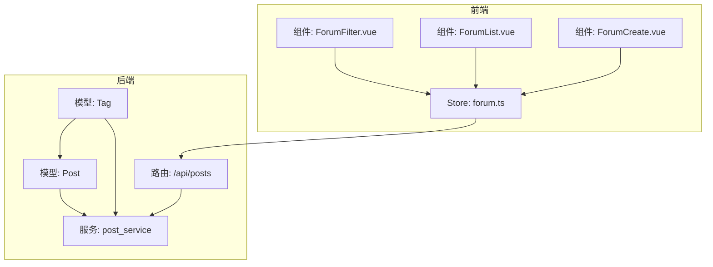
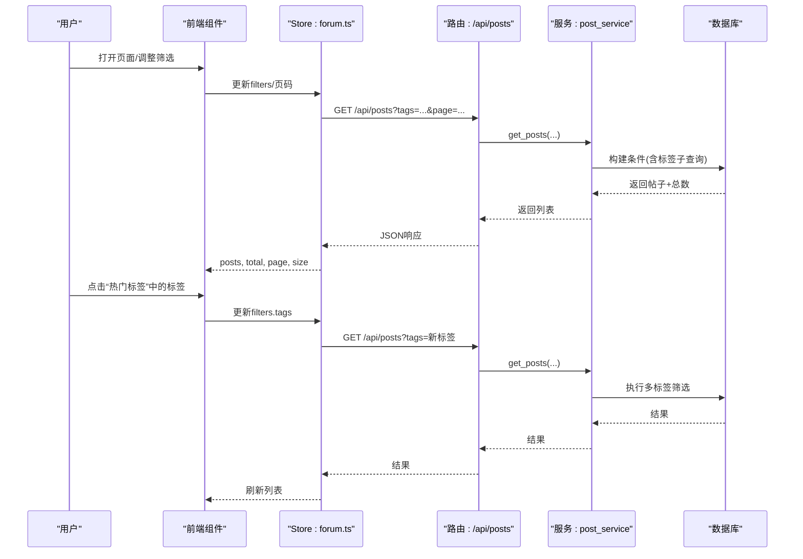
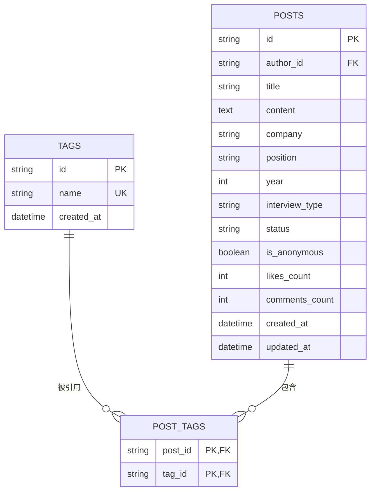
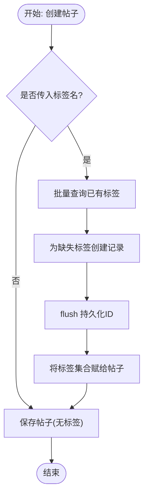
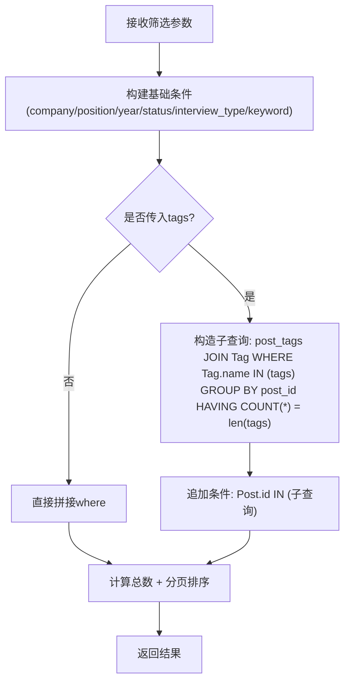
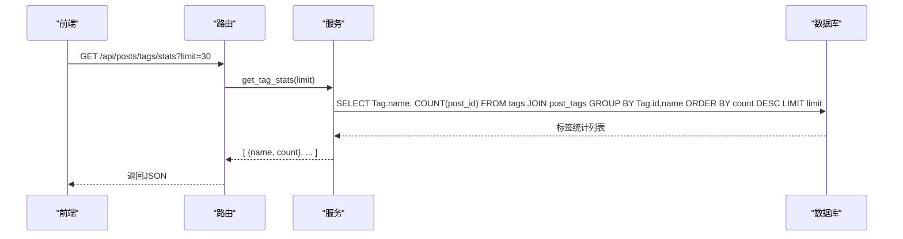
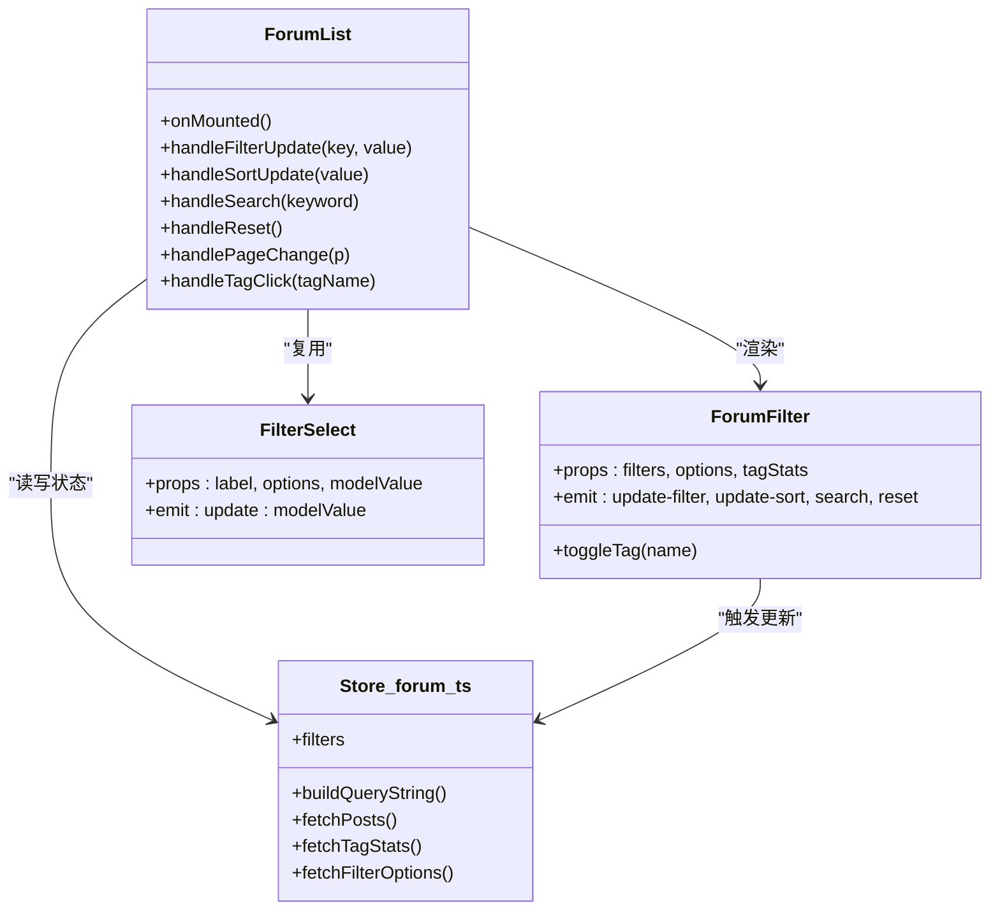
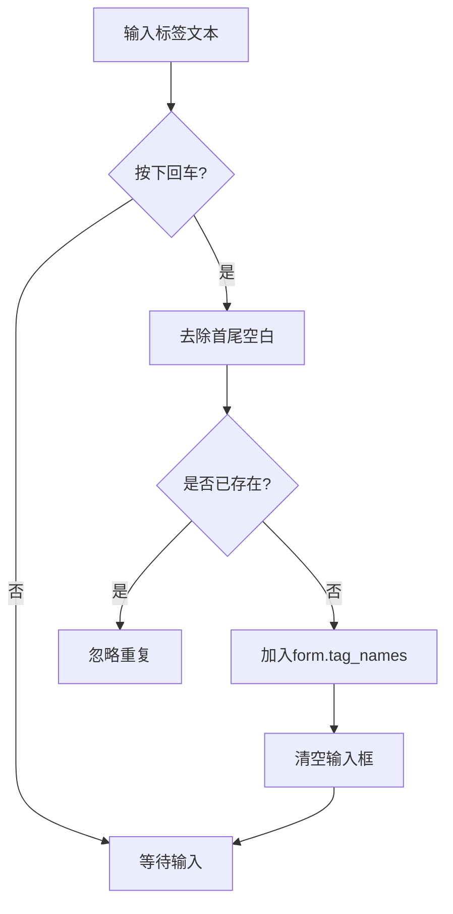
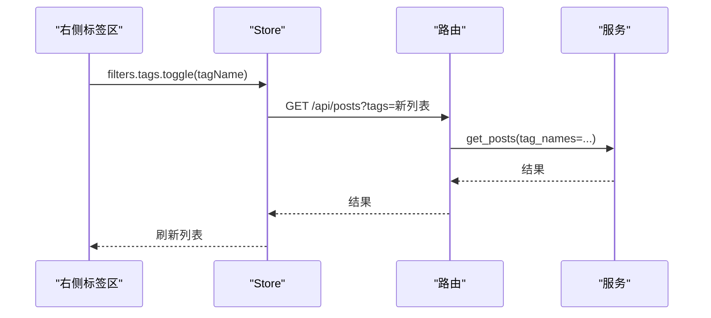
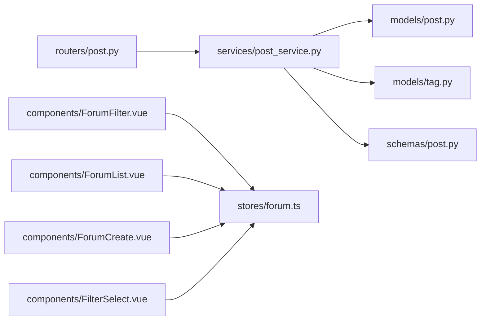

# 标签分类系统

<cite>
**本文引用的文件**   
- [backEnd/app/models/tag.py](file://backEnd/app/models/tag.py)
- [backEnd/app/models/post.py](file://backEnd/app/models/post.py)
- [backEnd/app/schemas/post.py](file://backEnd/app/schemas/post.py)
- [backEnd/app/routers/post.py](file://backEnd/app/routers/post.py)
- [backEnd/app/services/post_service.py](file://backEnd/app/services/post_service.py)
- [frontEnd/src/stores/forum.ts](file://frontEnd/src/stores/forum.ts)
- [frontEnd/src/components/forum/ForumFilter.vue](file://frontEnd/src/components/forum/ForumFilter.vue)
- [frontEnd/src/components/forum/ForumList.vue](file://frontEnd/src/components/forum/ForumList.vue)
- [frontEnd/src/components/forum/FilterSelect.vue](file://frontEnd/src/components/forum/FilterSelect.vue)
- [frontEnd/src/components/forum/ForumCreate.vue](file://frontEnd/src/components/forum/ForumCreate.vue)
</cite>

## 目录
1. [简介](#简介)
2. [项目结构](#项目结构)
3. [核心组件](#核心组件)
4. [架构总览](#架构总览)
5. [详细组件分析](#详细组件分析)
6. [依赖关系分析](#依赖关系分析)
7. [性能与扩展性](#性能与扩展性)
8. [故障排查指南](#故障排查指南)
9. [结论](#结论)
10. [附录：API 定义与数据模型](#附录api-定义与数据模型)

## 简介
本文件系统性地梳理了论坛“标签分类系统”的实现，覆盖以下关键能力：
- 动态标签管理：创建、去重、关联到帖子
- 热门标签统计：按使用频次排序的标签云
- 多标签组合筛选：同时匹配多个标签的精确过滤
- 前端筛选器组件：公司、岗位、年份、状态、面试类型、技术标签、排序等
- 自动补全与推荐：发布时提供常用标签建议
- 权重算法与展示：基于使用次数的热度排序
- 缓存与扩展：可扩展的筛选选项接口与后续缓存策略建议

该文档面向开发者与产品人员，既包含代码级实现细节，也提供可视化图示与最佳实践。

## 项目结构
围绕标签系统的核心文件分布如下：
- 后端模型与关系：Tag、Post 及 post_tags 多对多表
- 后端服务与路由：标签统计、筛选查询、创建帖子时的标签处理
- 前端 Store：统一的状态管理与 API 调用封装
- 前端组件：筛选面板、列表展示、发布表单（含标签输入）

图表来源
- [backEnd/app/models/tag.py:18-46](file://backEnd/app/models/tag.py#L18-L46)
- [backEnd/app/models/post.py:60-65](file://backEnd/app/models/post.py#L60-L65)
- [backEnd/app/services/post_service.py:14-34](file://backEnd/app/services/post_service.py#L14-L34)
- [backEnd/app/routers/post.py:63-128](file://backEnd/app/routers/post.py#L63-L128)
- [frontEnd/src/stores/forum.ts:115-143](file://frontEnd/src/stores/forum.ts#L115-L143)
- [frontEnd/src/components/forum/ForumFilter.vue:142-186](file://frontEnd/src/components/forum/ForumFilter.vue#L142-L186)
- [frontEnd/src/components/forum/ForumList.vue:169-259](file://frontEnd/src/components/forum/ForumList.vue#L169-L259)
- [frontEnd/src/components/forum/ForumCreate.vue:190-287](file://frontEnd/src/components/forum/ForumCreate.vue#L190-L287)

章节来源
- [backEnd/app/models/tag.py:18-46](file://backEnd/app/models/tag.py#L18-L46)
- [backEnd/app/models/post.py:60-65](file://backEnd/app/models/post.py#L60-L65)
- [backEnd/app/services/post_service.py:14-34](file://backEnd/app/services/post_service.py#L14-L34)
- [backEnd/app/routers/post.py:63-128](file://backEnd/app/routers/post.py#L63-L128)
- [frontEnd/src/stores/forum.ts:115-143](file://frontEnd/src/stores/forum.ts#L115-L143)
- [frontEnd/src/components/forum/ForumFilter.vue:142-186](file://frontEnd/src/components/forum/ForumFilter.vue#L142-L186)
- [frontEnd/src/components/forum/ForumList.vue:169-259](file://frontEnd/src/components/forum/ForumList.vue#L169-L259)
- [frontEnd/src/components/forum/ForumCreate.vue:190-287](file://frontEnd/src/components/forum/ForumCreate.vue#L190-L287)

## 核心组件
- 数据模型
  - Tag：唯一名称、创建时间、与 Post 的多对多关系
  - Post：结构化字段（公司、岗位、年份、状态、面试类型）、与 Tag 的多对多关系
  - post_tags：多对多中间表，含联合唯一约束防止重复关联
- 服务层
  - 获取或创建标签：批量查询已有标签，缺失则创建并 flush
  - 多标签组合筛选：通过子查询 + having count 确保“同时具备所有指定标签”
  - 热门标签统计：按标签分组计数，降序取 Top N
  - 筛选器选项：动态获取公司、岗位等字段的去重值
- 路由层
  - 帖子列表：支持 company/position/year/status/interview_type/tags/keyword/sort_by/page/size
  - 标签统计：GET /api/posts/tags/stats
  - 筛选选项：GET /api/posts/filters/options
- 前端 Store
  - 构建查询参数：将 filters 转为 URLSearchParams
  - 拉取数据：posts、tagStats、filterOptions
  - 交互：点赞、评论、分页、重置筛选
- 前端组件
  - ForumFilter：筛选面板，支持关键词、公司、岗位、年份、状态、面试类型、技术标签、排序
  - ForumList：主视图，左侧筛选、中间列表、右侧热门标签；点击标签进行切换筛选
  - FilterSelect：通用下拉选择组件
  - ForumCreate：发布面经，支持手动添加标签与推荐标签

章节来源
- [backEnd/app/models/tag.py:18-46](file://backEnd/app/models/tag.py#L18-L46)
- [backEnd/app/models/post.py:60-65](file://backEnd/app/models/post.py#L60-L65)
- [backEnd/app/services/post_service.py:96-166](file://backEnd/app/services/post_service.py#L96-L166)
- [backEnd/app/services/post_service.py:226-236](file://backEnd/app/services/post_service.py#L226-L236)
- [backEnd/app/routers/post.py:63-128](file://backEnd/app/routers/post.py#L63-L128)
- [frontEnd/src/stores/forum.ts:130-143](file://frontEnd/src/stores/forum.ts#L130-L143)
- [frontEnd/src/components/forum/ForumFilter.vue:142-186](file://frontEnd/src/components/forum/ForumFilter.vue#L142-L186)
- [frontEnd/src/components/forum/ForumList.vue:169-259](file://frontEnd/src/components/forum/ForumList.vue#L169-L259)
- [frontEnd/src/components/forum/FilterSelect.vue:1-26](file://frontEnd/src/components/forum/FilterSelect.vue#L1-L26)
- [frontEnd/src/components/forum/ForumCreate.vue:190-287](file://frontEnd/src/components/forum/ForumCreate.vue#L190-L287)

## 架构总览
从用户操作到数据落库的端到端流程如下：

图表来源
- [frontEnd/src/components/forum/ForumList.vue:186-242](file://frontEnd/src/components/forum/ForumList.vue#L186-L242)
- [frontEnd/src/stores/forum.ts:130-161](file://frontEnd/src/stores/forum.ts#L130-L161)
- [backEnd/app/routers/post.py:63-105](file://backEnd/app/routers/post.py#L63-L105)
- [backEnd/app/services/post_service.py:96-166](file://backEnd/app/services/post_service.py#L96-L166)

## 详细组件分析

### 数据模型与关系
- Tag 与 Post 通过 post_tags 建立多对多关系
- post_tags 包含联合唯一约束，避免同一帖子重复关联同一标签
- Tag.name 唯一索引，保证标签名全局唯一

图表来源
- [backEnd/app/models/tag.py:18-46](file://backEnd/app/models/tag.py#L18-L46)
- [backEnd/app/models/post.py:18-65](file://backEnd/app/models/post.py#L18-L65)

章节来源
- [backEnd/app/models/tag.py:18-46](file://backEnd/app/models/tag.py#L18-L46)
- [backEnd/app/models/post.py:60-65](file://backEnd/app/models/post.py#L60-L65)

### 标签动态管理与去重机制
- 创建帖子时，若传入 tag_names：
  - 先批量查询已存在标签
  - 不存在则创建新标签
  - 将标签集合赋给帖子
- 去重保障：
  - Tag.name 唯一约束
  - post_tags 联合唯一约束避免重复关联

图表来源
- [backEnd/app/services/post_service.py:14-34](file://backEnd/app/services/post_service.py#L14-L34)
- [backEnd/app/services/post_service.py:70-93](file://backEnd/app/services/post_service.py#L70-L93)

章节来源
- [backEnd/app/services/post_service.py:14-34](file://backEnd/app/services/post_service.py#L14-L34)
- [backEnd/app/services/post_service.py:70-93](file://backEnd/app/services/post_service.py#L70-L93)

### 多标签组合筛选与查询逻辑
- 当传入 tags 列表时，使用子查询在 post_tags 中查找“同时包含所有指定标签”的帖子
- 使用 group_by + having count == len(tag_names) 确保“全部命中”
- 与其他筛选条件（公司、岗位、年份、状态、面试类型、关键词）以 AND 组合

图表来源
- [backEnd/app/services/post_service.py:96-166](file://backEnd/app/services/post_service.py#L96-L166)

章节来源
- [backEnd/app/services/post_service.py:96-166](file://backEnd/app/services/post_service.py#L96-L166)

### 热门标签统计与权重算法
- 统计规则：按标签分组计数，按数量降序，限制 Top N
- 权重算法：当前采用“使用次数”作为权重，用于排序和展示
- 接口：GET /api/posts/tags/stats?limit=N

图表来源
- [backEnd/app/routers/post.py:107-114](file://backEnd/app/routers/post.py#L107-L114)
- [backEnd/app/services/post_service.py:226-236](file://backEnd/app/services/post_service.py#L226-L236)

章节来源
- [backEnd/app/routers/post.py:107-114](file://backEnd/app/routers/post.py#L107-L114)
- [backEnd/app/services/post_service.py:226-236](file://backEnd/app/services/post_service.py#L226-L236)

### 前端筛选器组件与交互
- ForumFilter：
  - 支持关键词搜索、公司/岗位/年份下拉、状态/面试类型按钮组、技术标签多选、排序切换
  - 通过事件向父组件上报筛选变化
- ForumList：
  - 监听筛选变化，重置页码并重新请求
  - 右侧“热门标签”区域点击标签可切换筛选
- FilterSelect：通用下拉选择组件
- Store：
  - buildQueryString 将 filters 转换为查询字符串
  - fetchPosts 发起请求并更新本地状态

图表来源
- [frontEnd/src/components/forum/ForumFilter.vue:142-186](file://frontEnd/src/components/forum/ForumFilter.vue#L142-L186)
- [frontEnd/src/components/forum/ForumList.vue:169-259](file://frontEnd/src/components/forum/ForumList.vue#L169-L259)
- [frontEnd/src/components/forum/FilterSelect.vue:1-26](file://frontEnd/src/components/forum/FilterSelect.vue#L1-L26)
- [frontEnd/src/stores/forum.ts:115-143](file://frontEnd/src/stores/forum.ts#L115-L143)

章节来源
- [frontEnd/src/components/forum/ForumFilter.vue:142-186](file://frontEnd/src/components/forum/ForumFilter.vue#L142-L186)
- [frontEnd/src/components/forum/ForumList.vue:169-259](file://frontEnd/src/components/forum/ForumList.vue#L169-L259)
- [frontEnd/src/components/forum/FilterSelect.vue:1-26](file://frontEnd/src/components/forum/FilterSelect.vue#L1-L26)
- [frontEnd/src/stores/forum.ts:115-143](file://frontEnd/src/stores/forum.ts#L115-L143)

### 标签自动补全与推荐
- 发布表单 ForumCreate：
  - 支持回车添加标签
  - 内置“推荐标签”列表，点击即可添加
  - 前端去重：避免重复添加相同标签
- 后端去重：
  - Tag.name 唯一约束
  - _get_or_create_tags 批量查询后按需创建

图表来源
- [frontEnd/src/components/forum/ForumCreate.vue:231-247](file://frontEnd/src/components/forum/ForumCreate.vue#L231-L247)
- [backEnd/app/services/post_service.py:14-34](file://backEnd/app/services/post_service.py#L14-L34)

章节来源
- [frontEnd/src/components/forum/ForumCreate.vue:231-247](file://frontEnd/src/components/forum/ForumCreate.vue#L231-L247)
- [backEnd/app/services/post_service.py:14-34](file://backEnd/app/services/post_service.py#L14-L34)

### 标签云展示与交互
- 右侧“热门标签”区域展示 Top N 标签及其计数
- 点击标签：
  - 若已在 filters.tags 中则移除
  - 否则添加到 filters.tags
  - 重置页码并重新请求列表

图表来源
- [frontEnd/src/components/forum/ForumList.vue:235-242](file://frontEnd/src/components/forum/ForumList.vue#L235-L242)
- [backEnd/app/routers/post.py:63-105](file://backEnd/app/routers/post.py#L63-L105)
- [backEnd/app/services/post_service.py:96-166](file://backEnd/app/services/post_service.py#L96-L166)

章节来源
- [frontEnd/src/components/forum/ForumList.vue:235-242](file://frontEnd/src/components/forum/ForumList.vue#L235-L242)
- [backEnd/app/routers/post.py:63-105](file://backEnd/app/routers/post.py#L63-L105)
- [backEnd/app/services/post_service.py:96-166](file://backEnd/app/services/post_service.py#L96-L166)

## 依赖关系分析
- 后端
  - routers.post 依赖 services.post_service
  - services.post_service 依赖 models.post、models.tag、schemas.post
  - models.post 与 models.tag 通过 post_tags 多对多关联
- 前端
  - components 依赖 stores/forum.ts
  - stores/forum.ts 通过 apiRequest 访问 /api/posts 系列接口

图表来源
- [backEnd/app/routers/post.py:1-249](file://backEnd/app/routers/post.py#L1-L249)
- [backEnd/app/services/post_service.py:1-249](file://backEnd/app/services/post_service.py#L1-L249)
- [backEnd/app/models/post.py:1-65](file://backEnd/app/models/post.py#L1-L65)
- [backEnd/app/models/tag.py:1-46](file://backEnd/app/models/tag.py#L1-L46)
- [backEnd/app/schemas/post.py:1-91](file://backEnd/app/schemas/post.py#L1-L91)
- [frontEnd/src/stores/forum.ts:1-315](file://frontEnd/src/stores/forum.ts#L1-L315)
- [frontEnd/src/components/forum/ForumFilter.vue:1-186](file://frontEnd/src/components/forum/ForumFilter.vue#L1-L186)
- [frontEnd/src/components/forum/ForumList.vue:1-259](file://frontEnd/src/components/forum/ForumList.vue#L1-L259)
- [frontEnd/src/components/forum/FilterSelect.vue:1-26](file://frontEnd/src/components/forum/FilterSelect.vue#L1-L26)
- [frontEnd/src/components/forum/ForumCreate.vue:1-287](file://frontEnd/src/components/forum/ForumCreate.vue#L1-L287)

章节来源
- [backEnd/app/routers/post.py:1-249](file://backEnd/app/routers/post.py#L1-L249)
- [backEnd/app/services/post_service.py:1-249](file://backEnd/app/services/post_service.py#L1-L249)
- [backEnd/app/models/post.py:1-65](file://backEnd/app/models/post.py#L1-L65)
- [backEnd/app/models/tag.py:1-46](file://backEnd/app/models/tag.py#L1-L46)
- [backEnd/app/schemas/post.py:1-91](file://backEnd/app/schemas/post.py#L1-L91)
- [frontEnd/src/stores/forum.ts:1-315](file://frontEnd/src/stores/forum.ts#L1-L315)
- [frontEnd/src/components/forum/ForumFilter.vue:1-186](file://frontEnd/src/components/forum/ForumFilter.vue#L1-L186)
- [frontEnd/src/components/forum/ForumList.vue:1-259](file://frontEnd/src/components/forum/ForumList.vue#L1-L259)
- [frontEnd/src/components/forum/FilterSelect.vue:1-26](file://frontEnd/src/components/forum/FilterSelect.vue#L1-L26)
- [frontEnd/src/components/forum/ForumCreate.vue:1-287](file://frontEnd/src/components/forum/ForumCreate.vue#L1-L287)

## 性能与扩展性
- 查询优化
  - 多标签筛选使用子查询 + having count，避免多次往返
  - 热门标签统计使用聚合与 limit，控制返回量
- 索引建议
  - Tag.name 已建唯一索引
  - Post.company、Post.position、Post.year、Post.status 已建索引，利于筛选
  - 可考虑在 post_tags 上建立复合索引以提升多标签筛选性能（视数据规模评估）
- 缓存策略（建议）
  - 热门标签统计：可按时间窗口缓存（如 Redis），降低频繁聚合开销
  - 筛选器选项：公司、岗位等静态或低频变更字段可缓存
- 扩展点
  - 新增筛选维度：在后端增加 distinct 字段查询，在前端 store 与组件中接入
  - 标签权重算法：可在统计接口中引入加权因子（如最近使用时间衰减、互动权重等）

[本节为通用指导，不直接分析具体文件]

## 故障排查指南
- 常见问题
  - 标签未生效：检查 filters.tags 是否正确传递至后端，确认后端 tags 参数解析与子查询逻辑
  - 重复标签：前端 addTag 已做去重，后端 Tag.name 唯一约束与 post_tags 联合唯一约束共同保障
  - 热门标签为空：确认是否存在标签关联数据，检查 /api/posts/tags/stats 接口返回
- 定位步骤
  - 查看浏览器网络请求，确认 querystring 中 tags 参数格式为逗号分隔
  - 检查后端日志与服务层 SQL 执行情况
  - 验证数据库 post_tags 表是否存在对应记录

章节来源
- [backEnd/app/services/post_service.py:96-166](file://backEnd/app/services/post_service.py#L96-L166)
- [backEnd/app/services/post_service.py:226-236](file://backEnd/app/services/post_service.py#L226-L236)
- [frontEnd/src/stores/forum.ts:130-143](file://frontEnd/src/stores/forum.ts#L130-L143)

## 结论
本标签分类系统在后端通过严谨的数据模型与服务层逻辑实现了标签的动态管理、多标签组合筛选与热门标签统计；在前端通过 Store 与组件协作提供了完整的筛选体验与标签云展示。整体设计清晰、扩展性强，适合进一步引入缓存与更复杂的权重算法以满足更大规模场景。

[本节为总结，不直接分析具体文件]

## 附录：API 定义与数据模型

### 接口定义
- 获取帖子列表
  - 方法：GET
  - 路径：/api/posts
  - 查询参数：company、position、year、status、interview_type、tags（逗号分隔）、keyword、sort_by（latest/hottest）、page、size
  - 响应：PostListResponse
- 获取热门标签统计
  - 方法：GET
  - 路径：/api/posts/tags/stats
  - 查询参数：limit
  - 响应：list<TagStatResponse>
- 获取筛选器可选值
  - 方法：GET
  - 路径：/api/posts/filters/options
  - 响应：{ companies, positions, statuses, interview_types, years }

章节来源
- [backEnd/app/routers/post.py:63-128](file://backEnd/app/routers/post.py#L63-L128)
- [backEnd/app/schemas/post.py:52-62](file://backEnd/app/schemas/post.py#L52-L62)

### 数据模型
- Tag
  - 字段：id、name、created_at
  - 关系：posts（多对多）
- Post
  - 字段：id、author_id、title、content、company、position、year、interview_type、status、is_anonymous、likes_count、comments_count、created_at、updated_at
  - 关系：tags（多对多）
- post_tags
  - 字段：post_id、tag_id（联合主键，外键约束，唯一约束）

章节来源
- [backEnd/app/models/tag.py:18-46](file://backEnd/app/models/tag.py#L18-L46)
- [backEnd/app/models/post.py:18-65](file://backEnd/app/models/post.py#L18-L65)