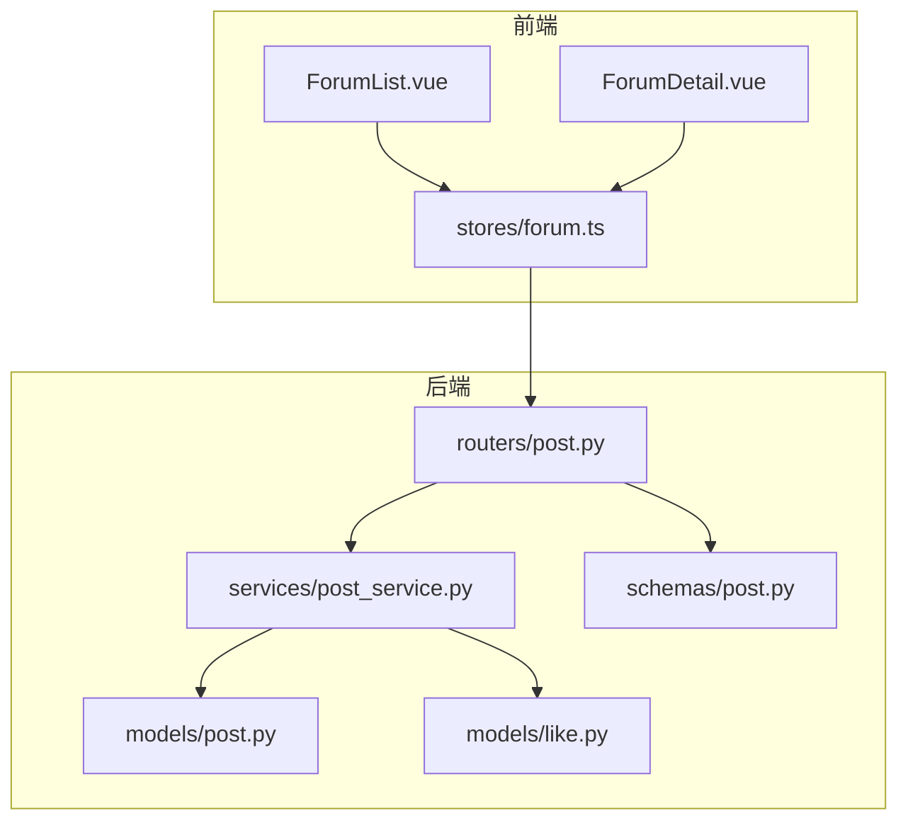
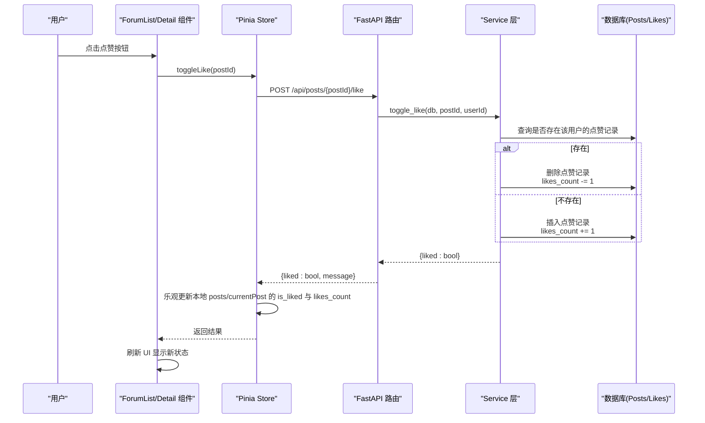
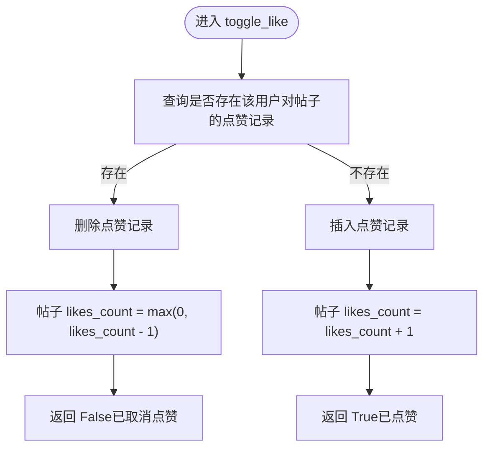
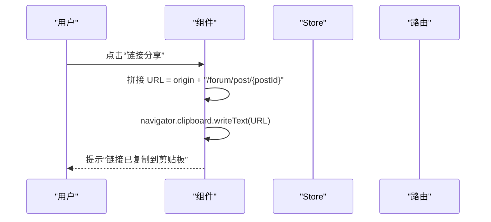

# 社交互动功能

<cite>
**本文引用的文件**   
- [backEnd/app/models/like.py](file://backEnd/app/models/like.py)
- [backEnd/app/models/post.py](file://backEnd/app/models/post.py)
- [backEnd/app/schemas/post.py](file://backEnd/app/schemas/post.py)
- [backEnd/app/routers/post.py](file://backEnd/app/routers/post.py)
- [backEnd/app/services/post_service.py](file://backEnd/app/services/post_service.py)
- [frontEnd/src/stores/forum.ts](file://frontEnd/src/stores/forum.ts)
- [frontEnd/src/components/forum/ForumDetail.vue](file://frontEnd/src/components/forum/ForumDetail.vue)
- [frontEnd/src/components/forum/ForumList.vue](file://frontEnd/src/components/forum/ForumList.vue)
</cite>

## 目录
1. [简介](#简介)
2. [项目结构](#项目结构)
3. [核心组件](#核心组件)
4. [架构总览](#架构总览)
5. [详细组件分析](#详细组件分析)
6. [依赖关系分析](#依赖关系分析)
7. [性能与缓存策略](#性能与缓存策略)
8. [故障排查指南](#故障排查指南)
9. [结论](#结论)
10. [附录：扩展接口与最佳实践](#附录：扩展接口与最佳实践)

## 简介
本文件面向“社交互动”能力，聚焦以下目标：
- 点赞系统：实现点赞/取消点赞的原子操作、状态同步、用户点赞记录管理。
- 分享链接生成：提供稳定的分享 URL 构造与前端复制体验。
- 社交数据展示：列表与详情页的点赞数、评论数、标签统计等。
- 用户行为追踪：为后续埋点预留扩展点（如点赞、评论、分享）。
- 防重复点赞：通过数据库唯一约束与服务端切换逻辑保证幂等。
- 性能优化：批量查询已点赞集合、分页与排序、响应体精简。
- 组件封装与扩展：前后端一致的接口契约与可复用 Store/组件。

## 项目结构
后端采用 FastAPI + SQLAlchemy 异步 ORM；前端使用 Vue 3 + Pinia 进行状态管理与 UI 渲染。社交互动相关的关键路径如下：
- 模型层：帖子 Post、点赞 Like
- 服务层：帖子与点赞业务逻辑
- 路由层：REST API 暴露点赞、分享、列表、详情等
- 前端 Store：统一请求封装与本地状态更新
- 前端组件：列表与详情页的交互入口



图表来源
- [backEnd/app/routers/post.py:1-249](file://backEnd/app/routers/post.py#L1-L249)
- [backEnd/app/services/post_service.py:1-249](file://backEnd/app/services/post_service.py#L1-L249)
- [backEnd/app/models/post.py:1-65](file://backEnd/app/models/post.py#L1-L65)
- [backEnd/app/models/like.py:1-47](file://backEnd/app/models/like.py#L1-L47)
- [backEnd/app/schemas/post.py:1-91](file://backEnd/app/schemas/post.py#L1-L91)
- [frontEnd/src/components/forum/ForumList.vue:1-259](file://frontEnd/src/components/forum/ForumList.vue#L1-L259)
- [frontEnd/src/components/forum/ForumDetail.vue:1-297](file://frontEnd/src/components/forum/ForumDetail.vue#L1-L297)
- [frontEnd/src/stores/forum.ts:1-315](file://frontEnd/src/stores/forum.ts#L1-L315)

章节来源
- [backEnd/app/routers/post.py:1-249](file://backEnd/app/routers/post.py#L1-L249)
- [backEnd/app/services/post_service.py:1-249](file://backEnd/app/services/post_service.py#L1-L249)
- [backEnd/app/models/post.py:1-65](file://backEnd/app/models/post.py#L1-L65)
- [backEnd/app/models/like.py:1-47](file://backEnd/app/models/like.py#L1-L47)
- [backEnd/app/schemas/post.py:1-91](file://backEnd/app/schemas/post.py#L1-L91)
- [frontEnd/src/stores/forum.ts:1-315](file://frontEnd/src/stores/forum.ts#L1-L315)
- [frontEnd/src/components/forum/ForumList.vue:1-259](file://frontEnd/src/components/forum/ForumList.vue#L1-L259)
- [frontEnd/src/components/forum/ForumDetail.vue:1-297](file://frontEnd/src/components/forum/ForumDetail.vue#L1-L297)

## 核心组件
- 点赞模型与约束
  - 点赞表包含 post_id、user_id 及创建时间，并通过唯一约束防止重复点赞。
- 帖子模型
  - 维护 likes_count、comments_count 等计数字段，便于快速展示。
- 服务层
  - 提供 toggle_like 切换点赞、check_user_likes 批量判断是否已赞、_build_post_response 组装响应并注入 is_liked。
- 路由层
  - 暴露 /api/posts/{post_id}/like 用于切换点赞；/api/posts/{post_id}/share 用于生成分享链接；列表接口返回 posts 与 total，并在返回列表中附带 is_liked。
- 前端 Store
  - 统一封装 apiRequest，自动携带 Authorization；toggleLike 在成功时立即乐观更新本地 posts 与 currentPost 的状态与计数。
- 前端组件
  - ForumList.vue 与 ForumDetail.vue 均调用 store.toggleLike 并即时刷新 UI。

章节来源
- [backEnd/app/models/like.py:16-47](file://backEnd/app/models/like.py#L16-L47)
- [backEnd/app/models/post.py:18-65](file://backEnd/app/models/post.py#L18-L65)
- [backEnd/app/services/post_service.py:189-224](file://backEnd/app/services/post_service.py#L189-L224)
- [backEnd/app/services/post_service.py:37-68](file://backEnd/app/services/post_service.py#L37-L68)
- [backEnd/app/routers/post.py:165-177](file://backEnd/app/routers/post.py#L165-L177)
- [backEnd/app/routers/post.py:236-241](file://backEnd/app/routers/post.py#L236-L241)
- [backEnd/app/routers/post.py:63-105](file://backEnd/app/routers/post.py#L63-L105)
- [frontEnd/src/stores/forum.ts:188-208](file://frontEnd/src/stores/forum.ts#L188-L208)
- [frontEnd/src/components/forum/ForumList.vue:227-229](file://frontEnd/src/components/forum/ForumList.vue#L227-L229)
- [frontEnd/src/components/forum/ForumDetail.vue:208-214](file://frontEnd/src/components/forum/ForumDetail.vue#L208-L214)

## 架构总览
从前端到后端的完整调用链如下：



图表来源
- [backEnd/app/routers/post.py:165-177](file://backEnd/app/routers/post.py#L165-L177)
- [backEnd/app/services/post_service.py:189-209](file://backEnd/app/services/post_service.py#L189-L209)
- [backEnd/app/models/like.py:16-47](file://backEnd/app/models/like.py#L16-L47)
- [backEnd/app/models/post.py:47-48](file://backEnd/app/models/post.py#L47-L48)
- [frontEnd/src/stores/forum.ts:188-208](file://frontEnd/src/stores/forum.ts#L188-L208)
- [frontEnd/src/components/forum/ForumList.vue:227-229](file://frontEnd/src/components/forum/ForumList.vue#L227-L229)
- [frontEnd/src/components/forum/ForumDetail.vue:208-214](file://frontEnd/src/components/forum/ForumDetail.vue#L208-L214)

## 详细组件分析

### 点赞系统（原子性、幂等与状态同步）
- 防重复点赞
  - 数据库层：likes 表对 (post_id, user_id) 设置唯一约束，避免重复插入。
  - 服务层：先查询是否存在当前用户的点赞记录，存在则删除并递减计数，不存在则新增并递增计数，确保幂等。
- 原子性与一致性
  - 单条事务内完成点赞记录的增删与 likes_count 的增减，flush 提交，保证计数与记录一致。
- 状态同步
  - 列表接口：在服务层根据当前用户 ID 批量查询已点赞集合，再在响应构建阶段填充 is_liked。
  - 前端 Store：收到服务端返回的 liked 布尔值后，立即更新本地 posts 与 currentPost 的 is_liked 与 likes_count，实现无闪烁的即时反馈。



图表来源
- [backEnd/app/services/post_service.py:189-209](file://backEnd/app/services/post_service.py#L189-L209)
- [backEnd/app/models/like.py:16-47](file://backEnd/app/models/like.py#L16-L47)
- [backEnd/app/models/post.py:47-48](file://backEnd/app/models/post.py#L47-L48)

章节来源
- [backEnd/app/models/like.py:16-47](file://backEnd/app/models/like.py#L16-L47)
- [backEnd/app/services/post_service.py:189-209](file://backEnd/app/services/post_service.py#L189-L209)
- [backEnd/app/routers/post.py:165-177](file://backEnd/app/routers/post.py#L165-L177)
- [frontEnd/src/stores/forum.ts:188-208](file://frontEnd/src/stores/forum.ts#L188-L208)

### 分享链接生成
- 后端接口
  - 提供 /api/posts/{post_id}/share，返回 share_url 与提示消息。
- 前端实现
  - 列表与详情页均支持“复制链接”，直接拼接 window.location.origin 与路由前缀，调用剪贴板 API 并给出友好提示。
- 注意
  - 生产环境需将基础 URL 配置化，避免硬编码。



图表来源
- [backEnd/app/routers/post.py:236-241](file://backEnd/app/routers/post.py#L236-L241)
- [frontEnd/src/components/forum/ForumList.vue:244-252](file://frontEnd/src/components/forum/ForumList.vue#L244-L252)
- [frontEnd/src/components/forum/ForumDetail.vue:216-224](file://frontEnd/src/components/forum/ForumDetail.vue#L216-L224)

章节来源
- [backEnd/app/routers/post.py:236-241](file://backEnd/app/routers/post.py#L236-L241)
- [frontEnd/src/components/forum/ForumList.vue:244-252](file://frontEnd/src/components/forum/ForumList.vue#L244-L252)
- [frontEnd/src/components/forum/ForumDetail.vue:216-224](file://frontEnd/src/components/forum/ForumDetail.vue#L216-L224)

### 社交数据展示与筛选
- 列表接口
  - 支持按公司、岗位、年份、状态、面试类型、标签、关键词组合筛选，支持 latest/hottest 排序与分页。
  - 返回 posts 列表与 total/page/size，同时为每个帖子附加 is_liked。
- 热门标签
  - 提供 /api/posts/tags/stats 接口，返回标签名与对应数量，供右侧面板展示。
- 前端展示
  - 列表页展示公司、岗位、年份、面试类型、技术标签、作者、时间、点赞与评论数；详情页以卡片形式呈现结构化信息与正文。

章节来源
- [backEnd/app/routers/post.py:63-105](file://backEnd/app/routers/post.py#L63-L105)
- [backEnd/app/routers/post.py:108-114](file://backEnd/app/routers/post.py#L108-L114)
- [backEnd/app/services/post_service.py:96-166](file://backEnd/app/services/post_service.py#L96-L166)
- [backEnd/app/services/post_service.py:226-236](file://backEnd/app/services/post_service.py#L226-L236)
- [frontEnd/src/components/forum/ForumList.vue:1-259](file://frontEnd/src/components/forum/ForumList.vue#L1-L259)
- [frontEnd/src/components/forum/ForumDetail.vue:1-297](file://frontEnd/src/components/forum/ForumDetail.vue#L1-L297)

### 用户行为追踪（埋点建议）
- 建议在以下时机触发埋点事件（不修改现有代码，仅作为扩展建议）：
  - 点赞：toggleLike 成功后
  - 评论：createComment 成功后
  - 分享：复制链接成功后
  - 浏览：加载帖子详情或列表时
- 埋点数据结构建议包含：userId、actionType、targetId（post/comment）、timestamp、extra（如设备信息、页面来源）

[本节为通用建议，不涉及具体文件]

## 依赖关系分析
- 模型依赖
  - Post 与 Like 通过外键关联，且 Likes 表具备唯一约束保障幂等。
- 服务依赖
  - Service 层依赖 Post、Like、Tag 模型，负责业务编排与响应组装。
- 路由依赖
  - Router 依赖 Service 与 Schema，对外暴露 REST 接口。
- 前端依赖
  - Store 封装 HTTP 请求，组件消费 Store 提供的 actions 与 state。

```mermaid
classDiagram
class Post {
+id
+author_id
+title
+content
+company
+position
+year
+interview_type
+status
+is_anonymous
+likes_count
+comments_count
+created_at
+updated_at
}
class Like {
+id
+post_id
+user_id
+created_at
}
class PostService {
+create_post()
+get_posts()
+get_post()
+delete_post()
+toggle_like()
+check_user_likes()
+get_tag_stats()
}
class PostRouter {
+POST /posts
+GET /posts
+GET /posts/{id}
+DELETE /posts/{id}
+POST /posts/{id}/like
+GET /posts/{id}/comments
+POST /posts/{id}/comments
+DELETE /posts/comments/{comment_id}
+POST /posts/{id}/share
+GET /posts/tags/stats
+GET /posts/filters/options
}
PostService --> Post : "读写"
PostService --> Like : "读写"
PostRouter --> PostService : "调用"
```

图表来源
- [backEnd/app/models/post.py:18-65](file://backEnd/app/models/post.py#L18-L65)
- [backEnd/app/models/like.py:16-47](file://backEnd/app/models/like.py#L16-L47)
- [backEnd/app/services/post_service.py:1-249](file://backEnd/app/services/post_service.py#L1-L249)
- [backEnd/app/routers/post.py:1-249](file://backEnd/app/routers/post.py#L1-L249)

章节来源
- [backEnd/app/models/post.py:18-65](file://backEnd/app/models/post.py#L18-L65)
- [backEnd/app/models/like.py:16-47](file://backEnd/app/models/like.py#L16-L47)
- [backEnd/app/services/post_service.py:1-249](file://backEnd/app/services/post_service.py#L1-L249)
- [backEnd/app/routers/post.py:1-249](file://backEnd/app/routers/post.py#L1-L249)

## 性能与缓存策略
- 已点赞集合批量查询
  - 列表接口在服务层一次性查询当前用户对一批 post_id 的点赞情况，减少 N+1 查询开销。
- 计数字段
  - 使用 likes_count/comments_count 提升列表渲染性能，避免实时聚合计算。
- 分页与排序
  - 列表接口支持 page/size 与 latest/hottest 排序，降低单次响应体量。
- 前端乐观更新
  - 点赞成功后立即更新本地状态，避免等待二次拉取带来的闪烁。
- 可选缓存（建议）
  - 对热门帖子详情与标签统计可增加 Redis 缓存，设置合理过期时间与失效策略（如点赞/评论变更后失效）。
  - 列表接口可按条件缓存，结合 ETag/Last-Modified 提高命中率。

[本节为通用建议，不涉及具体文件]

## 故障排查指南
- 重复点赞
  - 现象：同一用户多次点击点赞仍只生效一次。
  - 原因：数据库唯一约束与服务端切换逻辑共同保证幂等。
  - 处理：检查 likes 表唯一索引是否正常；确认服务层未绕过切换逻辑直接插入。
- 点赞计数不一致
  - 现象：UI 显示与数据库计数不一致。
  - 原因：并发写入导致计数丢失。
  - 处理：考虑使用原子自增（如数据库级 INCR）或在事务中加行锁；确保 flush 提交。
- 分享链接无效
  - 现象：生成的链接无法访问。
  - 原因：前端拼接的 origin 与后端 _get_base_url 不一致或部署域名不同。
  - 处理：统一配置基础 URL，或通过环境变量注入。
- 权限错误
  - 现象：删除帖子/评论报 403。
  - 原因：非作者尝试删除。
  - 处理：校验当前用户身份与资源归属。

章节来源
- [backEnd/app/models/like.py:16-47](file://backEnd/app/models/like.py#L16-L47)
- [backEnd/app/services/post_service.py:189-209](file://backEnd/app/services/post_service.py#L189-L209)
- [backEnd/app/routers/post.py:147-160](file://backEnd/app/routers/post.py#L147-L160)
- [backEnd/app/routers/post.py:236-241](file://backEnd/app/routers/post.py#L236-L241)

## 结论
本方案通过数据库唯一约束与服务端切换逻辑实现了点赞的幂等与原子性，配合批量已点赞集合查询与前端乐观更新，提供了流畅的社交互动体验。分享链接生成简洁可靠，社交数据展示兼顾性能与可读性。建议在后续迭代中引入缓存与埋点体系，进一步提升性能与可观测性。

[本节为总结，不涉及具体文件]

## 附录：扩展接口与最佳实践
- 扩展接口建议
  - 收藏/关注：参考点赞模型设计，增加收藏表与 toggle_favorite 接口。
  - 评论点赞：在 Comment 模型上增加点赞表与计数字段。
  - 分享统计：记录分享次数与渠道，便于运营分析。
- 最佳实践
  - 所有写操作保持幂等，优先使用唯一约束与切换逻辑。
  - 热点数据（如热门帖子、标签统计）加入缓存层，并设置合理的失效策略。
  - 前端统一错误处理与用户提示，关键操作提供撤销与重试机制。
  - 埋点覆盖关键路径，形成数据闭环。

[本节为通用建议，不涉及具体文件]