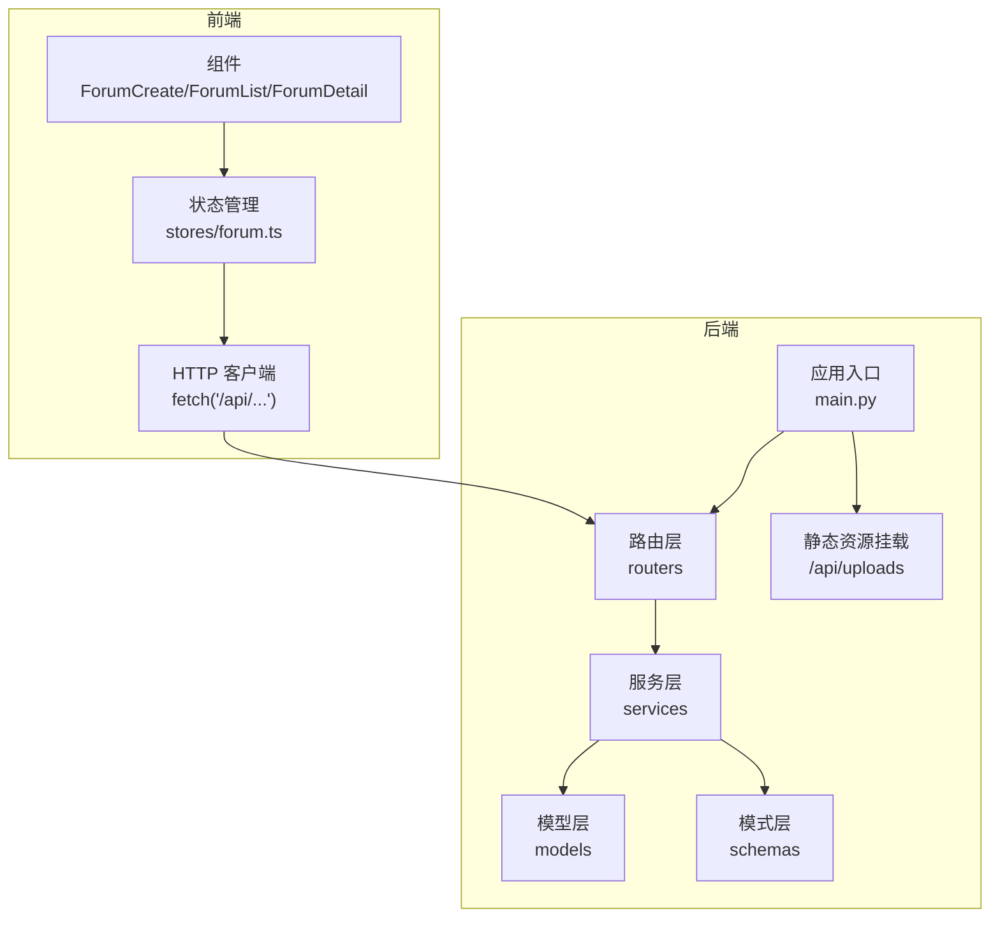
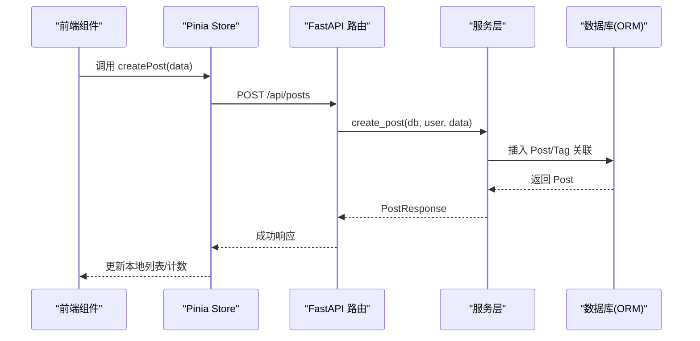
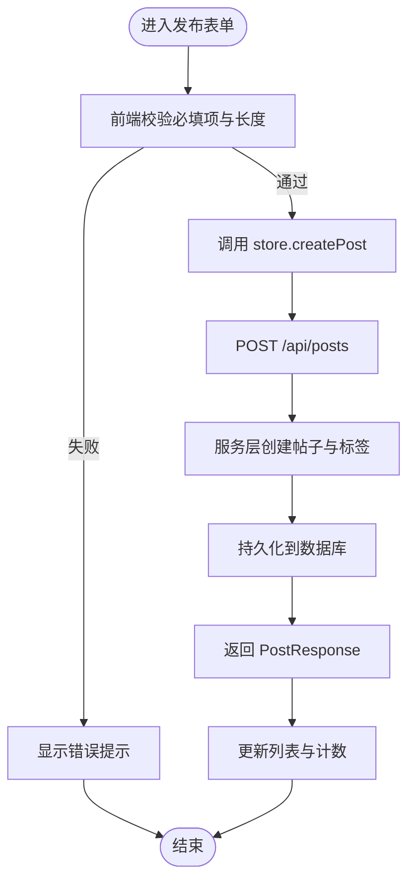
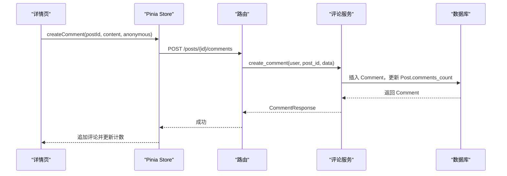
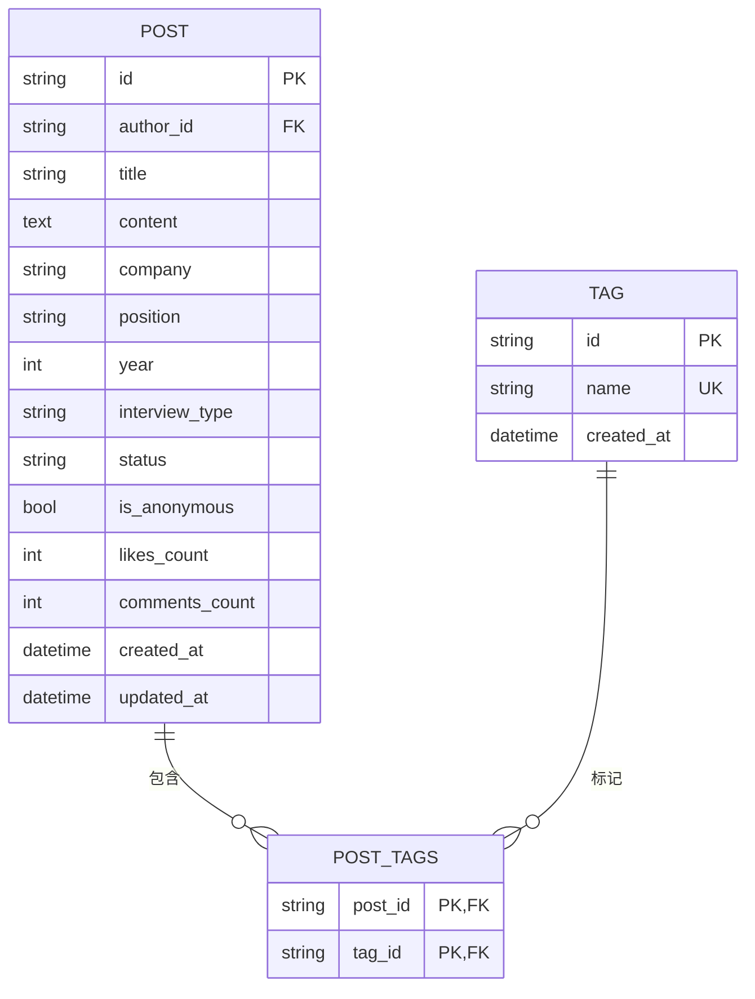
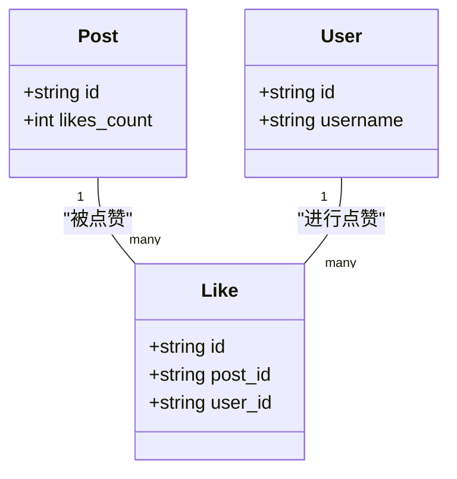
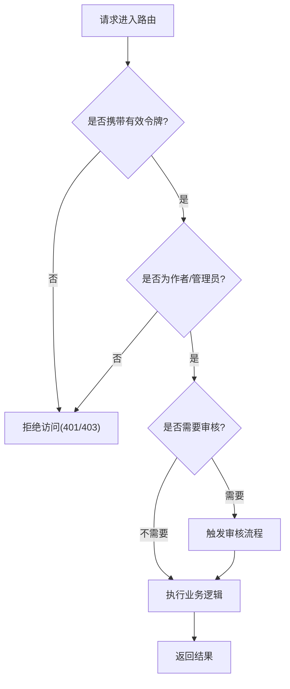
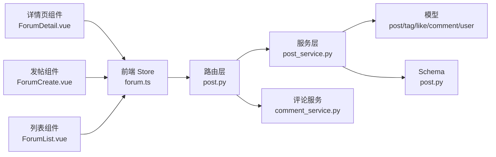

# 社区论坛系统

<cite>
**本文引用的文件**   
- [backEnd/app/main.py](file://backEnd/app/main.py)
- [backEnd/app/routers/post.py](file://backEnd/app/routers/post.py)
- [backEnd/app/services/post_service.py](file://backEnd/app/services/post_service.py)
- [backEnd/app/services/comment_service.py](file://backEnd/app/services/comment_service.py)
- [backEnd/app/schemas/post.py](file://backEnd/app/schemas/post.py)
- [backEnd/app/models/post.py](file://backEnd/app/models/post.py)
- [backEnd/app/models/comment.py](file://backEnd/app/models/comment.py)
- [backEnd/app/models/tag.py](file://backEnd/app/models/tag.py)
- [backEnd/app/models/like.py](file://backEnd/app/models/like.py)
- [backEnd/app/models/user.py](file://backEnd/app/models/user.py)
- [backEnd/app/routers/admin.py](file://backEnd/app/routers/admin.py)
- [frontEnd/src/stores/forum.ts](file://frontEnd/src/stores/forum.ts)
- [frontEnd/src/components/forum/ForumCreate.vue](file://frontEnd/src/components/forum/ForumCreate.vue)
- [frontEnd/src/components/forum/ForumList.vue](file://frontEnd/src/components/forum/ForumList.vue)
- [frontEnd/src/components/forum/ForumDetail.vue](file://frontEnd/src/components/forum/ForumDetail.vue)
</cite>

## 目录
1. [简介](#简介)
2. [项目结构](#项目结构)
3. [核心组件](#核心组件)
4. [架构总览](#架构总览)
5. [详细组件分析](#详细组件分析)
6. [依赖关系分析](#依赖关系分析)
7. [性能与扩展性](#性能与扩展性)
8. [故障排查指南](#故障排查指南)
9. [结论](#结论)
10. [附录](#附录)

## 简介
本文件系统性地梳理了社区论坛系统的功能与技术实现，覆盖帖子发布与管理（CRUD）、评论互动、标签分类、点赞收藏、内容审核与权限控制、搜索过滤、富文本与图片上传集成方案、以及前端组件复用与扩展方法。文档面向开发者与产品人员，既提供高层架构概览，也深入到代码级数据流与交互流程，帮助快速构建活跃的社区交流平台。

## 项目结构
后端采用 FastAPI + SQLAlchemy 异步 ORM，分层清晰：路由层负责接口定义与鉴权，服务层封装业务逻辑与查询，模型层定义数据库实体与关系，Schema 层统一请求/响应结构；前端基于 Vue 3 + Pinia，按功能域组织组件与状态管理。

图表来源
- [backEnd/app/main.py:44-73](file://backEnd/app/main.py#L44-L73)
- [backEnd/app/routers/post.py:1-249](file://backEnd/app/routers/post.py#L1-L249)
- [backEnd/app/services/post_service.py:1-249](file://backEnd/app/services/post_service.py#L1-L249)
- [backEnd/app/services/comment_service.py:1-105](file://backEnd/app/services/comment_service.py#L1-L105)
- [backEnd/app/schemas/post.py:1-91](file://backEnd/app/schemas/post.py#L1-L91)
- [backEnd/app/models/post.py:1-65](file://backEnd/app/models/post.py#L1-L65)
- [backEnd/app/models/comment.py:1-53](file://backEnd/app/models/comment.py#L1-L53)
- [backEnd/app/models/tag.py:1-46](file://backEnd/app/models/tag.py#L1-L46)
- [backEnd/app/models/like.py:1-47](file://backEnd/app/models/like.py#L1-L47)
- [frontEnd/src/stores/forum.ts:77-100](file://frontEnd/src/stores/forum.ts#L77-L100)
- [frontEnd/src/components/forum/ForumCreate.vue:1-287](file://frontEnd/src/components/forum/ForumCreate.vue#L1-L287)
- [frontEnd/src/components/forum/ForumList.vue:1-259](file://frontEnd/src/components/forum/ForumList.vue#L1-L259)
- [frontEnd/src/components/forum/ForumDetail.vue:1-297](file://frontEnd/src/components/forum/ForumDetail.vue#L1-L297)

章节来源
- [backEnd/app/main.py:44-73](file://backEnd/app/main.py#L44-L73)
- [backEnd/app/routers/post.py:1-249](file://backEnd/app/routers/post.py#L1-L249)
- [backEnd/app/services/post_service.py:1-249](file://backEnd/app/services/post_service.py#L1-L249)
- [backEnd/app/services/comment_service.py:1-105](file://backEnd/app/services/comment_service.py#L1-L105)
- [backEnd/app/schemas/post.py:1-91](file://backEnd/app/schemas/post.py#L1-L91)
- [backEnd/app/models/post.py:1-65](file://backEnd/app/models/post.py#L1-L65)
- [backEnd/app/models/comment.py:1-53](file://backEnd/app/models/comment.py#L1-L53)
- [backEnd/app/models/tag.py:1-46](file://backEnd/app/models/tag.py#L1-L46)
- [backEnd/app/models/like.py:1-47](file://backEnd/app/models/like.py#L1-L47)
- [frontEnd/src/stores/forum.ts:115-315](file://frontEnd/src/stores/forum.ts#L115-L315)
- [frontEnd/src/components/forum/ForumCreate.vue:190-287](file://frontEnd/src/components/forum/ForumCreate.vue#L190-L287)
- [frontEnd/src/components/forum/ForumList.vue:169-259](file://frontEnd/src/components/forum/ForumList.vue#L169-L259)
- [frontEnd/src/components/forum/ForumDetail.vue:163-297](file://frontEnd/src/components/forum/ForumDetail.vue#L163-L297)

## 核心组件
- 帖子领域
  - 模型：Post、Tag、Like、Comment、User
  - 服务：post_service、comment_service
  - 路由：/api/posts/*
  - 前端：ForumCreate、ForumList、ForumDetail、Pinia store
- 管理与权限
  - 管理员路由：/api/admin/*
  - 简易管理员校验策略
- 数据模式
  - Pydantic Schema 用于输入校验与输出序列化

章节来源
- [backEnd/app/models/post.py:18-65](file://backEnd/app/models/post.py#L18-L65)
- [backEnd/app/models/tag.py:18-46](file://backEnd/app/models/tag.py#L18-L46)
- [backEnd/app/models/like.py:16-47](file://backEnd/app/models/like.py#L16-L47)
- [backEnd/app/models/comment.py:17-53](file://backEnd/app/models/comment.py#L17-L53)
- [backEnd/app/models/user.py:10-45](file://backEnd/app/models/user.py#L10-L45)
- [backEnd/app/services/post_service.py:70-249](file://backEnd/app/services/post_service.py#L70-L249)
- [backEnd/app/services/comment_service.py:28-105](file://backEnd/app/services/comment_service.py#L28-L105)
- [backEnd/app/routers/post.py:49-249](file://backEnd/app/routers/post.py#L49-L249)
- [backEnd/app/routers/admin.py:24-198](file://backEnd/app/routers/admin.py#L24-L198)
- [backEnd/app/schemas/post.py:11-91](file://backEnd/app/schemas/post.py#L11-L91)
- [frontEnd/src/stores/forum.ts:115-315](file://frontEnd/src/stores/forum.ts#L115-L315)

## 架构总览
系统遵循“路由-服务-模型”的分层架构，前后端通过 RESTful API 通信。后端在启动时自动建表并初始化种子数据，同时挂载上传目录为静态资源。

图表来源
- [backEnd/app/main.py:27-41](file://backEnd/app/main.py#L27-L41)
- [backEnd/app/routers/post.py:52-61](file://backEnd/app/routers/post.py#L52-L61)
- [backEnd/app/services/post_service.py:70-94](file://backEnd/app/services/post_service.py#L70-L94)
- [frontEnd/src/stores/forum.ts:174-186](file://frontEnd/src/stores/forum.ts#L174-L186)
- [frontEnd/src/components/forum/ForumCreate.vue:249-285](file://frontEnd/src/components/forum/ForumCreate.vue#L249-L285)

## 详细组件分析

### 帖子发布与管理（CRUD）
- 创建帖子
  - 前端：ForumCreate 收集结构化字段与标签，提交到 store.createPost
  - 路由：POST /api/posts，要求登录用户
  - 服务：create_post 写入 Post，按需创建或关联 Tag
  - 响应：包含作者名、标签、是否已点赞等
- 获取列表
  - 支持公司、岗位、年份、状态、面试类型、标签组合筛选与关键词搜索
  - 排序：最新/最热（按点赞数降序）
  - 分页：page/size
  - 额外返回当前用户点赞集合，便于前端展示 is_liked
- 获取详情
  - GET /api/posts/{id}，返回完整信息与标签
- 删除帖子
  - DELETE /api/posts/{id}，仅作者可删，否则 403
- 分享链接
  - POST /api/posts/{id}/share，生成分享 URL

图表来源
- [frontEnd/src/components/forum/ForumCreate.vue:249-285](file://frontEnd/src/components/forum/ForumCreate.vue#L249-L285)
- [frontEnd/src/stores/forum.ts:174-186](file://frontEnd/src/stores/forum.ts#L174-L186)
- [backEnd/app/routers/post.py:52-61](file://backEnd/app/routers/post.py#L52-L61)
- [backEnd/app/services/post_service.py:70-94](file://backEnd/app/services/post_service.py#L70-L94)

章节来源
- [backEnd/app/routers/post.py:52-160](file://backEnd/app/routers/post.py#L52-L160)
- [backEnd/app/services/post_service.py:70-186](file://backEnd/app/services/post_service.py#L70-L186)
- [backEnd/app/schemas/post.py:11-57](file://backEnd/app/schemas/post.py#L11-L57)
- [frontEnd/src/components/forum/ForumCreate.vue:190-287](file://frontEnd/src/components/forum/ForumCreate.vue#L190-L287)
- [frontEnd/src/stores/forum.ts:174-186](file://frontEnd/src/stores/forum.ts#L174-L186)

### 评论互动（层级结构与分页）
- 发表评论
  - POST /api/posts/{post_id}/comments，需登录
  - 支持匿名评论
  - 成功后递增帖子 comments_count
- 查看评论
  - GET /api/posts/{post_id}/comments，分页返回
- 删除评论
  - DELETE /api/posts/comments/{comment_id}，仅作者可删

图表来源
- [backEnd/app/routers/post.py:182-215](file://backEnd/app/routers/post.py#L182-L215)
- [backEnd/app/services/comment_service.py:28-52](file://backEnd/app/services/comment_service.py#L28-L52)
- [frontEnd/src/components/forum/ForumDetail.vue:267-285](file://frontEnd/src/components/forum/ForumDetail.vue#L267-L285)
- [frontEnd/src/stores/forum.ts:221-240](file://frontEnd/src/stores/forum.ts#L221-L240)

章节来源
- [backEnd/app/routers/post.py:182-231](file://backEnd/app/routers/post.py#L182-L231)
- [backEnd/app/services/comment_service.py:28-105](file://backEnd/app/services/comment_service.py#L28-L105)
- [backEnd/app/schemas/post.py:64-86](file://backEnd/app/schemas/post.py#L64-L86)
- [frontEnd/src/components/forum/ForumDetail.vue:267-285](file://frontEnd/src/components/forum/ForumDetail.vue#L267-L285)
- [frontEnd/src/stores/forum.ts:221-240](file://frontEnd/src/stores/forum.ts#L221-L240)

### 标签分类系统（灵活组织）
- 多对多关系：Post ↔ Tag 通过 post_tags 中间表
- 创建帖子时可传入 tag_names，服务层自动去重并创建缺失标签
- 热门标签统计：按使用次数排序，供前端右侧面板展示
- 筛选器选项：动态获取公司、岗位、状态、年份、面试类型等去重值

图表来源
- [backEnd/app/models/post.py:18-65](file://backEnd/app/models/post.py#L18-L65)
- [backEnd/app/models/tag.py:18-46](file://backEnd/app/models/tag.py#L18-L46)

章节来源
- [backEnd/app/models/tag.py:18-46](file://backEnd/app/models/tag.py#L18-L46)
- [backEnd/app/services/post_service.py:14-34](file://backEnd/app/services/post_service.py#L14-34)
- [backEnd/app/services/post_service.py:226-236](file://backEnd/app/services/post_service.py#L226-L236)
- [backEnd/app/services/post_service.py:239-249](file://backEnd/app/services/post_service.py#L239-L249)
- [frontEnd/src/components/forum/ForumList.vue:139-164](file://frontEnd/src/components/forum/ForumList.vue#L139-L164)

### 点赞与收藏（社交功能）
- 点赞切换
  - POST /api/posts/{post_id}/like，幂等切换，返回 liked 布尔
  - 维护 likes_count 与唯一约束（post_id, user_id）
- 前端即时反馈
  - 更新本地 is_liked 与 likes_count，保持列表与详情页一致
- 收藏
  - 当前未实现独立收藏表；可通过“点赞”作为轻量收藏替代，或扩展 Like 表增加 type 字段区分

图表来源
- [backEnd/app/models/like.py:16-47](file://backEnd/app/models/like.py#L16-L47)
- [backEnd/app/models/post.py:18-65](file://backEnd/app/models/post.py#L18-L65)
- [backEnd/app/models/user.py:10-45](file://backEnd/app/models/user.py#L10-L45)

章节来源
- [backEnd/app/routers/post.py:165-177](file://backEnd/app/routers/post.py#L165-L177)
- [backEnd/app/services/post_service.py:189-224](file://backEnd/app/services/post_service.py#L189-L224)
- [frontEnd/src/stores/forum.ts:188-208](file://frontEnd/src/stores/forum.ts#L188-L208)
- [frontEnd/src/components/forum/ForumDetail.vue:208-214](file://frontEnd/src/components/forum/ForumDetail.vue#L208-L214)

### 内容审核机制与用户权限控制
- 权限控制
  - 发帖/删帖/删评均要求登录用户，且仅作者可删除自身内容
  - 管理员路由 /api/admin/* 使用简易管理员校验（用户名或邮箱包含 admin）
- 内容审核
  - 当前未实现自动化审核；可在服务层接入敏感词检测或第三方审核 API
  - 建议引入“审核状态”字段与后台批量处理能力

图表来源
- [backEnd/app/routers/post.py:147-160](file://backEnd/app/routers/post.py#L147-L160)
- [backEnd/app/routers/post.py:218-231](file://backEnd/app/routers/post.py#L218-L231)
- [backEnd/app/routers/admin.py:24-34](file://backEnd/app/routers/admin.py#L24-L34)

章节来源
- [backEnd/app/routers/admin.py:24-34](file://backEnd/app/routers/admin.py#L24-L34)
- [backEnd/app/routers/post.py:147-160](file://backEnd/app/routers/post.py#L147-L160)
- [backEnd/app/routers/post.py:218-231](file://backEnd/app/routers/post.py#L218-L231)

### 搜索与过滤
- 服务端筛选
  - 支持公司、岗位、年份、状态、面试类型、标签组合与关键词模糊匹配
  - 标签筛选通过子查询确保“包含所有指定标签”的语义
- 前端筛选器
  - ForumFilter 与 ForumList 联动，实时构建查询参数并刷新列表
  - 热门标签点击即加入/移除筛选条件

章节来源
- [backEnd/app/services/post_service.py:96-166](file://backEnd/app/services/post_service.py#L96-L166)
- [backEnd/app/routers/post.py:63-128](file://backEnd/app/routers/post.py#L63-L128)
- [frontEnd/src/stores/forum.ts:130-143](file://frontEnd/src/stores/forum.ts#L130-L143)
- [frontEnd/src/components/forum/ForumList.vue:198-242](file://frontEnd/src/components/forum/ForumList.vue#L198-L242)

### 富文本编辑器与图片上传集成方案
- 富文本编辑器
  - 当前正文为纯文本输入；建议集成如 TinyMCE、Quill 或 TipTap，将 HTML 内容提交至后端
  - 后端需在服务层对 HTML 进行白名单过滤与 XSS 防护
- 图片上传
  - 后端已挂载 /api/uploads 静态目录；建议新增上传接口，接收 multipart/form-data，保存至 uploads 目录并返回可访问 URL
  - 前端在富文本中插入图片后，将图片 URL 嵌入 HTML 内容

[本节为通用集成建议，不直接分析具体文件]

### 分享与导出
- 分享链接
  - 后端提供 /api/posts/{id}/share 生成分享 URL
  - 前端可直接复制浏览器地址栏链接
- 图片导出
  - 详情页支持将卡片区域导出为 PNG（html-to-image），便于离线分享

章节来源
- [backEnd/app/routers/post.py:236-241](file://backEnd/app/routers/post.py#L236-L241)
- [frontEnd/src/components/forum/ForumDetail.vue:226-265](file://frontEnd/src/components/forum/ForumDetail.vue#L226-L265)

## 依赖关系分析
- 模块耦合
  - 路由层依赖服务层与依赖注入（数据库会话、当前用户）
  - 服务层依赖模型与 Schema，避免在路由中写复杂查询
  - 前端 Store 集中管理 API 调用与状态同步
- 外部依赖
  - FastAPI、SQLAlchemy 异步、Pydantic、CORS、静态文件服务
  - 前端：Vue 3、Pinia、html-to-image

图表来源
- [backEnd/app/routers/post.py:1-249](file://backEnd/app/routers/post.py#L1-L249)
- [backEnd/app/services/post_service.py:1-249](file://backEnd/app/services/post_service.py#L1-L249)
- [backEnd/app/services/comment_service.py:1-105](file://backEnd/app/services/comment_service.py#L1-L105)
- [backEnd/app/models/post.py:1-65](file://backEnd/app/models/post.py#L1-L65)
- [backEnd/app/models/tag.py:1-46](file://backEnd/app/models/tag.py#L1-L46)
- [backEnd/app/models/like.py:1-47](file://backEnd/app/models/like.py#L1-L47)
- [backEnd/app/models/comment.py:1-53](file://backEnd/app/models/comment.py#L1-L53)
- [backEnd/app/models/user.py:1-45](file://backEnd/app/models/user.py#L1-L45)
- [backEnd/app/schemas/post.py:1-91](file://backEnd/app/schemas/post.py#L1-L91)
- [frontEnd/src/stores/forum.ts:115-315](file://frontEnd/src/stores/forum.ts#L115-L315)
- [frontEnd/src/components/forum/ForumCreate.vue:190-287](file://frontEnd/src/components/forum/ForumCreate.vue#L190-L287)
- [frontEnd/src/components/forum/ForumList.vue:169-259](file://frontEnd/src/components/forum/ForumList.vue#L169-L259)
- [frontEnd/src/components/forum/ForumDetail.vue:163-297](file://frontEnd/src/components/forum/ForumDetail.vue#L163-L297)

章节来源
- [backEnd/app/routers/post.py:1-249](file://backEnd/app/routers/post.py#L1-L249)
- [backEnd/app/services/post_service.py:1-249](file://backEnd/app/services/post_service.py#L1-L249)
- [backEnd/app/services/comment_service.py:1-105](file://backEnd/app/services/comment_service.py#L1-L105)
- [backEnd/app/models/post.py:1-65](file://backEnd/app/models/post.py#L1-L65)
- [backEnd/app/models/tag.py:1-46](file://backEnd/app/models/tag.py#L1-L46)
- [backEnd/app/models/like.py:1-47](file://backEnd/app/models/like.py#L1-L47)
- [backEnd/app/models/comment.py:1-53](file://backEnd/app/models/comment.py#L1-L53)
- [backEnd/app/models/user.py:1-45](file://backEnd/app/models/user.py#L1-L45)
- [backEnd/app/schemas/post.py:1-91](file://backEnd/app/schemas/post.py#L1-L91)
- [frontEnd/src/stores/forum.ts:115-315](file://frontEnd/src/stores/forum.ts#L115-L315)
- [frontEnd/src/components/forum/ForumCreate.vue:190-287](file://frontEnd/src/components/forum/ForumCreate.vue#L190-L287)
- [frontEnd/src/components/forum/ForumList.vue:169-259](file://frontEnd/src/components/forum/ForumList.vue#L169-L259)
- [frontEnd/src/components/forum/ForumDetail.vue:163-297](file://frontEnd/src/components/forum/ForumDetail.vue#L163-L297)

## 性能与扩展性
- 查询优化
  - 列表查询使用索引字段（company、position、year、status、interview_type）提升筛选效率
  - 标签筛选通过子查询与 having count 保证“全包含”语义，注意大数据量下的性能
- 分页与排序
  - 列表与评论均采用 offset/limit 分页；热点排序按 likes_count 降序
- 并发与事务
  - 使用异步 Session，减少阻塞；关键操作（如点赞计数）建议在事务内完成以保证一致性
- 缓存建议
  - 热门标签与筛选选项可考虑 Redis 缓存，降低频繁去重查询开销
- 扩展点
  - 点赞扩展为“点赞/收藏/在看”，通过 Like.type 字段区分
  - 评论扩展为嵌套回复，引入 parent_id 与树形渲染
  - 内容审核引入异步任务队列，结合敏感词库与人工复核

[本节提供通用指导，不直接分析具体文件]

## 故障排查指南
- 验证错误处理
  - 自定义 RequestValidationError 处理器，避免二进制内容导致解码异常
- 常见错误
  - 404：帖子/评论不存在
  - 403：非作者尝试删除
  - 401/403：未登录或无管理员权限
- 调试建议
  - 检查 CORS 配置与静态资源挂载路径
  - 确认 Token 是否正确传递 Authorization 头
  - 查看数据库外键约束与级联删除行为

章节来源
- [backEnd/app/main.py:76-84](file://backEnd/app/main.py#L76-L84)
- [backEnd/app/routers/post.py:147-160](file://backEnd/app/routers/post.py#L147-L160)
- [backEnd/app/routers/post.py:218-231](file://backEnd/app/routers/post.py#L218-L231)
- [backEnd/app/routers/admin.py:24-34](file://backEnd/app/routers/admin.py#L24-L34)
- [backEnd/app/main.py:52-73](file://backEnd/app/main.py#L52-L73)

## 结论
本论坛系统以清晰的层次化架构实现了帖子 CRUD、评论互动、标签分类、点赞与分享等核心功能，并通过前端组件与状态管理形成良好的复用模式。后续可在内容审核、收藏扩展、评论层级、性能优化等方面持续演进，以满足更复杂的社区场景需求。

## 附录
- 关键 API 一览（节选）
  - 帖子
    - POST /api/posts：发布面经
    - GET /api/posts：列表（支持筛选与分页）
    - GET /api/posts/{id}：详情
    - DELETE /api/posts/{id}：删除（仅作者）
    - POST /api/posts/{id}/like：点赞/取消
    - POST /api/posts/{id}/share：生成分享链接
  - 评论
    - POST /api/posts/{id}/comments：发表评论
    - GET /api/posts/{id}/comments：评论列表（分页）
    - DELETE /api/posts/comments/{id}：删除评论（仅作者）
  - 管理
    - GET /api/admin/stats：仪表盘统计
    - GET /api/admin/users：用户列表（分页+搜索）
    - PUT /api/admin/users/{id}：更新用户
    - DELETE /api/admin/users/{id}：删除用户
    - GET /api/admin/problems：题目列表（管理端）
    - POST /api/admin/problems：创建题目
    - PUT /api/admin/problems/{id}：更新题目
    - DELETE /api/admin/problems/{id}：删除题目
    - GET /api/admin/posts：帖子列表（管理端）
    - DELETE /api/admin/posts/{id}：删除帖子

章节来源
- [backEnd/app/routers/post.py:52-249](file://backEnd/app/routers/post.py#L52-L249)
- [backEnd/app/routers/admin.py:39-198](file://backEnd/app/routers/admin.py#L39-L198)