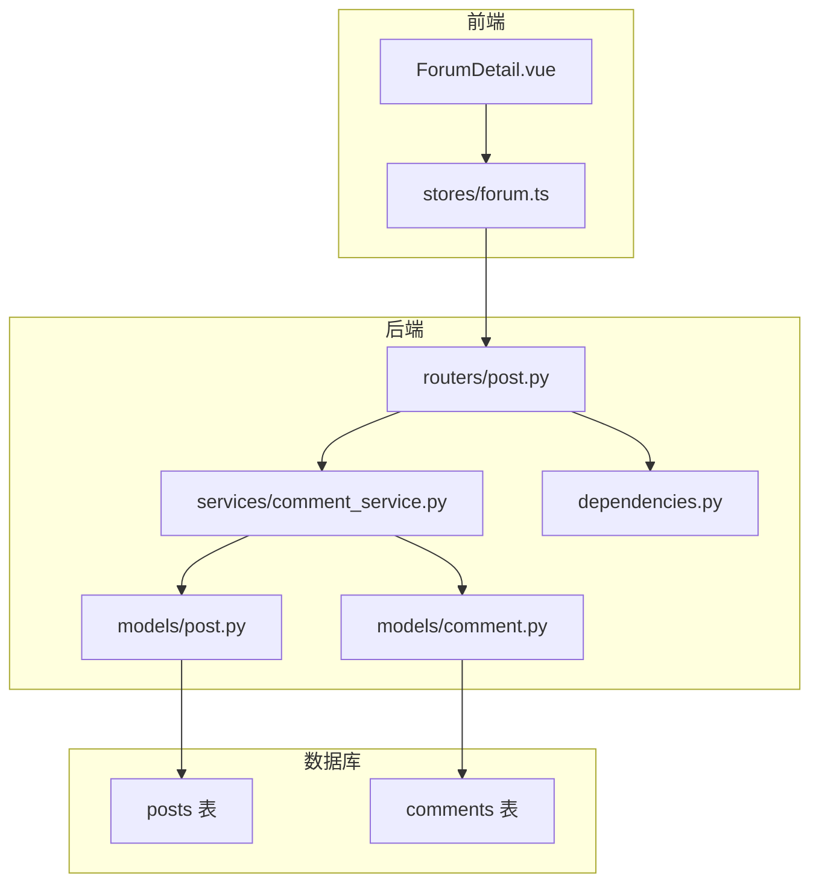
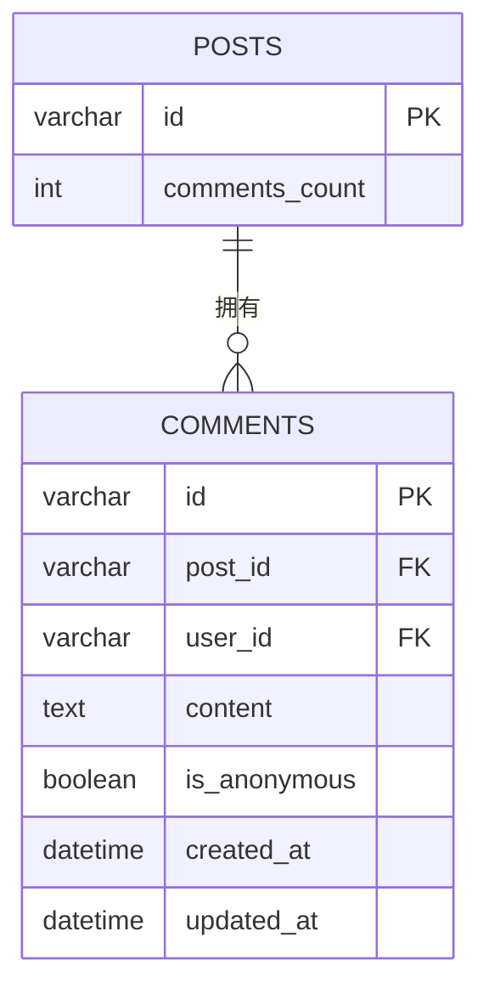
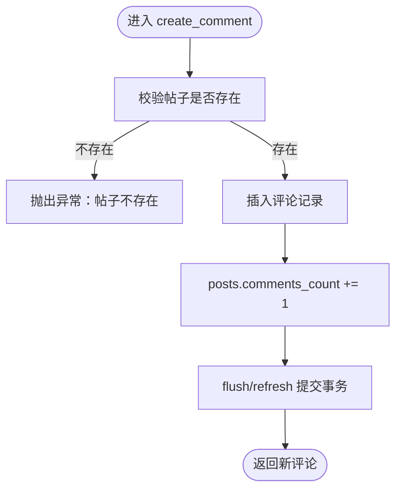
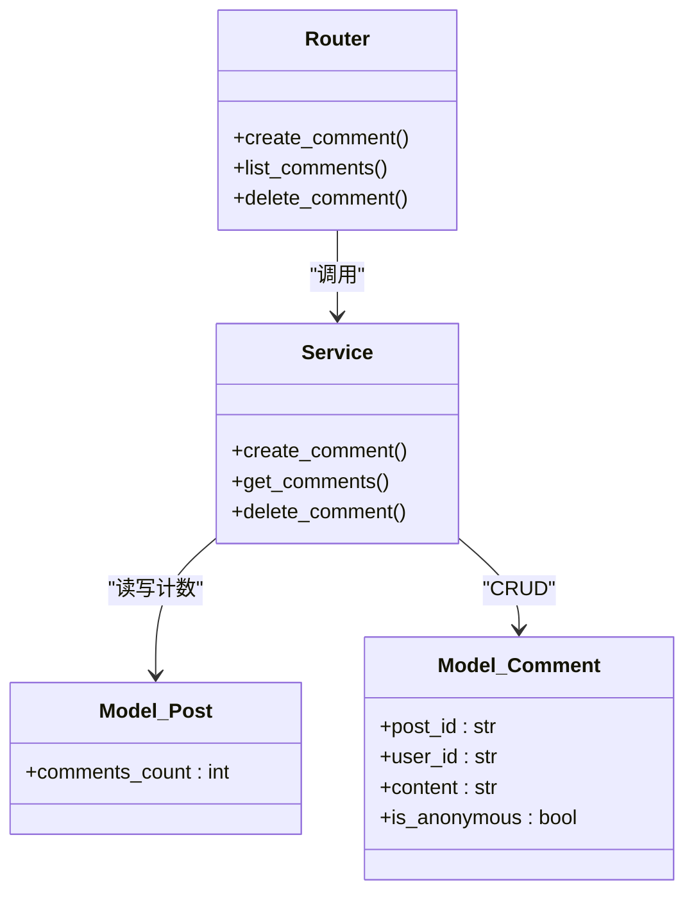
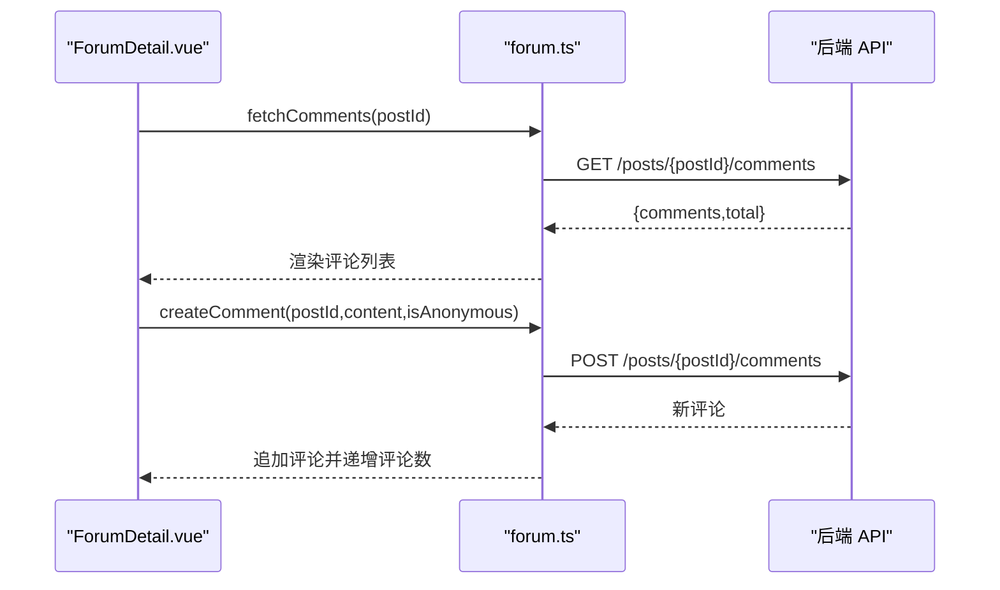
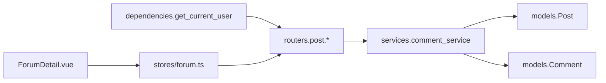

# 评论互动系统

<cite>
**本文引用的文件**   
- [backEnd/app/models/comment.py](file://backEnd/app/models/comment.py)
- [backEnd/app/models/post.py](file://backEnd/app/models/post.py)
- [backEnd/app/schemas/post.py](file://backEnd/app/schemas/post.py)
- [backEnd/app/services/comment_service.py](file://backEnd/app/services/comment_service.py)
- [backEnd/app/routers/post.py](file://backEnd/app/routers/post.py)
- [backEnd/app/dependencies.py](file://backEnd/app/dependencies.py)
- [hr_interview.sql](file://hr_interview.sql)
- [frontEnd/src/stores/forum.ts](file://frontEnd/src/stores/forum.ts)
- [frontEnd/src/components/forum/ForumDetail.vue](file://frontEnd/src/components/forum/ForumDetail.vue)
</cite>

## 目录
1. [简介](#简介)
2. [项目结构](#项目结构)
3. [核心组件](#核心组件)
4. [架构总览](#架构总览)
5. [详细组件分析](#详细组件分析)
6. [依赖关系分析](#依赖关系分析)
7. [性能与扩展性](#性能与扩展性)
8. [故障排查指南](#故障排查指南)
9. [结论](#结论)
10. [附录：API 定义与数据模型](#附录api-定义与数据模型)

## 简介
本文件面向“评论互动系统”的功能设计与实现，覆盖以下要点：
- 评论的层级结构与嵌套回复机制现状与演进建议
- 评论的创建、查询、删除等核心操作
- 权限控制（仅作者可删）
- 评论分页加载与计数同步
- 实时更新的交互优化方案
- 评论内容验证与敏感词过滤策略
- 前端评论组件的复用模式与自定义扩展方法

当前代码库已实现“帖子-评论”的一对多关系、基础 CRUD、分页与计数同步；尚未实现“嵌套回复”和“实时推送”。文档在说明现有实现的同时，给出可扩展的设计建议。

## 项目结构
围绕评论功能的关键文件分布如下：
- 后端模型与数据库：Comment、Post 模型及 comments/posts 表结构
- 后端服务与路由：comment_service、post router 中的评论接口
- 前端状态与视图：forum store 与 ForumDetail 组件
- 认证依赖：get_current_user 用于鉴权



图表来源
- [backEnd/app/routers/post.py](file://backEnd/app/routers/post.py)
- [backEnd/app/services/comment_service.py](file://backEnd/app/services/comment_service.py)
- [backEnd/app/models/post.py](file://backEnd/app/models/post.py)
- [backEnd/app/models/comment.py](file://backEnd/app/models/comment.py)
- [backEnd/app/dependencies.py](file://backEnd/app/dependencies.py)
- [frontEnd/src/components/forum/ForumDetail.vue](file://frontEnd/src/components/forum/ForumDetail.vue)
- [frontEnd/src/stores/forum.ts](file://frontEnd/src/stores/forum.ts)

章节来源
- [backEnd/app/models/comment.py:17-53](file://backEnd/app/models/comment.py#L17-L53)
- [backEnd/app/models/post.py:18-65](file://backEnd/app/models/post.py#L18-L65)
- [backEnd/app/services/comment_service.py:28-105](file://backEnd/app/services/comment_service.py#L28-L105)
- [backEnd/app/routers/post.py:182-231](file://backEnd/app/routers/post.py#L182-L231)
- [frontEnd/src/stores/forum.ts:210-261](file://frontEnd/src/stores/forum.ts#L210-L261)
- [frontEnd/src/components/forum/ForumDetail.vue:163-297](file://frontEnd/src/components/forum/ForumDetail.vue#L163-L297)

## 核心组件
- 数据模型
  - Comment：包含 id、post_id、user_id、content、is_anonymous、时间戳等字段，并关联 Post 与 User。
  - Post：包含 comments_count 字段，用于统计评论数量。
- 服务层
  - create_comment：校验帖子存在后创建评论，并将对应帖子的 comments_count +1。
  - get_comments：按 post_id 分页获取评论列表，返回 (comments, total)。
  - delete_comment：仅作者可删除，删除前检查 user_id，成功后将 posts.comments_count 减一（不低于 0）。
- 路由层
  - POST /api/posts/{post_id}/comments：创建评论
  - GET /api/posts/{post_id}/comments：分页获取评论
  - DELETE /api/posts/comments/{comment_id}：删除评论（需登录且为作者）
- 前端 Store
  - fetchComments/createComment/deleteComment：封装 API 调用，维护本地 comments 列表与帖子评论数。
- 前端组件
  - ForumDetail.vue：展示帖子详情与评论区，支持匿名/公开评论切换、发送评论、显示评论列表。

章节来源
- [backEnd/app/models/comment.py:17-53](file://backEnd/app/models/comment.py#L17-L53)
- [backEnd/app/models/post.py:47-48](file://backEnd/app/models/post.py#L47-L48)
- [backEnd/app/services/comment_service.py:28-105](file://backEnd/app/services/comment_service.py#L28-L105)
- [backEnd/app/routers/post.py:182-231](file://backEnd/app/routers/post.py#L182-L231)
- [frontEnd/src/stores/forum.ts:210-261](file://frontEnd/src/stores/forum.ts#L210-L261)
- [frontEnd/src/components/forum/ForumDetail.vue:163-297](file://frontEnd/src/components/forum/ForumDetail.vue#L163-L297)

## 架构总览
评论系统的请求处理链路如下：

```mermaid
sequenceDiagram
participant U as "用户浏览器"
participant FE as "ForumDetail.vue"
participant ST as "forum.ts Store"
participant API as "FastAPI Router"
participant SVC as "comment_service"
participant ORM as "SQLAlchemy Models"
participant DB as "MySQL"
U->>FE : 打开帖子详情页
FE->>ST : fetchComments(postId)
ST->>API : GET /api/posts/{postId}/comments?page=1&size=20
API->>SVC : get_comments(db, postId, page, size)
SVC->>ORM : 查询 comments 与 count
ORM->>DB : SELECT ... FROM comments WHERE post_id=?
DB-->>ORM : 结果集
ORM-->>SVC : 评论列表与总数
SVC-->>API : (comments, total)
API-->>ST : {comments,total}
ST-->>FE : 渲染评论列表
U->>FE : 输入评论并提交
FE->>ST : createComment(postId, content, isAnonymous)
ST->>API : POST /api/posts/{postId}/comments
API->>SVC : create_comment(db, user, postId, data)
SVC->>ORM : 插入评论并更新 posts.comments_count+1
ORM->>DB : INSERT INTO comments; UPDATE posts SET comments_count=...
DB-->>ORM : 成功
ORM-->>SVC : 新评论对象
SVC-->>API : CommentResponse
API-->>ST : 新评论
ST-->>FE : 追加到列表并递增评论数
```

图表来源
- [backEnd/app/routers/post.py:182-231](file://backEnd/app/routers/post.py#L182-L231)
- [backEnd/app/services/comment_service.py:28-105](file://backEnd/app/services/comment_service.py#L28-L105)
- [backEnd/app/models/comment.py:17-53](file://backEnd/app/models/comment.py#L17-L53)
- [backEnd/app/models/post.py:47-48](file://backEnd/app/models/post.py#L47-L48)
- [frontEnd/src/stores/forum.ts:210-261](file://frontEnd/src/stores/forum.ts#L210-L261)
- [frontEnd/src/components/forum/ForumDetail.vue:163-297](file://frontEnd/src/components/forum/ForumDetail.vue#L163-L297)

## 详细组件分析

### 数据模型与数据库设计
- 评论表 comments
  - 字段：id、post_id、user_id、content、is_anonymous、created_at、updated_at
  - 索引：post_id、user_id
  - 外键：post_id→posts.id、user_id→users.id，级联删除
- 帖子表 posts
  - 字段：comments_count 用于计数同步
- 关系
  - Post.comments 一对多指向 Comment
  - Comment.post 反向关联 Post



图表来源
- [hr_interview.sql:70-86](file://hr_interview.sql#L70-L86)
- [backEnd/app/models/post.py:47-48](file://backEnd/app/models/post.py#L47-L48)
- [backEnd/app/models/comment.py:17-53](file://backEnd/app/models/comment.py#L17-L53)

章节来源
- [hr_interview.sql:70-86](file://hr_interview.sql#L70-L86)
- [backEnd/app/models/post.py:18-65](file://backEnd/app/models/post.py#L18-L65)
- [backEnd/app/models/comment.py:17-53](file://backEnd/app/models/comment.py#L17-L53)

### 服务层逻辑与复杂度
- create_comment
  - 校验帖子存在
  - 插入评论记录
  - 将 posts.comments_count +1
  - 时间复杂度：O(1)
  - 空间复杂度：O(1)
- get_comments
  - 计算总数：COUNT(*)
  - 分页查询：ORDER BY created_at ASC，LIMIT/OFFSET
  - 时间复杂度：O(N)（N 为匹配行数），分页后返回 size 条
- delete_comment
  - 查找评论并校验 author
  - 若通过则删除评论，并将 posts.comments_count 减一（不低于 0）
  - 时间复杂度：O(1)



图表来源
- [backEnd/app/services/comment_service.py:28-52](file://backEnd/app/services/comment_service.py#L28-L52)

章节来源
- [backEnd/app/services/comment_service.py:28-105](file://backEnd/app/services/comment_service.py#L28-L105)

### 路由层与权限控制
- 创建评论
  - 路径：POST /api/posts/{post_id}/comments
  - 鉴权：需要有效 Bearer Token（依赖 get_current_user）
  - 入参：content、is_anonymous
  - 出参：CommentResponse
- 获取评论
  - 路径：GET /api/posts/{post_id}/comments?page=1&size=20
  - 无需鉴权
  - 出参：{comments:[], total, page, size}
- 删除评论
  - 路径：DELETE /api/posts/comments/{comment_id}
  - 鉴权：需要有效 Bearer Token
  - 权限：仅作者可删，否则抛 403
  - 副作用：posts.comments_count 递减



图表来源
- [backEnd/app/routers/post.py:182-231](file://backEnd/app/routers/post.py#L182-L231)
- [backEnd/app/services/comment_service.py:28-105](file://backEnd/app/services/comment_service.py#L28-L105)
- [backEnd/app/models/post.py:47-48](file://backEnd/app/models/post.py#L47-L48)
- [backEnd/app/models/comment.py:17-53](file://backEnd/app/models/comment.py#L17-L53)

章节来源
- [backEnd/app/routers/post.py:182-231](file://backEnd/app/routers/post.py#L182-L231)
- [backEnd/app/dependencies.py:13-41](file://backEnd/app/dependencies.py#L13-L41)

### 前端交互与状态管理
- ForumDetail.vue
  - 页面挂载时加载帖子详情与评论列表
  - 提供评论输入框与匿名/公开开关
  - 提交评论后即时追加到本地列表，并递增评论数
- forum.ts Store
  - fetchComments：拉取评论列表
  - createComment：提交评论，追加到本地数组，同时更新相关帖子的 comments_count
  - deleteComment：从本地数组移除评论



图表来源
- [frontEnd/src/components/forum/ForumDetail.vue:163-297](file://frontEnd/src/components/forum/ForumDetail.vue#L163-L297)
- [frontEnd/src/stores/forum.ts:210-261](file://frontEnd/src/stores/forum.ts#L210-L261)

章节来源
- [frontEnd/src/components/forum/ForumDetail.vue:163-297](file://frontEnd/src/components/forum/ForumDetail.vue#L163-L297)
- [frontEnd/src/stores/forum.ts:210-261](file://frontEnd/src/stores/forum.ts#L210-L261)

### 评论层级结构与嵌套回复机制
- 现状
  - 当前 comments 表未包含 parent_id 或 reply_to 字段，不支持嵌套回复
  - 前端评论列表以扁平方式渲染
- 演进建议
  - 在 comments 表增加 parent_id（可为空，表示顶级评论）
  - 后端新增“根据 parent_id 查询子评论”接口
  - 前端支持展开/折叠子评论树，保持排序一致（如按 created_at）
  - 注意：删除父评论时应级联删除其子评论（数据库外键 ON DELETE CASCADE）

[本节为概念性设计，不直接分析具体文件]

### 评论权限控制（仅作者可删）
- 后端
  - 删除接口要求登录，并通过 get_current_user 解析用户
  - 服务层比较 comment.user_id 与当前 user.id，不一致则抛 PermissionError，路由层转为 403
- 前端
  - 删除按钮仅在评论作者为当前用户时启用（可在组件中基于用户上下文判断）

章节来源
- [backEnd/app/dependencies.py:13-41](file://backEnd/app/dependencies.py#L13-L41)
- [backEnd/app/services/comment_service.py:82-105](file://backEnd/app/services/comment_service.py#L82-L105)
- [backEnd/app/routers/post.py:218-231](file://backEnd/app/routers/post.py#L218-L231)

### 评论分页加载
- 后端
  - get_comments 使用 LIMIT/OFFSET 分页，返回 total 供前端计算页码
- 前端
  - forum.ts 中 fetchComments 默认一页 20 条，可按需扩展加载更多或分页控件

章节来源
- [backEnd/app/services/comment_service.py:55-79](file://backEnd/app/services/comment_service.py#L55-L79)
- [frontEnd/src/stores/forum.ts:210-219](file://frontEnd/src/stores/forum.ts#L210-L219)

### 实时评论更新（推荐方案）
- 现状
  - 当前采用轮询式刷新（组件挂载时拉取一次）
- 推荐方案
  - 使用 WebSocket 或 SSE 推送新评论事件
  - 服务端在创建评论后广播至该帖子频道
  - 客户端订阅频道，收到消息后增量插入本地列表并递增评论数

[本节为概念性设计，不直接分析具体文件]

### 评论内容验证与敏感词过滤
- 内容长度限制
  - 后端 Pydantic 校验：content 最小 1、最大 2000
- 敏感词过滤
  - 建议在 create_comment 服务层加入敏感词检测（正则/字典/第三方服务）
  - 命中规则时拒绝创建并返回错误信息

章节来源
- [backEnd/app/schemas/post.py:64-67](file://backEnd/app/schemas/post.py#L64-L67)
- [backEnd/app/services/comment_service.py:28-52](file://backEnd/app/services/comment_service.py#L28-L52)

### 评论计数同步
- 创建评论
  - 插入评论后 posts.comments_count +1
- 删除评论
  - 删除评论后 posts.comments_count 减一（不低于 0）
- 前端
  - 提交成功后立即递增本地 comments_count，保证 UI 即时反馈

章节来源
- [backEnd/app/services/comment_service.py:48-52](file://backEnd/app/services/comment_service.py#L48-L52)
- [backEnd/app/services/comment_service.py:99-101](file://backEnd/app/services/comment_service.py#L99-L101)
- [frontEnd/src/stores/forum.ts:231-236](file://frontEnd/src/stores/forum.ts#L231-L236)

### 评论组件复用与扩展
- 复用模式
  - 将评论输入区、匿名/公开开关、评论列表项抽取为独立 Vue 组件
  - 通过 props 传入 post_id、current_user、onSubmit/onDelete 回调
- 扩展点
  - 支持 @提及、表情、富文本（需后端存储格式与前端渲染配合）
  - 支持子评论树（见“层级结构”建议）
  - 支持举报/屏蔽（后端新增接口与权限校验）

[本节为通用实践建议，不直接分析具体文件]

## 依赖关系分析
- 路由依赖
  - 评论接口依赖 get_current_user 进行鉴权
- 服务依赖
  - comment_service 依赖 Comment、Post、User 模型
- 前端依赖
  - ForumDetail 依赖 forum store 提供的评论相关 actions



图表来源
- [backEnd/app/dependencies.py:13-41](file://backEnd/app/dependencies.py#L13-L41)
- [backEnd/app/routers/post.py:182-231](file://backEnd/app/routers/post.py#L182-L231)
- [backEnd/app/services/comment_service.py:28-105](file://backEnd/app/services/comment_service.py#L28-L105)
- [backEnd/app/models/post.py:18-65](file://backEnd/app/models/post.py#L18-L65)
- [backEnd/app/models/comment.py:17-53](file://backEnd/app/models/comment.py#L17-L53)
- [frontEnd/src/components/forum/ForumDetail.vue:163-297](file://frontEnd/src/components/forum/ForumDetail.vue#L163-L297)
- [frontEnd/src/stores/forum.ts:210-261](file://frontEnd/src/stores/forum.ts#L210-L261)

章节来源
- [backEnd/app/dependencies.py:13-41](file://backEnd/app/dependencies.py#L13-L41)
- [backEnd/app/routers/post.py:182-231](file://backEnd/app/routers/post.py#L182-L231)
- [backEnd/app/services/comment_service.py:28-105](file://backEnd/app/services/comment_service.py#L28-L105)
- [backEnd/app/models/post.py:18-65](file://backEnd/app/models/post.py#L18-L65)
- [backEnd/app/models/comment.py:17-53](file://backEnd/app/models/comment.py#L17-L53)
- [frontEnd/src/components/forum/ForumDetail.vue:163-297](file://frontEnd/src/components/forum/ForumDetail.vue#L163-L297)
- [frontEnd/src/stores/forum.ts:210-261](file://frontEnd/src/stores/forum.ts#L210-L261)

## 性能与扩展性
- 查询优化
  - 对 post_id、user_id 建立索引（已存在）
  - 分页使用 LIMIT/OFFSET，适合中等规模数据；超大数据可考虑游标分页
- 写入优化
  - 评论计数更新与插入在同一事务内，避免不一致
- 扩展方向
  - 引入缓存（Redis）缓存热门帖子的评论首屏
  - 异步任务处理敏感词过滤与审计日志
  - 引入消息队列实现评论事件的解耦与扩缩容

[本节为通用指导，不直接分析具体文件]

## 故障排查指南
- 401 未授权
  - 检查是否携带有效的 Authorization: Bearer <token>
  - 确认用户未被禁用
- 403 无权限
  - 删除评论时非作者会触发
- 404 资源不存在
  - 评论或帖子 ID 无效
- 评论数不一致
  - 检查 create/delete 流程是否正确更新 posts.comments_count
  - 确认前端是否在成功后及时递增/递减本地计数

章节来源
- [backEnd/app/dependencies.py:13-41](file://backEnd/app/dependencies.py#L13-L41)
- [backEnd/app/services/comment_service.py:82-105](file://backEnd/app/services/comment_service.py#L82-L105)
- [backEnd/app/routers/post.py:218-231](file://backEnd/app/routers/post.py#L218-L231)

## 结论
当前评论系统实现了基础的“帖子-评论”一对多关系、分页与计数同步，具备完善的鉴权与权限控制。后续可通过引入 parent_id 支持嵌套回复、通过 WebSocket/SSE 实现实时更新、完善敏感词过滤与举报机制，进一步提升社区讨论体验。

[本节为总结性内容，不直接分析具体文件]

## 附录：API 定义与数据模型

### API 定义
- 创建评论
  - 方法：POST
  - 路径：/api/posts/{post_id}/comments
  - 请求体：{ content, is_anonymous }
  - 响应：CommentResponse
  - 鉴权：需要
- 获取评论
  - 方法：GET
  - 路径：/api/posts/{post_id}/comments?page=1&size=20
  - 响应：{ comments:[], total, page, size }
  - 鉴权：不需要
- 删除评论
  - 方法：DELETE
  - 路径：/api/posts/comments/{comment_id}
  - 鉴权：需要（仅作者可删）

章节来源
- [backEnd/app/routers/post.py:182-231](file://backEnd/app/routers/post.py#L182-L231)
- [backEnd/app/schemas/post.py:64-86](file://backEnd/app/schemas/post.py#L64-L86)

### 数据模型
- Comment
  - 字段：id、post_id、user_id、content、is_anonymous、created_at、updated_at
- Post
  - 字段：comments_count（用于计数同步）

章节来源
- [backEnd/app/models/comment.py:17-53](file://backEnd/app/models/comment.py#L17-L53)
- [backEnd/app/models/post.py:47-48](file://backEnd/app/models/post.py#L47-L48)
- [hr_interview.sql:70-86](file://hr_interview.sql#L70-L86)