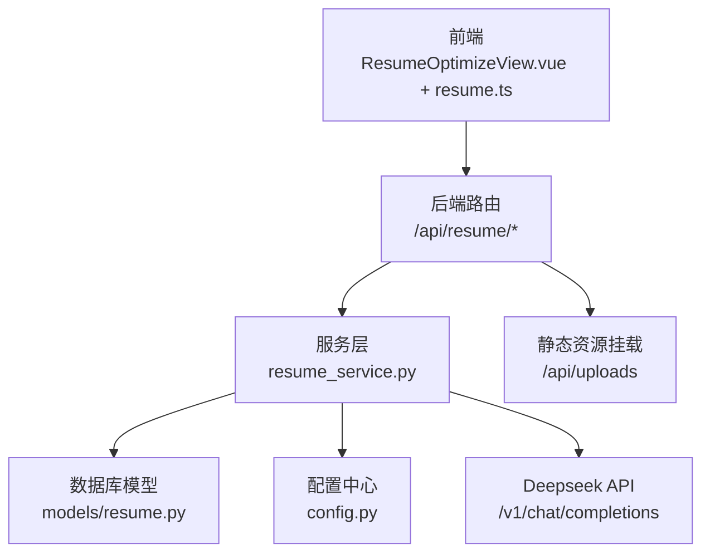
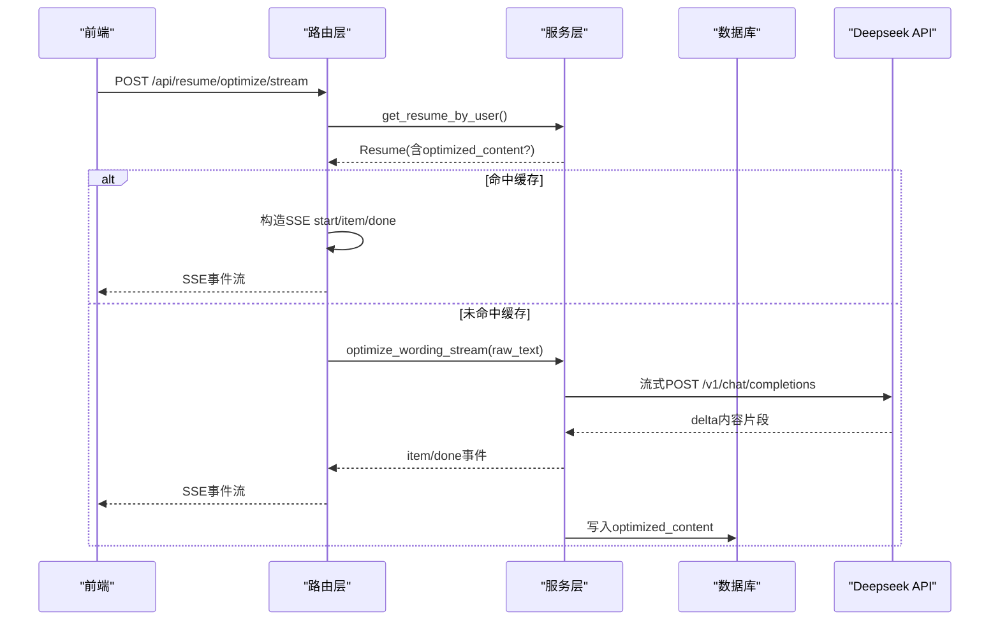
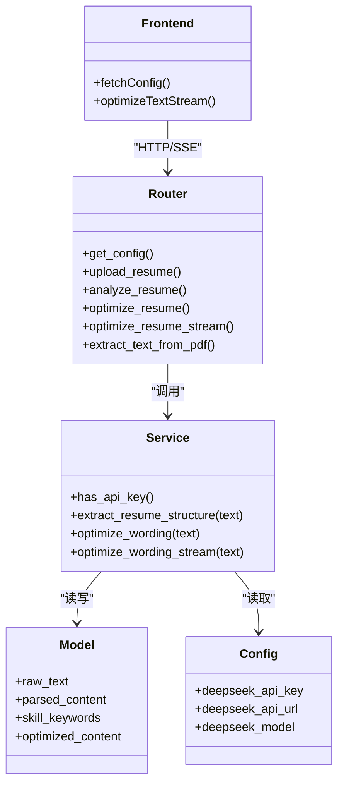

# AI优化引擎

<cite>
**本文引用的文件**
- [main.py](file://backEnd/app/main.py)
- [config.py](file://backEnd/app/config.py)
- [resume.py（路由）](file://backEnd/app/routers/resume.py)
- [resume_service.py](file://backEnd/app/services/resume_service.py)
- [resume.py（模型）](file://backEnd/app/models/resume.py)
- [resume.py（Schema）](file://backEnd/app/schemas/resume.py)
- [ResumeOptimizeView.vue](file://frontEnd/src/views/ResumeOptimizeView.vue)
- [resume.ts（Store）](file://frontEnd/src/stores/resume.ts)
</cite>

## 目录
1. [简介](#简介)
2. [项目结构](#项目结构)
3. [核心组件](#核心组件)
4. [架构总览](#架构总览)
5. [详细组件分析](#详细组件分析)
6. [依赖关系分析](#依赖关系分析)
7. [性能与缓存](#性能与缓存)
8. [质量评估指标](#质量评估指标)
9. [自定义规则与多语言支持](#自定义规则与多语言支持)
10. [批量处理指南](#批量处理指南)
11. [故障排查](#故障排查)
12. [结论](#结论)

## 简介
本技术文档围绕“简历AI优化引擎”展开，聚焦以下能力：
- 措辞优化算法与Prompt工程
- 关键词匹配分析与结构化提取
- 排版美化建议生成
- Deepseek大模型集成方案、流式响应处理
- 缓存机制与性能优化策略
- 质量评估指标设计
- 自定义优化规则扩展方法
- 多语言支持与配置
- 批量处理实现指南

该引擎通过后端FastAPI提供REST与SSE接口，前端Vue+Pinia进行交互展示，结合Deepseek大模型完成智能解析与优化。

## 项目结构
后端采用分层架构：路由层负责HTTP协议与鉴权，服务层封装业务逻辑与大模型调用，数据层使用SQLAlchemy ORM持久化；前端以视图组件与状态管理组织页面与交互。

图表来源
- [main.py:44-73](file://backEnd/app/main.py#L44-L73)
- [resume.py（路由）:19-215](file://backEnd/app/routers/resume.py#L19-L215)
- [resume_service.py:141-284](file://backEnd/app/services/resume_service.py#L141-L284)
- [resume.py（模型）:11-67](file://backEnd/app/models/resume.py#L11-L67)
- [config.py:34-37](file://backEnd/app/config.py#L34-L37)

章节来源
- [main.py:44-73](file://backEnd/app/main.py#L44-L73)
- [resume.py（路由）:19-215](file://backEnd/app/routers/resume.py#L19-L215)
- [resume_service.py:141-284](file://backEnd/app/services/resume_service.py#L141-L284)
- [resume.py（模型）:11-67](file://backEnd/app/models/resume.py#L11-L67)
- [config.py:34-37](file://backEnd/app/config.py#L34-L37)

## 核心组件
- 路由层
  - /api/resume/config：返回是否已配置Deepseek API Key
  - /api/resume/upload：上传PDF/DOCX并保存原始文本，可选自动结构化提取
  - /api/resume/analyze：手动触发结构化分析
  - /api/resume/optimize：同步措辞优化（优先返回缓存）
  - /api/resume/optimize/stream：SSE流式优化（边生成边显示）
  - /api/resume/extract-text：服务端PDF文本提取
- 服务层
  - 结构化提取：EXTRACT_PROMPT驱动，输出skills、experiences、education等
  - 措辞优化：OPTIMIZE_PROMPT驱动，输出items与stats
  - 流式优化：optimize_wording_stream按JSON对象边界切分，逐条推送item与done
- 数据层
  - Resume模型：存储raw_text、parsed_content、skill_keywords、optimized_content等
- 前端
  - ResumeOptimizeView.vue：展示原文与优化后对比，统计面板，SSE事件渲染
  - resume.ts Store：封装API请求、SSE解析、状态管理

章节来源
- [resume.py（路由）:25-215](file://backEnd/app/routers/resume.py#L25-L215)
- [resume_service.py:87-284](file://backEnd/app/services/resume_service.py#L87-L284)
- [resume.py（模型）:11-67](file://backEnd/app/models/resume.py#L11-L67)
- [ResumeOptimizeView.vue:1-277](file://frontEnd/src/views/ResumeOptimizeView.vue#L1-L277)
- [resume.ts:82-244](file://frontEnd/src/stores/resume.ts#L82-L244)

## 架构总览
整体流程：前端发起优化请求 → 路由校验与鉴权 → 服务层读取简历文本 → 命中缓存则直接返回或推送缓存 → 未命中则调用Deepseek API（同步或流式）→ 结果写入缓存 → 前端实时渲染。

图表来源
- [resume.py（路由）:140-192](file://backEnd/app/routers/resume.py#L140-L192)
- [resume_service.py:186-284](file://backEnd/app/services/resume_service.py#L186-L284)
- [resume.py（模型）:51-55](file://backEnd/app/models/resume.py#L51-L55)

## 详细组件分析

### 路由层：/api/resume/*
职责
- 鉴权与参数校验
- 缓存命中判断
- 同步/流式优化调度
- PDF文本提取与上传落盘

关键路径
- 同步优化：先查缓存，命中直接返回；否则调用服务层optimize_wording，并将结果持久化
- 流式优化：SSE事件start/item/done，命中缓存时直接推送缓存条目
- 结构化分析：upload/analyze均调用extract_resume_structure，更新parsed_content与skill_keywords

错误处理
- 未配置API Key：返回400
- 无简历：返回404
- AI失败：返回500并附带错误信息

章节来源
- [resume.py（路由）:25-215](file://backEnd/app/routers/resume.py#L25-L215)

### 服务层：Deepseek集成与Prompt工程
职责
- 统一读取配置（API Key、URL、Model）
- 构建系统提示与用户提示
- 同步调用与流式解析
- JSON边界解析与增量推送

Prompt设计
- EXTRACT_PROMPT：要求结构化JSON输出，包含技能、经历、教育、总结、评分与建议
- OPTIMIZE_PROMPT：限定最多5条优化项，强调量化指标、专业动词、成果导向

流式解析策略
- 基于httpx的SSE流，逐行读取data:前缀
- 维护buffer，使用括号深度计数定位完整JSON对象
- 识别两种模式：
  - 外层{"items":[...]}数组，逐项提取为item事件
  - 直接出现{"original":"...","optimized":"..."}对象，作为单条item事件
- done事件携带stats，若同一对象包含stats则提前结束

章节来源
- [resume_service.py:87-284](file://backEnd/app/services/resume_service.py#L87-L284)
- [config.py:34-37](file://backEnd/app/config.py#L34-L37)

### 数据层：Resume模型与缓存字段
字段说明
- raw_text：简历原始文本
- parsed_content：结构化提取结果（JSON）
- skill_keywords：技能关键词列表（JSON）
- optimized_content：措辞优化结果缓存（JSON），包含original、optimized、stats

缓存失效策略
- 当raw_text变化时，清空optimized_content，确保下次优化重新计算

章节来源
- [resume.py（模型）:11-67](file://backEnd/app/models/resume.py#L11-L67)

### 前端：SSE流式渲染与UI反馈
功能点
- 首次加载获取配置与简历
- 点击“AI一键优化”触发SSE流
- 收到start事件：显示“已连接，AI正在生成...”
- 收到item事件：追加原文与优化后文本到左右列
- 收到done事件：更新统计面板
- Loading弹窗在第一条item到达时关闭

章节来源
- [ResumeOptimizeView.vue:165-261](file://frontEnd/src/views/ResumeOptimizeView.vue#L165-L261)
- [resume.ts:161-207](file://frontEnd/src/stores/resume.ts#L161-L207)

## 依赖关系分析
模块耦合
- 路由层依赖服务层与数据库会话
- 服务层依赖配置中心与外部LLM
- 前端依赖Store封装的网络请求与SSE解析

图表来源
- [resume.py（路由）:25-215](file://backEnd/app/routers/resume.py#L25-L215)
- [resume_service.py:141-284](file://backEnd/app/services/resume_service.py#L141-L284)
- [resume.py（模型）:11-67](file://backEnd/app/models/resume.py#L11-L67)
- [config.py:34-37](file://backEnd/app/config.py#L34-L37)
- [resume.ts:82-244](file://frontEnd/src/stores/resume.ts#L82-L244)

## 性能与缓存
- 缓存命中优先：同步与流式接口均优先检查optimized_content，避免重复调用LLM
- 流式传输：SSE减少首屏等待时间，提升用户体验
- 超时控制：同步调用60s，流式120s，防止长时间阻塞
- 文本提取：服务端使用PyMuPDF提高PDF解析可靠性，降低前端解析失败率
- 并发与I/O：使用异步客户端与服务端流式处理，提升吞吐

章节来源
- [resume.py（路由）:100-192](file://backEnd/app/routers/resume.py#L100-L192)
- [resume_service.py:141-284](file://backEnd/app/services/resume_service.py#L141-L284)
- [resume.py（路由）:195-215](file://backEnd/app/routers/resume.py#L195-L215)

## 质量评估指标
后端在服务层根据已发送条目估算stats，包括：
- total_optimized：优化条数
- professionalism_improvement：专业度提升百分比
- quantified_metrics_added：新增量化指标数量
- overall_rating：综合评级（A+/A）

前端将这些指标展示在统计面板中，便于用户直观了解优化效果。

章节来源
- [resume_service.py:277-284](file://backEnd/app/services/resume_service.py#L277-L284)
- [ResumeOptimizeView.vue:124-141](file://frontEnd/src/views/ResumeOptimizeView.vue#L124-L141)

## 自定义规则与多语言支持

### 自定义优化规则
- Prompt工程扩展：在OPTIMIZE_PROMPT中增加领域特定约束（如行业术语、岗位关键词、量化模板）
- 结构化提取扩展：在EXTRACT_PROMPT中增加新字段（如证书、奖项、语言能力）
- 规则注入方式：
  - 将规则作为system_prompt的一部分传入call_deepseek
  - 在OPTIMIZE_PROMPT末尾追加“额外要求”段落
  - 通过配置中心动态注入（见下一节）

章节来源
- [resume_service.py:87-138](file://backEnd/app/services/resume_service.py#L87-L138)

### 多语言支持配置
- 通过配置中心设置目标语言与风格偏好（例如中文正式、英文简洁）
- 在Prompt中插入语言与风格指令，使LLM输出符合预期
- 前端可切换语言标签，后端根据当前用户语言偏好调整Prompt

章节来源
- [config.py:34-37](file://backEnd/app/config.py#L34-L37)
- [resume_service.py:141-171](file://backEnd/app/services/resume_service.py#L141-L171)

## 批量处理指南
当前实现为单用户单简历，批量处理可通过以下方式扩展：
- 批量上传：前端循环调用/upload接口，后端保持现有逻辑不变
- 批量分析：遍历用户列表，逐个调用/analyze
- 批量优化：遍历用户列表，逐个调用/optimize或/optimize/stream
- 任务队列：引入Celery或RQ，将耗时任务异步化，避免阻塞主线程
- 进度追踪：为每个任务分配ID，前端轮询或SSE推送进度

注意
- 需考虑并发限制与API配额
- 对失败任务进行重试与告警
- 记录批处理日志与审计信息

[本节为概念性指导，不直接分析具体文件]

## 故障排查
常见问题与定位
- 未配置API Key：路由层返回400，请检查.env中的DEEPSEEK_API_KEY
- 无简历：路由层返回404，请先上传简历
- AI优化失败：路由层返回500，查看后端日志与LLM响应
- PDF解析失败：检查文件格式与大小，确认服务端依赖安装
- 流式中断：检查网络稳定性与代理配置，确认SSE中间件正常

章节来源
- [resume.py（路由）:89-97](file://backEnd/app/routers/resume.py#L89-L97)
- [resume.py（路由）:106-137](file://backEnd/app/routers/resume.py#L106-L137)
- [resume.py（路由）:146-192](file://backEnd/app/routers/resume.py#L146-L192)
- [resume.py（路由）:195-215](file://backEnd/app/routers/resume.py#L195-L215)

## 结论
本引擎通过清晰的层次划分与Prompt工程实现了高效的简历结构化提取与措辞优化，结合SSE流式传输与数据库缓存显著提升了性能与用户体验。后续可在规则扩展、多语言适配与批量处理方面持续演进，以满足更复杂的业务场景。