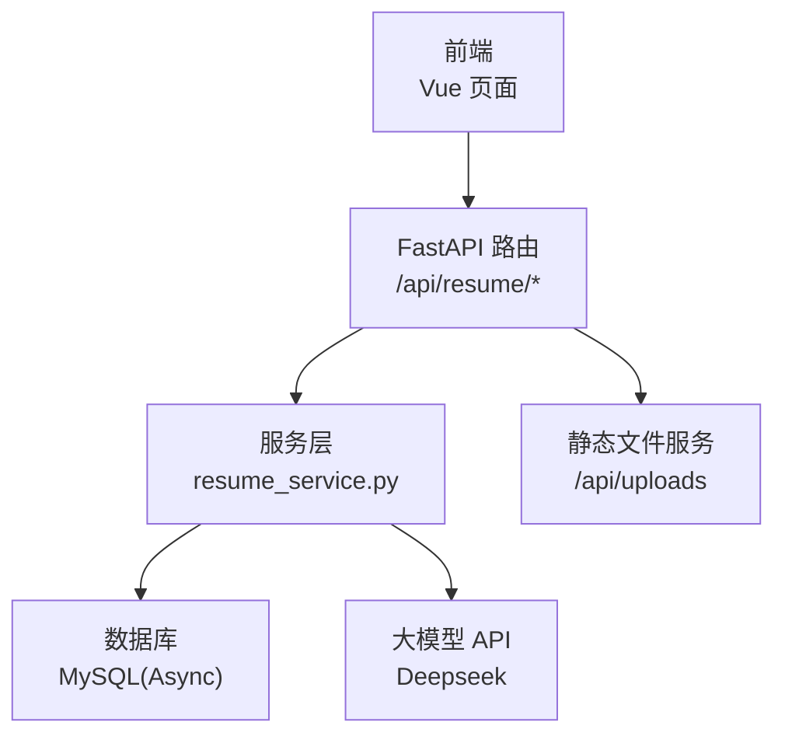
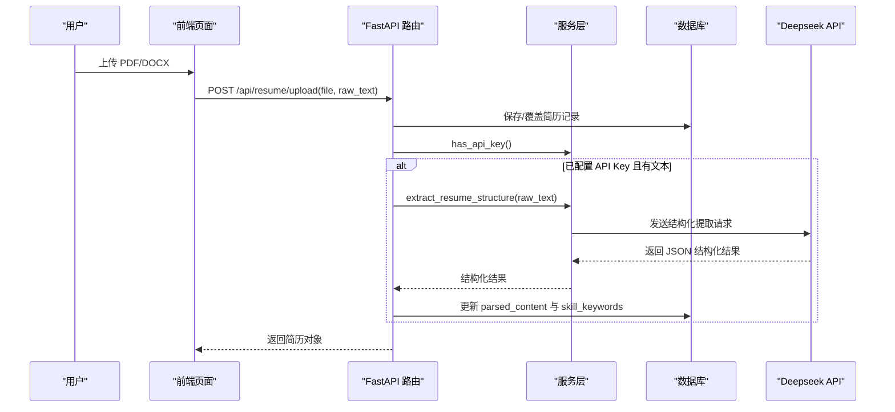
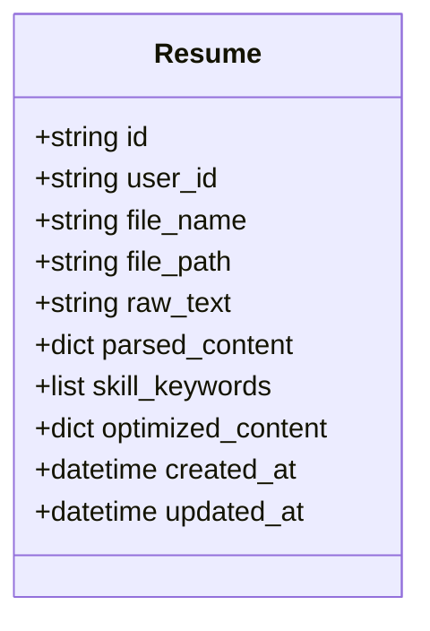
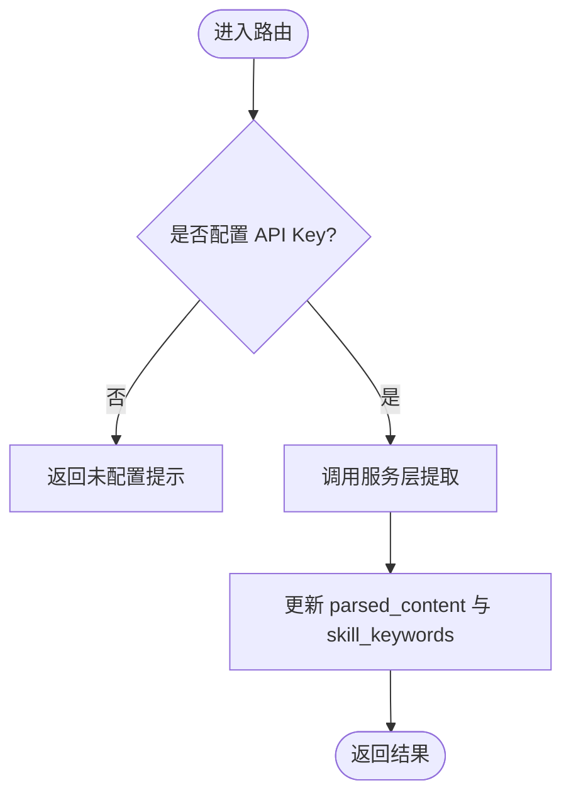
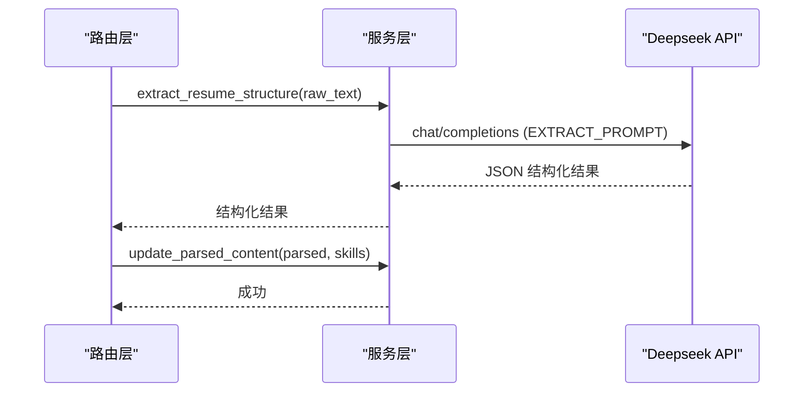
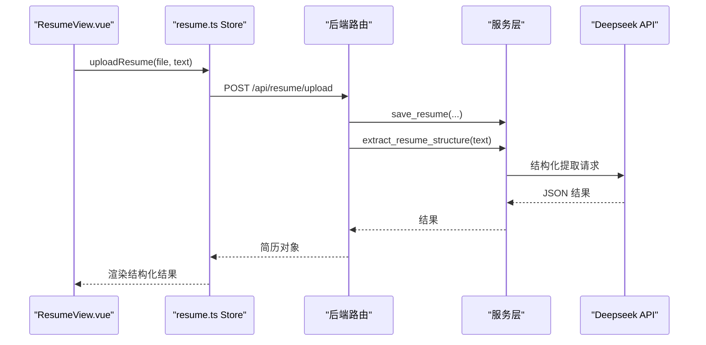
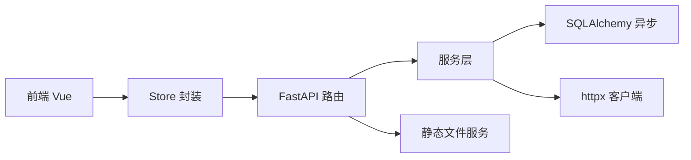

# 内容智能提取

<cite>
**本文引用的文件**   
- [backEnd/app/models/resume.py](file://backEnd/app/models/resemo.py)
- [backEnd/app/routers/resume.py](file://backEnd/app/routers/resume.py)
- [backEnd/app/services/resume_service.py](file://backEnd/app/services/resume_service.py)
- [backEnd/app/schemas/resume.py](file://backEnd/app/schemas/resume.py)
- [backEnd/app/config.py](file://backEnd/app/config.py)
- [backEnd/app/database.py](file://backEnd/app/database.py)
- [backEnd/app/main.py](file://backEnd/app/main.py)
- [frontEnd/src/views/ResumeView.vue](file://frontEnd/src/views/ResumeView.vue)
- [frontEnd/src/stores/resume.ts](file://frontEnd/src/stores/resume.ts)
- [backEnd/requirements.txt](file://backEnd/requirements.txt)
</cite>

## 目录
1. [简介](#简介)
2. [项目结构](#项目结构)
3. [核心组件](#核心组件)
4. [架构总览](#架构总览)
5. [详细组件分析](#详细组件分析)
6. [依赖关系分析](#依赖关系分析)
7. [性能与可扩展性](#性能与可扩展性)
8. [故障排查指南](#故障排查指南)
9. [结论](#结论)
10. [附录：自定义提取规则与扩展指南](#附录自定义提取规则与扩展指南)

## 简介
本系统面向简历内容的智能结构化提取，基于大模型（Deepseek）驱动的自然语言处理流程，自动识别并抽取姓名、联系方式、工作经历、教育背景、技能标签等关键信息，并提供措辞优化建议。后端采用 FastAPI + SQLAlchemy 异步 ORM，前端使用 Vue 3 + Pinia，提供上传、解析、可视化报告与流式优化体验。

## 项目结构
- 后端
  - 路由层：REST API 暴露上传、分析、优化、文本提取等能力
  - 服务层：封装数据库操作与大模型调用逻辑
  - 数据模型：定义简历实体及 JSON 字段存储结构化结果
  - 配置与启动：环境变量加载、CORS、静态资源挂载、异常处理
- 前端
  - 视图：上传、展示结构化结果、词云、时间线、改进建议
  - Store：统一状态管理与 API 调用封装，支持 SSE 流式响应

图表来源
- [backEnd/app/routers/resume.py:1-215](file://backEnd/app/routers/resume.py#L1-L215)
- [backEnd/app/services/resume_service.py:1-285](file://backEnd/app/services/resume_service.py#L1-L285)
- [backEnd/app/main.py:60-73](file://backEnd/app/main.py#L60-L73)

章节来源
- [backEnd/app/main.py:1-90](file://backEnd/app/main.py#L1-L90)
- [backEnd/app/routers/resume.py:1-215](file://backEnd/app/routers/resume.py#L1-L215)
- [backEnd/app/services/resume_service.py:1-285](file://backEnd/app/services/resume_service.py#L1-L285)
- [backEnd/app/models/resume.py:1-67](file://backEnd/app/models/resume.py#L1-L67)
- [backEnd/app/schemas/resume.py:1-35](file://backEnd/app/schemas/resume.py#L1-L35)
- [backEnd/app/config.py:1-71](file://backEnd/app/config.py#L1-L71)
- [backEnd/app/database.py:1-58](file://backEnd/app/database.py#L1-L58)
- [frontEnd/src/views/ResumeView.vue:1-530](file://frontEnd/src/views/ResumeView.vue#L1-L530)
- [frontEnd/src/stores/resume.ts:1-244](file://frontEnd/src/stores/resume.ts#L1-L244)

## 核心组件
- 数据模型 Resume
  - 存储用户简历的原始文本、文件路径、结构化提取结果（JSON）、技能关键词列表、优化缓存等
- 路由层 resume router
  - 提供获取配置、获取简历、上传覆盖、手动触发分析、措辞优化（同步/流式）、PDF 文本提取等接口
- 服务层 resume service
  - CRUD 操作、Deepseek API 调用封装、结构化提取与措辞优化、SSE 流式输出解析
- 前端视图与状态
  - 上传与拖拽、PDF/DOCX 文本提取、结构化结果展示、词云与时间线、流式优化交互

章节来源
- [backEnd/app/models/resume.py:11-67](file://backEnd/app/models/resume.py#L11-L67)
- [backEnd/app/routers/resume.py:25-215](file://backEnd/app/routers/resume.py#L25-L215)
- [backEnd/app/services/resume_service.py:32-285](file://backEnd/app/services/resume_service.py#L32-L285)
- [frontEnd/src/views/ResumeView.vue:1-530](file://frontEnd/src/views/ResumeView.vue#L1-L530)
- [frontEnd/src/stores/resume.ts:1-244](file://frontEnd/src/stores/resume.ts#L1-L244)

## 架构总览
系统采用前后端分离架构，后端通过 REST API 提供服务，结合 SSE 实现实时反馈；大模型调用集中在服务层，便于统一错误处理与重试策略。

图表来源
- [backEnd/app/routers/resume.py:47-77](file://backEnd/app/routers/resume.py#L47-L77)
- [backEnd/app/services/resume_service.py:174-177](file://backEnd/app/services/resume_service.py#L174-L177)
- [backEnd/app/services/resume_service.py:141-172](file://backEnd/app/services/resume_service.py#L141-L172)
- [backEnd/app/models/resume.py:41-50](file://backEnd/app/models/resume.py#L41-L50)

## 详细组件分析

### 数据模型与持久化
- Resume 表字段
  - id、user_id（唯一约束，每用户一条）、file_name、file_path、raw_text
  - parsed_content（JSON）：结构化提取结果
  - skill_keywords（JSON）：技能关键词列表
  - optimized_content（JSON）：措辞优化缓存
  - created_at、updated_at 时间戳
- 数据库连接与会话
  - 使用 SQLAlchemy 异步引擎与会话工厂，提供 get_db 依赖注入
  - 兼容 aiomysql ping 签名差异的补丁

图表来源
- [backEnd/app/models/resume.py:11-67](file://backEnd/app/models/resume.py#L11-L67)
- [backEnd/app/database.py:31-58](file://backEnd/app/database.py#L31-L58)

章节来源
- [backEnd/app/models/resume.py:11-67](file://backEnd/app/models/resume.py#L11-L67)
- [backEnd/app/database.py:1-58](file://backEnd/app/database.py#L1-L58)

### 路由层：简历 API
- GET /api/resume/config：返回是否配置了 Deepseek API Key
- GET /api/resume/：获取当前用户的简历
- POST /api/resume/upload：上传或覆盖简历，若配置了 API Key 且包含 raw_text，则自动进行结构化提取
- POST /api/resume/analyze：手动触发 AI 结构化分析
- POST /api/resume/optimize：同步措辞优化（优先返回缓存）
- POST /api/resume/optimize/stream：SSE 流式优化，边生成边推送
- POST /api/resume/extract-text：服务端 PDF 文本提取（PyMuPDF）

图表来源
- [backEnd/app/routers/resume.py:25-98](file://backEnd/app/routers/resume.py#L25-L98)
- [backEnd/app/services/resume_service.py:72-83](file://backEnd/app/services/resume_service.py#L72-L83)

章节来源
- [backEnd/app/routers/resume.py:25-215](file://backEnd/app/routers/resume.py#L25-L215)

### 服务层：AI 驱动的结构化提取与优化
- 结构化提取
  - 构造 EXTRACT_PROMPT，将 raw_text 插入模板
  - 调用 call_deepseek，解析返回 JSON（兼容 markdown code block）
  - 返回 skills、experiences、education、summary、score、suggestions、skill_categories
- 措辞优化
  - 构造 OPTIMIZE_PROMPT，选择最多 5 条重要经历/项目进行优化
  - 返回 items（original/optimized）与 stats（统计指标）
  - 流式版本 optimize_wording_stream：按 SSE 行解析，逐条 item 推送，最后 done 事件携带 stats
- 错误处理
  - 路由层对 AI 失败做容错（不影响保存），并在 analyze/optimize 中抛出 HTTP 错误码
  - 全局验证异常处理器避免二进制内容导致的解码错误

图表来源
- [backEnd/app/services/resume_service.py:88-177](file://backEnd/app/services/resume_service.py#L88-L177)
- [backEnd/app/services/resume_service.py:174-177](file://backEnd/app/services/resume_service.py#L174-L177)
- [backEnd/app/routers/resume.py:80-98](file://backEnd/app/routers/resume.py#L80-L98)

章节来源
- [backEnd/app/services/resume_service.py:86-285](file://backEnd/app/services/resume_service.py#L86-L285)
- [backEnd/app/routers/resume.py:80-137](file://backEnd/app/routers/resume.py#L80-L137)
- [backEnd/app/main.py:76-84](file://backEnd/app/main.py#L76-L84)

### 前端：上传、分析与可视化
- 上传与解析
  - PDF：调用后端 /api/resume/extract-text 使用 PyMuPDF 提取文本
  - DOCX：前端 mammoth 提取纯文本
- 结构化结果展示
  - 左侧：技能关键词、工作经历、教育背景
  - 右侧：综合评分、技能词云、经历时间线、技能分布、改进建议
- 流式优化
  - SSE 读取 data: 行，解析 type=item/done/start，实时更新 UI

图表来源
- [frontEnd/src/views/ResumeView.vue:414-458](file://frontEnd/src/views/ResumeView.vue#L414-L458)
- [frontEnd/src/stores/resume.ts:114-135](file://frontEnd/src/stores/resume.ts#L114-L135)
- [backEnd/app/routers/resume.py:47-77](file://backEnd/app/routers/resume.py#L47-L77)
- [backEnd/app/services/resume_service.py:174-177](file://backEnd/app/services/resume_service.py#L174-L177)

章节来源
- [frontEnd/src/views/ResumeView.vue:1-530](file://frontEnd/src/views/ResumeView.vue#L1-L530)
- [frontEnd/src/stores/resume.ts:1-244](file://frontEnd/src/stores/resume.ts#L1-L244)

## 依赖关系分析
- 后端依赖
  - FastAPI、Uvicorn、Pydantic Settings
  - SQLAlchemy 异步、aiomysql/pymysql、Alembic
  - httpx（Deepseek API 客户端）
  - PyMuPDF（PDF 文本提取）
- 前端依赖
  - Vue 3、Pinia、TypeScript
  - mammoth（DOCX 文本提取）
  - 原生 fetch 与 TextDecoder 处理 SSE

图表来源
- [backEnd/requirements.txt:1-27](file://backEnd/requirements.txt#L1-L27)
- [backEnd/app/main.py:60-73](file://backEnd/app/main.py#L60-L73)
- [backEnd/app/routers/resume.py:1-20](file://backEnd/app/routers/resume.py#L1-L20)
- [backEnd/app/services/resume_service.py:1-15](file://backEnd/app/services/resume_service.py#L1-L15)

章节来源
- [backEnd/requirements.txt:1-27](file://backEnd/requirements.txt#L1-L27)
- [backEnd/app/main.py:60-73](file://backEnd/app/main.py#L60-L73)

## 性能与可扩展性
- 流式优化
  - 使用 SSE 边生成边推送，降低首屏等待时间，提升用户体验
- 缓存机制
  - 优化结果持久化到 optimized_content，命中缓存直接返回，减少重复调用
- 并发与连接池
  - 异步引擎与连接池参数可调，适合高并发场景
- 可扩展点
  - 提示词模板可配置化，支持多模型切换
  - 结构化字段可扩展（如新增“证书”、“语言能力”等）
  - 技能分类与权重可引入规则引擎或知识图谱增强

[本节为通用指导，不直接分析具体文件]

## 故障排查指南
- 未配置 API Key
  - 现象：前端显示“Deepseek API 尚未配置”，后端 /api/resume/config 返回 has_api_key=false
  - 解决：在 .env 设置 DEEPSEEK_API_KEY、DEEPSEEK_API_URL、DEEPSEEK_MODEL
- PDF 提取失败
  - 现象：/api/resume/extract-text 返回 500 错误
  - 排查：确认 PyMuPDF 安装正确、文件非损坏、仅支持 PDF
- AI 分析失败
  - 现象：/api/resume/analyze 返回 500
  - 排查：检查网络连通性、API Key 有效性、模型名称与配额
- 表单验证错误
  - 现象：422 错误，input 字段可能包含二进制内容
  - 解决：全局异常处理器已移除 input 字段，确保前端传递合法类型

章节来源
- [backEnd/app/routers/resume.py:80-98](file://backEnd/app/routers/resume.py#L80-L98)
- [backEnd/app/routers/resume.py:195-215](file://backEnd/app/routers/resume.py#L195-L215)
- [backEnd/app/main.py:76-84](file://backEnd/app/main.py#L76-L84)
- [backEnd/app/config.py:34-37](file://backEnd/app/config.py#L34-L37)

## 结论
本系统以 Prompt 工程为核心，结合 FastAPI 异步架构与 SSE 流式传输，实现了简历内容的自动化结构化提取与措辞优化。通过缓存与连接池优化，兼顾性能与稳定性。后续可通过提示词模板化、技能分类规则与外部知识库集成进一步提升准确率与可解释性。

[本节为总结，不直接分析具体文件]

## 附录：自定义提取规则与扩展指南

### 自定义提取规则配置方法
- 修改提示词模板
  - 在服务层 EXTRACT_PROMPT/OPTIMIZE_PROMPT 中调整字段与评分规则，控制输出结构与风格
- 新增结构化字段
  - 在数据模型 Resume 中添加新的 JSON 字段（如 certificates、languages），并在服务层写入与更新逻辑中维护
- 技能分类与权重
  - 在后端根据 skill_categories 计算百分比，在前端渲染进度条与词云大小

章节来源
- [backEnd/app/services/resume_service.py:88-138](file://backEnd/app/services/resume_service.py#L88-L138)
- [backEnd/app/models/resume.py:41-55](file://backEnd/app/models/resume.py#L41-L55)
- [frontEnd/src/views/ResumeView.vue:214-265](file://frontEnd/src/views/ResumeView.vue#L214-L265)

### 人工校验接口设计建议
- 新增 PATCH /api/resume/{id}/validate
  - 接收人工修正后的结构化字段，合并至 parsed_content，并记录变更日志
- 新增 GET /api/resume/{id}/audit-log
  - 返回人工校验历史，支持审计与回溯
- 前端增加“编辑/确认”按钮，允许用户对提取结果进行微调并提交

[本节为概念性设计，不直接分析具体文件]

### 错误处理与重试机制
- 路由层对 AI 失败做容错，保证上传流程不受影响
- 建议在服务层增加指数退避重试与熔断器，提高鲁棒性
- 针对 SSE 流式解析，增加断线重连与缓冲合并逻辑

章节来源
- [backEnd/app/routers/resume.py:70-77](file://backEnd/app/routers/resume.py#L70-L77)
- [backEnd/app/services/resume_service.py:205-285](file://backEnd/app/services/resume_service.py#L205-L285)

### 扩展指南
- 多模型支持
  - 通过配置项 deepseek_model 切换不同模型，或在服务层抽象出模型适配器
- 插件化提示词管理
  - 将 EXTRACT_PROMPT/OPTIMIZE_PROMPT 外置为配置文件或数据库表，支持动态加载
- 前端扩展
  - 增加导出功能（Word/PDF），支持批量简历分析与对比报告

[本节为概念性扩展，不直接分析具体文件]