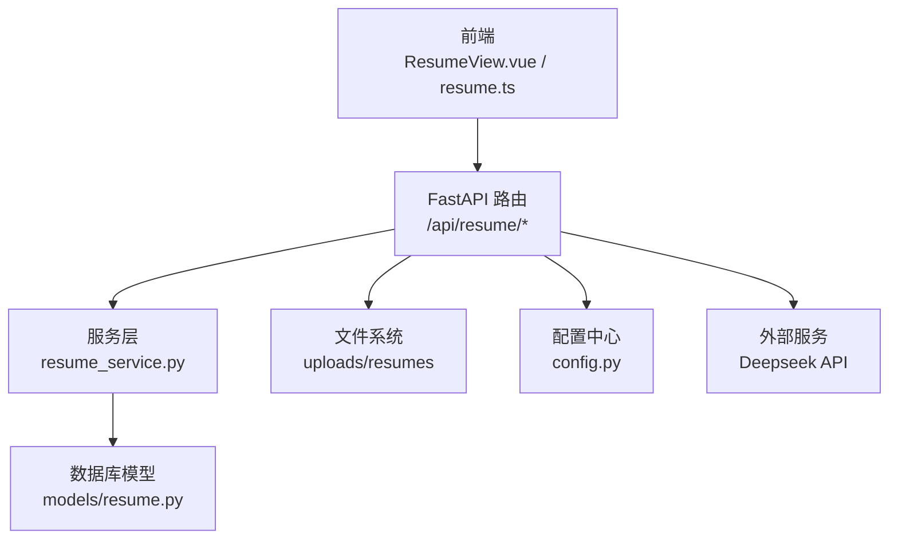
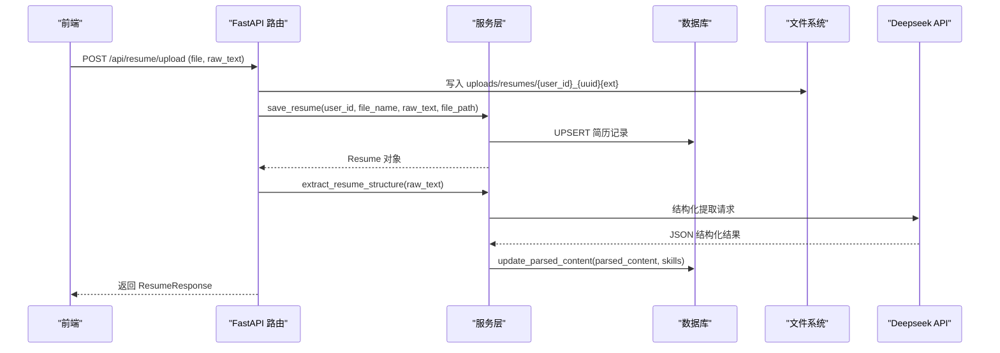
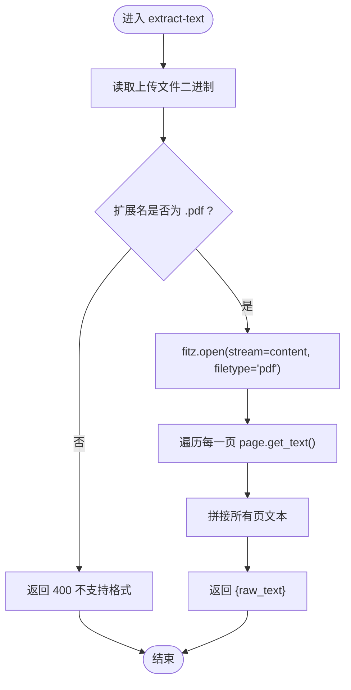
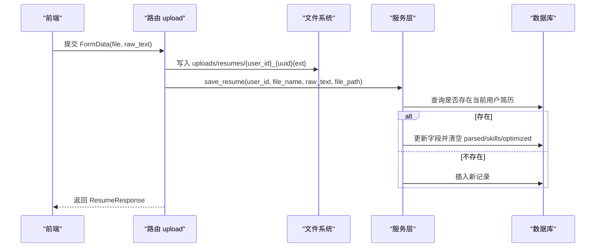
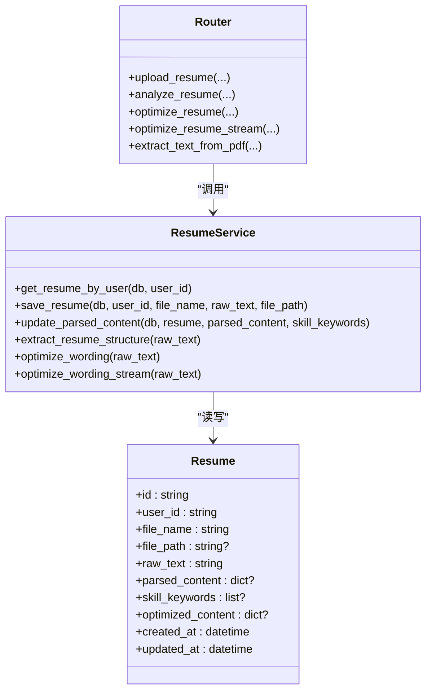
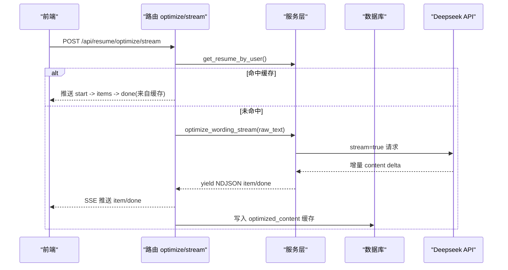
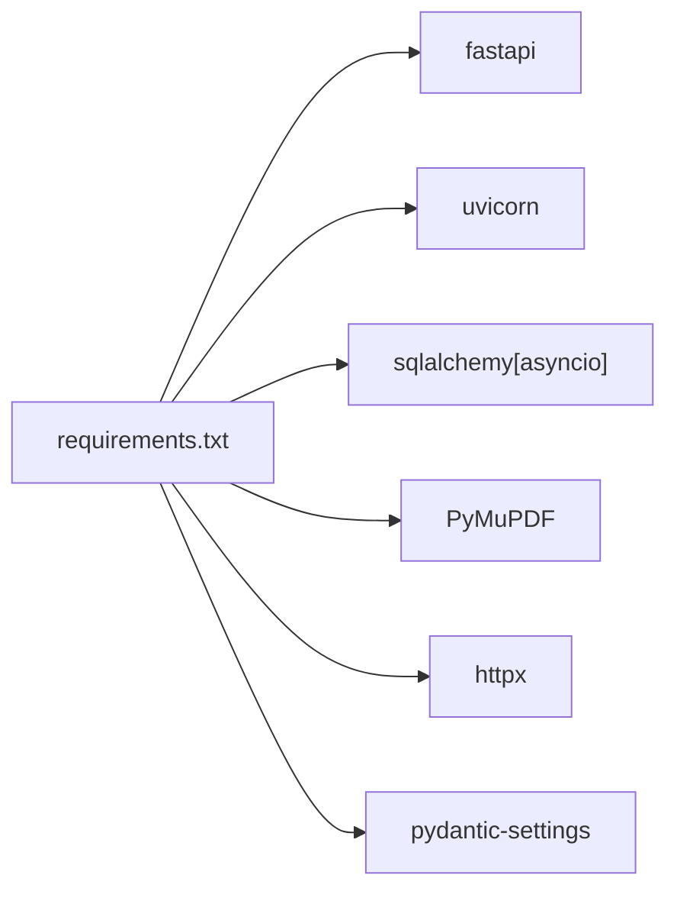

# 文件解析引擎

<cite>
**本文引用的文件**   
- [backEnd/app/routers/resume.py](file://backEnd/app/routers/resume.py)
- [backEnd/app/services/resume_service.py](file://backEnd/app/services/resume_service.py)
- [backEnd/app/models/resume.py](file://backEnd/app/models/resume.py)
- [backEnd/app/schemas/resume.py](file://backEnd/app/schemas/resume.py)
- [backEnd/app/config.py](file://backEnd/app/config.py)
- [backEnd/app/main.py](file://backEnd/app/main.py)
- [frontEnd/src/views/ResumeView.vue](file://frontEnd/src/views/ResumeView.vue)
- [frontEnd/src/stores/resume.ts](file://frontEnd/src/stores/resume.ts)
- [backEnd/requirements.txt](file://backEnd/requirements.txt)
</cite>

## 目录
1. [简介](#简介)
2. [项目结构](#项目结构)
3. [核心组件](#核心组件)
4. [架构总览](#架构总览)
5. [详细组件分析](#详细组件分析)
6. [依赖关系分析](#依赖关系分析)
7. [性能考量](#性能考量)
8. [故障排查指南](#故障排查指南)
9. [结论](#结论)
10. [附录](#附录)

## 简介
本技术文档围绕“简历文件解析引擎”展开，重点覆盖以下能力：
- PDF 文本提取与解析：基于 PyMuPDF 的服务端提取方案、文本抽取流程、格式兼容性处理。
- 文件上传与存储管理：前端到后端的上传链路、本地磁盘存储、静态资源访问。
- 结构化解析与版本控制：AI 结构化提取、优化结果缓存、覆盖式更新策略。
- 企业级功能现状与建议：文件格式校验、大小限制、安全扫描等能力的实现现状与扩展建议。
- 可扩展性与性能优化：自定义解析器接入方式、流式输出、缓存策略与并发模型。

## 项目结构
后端采用 FastAPI + SQLAlchemy 异步 ORM，简历模块包含路由层、服务层、数据模型与请求响应 Schema；前端使用 Vue 3 + Pinia 进行状态管理与交互。

图示来源
- [backEnd/app/routers/resume.py:1-215](file://backEnd/app/routers/resume.py#L1-L215)
- [backEnd/app/services/resume_service.py:1-285](file://backEnd/app/services/resume_service.py#L1-L285)
- [backEnd/app/models/resume.py:1-67](file://backEnd/app/models/resume.py#L1-L67)
- [backEnd/app/config.py:1-71](file://backEnd/app/config.py#L1-L71)
- [frontEnd/src/views/ResumeView.vue:1-530](file://frontEnd/src/views/ResumeView.vue#L1-L530)
- [frontEnd/src/stores/resume.ts:1-244](file://frontEnd/src/stores/resume.ts#L1-L244)

章节来源
- [backEnd/app/routers/resume.py:1-215](file://backEnd/app/routers/resume.py#L1-L215)
- [backEnd/app/services/resume_service.py:1-285](file://backEnd/app/services/resume_service.py#L1-L285)
- [backEnd/app/models/resume.py:1-67](file://backEnd/app/models/resume.py#L1-L67)
- [backEnd/app/schemas/resume.py:1-35](file://backEnd/app/schemas/resume.py#L1-L35)
- [backEnd/app/config.py:1-71](file://backEnd/app/config.py#L1-L71)
- [backEnd/app/main.py:1-90](file://backEnd/app/main.py#L1-L90)
- [frontEnd/src/views/ResumeView.vue:1-530](file://frontEnd/src/views/ResumeView.vue#L1-L530)
- [frontEnd/src/stores/resume.ts:1-244](file://frontEnd/src/stores/resume.ts#L1-L244)

## 核心组件
- 路由层（/api/resume）：提供获取配置、上传、分析、优化、文本提取等接口。
- 服务层：封装数据库操作与 Deepseek API 调用，包括结构化提取、措辞优化与流式优化。
- 数据模型：定义简历实体字段（文件名、路径、原始文本、结构化内容、技能关键词、优化缓存等）。
- 配置中心：集中读取 .env 中的数据库、CORS、Deepseek API 等配置。
- 前端视图与 Store：负责文件选择、解析、上传、展示与分析交互。

章节来源
- [backEnd/app/routers/resume.py:1-215](file://backEnd/app/routers/resume.py#L1-L215)
- [backEnd/app/services/resume_service.py:1-285](file://backEnd/app/services/resume_service.py#L1-L285)
- [backEnd/app/models/resume.py:1-67](file://backEnd/app/models/resume.py#L1-L67)
- [backEnd/app/schemas/resume.py:1-35](file://backEnd/app/schemas/resume.py#L1-L35)
- [backEnd/app/config.py:1-71](file://backEnd/app/config.py#L1-L71)
- [frontEnd/src/views/ResumeView.vue:1-530](file://frontEnd/src/views/ResumeView.vue#L1-L530)
- [frontEnd/src/stores/resume.ts:1-244](file://frontEnd/src/stores/resume.ts#L1-L244)

## 架构总览
系统整体由前端页面发起请求，经由 FastAPI 路由分发至服务层，服务层完成数据库读写与外部 AI 调用，最终返回结构化或流式响应。上传的文件落盘于 uploads/resumes，并通过静态文件挂载对外暴露。

图示来源
- [backEnd/app/routers/resume.py:47-77](file://backEnd/app/routers/resume.py#L47-L77)
- [backEnd/app/services/resume_service.py:40-83](file://backEnd/app/services/resume_service.py#L40-L83)
- [backEnd/app/services/resume_service.py:174-177](file://backEnd/app/services/resume_service.py#L174-L177)
- [backEnd/app/models/resume.py:11-67](file://backEnd/app/models/resume.py#L11-L67)

## 详细组件分析

### PDF 文本提取与解析（PyMuPDF）
- 服务端提取入口：POST /api/resume/extract-text，仅接受 PDF 文件，使用 PyMuPDF 打开内存流并逐页提取文本，拼接为完整字符串返回。
- 前端在遇到 PDF 时优先调用该接口，避免前端 pdf.js 的兼容性问题；DOCX 则在前端使用 mammoth 提取纯文本。
- 错误处理：当解析异常时返回 500 并附带错误信息。

图示来源
- [backEnd/app/routers/resume.py:195-214](file://backEnd/app/routers/resume.py#L195-L214)

章节来源
- [backEnd/app/routers/resume.py:195-214](file://backEnd/app/routers/resume.py#L195-L214)
- [frontEnd/src/views/ResumeView.vue:414-427](file://frontEnd/src/views/ResumeView.vue#L414-L427)
- [frontEnd/src/stores/resume.ts:209-225](file://frontEnd/src/stores/resume.ts#L209-L225)

### 文件上传流程与存储管理
- 上传接口：POST /api/resume/upload，支持 multipart/form-data，携带 file 与 raw_text。
- 存储策略：以用户 ID 与随机短 UUID 命名，保留原扩展名，落盘至 uploads/resumes；相对路径存入数据库。
- 静态访问：主应用将 uploads 目录挂载为 /api/uploads，前端可直接通过 /api/{file_path} 访问。
- 覆盖式更新：同一用户再次上传会覆盖现有记录，清空结构化内容与优化缓存。

图示来源
- [backEnd/app/routers/resume.py:47-77](file://backEnd/app/routers/resume.py#L47-L77)
- [backEnd/app/services/resume_service.py:40-69](file://backEnd/app/services/resume_service.py#L40-L69)
- [backEnd/app/main.py:70-73](file://backEnd/app/main.py#L70-L73)

章节来源
- [backEnd/app/routers/resume.py:47-77](file://backEnd/app/routers/resume.py#L47-L77)
- [backEnd/app/services/resume_service.py:40-69](file://backEnd/app/services/resume_service.py#L40-L69)
- [backEnd/app/main.py:70-73](file://backEnd/app/main.py#L70-L73)

### 结构化解析与版本控制机制
- 自动触发：上传成功后若已配置 API Key 且提供了 raw_text，则自动调用结构化提取并保存。
- 手动触发：POST /api/resume/analyze 可重新执行结构化提取。
- 数据结构：parsed_content 与 skill_keywords 分别存储结构化 JSON 与技能关键词列表。
- 版本控制：覆盖式更新策略，每次上传均重置结构化与优化缓存，保证一致性。

图示来源
- [backEnd/app/models/resume.py:11-67](file://backEnd/app/models/resume.py#L11-L67)
- [backEnd/app/services/resume_service.py:34-83](file://backEnd/app/services/resume_service.py#L34-L83)
- [backEnd/app/routers/resume.py:80-98](file://backEnd/app/routers/resume.py#L80-L98)

章节来源
- [backEnd/app/routers/resume.py:68-77](file://backEnd/app/routers/resume.py#L68-L77)
- [backEnd/app/routers/resume.py:80-98](file://backEnd/app/routers/resume.py#L80-L98)
- [backEnd/app/services/resume_service.py:40-83](file://backEnd/app/services/resume_service.py#L40-L83)
- [backEnd/app/models/resume.py:11-67](file://backEnd/app/models/resume.py#L11-L67)

### 措辞优化与流式输出（SSE）
- 同步优化：POST /api/resume/optimize，命中缓存直接返回，否则调用 Deepseek 生成优化项与统计信息，并持久化缓存。
- 流式优化：POST /api/resume/optimize/stream，服务端以 SSE 推送 item 与 done 事件，前端边接收边渲染，提升体验。
- 缓存策略：optimized_content 字段缓存 original、optimized 与 stats，文本变化时失效。

图示来源
- [backEnd/app/routers/resume.py:140-192](file://backEnd/app/routers/resume.py#L140-L192)
- [backEnd/app/services/resume_service.py:186-284](file://backEnd/app/services/resume_service.py#L186-L284)

章节来源
- [backEnd/app/routers/resume.py:100-137](file://backEnd/app/routers/resume.py#L100-L137)
- [backEnd/app/routers/resume.py:140-192](file://backEnd/app/routers/resume.py#L140-L192)
- [backEnd/app/services/resume_service.py:180-284](file://backEnd/app/services/resume_service.py#L180-L284)

### 前端交互与解析流程
- 文件选择与拖拽：支持点击与拖拽上传，显示解析中提示。
- 解析策略：PDF 走服务端提取，DOCX 走前端 mammoth 提取。
- 上传与刷新：上传成功后刷新本地状态，展示结构化结果与报告。
- 原文查看：PDF 弹窗内嵌预览，DOCX 直接下载源文件。

章节来源
- [frontEnd/src/views/ResumeView.vue:414-427](file://frontEnd/src/views/ResumeView.vue#L414-L427)
- [frontEnd/src/views/ResumeView.vue:448-458](file://frontEnd/src/views/ResumeView.vue#L448-L458)
- [frontEnd/src/views/ResumeView.vue:492-519](file://frontEnd/src/views/ResumeView.vue#L492-L519)
- [frontEnd/src/stores/resume.ts:114-135](file://frontEnd/src/stores/resume.ts#L114-L135)
- [frontEnd/src/stores/resume.ts:209-225](file://frontEnd/src/stores/resume.ts#L209-L225)

## 依赖关系分析
- 运行时依赖：FastAPI、Uvicorn、SQLAlchemy 异步、PyMuPDF、httpx、pydantic-settings 等。
- 外部服务：Deepseek API（结构化提取与优化），通过 httpx 异步客户端调用。
- 静态资源：uploads 目录通过 StaticFiles 挂载，供浏览器直接访问。

图示来源
- [backEnd/requirements.txt:1-27](file://backEnd/requirements.txt#L1-L27)

章节来源
- [backEnd/requirements.txt:1-27](file://backEnd/requirements.txt#L1-L27)
- [backEnd/app/config.py:1-71](file://backEnd/app/config.py#L1-L71)
- [backEnd/app/main.py:70-73](file://backEnd/app/main.py#L70-L73)

## 性能考量
- 文本提取：PyMuPDF 内存流打开，逐页提取，适合中等体积 PDF；超大文件需考虑分页与内存上限。
- 流式优化：SSE 增量推送减少首屏等待时间，提升用户体验。
- 缓存策略：结构化与优化结果持久化，避免重复计算；文本变更时主动失效。
- 并发模型：FastAPI 基于异步 I/O，配合 httpx 异步客户端提高外部 API 调用吞吐。

[本节为通用性能讨论，不直接分析具体文件]

## 故障排查指南
- 验证错误处理：全局拦截 RequestValidationError，过滤二进制 input 字段，避免 UnicodeDecodeError。
- 健康检查：GET /api/health 用于服务可用性探测。
- 常见错误：
  - 仅支持 PDF：非 PDF 文件上传到 extract-text 接口会返回 400。
  - 未配置 API Key：结构化分析与优化接口会返回 400 提示配置缺失。
  - 解析失败：PDF 解析异常返回 500 并附带错误详情。

章节来源
- [backEnd/app/main.py:76-84](file://backEnd/app/main.py#L76-L84)
- [backEnd/app/main.py:87-89](file://backEnd/app/main.py#L87-L89)
- [backEnd/app/routers/resume.py:200-214](file://backEnd/app/routers/resume.py#L200-L214)
- [backEnd/app/routers/resume.py:89-97](file://backEnd/app/routers/resume.py#L89-L97)

## 结论
本引擎实现了从前端到后端的完整简历文件处理链路：PDF 文本提取、结构化解析、措辞优化与流式输出，结合本地存储与缓存策略，具备较好的可用性与扩展性。当前在企业级安全与合规方面仍有增强空间，建议在后续迭代中完善文件大小限制、类型白名单、病毒扫描与审计日志等能力。

[本节为总结性内容，不直接分析具体文件]

## 附录

### API 定义概览
- GET /api/resume/config：获取是否配置 API Key。
- GET /api/resume/：获取当前用户简历。
- POST /api/resume/upload：上传/覆盖简历（file + raw_text），可选自动结构化。
- POST /api/resume/analyze：手动触发结构化分析。
- POST /api/resume/optimize：同步措辞优化（带缓存）。
- POST /api/resume/optimize/stream：流式措辞优化（SSE）。
- POST /api/resume/extract-text：服务端 PDF 文本提取。

章节来源
- [backEnd/app/routers/resume.py:25-32](file://backEnd/app/routers/resume.py#L25-L32)
- [backEnd/app/routers/resume.py:35-44](file://backEnd/app/routers/resume.py#L35-L44)
- [backEnd/app/routers/resume.py:47-77](file://backEnd/app/routers/resume.py#L47-L77)
- [backEnd/app/routers/resume.py:80-98](file://backEnd/app/routers/resume.py#L80-L98)
- [backEnd/app/routers/resume.py:100-137](file://backEnd/app/routers/resume.py#L100-L137)
- [backEnd/app/routers/resume.py:140-192](file://backEnd/app/routers/resume.py#L140-L192)
- [backEnd/app/routers/resume.py:195-214](file://backEnd/app/routers/resume.py#L195-L214)

### 自定义解析器扩展方法
- 新增解析器：在服务层增加新的解析函数（如基于其他库的 PDF/DOCX 解析），并在路由层提供对应接口。
- 统一入口：可在上传流程中根据文件扩展名选择不同解析器，保持接口一致。
- 结果映射：将解析结果映射到 Resume.parsed_content 与 skill_keywords，确保前端展示稳定。

[本节为概念性指导，不直接分析具体文件]

### 企业级功能实现现状与建议
- 文件格式验证：当前 extract-text 仅允许 PDF；上传接口未做严格类型校验，建议在后端统一校验扩展名与 MIME。
- 大小限制：当前无显式大小限制，建议引入中间件或路由层限流与大小校验，防止大文件导致内存溢出。
- 安全扫描：当前未集成病毒扫描或恶意内容检测，建议引入沙箱扫描或第三方服务对上传文件进行安全检查。
- 版本控制：当前为覆盖式更新，如需历史版本，可增加版本号与差异对比字段。

[本节为通用建议，不直接分析具体文件]