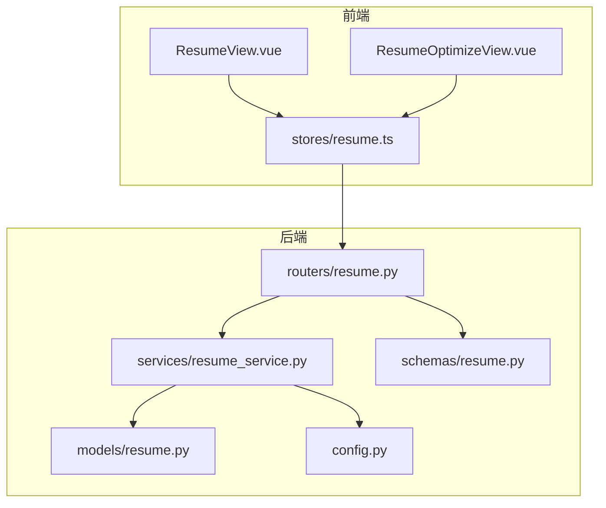
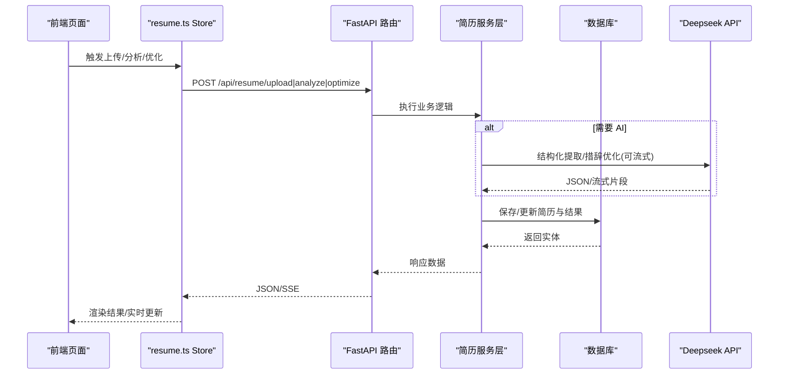
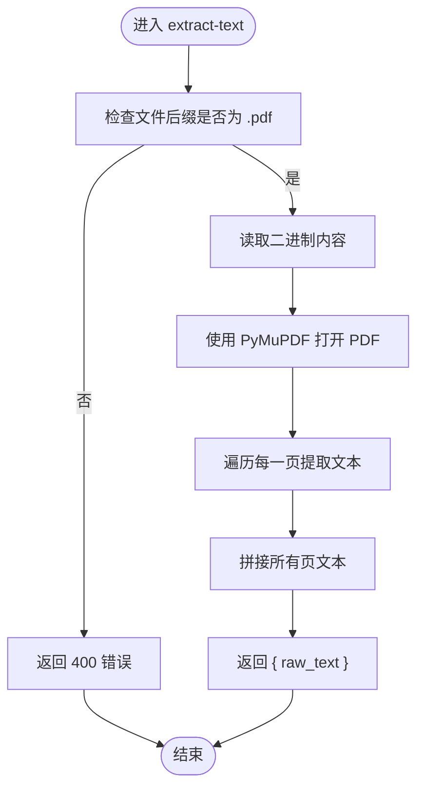
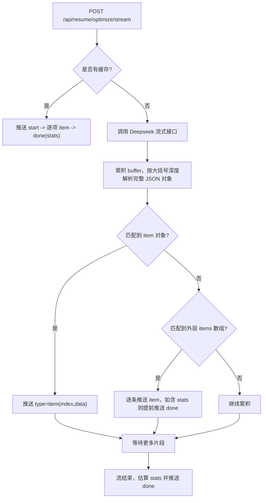
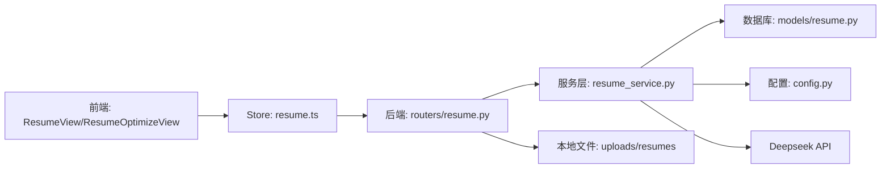

# 格式转换导出

<cite>
**本文引用的文件**   
- [backEnd/app/models/resume.py](file://backEnd/app/models/resume.py)
- [backEnd/app/routers/resume.py](file://backEnd/app/routers/resume.py)
- [backEnd/app/services/resume_service.py](file://backEnd/app/services/resume_service.py)
- [backEnd/app/schemas/resume.py](file://backEnd/app/schemas/resume.py)
- [backEnd/app/config.py](file://backEnd/app/config.py)
- [frontEnd/src/stores/resume.ts](file://frontEnd/src/stores/resume.ts)
- [frontEnd/src/views/ResumeView.vue](file://frontEnd/src/views/ResumeView.vue)
- [frontEnd/src/views/ResumeOptimizeView.vue](file://frontEnd/src/views/ResumeOptimizeView.vue)
</cite>

## 目录
1. [简介](#简介)
2. [项目结构](#项目结构)
3. [核心组件](#核心组件)
4. [架构总览](#架构总览)
5. [详细组件分析](#详细组件分析)
6. [依赖关系分析](#依赖关系分析)
7. [性能与扩展性](#性能与扩展性)
8. [故障排查指南](#故障排查指南)
9. [结论](#结论)
10. [附录：API 参考与开发指南](#附录api-参考与开发指南)

## 简介
本系统围绕“简历解析、AI 分析与优化”构建，当前已具备以下能力：
- 上传并解析 PDF/DOCX 简历文本（服务端提取 PDF 文本，前端解析 DOCX）
- AI 结构化提取（技能、经历、教育等）
- AI 措辞优化（支持同步与流式两种模式）
- 在线预览原始文件（PDF 在 iframe 中展示；DOCX 直接下载源文件）
- 实时预览优化结果（SSE 流式推送）

关于“输出格式（PDF/Word/HTML）、模板管理、样式定制、批量导出、水印、加密保护、自定义模板开发与 API 使用”，当前仓库未实现相关后端服务或前端入口。文档将明确标注这些能力的现状与可扩展建议，避免误导。

## 项目结构
与“格式转换导出”相关的代码主要分布在前后端如下模块：
- 后端模型与路由：简历数据模型、上传与分析接口、PDF 文本提取、优化接口
- 服务层：Deepseek API 调用、结构化提取与措辞优化逻辑
- 前端 Store：统一封装 API 请求、状态管理与 SSE 流处理
- 前端视图：上传、分析、优化、预览交互

图表来源
- [frontEnd/src/views/ResumeView.vue:1-530](file://frontEnd/src/views/ResumeView.vue#L1-L530)
- [frontEnd/src/views/ResumeOptimizeView.vue:1-277](file://frontEnd/src/views/ResumeOptimizeView.vue#L1-L277)
- [frontEnd/src/stores/resume.ts:1-244](file://frontEnd/src/stores/resume.ts#L1-L244)
- [backEnd/app/routers/resume.py:1-215](file://backEnd/app/routers/resume.py#L1-L215)
- [backEnd/app/services/resume_service.py:1-285](file://backEnd/app/services/resume_service.py#L1-L285)
- [backEnd/app/models/resume.py:1-67](file://backEnd/app/models/resume.py#L1-L67)
- [backEnd/app/schemas/resume.py:1-35](file://backEnd/app/schemas/resume.py#L1-L35)
- [backEnd/app/config.py:1-71](file://backEnd/app/config.py#L1-L71)

章节来源
- [backEnd/app/models/resume.py:1-67](file://backEnd/app/models/resume.py#L1-L67)
- [backEnd/app/routers/resume.py:1-215](file://backEnd/app/routers/resume.py#L1-L215)
- [backEnd/app/services/resume_service.py:1-285](file://backEnd/app/services/resume_service.py#L1-L285)
- [backEnd/app/schemas/resume.py:1-35](file://backEnd/app/schemas/resume.py#L1-L35)
- [backEnd/app/config.py:1-71](file://backEnd/app/config.py#L1-L71)
- [frontEnd/src/stores/resume.ts:1-244](file://frontEnd/src/stores/resume.ts#L1-L244)
- [frontEnd/src/views/ResumeView.vue:1-530](file://frontEnd/src/views/ResumeView.vue#L1-L530)
- [frontEnd/src/views/ResumeOptimizeView.vue:1-277](file://frontEnd/src/views/ResumeOptimizeView.vue#L1-L277)

## 核心组件
- 数据模型：存储用户简历的元信息、原始文本、结构化提取结果、优化缓存等
- 路由层：提供上传、分析、优化、PDF 文本提取等 REST 接口
- 服务层：封装 Deepseek API 调用、结构化提取与措辞优化（含流式）
- 前端 Store：统一封装请求、鉴权头、错误处理、SSE 流解析
- 前端视图：上传与拖拽、AI 分析触发、优化对比展示、原文预览与下载

章节来源
- [backEnd/app/models/resume.py:11-67](file://backEnd/app/models/resume.py#L11-L67)
- [backEnd/app/routers/resume.py:25-215](file://backEnd/app/routers/resume.py#L25-L215)
- [backEnd/app/services/resume_service.py:32-285](file://backEnd/app/services/resume_service.py#L32-L285)
- [frontEnd/src/stores/resume.ts:82-244](file://frontEnd/src/stores/resume.ts#L82-L244)
- [frontEnd/src/views/ResumeView.vue:62-351](file://frontEnd/src/views/ResumeView.vue#L62-L351)
- [frontEnd/src/views/ResumeOptimizeView.vue:38-142](file://frontEnd/src/views/ResumeOptimizeView.vue#L38-L142)

## 架构总览
整体采用前后端分离架构：前端通过 REST/SSE 与后端交互，后端基于 FastAPI 暴露接口，服务层调用外部 LLM 完成分析与优化，数据库持久化简历与中间结果。

图表来源
- [backEnd/app/routers/resume.py:47-192](file://backEnd/app/routers/resume.py#L47-L192)
- [backEnd/app/services/resume_service.py:141-285](file://backEnd/app/services/resume_service.py#L141-L285)
- [frontEnd/src/stores/resume.ts:114-207](file://frontEnd/src/stores/resume.ts#L114-L207)

## 详细组件分析

### 数据模型与存储
- 字段说明
  - 基础信息：id、user_id、file_name、file_path、raw_text
  - 结构化结果：parsed_content(JSON)、skill_keywords(JSON)
  - 优化缓存：optimized_content(JSON)，用于命中缓存快速返回
  - 时间戳：created_at、updated_at
- 约束与索引
  - user_id 唯一索引，保证每用户仅一条简历
  - file_path 可选，指向本地 uploads/resumes 下的相对路径

章节来源
- [backEnd/app/models/resume.py:11-67](file://backEnd/app/models/resume.py#L11-L67)

### 路由与接口
- GET /api/resume/config：获取是否配置了 Deepseek API Key
- GET /api/resume：获取当前用户的简历
- POST /api/resume/upload：上传简历（支持 PDF/DOCX），自动保存 raw_text，若配置了 API Key 且提供了 raw_text，则尝试结构化提取
- POST /api/resume/analyze：手动触发结构化提取
- POST /api/resume/optimize：同步优化（优先返回缓存）
- POST /api/resume/optimize/stream：SSE 流式优化（边生成边推送）
- POST /api/resume/extract-text：服务端提取 PDF 文本（PyMuPDF）

章节来源
- [backEnd/app/routers/resume.py:25-215](file://backEnd/app/routers/resume.py#L25-L215)

### 服务层与 AI 集成
- 结构化提取：构造提示词，调用 Deepseek 返回 JSON，包含技能、经历、教育、评分与建议等
- 措辞优化：同步与流式两种模式，流式模式下按大括号深度解析完整 JSON 对象，逐条推送 item 与 done 事件
- 缓存策略：优化结果写入 optimized_content，后续请求命中缓存直接返回

章节来源
- [backEnd/app/services/resume_service.py:86-285](file://backEnd/app/services/resume_service.py#L86-L285)

### 前端 Store 与交互
- 统一请求封装：自动注入 Authorization 头，错误时抛出带 detail 的错误消息
- 上传流程：根据文件类型选择后端 PDF 文本提取或前端 mammoth 解析 DOCX
- 流式优化：解析 SSE data: 行，分发 start/item/done 回调，驱动界面增量渲染
- 预览与下载：PDF 通过 iframe 展示；DOCX 直接下载源文件并显示 Toast

章节来源
- [frontEnd/src/stores/resume.ts:63-244](file://frontEnd/src/stores/resume.ts#L63-L244)
- [frontEnd/src/views/ResumeView.vue:414-519](file://frontEnd/src/views/ResumeView.vue#L414-L519)
- [frontEnd/src/views/ResumeOptimizeView.vue:215-260](file://frontEnd/src/views/ResumeOptimizeView.vue#L215-L260)

### 关键流程图：PDF 文本提取与服务端解析

图表来源
- [backEnd/app/routers/resume.py:195-215](file://backEnd/app/routers/resume.py#L195-L215)

### 关键流程图：流式优化（SSE）

图表来源
- [backEnd/app/services/resume_service.py:186-285](file://backEnd/app/services/resume_service.py#L186-L285)
- [backEnd/app/routers/resume.py:140-192](file://backEnd/app/routers/resume.py#L140-L192)

## 依赖关系分析
- 前端依赖
  - Vue 3 + TypeScript + Pinia
  - 第三方库：mammoth（DOCX 文本提取）、pdfjs-dist（类型声明，实际未在前端使用）
- 后端依赖
  - FastAPI + SQLAlchemy Async + Pydantic v2
  - httpx（异步 HTTP 客户端）
  - PyMuPDF（服务端 PDF 文本提取）
  - Deepseek API（结构化提取与措辞优化）

图表来源
- [frontEnd/src/views/ResumeView.vue:1-530](file://frontEnd/src/views/ResumeView.vue#L1-L530)
- [frontEnd/src/views/ResumeOptimizeView.vue:1-277](file://frontEnd/src/views/ResumeOptimizeView.vue#L1-L277)
- [frontEnd/src/stores/resume.ts:1-244](file://frontEnd/src/stores/resume.ts#L1-L244)
- [backEnd/app/routers/resume.py:1-215](file://backEnd/app/routers/resume.py#L1-L215)
- [backEnd/app/services/resume_service.py:1-285](file://backEnd/app/services/resume_service.py#L1-L285)
- [backEnd/app/models/resume.py:1-67](file://backEnd/app/models/resume.py#L1-L67)
- [backEnd/app/config.py:1-71](file://backEnd/app/config.py#L1-L71)

章节来源
- [backEnd/app/config.py:34-37](file://backEnd/app/config.py#L34-L37)
- [backEnd/app/routers/resume.py:1-215](file://backEnd/app/routers/resume.py#L1-L215)
- [frontEnd/src/stores/resume.ts:1-244](file://frontEnd/src/stores/resume.ts#L1-L244)

## 性能与扩展性
- 流式优化体验
  - 服务端按完整 JSON 对象切分推送，减少前端解析复杂度
  - 首次 item 到达即关闭加载弹窗，提升感知速度
- 缓存命中
  - 优化结果持久化，重复请求直接返回，降低 LLM 调用成本
- 文本提取
  - PDF 在服务端使用 PyMuPDF 提取，比前端 pdf.js 更稳定
- 可扩展点
  - 增加 HTML/PDF/Word 导出服务（见附录）
  - 引入模板引擎与样式配置中心
  - 增加批量导出任务队列与进度查询接口
  - 增加水印与加密参数传递与落盘策略

[本节为通用指导，不直接分析具体文件]

## 故障排查指南
- 未配置 Deepseek API Key
  - 现象：分析/优化接口返回 400，提示未配置 API Key
  - 定位：查看后端配置 deepseek_api_key 是否设置
  - 参考：[backEnd/app/services/resume_service.py:28-29](file://backEnd/app/services/resume_service.py#L28-L29)
- PDF 文本提取失败
  - 现象：返回 500，detail 中包含异常信息
  - 定位：确认文件为 PDF，检查 PyMuPDF 版本与环境
  - 参考：[backEnd/app/routers/resume.py:195-215](file://backEnd/app/routers/resume.py#L195-L215)
- 流式优化无数据或中断
  - 现象：前端长时间无 item 推送或连接断开
  - 定位：检查网络、SSE 解析逻辑、后端 buffer 解析是否正确
  - 参考：[frontEnd/src/stores/resume.ts:161-207](file://frontEnd/src/stores/resume.ts#L161-L207), [backEnd/app/services/resume_service.py:186-285](file://backEnd/app/services/resume_service.py#L186-L285)
- DOCX 无法解析
  - 现象：前端报错“不支持的文件格式”或解析为空
  - 定位：确认文件后缀为 .docx，检查 mammoth 解析结果
  - 参考：[frontEnd/src/views/ResumeView.vue:414-427](file://frontEnd/src/views/ResumeView.vue#L414-L427)

章节来源
- [backEnd/app/services/resume_service.py:28-29](file://backEnd/app/services/resume_service.py#L28-L29)
- [backEnd/app/routers/resume.py:195-215](file://backEnd/app/routers/resume.py#L195-L215)
- [frontEnd/src/stores/resume.ts:161-207](file://frontEnd/src/stores/resume.ts#L161-L207)
- [frontEnd/src/views/ResumeView.vue:414-427](file://frontEnd/src/views/ResumeView.vue#L414-L427)

## 结论
当前系统已实现简历上传、结构化提取与措辞优化的核心闭环，并提供良好的实时预览体验。尚未实现“多格式导出、模板管理、样式定制、批量导出、水印与加密”等企业级特性。建议在现有架构基础上，新增导出服务与模板子系统，保持与现有数据模型和 API 风格一致。

[本节为总结性内容，不直接分析具体文件]

## 附录：API 参考与开发指南

### 已实现的 API 清单
- GET /api/resume/config
  - 功能：获取是否配置了 Deepseek API Key
  - 鉴权：需要登录态
  - 参考：[backEnd/app/routers/resume.py:25-32](file://backEnd/app/routers/resume.py#L25-L32)
- GET /api/resume
  - 功能：获取当前用户简历
  - 鉴权：需要登录态
  - 参考：[backEnd/app/routers/resume.py:35-44](file://backEnd/app/routers/resume.py#L35-L44)
- POST /api/resume/upload
  - 功能：上传简历（PDF/DOCX），保存 raw_text，可选触发结构化提取
  - 表单字段：file、raw_text
  - 鉴权：需要登录态
  - 参考：[backEnd/app/routers/resume.py:47-77](file://backEnd/app/routers/resume.py#L47-L77)
- POST /api/resume/analyze
  - 功能：手动触发结构化提取
  - 鉴权：需要登录态
  - 参考：[backEnd/app/routers/resume.py:80-98](file://backEnd/app/routers/resume.py#L80-L98)
- POST /api/resume/optimize
  - 功能：同步优化（优先返回缓存）
  - 鉴权：需要登录态
  - 参考：[backEnd/app/routers/resume.py:100-137](file://backEnd/app/routers/resume.py#L100-L137)
- POST /api/resume/optimize/stream
  - 功能：SSE 流式优化
  - 事件类型：start、item、done
  - 鉴权：需要登录态
  - 参考：[backEnd/app/routers/resume.py:140-192](file://backEnd/app/routers/resume.py#L140-L192)
- POST /api/resume/extract-text
  - 功能：服务端提取 PDF 文本
  - 表单字段：file（仅 .pdf）
  - 鉴权：需要登录态
  - 参考：[backEnd/app/routers/resume.py:195-215](file://backEnd/app/routers/resume.py#L195-L215)

章节来源
- [backEnd/app/routers/resume.py:25-215](file://backEnd/app/routers/resume.py#L25-L215)

### 前端使用要点
- 上传与解析
  - PDF：调用 extractPdfText 走后端 PyMuPDF 提取
  - DOCX：使用 mammoth 在前端提取 raw_text
  - 参考：[frontEnd/src/views/ResumeView.vue:414-427](file://frontEnd/src/views/ResumeView.vue#L414-L427)
- 流式优化
  - 使用 optimizeTextStream，监听 onItem/onDone/onStart 回调
  - 参考：[frontEnd/src/stores/resume.ts:161-207](file://frontEnd/src/stores/resume.ts#L161-L207)
- 预览与下载
  - PDF：iframe 内嵌展示
  - DOCX：直接下载源文件
  - 参考：[frontEnd/src/views/ResumeView.vue:498-519](file://frontEnd/src/views/ResumeView.vue#L498-L519)

章节来源
- [frontEnd/src/views/ResumeView.vue:414-519](file://frontEnd/src/views/ResumeView.vue#L414-L519)
- [frontEnd/src/stores/resume.ts:161-207](file://frontEnd/src/stores/resume.ts#L161-L207)

### 企业级特性扩展建议（当前未实现）
- 输出格式（PDF/Word/HTML）
  - 建议新增导出服务，接收结构化数据与模板 ID，渲染后返回文件流
  - 可复用现有 uploaded 文件路径作为素材
- 模板管理系统
  - 新增模板表（模板名、布局、样式变量、占位符映射）
  - 提供模板 CRUD 与版本管理接口
- 样式定制
  - 支持主题色、字体、页眉页脚、页码等配置项
- 批量导出
  - 引入任务队列，提交批量任务，提供进度查询与结果下载
- 水印与加密
  - 在导出服务中叠加水印（文字/图片），对 PDF 添加密码保护
- 自定义模板开发指南
  - 定义模板 DSL（JSON/YAML）描述结构与样式
  - 提供 SDK 或 CLI 工具校验模板语法与占位符
- 与现有 API 的集成
  - 在 /api/resume 下新增 /export 系列接口，复用鉴权与上下文
  - 导出结果以文件流形式返回，文件名包含时间戳与模板标识

[本节为概念性扩展建议，不直接分析具体文件]