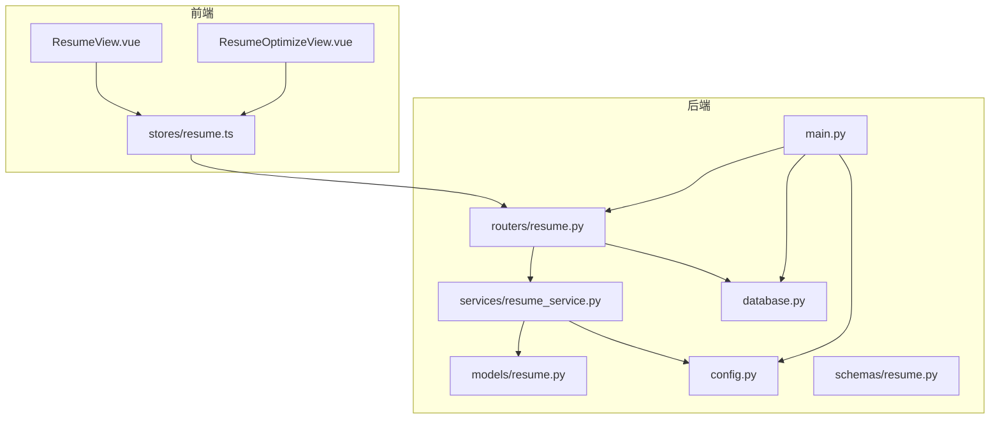
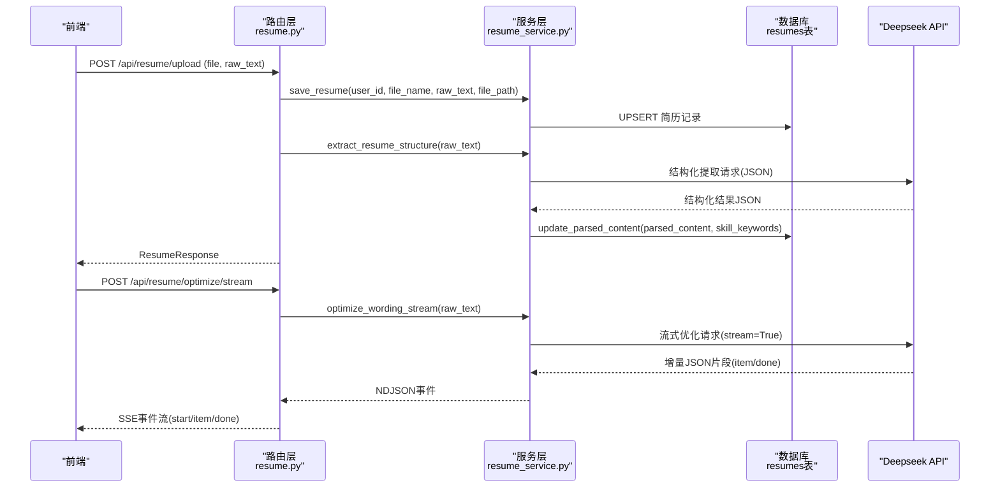
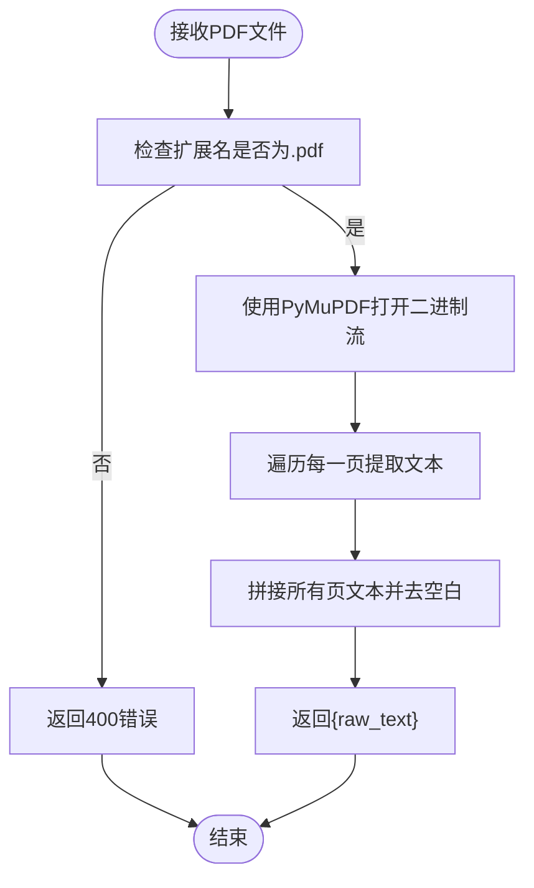
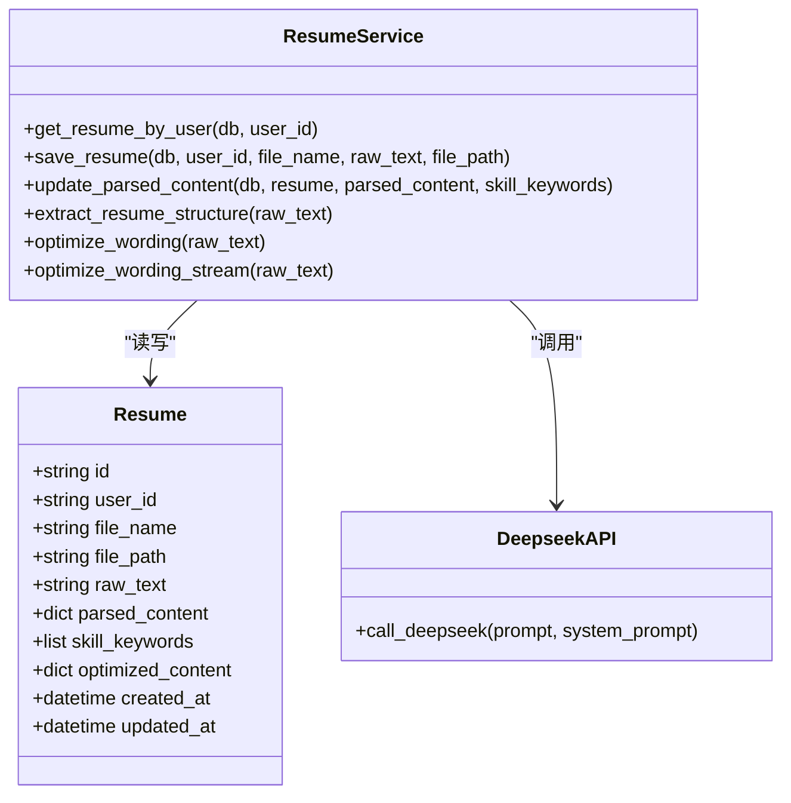
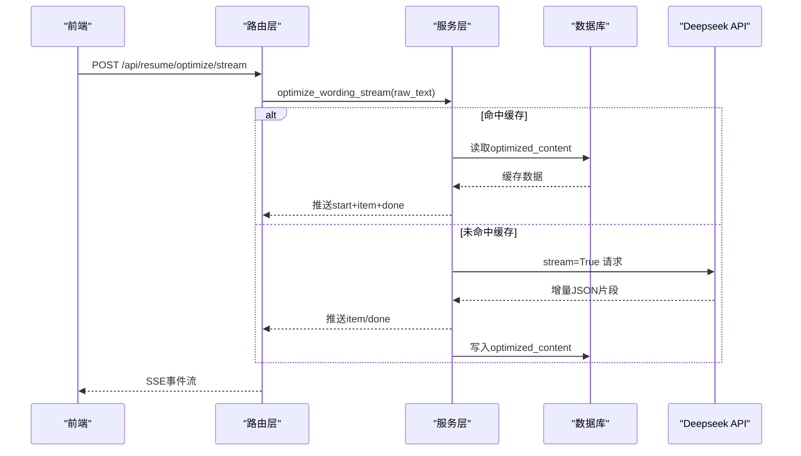
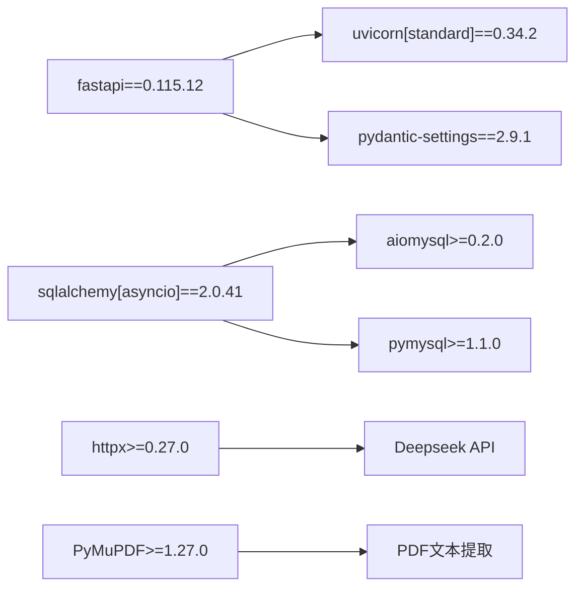

# 简历优化服务

<cite>
**本文引用的文件列表**
- [backEnd/app/main.py](file://backEnd/app/main.py)
- [backEnd/app/config.py](file://backEnd/app/config.py)
- [backEnd/app/database.py](file://backEnd/app/database.py)
- [backEnd/app/models/resume.py](file://backEnd/app/models/resume.py)
- [backEnd/app/routers/resume.py](file://backEnd/app/routers/resume.py)
- [backEnd/app/services/resume_service.py](file://backEnd/app/services/resume_service.py)
- [backEnd/app/schemas/resume.py](file://backEnd/app/schemas/resume.py)
- [frontEnd/src/views/ResumeView.vue](file://frontEnd/src/views/ResumeView.vue)
- [frontEnd/src/views/ResumeOptimizeView.vue](file://frontEnd/src/views/ResumeOptimizeView.vue)
- [frontEnd/src/stores/resume.ts](file://frontEnd/src/stores/resume.ts)
- [backEnd/requirements.txt](file://backEnd/requirements.txt)
</cite>

## 目录
1. [简介](#简介)
2. [项目结构](#项目结构)
3. [核心组件](#核心组件)
4. [架构总览](#架构总览)
5. [详细组件分析](#详细组件分析)
6. [依赖关系分析](#依赖关系分析)
7. [性能与扩展性](#性能与扩展性)
8. [故障排查指南](#故障排查指南)
9. [结论](#结论)
10. [附录：配置与自定义规则](#附录配置与自定义规则)

## 简介
本服务面向企业级场景，提供简历上传、PDF 文本解析、AI 结构化提取、措辞优化建议生成、关键词匹配与可视化展示、以及文件下载等能力。后端基于 FastAPI + SQLAlchemy 异步 ORM，前端采用 Vue 3 + Pinia，通过 SSE 流式输出优化结果，提升用户体验。系统支持 Deepseek API 进行智能分析与优化，并提供可扩展的提示词与缓存机制，便于后续接入更多 AI 能力或替换模型。

## 项目结构
- 后端（FastAPI）
  - 路由层：RESTful 接口定义与请求校验
  - 服务层：业务逻辑、数据库操作、外部 API 调用
  - 数据模型：SQLAlchemy 异步模型与 JSON 字段
  - 配置与环境变量：Pydantic Settings 管理
  - 静态资源：uploads 目录挂载为静态文件服务
- 前端（Vue 3 + TypeScript）
  - 页面：简历上传与分析、措辞优化对比视图
  - Store：统一状态管理与 API 封装
  - 工具：PDF/DOCX 文本提取、SSE 流处理

图表来源
- [backEnd/app/main.py:44-73](file://backEnd/app/main.py#L44-L73)
- [backEnd/app/routers/resume.py:19-215](file://backEnd/app/routers/resume.py#L19-L215)
- [backEnd/app/services/resume_service.py:1-285](file://backEnd/app/services/resume_service.py#L1-L285)
- [backEnd/app/models/resume.py:11-67](file://backEnd/app/models/resume.py#L11-L67)
- [backEnd/app/config.py:7-71](file://backEnd/app/config.py#L7-L71)
- [backEnd/app/database.py:31-58](file://backEnd/app/database.py#L31-L58)
- [backEnd/app/schemas/resume.py:18-35](file://backEnd/app/schemas/resume.py#L18-L35)
- [frontEnd/src/views/ResumeView.vue:1-530](file://frontEnd/src/views/ResumeView.vue#L1-L530)
- [frontEnd/src/views/ResumeOptimizeView.vue:1-277](file://frontEnd/src/views/ResumeOptimizeView.vue#L1-L277)
- [frontEnd/src/stores/resume.ts:1-244](file://frontEnd/src/stores/resume.ts#L1-L244)

章节来源
- [backEnd/app/main.py:44-73](file://backEnd/app/main.py#L44-L73)
- [backEnd/app/routers/resume.py:19-215](file://backEnd/app/routers/resume.py#L19-L215)
- [backEnd/app/services/resume_service.py:1-285](file://backEnd/app/services/resume_service.py#L1-L285)
- [backEnd/app/models/resume.py:11-67](file://backEnd/app/models/resume.py#L11-L67)
- [backEnd/app/config.py:7-71](file://backEnd/app/config.py#L7-L71)
- [backEnd/app/database.py:31-58](file://backEnd/app/database.py#L31-L58)
- [backEnd/app/schemas/resume.py:18-35](file://backEnd/app/schemas/resume.py#L18-L35)
- [frontEnd/src/views/ResumeView.vue:1-530](file://frontEnd/src/views/ResumeView.vue#L1-L530)
- [frontEnd/src/views/ResumeOptimizeView.vue:1-277](file://frontEnd/src/views/ResumeOptimizeView.vue#L1-L277)
- [frontEnd/src/stores/resume.ts:1-244](file://frontEnd/src/stores/resume.ts#L1-L244)

## 核心组件
- 路由层
  - 提供简历上传、结构化分析、措辞优化（同步/流式）、PDF 文本提取、配置查询等接口
- 服务层
  - 封装 CRUD、Deepseek API 调用、结构化提取与措辞优化逻辑、流式解析与缓存写入
- 数据模型
  - 使用 JSON 字段存储结构化提取结果、技能关键词、优化缓存
- 前端视图与状态
  - 上传与解析流程、结构化报告展示、优化前后 Diff 对比、SSE 流式渲染

章节来源
- [backEnd/app/routers/resume.py:25-215](file://backEnd/app/routers/resume.py#L25-L215)
- [backEnd/app/services/resume_service.py:32-84](file://backEnd/app/services/resume_service.py#L32-L84)
- [backEnd/app/models/resume.py:11-67](file://backEnd/app/models/resume.py#L11-L67)
- [frontEnd/src/views/ResumeView.vue:414-528](file://frontEnd/src/views/ResumeView.vue#L414-L528)
- [frontEnd/src/views/ResumeOptimizeView.vue:215-260](file://frontEnd/src/views/ResumeOptimizeView.vue#L215-L260)
- [frontEnd/src/stores/resume.ts:114-225](file://frontEnd/src/stores/resume.ts#L114-L225)

## 架构总览
整体采用前后端分离架构，后端以 REST 暴露能力，前端通过 fetch 与 SSE 交互；PDF 文本在服务端使用 PyMuPDF 提取，确保稳定性；AI 能力通过 httpx 调用 Deepseek API，返回 JSON 并持久化到数据库；优化结果具备缓存与流式推送能力。

图表来源
- [backEnd/app/routers/resume.py:47-98](file://backEnd/app/routers/resume.py#L47-L98)
- [backEnd/app/services/resume_service.py:174-184](file://backEnd/app/services/resume_service.py#L174-L184)
- [backEnd/app/services/resume_service.py:186-285](file://backEnd/app/services/resume_service.py#L186-L285)
- [backEnd/app/models/resume.py:41-55](file://backEnd/app/models/resume.py#L41-L55)

## 详细组件分析

### PDF 文本解析引擎
- 实现原理
  - 前端选择 PDF 后，调用服务端接口 /api/resume/extract-text
  - 后端使用 PyMuPDF 打开二进制流，逐页提取文本并拼接
  - 返回纯文本供后续上传与 AI 分析使用
- 关键路径
  - 路由：POST /api/resume/extract-text
  - 服务：无直接调用，路由内完成解析
- 错误处理
  - 非 PDF 格式拒绝
  - 解析异常返回 500 与错误详情
- 复杂度
  - 时间复杂度 O(N)，N 为 PDF 页数；空间复杂度取决于文本大小

图表来源
- [backEnd/app/routers/resume.py:195-215](file://backEnd/app/routers/resume.py#L195-L215)

章节来源
- [backEnd/app/routers/resume.py:195-215](file://backEnd/app/routers/resume.py#L195-L215)
- [backEnd/requirements.txt:22-23](file://backEnd/requirements.txt#L22-L23)

### 文本内容智能提取算法（结构化信息）
- 实现原理
  - 将原始文本注入 EXTRACT_PROMPT，调用 Deepseek API
  - 返回 JSON 包含技能、经历、教育、总结、评分、建议、技能分类等
  - 更新数据库 parsed_content 与 skill_keywords 字段
- 关键路径
  - 路由：POST /api/resume/analyze
  - 服务：extract_resume_structure -> call_deepseek
- 数据结构
  - skills: 字符串数组
  - experiences: 角色、公司、时间段、时长、描述
  - education: 学校、学历专业、时间段
  - summary/score/suggestions/skill_categories
- 错误处理
  - API Key 未配置时返回 400
  - 调用失败返回 500 并附带错误信息

图表来源
- [backEnd/app/models/resume.py:11-67](file://backEnd/app/models/resume.py#L11-L67)
- [backEnd/app/services/resume_service.py:32-84](file://backEnd/app/services/resume_service.py#L32-L84)
- [backEnd/app/services/resume_service.py:141-178](file://backEnd/app/services/resume_service.py#L141-L178)

章节来源
- [backEnd/app/routers/resume.py:80-98](file://backEnd/app/routers/resume.py#L80-L98)
- [backEnd/app/services/resume_service.py:88-113](file://backEnd/app/services/resume_service.py#L88-L113)
- [backEnd/app/services/resume_service.py:174-178](file://backEnd/app/services/resume_service.py#L174-L178)
- [backEnd/app/models/resume.py:41-55](file://backEnd/app/models/resume.py#L41-L55)

### 简历格式转换导出功能
- 当前能力
  - 上传阶段自动保存原始文件到 uploads/resumes，并通过静态文件服务暴露
  - 前端在查看“简历原文”时：
    - Word 文件：直接下载原文件
    - PDF 文件：通过 iframe 在线预览
- 扩展建议
  - 增加服务端导出为 Markdown/HTML/PDF 的能力
  - 引入模板引擎与样式控制，实现排版美化与品牌化导出
  - 支持批量导出与版本归档

章节来源
- [backEnd/app/main.py:70-73](file://backEnd/app/main.py#L70-L73)
- [frontEnd/src/views/ResumeView.vue:498-519](file://frontEnd/src/views/ResumeView.vue#L498-L519)

### AI 驱动的简历内容优化建议生成
- 实现原理
  - 同步接口 /api/resume/optimize：优先返回缓存，否则调用 Deepseek 生成优化项与统计
  - 流式接口 /api/resume/optimize/stream：SSE 推送 item 与 done 事件，前端实时渲染
  - 优化结果缓存至 optimized_content，避免重复计算
- 关键路径
  - 路由：POST /api/resume/optimize 与 /api/resume/optimize/stream
  - 服务：optimize_wording 与 optimize_wording_stream
- 数据结构
  - items: original/optimized 对
  - stats: total_optimized/professionalism_improvement/quantified_metrics_added/overall_rating
- 错误处理
  - API Key 未配置返回 400
  - 调用失败返回 500 并附带错误信息

图表来源
- [backEnd/app/routers/resume.py:100-192](file://backEnd/app/routers/resume.py#L100-L192)
- [backEnd/app/services/resume_service.py:180-285](file://backEnd/app/services/resume_service.py#L180-L285)
- [backEnd/app/models/resume.py:51-55](file://backEnd/app/models/resume.py#L51-L55)

章节来源
- [backEnd/app/routers/resume.py:100-192](file://backEnd/app/routers/resume.py#L100-L192)
- [backEnd/app/services/resume_service.py:180-285](file://backEnd/app/services/resume_service.py#L180-L285)
- [frontEnd/src/views/ResumeOptimizeView.vue:215-260](file://frontEnd/src/views/ResumeOptimizeView.vue#L215-L260)
- [frontEnd/src/stores/resume.ts:161-207](file://frontEnd/src/stores/resume.ts#L161-L207)

### 关键词匹配分析与可视化
- 数据来源
  - 结构化提取结果中的 skills 与 skill_categories
- 前端展示
  - 技能词云、技能分布进度条、改进建议卡片
- 扩展方向
  - 结合岗位 JD 进行关键词匹配度打分
  - 动态权重与行业术语库增强

章节来源
- [frontEnd/src/views/ResumeView.vue:136-284](file://frontEnd/src/views/ResumeView.vue#L136-L284)
- [backEnd/app/services/resume_service.py:88-113](file://backEnd/app/services/resume_service.py#L88-L113)

### 文件上传下载管理
- 上传
  - 支持 PDF/DOCX，前端根据扩展名选择服务端 PDF 提取或本地 DOCX 提取
  - 上传成功后覆盖用户简历记录，并触发可选的结构化分析
- 下载
  - Word 文件直接下载原文件
  - PDF 文件通过静态文件服务在线预览
- 安全与校验
  - 仅允许 PDF 用于服务端文本提取
  - 自定义验证错误处理器避免二进制内容导致解码异常

章节来源
- [frontEnd/src/views/ResumeView.vue:414-490](file://frontEnd/src/views/ResumeView.vue#L414-L490)
- [frontEnd/src/stores/resume.ts:114-135](file://frontEnd/src/stores/resume.ts#L114-L135)
- [backEnd/app/routers/resume.py:47-77](file://backEnd/app/routers/resume.py#L47-L77)
- [backEnd/app/main.py:76-84](file://backEnd/app/main.py#L76-L84)

### 版本控制与批量处理（企业级能力）
- 现状
  - 当前每用户只保留一条简历记录（user_id 唯一），不支持历史版本
- 建议方案
  - 引入版本字段与版本号，支持多版本并存与回滚
  - 增加批量上传与批处理任务队列（Celery/RQ），支持异步解析与优化
  - 审计日志与权限控制，满足企业合规需求

[本节为概念性建议，不直接分析具体文件]

## 依赖关系分析
- 后端依赖
  - FastAPI、Uvicorn、Pydantic Settings
  - SQLAlchemy 异步 ORM、aiomysql/pymysql、Alembic
  - httpx 调用 Deepseek API
  - PyMuPDF 解析 PDF
- 前端依赖
  - Vue 3、Pinia、TypeScript
  - mammoth 解析 DOCX（按需导入）
  - Fetch/SSE 原生 API

图表来源
- [backEnd/requirements.txt:1-27](file://backEnd/requirements.txt#L1-L27)

章节来源
- [backEnd/requirements.txt:1-27](file://backEnd/requirements.txt#L1-L27)

## 性能与扩展性
- 性能要点
  - 优化结果缓存减少重复 AI 调用
  - SSE 流式输出降低首屏等待时间
  - 数据库连接池与预检 ping 提升稳定性
- 扩展点
  - 可插拔的 AI 提供商（通过 config 切换 URL/Model）
  - 提示词工程（EXTRACT_PROMPT/OPTIMIZE_PROMPT）
  - 导出模块（Markdown/HTML/PDF）
  - 任务队列与批量处理

章节来源
- [backEnd/app/services/resume_service.py:186-285](file://backEnd/app/services/resume_service.py#L186-L285)
- [backEnd/app/database.py:31-58](file://backEnd/app/database.py#L31-L58)

## 故障排查指南
- 常见错误
  - 未配置 API Key：路由层返回 400，请检查 .env 中 DEEPSEEK_API_KEY
  - PDF 文本提取失败：检查文件格式与 PyMuPDF 安装
  - 优化失败：检查网络连通性与 Deepseek API 可用性
- 定位方法
  - 查看路由层异常返回 detail 字段
  - 检查服务层日志与 HTTP 响应码
  - 确认数据库连接与表结构是否正确初始化

章节来源
- [backEnd/app/routers/resume.py:89-97](file://backEnd/app/routers/resume.py#L89-L97)
- [backEnd/app/routers/resume.py:106-137](file://backEnd/app/routers/resume.py#L106-L137)
- [backEnd/app/routers/resume.py:200-214](file://backEnd/app/routers/resume.py#L200-L214)

## 结论
该简历优化服务实现了从上传、解析、结构化提取到措辞优化的完整链路，具备良好的用户体验与企业级扩展潜力。通过缓存与流式输出提升了性能，同时提供了清晰的扩展点以便接入更多 AI 能力与导出功能。建议在后续迭代中完善版本控制、批量处理与导出模块，以满足更复杂的企业场景。

## 附录：配置与自定义规则

### 配置文件与环境变量
- 位置与加载
  - 使用 Pydantic Settings 从 .env 加载配置
- 关键配置项
  - deepseek_api_key：Deepseek API 密钥
  - deepseek_api_url：API 基础地址
  - deepseek_model：使用的模型名称
  - cors_origins：跨域白名单
  - 数据库连接参数（host/port/user/password/name）

章节来源
- [backEnd/app/config.py:7-71](file://backEnd/app/config.py#L7-L71)

### 自定义优化规则与提示词工程
- 结构化提取提示词
  - 调整 EXTRACT_PROMPT 以改变输出结构与评分策略
- 措辞优化提示词
  - 调整 OPTIMIZE_PROMPT 以控制优化风格与量化指标要求
- 流式解析策略
  - 优化 optimize_wording_stream 的 JSON 对象识别逻辑，适配不同模型输出格式

章节来源
- [backEnd/app/services/resume_service.py:88-138](file://backEnd/app/services/resume_service.py#L88-L138)
- [backEnd/app/services/resume_service.py:186-285](file://backEnd/app/services/resume_service.py#L186-L285)

### 文件解析器配置与扩展
- PDF 解析器
  - 使用 PyMuPDF，可在路由层替换为其他解析库
- DOCX 解析器
  - 前端使用 mammoth 提取文本，如需服务端解析可新增对应接口
- 扩展建议
  - 抽象解析器接口，支持插件化与多格式并行解析
  - 增加解析质量评估与重试机制

章节来源
- [backEnd/app/routers/resume.py:195-215](file://backEnd/app/routers/resume.py#L195-L215)
- [frontEnd/src/views/ResumeView.vue:414-427](file://frontEnd/src/views/ResumeView.vue#L414-L427)