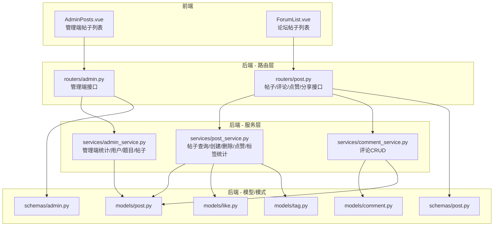
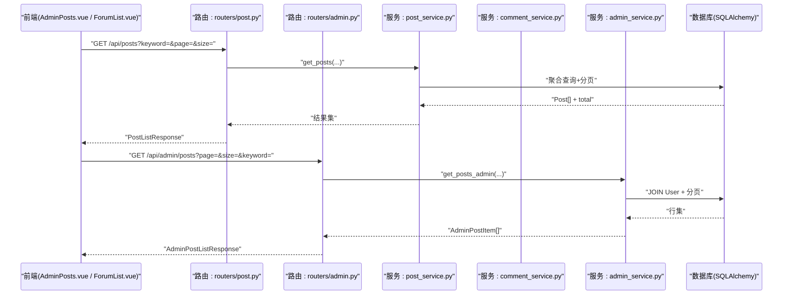
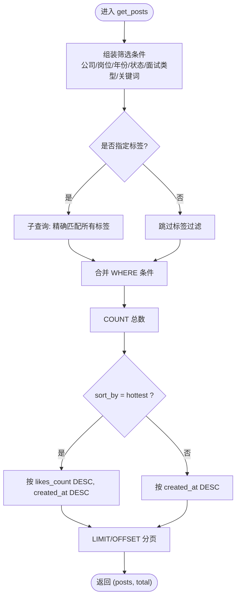
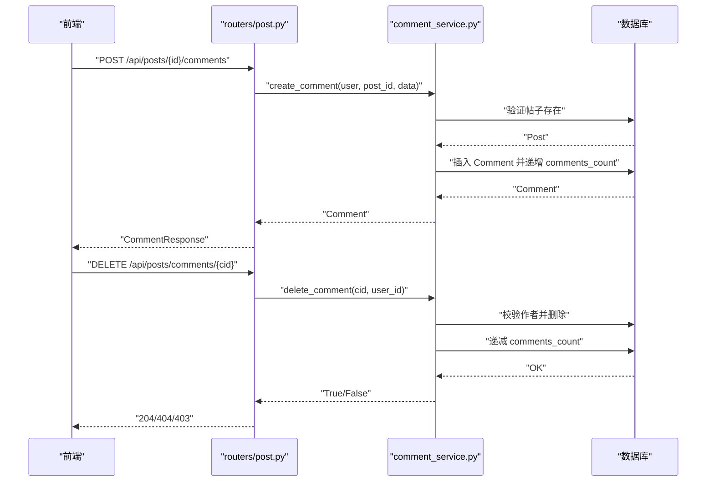
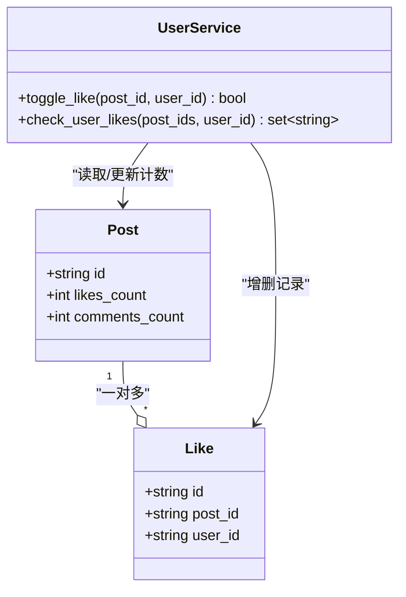
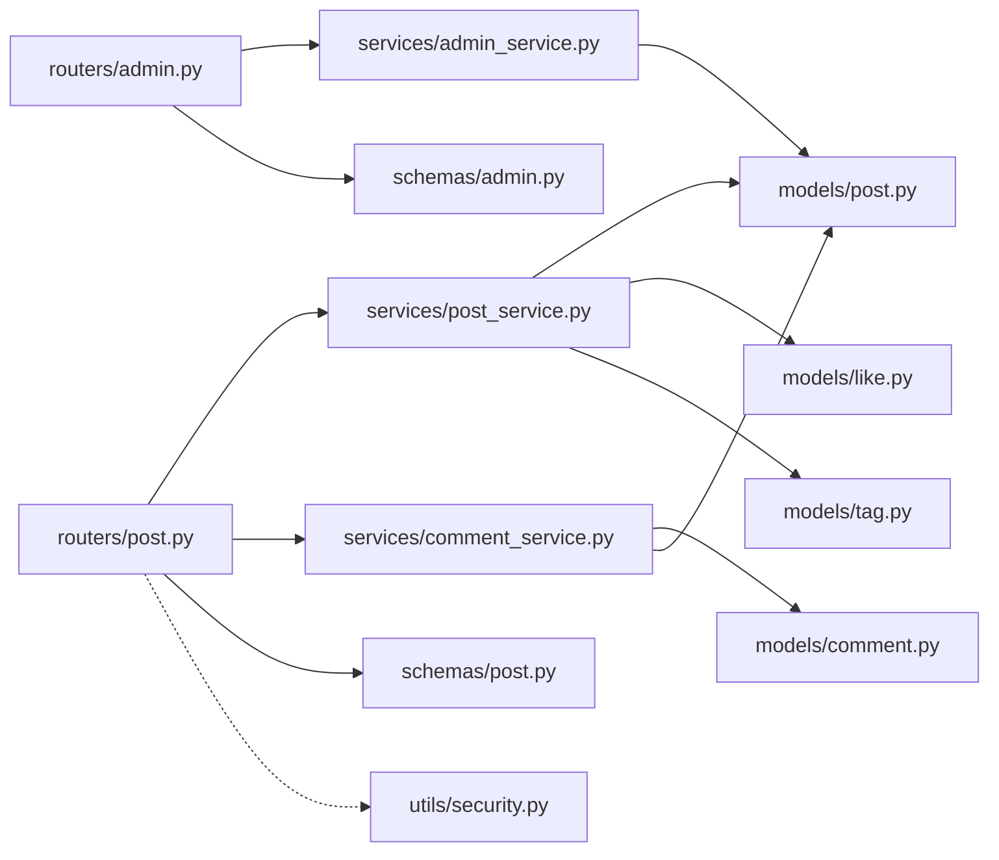
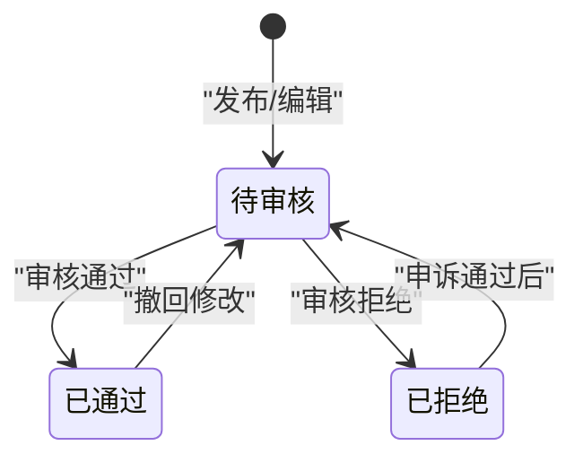

# 内容审核

<cite>
**本文引用的文件**
- [post.py](file://backEnd/app/models/post.py)
- [comment.py](file://backEnd/app/models/comment.py)
- [like.py](file://backEnd/app/models/like.py)
- [tag.py](file://backEnd/app/models/tag.py)
- [post.py](file://backEnd/app/routers/post.py)
- [admin.py](file://backEnd/app/routers/admin.py)
- [post_service.py](file://backEnd/app/services/post_service.py)
- [comment_service.py](file://backEnd/app/services/comment_service.py)
- [admin_service.py](file://backEnd/app/services/admin_service.py)
- [post.py](file://backEnd/app/schemas/post.py)
- [admin.py](file://backEnd/app/schemas/admin.py)
- [security.py](file://backEnd/app/utils/security.py)
- [AdminPosts.vue](file://frontEnd/src/views/admin/AdminPosts.vue)
- [ForumList.vue](file://frontEnd/src/components/forum/ForumList.vue)
</cite>

## 目录
1. [简介](#简介)
2. [项目结构](#项目结构)
3. [核心组件](#核心组件)
4. [架构总览](#架构总览)
5. [详细组件分析](#详细组件分析)
6. [依赖关系分析](#依赖关系分析)
7. [性能与可扩展性](#性能与可扩展性)
8. [安全与合规](#安全与合规)
9. [故障排查指南](#故障排查指南)
10. [结论](#结论)
11. [附录：API 参考](#附录api-参考)

## 简介
本文件面向“内容审核系统”的开发者与维护者，围绕帖子管理、评论互动、标签统计、分页筛选、状态管理等核心能力进行系统化说明。文档同时给出可落地的审核策略建议（敏感词检测、人工审核、自动过滤），并补充备份恢复、操作日志与审计追踪等安全特性设计思路，帮助构建健康的内容生态管理平台。

## 项目结构
后端采用 FastAPI + SQLAlchemy 异步 ORM，分层清晰：routers 暴露 HTTP API，services 封装业务逻辑，models 定义数据模型，schemas 定义请求/响应结构；前端使用 Vue 3 组件组织论坛与管理后台页面。

图表来源
- [post.py:1-249](file://backEnd/app/routers/post.py#L1-L249)
- [admin.py:1-198](file://backEnd/app/routers/admin.py#L1-L198)
- [post_service.py:1-249](file://backEnd/app/services/post_service.py#L1-L249)
- [comment_service.py:1-105](file://backEnd/app/services/comment_service.py#L1-L105)
- [admin_service.py:1-224](file://backEnd/app/services/admin_service.py#L1-L224)
- [post.py:1-65](file://backEnd/app/models/post.py#L1-L65)
- [comment.py:1-53](file://backEnd/app/models/comment.py#L1-L53)
- [like.py:1-47](file://backEnd/app/models/like.py#L1-L47)
- [tag.py:1-46](file://backEnd/app/models/tag.py#L1-L46)
- [post.py:1-91](file://backEnd/app/schemas/post.py#L1-L91)
- [admin.py:1-123](file://backEnd/app/schemas/admin.py#L1-L123)
- [AdminPosts.vue:1-151](file://frontEnd/src/views/admin/AdminPosts.vue#L1-L151)
- [ForumList.vue:1-259](file://frontEnd/src/components/forum/ForumList.vue#L1-L259)

章节来源
- [post.py:1-249](file://backEnd/app/routers/post.py#L1-L249)
- [admin.py:1-198](file://backEnd/app/routers/admin.py#L1-L198)
- [post_service.py:1-249](file://backEnd/app/services/post_service.py#L1-L249)
- [comment_service.py:1-105](file://backEnd/app/services/comment_service.py#L1-L105)
- [admin_service.py:1-224](file://backEnd/app/services/admin_service.py#L1-L224)
- [post.py:1-65](file://backEnd/app/models/post.py#L1-L65)
- [comment.py:1-53](file://backEnd/app/models/comment.py#L1-L53)
- [like.py:1-47](file://backEnd/app/models/like.py#L1-L47)
- [tag.py:1-46](file://backEnd/app/models/tag.py#L1-L46)
- [post.py:1-91](file://backEnd/app/schemas/post.py#L1-L91)
- [admin.py:1-123](file://backEnd/app/schemas/admin.py#L1-L123)
- [AdminPosts.vue:1-151](file://frontEnd/src/views/admin/AdminPosts.vue#L1-L151)
- [ForumList.vue:1-259](file://frontEnd/src/components/forum/ForumList.vue#L1-L259)

## 核心组件
- 帖子模型与结构化字段：公司、岗位、年份、面试类型、状态、匿名发布、点赞数、评论数、时间戳等，便于多维度筛选与展示。
- 评论模型：支持匿名评论，关联帖子与用户，维护评论计数。
- 点赞模型：唯一约束防止重复点赞，原子更新点赞计数。
- 标签与多对多关系：支持按标签组合筛选与热门标签统计。
- 帖子服务：实现复杂筛选（含关键词模糊匹配、标签交集）、排序（最新/最热）、分页、点赞切换、用户点赞批量检查、去重值获取等。
- 评论服务：创建/分页/删除评论，联动更新帖子评论计数。
- 管理端服务：仪表盘统计、用户/题目/帖子管理（搜索、分页、删除）。
- 认证与安全：JWT 令牌生成与校验，可选用户解析用于公开接口个性化返回。

章节来源
- [post.py:1-65](file://backEnd/app/models/post.py#L1-L65)
- [comment.py:1-53](file://backEnd/app/models/comment.py#L1-L53)
- [like.py:1-47](file://backEnd/app/models/like.py#L1-L47)
- [tag.py:1-46](file://backEnd/app/models/tag.py#L1-L46)
- [post_service.py:1-249](file://backEnd/app/services/post_service.py#L1-L249)
- [comment_service.py:1-105](file://backEnd/app/services/comment_service.py#L1-L105)
- [admin_service.py:1-224](file://backEnd/app/services/admin_service.py#L1-L224)
- [security.py:1-48](file://backEnd/app/utils/security.py#L1-L48)

## 架构总览
整体为前后端分离架构。前端通过 RESTful API 与后端交互，后端以 FastAPI 路由分发到服务层，服务层基于 SQLAlchemy 异步会话访问数据库。管理端与前台论坛共享同一套数据模型与服务，但权限控制不同。

图表来源
- [post.py:63-105](file://backEnd/app/routers/post.py#L63-L105)
- [admin.py:167-184](file://backEnd/app/routers/admin.py#L167-L184)
- [post_service.py:96-166](file://backEnd/app/services/post_service.py#L96-L166)
- [admin_service.py:175-213](file://backEnd/app/services/admin_service.py#L175-L213)

## 详细组件分析

### 帖子管理（CRUD、搜索、分页、状态）
- 创建：校验输入后持久化，支持标签创建或复用。
- 列表：支持公司/岗位/年份/状态/面试类型/标签/关键词等多维筛选；支持最新/最热排序；统一分页。
- 详情：根据 ID 获取单条帖子，附带作者名与是否已点赞标记。
- 删除：仅作者可删，非作者抛权限错误。
- 状态：默认 in_progress，管理端可结合业务扩展审批流。

图表来源
- [post_service.py:96-166](file://backEnd/app/services/post_service.py#L96-L166)

章节来源
- [post.py:52-105](file://backEnd/app/routers/post.py#L52-L105)
- [post_service.py:70-166](file://backEnd/app/services/post_service.py#L70-L166)
- [post.py:11-57](file://backEnd/app/schemas/post.py#L11-L57)

### 评论系统（CRUD、分页、互动计数）
- 创建：校验帖子存在后插入评论，并递增帖子评论计数。
- 列表：按时间升序分页返回，附带作者名（匿名时显示匿名用户）。
- 删除：仅作者可删，删除后回退帖子评论计数。

图表来源
- [post.py:182-231](file://backEnd/app/routers/post.py#L182-L231)
- [comment_service.py:28-105](file://backEnd/app/services/comment_service.py#L28-L105)

章节来源
- [comment.py:1-53](file://backEnd/app/models/comment.py#L1-L53)
- [post.py:182-231](file://backEnd/app/routers/post.py#L182-L231)
- [comment_service.py:28-105](file://backEnd/app/services/comment_service.py#L28-L105)

### 点赞机制与统计
- 切换点赞：若已存在则取消并减计数，否则新增并加计数，保证幂等与一致性。
- 批量检查：针对一批帖子快速判断当前用户是否已点赞，用于列表页渲染心形图标。

图表来源
- [post.py:1-65](file://backEnd/app/models/post.py#L1-L65)
- [like.py:1-47](file://backEnd/app/models/like.py#L1-L47)
- [post_service.py:189-224](file://backEnd/app/services/post_service.py#L189-L224)

章节来源
- [like.py:1-47](file://backEnd/app/models/like.py#L1-L47)
- [post_service.py:189-224](file://backEnd/app/services/post_service.py#L189-L224)

### 标签与热门标签统计
- 标签创建或复用：创建帖子时按需创建或复用已有标签。
- 热门标签：按关联表统计各标签下的帖子数量，降序返回。

章节来源
- [tag.py:1-46](file://backEnd/app/models/tag.py#L1-L46)
- [post_service.py:14-34](file://backEnd/app/services/post_service.py#L14-L34)
- [post_service.py:226-236](file://backEnd/app/services/post_service.py#L226-L236)

### 管理端帖子管理
- 列表：支持关键词搜索标题/内容，分页返回，包含作者名、互动数、状态等。
- 删除：管理员直接删除帖子。
- 前端：AdminPosts.vue 提供搜索、分页、删除交互。

章节来源
- [admin.py:167-198](file://backEnd/app/routers/admin.py#L167-L198)
- [admin_service.py:175-224](file://backEnd/app/services/admin_service.py#L175-L224)
- [AdminPosts.vue:1-151](file://frontEnd/src/views/admin/AdminPosts.vue#L1-L151)

### 前台论坛列表与筛选
- 筛选面板：公司/岗位/年份/状态/面试类型/标签/关键词/排序。
- 分页：前端计算总页数并触发加载。
- 分享：生成分享链接并复制到剪贴板。

章节来源
- [post.py:63-128](file://backEnd/app/routers/post.py#L63-L128)
- [ForumList.vue:1-259](file://frontEnd/src/components/forum/ForumList.vue#L1-L259)

## 依赖关系分析
- 路由层依赖服务层与 Pydantic 模式对象，负责参数校验与异常映射。
- 服务层依赖模型与 SQLAlchemy 查询构造器，封装业务规则与事务边界。
- 模型间通过外键与多对多表建立关系，确保引用完整性与级联删除。
- 认证工具模块提供 JWT 编解码与密码哈希，供路由层可选用户解析与鉴权。

图表来源
- [post.py:1-249](file://backEnd/app/routers/post.py#L1-L249)
- [admin.py:1-198](file://backEnd/app/routers/admin.py#L1-L198)
- [post_service.py:1-249](file://backEnd/app/services/post_service.py#L1-L249)
- [comment_service.py:1-105](file://backEnd/app/services/comment_service.py#L1-L105)
- [admin_service.py:1-224](file://backEnd/app/services/admin_service.py#L1-L224)
- [post.py:1-65](file://backEnd/app/models/post.py#L1-L65)
- [comment.py:1-53](file://backEnd/app/models/comment.py#L1-L53)
- [like.py:1-47](file://backEnd/app/models/like.py#L1-L47)
- [tag.py:1-46](file://backEnd/app/models/tag.py#L1-L46)
- [post.py:1-91](file://backEnd/app/schemas/post.py#L1-L91)
- [admin.py:1-123](file://backEnd/app/schemas/admin.py#L1-L123)
- [security.py:1-48](file://backEnd/app/utils/security.py#L1-L48)

## 性能与可扩展性
- 索引优化：对 posts.company、posts.position、posts.year、posts.status、comments.post_id、likes.post_id、tags.name 等高频查询字段建立索引，提升筛选与分页性能。
- 查询优化：
  - 标签筛选使用子查询与 having count 精确匹配，避免笛卡尔积膨胀。
  - 批量点赞状态检查使用 IN 子句一次性拉取，减少往返。
  - 热门排序优先使用 likes_count 降序，避免全表扫描大偏移量。
- 分页策略：统一 page/size 参数，限制 size 上限，防止过大结果集拖慢响应。
- 缓存建议：热门标签、筛选选项、帖子详情热点数据可引入 Redis 缓存，降低数据库压力。
- 读写分离：读多写少场景下，可将列表/详情查询路由至只读副本。

[本节为通用性能建议，不直接分析具体文件]

## 安全与合规

### 认证与授权
- 可选用户解析：公开接口通过可选 Bearer Token 解析当前用户，用于个性化返回（如是否已点赞）。
- 管理员校验：管理端接口通过用户名/邮箱关键字段简易判定管理员身份，拒绝非管理员访问。
- 密码与令牌：bcrypt 哈希与 JWT 编解码，过期时间由配置控制。

章节来源
- [post.py:26-47](file://backEnd/app/routers/post.py#L26-L47)
- [admin.py:24-34](file://backEnd/app/routers/admin.py#L24-L34)
- [security.py:18-48](file://backEnd/app/utils/security.py#L18-L48)

### 内容审核策略（建议方案）
- 自动过滤（敏感词检测）：在创建/更新帖子与评论前，调用文本过滤服务，命中黑名单则拒绝或转人工。
- 人工审核（审批流）：
  - 状态机：pending（待审）→ approved（通过）/ rejected（拒绝）。
  - 管理端提供“通过/拒绝”操作，并记录审核人、时间与备注。
- 二次复核：高风险内容（如高热度、举报集中）自动进入复审队列。
- 灰度与白名单：允许特定用户或标签免审，但需审计留痕。

[该图为概念流程，不直接对应具体源码文件]

### 备份与恢复
- 定期全量/增量备份：对数据库执行逻辑导出（如 pg_dump/mysqldump），保留版本化快照。
- 恢复演练：在预发环境定期演练恢复流程，验证数据一致性与可用性。
- 附件备份：头像、简历等上传文件同步备份至对象存储，并与数据库元数据保持一致。

[本节为通用实践建议，不直接分析具体文件]

### 操作日志与审计追踪（建议方案）
- 关键事件：登录、发帖、删帖、评论、点赞、审核操作、管理员变更等。
- 日志字段：操作人、IP、时间、资源ID、动作、结果、上下文摘要。
- 存储与检索：写入独立审计库或日志系统，支持按时间/主体/资源检索与导出。
- 防篡改：追加式写入、数字签名或 WORM 存储，满足合规要求。

[本节为通用实践建议，不直接分析具体文件]

## 故障排查指南
- 404 不存在：帖子/评论不存在时返回相应提示，检查路由路径与 ID 是否正确。
- 403 无权限：非作者删除或管理员越权访问，确认当前用户身份与权限。
- 400 参数错误：分页大小超出范围、年份不在允许区间等，检查 Query 校验。
- 500 内部错误：数据库连接失败、SQL 语法错误、外键约束冲突等，查看后端日志与数据库错误信息。
- 点赞异常：并发情况下确保唯一约束生效，避免重复点赞导致计数不一致。

章节来源
- [post.py:147-176](file://backEnd/app/routers/post.py#L147-L176)
- [comment_service.py:82-105](file://backEnd/app/services/comment_service.py#L82-L105)
- [post.py:63-105](file://backEnd/app/routers/post.py#L63-L105)

## 结论
本系统在后端实现了帖子与评论的完整 CRUD、多维筛选与分页、点赞与标签统计，并提供管理端基础管理能力。在前端，论坛与管理后台分别提供了良好的交互体验。建议在现有基础上完善内容审核工作流（敏感词检测、人工审核、自动过滤），并引入备份恢复、操作日志与审计追踪等安全特性，从而构建稳定、可控、可追溯的内容生态平台。

## 附录：API 参考

- 帖子列表
  - 方法：GET
  - 路径：/api/posts
  - 查询参数：company、position、year、status、interview_type、tags、keyword、sort_by、page、size
  - 响应：PostListResponse

- 帖子详情
  - 方法：GET
  - 路径：/api/posts/{post_id}
  - 响应：PostResponse

- 创建帖子
  - 方法：POST
  - 路径：/api/posts
  - 请求体：PostCreate
  - 响应：PostResponse

- 删除帖子
  - 方法：DELETE
  - 路径：/api/posts/{post_id}
  - 响应：204 No Content

- 点赞切换
  - 方法：POST
  - 路径：/api/posts/{post_id}/like
  - 响应：{liked: boolean, message: string}

- 评论列表
  - 方法：GET
  - 路径：/api/posts/{post_id}/comments
  - 查询参数：page、size
  - 响应：CommentListResponse

- 发表评论
  - 方法：POST
  - 路径：/api/posts/{post_id}/comments
  - 请求体：CommentCreate
  - 响应：CommentResponse

- 删除评论
  - 方法：DELETE
  - 路径：/api/posts/comments/{comment_id}
  - 响应：204 No Content

- 分享链接
  - 方法：POST
  - 路径：/api/posts/{post_id}/share
  - 响应：ShareResponse

- 管理端帖子列表
  - 方法：GET
  - 路径：/api/admin/posts
  - 查询参数：keyword、page、size
  - 响应：AdminPostListResponse

- 管理端删除帖子
  - 方法：DELETE
  - 路径：/api/admin/posts/{post_id}
  - 响应：{message: string}

章节来源
- [post.py:52-241](file://backEnd/app/routers/post.py#L52-L241)
- [admin.py:167-198](file://backEnd/app/routers/admin.py#L167-L198)
- [post.py:11-91](file://backEnd/app/schemas/post.py#L11-L91)
- [admin.py:100-123](file://backEnd/app/schemas/admin.py#L100-L123)