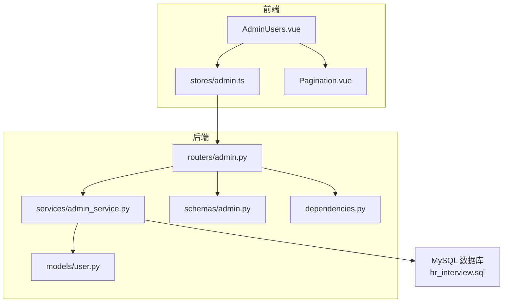
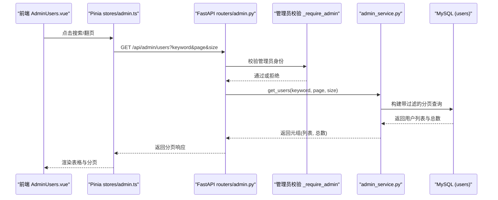
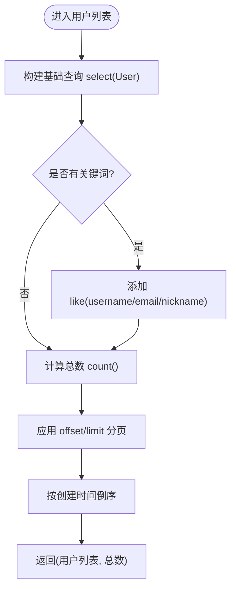
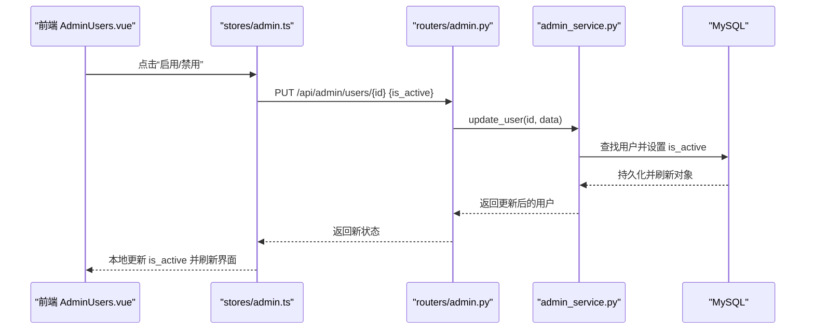
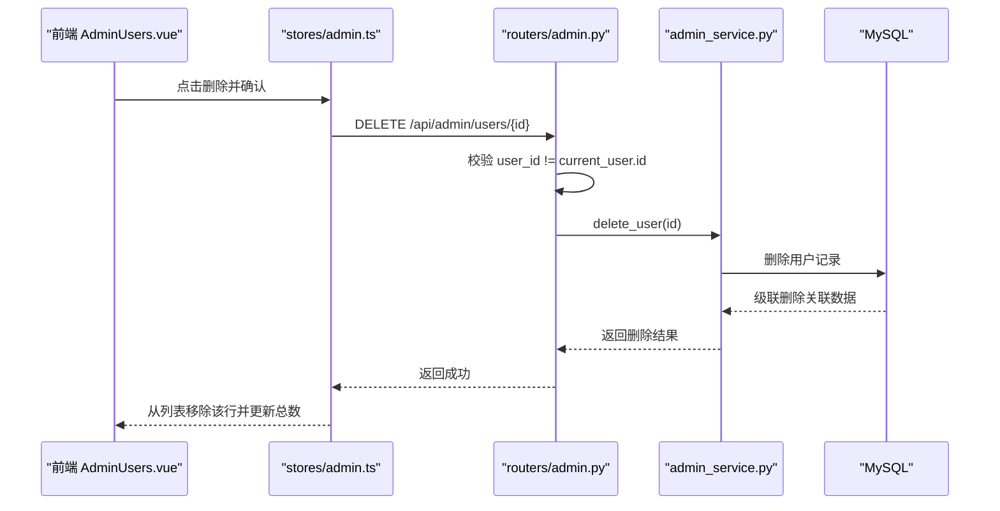
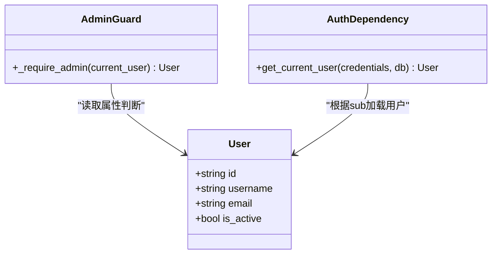
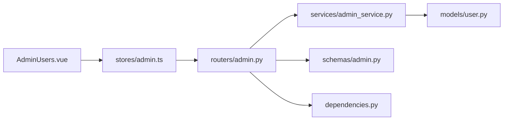

# 用户管理

<cite>
**本文引用的文件**   
- [backEnd/app/models/user.py](file://backEnd/app/models/user.py)
- [backEnd/app/routers/admin.py](file://backEnd/app/routers/admin.py)
- [backEnd/app/schemas/admin.py](file://backEnd/app/schemas/admin.py)
- [backEnd/app/services/admin_service.py](file://backEnd/app/services/admin_service.py)
- [backEnd/app/dependencies.py](file://backEnd/app/dependencies.py)
- [frontEnd/src/views/admin/AdminUsers.vue](file://frontEnd/src/views/admin/AdminUsers.vue)
- [frontEnd/src/stores/admin.ts](file://frontEnd/src/stores/admin.ts)
- [frontEnd/src/views/admin/Pagination.vue](file://frontEnd/src/views/admin/Pagination.vue)
- [hr_interview.sql](file://hr_interview.sql)
</cite>

## 目录
1. [简介](#简介)
2. [项目结构](#项目结构)
3. [核心组件](#核心组件)
4. [架构总览](#架构总览)
5. [详细组件分析](#详细组件分析)
6. [依赖关系分析](#依赖关系分析)
7. [性能考虑](#性能考虑)
8. [故障排查指南](#故障排查指南)
9. [结论](#结论)
10. [附录：API 与数据模型](#附录api-与数据模型)

## 简介
本文件面向开发者，系统化梳理“用户管理”模块的功能与实现，覆盖以下关键点：
- 用户列表分页查询与关键词搜索的实现原理
- 用户状态（启用/禁用）的业务逻辑与数据一致性保证
- 用户删除操作的级联处理与安全验证机制
- 权限控制、批量操作、数据导出等高级功能的现状与扩展建议

## 项目结构
用户管理功能采用前后端分离的架构：
- 前端：Vue 3 + Pinia 管理状态，AdminUsers 页面负责展示与交互，Pagination 组件负责分页控件。
- 后端：FastAPI 路由层暴露管理接口，服务层封装数据库查询与事务，Pydantic Schema 定义请求/响应结构，SQLAlchemy ORM 映射用户模型。

图表来源
- [backEnd/app/routers/admin.py:1-198](file://backEnd/app/routers/admin.py#L1-L198)
- [backEnd/app/services/admin_service.py:1-224](file://backEnd/app/services/admin_service.py#L1-L224)
- [backEnd/app/schemas/admin.py:1-123](file://backEnd/app/schemas/admin.py#L1-L123)
- [backEnd/app/models/user.py:1-45](file://backEnd/app/models/user.py#L1-L45)
- [backEnd/app/dependencies.py:1-41](file://backEnd/app/dependencies.py#L1-L41)
- [frontEnd/src/views/admin/AdminUsers.vue:1-165](file://frontEnd/src/views/admin/AdminUsers.vue#L1-L165)
- [frontEnd/src/stores/admin.ts:1-250](file://frontEnd/src/stores/admin.ts#L1-L250)
- [frontEnd/src/views/admin/Pagination.vue:1-60](file://frontEnd/src/views/admin/Pagination.vue#L1-L60)
- [hr_interview.sql:600-629](file://hr_interview.sql#L600-L629)

章节来源
- [backEnd/app/routers/admin.py:1-198](file://backEnd/app/routers/admin.py#L1-L198)
- [backEnd/app/services/admin_service.py:1-224](file://backEnd/app/services/admin_service.py#L1-L224)
- [backEnd/app/schemas/admin.py:1-123](file://backEnd/app/schemas/admin.py#L1-L123)
- [backEnd/app/models/user.py:1-45](file://backEnd/app/models/user.py#L1-L45)
- [backEnd/app/dependencies.py:1-41](file://backEnd/app/dependencies.py#L1-L41)
- [frontEnd/src/views/admin/AdminUsers.vue:1-165](file://frontEnd/src/views/admin/AdminUsers.vue#L1-L165)
- [frontEnd/src/stores/admin.ts:1-250](file://frontEnd/src/stores/admin.ts#L1-L250)
- [frontEnd/src/views/admin/Pagination.vue:1-60](file://frontEnd/src/views/admin/Pagination.vue#L1-L60)
- [hr_interview.sql:600-629](file://hr_interview.sql#L600-L629)

## 核心组件
- 用户模型与表结构
  - 用户实体包含唯一用户名、邮箱、密码哈希、激活状态、个人资料字段及时间戳。
  - 数据库层面为 users 表，提供索引与约束，确保唯一性与完整性。
- 管理路由与鉴权
  - 管理接口统一在 /api/admin 下，通过管理员校验中间件限制访问。
  - 当前用户从 JWT 解析并校验是否可用（is_active）。
- 用户列表与搜索
  - 支持按用户名/邮箱/昵称模糊匹配，返回分页结果与总数。
- 用户状态更新与删除
  - 支持启用/禁用切换；删除前禁止删除自身，且存在外键级联清理。
- 前端交互
  - AdminUsers 页面提供搜索框、表格展示、状态切换按钮、删除确认与分页导航。
  - stores/admin.ts 封装 API 调用与本地状态同步。

章节来源
- [backEnd/app/models/user.py:1-45](file://backEnd/app/models/user.py#L1-L45)
- [hr_interview.sql:600-629](file://hr_interview.sql#L600-L629)
- [backEnd/app/routers/admin.py:24-99](file://backEnd/app/routers/admin.py#L24-L99)
- [backEnd/app/dependencies.py:13-41](file://backEnd/app/dependencies.py#L13-L41)
- [backEnd/app/services/admin_service.py:47-101](file://backEnd/app/services/admin_service.py#L47-L101)
- [frontEnd/src/views/admin/AdminUsers.vue:1-165](file://frontEnd/src/views/admin/AdminUsers.vue#L1-L165)
- [frontEnd/src/stores/admin.ts:105-142](file://frontEnd/src/stores/admin.ts#L105-L142)

## 架构总览
下图展示了用户管理的端到端流程：前端发起请求，后端路由进行鉴权与参数校验，服务层执行数据库操作，最终返回结构化响应。

图表来源
- [backEnd/app/routers/admin.py:50-67](file://backEnd/app/routers/admin.py#L50-L67)
- [backEnd/app/services/admin_service.py:47-72](file://backEnd/app/services/admin_service.py#L47-L72)
- [frontEnd/src/stores/admin.ts:107-127](file://frontEnd/src/stores/admin.ts#L107-L127)
- [frontEnd/src/views/admin/AdminUsers.vue:130-138](file://frontEnd/src/views/admin/AdminUsers.vue#L130-L138)

## 详细组件分析

### 用户列表分页查询与关键词搜索
- 查询入口
  - 路由接收 keyword、page、size 三个可选/默认参数，调用服务层获取数据。
- 搜索条件
  - 当 keyword 非空时，使用 LIKE 对 username、email、nickname 三列进行模糊匹配，组合为 OR 条件。
- 分页策略
  - 先基于子查询统计 total，再使用 offset/limit 取当前页数据，按 created_at 降序排列。
- 前端联动
  - 输入关键词后重置到第 1 页并重新拉取；分页组件触发 change 事件更新 page 并刷新列表。

图表来源
- [backEnd/app/services/admin_service.py:47-72](file://backEnd/app/services/admin_service.py#L47-L72)
- [backEnd/app/routers/admin.py:50-67](file://backEnd/app/routers/admin.py#L50-L67)
- [frontEnd/src/views/admin/Pagination.vue:47-58](file://frontEnd/src/views/admin/Pagination.vue#L47-L58)

章节来源
- [backEnd/app/routers/admin.py:50-67](file://backEnd/app/routers/admin.py#L50-L67)
- [backEnd/app/services/admin_service.py:47-72](file://backEnd/app/services/admin_service.py#L47-L72)
- [frontEnd/src/stores/admin.ts:107-127](file://frontEnd/src/stores/admin.ts#L107-L127)
- [frontEnd/src/views/admin/AdminUsers.vue:130-138](file://frontEnd/src/views/admin/AdminUsers.vue#L130-L138)
- [frontEnd/src/views/admin/Pagination.vue:47-58](file://frontEnd/src/views/admin/Pagination.vue#L47-L58)

### 用户状态管理（启用/禁用）
- 业务逻辑
  - 通过 PUT /api/admin/users/{user_id} 提交 is_active 布尔值，服务端将对应字段写入数据库。
  - 前端在成功响应后即时更新本地状态，避免二次请求。
- 数据一致性
  - 更新路径使用 flush/refresh 确保会话内可见最新值。
  - 若目标用户不存在，返回 404。
- 安全与权限
  - 所有管理接口受 _require_admin 保护，仅允许管理员角色访问。
  - 全局认证依赖 get_current_user 会检查 is_active，被禁用的用户无法登录。

图表来源
- [backEnd/app/routers/admin.py:70-83](file://backEnd/app/routers/admin.py#L70-L83)
- [backEnd/app/services/admin_service.py:75-91](file://backEnd/app/services/admin_service.py#L75-L91)
- [frontEnd/src/stores/admin.ts:129-136](file://frontEnd/src/stores/admin.ts#L129-L136)
- [frontEnd/src/views/admin/AdminUsers.vue:140-146](file://frontEnd/src/views/admin/AdminUsers.vue#L140-L146)

章节来源
- [backEnd/app/routers/admin.py:70-83](file://backEnd/app/routers/admin.py#L70-L83)
- [backEnd/app/services/admin_service.py:75-91](file://backEnd/app/services/admin_service.py#L75-L91)
- [backEnd/app/dependencies.py:13-41](file://backEnd/app/dependencies.py#L13-L41)
- [frontEnd/src/stores/admin.ts:129-136](file://frontEnd/src/stores/admin.ts#L129-L136)
- [frontEnd/src/views/admin/AdminUsers.vue:140-146](file://frontEnd/src/views/admin/AdminUsers.vue#L140-L146)

### 用户删除与级联处理
- 安全校验
  - 删除前禁止删除当前管理员自身，防止自删导致的管理员锁定。
  - 若用户不存在则返回 404。
- 级联清理
  - 数据库层面，多个关联表对用户 ID 设置了 ON DELETE CASCADE，包括评论、帖子、面试记录、简历、提交记录等。删除用户时将自动清理相关数据，保持数据一致性。
- 前端交互
  - 删除前弹出确认框，成功后从本地列表移除并减少总数。

图表来源
- [backEnd/app/routers/admin.py:86-99](file://backEnd/app/routers/admin.py#L86-L99)
- [backEnd/app/services/admin_service.py:94-101](file://backEnd/app/services/admin_service.py#L94-L101)
- [hr_interview.sql:49-51](file://hr_interview.sql#L49-L51)
- [hr_interview.sql:84-86](file://hr_interview.sql#L84-L86)
- [hr_interview.sql:237-237](file://hr_interview.sql#L237-L237)
- [hr_interview.sql:266-266](file://hr_interview.sql#L266-L266)
- [hr_interview.sql:356-356](file://hr_interview.sql#L356-L356)
- [hr_interview.sql:454-454](file://hr_interview.sql#L454-L454)
- [hr_interview.sql:481-481](file://hr_interview.sql#L481-L481)
- [frontEnd/src/stores/admin.ts:138-142](file://frontEnd/src/stores/admin.ts#L138-L142)
- [frontEnd/src/views/admin/AdminUsers.vue:148-155](file://frontEnd/src/views/admin/AdminUsers.vue#L148-L155)

章节来源
- [backEnd/app/routers/admin.py:86-99](file://backEnd/app/routers/admin.py#L86-L99)
- [backEnd/app/services/admin_service.py:94-101](file://backEnd/app/services/admin_service.py#L94-L101)
- [hr_interview.sql:49-51](file://hr_interview.sql#L49-L51)
- [hr_interview.sql:84-86](file://hr_interview.sql#L84-L86)
- [hr_interview.sql:237-237](file://hr_interview.sql#L237-L237)
- [hr_interview.sql:266-266](file://hr_interview.sql#L266-L266)
- [hr_interview.sql:356-356](file://hr_interview.sql#L356-L356)
- [hr_interview.sql:454-454](file://hr_interview.sql#L454-L454)
- [hr_interview.sql:481-481](file://hr_interview.sql#L481-L481)
- [frontEnd/src/stores/admin.ts:138-142](file://frontEnd/src/stores/admin.ts#L138-L142)
- [frontEnd/src/views/admin/AdminUsers.vue:148-155](file://frontEnd/src/views/admin/AdminUsers.vue#L148-L155)

### 权限控制与管理员校验
- 管理员判定
  - 简易规则：当前用户的 email 或 username 包含 “admin” 即视为管理员。
- 全局认证
  - 所有需要认证的接口通过 get_current_user 解析 JWT，校验 token 有效且用户未被禁用。
- 错误处理
  - 无管理员权限返回 403；无效 Token 或被禁用用户返回 401。

图表来源
- [backEnd/app/routers/admin.py:26-34](file://backEnd/app/routers/admin.py#L26-L34)
- [backEnd/app/dependencies.py:13-41](file://backEnd/app/dependencies.py#L13-L41)
- [backEnd/app/models/user.py:10-26](file://backEnd/app/models/user.py#L10-L26)

章节来源
- [backEnd/app/routers/admin.py:26-34](file://backEnd/app/routers/admin.py#L26-L34)
- [backEnd/app/dependencies.py:13-41](file://backEnd/app/dependencies.py#L13-L41)
- [backEnd/app/models/user.py:10-26](file://backEnd/app/models/user.py#L10-L26)

### 批量操作与数据导出（现状与建议）
- 现状
  - 当前未提供批量启用/禁用、批量删除或数据导出的接口与前端能力。
- 建议方案
  - 批量操作
    - 新增 POST /api/admin/users/batch-update，请求体包含 ids 与 is_active，在服务层遍历更新并返回受影响数量。
    - 新增 DELETE /api/admin/users/batch-delete，传入 ids，逐条删除并汇总结果。
  - 数据导出
    - 新增 GET /api/admin/users/export?keyword&page&size，返回 CSV/Excel 流式响应。
    - 前端增加“导出”按钮，调用导出接口并下载文件。
  - 安全与审计
    - 批量操作需二次确认与操作日志记录。
    - 导出需限制频率与大小，避免资源滥用。

[本节为概念性建议，不直接分析具体代码文件]

## 依赖关系分析
- 组件耦合
  - 路由层依赖服务层与 Pydantic Schema，服务层依赖 ORM 模型与数据库。
  - 前端通过 Pinia 统一管理状态，视图组件仅关注交互与展示。
- 外部依赖
  - FastAPI 路由与依赖注入、SQLAlchemy 异步会话、JWT 解码与校验。
- 潜在循环依赖
  - 当前结构清晰，未见循环导入风险。

图表来源
- [backEnd/app/routers/admin.py:1-198](file://backEnd/app/routers/admin.py#L1-L198)
- [backEnd/app/services/admin_service.py:1-224](file://backEnd/app/services/admin_service.py#L1-L224)
- [backEnd/app/schemas/admin.py:1-123](file://backEnd/app/schemas/admin.py#L1-L123)
- [backEnd/app/models/user.py:1-45](file://backEnd/app/models/user.py#L1-L45)
- [backEnd/app/dependencies.py:1-41](file://backEnd/app/dependencies.py#L1-L41)
- [frontEnd/src/views/admin/AdminUsers.vue:1-165](file://frontEnd/src/views/admin/AdminUsers.vue#L1-L165)
- [frontEnd/src/stores/admin.ts:1-250](file://frontEnd/src/stores/admin.ts#L1-L250)

章节来源
- [backEnd/app/routers/admin.py:1-198](file://backEnd/app/routers/admin.py#L1-L198)
- [backEnd/app/services/admin_service.py:1-224](file://backEnd/app/services/admin_service.py#L1-L224)
- [backEnd/app/schemas/admin.py:1-123](file://backEnd/app/schemas/admin.py#L1-L123)
- [backEnd/app/models/user.py:1-45](file://backEnd/app/models/user.py#L1-L45)
- [backEnd/app/dependencies.py:1-41](file://backEnd/app/dependencies.py#L1-L41)
- [frontEnd/src/views/admin/AdminUsers.vue:1-165](file://frontEnd/src/views/admin/AdminUsers.vue#L1-L165)
- [frontEnd/src/stores/admin.ts:1-250](file://frontEnd/src/stores/admin.ts#L1-L250)

## 性能考虑
- 查询优化
  - 关键词搜索使用 LIKE 模糊匹配，建议在 username、email、nickname 上建立合适的索引以提升检索性能。
  - 分页使用 offset/limit，当数据量极大时可考虑游标分页（基于 created_at 或 id）以避免深层偏移的性能退化。
- 计数查询
  - 当前通过子查询统计总数，可结合数据库统计缓存或物化视图降低高频统计开销。
- 前端体验
  - 分页组件已支持智能显示页码范围，提升大数据集下的交互体验。
  - 建议加入防抖搜索，减少频繁请求。

[本节提供通用指导，不直接分析具体代码文件]

## 故障排查指南
- 401 未授权
  - 可能原因：Token 无效、过期或被禁用用户尝试访问。
  - 排查要点：检查 Authorization 头是否正确携带；确认用户 is_active 状态。
- 403 无管理员权限
  - 可能原因：当前用户不符合管理员判定规则。
  - 排查要点：检查用户名或邮箱是否包含 “admin”。
- 404 用户不存在
  - 可能原因：目标用户已被删除或 ID 不正确。
  - 排查要点：核对路由参数与数据库记录。
- 删除失败
  - 可能原因：试图删除自己；或外键约束冲突（理论上应级联）。
  - 排查要点：确认前端是否阻止了自删；检查数据库外键配置。

章节来源
- [backEnd/app/dependencies.py:13-41](file://backEnd/app/dependencies.py#L13-L41)
- [backEnd/app/routers/admin.py:26-34](file://backEnd/app/routers/admin.py#L26-L34)
- [backEnd/app/routers/admin.py:86-99](file://backEnd/app/routers/admin.py#L86-L99)

## 结论
用户管理模块实现了核心的分页查询、关键词搜索、状态管理与删除操作，并通过管理员校验与全局认证保障安全性。数据库层面的级联约束确保了删除时的数据一致性。针对批量操作与数据导出等高级需求，可在现有架构基础上平滑扩展，同时引入更严格的权限与审计机制以增强系统健壮性。

[本节为总结性内容，不直接分析具体代码文件]

## 附录：API 与数据模型

### 管理端用户接口
- 获取用户列表（分页+搜索）
  - 方法：GET
  - 路径：/api/admin/users
  - 查询参数：keyword、page、size
  - 响应：{ users[], total, page, size }
- 更新用户（启用/禁用）
  - 方法：PUT
  - 路径：/api/admin/users/{user_id}
  - 请求体：{ is_active?: boolean, nickname?: string }
  - 响应：AdminUserItem
- 删除用户
  - 方法：DELETE
  - 路径：/api/admin/users/{user_id}
  - 响应：{ message }

章节来源
- [backEnd/app/routers/admin.py:50-99](file://backEnd/app/routers/admin.py#L50-L99)
- [backEnd/app/schemas/admin.py:21-43](file://backEnd/app/schemas/admin.py#L21-L43)

### 数据模型（用户）
- 主要字段
  - id、username、email、password_hash、is_active、created_at、updated_at
  - 个人资料：nickname、avatar、avatar_color、bio、phone、gender、birth_date
- 约束与索引
  - username、email 唯一索引；主键为 id。

章节来源
- [backEnd/app/models/user.py:10-45](file://backEnd/app/models/user.py#L10-L45)
- [hr_interview.sql:600-629](file://hr_interview.sql#L600-L629)