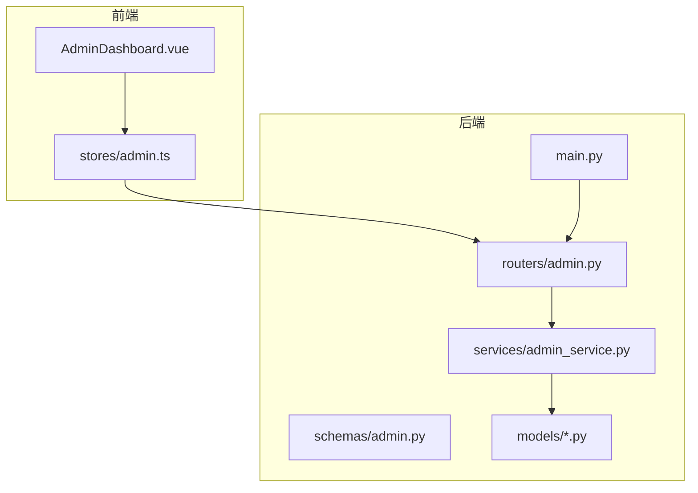
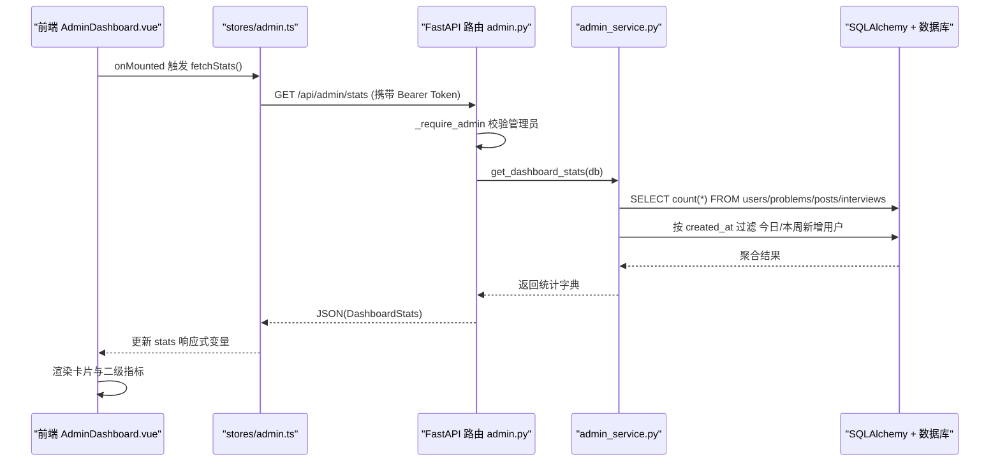
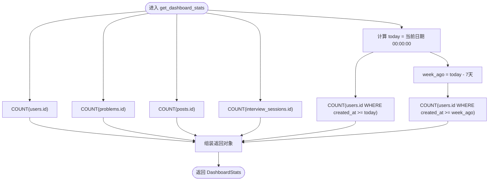
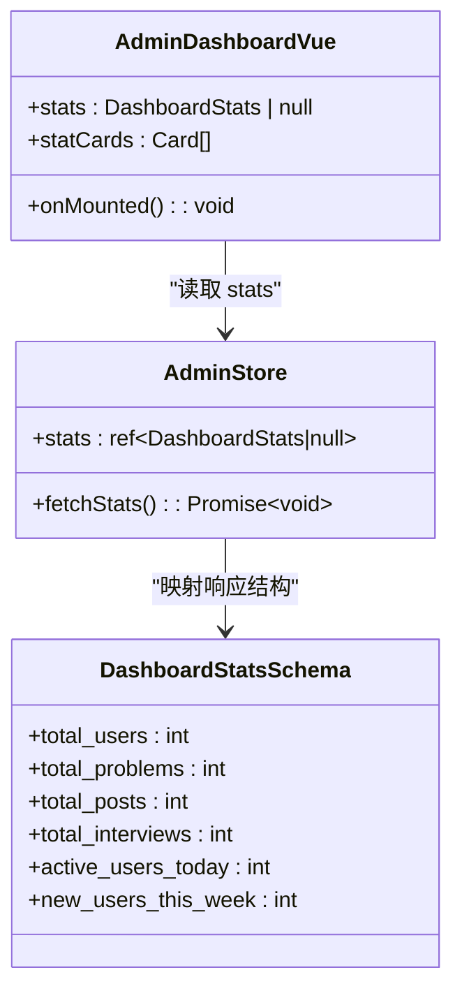
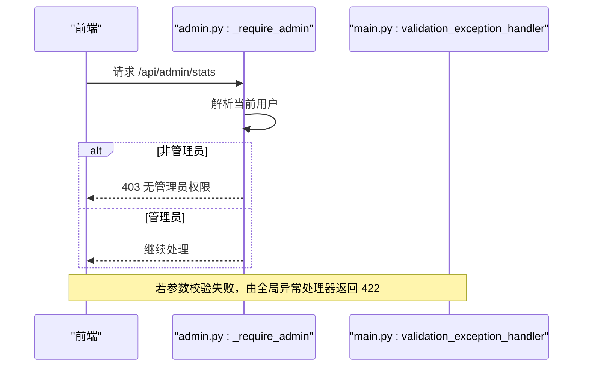
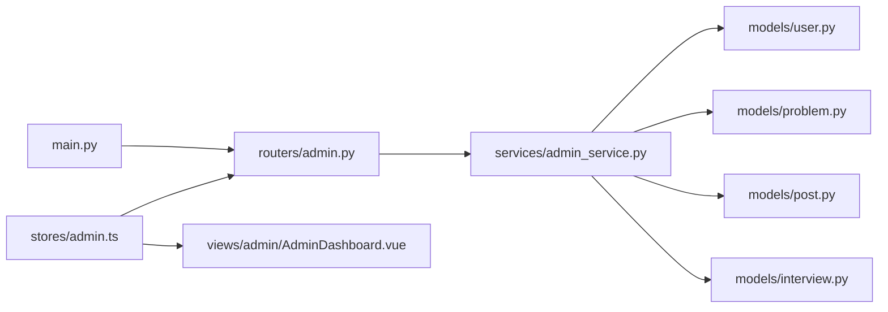

# 管理仪表板

<cite>
**本文引用的文件**   
- [backEnd/app/routers/admin.py](file://backEnd/app/routers/admin.py)
- [backEnd/app/services/admin_service.py](file://backEnd/app/services/admin_service.py)
- [backEnd/app/schemas/admin.py](file://backEnd/app/schemas/admin.py)
- [backEnd/app/models/user.py](file://backEnd/app/models/user.py)
- [backEnd/app/models/problem.py](file://backEnd/app/models/problem.py)
- [backEnd/app/models/post.py](file://backEnd/app/models/post.py)
- [backEnd/app/models/interview.py](file://backEnd/app/models/interview.py)
- [backEnd/app/main.py](file://backEnd/app/main.py)
- [frontEnd/src/views/admin/AdminDashboard.vue](file://frontEnd/src/views/admin/AdminDashboard.vue)
- [frontEnd/src/stores/admin.ts](file://frontEnd/src/stores/admin.ts)
</cite>

## 目录
1. [简介](#简介)
2. [项目结构](#项目结构)
3. [核心组件](#核心组件)
4. [架构总览](#架构总览)
5. [详细组件分析](#详细组件分析)
6. [依赖关系分析](#依赖关系分析)
7. [性能与缓存策略](#性能与缓存策略)
8. [故障排查指南](#故障排查指南)
9. [结论](#结论)
10. [附录：API 定义与数据模型](#附录api-定义与数据模型)

## 简介
本文件面向后台管理系统的数据监控机制，聚焦“管理仪表板”的统计数据聚合算法、可视化展示方式以及性能优化方案。内容覆盖用户数量、帖子数量、题目数量等核心指标的实时计算逻辑，并给出前端展示与后端接口交互流程说明。同时提供可落地的缓存与性能优化建议，帮助开发者理解并扩展该模块。

## 项目结构
管理仪表板涉及前后端协作：
- 后端通过 FastAPI 暴露统计接口，服务层执行数据库聚合查询，返回结构化响应。
- 前端在管理页面加载时调用统计接口，渲染卡片与二级指标。

图表来源
- [backEnd/app/routers/admin.py:39-46](file://backEnd/app/routers/admin.py#L39-L46)
- [backEnd/app/services/admin_service.py:14-42](file://backEnd/app/services/admin_service.py#L14-L42)
- [backEnd/app/schemas/admin.py:7-16](file://backEnd/app/schemas/admin.py#L7-L16)
- [backEnd/app/models/user.py:10-45](file://backEnd/app/models/user.py#L10-L45)
- [backEnd/app/models/problem.py:17-52](file://backEnd/app/models/problem.py#L17-L52)
- [backEnd/app/models/post.py:18-58](file://backEnd/app/models/post.py#L18-L58)
- [backEnd/app/models/interview.py:19-55](file://backEnd/app/models/interview.py#L19-L55)
- [backEnd/app/main.py:60-68](file://backEnd/app/main.py#L60-L68)
- [frontEnd/src/views/admin/AdminDashboard.vue:100-135](file://frontEnd/src/views/admin/AdminDashboard.vue#L100-L135)
- [frontEnd/src/stores/admin.ts:94-103](file://frontEnd/src/stores/admin.ts#L94-L103)

章节来源
- [backEnd/app/main.py:60-68](file://backEnd/app/main.py#L60-L68)
- [frontEnd/src/views/admin/AdminDashboard.vue:1-136](file://frontEnd/src/views/admin/AdminDashboard.vue#L1-L136)
- [frontEnd/src/stores/admin.ts:1-250](file://frontEnd/src/stores/admin.ts#L1-L250)

## 核心组件
- 路由层：提供 /api/admin/stats 获取仪表盘统计数据，包含管理员权限校验。
- 服务层：执行多表 COUNT 聚合与时间窗口过滤（今日/本周），组装返回字典。
- 模式层：使用 Pydantic 定义 DashboardStats 响应结构，确保字段类型与必填约束。
- 模型层：User、Problem、Post、InterviewSession 四个实体用于计数与时间筛选。
- 前端：页面挂载时调用 store 方法拉取数据，并以卡片和二级指标形式展示。

章节来源
- [backEnd/app/routers/admin.py:24-46](file://backEnd/app/routers/admin.py#L24-L46)
- [backEnd/app/services/admin_service.py:14-42](file://backEnd/app/services/admin_service.py#L14-L42)
- [backEnd/app/schemas/admin.py:7-16](file://backEnd/app/schemas/admin.py#L7-L16)
- [backEnd/app/models/user.py:10-45](file://backEnd/app/models/user.py#L10-L45)
- [backEnd/app/models/problem.py:17-52](file://backEnd/app/models/problem.py#L17-L52)
- [backEnd/app/models/post.py:18-58](file://backEnd/app/models/post.py#L18-L58)
- [backEnd/app/models/interview.py:19-55](file://backEnd/app/models/interview.py#L19-L55)
- [frontEnd/src/views/admin/AdminDashboard.vue:100-135](file://frontEnd/src/views/admin/AdminDashboard.vue#L100-L135)
- [frontEnd/src/stores/admin.ts:94-103](file://frontEnd/src/stores/admin.ts#L94-L103)

## 架构总览
从请求到响应的完整链路如下：

图表来源
- [backEnd/app/routers/admin.py:24-46](file://backEnd/app/routers/admin.py#L24-L46)
- [backEnd/app/services/admin_service.py:14-42](file://backEnd/app/services/admin_service.py#L14-L42)
- [frontEnd/src/stores/admin.ts:94-103](file://frontEnd/src/stores/admin.ts#L94-L103)
- [frontEnd/src/views/admin/AdminDashboard.vue:100-135](file://frontEnd/src/views/admin/AdminDashboard.vue#L100-L135)

## 详细组件分析

### 仪表盘统计数据聚合算法
- 总量指标：对用户、题目、帖子、面试会话分别执行 COUNT(id)。
- 活跃用户（当日）：以当前日期零点为起点，统计 created_at >= today 的用户数。
- 本周新增用户：以今天往前推 7 天为起点，统计 created_at >= week_ago 的用户数。
- 返回值：包含 total_users、total_problems、total_posts、total_interviews、active_users_today、new_users_this_week。

图表来源
- [backEnd/app/services/admin_service.py:14-42](file://backEnd/app/services/admin_service.py#L14-L42)
- [backEnd/app/models/user.py:36-38](file://backEnd/app/models/user.py#L36-L38)
- [backEnd/app/models/problem.py:44-52](file://backEnd/app/models/problem.py#L44-L52)
- [backEnd/app/models/post.py:50-58](file://backEnd/app/models/post.py#L50-L58)
- [backEnd/app/models/interview.py:51-54](file://backEnd/app/models/interview.py#L51-L54)

章节来源
- [backEnd/app/services/admin_service.py:14-42](file://backEnd/app/services/admin_service.py#L14-L42)

### 可视化图表的数据展示方式
- 当前实现以“卡片+二级指标”为主，未引入第三方图表库。
- 一级指标卡片：总用户数、题库总量、面经帖子。
- 二级指标区：今日新增用户、本周新增用户。
- 快捷操作区：跳转至题目、用户、帖子管理页，并在按钮上显示对应总量。
- 面试统计区：展示全平台模拟面试会话总量。

图表来源
- [frontEnd/src/views/admin/AdminDashboard.vue:100-135](file://frontEnd/src/views/admin/AdminDashboard.vue#L100-L135)
- [frontEnd/src/stores/admin.ts:6-13](file://frontEnd/src/stores/admin.ts#L6-L13)
- [backEnd/app/schemas/admin.py:7-16](file://backEnd/app/schemas/admin.py#L7-L16)

章节来源
- [frontEnd/src/views/admin/AdminDashboard.vue:1-136](file://frontEnd/src/views/admin/AdminDashboard.vue#L1-L136)
- [frontEnd/src/stores/admin.ts:94-103](file://frontEnd/src/stores/admin.ts#L94-L103)

### 权限控制与错误处理
- 管理员校验：基于当前登录用户的 email 或 username 是否包含 “admin”。不满足则返回 403。
- 统一异常处理：主应用注册了验证错误处理器，避免二进制输入导致的解码异常。
- 前端错误处理：store 中 apiRequest 对非 2xx 响应抛出错误，页面侧 console.error 记录失败信息。

图表来源
- [backEnd/app/routers/admin.py:24-34](file://backEnd/app/routers/admin.py#L24-L34)
- [backEnd/app/main.py:76-84](file://backEnd/app/main.py#L76-L84)
- [frontEnd/src/stores/admin.ts:52-65](file://frontEnd/src/stores/admin.ts#L52-L65)

章节来源
- [backEnd/app/routers/admin.py:24-34](file://backEnd/app/routers/admin.py#L24-L34)
- [backEnd/app/main.py:76-84](file://backEnd/app/main.py#L76-L84)
- [frontEnd/src/stores/admin.ts:52-65](file://frontEnd/src/stores/admin.ts#L52-L65)

## 依赖关系分析
- 路由依赖：admin_router 在主应用中注册；路由函数依赖认证依赖与数据库会话。
- 服务依赖：admin_service 直接依赖 SQLAlchemy 异步会话与各模型。
- 前端依赖：AdminDashboard.vue 依赖 Pinia store；store 封装 HTTP 请求并维护状态。

图表来源
- [backEnd/app/main.py:60-68](file://backEnd/app/main.py#L60-L68)
- [backEnd/app/routers/admin.py:1-21](file://backEnd/app/routers/admin.py#L1-L21)
- [backEnd/app/services/admin_service.py:1-10](file://backEnd/app/services/admin_service.py#L1-L10)
- [frontEnd/src/stores/admin.ts:1-10](file://frontEnd/src/stores/admin.ts#L1-L10)
- [frontEnd/src/views/admin/AdminDashboard.vue:100-105](file://frontEnd/src/views/admin/AdminDashboard.vue#L100-L105)

章节来源
- [backEnd/app/main.py:60-68](file://backEnd/app/main.py#L60-L68)
- [backEnd/app/routers/admin.py:1-21](file://backEnd/app/routers/admin.py#L1-L21)
- [backEnd/app/services/admin_service.py:1-10](file://backEnd/app/services/admin_service.py#L1-L10)
- [frontEnd/src/stores/admin.ts:1-10](file://frontEnd/src/stores/admin.ts#L1-L10)
- [frontEnd/src/views/admin/AdminDashboard.vue:100-105](file://frontEnd/src/views/admin/AdminDashboard.vue#L100-L105)

## 性能与缓存策略
当前实现为每次请求实时聚合，适合中小规模数据。随着数据量增长，建议引入以下策略：

- 服务端缓存
  - 内存缓存：使用 Redis 或进程内缓存（如 cachetools）缓存 DashboardStats，设置合理 TTL（例如 30-60 秒）。
  - 增量更新：在关键写路径（新增用户、发布帖子、创建题目、完成面试）后失效或局部更新缓存键。
  - 预热策略：服务启动时预计算一次热门指标，降低冷启动延迟。

- 数据库优化
  - 索引：确保 users.created_at、problems.created_at、posts.created_at、interview_sessions.started_at 有合适索引。
  - 物化视图/汇总表：对高频聚合指标建立定时任务刷新汇总表，统计接口直接读汇总。
  - 分库分表：当单表达到千万级，考虑按时间范围分表，聚合查询走分区裁剪。

- 前端优化
  - 请求去抖/节流：在频繁切换标签或刷新时避免重复请求。
  - 本地缓存：将最近一次成功结果缓存于 sessionStorage，网络失败时降级展示。
  - 懒加载与分页：后续可扩展趋势图数据按需加载。

- 监控与降级
  - 慢查询告警：对聚合 SQL 添加执行时长阈值告警。
  - 熔断与回退：当数据库不可用时，返回最近缓存值并标注“可能不是最新”。

[本节为通用指导，无需代码引用]

## 故障排查指南
- 403 无管理员权限
  - 检查当前登录用户的 email 或 username 是否包含 “admin”。
  - 确认前端是否正确携带 Authorization 头。
- 422 参数校验失败
  - 查看全局异常处理器返回的错误详情，定位具体字段问题。
- 统计数据为空或为 0
  - 检查数据库连接与表是否存在数据。
  - 确认 created_at 字段是否被正确填充。
- 前端报错
  - 打开浏览器控制台，查看 store 中的错误日志与网络请求状态码。

章节来源
- [backEnd/app/routers/admin.py:24-34](file://backEnd/app/routers/admin.py#L24-L34)
- [backEnd/app/main.py:76-84](file://backEnd/app/main.py#L76-L84)
- [frontEnd/src/stores/admin.ts:52-65](file://frontEnd/src/stores/admin.ts#L52-L65)

## 结论
管理仪表板通过简洁的 REST 接口与响应式前端实现了核心指标的实时展示。当前聚合逻辑清晰、易于扩展。建议在数据规模增长后引入缓存与物化汇总，以提升稳定性与性能。同时完善趋势类图表的数据源与展示能力，使监控更全面。

[本节为总结性内容，无需代码引用]

## 附录：API 定义与数据模型

### 接口定义
- 获取仪表盘统计数据
  - 方法：GET
  - 路径：/api/admin/stats
  - 鉴权：需要管理员权限
  - 响应体：DashboardStats

章节来源
- [backEnd/app/routers/admin.py:39-46](file://backEnd/app/routers/admin.py#L39-L46)
- [backEnd/app/schemas/admin.py:7-16](file://backEnd/app/schemas/admin.py#L7-L16)

### 数据模型概览
- User：用户基本信息与创建时间
- Problem：题目信息与创建时间
- Post：帖子信息与创建时间
- InterviewSession：面试会话信息与开始/完成时间

章节来源
- [backEnd/app/models/user.py:10-45](file://backEnd/app/models/user.py#L10-L45)
- [backEnd/app/models/problem.py:17-52](file://backEnd/app/models/problem.py#L17-L52)
- [backEnd/app/models/post.py:18-58](file://backEnd/app/models/post.py#L18-L58)
- [backEnd/app/models/interview.py:19-55](file://backEnd/app/models/interview.py#L19-L55)