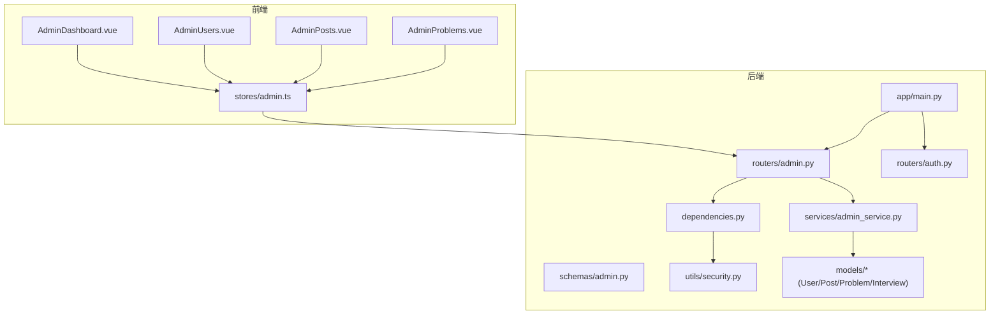
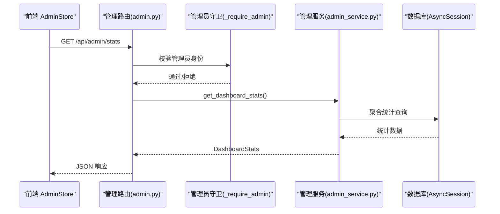
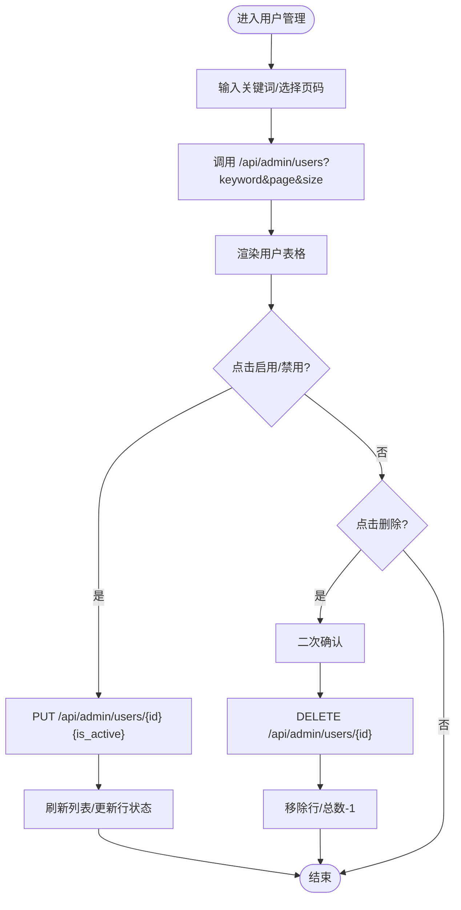
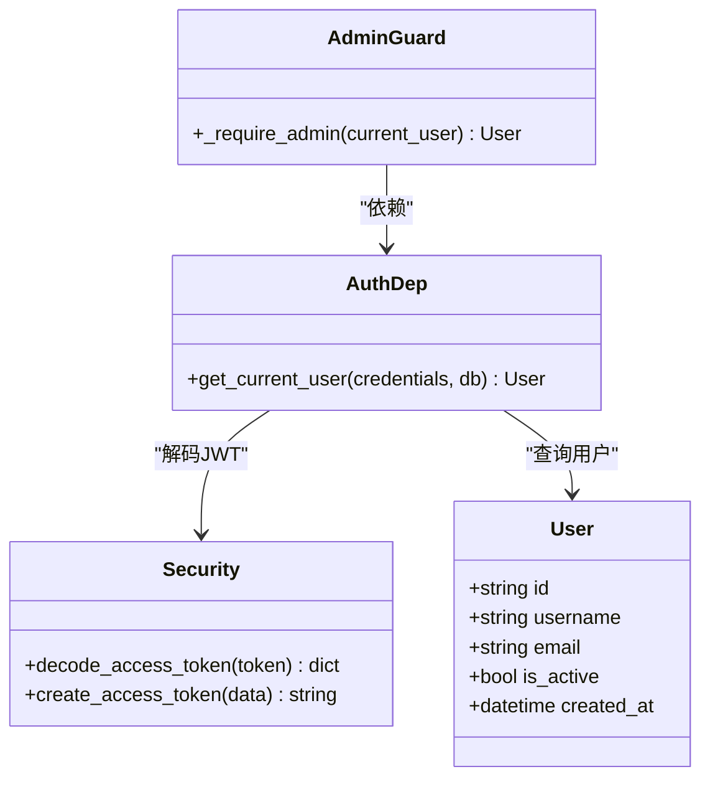
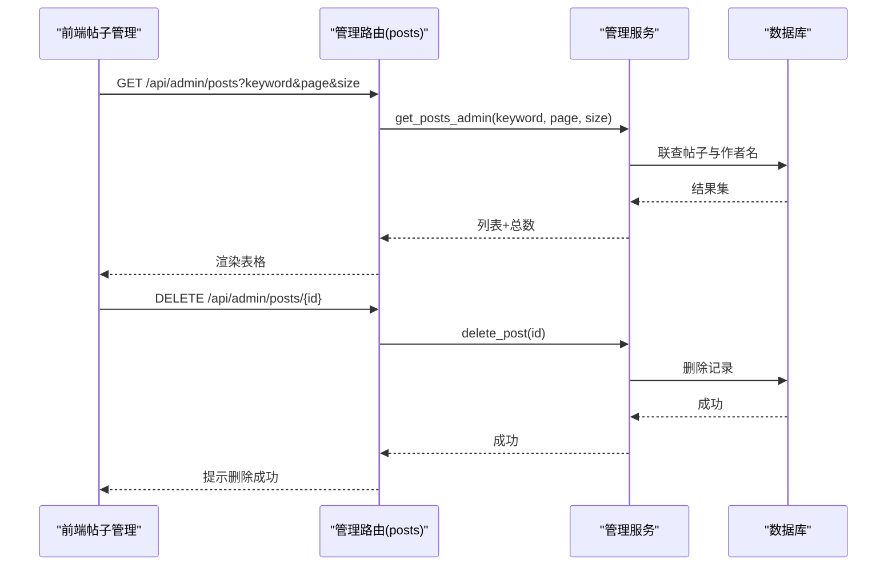
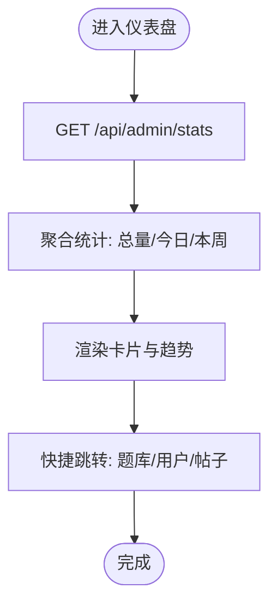
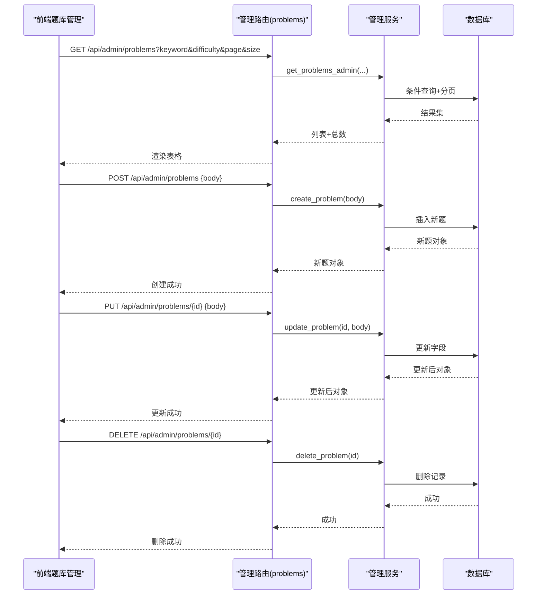
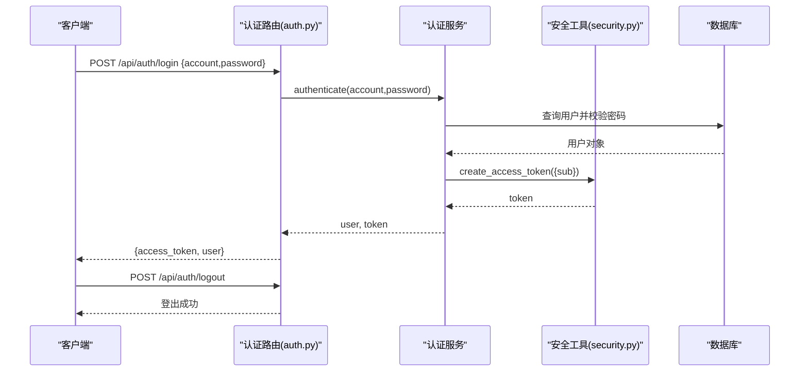
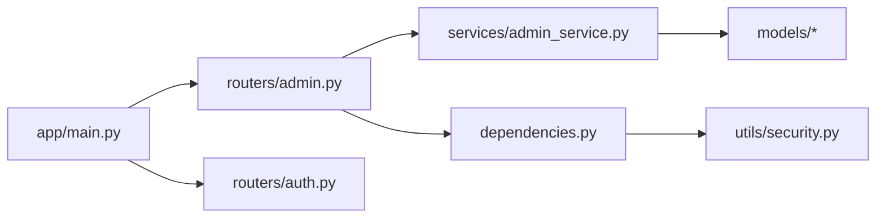

# 管理员后台系统

<cite>
**本文引用的文件**   
- [main.py](file://backEnd/app/main.py)
- [admin.py](file://backEnd/app/routers/admin.py)
- [admin_service.py](file://backEnd/app/services/admin_service.py)
- [admin.py](file://backEnd/app/schemas/admin.py)
- [dependencies.py](file://backEnd/app/dependencies.py)
- [security.py](file://backEnd/app/utils/security.py)
- [auth.py](file://backEnd/app/routers/auth.py)
- [user.py](file://backEnd/app/models/user.py)
- [post.py](file://backEnd/app/models/post.py)
- [problem.py](file://backEnd/app/models/problem.py)
- [interview.py](file://backEnd/app/models/interview.py)
- [AdminDashboard.vue](file://frontEnd/src/views/admin/AdminDashboard.vue)
- [AdminUsers.vue](file://frontEnd/src/views/admin/AdminUsers.vue)
- [AdminPosts.vue](file://frontEnd/src/views/admin/AdminPosts.vue)
- [AdminProblems.vue](file://frontEnd/src/views/admin/AdminProblems.vue)
- [admin.ts](file://frontEnd/src/stores/admin.ts)
</cite>

## 目录
1. [引言](#引言)
2. [项目结构](#项目结构)
3. [核心组件](#核心组件)
4. [架构总览](#架构总览)
5. [详细组件分析](#详细组件分析)
6. [依赖关系分析](#依赖关系分析)
7. [性能与可扩展性](#性能与可扩展性)
8. [故障排查指南](#故障排查指南)
9. [结论](#结论)
10. [附录](#附录)

## 引言
本文件面向企业级管理平台的管理员后台，围绕用户管理、角色权限控制、内容审核、数据统计仪表板、题库与帖子管理等能力进行系统化说明。文档从后端路由、服务层、数据模型到前端视图与状态管理，逐层解析实现原理与交互流程，并提供可操作的排障建议与扩展指引，帮助开发者快速构建完善的管理平台。

## 项目结构
后端采用 FastAPI + SQLAlchemy 异步 ORM 的分层架构：路由层负责请求校验与参数绑定，服务层封装业务逻辑与数据库操作，模型层定义实体与关系；前端基于 Vue 3 + Pinia，提供仪表盘、用户管理、题目管理、帖子管理等页面。

图表来源
- [main.py:44-68](file://backEnd/app/main.py#L44-L68)
- [admin.py:21-198](file://backEnd/app/routers/admin.py#L21-L198)
- [admin_service.py:14-224](file://backEnd/app/services/admin_service.py#L14-L224)
- [admin.py:7-123](file://backEnd/app/schemas/admin.py#L7-L123)
- [dependencies.py:13-41](file://backEnd/app/dependencies.py#L13-L41)
- [security.py:26-48](file://backEnd/app/utils/security.py#L26-L48)
- [auth.py:69-86](file://backEnd/app/routers/auth.py#L69-L86)
- [user.py:10-45](file://backEnd/app/models/user.py#L10-L45)
- [post.py:18-65](file://backEnd/app/models/post.py#L18-L65)
- [problem.py:17-88](file://backEnd/app/models/problem.py#L17-L88)
- [interview.py:19-114](file://backEnd/app/models/interview.py#L19-L114)
- [AdminDashboard.vue:100-136](file://frontEnd/src/views/admin/AdminDashboard.vue#L100-L136)
- [AdminUsers.vue:123-165](file://frontEnd/src/views/admin/AdminUsers.vue#L123-L165)
- [AdminPosts.vue:117-151](file://frontEnd/src/views/admin/AdminPosts.vue#L117-L151)
- [AdminProblems.vue:227-340](file://frontEnd/src/views/admin/AdminProblems.vue#L227-L340)
- [admin.ts:69-250](file://frontEnd/src/stores/admin.ts#L69-L250)

章节来源
- [main.py:44-68](file://backEnd/app/main.py#L44-L68)
- [admin.py:21-198](file://backEnd/app/routers/admin.py#L21-L198)
- [admin_service.py:14-224](file://backEnd/app/services/admin_service.py#L14-L224)
- [admin.py:7-123](file://backEnd/app/schemas/admin.py#L7-L123)
- [dependencies.py:13-41](file://backEnd/app/dependencies.py#L13-L41)
- [security.py:26-48](file://backEnd/app/utils/security.py#L26-L48)
- [auth.py:69-86](file://backEnd/app/routers/auth.py#L69-L86)
- [user.py:10-45](file://backEnd/app/models/user.py#L10-L45)
- [post.py:18-65](file://backEnd/app/models/post.py#L18-L65)
- [problem.py:17-88](file://backEnd/app/models/problem.py#L17-L88)
- [interview.py:19-114](file://backEnd/app/models/interview.py#L19-L114)
- [AdminDashboard.vue:100-136](file://frontEnd/src/views/admin/AdminDashboard.vue#L100-L136)
- [AdminUsers.vue:123-165](file://frontEnd/src/views/admin/AdminUsers.vue#L123-L165)
- [AdminPosts.vue:117-151](file://frontEnd/src/views/admin/AdminPosts.vue#L117-L151)
- [AdminProblems.vue:227-340](file://frontEnd/src/views/admin/AdminProblems.vue#L227-L340)
- [admin.ts:69-250](file://frontEnd/src/stores/admin.ts#L69-L250)

## 核心组件
- 认证与鉴权
  - Bearer Token 认证：通过 HTTPBearer 获取令牌，解码后查询用户并校验是否启用。
  - 管理员守卫：在管理路由中额外校验“管理员身份”，当前策略为邮箱或用户名包含特定关键字。
- 管理路由与接口
  - 仪表盘统计：聚合用户、题目、帖子、面试会话总量及新增活跃指标。
  - 用户管理：分页列表、关键词搜索、启用/禁用、删除（禁止自删）。
  - 题目管理：分页列表、难度筛选、创建/更新/删除。
  - 帖子管理：分页列表、关键词搜索、删除。
- 数据模型
  - User：用户基本信息、激活状态、个人资料字段。
  - Post：面经帖子结构化字段、互动计数、状态。
  - Problem/Submission：题目与提交记录，含通过率统计字段。
  - InterviewSession/Question/Answer：面试会话与问答记录。
- 前端视图与状态
  - 仪表盘：展示关键指标卡片与快捷入口。
  - 用户/题目/帖子管理页：表格展示、分页、搜索、操作按钮。
  - Pinia Store：统一 API 调用、错误处理、本地状态同步。

章节来源
- [dependencies.py:13-41](file://backEnd/app/dependencies.py#L13-L41)
- [admin.py:26-34](file://backEnd/app/routers/admin.py#L26-L34)
- [admin.py:39-198](file://backEnd/app/routers/admin.py#L39-L198)
- [admin_service.py:14-224](file://backEnd/app/services/admin_service.py#L14-L224)
- [user.py:10-45](file://backEnd/app/models/user.py#L10-L45)
- [post.py:18-65](file://backEnd/app/models/post.py#L18-L65)
- [problem.py:17-88](file://backEnd/app/models/problem.py#L17-L88)
- [interview.py:19-114](file://backEnd/app/models/interview.py#L19-L114)
- [AdminDashboard.vue:100-136](file://frontEnd/src/views/admin/AdminDashboard.vue#L100-L136)
- [AdminUsers.vue:123-165](file://frontEnd/src/views/admin/AdminUsers.vue#L123-L165)
- [AdminPosts.vue:117-151](file://frontEnd/src/views/admin/AdminPosts.vue#L117-L151)
- [AdminProblems.vue:227-340](file://frontEnd/src/views/admin/AdminProblems.vue#L227-L340)
- [admin.ts:69-250](file://frontEnd/src/stores/admin.ts#L69-L250)

## 架构总览
整体采用前后端分离架构，前端通过统一的 admin store 发起 REST 请求，后端路由层进行权限校验与参数校验，服务层执行数据库查询与事务，返回 Pydantic 模型响应。

图表来源
- [admin.py:39-46](file://backEnd/app/routers/admin.py#L39-L46)
- [admin.py:26-34](file://backEnd/app/routers/admin.py#L26-L34)
- [admin_service.py:14-42](file://backEnd/app/services/admin_service.py#L14-L42)
- [admin.py:7-17](file://backEnd/app/schemas/admin.py#L7-L17)

## 详细组件分析

### 用户管理模块（CRUD）
- 列表与搜索
  - 支持按用户名/邮箱/昵称模糊匹配，分页返回。
  - 使用子查询计数，避免全表扫描影响性能。
- 更新与删除
  - 更新仅覆盖非空字段，防止误覆盖。
  - 删除前检查是否存在，且禁止管理员删除自身。
- 前端交互
  - 表格展示用户信息、状态标签、操作按钮；切换状态与删除均触发局部状态更新。

图表来源
- [admin.py:50-99](file://backEnd/app/routers/admin.py#L50-L99)
- [admin_service.py:47-101](file://backEnd/app/services/admin_service.py#L47-L101)
- [AdminUsers.vue:123-165](file://frontEnd/src/views/admin/AdminUsers.vue#L123-L165)
- [admin.ts:107-142](file://frontEnd/src/stores/admin.ts#L107-L142)

章节来源
- [admin.py:50-99](file://backEnd/app/routers/admin.py#L50-L99)
- [admin_service.py:47-101](file://backEnd/app/services/admin_service.py#L47-L101)
- [AdminUsers.vue:123-165](file://frontEnd/src/views/admin/AdminUsers.vue#L123-L165)
- [admin.ts:107-142](file://frontEnd/src/stores/admin.ts#L107-L142)

### 角色与权限控制
- 认证机制
  - 登录成功后返回 JWT，后续请求携带 Authorization: Bearer <token>。
  - 依赖注入 get_current_user 解析 token、查询用户并校验 is_active。
- 管理员守卫
  - 管理路由通过 _require_admin 附加校验，当前策略为邮箱或用户名包含关键字。
- 扩展建议
  - 引入 RBAC：用户-角色-资源-动作的细粒度控制，结合中间件或装饰器实现。
  - 审计追踪：对敏感操作写入审计日志表（操作人、时间、IP、变更前后快照）。

图表来源
- [dependencies.py:13-41](file://backEnd/app/dependencies.py#L13-L41)
- [admin.py:26-34](file://backEnd/app/routers/admin.py#L26-L34)
- [security.py:26-48](file://backEnd/app/utils/security.py#L26-L48)
- [user.py:10-45](file://backEnd/app/models/user.py#L10-L45)

章节来源
- [dependencies.py:13-41](file://backEnd/app/dependencies.py#L13-L41)
- [admin.py:26-34](file://backEnd/app/routers/admin.py#L26-L34)
- [security.py:26-48](file://backEnd/app/utils/security.py#L26-L48)
- [user.py:10-45](file://backEnd/app/models/user.py#L10-L45)

### 内容审核机制（帖子管理）
- 列表与筛选
  - 支持标题/内容关键词搜索，分页返回，附带作者名与互动数。
- 删除流程
  - 管理员可直接删除帖子；普通用户删除需校验作者身份（见公共帖子路由）。
- 前端展示
  - 显示帖子状态（已通过/待审核/已拒绝），便于审核工作流。

图表来源
- [admin.py:167-198](file://backEnd/app/routers/admin.py#L167-L198)
- [admin_service.py:175-224](file://backEnd/app/services/admin_service.py#L175-L224)
- [AdminPosts.vue:117-151](file://frontEnd/src/views/admin/AdminPosts.vue#L117-L151)
- [admin.ts:195-221](file://frontEnd/src/stores/admin.ts#L195-L221)

章节来源
- [admin.py:167-198](file://backEnd/app/routers/admin.py#L167-L198)
- [admin_service.py:175-224](file://backEnd/app/services/admin_service.py#L175-L224)
- [AdminPosts.vue:117-151](file://frontEnd/src/views/admin/AdminPosts.vue#L117-L151)
- [admin.ts:195-221](file://frontEnd/src/stores/admin.ts#L195-L221)

### 数据统计与分析仪表板
- 数据聚合算法
  - 使用 COUNT 聚合用户、题目、帖子、面试会话总量。
  - 今日活跃用户以“当日创建”作为代理指标；本周新增用户以近7天创建为准。
- 可视化展示
  - 仪表盘卡片展示关键指标，增长趋势区展示今日/本周新增用户。
- 报表生成建议
  - 可扩展导出 CSV/Excel，增加按日期范围、维度（公司/岗位/难度）过滤的报表。

图表来源
- [admin.py:39-46](file://backEnd/app/routers/admin.py#L39-L46)
- [admin_service.py:14-42](file://backEnd/app/services/admin_service.py#L14-L42)
- [AdminDashboard.vue:100-136](file://frontEnd/src/views/admin/AdminDashboard.vue#L100-L136)
- [admin.ts:94-103](file://frontEnd/src/stores/admin.ts#L94-L103)

章节来源
- [admin.py:39-46](file://backEnd/app/routers/admin.py#L39-L46)
- [admin_service.py:14-42](file://backEnd/app/services/admin_service.py#L14-L42)
- [AdminDashboard.vue:100-136](file://frontEnd/src/views/admin/AdminDashboard.vue#L100-L136)
- [admin.ts:94-103](file://frontEnd/src/stores/admin.ts#L94-L103)

### 题库管理（CRUD）
- 列表与筛选
  - 支持按题目/ID 关键词与难度筛选，分页返回。
- 创建/更新/删除
  - 表单校验通过后调用后端创建或更新；删除前二次确认。
- 前端交互
  - 弹窗编辑/新建，保存后刷新列表并更新总数。

图表来源
- [admin.py:104-162](file://backEnd/app/routers/admin.py#L104-L162)
- [admin_service.py:106-170](file://backEnd/app/services/admin_service.py#L106-L170)
- [AdminProblems.vue:227-340](file://frontEnd/src/views/admin/AdminProblems.vue#L227-L340)
- [admin.ts:146-191](file://frontEnd/src/stores/admin.ts#L146-L191)

章节来源
- [admin.py:104-162](file://backEnd/app/routers/admin.py#L104-L162)
- [admin_service.py:106-170](file://backEnd/app/services/admin_service.py#L106-L170)
- [AdminProblems.vue:227-340](file://frontEnd/src/views/admin/AdminProblems.vue#L227-L340)
- [admin.ts:146-191](file://frontEnd/src/stores/admin.ts#L146-L191)

### 认证与登出流程
- 登录
  - 账号密码验证成功后签发 JWT，返回 access_token 与用户信息。
- 登出
  - 无状态 JWT 登出由客户端丢弃 token，服务端提供对称接口。

图表来源
- [auth.py:69-86](file://backEnd/app/routers/auth.py#L69-L86)
- [security.py:26-48](file://backEnd/app/utils/security.py#L26-L48)

章节来源
- [auth.py:69-86](file://backEnd/app/routers/auth.py#L69-L86)
- [security.py:26-48](file://backEnd/app/utils/security.py#L26-L48)

## 依赖关系分析
- 路由与服务耦合
  - 管理路由依赖管理员守卫与数据库会话，服务层直接操作模型。
- 外部依赖
  - JWT 编解码、密码哈希、CORS 中间件、静态文件挂载。
- 潜在循环依赖
  - 路由导入服务，服务导入模型，未出现反向导入，结构清晰。

图表来源
- [admin.py:21-198](file://backEnd/app/routers/admin.py#L21-L198)
- [admin_service.py:14-224](file://backEnd/app/services/admin_service.py#L14-L224)
- [dependencies.py:13-41](file://backEnd/app/dependencies.py#L13-L41)
- [security.py:26-48](file://backEnd/app/utils/security.py#L26-L48)
- [main.py:44-68](file://backEnd/app/main.py#L44-L68)
- [auth.py:69-86](file://backEnd/app/routers/auth.py#L69-L86)

章节来源
- [admin.py:21-198](file://backEnd/app/routers/admin.py#L21-L198)
- [admin_service.py:14-224](file://backEnd/app/services/admin_service.py#L14-L224)
- [dependencies.py:13-41](file://backEnd/app/dependencies.py#L13-L41)
- [security.py:26-48](file://backEnd/app/utils/security.py#L26-L48)
- [main.py:44-68](file://backEnd/app/main.py#L44-L68)
- [auth.py:69-86](file://backEnd/app/routers/auth.py#L69-L86)

## 性能与可扩展性
- 查询优化
  - 使用子查询计数与分页 offset/limit，减少不必要的数据传输。
  - 对常用筛选字段建立索引（如 difficulty、status、created_at）。
- 并发与连接池
  - 异步 Session 提升吞吐；生产环境建议配置连接池大小与超时。
- 缓存策略
  - 仪表盘统计可引入 Redis 缓存，设置合理过期时间降低热点查询压力。
- 扩展方向
  - 报表导出：异步任务队列（Celery/RQ）生成大报表。
  - 审计日志：独立表存储操作轨迹，支持检索与告警。

[本节为通用指导，不直接分析具体文件]

## 故障排查指南
- 认证失败
  - 检查 Authorization 头是否正确携带 Bearer token；确认 token 未过期。
  - 若用户被禁用，将返回未授权错误。
- 权限不足
  - 管理路由需要管理员身份，当前策略为邮箱或用户名包含关键字；不符合将返回 403。
- 数据不存在
  - 更新/删除接口在未找到记录时返回 404，请核对 ID 与数据一致性。
- 前端错误处理
  - Store 中统一捕获异常并抛出友好消息；建议在 UI 层增加重试与加载态提示。

章节来源
- [dependencies.py:13-41](file://backEnd/app/dependencies.py#L13-L41)
- [admin.py:26-34](file://backEnd/app/routers/admin.py#L26-L34)
- [admin.py:70-99](file://backEnd/app/routers/admin.py#L70-L99)
- [admin.py:136-162](file://backEnd/app/routers/admin.py#L136-L162)
- [admin.py:187-198](file://backEnd/app/routers/admin.py#L187-L198)
- [admin.ts:52-65](file://frontEnd/src/stores/admin.ts#L52-L65)

## 结论
本管理系统在后端采用清晰的分层架构与严格的权限校验，在前端提供直观的管理界面与一致的状态管理。当前实现了用户、题目、帖子的基础 CRUD 与仪表盘统计，具备进一步扩展 RBAC、审计追踪与报表导出的良好基础。建议在生产环境中引入缓存、索引优化与监控告警，以提升稳定性与可观测性。

[本节为总结，不直接分析具体文件]

## 附录
- 健康检查
  - 提供 /api/health 用于服务存活探测。
- 静态资源
  - uploads 目录挂载为静态文件服务，便于头像与简历等附件访问。

章节来源
- [main.py:87-90](file://backEnd/app/main.py#L87-L90)
- [main.py:70-74](file://backEnd/app/main.py#L70-L74)