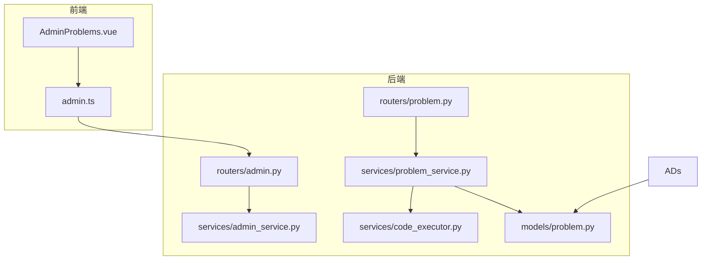
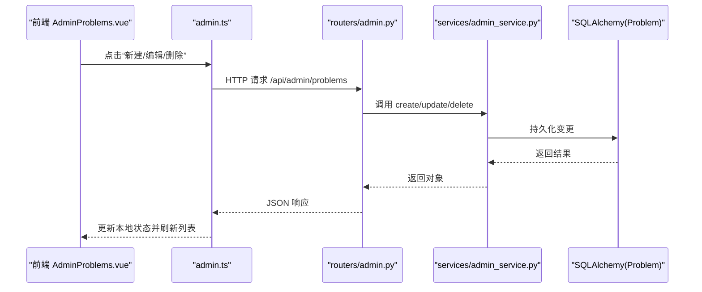
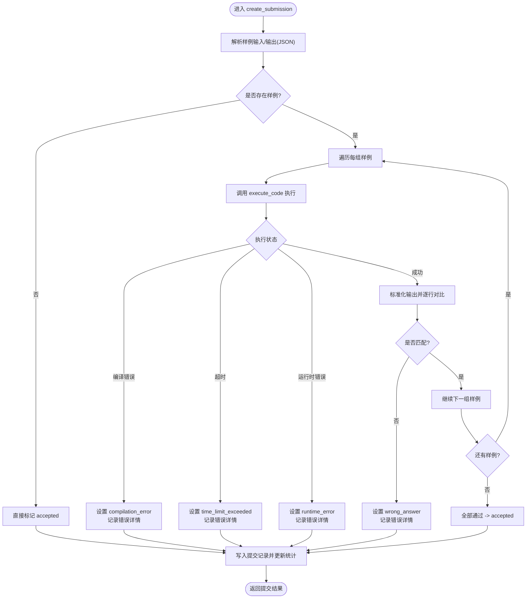
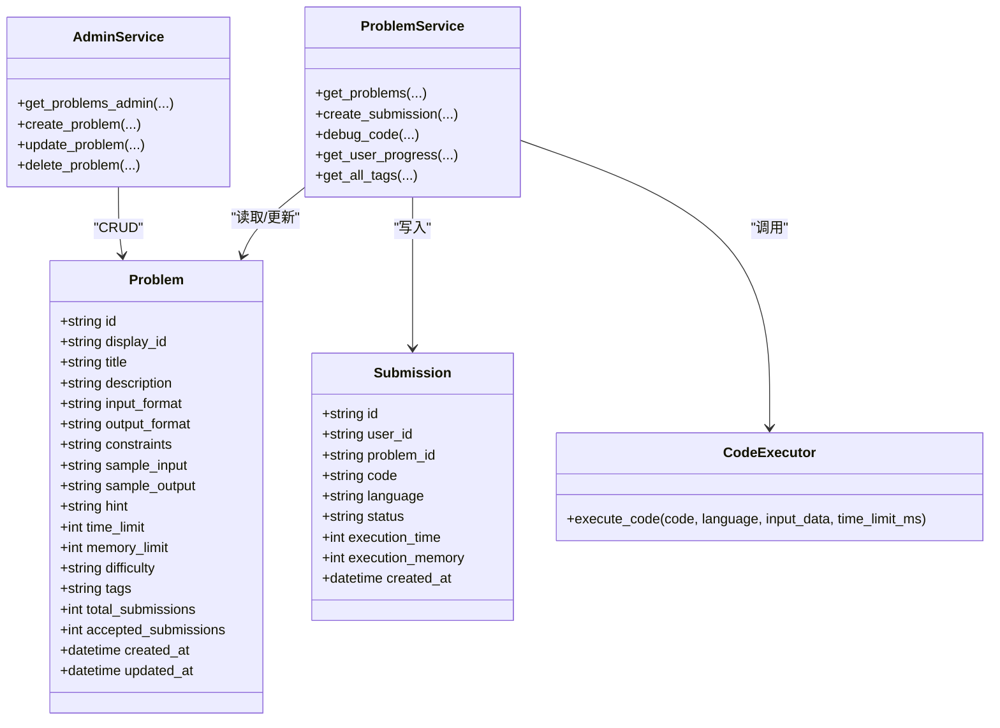
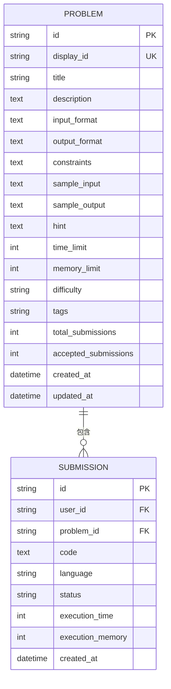

# 题目管理

<cite>
**本文引用的文件**   
- [backEnd/app/models/problem.py](file://backEnd/app/models/problem.py)
- [backEnd/app/routers/problem.py](file://backEnd/app/routers/problem.py)
- [backEnd/app/schemas/problem.py](file://backEnd/app/schemas/problem.py)
- [backEnd/app/services/problem_service.py](file://backEnd/app/services/problem_service.py)
- [backEnd/app/services/code_executor.py](file://backEnd/app/services/code_executor.py)
- [backEnd/app/routers/admin.py](file://backEnd/app/routers/admin.py)
- [backEnd/app/schemas/admin.py](file://backEnd/app/schemas/admin.py)
- [backEnd/app/services/admin_service.py](file://backEnd/app/services/admin_service.py)
- [frontEnd/src/views/admin/AdminProblems.vue](file://frontEnd/src/views/admin/AdminProblems.vue)
- [frontEnd/src/stores/admin.ts](file://frontEnd/src/stores/admin.ts)
</cite>

## 目录
1. [简介](#简介)
2. [项目结构](#项目结构)
3. [核心组件](#核心组件)
4. [架构总览](#架构总览)
5. [详细组件分析](#详细组件分析)
6. [依赖关系分析](#依赖关系分析)
7. [性能与优化](#性能与优化)
8. [故障排查指南](#故障排查指南)
9. [结论](#结论)
10. [附录：API 定义与数据模型](#附录api-定义与数据模型)

## 简介
本技术文档聚焦“题目管理”模块，覆盖编程题目的增删改查、难度分类、标签管理、测试用例配置、提交判题流程、用户进度统计等能力。同时说明当前实现中尚未包含的功能（如审核流、版本历史、导入导出、批量操作）以及扩展建议，帮助开发者构建专业的在线编程平台管理界面。

## 项目结构
后端采用 FastAPI + SQLAlchemy 异步 ORM，前端使用 Vue 3 + Pinia。题目相关代码主要分布在以下位置：
- 数据模型：models/problem.py
- 路由层：routers/problem.py（用户侧）、routers/admin.py（管理端）
- 业务服务：services/problem_service.py、services/admin_service.py
- 执行器：services/code_executor.py
- 前端页面：views/admin/AdminProblems.vue
- 前端状态：stores/admin.ts

图示来源
- [backEnd/app/routers/admin.py:104-162](file://backEnd/app/routers/admin.py#L104-L162)
- [backEnd/app/routers/problem.py:47-175](file://backEnd/app/routers/problem.py#L47-L175)
- [backEnd/app/services/admin_service.py:104-171](file://backEnd/app/services/admin_service.py#L104-L171)
- [backEnd/app/services/problem_service.py:24-442](file://backEnd/app/services/problem_service.py#L24-L442)
- [backEnd/app/services/code_executor.py:270-321](file://backEnd/app/services/code_executor.py#L270-L321)
- [backEnd/app/models/problem.py:17-88](file://backEnd/app/models/problem.py#L17-L88)
- [frontEnd/src/views/admin/AdminProblems.vue:1-340](file://frontEnd/src/views/admin/AdminProblems.vue#L1-L340)
- [frontEnd/src/stores/admin.ts:146-191](file://frontEnd/src/stores/admin.ts#L146-L191)

章节来源
- [backEnd/app/models/problem.py:17-88](file://backEnd/app/models/problem.py#L17-L88)
- [backEnd/app/routers/problem.py:47-175](file://backEnd/app/routers/problem.py#L47-L175)
- [backEnd/app/routers/admin.py:104-162](file://backEnd/app/routers/admin.py#L104-L162)
- [backEnd/app/services/problem_service.py:24-442](file://backEnd/app/services/problem_service.py#L24-L442)
- [backEnd/app/services/admin_service.py:104-171](file://backEnd/app/services/admin_service.py#L104-L171)
- [backEnd/app/services/code_executor.py:270-321](file://backEnd/app/services/code_executor.py#L270-L321)
- [frontEnd/src/views/admin/AdminProblems.vue:1-340](file://frontEnd/src/views/admin/AdminProblems.vue#L1-L340)
- [frontEnd/src/stores/admin.ts:146-191](file://frontEnd/src/stores/admin.ts#L146-L191)

## 核心组件
- 数据模型
  - Problem：题目主表，包含显示ID、标题、描述、输入输出格式、约束、样例、提示、时间/内存限制、难度、标签、提交统计、创建/更新时间等字段。
  - Submission：提交记录，关联用户与题目，记录代码、语言、状态、耗时、内存、时间戳。
- 路由层
  - 用户侧 /api/problems：列表查询、详情、提交、调试、标签选项、用户进度。
  - 管理端 /api/admin/problems：增删改查（需管理员权限）。
- 服务层
  - problem_service：题目筛选分页、提交判题、调试、用户进度统计、标签聚合、结果组装。
  - admin_service：管理端题目 CRUD、分页与搜索。
- 执行器
  - code_executor：多语言安全沙箱执行（Python/C/C++/Java/JS），关键词黑名单、子进程隔离、超时控制、临时目录清理。
- 前端
  - AdminProblems.vue：题库管理界面，支持新建/编辑/删除、筛选、分页。
  - admin.ts：Pinia Store，封装 API 请求、状态管理与错误处理。

章节来源
- [backEnd/app/models/problem.py:17-88](file://backEnd/app/models/problem.py#L17-L88)
- [backEnd/app/routers/problem.py:47-175](file://backEnd/app/routers/problem.py#L47-L175)
- [backEnd/app/routers/admin.py:104-162](file://backEnd/app/routers/admin.py#L104-L162)
- [backEnd/app/services/problem_service.py:24-442](file://backEnd/app/services/problem_service.py#L24-L442)
- [backEnd/app/services/admin_service.py:104-171](file://backEnd/app/services/admin_service.py#L104-L171)
- [backEnd/app/services/code_executor.py:270-321](file://backEnd/app/services/code_executor.py#L270-L321)
- [frontEnd/src/views/admin/AdminProblems.vue:1-340](file://frontEnd/src/views/admin/AdminProblems.vue#L1-L340)
- [frontEnd/src/stores/admin.ts:146-191](file://frontEnd/src/stores/admin.ts#L146-L191)

## 架构总览
下图展示从前端到后端的完整调用链路，包括管理端题目 CRUD 与用户侧提交判题流程。

图示来源
- [frontEnd/src/views/admin/AdminProblems.vue:293-322](file://frontEnd/src/views/admin/AdminProblems.vue#L293-L322)
- [frontEnd/src/stores/admin.ts:169-191](file://frontEnd/src/stores/admin.ts#L169-L191)
- [backEnd/app/routers/admin.py:125-162](file://backEnd/app/routers/admin.py#L125-L162)
- [backEnd/app/services/admin_service.py:135-171](file://backEnd/app/services/admin_service.py#L135-L171)
- [backEnd/app/models/problem.py:17-53](file://backEnd/app/models/problem.py#L17-L53)

## 详细组件分析

### 数据模型与数据结构
- Problem 字段概览
  - 标识：id、display_id（唯一索引）
  - 内容：title、description、input_format、output_format、constraints、sample_input、sample_output、hint
  - 运行参数：time_limit、memory_limit
  - 分类：difficulty（easy/medium/hard）、tags（逗号分隔字符串）
  - 统计：total_submissions、accepted_submissions
  - 审计：created_at、updated_at
- Submission 字段概览
  - 关联：user_id、problem_id
  - 提交：code、language、status、execution_time、execution_memory、created_at

复杂度与索引
- display_id 唯一索引便于快速查找；difficulty 索引用于筛选；user_id、problem_id、status 在提交查询中常用。
- tags 为逗号分隔字符串，适合轻量场景；复杂标签体系可考虑独立表+多对多关系以提升查询效率。

章节来源
- [backEnd/app/models/problem.py:17-88](file://backEnd/app/models/problem.py#L17-L88)

### 路由与接口设计
- 用户侧
  - GET /api/problems：支持 difficulty、tag、keyword、page、size 筛选与分页；可选认证以标记 user_solved。
  - GET /api/problems/{problem_id}：获取详情，附带通过率与是否已通过。
  - POST /api/problems/{problem_id}/submit：提交代码，触发判题。
  - POST /api/problems/{problem_id}/debug：调试代码，仅返回执行输出。
  - GET /api/problems/tags/options：获取所有标签集合。
  - GET /api/problems/progress：用户进度统计（按难度/标签/最近提交）。
- 管理端
  - GET /api/admin/problems：管理端题目列表（支持 keyword、difficulty、分页）。
  - POST /api/admin/problems：创建题目。
  - PUT /api/admin/problems/{problem_id}：更新题目。
  - DELETE /api/admin/problems/{problem_id}：删除题目。

校验与错误
- 难度枚举校验（正则）；语言白名单校验；缺失必填字段时返回 422；不存在资源返回 404。

章节来源
- [backEnd/app/routers/problem.py:47-175](file://backEnd/app/routers/problem.py#L47-L175)
- [backEnd/app/routers/admin.py:104-162](file://backEnd/app/routers/admin.py#L104-L162)
- [backEnd/app/schemas/problem.py:1-130](file://backEnd/app/schemas/problem.py#L1-L130)
- [backEnd/app/schemas/admin.py:47-98](file://backEnd/app/schemas/admin.py#L47-L98)

### 业务服务与判题流程
- 题目查询
  - get_problems：支持难度、标签模糊匹配、关键字（标题/描述）检索；分页排序按 display_id。
  - get_all_tags：解析 tags 字段，去重并排序返回。
- 提交判题
  - create_submission：解析 sample_input/output（JSON 数组），逐组执行代码，比较标准化后的输出行；记录 status 与错误详情；更新题目统计。
  - debug_code：直接执行并返回 stdout/stderr/退出码/耗时/状态。
- 用户进度
  - get_user_progress：汇总提交数、通过数、尝试/通过题目数；按难度与标签维度统计；返回最近提交摘要。

判题流程图

图示来源
- [backEnd/app/services/problem_service.py:95-179](file://backEnd/app/services/problem_service.py#L95-L179)
- [backEnd/app/services/code_executor.py:270-321](file://backEnd/app/services/code_executor.py#L270-L321)

章节来源
- [backEnd/app/services/problem_service.py:24-442](file://backEnd/app/services/problem_service.py#L24-L442)
- [backEnd/app/services/code_executor.py:270-321](file://backEnd/app/services/code_executor.py#L270-L321)

### 代码执行器与安全策略
- 支持语言：python3、c、cpp、java、javascript。
- 安全策略：
  - 危险关键词黑名单（跨语言通用 + 各语言专属）。
  - 子进程隔离执行，临时目录读写，超时控制。
  - 自动检测编译器路径，支持 .env 覆盖。
- 执行结果：标准输出/错误、退出码、耗时、状态（success/compilation_error/runtime_error/time_limit_exceeded）。

章节来源
- [backEnd/app/services/code_executor.py:1-444](file://backEnd/app/services/code_executor.py#L1-L444)

### 前端管理界面与交互
- 功能点
  - 列表展示：ID、标题、难度、标签、通过/提交数、操作按钮。
  - 筛选：关键词、难度下拉。
  - 新建/编辑弹窗：表单字段与后端模型一致，含必填校验。
  - 删除确认与失败提示。
  - 分页组件集成。
- 状态管理
  - admin.ts 提供 fetchProblems/createProblem/updateProblem/deleteProblem 等方法，统一错误处理与状态更新。

章节来源
- [frontEnd/src/views/admin/AdminProblems.vue:1-340](file://frontEnd/src/views/admin/AdminProblems.vue#L1-L340)
- [frontEnd/src/stores/admin.ts:146-191](file://frontEnd/src/stores/admin.ts#L146-L191)

## 依赖关系分析
- 模块耦合
  - routers/admin.py 依赖 admin_service.py 进行业务逻辑与数据库访问。
  - routers/problem.py 依赖 problem_service.py 完成判题与统计。
  - problem_service.py 依赖 code_executor.py 执行用户代码。
  - 前端 AdminProblems.vue 依赖 admin.ts 的 Store 方法发起网络请求。
- 外部依赖
  - 编译器/解释器：gcc/g++/javac/java/node/python，通过环境变量或 PATH 自动发现。
  - 数据库：SQLAlchemy 异步会话。

图示来源
- [backEnd/app/models/problem.py:17-88](file://backEnd/app/models/problem.py#L17-L88)
- [backEnd/app/services/problem_service.py:24-442](file://backEnd/app/services/problem_service.py#L24-L442)
- [backEnd/app/services/code_executor.py:270-321](file://backEnd/app/services/code_executor.py#L270-L321)
- [backEnd/app/services/admin_service.py:104-171](file://backEnd/app/services/admin_service.py#L104-L171)

章节来源
- [backEnd/app/models/problem.py:17-88](file://backEnd/app/models/problem.py#L17-L88)
- [backEnd/app/services/problem_service.py:24-442](file://backEnd/app/services/problem_service.py#L24-L442)
- [backEnd/app/services/admin_service.py:104-171](file://backEnd/app/services/admin_service.py#L104-L171)
- [backEnd/app/services/code_executor.py:270-321](file://backEnd/app/services/code_executor.py#L270-L321)

## 性能与优化
- 查询优化
  - 使用索引字段（difficulty、display_id、user_id、problem_id、status）提升筛选与统计性能。
  - 标签采用逗号分隔字符串，适合小规模；若标签数量增长，建议引入独立标签表与多对多关系，避免 ilike 全表扫描。
- 判题性能
  - 样例执行串行化，可通过并发队列与线程池提升吞吐；注意隔离与资源回收。
  - 输出比较已做标准化（换行符统一、空白去除、空行过滤），减少误判。
- 执行器优化
  - 编译器路径缓存、预热；限制最大工作线程数避免系统过载。
  - 临时目录清理确保磁盘空间稳定。
- 前端体验
  - 分页与筛选联动，减少不必要的数据传输。
  - 错误信息集中处理，提升用户体验。

[本节为通用性能建议，不直接分析具体文件]

## 故障排查指南
- 常见错误
  - 404 题目不存在：检查路由参数与数据库记录。
  - 422 参数校验失败：检查难度枚举、语言白名单、必填字段。
  - 403 无管理员权限：检查登录用户是否满足管理员条件。
  - 判题错误
    - compilation_error：查看 stderr 中的编译错误信息。
    - runtime_error：检查运行时异常与越界等问题。
    - time_limit_exceeded：优化算法复杂度或调整 time_limit。
    - wrong_answer：核对样例输入输出格式与标准化规则。
- 定位步骤
  - 查看后端日志（执行器会记录被拦截的危险片段）。
  - 检查数据库提交记录的状态与错误详情。
  - 前端控制台与网络面板查看请求/响应体。

章节来源
- [backEnd/app/routers/problem.py:102-175](file://backEnd/app/routers/problem.py#L102-L175)
- [backEnd/app/routers/admin.py:24-34](file://backEnd/app/routers/admin.py#L24-L34)
- [backEnd/app/services/problem_service.py:95-179](file://backEnd/app/services/problem_service.py#L95-L179)
- [backEnd/app/services/code_executor.py:154-167](file://backEnd/app/services/code_executor.py#L154-L167)

## 结论
当前题目管理模块已具备完整的题目 CRUD、难度与标签管理、样例配置、提交判题与用户进度统计能力，并提供管理端界面与基础权限控制。尚未实现的特性包括：题目审核流程、版本管理与历史记录、导入导出与批量操作。建议在现有基础上逐步完善这些高级特性，以满足专业在线编程平台的管理需求。

[本节为总结性内容，不直接分析具体文件]

## 附录：API 定义与数据模型

### 管理端题目接口
- GET /api/admin/problems
  - 查询参数：keyword、difficulty、page、size
  - 响应：problems 列表、total、page、size
- POST /api/admin/problems
  - 请求体：AdminProblemCreate
  - 响应：AdminProblemItem
- PUT /api/admin/problems/{problem_id}
  - 请求体：AdminProblemUpdate
  - 响应：AdminProblemItem
- DELETE /api/admin/problems/{problem_id}
  - 响应：消息体

章节来源
- [backEnd/app/routers/admin.py:104-162](file://backEnd/app/routers/admin.py#L104-L162)
- [backEnd/app/schemas/admin.py:47-98](file://backEnd/app/schemas/admin.py#L47-L98)

### 用户侧题目接口
- GET /api/problems
  - 查询参数：difficulty、tag、keyword、page、size
  - 响应：ProblemListResponse
- GET /api/problems/{problem_id}
  - 响应：ProblemDetail
- POST /api/problems/{problem_id}/submit
  - 请求体：SubmissionCreate
  - 响应：SubmissionResponse
- POST /api/problems/{problem_id}/debug
  - 请求体：DebugRequest
  - 响应：DebugResponse
- GET /api/problems/tags/options
  - 响应：{tags: string[]}
- GET /api/problems/progress
  - 响应：UserProgressResponse

章节来源
- [backEnd/app/routers/problem.py:47-175](file://backEnd/app/routers/problem.py#L47-L175)
- [backEnd/app/schemas/problem.py:1-130](file://backEnd/app/schemas/problem.py#L1-L130)

### 数据模型 ER 图

图示来源
- [backEnd/app/models/problem.py:17-88](file://backEnd/app/models/problem.py#L17-L88)