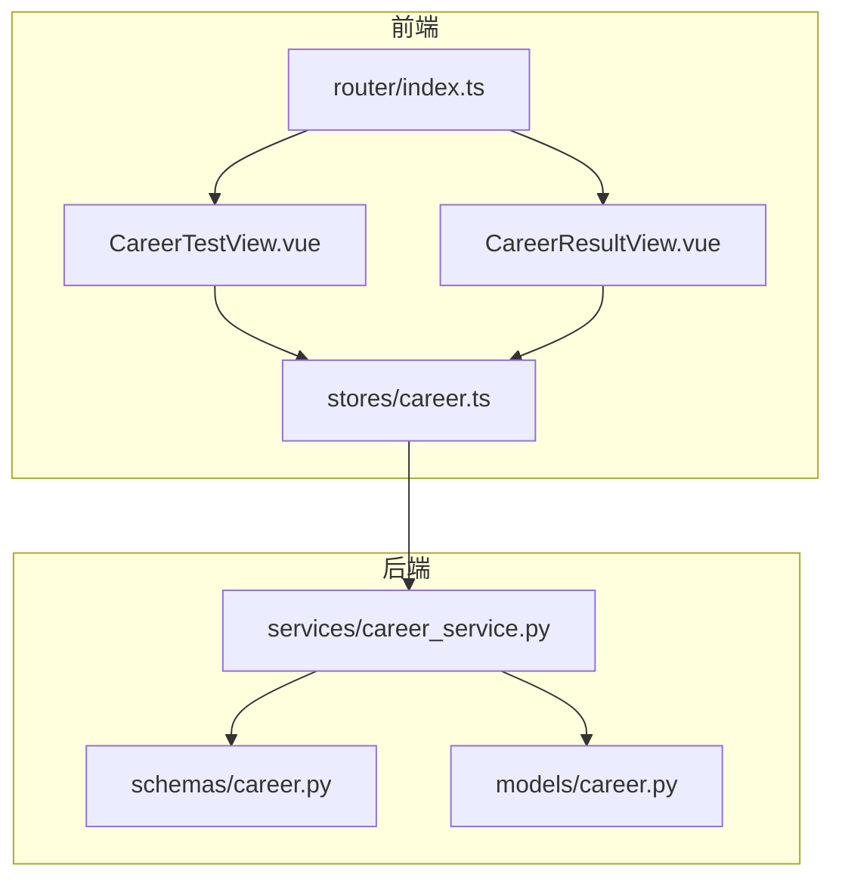
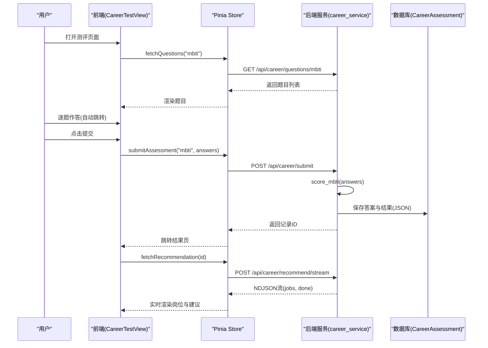
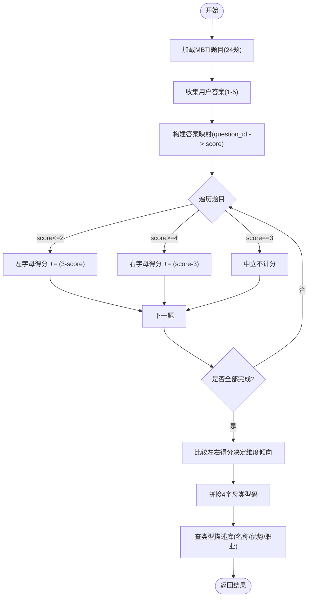
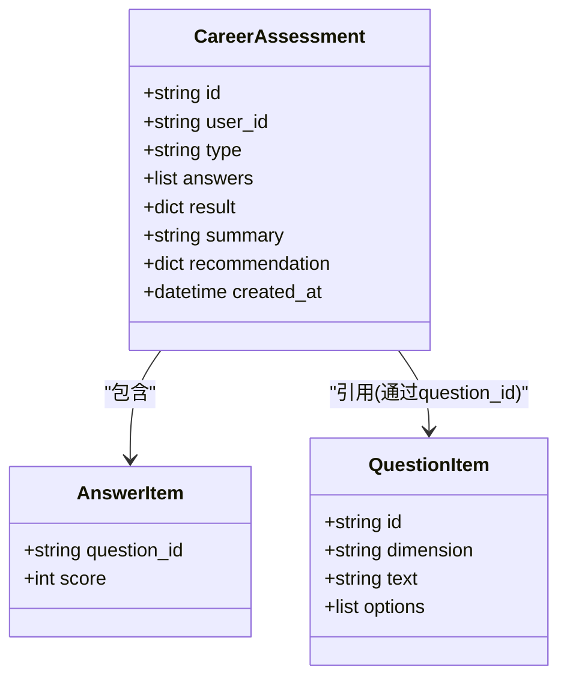
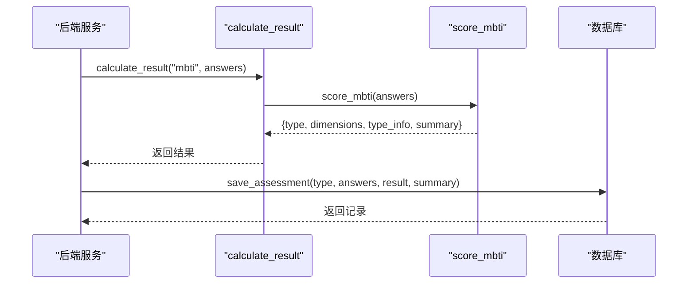
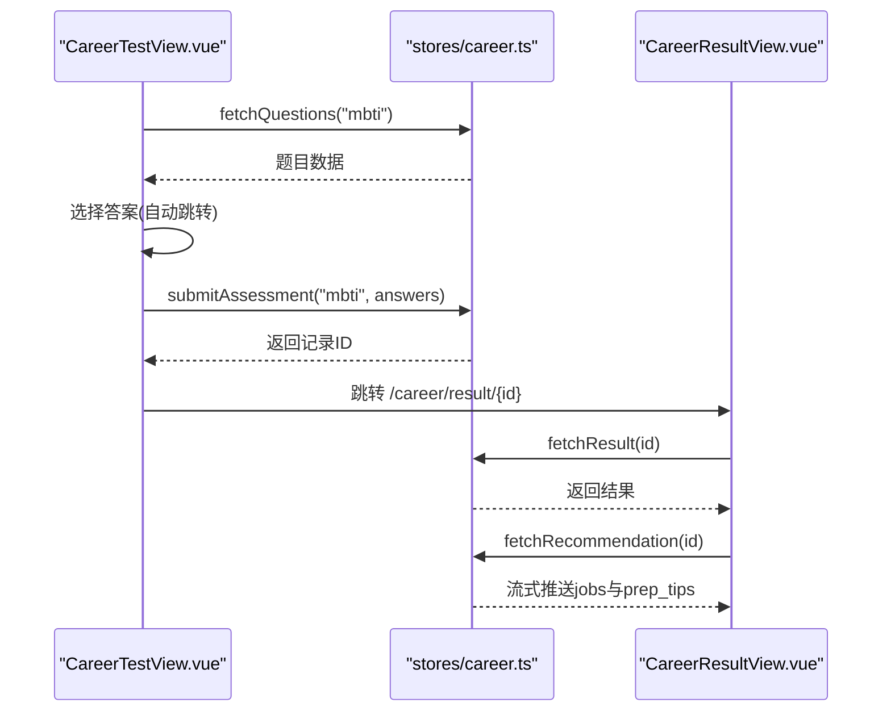
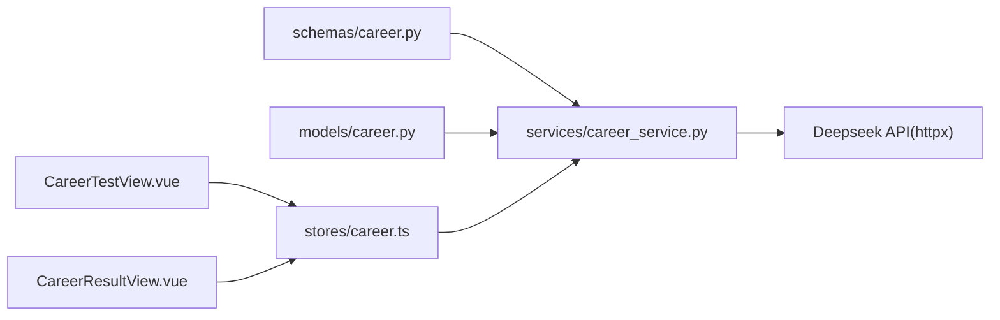

# MBTI性格测试

<cite>
**本文引用的文件**
- [career_service.py](file://backEnd/app/services/career_service.py)
- [career.py](file://backEnd/app/models/career.py)
- [career.py（schemas）](file://backEnd/app/schemas/career.py)
- [CareerTestView.vue](file://frontEnd/src/views/CareerTestView.vue)
- [CareerResultView.vue](file://frontEnd/src/views/CareerResultView.vue)
- [career.ts（store）](file://frontEnd/src/stores/career.ts)
- [index.ts（路由）](file://frontEnd/src/router/index.ts)
</cite>

## 目录
1. [简介](#简介)
2. [项目结构](#项目结构)
3. [核心组件](#核心组件)
4. [架构总览](#架构总览)
5. [详细组件分析](#详细组件分析)
6. [依赖关系分析](#依赖关系分析)
7. [性能考量](#性能考量)
8. [故障排查指南](#故障排查指南)
9. [结论](#结论)
10. [附录](#附录)

## 简介
本技术文档聚焦于MBTI性格测试功能，覆盖以下方面：
- 四个维度（外向/内向、实感/直觉、思考/情感、判断/感知）的测评算法与题目设计逻辑
- 评分权重计算与类型判定规则
- 用户答题记录的数据结构设计、答案存储格式与结果计算流程
- MBTI类型与职业匹配的核心机制（含16种人格类型的特征描述与职业发展建议生成）
- 前端交互流程与结果可视化展示实现方式

## 项目结构
后端采用FastAPI + SQLAlchemy + JSON字段存储；前端使用Vue 3 + Pinia + ECharts。关键路径如下：
- 题库与评分：服务层集中定义量表与算法
- 数据模型：测评记录包含原始答案、结构化结果与摘要
- 前端页面：答题页与结果页，结合流式AI推荐



图表来源
- [career_service.py:195-207](file://backEnd/app/services/career_service.py#L195-L207)
- [career.py（schemas）:1-59](file://backEnd/app/schemas/career.py#L1-L59)
- [career.py:1-56](file://backEnd/app/models/career.py#L1-L56)
- [CareerTestView.vue:1-226](file://frontEnd/src/views/CareerTestView.vue#L1-L226)
- [CareerResultView.vue:1-561](file://frontEnd/src/views/CareerResultView.vue#L1-L561)
- [career.ts（store）:1-223](file://frontEnd/src/stores/career.ts#L1-L223)
- [index.ts（路由）:44-50](file://frontEnd/src/router/index.ts#L44-L50)

章节来源
- [career_service.py:195-207](file://backEnd/app/services/career_service.py#L195-L207)
- [career.py（schemas）:1-59](file://backEnd/app/schemas/career.py#L1-L59)
- [career.py:1-56](file://backEnd/app/models/career.py#L1-L56)
- [CareerTestView.vue:1-226](file://frontEnd/src/views/CareerTestView.vue#L1-L226)
- [CareerResultView.vue:1-561](file://frontEnd/src/views/CareerResultView.vue#L1-L561)
- [career.ts（store）:1-223](file://frontEnd/src/stores/career.ts#L1-L223)
- [index.ts（路由）:44-50](file://frontEnd/src/router/index.ts#L44-L50)

## 核心组件
- 题库与元信息：MBTI量表由24题组成，每维度6题，选项为5级同意度量表
- 评分算法：按维度累计左右字母得分，取较大者为该维度倾向
- 类型描述库：16型人格的名称、描述、优势、适合职业与认知函数
- 数据持久化：答案JSON、结果JSON、摘要文本与时间戳
- 前端交互：逐题选择、自动跳转、提交后进入结果页
- 结果可视化：双向条形图展示四维度分布，并展示类型信息与职业标签
- AI岗位推荐：基于测评结果与简历技能关键词的流式推荐

章节来源
- [career_service.py:94-142](file://backEnd/app/services/career_service.py#L94-L142)
- [career_service.py:254-271](file://backEnd/app/services/career_service.py#L254-L271)
- [career_service.py:346-393](file://backEnd/app/services/career_service.py#L346-L393)
- [career.py:31-50](file://backEnd/app/models/career.py#L31-L50)
- [CareerTestView.vue:125-208](file://frontEnd/src/views/CareerTestView.vue#L125-L208)
- [CareerResultView.vue:261-458](file://frontEnd/src/views/CareerResultView.vue#L261-L458)
- [career.ts（store）:148-207](file://frontEnd/src/stores/career.ts#L148-L207)

## 架构总览
从前端到后端的完整调用链：
- 获取题目：前端请求 /api/career/questions/{type}
- 提交答案：前端POST /api/career/submit，携带 type 与 answers
- 结果查询：前端GET /api/career/result/{id}
- 流式推荐：前端POST /api/career/recommend/stream，返回NDJSON流



图表来源
- [career_service.py:429-450](file://backEnd/app/services/career_service.py#L429-L450)
- [career_service.py:457-475](file://backEnd/app/services/career_service.py#L457-L475)
- [career_service.py:568-668](file://backEnd/app/services/career_service.py#L568-L668)
- [career.ts（store）:94-121](file://frontEnd/src/stores/career.ts#L94-L121)
- [career.ts（store）:148-207](file://frontEnd/src/stores/career.ts#L148-L207)
- [CareerTestView.vue:191-207](file://frontEnd/src/views/CareerTestView.vue#L191-L207)
- [CareerResultView.vue:548-559](file://frontEnd/src/views/CareerResultView.vue#L548-L559)

## 详细组件分析

### MBTI测评算法与题目设计
- 题目设计
  - 四个维度各6题，共24题；每题提供5级同意度量表
  - 正向与反向题混合，统一映射到“左字母”和“右字母”得分
- 评分权重计算
  - 将未作答默认视为中立（不计分）
  - 低分（1/2）累加至左字母，高分（4/5）累加至右字母，分值差值作为权重
  - 每个维度比较左右总分，较大者胜出为该维度倾向
- 类型判定规则
  - 将四个维度的胜出字母拼接得到4字母类型码
  - 根据类型码在类型描述库中查找名称、描述、优势与职业建议



图表来源
- [career_service.py:94-142](file://backEnd/app/services/career_service.py#L94-L142)
- [career_service.py:346-393](file://backEnd/app/services/career_service.py#L346-L393)

章节来源
- [career_service.py:94-142](file://backEnd/app/services/career_service.py#L94-L142)
- [career_service.py:346-393](file://backEnd/app/services/career_service.py#L346-L393)

### 数据结构与存储格式
- 答案项结构
  - question_id：题目唯一标识
  - score：1-5整数
- 测评记录结构
  - user_id：用户标识
  - type：测评类型（holland | mbti | career_values）
  - answers：原始答案数组（JSON）
  - result：计算后的结构化结果（JSON）
  - summary：结果摘要文本
  - recommendation：AI岗位推荐缓存（JSON）
  - created_at：创建时间



图表来源
- [career.py:11-56](file://backEnd/app/models/career.py#L11-L56)
- [career.py（schemas）:11-33](file://backEnd/app/schemas/career.py#L11-L33)

章节来源
- [career.py:11-56](file://backEnd/app/models/career.py#L11-L56)
- [career.py（schemas）:11-33](file://backEnd/app/schemas/career.py#L11-L33)

### 结果计算流程
- 计算入口：calculate_result根据类型分发到具体评分函数
- MBTI评分：score_mbti对答案进行维度聚合与胜者判定，组装类型信息与摘要
- 结果入库：save_assessment调用calculate_result并将结果写入数据库



图表来源
- [career_service.py:441-450](file://backEnd/app/services/career_service.py#L441-L450)
- [career_service.py:346-393](file://backEnd/app/services/career_service.py#L346-L393)
- [career_service.py:457-475](file://backEnd/app/services/career_service.py#L457-L475)

章节来源
- [career_service.py:441-450](file://backEnd/app/services/career_service.py#L441-L450)
- [career_service.py:346-393](file://backEnd/app/services/career_service.py#L346-L393)
- [career_service.py:457-475](file://backEnd/app/services/career_service.py#L457-L475)

### MBTI类型与职业匹配机制
- 类型描述库：包含16种人格类型的名称、描述、优势、适合职业与认知函数
- 匹配策略：根据结果类型直接检索对应条目，输出优势与职业标签
- 扩展建议：可结合用户简历技能关键词与岗位画像进行加权匹配（当前以静态描述为主）

```mermaid
classDiagram
class MBTI_TYPE_DESC {
+INTJ : {name, desc, strengths, careers, cognitive_functions}
+INTP : {name, desc, strengths, careers, cognitive_functions}
+ENTJ : {name, desc, strengths, careers, cognitive_functions}
+... : "其余13型..."
}
class Result {
+string type
+dict dimensions
+dict type_info
+string summary
}
Result --> MBTI_TYPE_DESC : "按type检索"
```

图表来源
- [career_service.py:254-271](file://backEnd/app/services/career_service.py#L254-L271)
- [career_service.py:386-393](file://backEnd/app/services/career_service.py#L386-L393)

章节来源
- [career_service.py:254-271](file://backEnd/app/services/career_service.py#L254-L271)
- [career_service.py:386-393](file://backEnd/app/services/career_service.py#L386-L393)

### 前端交互与结果可视化
- 答题页交互
  - 逐题显示、选中高亮、自动延迟跳转下一题、支持上一题回退
  - 进度条实时更新，全部答完后显示提交按钮
- 结果页可视化
  - MBTI类型卡片：展示类型码、名称、描述、角色插图
  - 四维度双向条形图：展示左右比例与倾向
  - 优势与职业标签：从类型描述库提取并展示
  - AI岗位推荐：流式接收NDJSON，逐步渲染岗位与建议



图表来源
- [CareerTestView.vue:125-208](file://frontEnd/src/views/CareerTestView.vue#L125-L208)
- [career.ts（store）:94-121](file://frontEnd/src/stores/career.ts#L94-L121)
- [CareerResultView.vue:261-458](file://frontEnd/src/views/CareerResultView.vue#L261-L458)
- [career.ts（store）:148-207](file://frontEnd/src/stores/career.ts#L148-L207)

章节来源
- [CareerTestView.vue:125-208](file://frontEnd/src/views/CareerTestView.vue#L125-L208)
- [career.ts（store）:94-121](file://frontEnd/src/stores/career.ts#L94-L121)
- [CareerResultView.vue:261-458](file://frontEnd/src/views/CareerResultView.vue#L261-L458)
- [career.ts（store）:148-207](file://frontEnd/src/stores/career.ts#L148-L207)

## 依赖关系分析
- 模块耦合
  - 服务层依赖Pydantic Schema进行输入校验与响应建模
  - 服务层依赖SQLAlchemy模型进行持久化
  - 前端Store封装HTTP请求，视图组件仅消费状态
- 外部依赖
  - 流式推荐依赖Deepseek API（通过httpx异步客户端）
  - 前端ECharts用于图表渲染



图表来源
- [career.py（schemas）:1-59](file://backEnd/app/schemas/career.py#L1-L59)
- [career.py:1-56](file://backEnd/app/models/career.py#L1-L56)
- [career_service.py:568-668](file://backEnd/app/services/career_service.py#L568-L668)
- [career.ts（store）:1-223](file://frontEnd/src/stores/career.ts#L1-L223)
- [CareerTestView.vue:1-226](file://frontEnd/src/views/CareerTestView.vue#L1-L226)
- [CareerResultView.vue:1-561](file://frontEnd/src/views/CareerResultView.vue#L1-L561)

章节来源
- [career.py（schemas）:1-59](file://backEnd/app/schemas/career.py#L1-L59)
- [career.py:1-56](file://backEnd/app/models/career.py#L1-L56)
- [career_service.py:568-668](file://backEnd/app/services/career_service.py#L568-L668)
- [career.ts（store）:1-223](file://frontEnd/src/stores/career.ts#L1-L223)
- [CareerTestView.vue:1-226](file://frontEnd/src/views/CareerTestView.vue#L1-L226)
- [CareerResultView.vue:1-561](file://frontEnd/src/views/CareerResultView.vue#L1-L561)

## 性能考量
- 评分复杂度
  - MBTI评分O(n)，n为题目数（24），常数级开销，整体高效
- 流式推荐
  - 使用NDJSON流式传输，避免长连接阻塞，提升首屏体验
- 前端渲染
  - ECharts按需注册组件，减少包体；SVG动态生成雷达图/环形图，降低第三方依赖

[本节为通用指导，不直接分析具体文件]

## 故障排查指南
- 常见错误
  - 网络请求失败：检查鉴权头与后端接口可用性
  - 流式解析异常：确认后端NDJSON格式与前端的data:行解析逻辑
  - 题目未加载：检查路由参数type是否正确
- 定位方法
  - 查看前端Store的错误状态与日志
  - 检查后端返回的JSON结构与字段完整性
  - 核对数据库中的answers与result字段是否一致

章节来源
- [career.ts（store）:148-207](file://frontEnd/src/stores/career.ts#L148-L207)
- [career_service.py:457-475](file://backEnd/app/services/career_service.py#L457-L475)

## 结论
本系统实现了完整的MBTI测评链路：从题库定义、评分算法、类型判定，到数据存储与前端可视化，并提供AI驱动的岗位推荐。算法简洁可靠，前后端职责清晰，具备良好的可扩展性与用户体验。

[本节为总结性内容，不直接分析具体文件]

## 附录
- 路由配置
  - 测评页：/career/test/:type
  - 结果页：/career/result/:id

章节来源
- [index.ts（路由）:44-50](file://frontEnd/src/router/index.ts#L44-L50)