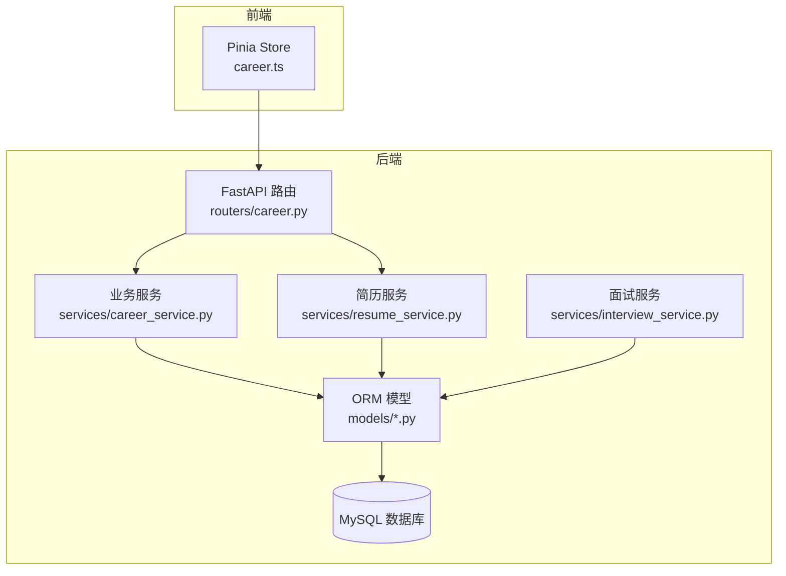
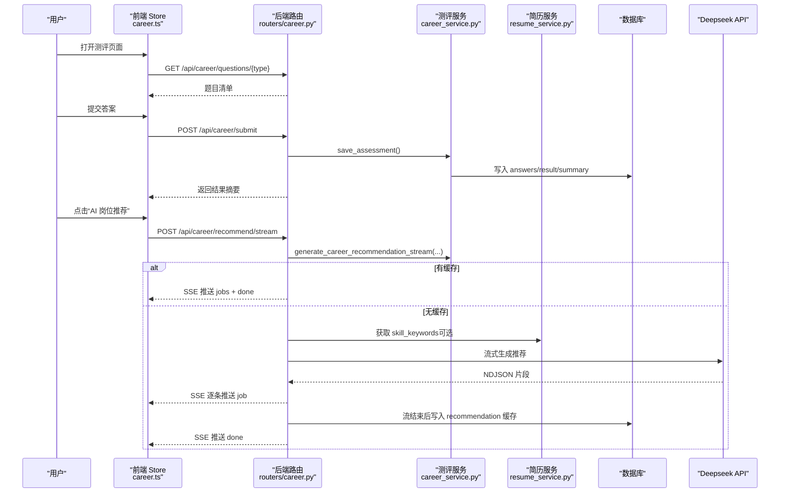
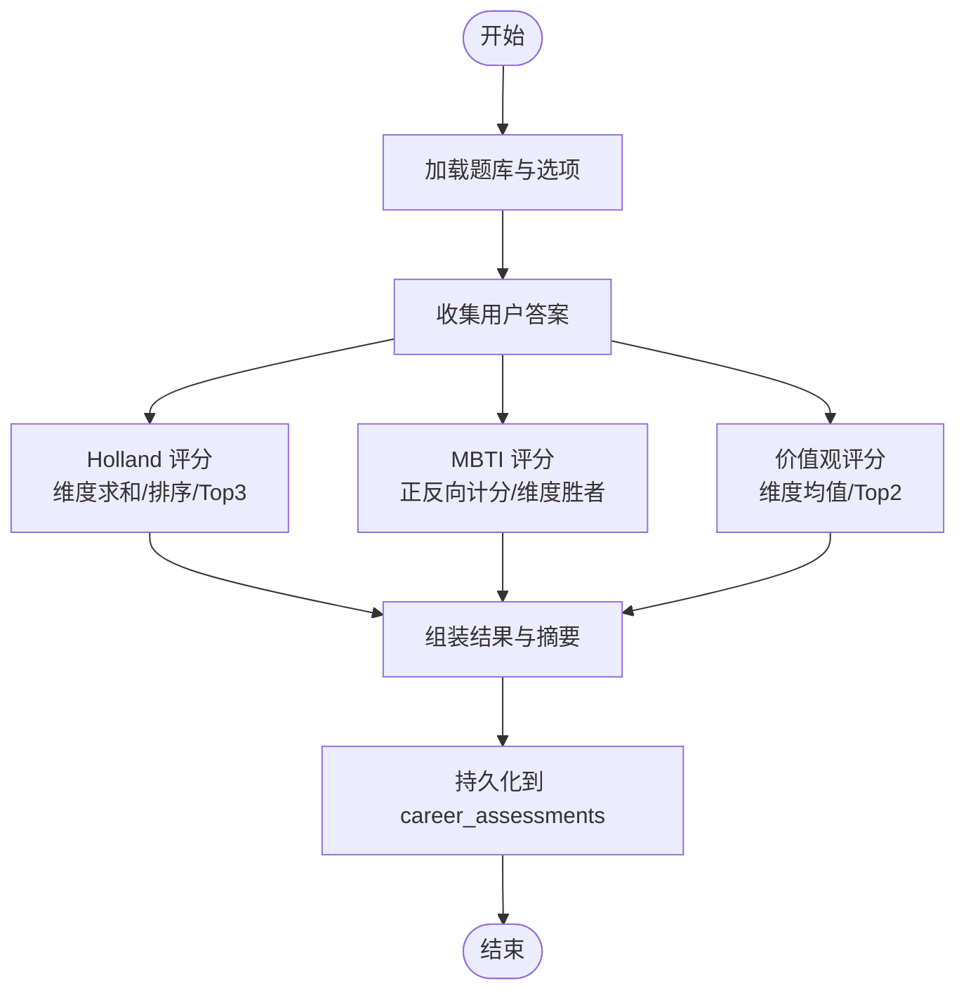
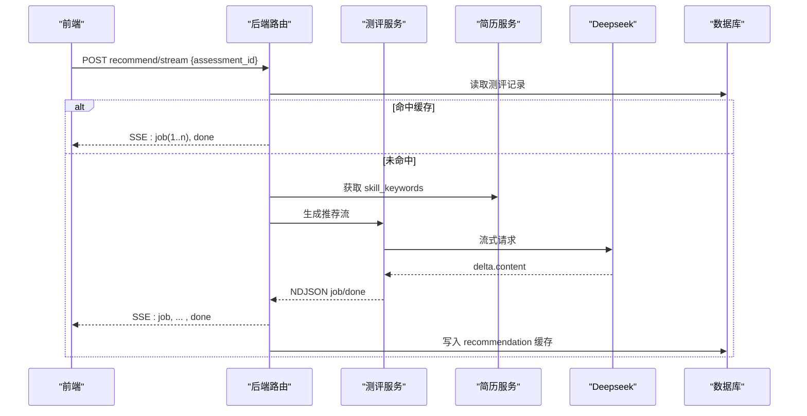
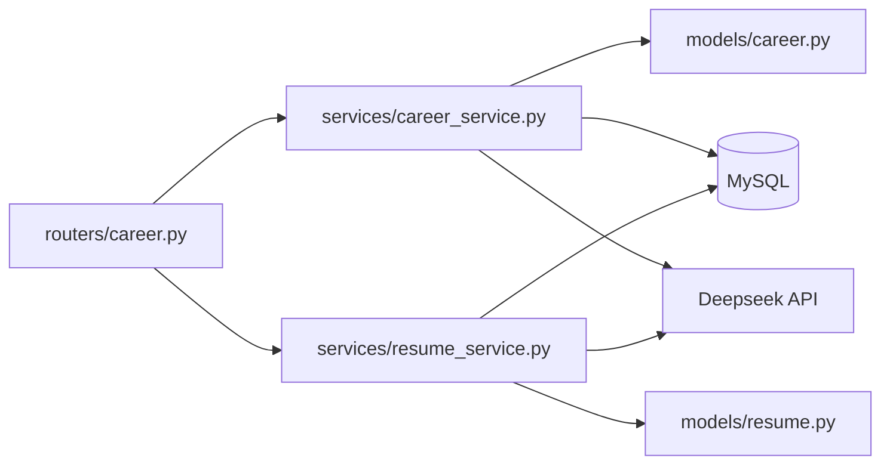
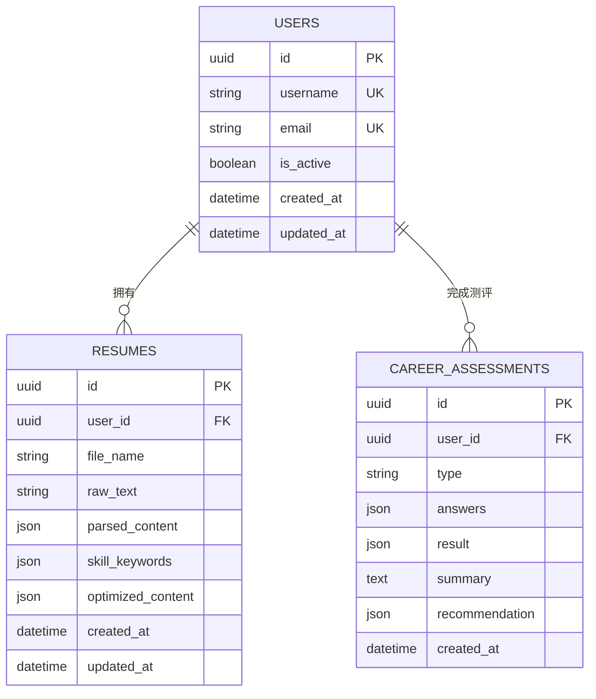

# 技能矩阵评估

<cite>
**本文引用的文件**   
- [career.py](file://backEnd/app/models/career.py)
- [career_service.py](file://backEnd/app/services/career_service.py)
- [career.py](file://backEnd/app/routers/career.py)
- [career.py](file://backEnd/app/schemas/career.py)
- [resume.py](file://backEnd/app/models/resume.py)
- [resume_service.py](file://backEnd/app/services/resume_service.py)
- [user.py](file://backEnd/app/models/user.py)
- [interview_service.py](file://backEnd/app/services/interview_service.py)
- [hr_interview.sql](file://hr_interview.sql)
- [career.ts](file://frontEnd/src/stores/career.ts)
</cite>

## 目录
1. [引言](#引言)
2. [项目结构](#项目结构)
3. [核心组件](#核心组件)
4. [架构总览](#架构总览)
5. [详细组件分析](#详细组件分析)
6. [依赖关系分析](#依赖关系分析)
7. [性能与可扩展性](#性能与可扩展性)
8. [故障排查指南](#故障排查指南)
9. [结论](#结论)
10. [附录：数据模型与接口定义](#附录数据模型与接口定义)

## 引言
本技术文档围绕“技能矩阵评估系统”的现有实现进行系统化梳理，重点覆盖以下目标：
- 多技能维度评估模型设计：基于职业兴趣（Holland RIASEC）、性格类型（MBTI）与职业价值观三大测评体系，形成可量化的能力画像。
- 技能水平分级与量化评分方法：说明各维度的计分规则、等级划分思路及可视化映射方式。
- 技能缺口分析算法：结合岗位需求与个人画像，计算差距并给出优先级排序逻辑。
- 技能提升路径规划：提供学习资源推荐、时间投入估算与里程碑设置的核心算法思路。
- 可视化展示与动态更新机制：前端 SSE 流式渲染、缓存命中与增量推送策略。

需要特别说明的是：当前仓库未直接实现“技术技能/软技能/管理能力”等岗位级技能矩阵的显式建模与打分；但系统已具备完善的测评与简历解析基础，可作为构建岗位技能矩阵的前置能力层。本文在尊重源码事实的基础上，对缺失部分给出扩展设计与落地建议。

## 项目结构
后端采用 FastAPI + SQLAlchemy 异步 ORM，前端为 Vue3 + Pinia + Vite。核心模块包括：
- 职业测评服务：题库、评分算法、结果持久化、AI 岗位推荐（SSE 流式）。
- 简历服务：结构化提取、措辞优化、关键词抽取（Deepseek API）。
- 面试服务：多维雷达图评分与改进建议生成（可用于能力维度可视化参考）。
- 前端 Store：统一封装 API 调用、SSE 流处理与状态管理。

图表来源
- [career.py:1-158](file://backEnd/app/routers/career.py#L1-L158)
- [career_service.py:1-669](file://backEnd/app/services/career_service.py#L1-L669)
- [resume_service.py:1-285](file://backEnd/app/services/resume_service.py#L1-L285)
- [interview_service.py:944-1077](file://backEnd/app/services/interview_service.py#L944-L1077)
- [career.py:1-56](file://backEnd/app/models/career.py#L1-L56)
- [resume.py:1-67](file://backEnd/app/models/resume.py#L1-L67)
- [user.py:1-45](file://backEnd/app/models/user.py#L1-L45)

章节来源
- [career.py:1-158](file://backEnd/app/routers/career.py#L1-L158)
- [career_service.py:1-669](file://backEnd/app/services/career_service.py#L1-L669)
- [resume_service.py:1-285](file://backEnd/app/services/resume_service.py#L1-L285)
- [interview_service.py:944-1077](file://backEnd/app/services/interview_service.py#L944-L1077)
- [career.py:1-56](file://backEnd/app/models/career.py#L1-L56)
- [resume.py:1-67](file://backEnd/app/models/resume.py#L1-L67)
- [user.py:1-45](file://backEnd/app/models/user.py#L1-L45)

## 核心组件
- 测评服务（career_service.py）
  - 题库与元信息：Holland 六维度（R/I/A/S/E/C）、MBTI 四维度（EI/SN/TF/JP）、职业价值观六维度（成就感/经济报酬/自主性/社会贡献/人际关系/工作环境）。
  - 评分算法：按维度聚合得分、排序取 Top-N、输出摘要与结构化结果。
  - 数据库 CRUD：保存测评记录、查询历史与详情。
  - AI 岗位推荐：基于 Deepseek 流式返回 job 列表与 prep_tips，支持缓存命中。
- 简历服务（resume_service.py）
  - 结构化提取与关键词抽取：用于后续技能匹配与推荐增强。
  - 措辞优化：流式输出优化条目与统计信息。
- 面试服务（interview_service.py）
  - 多维雷达图评分：专业、逻辑、沟通、岗位匹配度等维度，便于可视化参考。
- 前端 Store（career.ts）
  - 统一请求封装、SSE 流解析、状态管理与错误处理。

章节来源
- [career_service.py:1-669](file://backEnd/app/services/career_service.py#L1-L669)
- [resume_service.py:1-285](file://backEnd/app/services/resume_service.py#L1-L285)
- [interview_service.py:944-1077](file://backEnd/app/services/interview_service.py#L944-L1077)
- [career.ts:1-223](file://frontEnd/src/stores/career.ts#L1-L223)

## 架构总览
系统以“测评—简历—推荐—可视化”为主线，前后端通过 REST + SSE 交互，数据库使用 MySQL 存储结构化结果与缓存。

图表来源
- [career.py:1-158](file://backEnd/app/routers/career.py#L1-L158)
- [career_service.py:504-669](file://backEnd/app/services/career_service.py#L504-L669)
- [resume_service.py:1-285](file://backEnd/app/services/resume_service.py#L1-L285)
- [career.ts:148-207](file://frontEnd/src/stores/career.ts#L148-L207)

## 详细组件分析

### 测评服务与评分算法
- Holland 六维度
  - 量表：5 级喜好量表（非常不喜欢→非常喜欢），每维度 4 题，总分越高代表倾向越强。
  - 输出：Top3 代码、维度分数、职业方向建议与摘要。
- MBTI 四维度
  - 量表：5 级同意量表，含正向与反向题；低分偏向左侧字母，高分偏向右侧字母。
  - 输出：类型（如 INFP）、各维度左右侧得分与胜者、类型描述与建议职业。
- 职业价值观六维度
  - 量表：5 级重要性量表，每维度 4 题，计算均值并排序，标记核心维度（Top2）。
  - 输出：维度均分、核心维度名称与摘要。

图表来源
- [career_service.py:29-92](file://backEnd/app/services/career_service.py#L29-L92)
- [career_service.py:100-142](file://backEnd/app/services/career_service.py#L100-L142)
- [career_service.py:154-185](file://backEnd/app/services/career_service.py#L154-L185)
- [career_service.py:319-422](file://backEnd/app/services/career_service.py#L319-L422)
- [career.py:11-56](file://backEnd/app/models/career.py#L11-L56)

章节来源
- [career_service.py:29-422](file://backEnd/app/services/career_service.py#L29-L422)
- [career.py:11-56](file://backEnd/app/models/career.py#L11-L56)

### AI 岗位推荐（SSE 流式）
- 流程要点
  - 若存在缓存（recommendation），直接推送缓存中的 jobs 与 prep_tips。
  - 若无缓存，读取用户简历技能关键词（可选），构造提示词，调用 Deepseek 流式接口。
  - 服务端边解析 JSON 片段，逐条推送 job 对象；完成后从完整响应中提取 prep_tips，并回写缓存。
- 前端处理
  - 使用 ReadableStream 解析 SSE data: 行，维护缓冲，按 type 分发消息，实时更新 UI。

图表来源
- [career.py:96-158](file://backEnd/app/routers/career.py#L96-L158)
- [career_service.py:568-669](file://backEnd/app/services/career_service.py#L568-L669)
- [resume_service.py:34-83](file://backEnd/app/services/resume_service.py#L34-L83)
- [career.ts:148-207](file://frontEnd/src/stores/career.ts#L148-L207)

章节来源
- [career.py:96-158](file://backEnd/app/routers/career.py#L96-L158)
- [career_service.py:568-669](file://backEnd/app/services/career_service.py#L568-L669)
- [resume_service.py:34-83](file://backEnd/app/services/resume_service.py#L34-L83)
- [career.ts:148-207](file://frontEnd/src/stores/career.ts#L148-L207)

### 简历解析与关键词抽取
- 功能
  - 结构化提取：skills、experiences、education、summary、score、suggestions、skill_categories。
  - 措辞优化：流式输出优化条目与统计信息。
- 用途
  - 作为岗位推荐的输入之一（skill_keywords），提高匹配相关性。

章节来源
- [resume_service.py:88-184](file://backEnd/app/services/resume_service.py#L88-L184)
- [resume_service.py:186-285](file://backEnd/app/services/resume_service.py#L186-L285)
- [resume.py:11-67](file://backEnd/app/models/resume.py#L11-L67)

### 面试雷达图与能力维度可视化参考
- 维度
  - 专业能力、逻辑思维、沟通表达、岗位匹配度。
- 可视化
  - 将各轮次得分映射到雷达维度，统一下限阈值，便于对比与趋势观察。
- 价值
  - 为“技能矩阵可视化”提供通用维度映射与展示范式，可复用至岗位技能矩阵。

章节来源
- [interview_service.py:944-1077](file://backEnd/app/services/interview_service.py#L944-L1077)

## 依赖关系分析
- 模块耦合
  - 路由层仅负责参数校验与调度，核心逻辑集中在服务层，符合分层架构原则。
  - 测评服务与简历服务相互独立，通过路由层组合使用，降低耦合。
- 外部依赖
  - Deepseek API：用于岗位推荐与简历优化，需配置 API Key 与模型名。
  - MySQL：持久化测评结果、简历内容与结构化字段。
- 潜在循环依赖
  - 未发现循环导入；服务层不直接依赖路由层。

图表来源
- [career.py:1-158](file://backEnd/app/routers/career.py#L1-L158)
- [career_service.py:1-669](file://backEnd/app/services/career_service.py#L1-L669)
- [resume_service.py:1-285](file://backEnd/app/services/resume_service.py#L1-L285)
- [career.py:1-56](file://backEnd/app/models/career.py#L1-L56)
- [resume.py:1-67](file://backEnd/app/models/resume.py#L1-L67)

章节来源
- [career.py:1-158](file://backEnd/app/routers/career.py#L1-L158)
- [career_service.py:1-669](file://backEnd/app/services/career_service.py#L1-L669)
- [resume_service.py:1-285](file://backEnd/app/services/resume_service.py#L1-L285)
- [career.py:1-56](file://backEnd/app/models/career.py#L1-L56)
- [resume.py:1-67](file://backEnd/app/models/resume.py#L1-L67)

## 性能与可扩展性
- 流式处理
  - SSE 流式推送减少首屏等待时间，提升用户体验。
  - 服务端对 JSON 片段进行正则/深度计数解析，避免阻塞。
- 缓存策略
  - 测评推荐结果缓存于数据库 JSON 字段，命中后直接推送，降低 LLM 调用成本。
- 可扩展点
  - 新增测评类型：在 ASSESSMENT_META 中注册题库与评分函数即可。
  - 扩展岗位技能矩阵：引入岗位维度与权重，结合测评与简历关键词进行匹配。

[本节为通用指导，无需具体文件引用]

## 故障排查指南
- 常见错误
  - 未配置 Deepseek API Key：推荐接口会返回 400 错误。
  - SSE 解析异常：前端需忽略畸形 chunk，保证容错。
  - 测评记录不存在：路由层返回 404。
- 定位建议
  - 检查 .env 配置项是否包含 DEEPSEEK_API_KEY、DEEPSEEK_MODEL、DEEPSEEK_API_URL。
  - 查看数据库 career_assessments.recommendation 是否存在。
  - 前端日志打印 SSE 原始文本，确认 data: 行格式。

章节来源
- [career.py:96-158](file://backEnd/app/routers/career.py#L96-L158)
- [career.ts:148-207](file://frontEnd/src/stores/career.ts#L148-L207)

## 结论
当前系统已具备完整的测评与推荐能力，形成了“测评—简历—推荐—可视化”的基础闭环。为实现“技能矩阵评估”，建议在现有基础上：
- 建立岗位技能维度模型（技术/软技能/管理等），定义等级标准与权重。
- 设计缺口分析与优先级排序算法，结合测评与简历关键词进行匹配。
- 完善学习路径规划（资源推荐、时间估算、里程碑），并与推荐系统打通。
- 复用面试雷达图的可视化范式，构建岗位技能矩阵的动态展示。

[本节为总结性内容，无需具体文件引用]

## 附录：数据模型与接口定义

### 数据模型（关键表）
- users：用户基本信息
- resumes：简历内容与结构化字段
- career_assessments：测评记录与结果、推荐缓存

图表来源
- [user.py:10-45](file://backEnd/app/models/user.py#L10-L45)
- [resume.py:11-67](file://backEnd/app/models/resume.py#L11-L67)
- [career.py:11-56](file://backEnd/app/models/career.py#L11-L56)
- [hr_interview.sql:35-51](file://hr_interview.sql#L35-L51)

### 接口定义（节选）
- 获取题目
  - GET /api/career/questions/{assessment_type}
- 提交测评
  - POST /api/career/submit
- 获取历史
  - GET /api/career/history
- 获取详情
  - GET /api/career/result/{assessment_id}
- AI 岗位推荐（SSE）
  - POST /api/career/recommend/stream

章节来源
- [career.py:1-158](file://backEnd/app/routers/career.py#L1-L158)
- [career.py:1-59](file://backEnd/app/schemas/career.py#L1-L59)