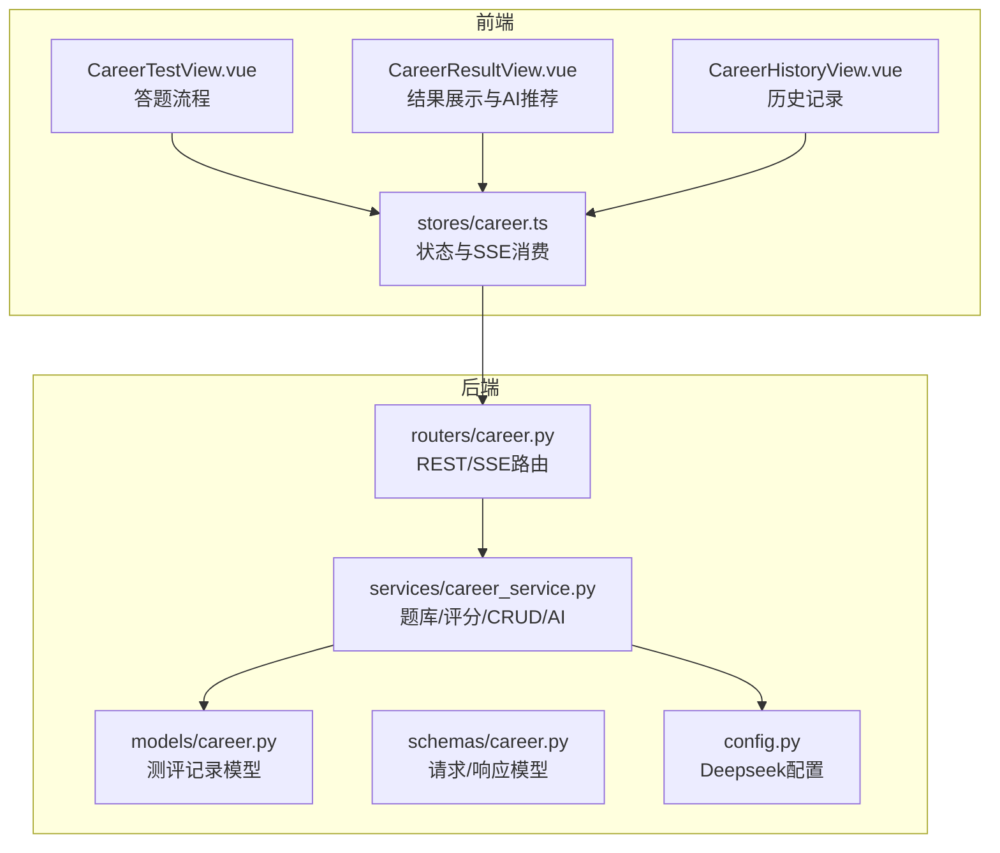
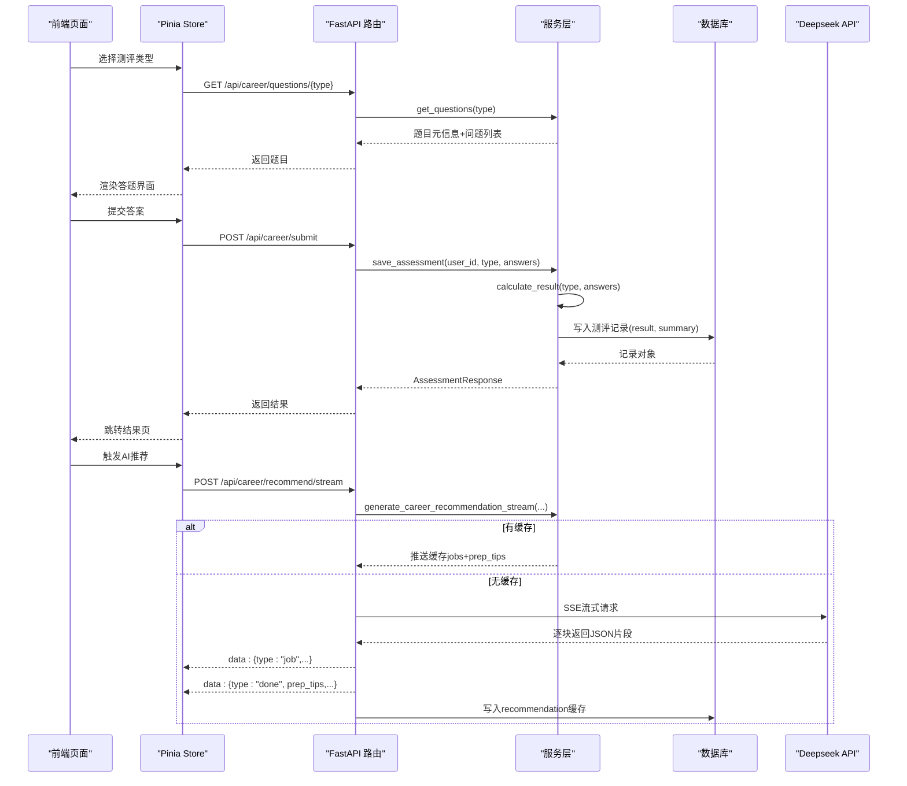
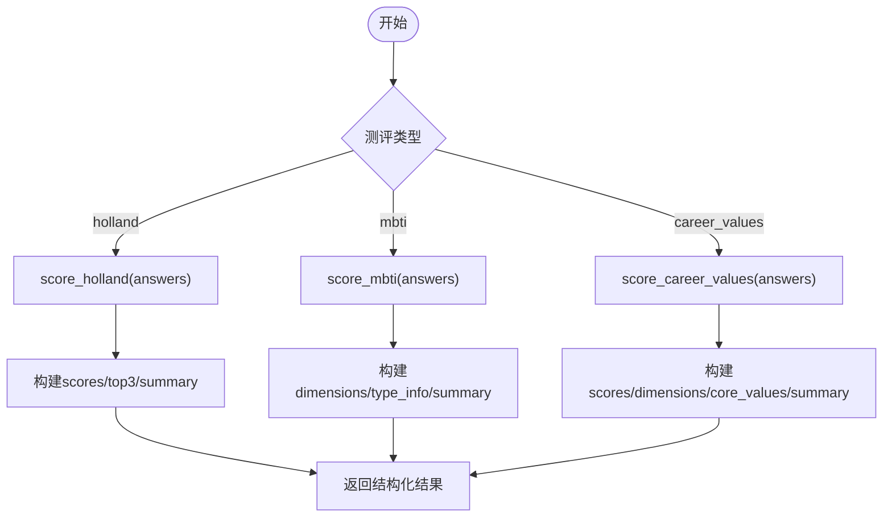
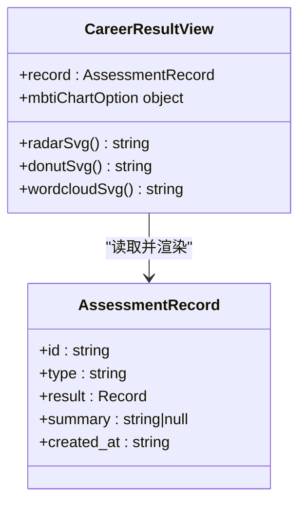
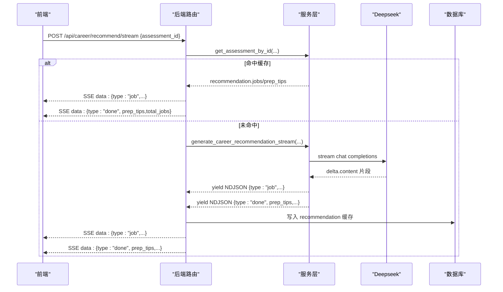
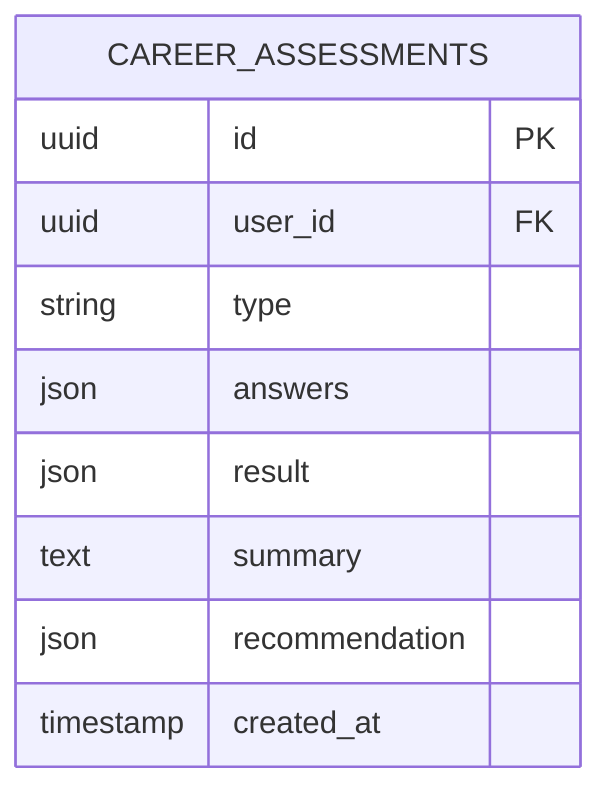
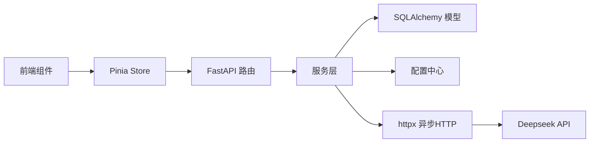

# 测评报告生成

<cite>
**本文引用的文件列表**
- [career.py（模型）](file://backEnd/app/models/career.py)
- [career.py（路由）](file://backEnd/app/routers/career.py)
- [career_service.py（服务）](file://backEnd/app/services/career_service.py)
- [career.py（Schema）](file://backEnd/app/schemas/career.py)
- [CareerResultView.vue](file://frontEnd/src/views/CareerResultView.vue)
- [CareerTestView.vue](file://frontEnd/src/views/CareerTestView.vue)
- [CareerHistoryView.vue](file://frontEnd/src/views/CareerHistoryView.vue)
- [career.ts（Pinia Store）](file://frontEnd/src/stores/career.ts)
- [config.py（配置）](file://backEnd/app/config.py)
</cite>

## 目录
1. [简介](#简介)
2. [项目结构](#项目结构)
3. [核心组件](#核心组件)
4. [架构总览](#架构总览)
5. [详细组件分析](#详细组件分析)
6. [依赖关系分析](#依赖关系分析)
7. [性能与可扩展性](#性能与可扩展性)
8. [故障排查指南](#故障排查指南)
9. [结论](#结论)
10. [附录：数据模型与接口定义](#附录数据模型与接口定义)

## 简介
本技术文档围绕“测评报告生成”能力，系统梳理了多源测评数据的整合处理、个性化报告模板渲染、AI驱动的职业发展建议生成机制，以及报告版本管理与历史记录保存的数据结构设计。当前仓库已实现 Holland、MBTI、职业价值观三类测评的题库、评分算法、结果持久化与前端可视化展示；同时提供基于大语言模型的岗位匹配推荐流式输出与缓存策略。PDF导出功能在现有代码中未直接实现，但提供了相关技术路径与建议方案。

## 项目结构
后端采用 FastAPI + SQLAlchemy 异步 ORM，按路由/服务/模型分层组织；前端使用 Vue 3 + Pinia + ECharts 进行交互与图表渲染。测评报告生成的关键路径如下：
- 前端答题页获取题目、提交答案、查看结果与历史
- 后端路由接收请求，调用服务层计算结果并落库
- 服务层包含题库定义、评分算法、数据库 CRUD、AI 推荐流式生成
- 前端结果页根据测评类型动态渲染不同图表与内容

**图示来源**
- [CareerTestView.vue:1-226](file://frontEnd/src/views/CareerTestView.vue#L1-L226)
- [CareerResultView.vue:1-561](file://frontEnd/src/views/CareerResultView.vue#L1-L561)
- [CareerHistoryView.vue:1-152](file://frontEnd/src/views/CareerHistoryView.vue#L1-L152)
- [career.ts（Pinia Store）:1-223](file://frontEnd/src/stores/career.ts#L1-L223)
- [career.py（路由）:1-158](file://backEnd/app/routers/career.py#L1-L158)
- [career_service.py（服务）:1-669](file://backEnd/app/services/career_service.py#L1-L669)
- [career.py（模型）:1-56](file://backEnd/app/models/career.py#L1-L56)
- [career.py（Schema）:1-59](file://backEnd/app/schemas/career.py#L1-L59)
- [config.py（配置）:1-71](file://backEnd/app/config.py#L1-L71)

**章节来源**
- [CareerTestView.vue:1-226](file://frontEnd/src/views/CareerTestView.vue#L1-L226)
- [CareerResultView.vue:1-561](file://frontEnd/src/views/CareerResultView.vue#L1-L561)
- [CareerHistoryView.vue:1-152](file://frontEnd/src/views/CareerHistoryView.vue#L1-L152)
- [career.ts:1-223](file://frontEnd/src/stores/career.ts#L1-L223)
- [career.py（路由）:1-158](file://backEnd/app/routers/career.py#L1-L158)
- [career_service.py:1-669](file://backEnd/app/services/career_service.py#L1-L669)
- [career.py（模型）:1-56](file://backEnd/app/models/career.py#L1-L56)
- [career.py（Schema）:1-59](file://backEnd/app/schemas/career.py#L1-L59)
- [config.py:1-71](file://backEnd/app/config.py#L1-L71)

## 核心组件
- 题库与评分算法：Holland RIASEC、MBTI、职业价值观三类量表，统一通过服务层计算结构化结果与摘要文本。
- 数据库模型：测评记录包含用户ID、测评类型、原始答案、结构化结果、摘要、AI推荐缓存与创建时间。
- REST API：获取题目、提交答案、查询历史、获取单条结果。
- AI推荐流：基于 Deepseek 的 SSE 流式返回岗位匹配与面试准备建议，支持缓存命中与回写。
- 前端展示：根据测评类型动态渲染雷达图、双向条形图、环形图与词云，并实时消费SSE更新推荐结果。

**章节来源**
- [career_service.py:54-207](file://backEnd/app/services/career_service.py#L54-L207)
- [career_service.py:319-423](file://backEnd/app/services/career_service.py#L319-L423)
- [career.py（模型）:11-56](file://backEnd/app/models/career.py#L11-L56)
- [career.py（路由）:20-93](file://backEnd/app/routers/career.py#L20-L93)
- [CareerResultView.vue:44-146](file://frontEnd/src/views/CareerResultView.vue#L44-L146)

## 架构总览
整体为前后端分离架构，前端通过 REST 与 SSE 与后端交互；后端以服务层封装业务逻辑，模型负责持久化，配置集中管理外部依赖（如 Deepseek）。

**图示来源**
- [career.py（路由）:20-158](file://backEnd/app/routers/career.py#L20-L158)
- [career_service.py:429-451](file://backEnd/app/services/career_service.py#L429-L451)
- [career_service.py:457-501](file://backEnd/app/services/career_service.py#L457-L501)
- [career_service.py:568-669](file://backEnd/app/services/career_service.py#L568-L669)
- [career.ts:148-207](file://frontEnd/src/stores/career.ts#L148-L207)

## 详细组件分析

### 多源测评数据整合与融合算法
- 题库定义：
  - Holland RIASEC：六维度各4题，5级喜好量表，计算各维度总分，取Top3形成霍兰德代码与类型详情。
  - MBTI：四维度各6题，含正向与反向计分，左右得分差决定倾向字母，汇总类型信息与优势/职业建议。
  - 职业价值观：六维度各4题，重要性量表，计算维度均分，提取核心维度与描述。
- 评分函数：
  - score_holland：聚合维度分数，排序取Top3，组装类型详情与摘要。
  - score_mbti：按维度统计左右得分，比较得出类型，附加类型信息与总结。
  - score_career_values：按维度求均值，排序取前2为核心，生成维度详情与摘要。
- 结果统一：calculate_result 根据类型分发到对应评分函数，返回结构化结果与摘要。

**图示来源**
- [career_service.py:319-343](file://backEnd/app/services/career_service.py#L319-L343)
- [career_service.py:346-393](file://backEnd/app/services/career_service.py#L346-L393)
- [career_service.py:396-423](file://backEnd/app/services/career_service.py#L396-L423)
- [career_service.py:441-451](file://backEnd/app/services/career_service.py#L441-L451)

**章节来源**
- [career_service.py:54-207](file://backEnd/app/services/career_service.py#L54-L207)
- [career_service.py:319-423](file://backEnd/app/services/career_service.py#L319-L423)
- [career_service.py:441-451](file://backEnd/app/services/career_service.py#L441-L451)

### 个性化报告模板设计模式
- 模板切换：前端根据 record.type 分支渲染不同图表与内容区块。
- 图表实现：
  - Holland：SVG 雷达图，标注维度名称与分数。
  - MBTI：ECharts 双向条形图，展示四维度左右比例与倾向。
  - 职业价值观：SVG 环形图与词云，突出核心维度与权重。
- 内容增强：结合类型描述、优势、适合职业等静态资料，提升可读性与指导性。

**图示来源**
- [CareerResultView.vue:44-146](file://frontEnd/src/views/CareerResultView.vue#L44-L146)
- [CareerResultView.vue:294-542](file://frontEnd/src/views/CareerResultView.vue#L294-L542)
- [career.ts:48-54](file://frontEnd/src/stores/career.ts#L48-L54)

**章节来源**
- [CareerResultView.vue:44-146](file://frontEnd/src/views/CareerResultView.vue#L44-L146)
- [CareerResultView.vue:294-542](file://frontEnd/src/views/CareerResultView.vue#L294-L542)

### AI驱动的职业发展建议生成机制
- Prompt工程：
  - 系统提示：职业规划师角色设定。
  - 用户提示：包含测评类型、摘要、详细数据与可选简历技能关键词，要求严格 JSON 格式输出。
- 上下文构建：
  - _build_result_detail 将结构化结果转为可读文本，适配不同类型。
  - 可选从简历服务获取技能关键词，增强匹配相关性。
- 流式输出与格式化：
  - 后端通过 httpx 发起 SSE 流式请求，逐块解析 content，正则提取 job 对象并 yield NDJSON。
  - 流结束后从完整缓冲中提取 prep_tips，兜底解析 JSON 或代码块。
  - 前端 SSE 消费者按 data: 行解析，增量追加 jobs，最终设置 prep_tips。
- 缓存策略：
  - 若记录存在 recommendation 缓存，直接推送缓存数据。
  - 首次生成后写入 recommendation 字段，后续命中缓存。

**图示来源**
- [career.py（路由）:96-158](file://backEnd/app/routers/career.py#L96-L158)
- [career_service.py:507-538](file://backEnd/app/services/career_service.py#L507-L538)
- [career_service.py:541-566](file://backEnd/app/services/career_service.py#L541-L566)
- [career_service.py:568-669](file://backEnd/app/services/career_service.py#L568-L669)
- [career.ts:148-207](file://frontEnd/src/stores/career.ts#L148-L207)

**章节来源**
- [career.py（路由）:96-158](file://backEnd/app/routers/career.py#L96-L158)
- [career_service.py:507-669](file://backEnd/app/services/career_service.py#L507-L669)
- [career.ts:148-207](file://frontEnd/src/stores/career.ts#L148-L207)

### 报告PDF导出功能实现方案
当前仓库未实现测评报告的 PDF 导出。可参考以下方案：
- 服务端生成：
  - 使用 HTML 模板引擎（如 Jinja2）拼装报告内容，结合 SVG/ECharts 截图或内联矢量图。
  - 借助 WeasyPrint 或 pdfkit/wkhtmltopdf 将 HTML 转换为 PDF，支持样式定制与分页控制。
  - 暴露 /api/career/report/pdf 接口，传入 assessment_id，返回 PDF 二进制流。
- 前端生成：
  - 使用 html2canvas + jspdf 将 DOM 节点渲染为图片并拼接为 PDF。
  - 或使用浏览器打印功能，配合 @media print 样式优化布局。
- 注意事项：
  - 字体与中文渲染需确保服务器环境安装相应字体。
  - 图表嵌入建议使用 SVG 或静态图片，避免运行时依赖。
  - 大文档分页与跨页断行需测试与调优。

[本节为概念性方案说明，不直接分析具体源码文件]

### 报告版本管理与历史记录保存的数据结构设计
- 数据结构：
  - 主键 id：UUID，唯一标识每次测评记录。
  - user_id：关联用户，支持级联删除。
  - type：测评类型枚举（holland/mbti/career_values）。
  - answers：原始答案数组，JSON 存储。
  - result：结构化结果，JSON 存储。
  - summary：结果摘要文本。
  - recommendation：AI 推荐缓存，JSON 存储（jobs 与 prep_tips）。
  - created_at：创建时间，自动填充。
- 版本管理建议：
  - 新增 version 字段（整数），每次重新测评递增。
  - 保留历史快照，便于回溯与对比。
  - 可在 recommendation 中增加 last_generated_at 与 model_version 字段，追踪 AI 生成版本。

**图示来源**
- [career.py（模型）:11-56](file://backEnd/app/models/career.py#L11-L56)

**章节来源**
- [career.py（模型）:11-56](file://backEnd/app/models/career.py#L11-L56)

## 依赖关系分析
- 前端依赖：
  - Vue 3 组件与组合式 API
  - Pinia 状态管理
  - ECharts 图表渲染
  - Fetch API 与 SSE 流式读取
- 后端依赖：
  - FastAPI 路由与异步会话
  - SQLAlchemy 异步 ORM
  - Pydantic 数据校验
  - httpx 异步 HTTP 客户端（Deepseek SSE）
  - 配置中心（Pydantic Settings）

**图示来源**
- [CareerResultView.vue:261-289](file://frontEnd/src/views/CareerResultView.vue#L261-L289)
- [career.ts:1-21](file://frontEnd/src/stores/career.ts#L1-L21)
- [career.py（路由）:1-17](file://backEnd/app/routers/career.py#L1-L17)
- [career_service.py:1-23](file://backEnd/app/services/career_service.py#L1-L23)
- [career.py（模型）:1-9](file://backEnd/app/models/career.py#L1-L9)
- [config.py:1-11](file://backEnd/app/config.py#L1-L11)

**章节来源**
- [CareerResultView.vue:261-289](file://frontEnd/src/views/CareerResultView.vue#L261-L289)
- [career.ts:1-21](file://frontEnd/src/stores/career.ts#L1-L21)
- [career.py（路由）:1-17](file://backEnd/app/routers/career.py#L1-L17)
- [career_service.py:1-23](file://backEnd/app/services/career_service.py#L1-L23)
- [career.py（模型）:1-9](file://backEnd/app/models/career.py#L1-L9)
- [config.py:1-11](file://backEnd/app/config.py#L1-L11)

## 性能与可扩展性
- 流式输出：
  - SSE 流式返回降低首屏延迟，提升用户体验。
  - 正则逐块提取 job 对象，减少内存占用。
- 缓存策略：
  - recommendation 缓存避免重复调用 LLM，提高响应速度。
- 可扩展点：
  - 新增测评类型只需扩展 ASSESSMENT_META 与评分函数。
  - 模板渲染可抽象为独立模块，支持更多可视化形式。
  - 推荐Prompt可按业务需求迭代，结合更多上下文（如行业、地区）。

[本节提供通用指导，不直接分析具体源码文件]

## 故障排查指南
- 未配置 Deepseek API Key：
  - 现象：推荐接口返回 400，提示未配置 API Key。
  - 解决：在 .env 中设置 DEEPSEEK_API_KEY，并确保 deepseek_api_url 与 deepseek_model 正确。
- SSE 解析异常：
  - 现象：前端无法解析 data: 行或 JSON 片段。
  - 解决：检查后端 yield 格式是否为标准 SSE，确认前端 TextDecoder 与 buffer 拼接逻辑。
- 数据库写入失败：
  - 现象：recommendation 缓存未生效。
  - 解决：检查 db.commit 是否执行成功，关注异常捕获与日志。

**章节来源**
- [career.py（路由）:103-104](file://backEnd/app/routers/career.py#L103-L104)
- [career_service.py:610-669](file://backEnd/app/services/career_service.py#L610-L669)
- [career.ts:172-207](file://frontEnd/src/stores/career.ts#L172-L207)

## 结论
本系统实现了多源测评数据的整合处理与个性化报告展示，并通过 AI 流式推荐增强了职业发展建议的实用性与时效性。数据结构清晰、职责分层明确，具备良好的可扩展性。未来可在报告 PDF 导出、版本管理与更丰富的可视化方面持续演进。

[本节为总结性内容，不直接分析具体源码文件]

## 附录：数据模型与接口定义
- 数据模型：
  - CareerAssessment：测评记录主表，包含类型、答案、结果、摘要、推荐缓存与时间戳。
- 接口定义：
  - GET /api/career/questions/{assessment_type}：获取题目列表
  - POST /api/career/submit：提交答案并计算结果
  - GET /api/career/history：获取用户测评历史
  - GET /api/career/result/{assessment_id}：获取单个测评详情
  - POST /api/career/recommend/stream：AI 岗位匹配推荐（SSE 流式）

**章节来源**
- [career.py（模型）:11-56](file://backEnd/app/models/career.py#L11-L56)
- [career.py（路由）:20-158](file://backEnd/app/routers/career.py#L20-L158)
- [career.py（Schema）:11-59](file://backEnd/app/schemas/career.py#L11-L59)