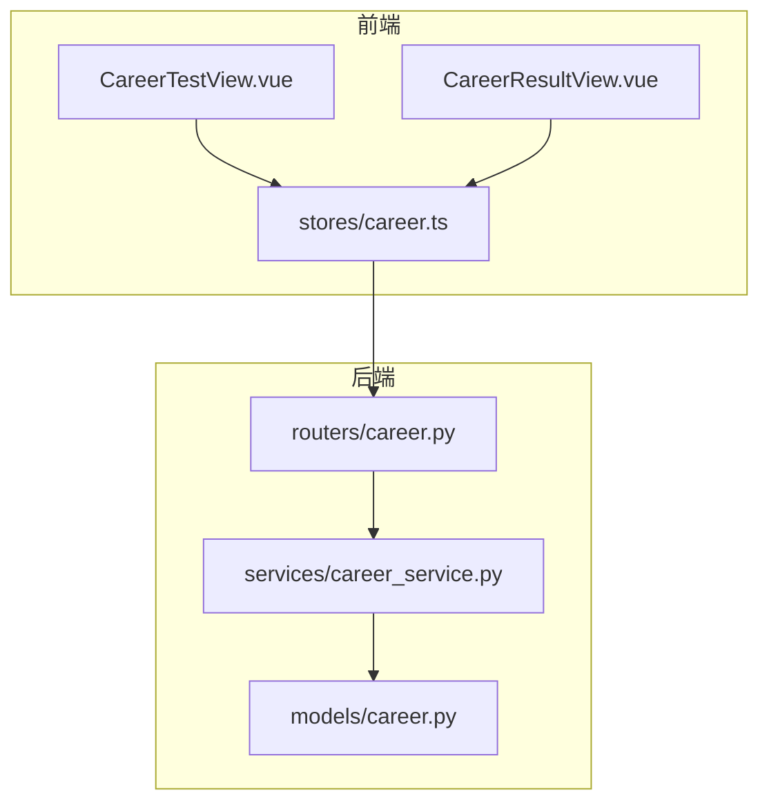
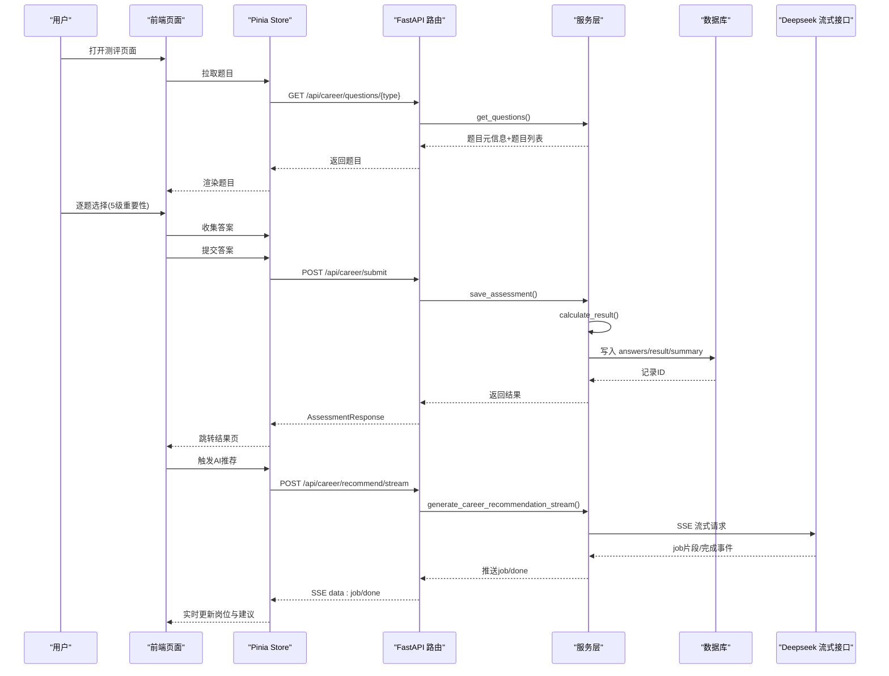
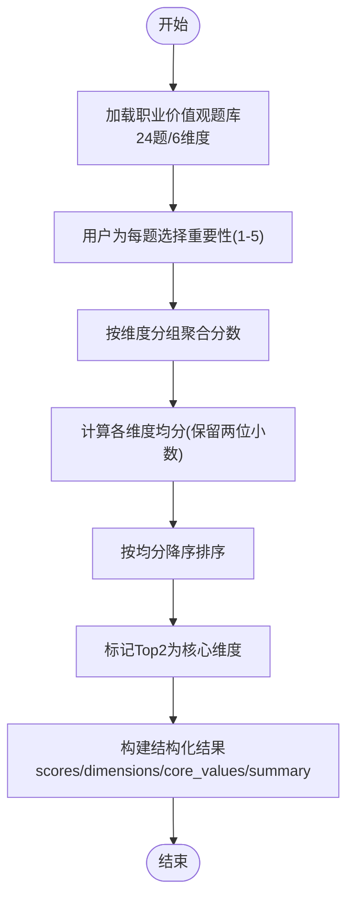
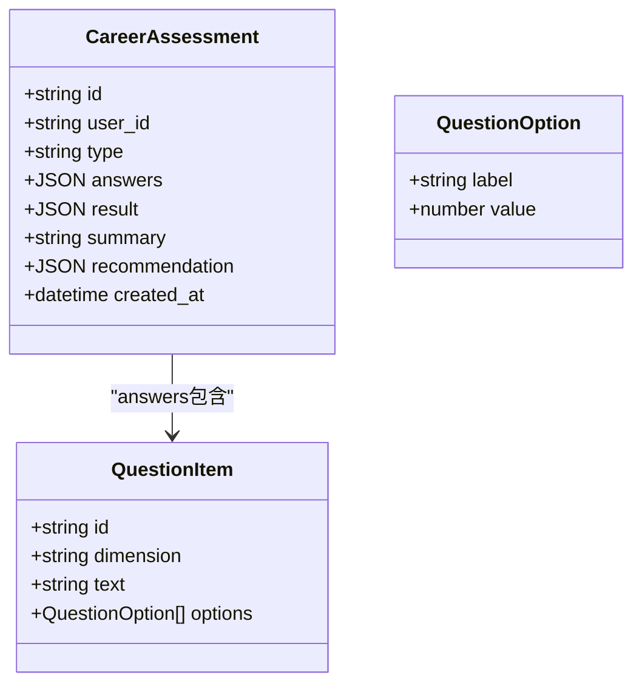
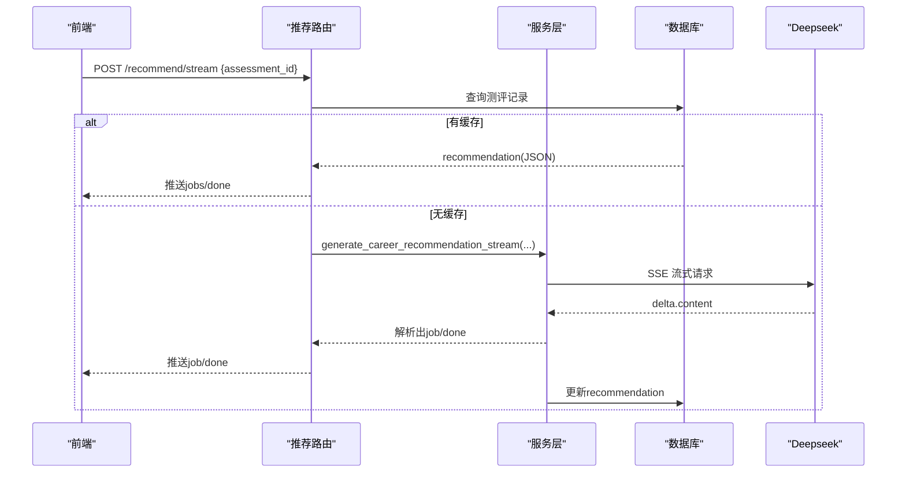
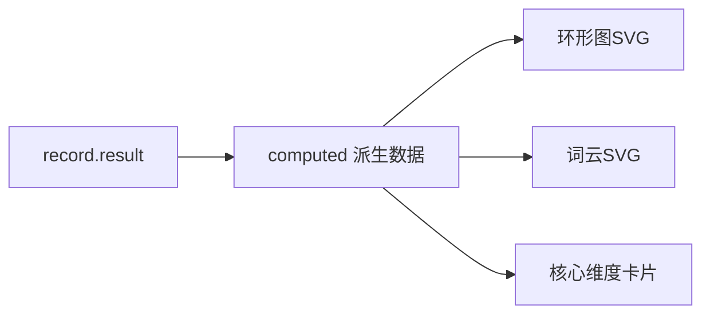
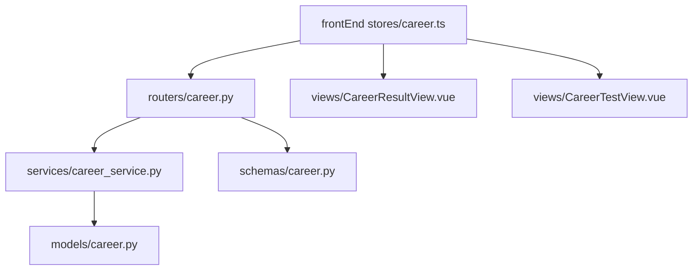

# 职业价值观测评

<cite>
**本文引用的文件**
- [career.py](file://backEnd/app/models/career.py)
- [career_service.py](file://backEnd/app/services/career_service.py)
- [career.py](file://backEnd/app/routers/career.py)
- [CareerTestView.vue](file://frontEnd/src/views/CareerTestView.vue)
- [CareerResultView.vue](file://frontEnd/src/views/CareerResultView.vue)
- [career.ts](file://frontEnd/src/stores/career.ts)
- [15585e6a3708_add_recommendation_to_career_assessments.py](file://backEnd/alembic/versions/15585e6a3708_add_recommendation_to_career_assessments.py)
</cite>

## 目录
1. [引言](#引言)
2. [项目结构](#项目结构)
3. [核心组件](#核心组件)
4. [架构总览](#架构总览)
5. [详细组件分析](#详细组件分析)
6. [依赖关系分析](#依赖关系分析)
7. [性能与可扩展性](#性能与可扩展性)
8. [故障排查指南](#故障排查指南)
9. [结论](#结论)
10. [附录：数据结构与算法说明](#附录数据结构与算法说明)

## 引言
本技术文档聚焦“职业价值观测评”功能，覆盖多维度评估模型、题目情境设计、选项权重分配、综合得分计算、结果结构化表示、AI 个性化建议生成逻辑，以及前端雷达图/环形图/词云的绘制与数据绑定。同时给出个人价值观与组织文化匹配度分析方法（概念层面）及冲突检测与调和建议生成的思路，便于后续扩展实现。

## 项目结构
后端采用 FastAPI + SQLAlchemy 异步 ORM，提供题库查询、答案提交、结果计算、历史记录与 AI 推荐流式接口；前端基于 Vue 3 + Pinia + ECharts/SVG 渲染图表，完成答题交互与结果可视化。

**图示来源**
- [CareerTestView.vue:1-226](file://frontEnd/src/views/CareerTestView.vue#L1-L226)
- [CareerResultView.vue:1-561](file://frontEnd/src/views/CareerResultView.vue#L1-L561)
- [career.ts:1-223](file://frontEnd/src/stores/career.ts#L1-L223)
- [career.py:1-158](file://backEnd/app/routers/career.py#L1-L158)
- [career_service.py:1-669](file://backEnd/app/services/career_service.py#L1-L669)
- [career.py:1-56](file://backEnd/app/models/career.py#L1-L56)

**章节来源**
- [career.py:1-56](file://backEnd/app/models/career.py#L1-L56)
- [career_service.py:1-669](file://backEnd/app/services/career_service.py#L1-L669)
- [career.py:1-158](file://backEnd/app/routers/career.py#L1-L158)
- [CareerTestView.vue:1-226](file://frontEnd/src/views/CareerTestView.vue#L1-L226)
- [CareerResultView.vue:1-561](file://frontEnd/src/views/CareerResultView.vue#L1-L561)
- [career.ts:1-223](file://frontEnd/src/stores/career.ts#L1-L223)

## 核心组件
- 题库与维度定义：Holland、MBTI、职业价值观三套量表，均采用 5 级 Likert 量表，其中职业价值观使用“重要性”语义的 5 级选项。
- 评分算法：按维度聚合并计算均值，输出各维度均分、Top N 核心维度、摘要文本等结构化结果。
- 数据库模型：保存用户 ID、测评类型、原始答案 JSON、计算结果 JSON、摘要文本与 AI 推荐缓存 JSON。
- API 路由：获取题目、提交答案、查询历史、获取详情、AI 岗位推荐（SSE 流式）。
- 前端交互：逐题作答、自动跳转、进度条、结果页多图表展示（SVG/ECharts）、AI 推荐实时流式渲染。

**章节来源**
- [career_service.py:144-185](file://backEnd/app/services/career_service.py#L144-L185)
- [career_service.py:396-422](file://backEnd/app/services/career_service.py#L396-L422)
- [career.py:11-56](file://backEnd/app/models/career.py#L11-L56)
- [career.py:19-158](file://backEnd/app/routers/career.py#L19-L158)
- [CareerTestView.vue:125-208](file://frontEnd/src/views/CareerTestView.vue#L125-L208)
- [CareerResultView.vue:261-561](file://frontEnd/src/views/CareerResultView.vue#L261-L561)
- [career.ts:82-223](file://frontEnd/src/stores/career.ts#L82-L223)

## 架构总览
端到端流程：前端加载题目 → 用户作答 → 提交至后端 → 服务层计算结果并落库 → 返回结构化结果 → 前端渲染图表与文字 → 触发 AI 岗位推荐（SSE 流式），支持缓存命中与增量推送。

**图示来源**
- [career.py:19-158](file://backEnd/app/routers/career.py#L19-L158)
- [career_service.py:429-450](file://backEnd/app/services/career_service.py#L429-L450)
- [career_service.py:457-475](file://backEnd/app/services/career_service.py#L457-L475)
- [career_service.py:568-669](file://backEnd/app/services/career_service.py#L568-L669)
- [career.ts:148-207](file://frontEnd/src/stores/career.ts#L148-L207)
- [CareerResultView.vue:548-561](file://frontEnd/src/views/CareerResultView.vue#L548-L561)

## 详细组件分析

### 1) 职业价值观多维评估模型
- 维度定义：成就感、经济报酬、自主性、社会贡献、人际关系、工作环境，共 6 个维度，每维度 4 题，总计 24 题。
- 量表设计：采用“重要性”语义的 5 级选项（非常不重要→非常重要），分值 1-5。
- 情境设计：每题围绕工作场景中的价值诉求进行描述，强调可感知的工作回报与环境特征，避免抽象表述，提升被试理解与一致性。
- 权重分配：同维度内题目等权，最终维度得分为该维度所有题目均分；跨维度比较时以标准化后的均分排序，选取 Top 2 作为核心维度。

**图示来源**
- [career_service.py:144-185](file://backEnd/app/services/career_service.py#L144-L185)
- [career_service.py:396-422](file://backEnd/app/services/career_service.py#L396-L422)

**章节来源**
- [career_service.py:144-185](file://backEnd/app/services/career_service.py#L144-L185)
- [career_service.py:396-422](file://backEnd/app/services/career_service.py#L396-L422)

### 2) 题目情境设计与选项权重
- 情境设计原则：贴近真实职场情境，涵盖目标达成、认可反馈、晋升路径、薪酬福利、决策自由度、团队氛围、工作生活平衡等关键要素。
- 选项权重：统一采用 5 级等距量表，保证维度内题目对最终均分的线性影响；未作答默认回退到中立值 3，避免极端偏差。
- 反向计分：当前职业价值观题库未设置反向题，简化计分逻辑，降低误答风险。

**章节来源**
- [career_service.py:29-51](file://backEnd/app/services/career_service.py#L29-L51)
- [career_service.py:144-185](file://backEnd/app/services/career_service.py#L144-L185)

### 3) 综合得分计算算法
- 步骤：
  - 将答案映射为 question_id → score 字典。
  - 遍历题库，按 dimension 累加对应分数。
  - 计算每个维度的平均得分（四舍五入保留两位小数）。
  - 按均分降序排列，提取 Top 2 作为核心维度，并为每个维度附加名称、描述、是否核心等元信息。
  - 生成总结文本，用于结果页展示。
- 复杂度：O(N)，N 为题目数量（固定 24），时间/空间开销极低。

**图示来源**
- [career.py:11-56](file://backEnd/app/models/career.py#L11-L56)
- [career_service.py:16-21](file://backEnd/app/services/career_service.py#L16-L21)

**章节来源**
- [career_service.py:396-422](file://backEnd/app/services/career_service.py#L396-L422)
- [career.py:11-56](file://backEnd/app/models/career.py#L11-L56)

### 4) 结果结构化表示
- scores：维度代码 → 均分映射。
- dimensions：按均分排序的维度详情数组，含 code/name/desc/avg_score/is_core。
- core_values：Top 2 维度代码数组。
- summary：人类可读的总结语句。
- 存储：result 字段持久化 JSON，summary 字段单独存储以便快速展示。

**章节来源**
- [career_service.py:396-422](file://backEnd/app/services/career_service.py#L396-L422)
- [career.py:31-50](file://backEnd/app/models/career.py#L31-L50)

### 5) 个人价值观与组织文化的匹配度分析（概念方案）
- 组织文化画像建模：
  - 通过企业问卷或公开资料抽取文化维度（如创新导向、层级控制、客户导向、团队协作、绩效驱动等），形成组织侧向量。
  - 将个人价值观维度（成就、报酬、自主、利他、人际、环境）映射到组织文化维度，建立映射矩阵。
- 匹配度计算：
  - 余弦相似度或加权欧氏距离衡量个人向量与组织向量的接近程度。
  - 引入阈值判定显著差异维度，用于冲突检测。
- 冲突检测与调和建议：
  - 当某维度差距超过阈值，提示潜在冲突点（如高自主需求 vs 强层级管控）。
  - 结合岗位 JD 与行业实践，生成调和建议（如优先选择扁平化管理团队、协商弹性工作制、明确授权边界等）。
- 注意：该部分为概念设计，尚未在现有代码中实现，可作为后续迭代方向。

[本节为概念性内容，不直接分析具体文件]

### 6) AI 个性化发展建议生成逻辑
- 输入：测评类型、结果摘要、结果详情（结构化转文本）、可选简历技能关键词。
- 提示词模板：要求返回 JSON，包含 jobs 数组（岗位名、匹配度、理由、薪资范围）与 prep_tips 数组（分类+具体建议）。
- 流式解析：
  - 后端通过 httpx 发起 SSE 流式请求，边接收边尝试正则提取完整 job 对象，逐条 yield NDJSON。
  - 完成后从完整响应中提取 prep_tips，若失败则兜底整体解析。
- 前端处理：
  - 读取 SSE 流，解析 data: 行，动态追加岗位卡片，最后渲染面试准备建议。
  - 支持缓存命中：若数据库存在 recommendation 字段，直接推送缓存数据。

**图示来源**
- [career.py:96-158](file://backEnd/app/routers/career.py#L96-L158)
- [career_service.py:568-669](file://backEnd/app/services/career_service.py#L568-L669)
- [career.ts:148-207](file://frontEnd/src/stores/career.ts#L148-L207)

**章节来源**
- [career.py:96-158](file://backEnd/app/routers/career.py#L96-L158)
- [career_service.py:507-669](file://backEnd/app/services/career_service.py#L507-L669)
- [career.ts:148-207](file://frontEnd/src/stores/career.ts#L148-L207)

### 7) 前端可视化实现（雷达图/环形图/词云）
- Holland 雷达图：纯 SVG 绘制，按六维度角度均匀分布，网格线、轴线、数据多边形与标签动态生成。
- 职业价值观环形图：根据各维度均分占比计算扇形角度，中心标注“核心价值观”，外围引线+百分比标签。
- 价值观词云：按均分大小映射字号，按行布局居中显示，颜色循环取自调色板。
- 数据绑定：结果页通过 computed 属性从 store 的 record.result 派生视图数据，确保响应式更新。

**图示来源**
- [CareerResultView.vue:300-339](file://frontEnd/src/views/CareerResultView.vue#L300-L339)
- [CareerResultView.vue:467-502](file://frontEnd/src/views/CareerResultView.vue#L467-L502)
- [CareerResultView.vue:504-542](file://frontEnd/src/views/CareerResultView.vue#L504-L542)
- [CareerResultView.vue:460-466](file://frontEnd/src/views/CareerResultView.vue#L460-L466)

**章节来源**
- [CareerResultView.vue:300-339](file://frontEnd/src/views/CareerResultView.vue#L300-L339)
- [CareerResultView.vue:467-502](file://frontEnd/src/views/CareerResultView.vue#L467-L502)
- [CareerResultView.vue:504-542](file://frontEnd/src/views/CareerResultView.vue#L504-L542)
- [CareerResultView.vue:460-466](file://frontEnd/src/views/CareerResultView.vue#L460-L466)

## 依赖关系分析
- 模块耦合：
  - 路由层仅负责参数校验与调用服务层，低耦合。
  - 服务层集中实现题库、评分、CRUD、AI 推荐，职责清晰。
  - 前端 Store 封装 HTTP 与 SSE 流处理，视图层专注渲染。
- 外部依赖：
  - Deepseek API Key 配置缺失会触发 400 错误。
  - 数据库迁移新增 recommendation 字段，支持推荐缓存。

**图示来源**
- [career.py:1-158](file://backEnd/app/routers/career.py#L1-L158)
- [career_service.py:1-669](file://backEnd/app/services/career_service.py#L1-L669)
- [career.py:1-56](file://backEnd/app/models/career.py#L1-L56)
- [career.ts:1-223](file://frontEnd/src/stores/career.ts#L1-L223)
- [CareerResultView.vue:1-561](file://frontEnd/src/views/CareerResultView.vue#L1-L561)
- [CareerTestView.vue:1-226](file://frontEnd/src/views/CareerTestView.vue#L1-L226)

**章节来源**
- [career.py:1-158](file://backEnd/app/routers/career.py#L1-L158)
- [career_service.py:1-669](file://backEnd/app/services/career_service.py#L1-L669)
- [career.py:1-56](file://backEnd/app/models/career.py#L1-L56)
- [career.ts:1-223](file://frontEnd/src/stores/career.ts#L1-L223)
- [CareerResultView.vue:1-561](file://frontEnd/src/views/CareerResultView.vue#L1-L561)
- [CareerTestView.vue:1-226](file://frontEnd/src/views/CareerTestView.vue#L1-L226)

## 性能与可扩展性
- 计算复杂度：评分 O(N)，N=24，常数级耗时。
- I/O 优化：
  - 结果页首次加载后自动触发 AI 推荐，利用 SSE 流式传输减少首屏等待。
  - 推荐结果缓存于数据库，二次访问直接命中，避免重复调用大模型。
- 可扩展性：
  - 题库与维度描述集中管理，新增维度仅需扩展常量与评分函数。
  - 前端图表以 SVG 为主，轻量且易于定制；如需复杂交互可替换为 ECharts。

[本节为通用指导，不直接分析具体文件]

## 故障排查指南
- 未配置 Deepseek API Key：
  - 现象：调用推荐接口返回 400，detail 提示未配置。
  - 处理：在后端环境变量中设置 DEEPSEEK_API_KEY。
- 网络超时或流中断：
  - 现象：SSE 流无法读取或解析异常。
  - 处理：检查网络连通性与后端日志，确认 httpx 超时配置合理。
- 前端解析错误：
  - 现象：推荐数据为空或报错。
  - 处理：查看浏览器控制台错误信息，确认 SSE data: 行格式正确。

**章节来源**
- [career.py:102-105](file://backEnd/app/routers/career.py#L102-L105)
- [career.ts:148-207](file://frontEnd/src/stores/career.ts#L148-L207)

## 结论
本系统实现了完整的职业价值观测评闭环：从题库定义、评分算法、结果持久化，到前端可视化与 AI 岗位推荐流式推送。数据结构清晰、职责分层明确，具备良好的可维护性与扩展性。后续可在组织文化匹配度分析与冲突调和建议方面进一步落地，增强个性化职业发展指导能力。

[本节为总结性内容，不直接分析具体文件]

## 附录：数据结构与算法说明

### 数据库模型字段
- career_assessments
  - id: 主键 UUID
  - user_id: 外键关联用户
  - type: 测评类型（holland/mbti/career_values）
  - answers: 原始答案 JSON
  - result: 计算结果 JSON
  - summary: 结果摘要文本
  - recommendation: AI 推荐缓存 JSON
  - created_at: 创建时间

**章节来源**
- [career.py:11-56](file://backEnd/app/models/career.py#L11-L56)
- [15585e6a3708_add_recommendation_to_career_assessments.py:20-25](file://backEnd/alembic/versions/15585e6a3708_add_recommendation_to_career_assessments.py#L20-L25)

### 评分函数签名与行为
- score_career_values(answers): 返回 scores/dimensions/core_values/summary
- calculate_result(type, answers): 根据类型分发到对应评分函数
- save_assessment(db, user_id, type, answers): 计算并持久化结果

**章节来源**
- [career_service.py:396-422](file://backEnd/app/services/career_service.py#L396-L422)
- [career_service.py:441-450](file://backEnd/app/services/career_service.py#L441-L450)
- [career_service.py:457-475](file://backEnd/app/services/career_service.py#L457-L475)

### 前端数据绑定要点
- 结果页 computed 属性从 record.result 派生视图数据，确保响应式更新。
- 环形图与词云通过 v-html 注入 SVG 字符串，避免额外依赖。
- SSE 流式解析在 Store 中统一处理，视图层只消费状态。

**章节来源**
- [CareerResultView.vue:460-466](file://frontEnd/src/views/CareerResultView.vue#L460-L466)
- [CareerResultView.vue:467-502](file://frontEnd/src/views/CareerResultView.vue#L467-L502)
- [CareerResultView.vue:504-542](file://frontEnd/src/views/CareerResultView.vue#L504-L542)
- [career.ts:148-207](file://frontEnd/src/stores/career.ts#L148-L207)