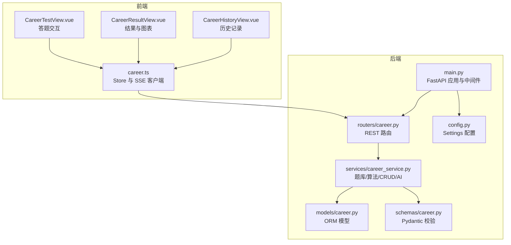
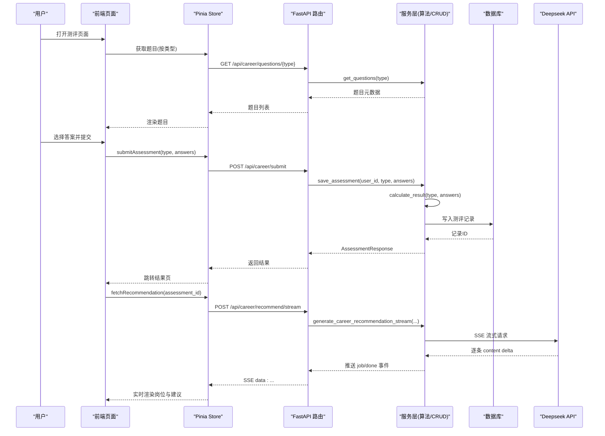
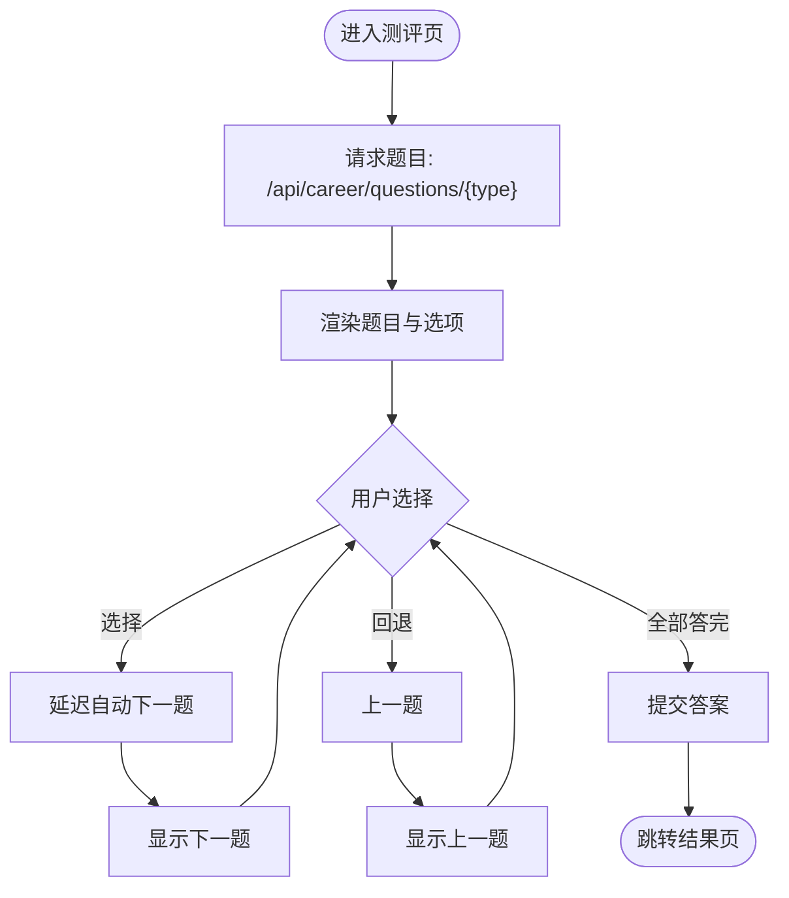
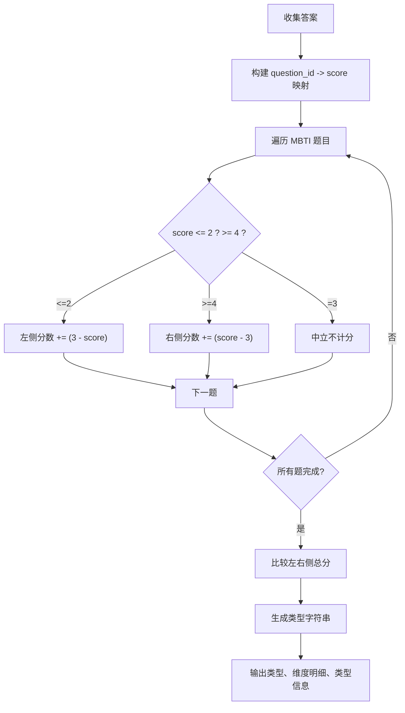
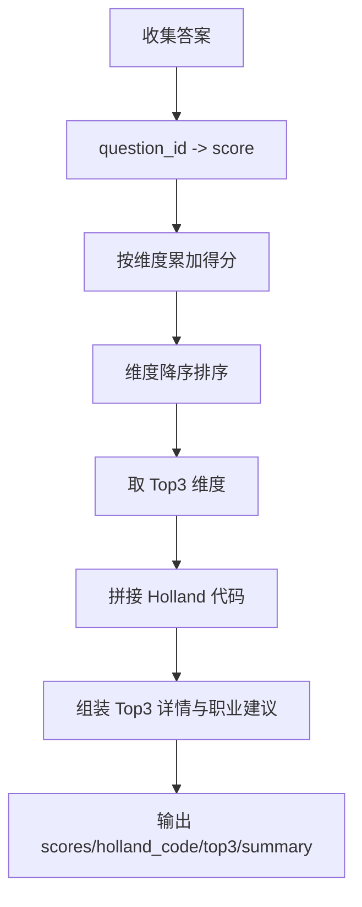
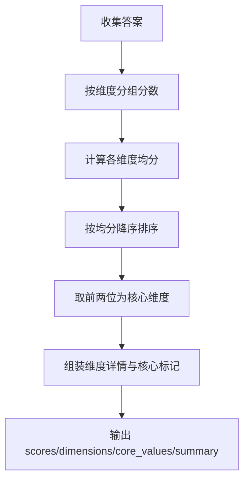
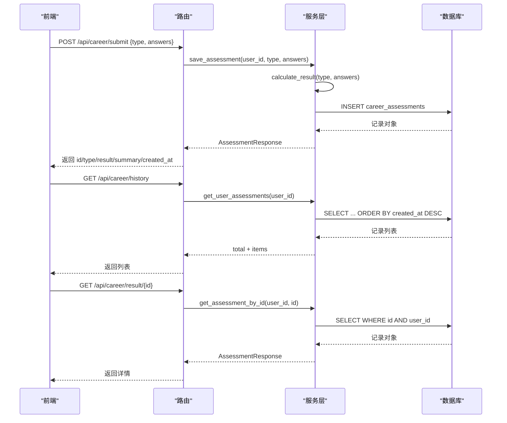
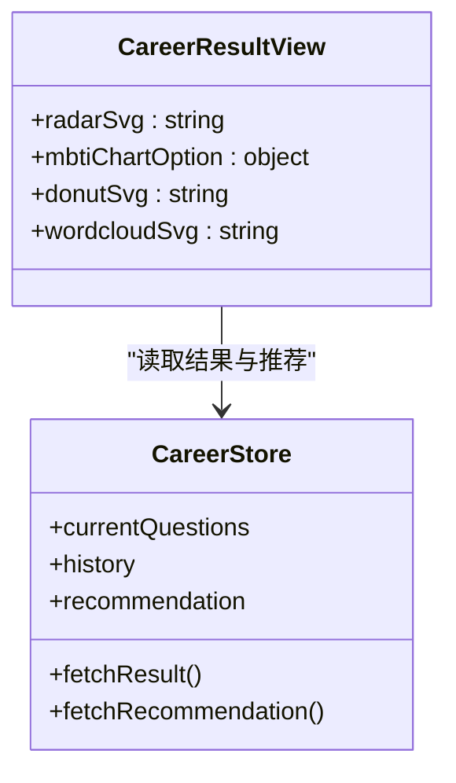
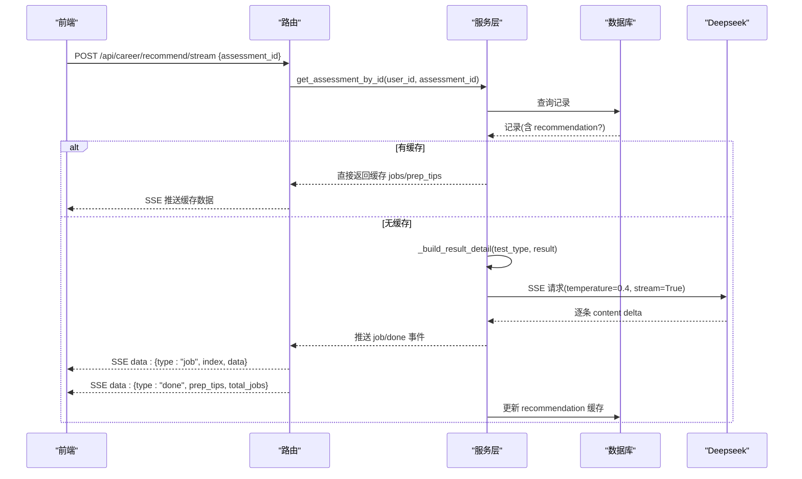
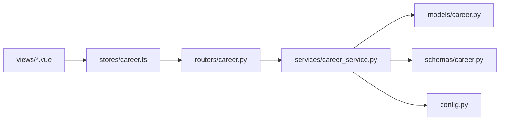

# 职业发展测评系统

<cite>
**本文引用的文件**   
- [backEnd/app/main.py](file://backEnd/app/main.py)
- [backEnd/app/config.py](file://backEnd/app/config.py)
- [backEnd/app/models/career.py](file://backEnd/app/models/career.py)
- [backEnd/app/schemas/career.py](file://backEnd/app/schemas/career.py)
- [backEnd/app/routers/career.py](file://backEnd/app/routers/career.py)
- [backEnd/app/services/career_service.py](file://backEnd/app/services/career_service.py)
- [frontEnd/src/stores/career.ts](file://frontEnd/src/stores/career.ts)
- [frontEnd/src/views/CareerTestView.vue](file://frontEnd/src/views/CareerTestView.vue)
- [frontEnd/src/views/CareerResultView.vue](file://frontEnd/src/views/CareerResultView.vue)
- [frontEnd/src/views/CareerHistoryView.vue](file://frontEnd/src/views/CareerHistoryView.vue)
</cite>

## 目录
1. [简介](#简介)
2. [项目结构](#项目结构)
3. [核心组件](#核心组件)
4. [架构总览](#架构总览)
5. [详细组件分析](#详细组件分析)
6. [依赖关系分析](#依赖关系分析)
7. [性能与可扩展性](#性能与可扩展性)
8. [故障排查指南](#故障排查指南)
9. [结论](#结论)
10. [附录：API 与配置参考](#附录api-与配置参考)

## 简介
本文件系统性地梳理“职业发展测评系统”的后端与前端实现，覆盖以下关键能力：
- MBTI 性格测试算法实现（四维度双向计分、类型判定）
- Holland RIASEC 职业兴趣测评（六维度得分、Top3 代码生成）
- 职业价值观测评（六维度均值排序、核心维度识别）
- 测评题目的动态生成机制（题库元数据驱动）
- 用户答题记录管理（提交、历史、详情）
- 结果可视化展示（雷达图、双向条形图、环形图/词云）
- AI 岗位匹配推荐（SSE 流式返回，含简历技能关键词增强）
- 测评报告个性化建议生成（基于 Deepseek 的提示工程与结构化输出）

该系统采用 FastAPI + SQLAlchemy 异步后端与 Vue3 + ECharts 前端组合，提供完整的测评流程与可视化报告。

## 项目结构
- 后端
  - 路由层：REST API 定义与鉴权集成
  - 服务层：题库定义、评分算法、数据库 CRUD、AI 推荐
  - 模型与 Schema：ORM 模型与 Pydantic 校验
  - 配置：环境变量加载、CORS、Deepseek 配置
- 前端
  - Store：统一状态管理与网络请求封装
  - 视图：测评答题页、结果展示页、历史记录页
  - 图表：ECharts 与内联 SVG 渲染

图示来源
- [backEnd/app/main.py:44-68](file://backEnd/app/main.py#L44-L68)
- [backEnd/app/routers/career.py:17-158](file://backEnd/app/routers/career.py#L17-L158)
- [backEnd/app/services/career_service.py:191-207](file://backEnd/app/services/career_service.py#L191-L207)
- [backEnd/app/models/career.py:11-56](file://backEnd/app/models/career.py#L11-L56)
- [backEnd/app/schemas/career.py:11-59](file://backEnd/app/schemas/career.py#L11-L59)
- [backEnd/app/config.py:7-71](file://backEnd/app/config.py#L7-L71)
- [frontEnd/src/stores/career.ts:82-223](file://frontEnd/src/stores/career.ts#L82-L223)
- [frontEnd/src/views/CareerTestView.vue:125-208](file://frontEnd/src/views/CareerTestView.vue#L125-L208)
- [frontEnd/src/views/CareerResultView.vue:261-561](file://frontEnd/src/views/CareerResultView.vue#L261-L561)
- [frontEnd/src/views/CareerHistoryView.vue:100-152](file://frontEnd/src/views/CareerHistoryView.vue#L100-L152)

章节来源
- [backEnd/app/main.py:44-68](file://backEnd/app/main.py#L44-L68)
- [backEnd/app/config.py:7-71](file://backEnd/app/config.py#L7-L71)

## 核心组件
- 题库与元数据
  - 支持三种测评类型：holland、mbti、career_values
  - 每种类型包含标题、描述与题目列表（维度、选项、分值映射）
- 评分算法
  - Holland：按维度累加，取 Top3 组成 Holland 代码
  - MBTI：四维度双向计分，比较左右侧总分决定字母
  - 职业价值观：计算各维度均值，取前两位作为核心维度
- 数据持久化
  - 保存原始答案、结构化结果、摘要文本、时间戳
  - 可选缓存 AI 推荐结果（jobs、prep_tips）
- AI 岗位匹配推荐
  - 基于 Deepseek 的 SSE 流式响应
  - 将测评结果与可选简历技能关键词拼接为提示词
  - 解析 JSON 片段并逐步推送 job 条目，最终推送 prep_tips

章节来源
- [backEnd/app/services/career_service.py:191-207](file://backEnd/app/services/career_service.py#L191-L207)
- [backEnd/app/services/career_service.py:319-423](file://backEnd/app/services/career_service.py#L319-L423)
- [backEnd/app/models/career.py:11-56](file://backEnd/app/models/career.py#L11-L56)
- [backEnd/app/routers/career.py:96-158](file://backEnd/app/routers/career.py#L96-L158)

## 架构总览
系统遵循前后端分离架构，前端通过 REST/SSE 调用后端接口；后端以 FastAPI 暴露 API，服务层承载业务逻辑与算法，模型层负责数据持久化。

图示来源
- [backEnd/app/routers/career.py:20-53](file://backEnd/app/routers/career.py#L20-L53)
- [backEnd/app/services/career_service.py:429-476](file://backEnd/app/services/career_service.py#L429-L476)
- [backEnd/app/routers/career.py:96-158](file://backEnd/app/routers/career.py#L96-L158)
- [backEnd/app/services/career_service.py:568-669](file://backEnd/app/services/career_service.py#L568-L669)
- [frontEnd/src/stores/career.ts:94-121](file://frontEnd/src/stores/career.ts#L94-L121)
- [frontEnd/src/stores/career.ts:148-207](file://frontEnd/src/stores/career.ts#L148-L207)

## 详细组件分析

### 测评题型与题库动态生成
- 题库元数据集中定义，包含标题、描述与题目数组
- 路由根据 assessment_type 返回对应题目，无需认证即可获取
- 前端根据返回的题目渲染 5 级量表选项，支持自动前进与回退

图示来源
- [backEnd/app/services/career_service.py:191-207](file://backEnd/app/services/career_service.py#L191-L207)
- [backEnd/app/routers/career.py:20-27](file://backEnd/app/routers/career.py#L20-L27)
- [frontEnd/src/views/CareerTestView.vue:159-178](file://frontEnd/src/views/CareerTestView.vue#L159-L178)

章节来源
- [backEnd/app/services/career_service.py:191-207](file://backEnd/app/services/career_service.py#L191-L207)
- [backEnd/app/routers/career.py:20-27](file://backEnd/app/routers/career.py#L20-L27)
- [frontEnd/src/views/CareerTestView.vue:125-208](file://frontEnd/src/views/CareerTestView.vue#L125-L208)

### MBTI 性格测试算法
- 维度：EI、SN、TF、JP，每维度 6 题（正向 3 + 反向 3）
- 计分规则：低分偏向左侧字母，高分偏向右侧字母，中立不计分
- 结果：比较左右侧总分，胜者构成类型字符串，附带维度明细与类型信息

图示来源
- [backEnd/app/services/career_service.py:346-393](file://backEnd/app/services/career_service.py#L346-L393)

章节来源
- [backEnd/app/services/career_service.py:346-393](file://backEnd/app/services/career_service.py#L346-L393)

### Holland RIASEC 职业兴趣测评
- 维度：R、I、A、S、E、C，每维度 4 题
- 计分规则：按维度累加得分，排序取 Top3 形成 Holland 代码
- 输出：维度得分、Top3 详情（名称、描述、相关职业）、摘要

图示来源
- [backEnd/app/services/career_service.py:319-343](file://backEnd/app/services/career_service.py#L319-L343)

章节来源
- [backEnd/app/services/career_service.py:319-343](file://backEnd/app/services/career_service.py#L319-L343)

### 职业价值观测评
- 维度：achievement、compensation、independence、altruism、relationships、lifestyle
- 计分规则：计算每个维度均分，排序取前两位为核心维度
- 输出：维度均分、维度详情（是否核心）、摘要

图示来源
- [backEnd/app/services/career_service.py:396-423](file://backEnd/app/services/career_service.py#L396-L423)

章节来源
- [backEnd/app/services/career_service.py:396-423](file://backEnd/app/services/career_service.py#L396-L423)

### 测评记录管理与结果查询
- 提交：保存原始答案、计算结果、摘要、时间戳
- 历史：按用户 ID 分页倒序返回
- 详情：按用户 ID 与记录 ID 精确查询

图示来源
- [backEnd/app/routers/career.py:29-93](file://backEnd/app/routers/career.py#L29-L93)
- [backEnd/app/services/career_service.py:457-501](file://backEnd/app/services/career_service.py#L457-L501)
- [backEnd/app/models/career.py:11-56](file://backEnd/app/models/career.py#L11-L56)

章节来源
- [backEnd/app/routers/career.py:29-93](file://backEnd/app/routers/career.py#L29-L93)
- [backEnd/app/services/career_service.py:457-501](file://backEnd/app/services/career_service.py#L457-L501)
- [backEnd/app/models/career.py:11-56](file://backEnd/app/models/career.py#L11-L56)

### 结果可视化展示
- Holland：SVG 雷达图，标注维度名称与得分
- MBTI：ECharts 双向条形图，展示四维度倾向百分比
- 职业价值观：SVG 环形图与词云，突出核心维度

图示来源
- [frontEnd/src/views/CareerResultView.vue:293-542](file://frontEnd/src/views/CareerResultView.vue#L293-L542)
- [frontEnd/src/stores/career.ts:135-207](file://frontEnd/src/stores/career.ts#L135-L207)

章节来源
- [frontEnd/src/views/CareerResultView.vue:293-542](file://frontEnd/src/views/CareerResultView.vue#L293-L542)
- [frontEnd/src/stores/career.ts:135-207](file://frontEnd/src/stores/career.ts#L135-L207)

### AI 岗位匹配推荐（SSE 流式）
- 触发条件：结果页自动发起推荐请求
- 缓存策略：若记录存在 recommendation 字段则直接推送缓存
- 无缓存时：构造提示词（含测评结果与可选简历技能关键词），调用 Deepseek SSE
- 解析策略：正则提取完整 job JSON 片段，逐步推送；完成后推送 prep_tips 与总数

图示来源
- [backEnd/app/routers/career.py:96-158](file://backEnd/app/routers/career.py#L96-L158)
- [backEnd/app/services/career_service.py:568-669](file://backEnd/app/services/career_service.py#L568-L669)

章节来源
- [backEnd/app/routers/career.py:96-158](file://backEnd/app/routers/career.py#L96-L158)
- [backEnd/app/services/career_service.py:568-669](file://backEnd/app/services/career_service.py#L568-L669)

### 测评流程完整示例与配置选项
- 前端示例
  - 获取题目：调用 store.fetchQuestions(type)
  - 提交答案：store.submitAssessment(type, answers)
  - 查看历史：store.fetchHistory()
  - 查看结果：store.fetchResult(id)
  - 获取推荐：store.fetchRecommendation(assessment_id)
- 后端配置
  - Deepseek API Key、URL、Model 在 .env 中设置
  - CORS 允许源列表用于前后端跨域通信
  - 数据库连接参数（host/port/user/password/name）

章节来源
- [frontEnd/src/stores/career.ts:94-207](file://frontEnd/src/stores/career.ts#L94-L207)
- [backEnd/app/config.py:34-38](file://backEnd/app/config.py#L34-L38)
- [backEnd/app/config.py:13-23](file://backEnd/app/config.py#L13-L23)
- [backEnd/app/config.py:31-32](file://backEnd/app/config.py#L31-L32)

## 依赖关系分析
- 模块耦合
  - 路由层仅依赖服务层与模型/Schema，职责清晰
  - 服务层聚合题库、算法、CRUD、AI 调用，内部高内聚
  - 前端 Store 统一封装网络请求，视图只关注 UI 状态
- 外部依赖
  - httpx 用于 Deepseek SSE 请求
  - ECharts 用于 MBTI 双向条形图
  - 数据库使用 MySQL（异步 aiomysql）

图示来源
- [backEnd/app/routers/career.py:1-158](file://backEnd/app/routers/career.py#L1-L158)
- [backEnd/app/services/career_service.py:1-669](file://backEnd/app/services/career_service.py#L1-L669)
- [backEnd/app/models/career.py:1-56](file://backEnd/app/models/career.py#L1-L56)
- [backEnd/app/schemas/career.py:1-59](file://backEnd/app/schemas/career.py#L1-L59)
- [backEnd/app/config.py:1-71](file://backEnd/app/config.py#L1-L71)
- [frontEnd/src/stores/career.ts:1-223](file://frontEnd/src/stores/career.ts#L1-L223)
- [frontEnd/src/views/CareerTestView.vue:1-226](file://frontEnd/src/views/CareerTestView.vue#L1-L226)
- [frontEnd/src/views/CareerResultView.vue:1-561](file://frontEnd/src/views/CareerResultView.vue#L1-L561)
- [frontEnd/src/views/CareerHistoryView.vue:1-152](file://frontEnd/src/views/CareerHistoryView.vue#L1-L152)

章节来源
- [backEnd/app/routers/career.py:1-158](file://backEnd/app/routers/career.py#L1-L158)
- [backEnd/app/services/career_service.py:1-669](file://backEnd/app/services/career_service.py#L1-L669)
- [frontEnd/src/stores/career.ts:1-223](file://frontEnd/src/stores/career.ts#L1-L223)

## 性能与可扩展性
- 流式推荐
  - SSE 降低首屏等待时间，边生成边渲染
  - 结果缓存避免重复 AI 调用
- 前端渲染优化
  - ECharts 按需注册组件，减少包体
  - SVG 内联渲染避免额外库依赖
- 可扩展点
  - 新增测评类型：在 ASSESSMENT_META 中添加元数据与评分函数
  - 扩展维度或题目：维护 QuestionItem 列表与选项映射
  - 替换 AI 提供商：调整 generate_career_recommendation_stream 中的 URL、Headers、Payload

[本节为通用指导，不直接分析具体文件]

## 故障排查指南
- 验证错误处理
  - 自定义 RequestValidationError 处理器避免二进制内容导致解码异常
- 推荐失败
  - 检查 DEEPSEEK_API_KEY 是否配置
  - 确认 CORS 允许源包含前端地址
  - 查看 SSE 流是否被浏览器拦截或代理阻断
- 数据库问题
  - 检查数据库连接参数与权限
  - 确认 alembic 迁移已执行

章节来源
- [backEnd/app/main.py:76-84](file://backEnd/app/main.py#L76-L84)
- [backEnd/app/routers/career.py:103-104](file://backEnd/app/routers/career.py#L103-L104)
- [backEnd/app/config.py:31-32](file://backEnd/app/config.py#L31-L32)

## 结论
本系统实现了从题目动态生成、答题交互、结果计算到可视化展示的完整闭环，并通过 AI 流式推荐增强个性化建议。模块化设计与清晰的依赖关系便于后续扩展新的测评类型与可视化方案。

[本节为总结，不直接分析具体文件]

## 附录：API 与配置参考

### 主要 API
- 获取题目
  - GET /api/career/questions/{assessment_type}
  - 响应：{ type, title, description, questions[] }
- 提交测评
  - POST /api/career/submit
  - 请求体：{ type, answers: [{ question_id, score }] }
  - 响应：{ id, type, result, summary, created_at }
- 测评历史
  - GET /api/career/history
  - 响应：{ total, items: [AssessmentResponse] }
- 测评详情
  - GET /api/career/result/{assessment_id}
  - 响应：AssessmentResponse
- AI 岗位匹配推荐（SSE）
  - POST /api/career/recommend/stream
  - 请求体：{ assessment_id }
  - 事件：data: {"type":"job","index":i,"data":job}；data: {"type":"done","prep_tips":[],"total_jobs":n}

章节来源
- [backEnd/app/routers/career.py:20-158](file://backEnd/app/routers/career.py#L20-L158)
- [backEnd/app/schemas/career.py:11-59](file://backEnd/app/schemas/career.py#L11-L59)

### 配置项
- Deepseek
  - deepseek_api_key
  - deepseek_api_url
  - deepseek_model
- CORS
  - cors_origins（逗号分隔）
- 数据库
  - db_host/db_port/db_user/db_password/db_name

章节来源
- [backEnd/app/config.py:34-38](file://backEnd/app/config.py#L34-L38)
- [backEnd/app/config.py:31-32](file://backEnd/app/config.py#L31-L32)
- [backEnd/app/config.py:13-23](file://backEnd/app/config.py#L13-L23)