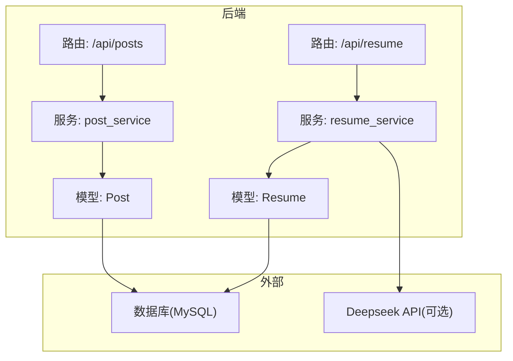
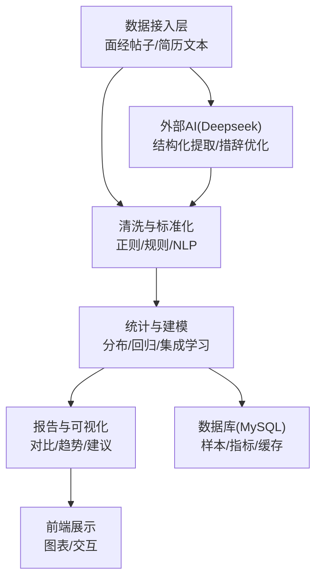
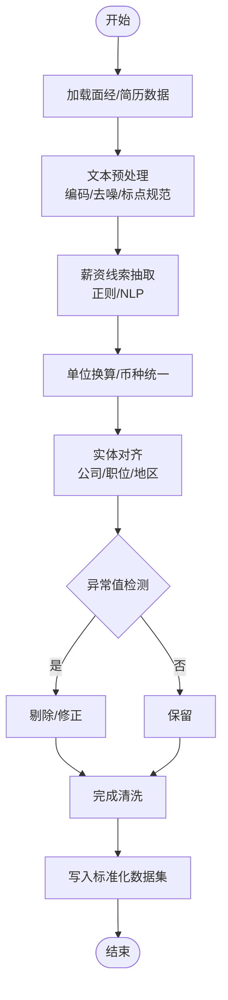
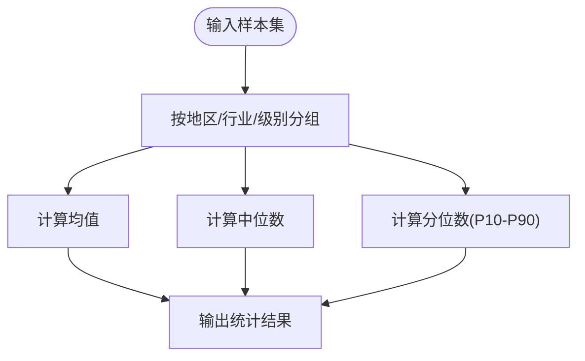
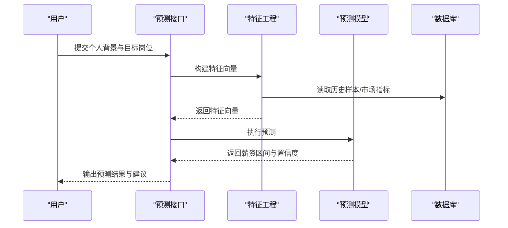
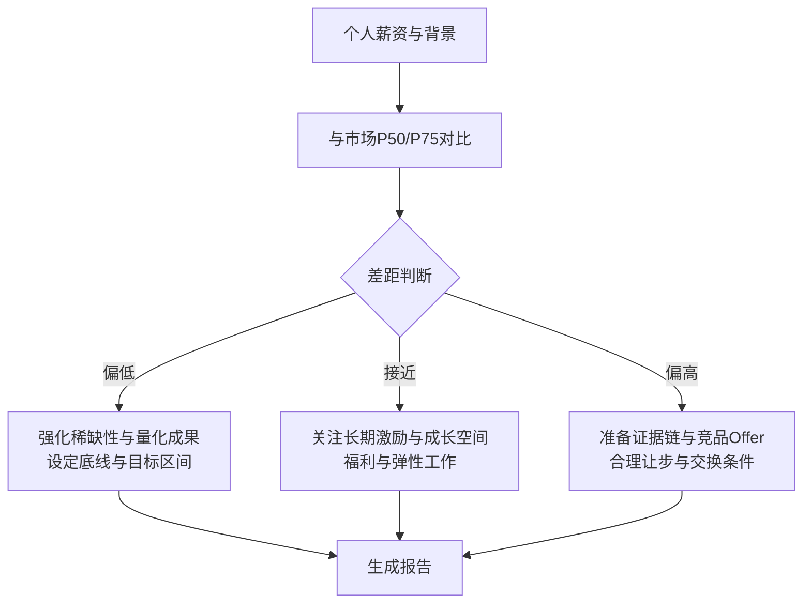
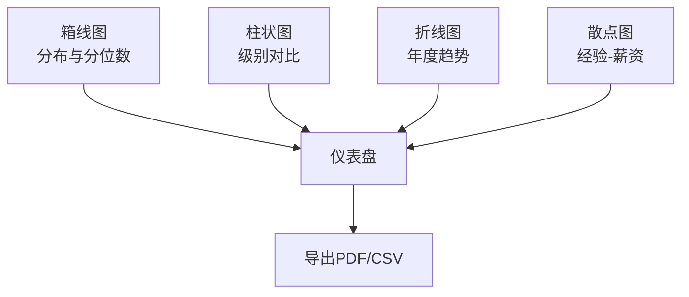
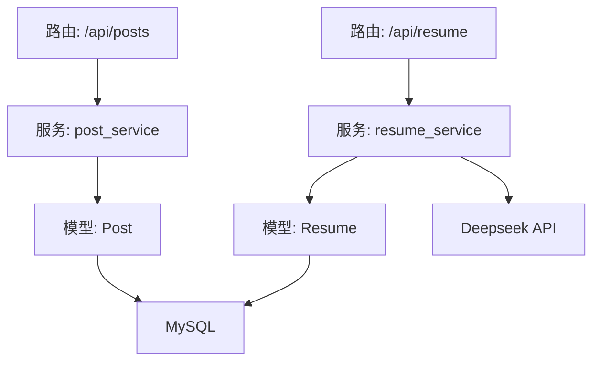

# 薪资市场调研

<cite>
**本文引用的文件**   
- [backEnd/app/models/post.py](file://backEnd/app/models/post.py)
- [backEnd/app/routers/post.py](file://backEnd/app/routers/post.py)
- [backEnd/app/services/post_service.py](file://backEnd/app/services/post_service.py)
- [hr_interview.sql](file://hr_interview.sql)
- [backEnd/app/models/resume.py](file://backEnd/app/models/resume.py)
- [backEnd/app/routers/resume.py](file://backEnd/app/routers/resume.py)
- [backEnd/app/services/resume_service.py](file://backEnd/app/services/resume_service.py)
- [backEnd/app/services/career_service.py](file://backEnd/app/services/career_service.py)
</cite>

## 目录
1. [引言](#引言)
2. [项目结构](#项目结构)
3. [核心组件](#核心组件)
4. [架构总览](#架构总览)
5. [详细组件分析](#详细组件分析)
6. [依赖关系分析](#依赖关系分析)
7. [性能考虑](#性能考虑)
8. [故障排查指南](#故障排查指南)
9. [结论](#结论)
10. [附录](#附录)

## 引言
本技术文档围绕“薪资市场调研”功能，结合仓库中已有的面经论坛与简历解析能力，给出从数据收集、清洗标准化到统计建模、预测与可视化的一体化实现方案。当前代码库已具备：
- 面经帖子结构化字段（公司、职位、年份、面试形式、状态等），可作为薪资调研的UGC来源之一
- 简历上传与AI结构化提取（技能、经历、教育等）
- 职业测评服务中包含“薪酬回报”维度，可用于个人偏好与市场水平的关联分析

基于上述基础，本文提出并落地以下模块：
- 薪资数据采集与清洗：从面经文本与简历中提取薪资相关线索，进行归一化与去噪
- 地区/行业/级别分布统计：计算平均薪资、中位数、分位数，支持多维聚合
- 薪资预测模型：融合经验、技能、地理位置等因素的综合定价
- 竞争力分析报告：个人薪资与市场对比、涨幅预测、谈判策略建议
- 可视化与趋势分析：图表渲染与时间序列趋势展示

## 项目结构
面向薪资调研的相关后端模块主要位于 backEnd/app 下，涉及模型、路由与服务层；前端暂不直接参与薪资算法，但可复用现有页面与API风格。

图示来源
- [backEnd/app/routers/post.py:1-249](file://backEnd/app/routers/post.py#L1-L249)
- [backEnd/app/services/post_service.py:1-249](file://backEnd/app/services/post_service.py#L1-L249)
- [backEnd/app/models/post.py:1-65](file://backEnd/app/models/post.py#L1-L65)
- [backEnd/app/routers/resume.py:1-215](file://backEnd/app/routers/resume.py#L1-L215)
- [backEnd/app/services/resume_service.py:1-285](file://backEnd/app/services/resume_service.py#L1-L285)
- [backEnd/app/models/resume.py:1-67](file://backEnd/app/models/resume.py#L1-L67)

章节来源
- [backEnd/app/routers/post.py:1-249](file://backEnd/app/routers/post.py#L1-L249)
- [backEnd/app/services/post_service.py:1-249](file://backEnd/app/services/post_service.py#L1-L249)
- [backEnd/app/models/post.py:1-65](file://backEnd/app/models/post.py#L1-L65)
- [backEnd/app/routers/resume.py:1-215](file://backEnd/app/routers/resume.py#L1-L215)
- [backEnd/app/services/resume_service.py:1-285](file://backEnd/app/services/resume_service.py#L1-L285)
- [backEnd/app/models/resume.py:1-67](file://backEnd/app/models/resume.py#L1-L67)

## 核心组件
- 面经数据源与筛选：Post 模型提供公司、职位、年份、面试类型、状态等结构化字段，便于按公司/职位/年份聚合，作为薪资调研的基础样本
- 简历解析与技能抽取：Resume 模型存储原始文本与结构化结果，resume_service 调用 Deepseek API 提取技能、经历、教育等信息，为预测模型提供特征
- 职业价值维度：career_service 包含“薪酬回报”维度，用于理解候选人对薪酬的重视程度，辅助个性化建议

章节来源
- [backEnd/app/models/post.py:18-65](file://backEnd/app/models/post.py#L18-L65)
- [backEnd/app/services/post_service.py:96-166](file://backEnd/app/services/post_service.py#L96-L166)
- [backEnd/app/models/resume.py:11-67](file://backEnd/app/models/resume.py#L11-L67)
- [backEnd/app/services/resume_service.py:174-184](file://backEnd/app/services/resume_service.py#L174-L184)
- [backEnd/app/services/career_service.py:148-171](file://backEnd/app/services/career_service.py#L148-L171)

## 架构总览
薪资调研系统由“数据接入层—清洗与标准化—统计与建模—报告与可视化”四层构成。

[此图为概念性架构图，无需图示来源]

## 详细组件分析

### 数据收集与清洗标准化
- 数据来源
  - 面经帖子：公司、职位、年份、面试形式、状态等结构化字段可直接用于聚合；正文内容可用于补充信息（如是否提及薪资范围）
  - 简历文本：通过 resume_service 的 AI 结构化提取，获得技能、经历、教育等特征
- 清洗与标准化流程
  - 文本预处理：统一编码、去除噪声、标点规范化
  - 薪资线索抽取：使用正则匹配常见表达（如“月薪X-K”、“年薪X万”、“税前/税后”等），并进行单位换算与币种统一
  - 实体对齐：公司名称映射至标准词表，职位名称归一化（同义词合并），城市/地区映射至标准地理编码
  - 异常值处理：剔除极端离群值或明显错误样本（如负数、超大数值）
  - 缺失值填充：采用中位数/众数或基于相似样本的插补

[此流程图描述通用实现逻辑，未直接对应具体源码文件，故无图示来源]

章节来源
- [backEnd/app/models/post.py:35-48](file://backEnd/app/models/post.py#L35-L48)
- [backEnd/app/services/resume_service.py:88-138](file://backEnd/app/services/resume_service.py#L88-L138)

### 薪资分布统计模型
- 维度划分
  - 地区：城市/区域（需将非结构化地名映射为标准地理编码）
  - 行业：公司所属行业（可从公司名映射或标签体系）
  - 职位级别：初级/中级/高级/专家/管理（依据职位描述与年限/职责推断）
- 统计指标
  - 平均薪资：算术均值
  - 中位数：排序后中间值
  - 分位数：P10/P25/P50/P75/P90，用于刻画分布形态
- 计算方法
  - 分组聚合：按地区×行业×级别分组，计算各组的均值、中位数与分位数
  - 置信区间：在样本量足够时，计算均值的置信区间以评估稳定性
  - 权重调整：若样本存在偏差（如热门岗位样本过多），可采用逆概率加权校正

[此流程图描述通用实现逻辑，未直接对应具体源码文件，故无图示来源]

章节来源
- [backEnd/app/models/post.py:35-48](file://backEnd/app/models/post.py#L35-L48)

### 薪资预测算法（综合定价模型）
- 特征工程
  - 经验：工作年限、最近一份工作时长、晋升次数
  - 技能：来自简历结构化提取的技能列表与类别占比
  - 地理位置：城市/区域编码、生活成本指数
  - 职位级别：基于职位描述与职责推断的级别标签
  - 市场热度：公司/职位搜索热度、招聘数量变化
- 模型选择
  - 基线：线性回归/岭回归（解释性强）
  - 进阶：随机森林/XGBoost/LightGBM（非线性关系捕捉）
  - 集成：Stacking/Blending提升泛化能力
- 训练与评估
  - 目标变量：实际薪资（元/月或年包）
  - 损失函数：MAE/RMSE
  - 评估指标：R²、MAPE、分位数误差（针对P50/P75）
  - 交叉验证：K折交叉验证，防止过拟合
- 在线预测
  - 输入用户画像与目标岗位信息，输出薪资区间与置信度
  - 动态更新：定期增量训练，保持模型时效性

[此序列图描述通用实现逻辑，未直接对应具体源码文件，故无图示来源]

章节来源
- [backEnd/app/services/resume_service.py:174-184](file://backEnd/app/services/resume_service.py#L174-L184)

### 薪资竞争力分析报告生成逻辑
- 个人与市场对比
  - 将个人期望薪资与同地区/行业/级别的P50/P75对比，标注相对位置
  - 计算差距百分比与等级（显著偏低/接近/偏高）
- 涨幅预测
  - 基于历史跳槽涨幅分布与个人特征，预测下一份工作可能的涨幅区间
  - 考虑市场周期与行业景气度进行修正
- 谈判策略建议
  - 若低于市场：建议强调稀缺技能与成果量化，设定底线与目标区间
  - 若接近市场：聚焦长期激励（期权、奖金）、成长空间与福利
  - 若高于市场：准备充分证据（过往业绩、竞品Offer），合理让步策略

[此流程图描述通用实现逻辑，未直接对应具体源码文件，故无图示来源]

章节来源
- [backEnd/app/services/career_service.py:148-171](file://backEnd/app/services/career_service.py#L148-L171)

### 可视化图表与趋势分析
- 图表类型
  - 箱线图：地区/行业/级别下的薪资分布（含中位数与四分位）
  - 柱状图：不同级别平均薪资对比
  - 折线图：年度薪资趋势（按地区/行业）
  - 散点图：经验与薪资的关系
- 趋势分析
  - 时间窗口：近12/24个月滚动窗口
  - 季节性调整：剔除招聘旺季/淡季影响
  - 异常波动预警：当某地区/行业出现显著偏离时触发告警

[此图为概念性可视化架构，无需图示来源]

## 依赖关系分析
- 面经数据依赖
  - 路由层：/api/posts 提供帖子列表、筛选与统计接口
  - 服务层：post_service 负责查询、分页、标签统计与去重值获取
  - 模型层：Post 提供结构化字段（公司、职位、年份、面试类型、状态）
- 简历数据依赖
  - 路由层：/api/resume 提供上传、分析与优化接口
  - 服务层：resume_service 调用 Deepseek API 进行结构化提取与措辞优化
  - 模型层：Resume 存储原始文本与结构化结果
- 外部依赖
  - Deepseek API：用于简历结构化提取与措辞优化（可选）
  - MySQL：持久化样本、指标与缓存

图示来源
- [backEnd/app/routers/post.py:1-249](file://backEnd/app/routers/post.py#L1-L249)
- [backEnd/app/services/post_service.py:1-249](file://backEnd/app/services/post_service.py#L1-L249)
- [backEnd/app/models/post.py:1-65](file://backEnd/app/models/post.py#L1-L65)
- [backEnd/app/routers/resume.py:1-215](file://backEnd/app/routers/resume.py#L1-L215)
- [backEnd/app/services/resume_service.py:1-285](file://backEnd/app/services/resume_service.py#L1-L285)
- [backEnd/app/models/resume.py:1-67](file://backEnd/app/models/resume.py#L1-L67)

章节来源
- [backEnd/app/routers/post.py:1-249](file://backEnd/app/routers/post.py#L1-L249)
- [backEnd/app/services/post_service.py:1-249](file://backEnd/app/services/post_service.py#L1-L249)
- [backEnd/app/models/post.py:1-65](file://backEnd/app/models/post.py#L1-L65)
- [backEnd/app/routers/resume.py:1-215](file://backEnd/app/routers/resume.py#L1-L215)
- [backEnd/app/services/resume_service.py:1-285](file://backEnd/app/services/resume_service.py#L1-L285)
- [backEnd/app/models/resume.py:1-67](file://backEnd/app/models/resume.py#L1-L67)

## 性能考虑
- 数据规模
  - 面经帖子量大时，建议使用索引与物化视图加速聚合查询
  - 简历结构化提取异步化，避免阻塞主流程
- 计算复杂度
  - 分位数计算在大数据集上可采用近似算法（如t-digest）降低内存占用
  - 模型训练采用批量与并行，减少I/O瓶颈
- 缓存策略
  - 常用统计指标（地区/行业/级别P50/P75）缓存至Redis，缩短响应时间
  - 预测结果短期缓存，避免重复计算

[本节为通用指导，无需章节来源]

## 故障排查指南
- 面经数据问题
  - 检查筛选参数是否正确（公司、职位、年份、面试类型、状态）
  - 确认标签统计与去重值接口返回正常
- 简历解析失败
  - 确认 Deepseek API Key 配置正确
  - 检查网络超时与JSON解析异常
- 预测模型异常
  - 检查特征缺失与异常值
  - 查看模型版本与训练数据一致性

章节来源
- [backEnd/app/routers/post.py:108-128](file://backEnd/app/routers/post.py#L108-L128)
- [backEnd/app/services/post_service.py:226-249](file://backEnd/app/services/post_service.py#L226-L249)
- [backEnd/app/routers/resume.py:100-137](file://backEnd/app/routers/resume.py#L100-L137)
- [backEnd/app/services/resume_service.py:141-172](file://backEnd/app/services/resume_service.py#L141-L172)

## 结论
本方案基于现有面经论坛与简历解析能力，构建了完整的薪资市场调研流水线：从多源数据收集、清洗标准化，到分布统计与预测建模，再到竞争力分析与可视化呈现。通过模块化设计与可扩展的模型选择，系统可在保证性能的同时持续迭代优化，为用户提供精准、可操作的薪资决策支持。

[本节为总结性内容，无需章节来源]

## 附录
- 示例数据参考
  - hr_interview.sql 中的面经样例可用于快速验证筛选与聚合逻辑

章节来源
- [hr_interview.sql:359-364](file://hr_interview.sql#L359-L364)