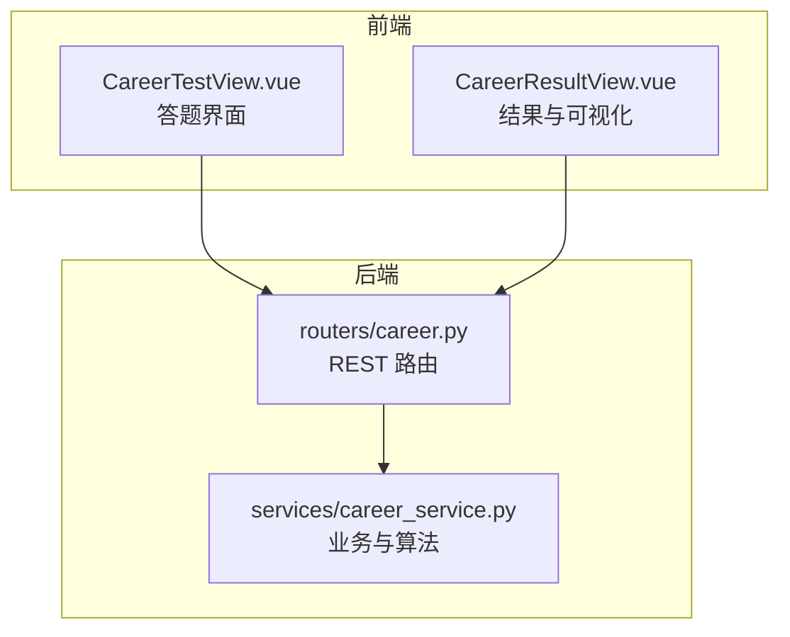
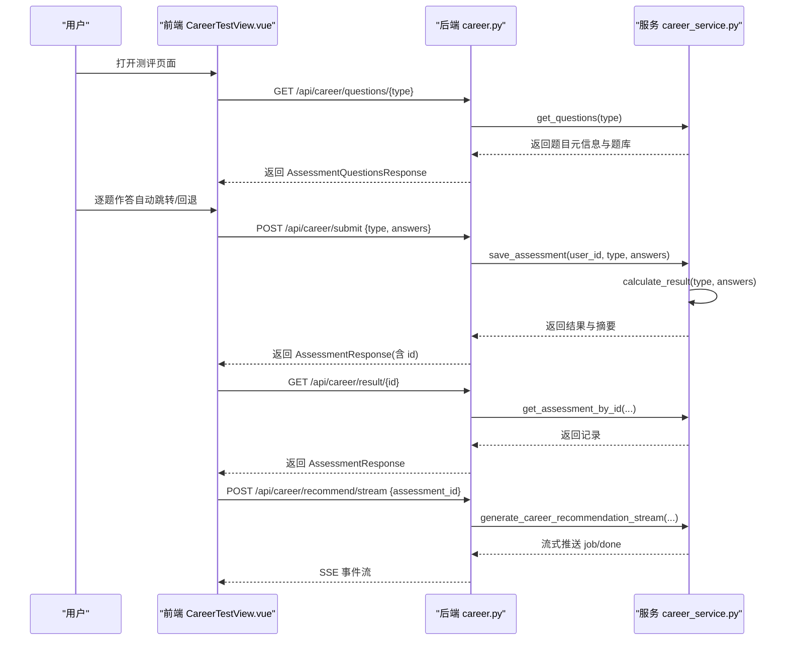
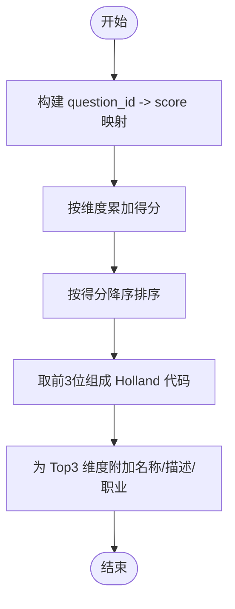
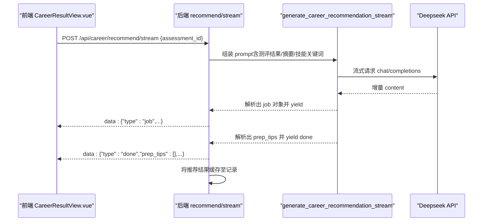
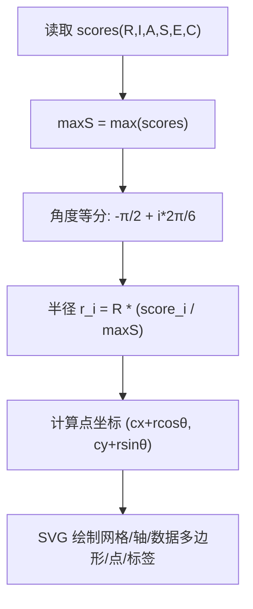
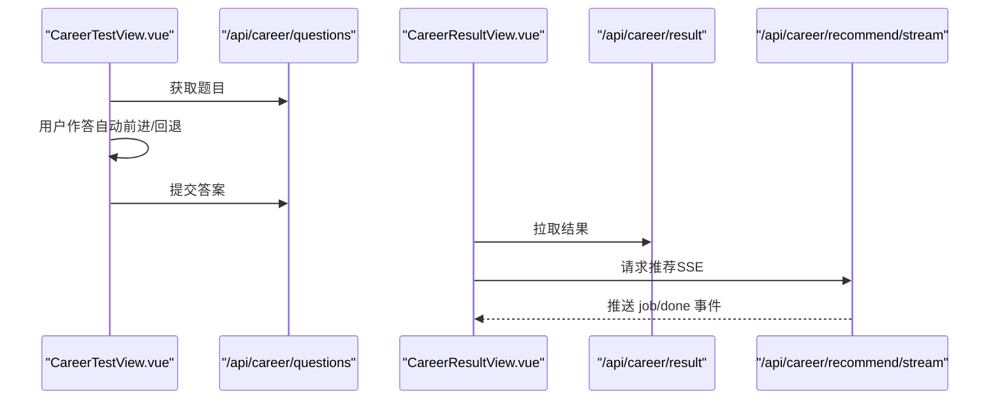
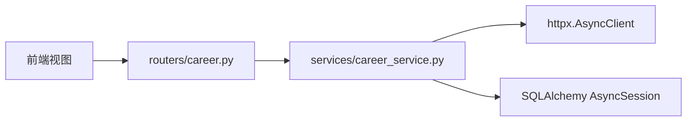

# 霍兰德职业兴趣测评

<cite>
**本文引用的文件**   
- [career_service.py](file://backEnd/app/services/career_service.py)
- [career.py](file://backEnd/app/routers/career.py)
- [CareerTestView.vue](file://frontEnd/src/views/CareerTestView.vue)
- [CareerResultView.vue](file://frontEnd/src/views/CareerResultView.vue)
</cite>

## 目录
1. [引言](#引言)
2. [项目结构](#项目结构)
3. [核心组件](#核心组件)
4. [架构总览](#架构总览)
5. [详细组件分析](#详细组件分析)
6. [依赖关系分析](#依赖关系分析)
7. [性能考量](#性能考量)
8. [故障排查指南](#故障排查指南)
9. [结论](#结论)
10. [附录](#附录)

## 引言
本技术文档围绕“霍兰德职业兴趣测评”的完整实现，系统阐述 RIASEC 六型人格（现实型R、研究型I、艺术型A、社会型S、企业型E、常规型C）的测评模型与工程落地。内容涵盖：
- 题库设计与评分标准
- 六维得分计算与主导/次级类型排序算法
- 职业代码组合分析与岗位匹配逻辑
- 雷达图数据计算与可视化实现
- 前后端交互流程与错误处理

## 项目结构
本项目采用前后端分离架构：
- 后端（FastAPI）提供测评题目获取、答案提交、结果计算、历史记录查询以及 AI 岗位推荐流式接口
- 前端（Vue 3 + ECharts/SVG）负责答题交互、结果展示与可视化渲染

图表来源
- [career.py:1-158](file://backEnd/app/routers/career.py#L1-L158)
- [career_service.py:1-669](file://backEnd/app/services/career_service.py#L1-L669)
- [CareerTestView.vue:1-226](file://frontEnd/src/views/CareerTestView.vue#L1-L226)
- [CareerResultView.vue:1-561](file://frontEnd/src/views/CareerResultView.vue#L1-L561)

章节来源
- [career.py:1-158](file://backEnd/app/routers/career.py#L1-L158)
- [career_service.py:1-669](file://backEnd/app/services/career_service.py#L1-L669)
- [CareerTestView.vue:1-226](file://frontEnd/src/views/CareerTestView.vue#L1-L226)
- [CareerResultView.vue:1-561](file://frontEnd/src/views/CareerResultView.vue#L1-L561)

## 核心组件
- 题库与元信息
  - Holland 六维度题库（每维度4题，共24题），采用5级喜好量表
  - MBTI 与职业价值观题库作为扩展能力
- 评分与结果生成
  - Holland 六维得分聚合、Top3 排序与 Holland 代码拼接
  - MBTI 四维度双向计分与类型判定
  - 职业价值观维度均值与核心维度识别
- 数据库持久化
  - 保存用户答案、结果摘要与结构化 result JSON
- AI 岗位匹配推荐
  - 基于 Deepseek 流式返回，解析 jobs 与 prep_tips，并缓存至记录

章节来源
- [career_service.py:54-92](file://backEnd/app/services/career_service.py#L54-L92)
- [career_service.py:191-207](file://backEnd/app/services/career_service.py#L191-L207)
- [career_service.py:319-343](file://backEnd/app/services/career_service.py#L319-L343)
- [career_service.py:346-393](file://backEnd/app/services/career_service.py#L346-L393)
- [career_service.py:396-422](file://backEnd/app/services/career_service.py#L396-L422)
- [career_service.py:457-475](file://backEnd/app/services/career_service.py#L457-L475)
- [career_service.py:568-668](file://backEnd/app/services/career_service.py#L568-L668)

## 架构总览
从前端到后端的端到端调用链如下：

图表来源
- [career.py:20-52](file://backEnd/app/routers/career.py#L20-L52)
- [career.py:75-93](file://backEnd/app/routers/career.py#L75-L93)
- [career.py:96-157](file://backEnd/app/routers/career.py#L96-L157)
- [career_service.py:429-450](file://backEnd/app/services/career_service.py#L429-L450)
- [career_service.py:457-475](file://backEnd/app/services/career_service.py#L457-L475)
- [career_service.py:568-668](file://backEnd/app/services/career_service.py#L568-L668)
- [CareerTestView.vue:191-207](file://frontEnd/src/views/CareerTestView.vue#L191-L207)
- [CareerResultView.vue:548-559](file://frontEnd/src/views/CareerResultView.vue#L548-L559)

## 详细组件分析

### 霍兰德测评模型与算法
- 题库设计
  - 六维度各4题，统一使用5级喜好量表（非常不喜欢→非常喜欢）
  - 维度标签 R/I/A/S/E/C，便于按维度聚合
- 评分规则
  - 将每题得分累加至对应维度，得到六维原始分
  - 按分数降序排序，取 Top3 构成 Holland 代码（如 IAS）
  - 为 Top3 维度附加类型描述与推荐职业列表
- 一致性提示
  - 定义六边形顺序用于后续一致性指数计算（当前未启用）

图表来源
- [career_service.py:315-343](file://backEnd/app/services/career_service.py#L315-L343)
- [career_service.py:246-248](file://backEnd/app/services/career_service.py#L246-L248)

章节来源
- [career_service.py:54-92](file://backEnd/app/services/career_service.py#L54-L92)
- [career_service.py:319-343](file://backEnd/app/services/career_service.py#L319-L343)
- [career_service.py:246-248](file://backEnd/app/services/career_service.py#L246-L248)

### 职业代码组合分析与主导/次级类型排序
- 主导类型：Top1 维度
- 次级类型：Top2、Top3 维度
- 排序依据：维度总分降序；若出现同分，保持字典插入顺序（稳定排序）
- 代码组合：将 Top3 字母拼接形成 Holland 代码字符串

章节来源
- [career_service.py:319-343](file://backEnd/app/services/career_service.py#L319-L343)

### 职业兴趣与岗位匹配的核心逻辑
- 静态匹配：每个维度维护一组典型职业清单，用于结果页展示
- 动态匹配：AI 岗位推荐
  - 输入：测评类型、结果摘要、详细数据、可选简历技能关键词
  - 输出：jobs（岗位名、匹配度、理由、薪资范围）、prep_tips（面试准备建议分组）
  - 流式传输：后端通过 SSE 逐条推送 job，完成后推送 done 携带 prep_tips
  - 缓存策略：首次生成后将推荐结果写入记录，后续直接复用

图表来源
- [career.py:96-157](file://backEnd/app/routers/career.py#L96-L157)
- [career_service.py:568-668](file://backEnd/app/services/career_service.py#L568-L668)

章节来源
- [career_service.py:213-244](file://backEnd/app/services/career_service.py#L213-L244)
- [career_service.py:568-668](file://backEnd/app/services/career_service.py#L568-L668)
- [career.py:96-157](file://backEnd/app/routers/career.py#L96-L157)

### 雷达图数据计算与可视化实现
- 数据来源：Holland 六维得分 scores（R/I/A/S/E/C）
- 归一化：以最大维度分为基准进行比例缩放
- 坐标计算：极角均匀分布，半径按归一化分值映射
- 渲染方式：纯 SVG 绘制网格、轴线、数据多边形、数据点与标签

图表来源
- [CareerResultView.vue:300-339](file://frontEnd/src/views/CareerResultView.vue#L300-L339)

章节来源
- [CareerResultView.vue:300-339](file://frontEnd/src/views/CareerResultView.vue#L300-L339)

### 前端答题与结果展示流程
- 答题界面
  - 加载题目元信息与题库
  - 支持上一题回退与选择后自动跳转下一题
  - 全部答完后提交答案列表
- 结果界面
  - 根据记录类型分支渲染：Holland 雷达图与 Top3 详情、MBTI 双向条形图、价值观环形图与词云
  - 自动触发 AI 岗位推荐，接收 SSE 事件流并逐步渲染

图表来源
- [CareerTestView.vue:125-207](file://frontEnd/src/views/CareerTestView.vue#L125-L207)
- [CareerResultView.vue:261-559](file://frontEnd/src/views/CareerResultView.vue#L261-L559)
- [career.py:20-52](file://backEnd/app/routers/career.py#L20-L52)
- [career.py:75-93](file://backEnd/app/routers/career.py#L75-L93)
- [career.py:96-157](file://backEnd/app/routers/career.py#L96-L157)

章节来源
- [CareerTestView.vue:125-207](file://frontEnd/src/views/CareerTestView.vue#L125-L207)
- [CareerResultView.vue:261-559](file://frontEnd/src/views/CareerResultView.vue#L261-L559)
- [career.py:20-52](file://backEnd/app/routers/career.py#L20-L52)
- [career.py:75-93](file://backEnd/app/routers/career.py#L75-L93)
- [career.py:96-157](file://backEnd/app/routers/career.py#L96-L157)

## 依赖关系分析
- 模块耦合
  - 路由层仅做参数校验与协议转换，核心逻辑集中在服务层
  - 服务层集中管理题库、评分算法、结果持久化与 AI 推荐
- 外部依赖
  - httpx 异步客户端用于 Deepseek 流式请求
  - SQLAlchemy 异步会话用于数据库操作
- 潜在循环依赖
  - 当前未见循环导入；路由与服务单向依赖

图表来源
- [career.py:1-158](file://backEnd/app/routers/career.py#L1-L158)
- [career_service.py:1-23](file://backEnd/app/services/career_service.py#L1-L23)

章节来源
- [career.py:1-158](file://backEnd/app/routers/career.py#L1-L158)
- [career_service.py:1-23](file://backEnd/app/services/career_service.py#L1-L23)

## 性能考量
- 评分计算复杂度
  - O(n)，n 为题目数量（Holland 24题），常数时间开销极低
- 流式推荐
  - 边解析边推送，降低首屏等待时间
  - 结果缓存避免重复调用大模型
- 前端渲染
  - 雷达图使用轻量 SVG，避免重型图表库开销
  - 双向条形图按需渲染，减少重排

[本节为通用指导，不直接分析具体文件]

## 故障排查指南
- 不支持的测评类型
  - 现象：提交或获取题目时报错“不支持的测评类型”
  - 定位：检查 assessment_type 是否在 ASSESSMENT_META 中
- 测评记录不存在
  - 现象：查询历史或详情返回 404
  - 定位：确认 assessment_id 归属当前用户且存在
- Deepseek API Key 未配置
  - 现象：推荐接口返回 400，提示未配置 API Key
  - 定位：在环境变量中设置 DEEPSEEK_API_KEY 并重启服务
- 流式解析异常
  - 现象：推荐结果不完整或报错
  - 定位：检查网络超时、JSON 片段解析正则是否匹配

章节来源
- [career_service.py:429-450](file://backEnd/app/services/career_service.py#L429-L450)
- [career.py:80-86](file://backEnd/app/routers/career.py#L80-L86)
- [career.py:103-104](file://backEnd/app/routers/career.py#L103-L104)
- [career_service.py:630-668](file://backEnd/app/services/career_service.py#L630-L668)

## 结论
本系统实现了完整的霍兰德职业兴趣测评闭环：标准化题库、清晰的评分与排序算法、直观的结果可视化与可落地的岗位匹配建议。通过流式推荐与缓存机制，兼顾了用户体验与系统效率。未来可在一致性指数、维度权重自适应等方面进一步演进。

[本节为总结性内容，不直接分析具体文件]

## 附录
- 关键数据结构说明
  - QuestionItem：题目项（id、dimension、text、options）
  - AnswerItem：答案项（question_id、score）
  - AssessmentQuestionsResponse：题目响应（type、title、description、questions）
  - AssessmentResponse：结果响应（id、type、result、summary、created_at）
- 字段与取值
  - Holland 维度：R、I、A、S、E、C
  - 量表值域：1~5（五级 Likert）
  - Holland 代码：Top3 维度字母拼接（如 IAS）

章节来源
- [career_service.py:16-21](file://backEnd/app/services/career_service.py#L16-L21)
- [career_service.py:29-51](file://backEnd/app/services/career_service.py#L29-L51)
- [career_service.py:319-343](file://backEnd/app/services/career_service.py#L319-L343)
- [career.py:8-14](file://backEnd/app/routers/career.py#L8-L14)