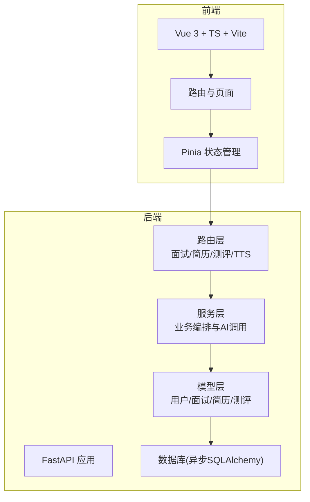
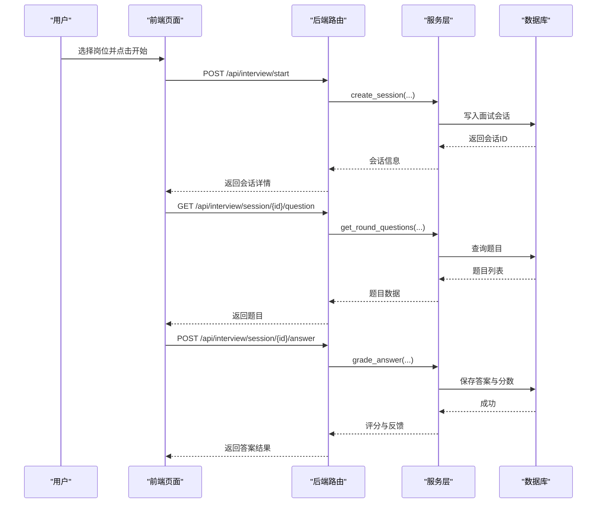
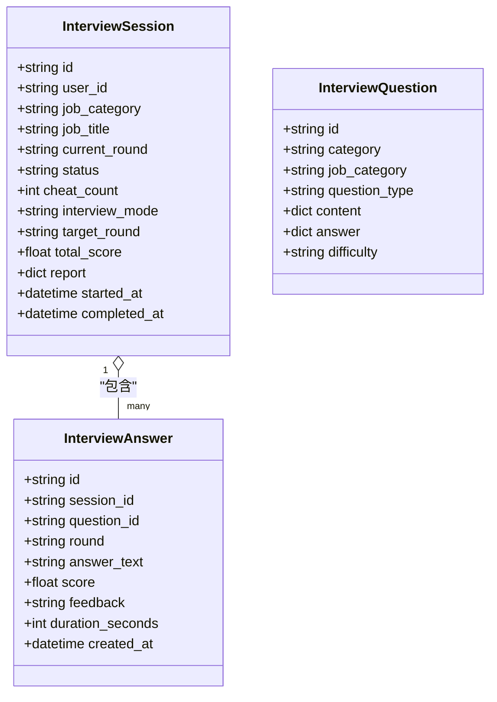
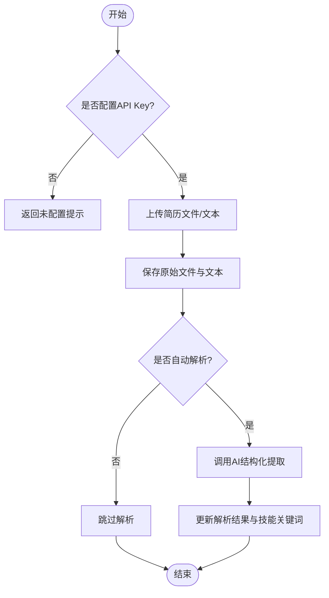
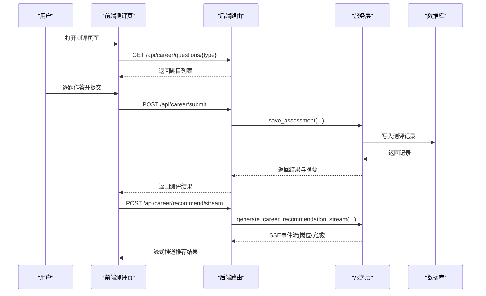
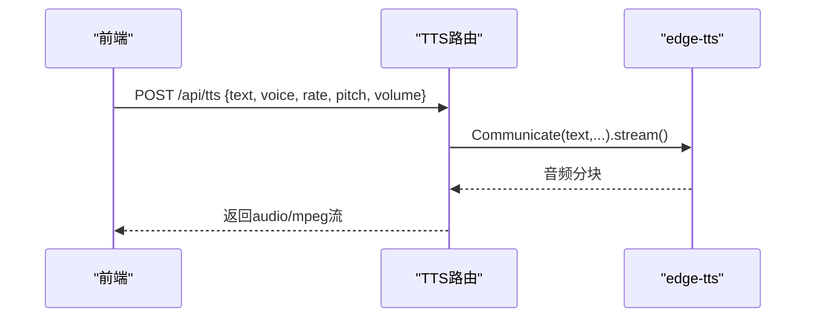
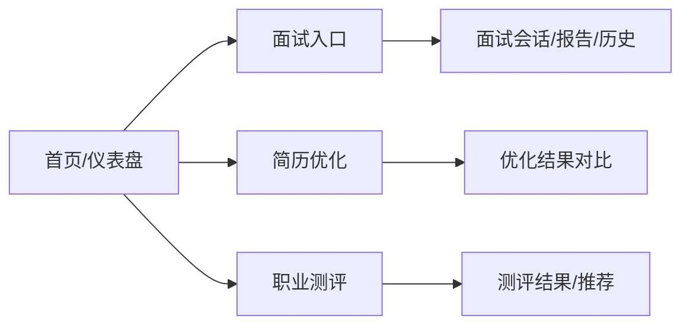
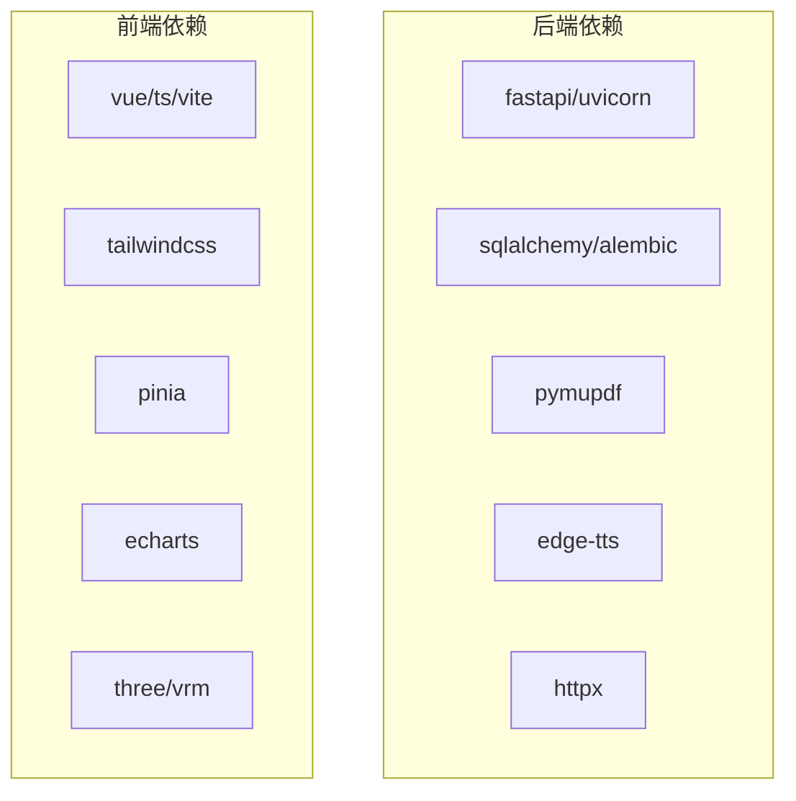

# 项目介绍与目标

<cite>
**本文引用的文件**   
- [backEnd/app/main.py](file://backEnd/app/main.py)
- [backEnd/requirements.txt](file://backEnd/requirements.txt)
- [frontEnd/package.json](file://frontEnd/package.json)
- [frontEnd/README.md](file://frontEnd/README.md)
- [backEnd/app/models/user.py](file://backEnd/app/models/user.py)
- [backEnd/app/models/interview.py](file://backEnd/app/models/interview.py)
- [backEnd/app/models/resume.py](file://backEnd/app/models/resume.py)
- [backEnd/app/models/career.py](file://backEnd/app/models/career.py)
- [backEnd/app/routers/interview.py](file://backEnd/app/routers/interview.py)
- [backEnd/app/routers/resume.py](file://backEnd/app/routers/resume.py)
- [backEnd/app/routers/career.py](file://backEnd/app/routers/career.py)
- [backEnd/app/routers/tts.py](file://backEnd/app/routers/tts.py)
- [frontEnd/src/views/InterviewView.vue](file://frontEnd/src/views/InterviewView.vue)
- [frontEnd/src/views/ResumeOptimizeView.vue](file://frontEnd/src/views/ResumeOptimizeView.vue)
- [frontEnd/src/views/CareerTestView.vue](file://frontEnd/src/views/CareerTestView.vue)
- [frontEnd/src/router/index.ts](file://frontEnd/src/router/index.ts)
</cite>

## 目录
1. [引言](#引言)
2. [项目结构](#项目结构)
3. [核心组件](#核心组件)
4. [架构总览](#架构总览)
5. [详细组件分析](#详细组件分析)
6. [依赖分析](#依赖分析)
7. [性能考虑](#性能考虑)
8. [故障排查指南](#故障排查指南)
9. [结论](#结论)
10. [附录](#附录)

## 引言
HR XF AI面试辅助系统是一个以现代技术栈构建的AI驱动求职赋能平台，面向应届毕业生、职场转型者与技术开发者等群体，围绕“提升面试能力、优化简历表达、明确职业发展路径”三大目标提供一站式服务。系统通过多轮次模拟面试（含综合素质测评、技术面、业务面、AI语音面）、智能评分与报告生成、简历结构化提取与措辞优化、职业测评与岗位匹配推荐、实时语音交互等能力，帮助求职者获得个性化指导与可量化的成长反馈。

传统面试准备常面临以下痛点：
- 缺乏个性化指导：通用题库与模板难以贴合个人背景与目标岗位
- 简历优化效率低：人工修改耗时且缺少数据化评估
- 职业发展路径不清晰：自我认知与市场需求之间存在信息差

本项目的核心价值主张与差异化优势：
- AI智能评分：基于多维度指标（专业度、逻辑性、沟通力、岗位匹配度）给出雷达图与改进建议
- 多轮次模拟面试：覆盖从综合测评到AI语音面的完整流程，支持全流程或单轮练习模式
- 实时语音交互：结合TTS实现自然流畅的对话体验
- 个性化发展建议：结合测评结果与简历技能关键词，输出岗位匹配与备考建议
- 流式响应与缓存：SSE流式返回优化结果与推荐内容，同时具备服务端缓存以提升体验

## 项目结构
系统采用前后端分离架构：
- 后端：FastAPI + SQLAlchemy异步ORM + Alembic迁移，提供REST API与SSE流式接口；使用PyMuPDF进行PDF文本提取，edge-tts提供中文语音合成
- 前端：Vue 3 + TypeScript + Vite + TailwindCSS，使用Pinia管理状态，ECharts可视化，Three.js/VRM用于虚拟形象展示

图表来源
- [backEnd/app/main.py:44-68](file://backEnd/app/main.py#L44-L68)
- [frontEnd/src/router/index.ts:122-134](file://frontEnd/src/router/index.ts#L122-L134)

章节来源
- [backEnd/app/main.py:44-68](file://backEnd/app/main.py#L44-L68)
- [frontEnd/README.md:1-6](file://frontEnd/README.md#L1-L6)
- [frontEnd/package.json:1-35](file://frontEnd/package.json#L1-L35)
- [backEnd/requirements.txt:1-27](file://backEnd/requirements.txt#L1-L27)

## 核心组件
- 用户与权限：用户模型包含基础资料与头像字段，配合鉴权中间件与路由守卫控制访问
- 面试模块：会话生命周期管理、题目获取、答案提交、切屏上报、中止与报告生成，支持全流程与单轮练习
- 简历模块：上传与解析、结构化提取、措辞优化（同步与SSE流式），并缓存结果
- 职业测评：Holland/MBTI/价值观等多类型测评，提交后计算结果并支持AI岗位匹配推荐（SSE）
- TTS语音：将文本转换为高质量中文语音，支持音色、语速、音高、音量调节

章节来源
- [backEnd/app/models/user.py:10-45](file://backEnd/app/models/user.py#L10-L45)
- [backEnd/app/models/interview.py:19-114](file://backEnd/app/models/interview.py#L19-L114)
- [backEnd/app/models/resume.py:11-67](file://backEnd/app/models/resume.py#L11-L67)
- [backEnd/app/models/career.py:11-56](file://backEnd/app/models/career.py#L11-L56)
- [backEnd/app/routers/tts.py:1-63](file://backEnd/app/routers/tts.py#L1-L63)

## 架构总览
系统整体遵循分层架构：前端页面通过路由进入具体视图，调用Pinia状态管理发起HTTP请求至后端路由层；路由层负责参数校验与权限检查，委托服务层完成业务编排（包括AI调用、PDF解析、TTS合成等），并通过ORM持久化到数据库。关键特性包括：
- SSE流式：面试AI对话、简历优化、岗位推荐均支持SSE，提升交互体验
- 缓存策略：简历优化与岗位推荐结果在服务端缓存，避免重复AI调用
- 静态资源：uploads目录挂载为静态文件服务，便于简历附件与头像访问

图表来源
- [backEnd/app/routers/interview.py:36-119](file://backEnd/app/routers/interview.py#L36-L119)
- [backEnd/app/models/interview.py:19-114](file://backEnd/app/models/interview.py#L19-L114)

章节来源
- [backEnd/app/main.py:44-68](file://backEnd/app/main.py#L44-L68)
- [backEnd/app/routers/interview.py:36-119](file://backEnd/app/routers/interview.py#L36-L119)

## 详细组件分析

### 面试模块
- 功能要点
  - 创建会话：记录岗位类别、标题、模式（全流程/单轮）、当前轮次与状态
  - 获取题目：按轮次分类返回题目集合
  - 提交答案：记录答案文本、时长、得分与反馈
  - 下一轮推进：自动推进轮次，达到完成条件时生成报告（答题数≥3）
  - AI对话：SSE流式返回AI回复，支持上下文消息与轮次标识
  - 切屏上报：累计作弊次数，影响最终评价
  - 中止与报告：中止时更新状态并生成报告；报告包含多维评分雷达与建议
- 数据结构
  - InterviewSession：会话主键、用户关联、岗位信息、轮次与状态、作弊计数、模式与目标轮次、总分、报告JSON、时间戳
  - InterviewQuestion：题目分类、岗位类别、题型、内容与标准答案JSON、难度
  - InterviewAnswer：答案文本、得分、反馈、时长、所属轮次与时间戳

图表来源
- [backEnd/app/models/interview.py:19-114](file://backEnd/app/models/interview.py#L19-L114)

章节来源
- [backEnd/app/routers/interview.py:36-317](file://backEnd/app/routers/interview.py#L36-L317)
- [backEnd/app/models/interview.py:19-114](file://backEnd/app/models/interview.py#L19-L114)

### 简历模块
- 功能要点
  - 配置检测：判断是否已配置Deepseek API Key
  - 上传与解析：保存原始文件与文本，若配置了API Key则自动进行结构化提取（技能、经历、教育等）
  - 手动触发分析：对已有简历重新执行结构化提取
  - 措辞优化：优先返回缓存；无缓存则调用AI进行优化，支持同步与SSE流式两种模式，并将结果缓存
  - PDF文本提取：服务端使用PyMuPDF提取PDF文本，提高可靠性
- 数据结构
  - Resume：用户唯一关联、文件名与路径、原始文本、结构化解析结果JSON、技能关键词列表、优化结果缓存JSON、时间戳

图表来源
- [backEnd/app/routers/resume.py:47-98](file://backEnd/app/routers/resume.py#L47-L98)
- [backEnd/app/models/resume.py:11-67](file://backEnd/app/models/resume.py#L11-L67)

章节来源
- [backEnd/app/routers/resume.py:25-215](file://backEnd/app/routers/resume.py#L25-L215)
- [backEnd/app/models/resume.py:11-67](file://backEnd/app/models/resume.py#L11-L67)

### 职业测评模块
- 功能要点
  - 获取题目：无需认证即可获取指定类型的测评题目
  - 提交答案：保存原始答案并计算结构化结果与摘要
  - 历史记录：分页返回用户的测评记录
  - 结果详情：根据ID获取单个测评详情
  - AI岗位匹配推荐：SSE流式推送岗位与备考建议，支持缓存命中直接返回
- 数据结构
  - CareerAssessment：用户关联、测评类型、原始答案JSON、计算结果JSON、摘要文本、AI推荐缓存JSON、时间戳

图表来源
- [backEnd/app/routers/career.py:20-158](file://backEnd/app/routers/career.py#L20-L158)
- [backEnd/app/models/career.py:11-56](file://backEnd/app/models/career.py#L11-L56)

章节来源
- [backEnd/app/routers/career.py:1-158](file://backEnd/app/routers/career.py#L1-L158)
- [backEnd/app/models/career.py:11-56](file://backEnd/app/models/career.py#L11-L56)

### TTS语音模块
- 功能要点
  - 文本转语音：将输入文本转换为MP3音频流，默认使用温柔知性女声，支持语速、音高、音量调节
  - 列出可用中文语音：返回所有zh-开头的语音清单
- 数据结构
  - TTSRequest：文本、音色、语速、音高、音量

图表来源
- [backEnd/app/routers/tts.py:1-63](file://backEnd/app/routers/tts.py#L1-L63)

章节来源
- [backEnd/app/routers/tts.py:1-63](file://backEnd/app/routers/tts.py#L1-L63)

### 前端页面与路由
- 面试入口：岗位分类与网格展示，确认后创建会话并跳转至面试会话页
- 简历优化：左右对比显示原文与优化结果，统计维度包括优化条数、专业度提升、量化指标新增与综合评级
- 职业测评：五分量表选项，自动前进与回退，提交后跳转结果页
- 路由守卫：普通用户与管理端分别有登录态与管理员态校验

图表来源
- [frontEnd/src/views/InterviewView.vue:1-171](file://frontEnd/src/views/InterviewView.vue#L1-L171)
- [frontEnd/src/views/ResumeOptimizeView.vue:1-200](file://frontEnd/src/views/ResumeOptimizeView.vue#L1-L200)
- [frontEnd/src/views/CareerTestView.vue:1-200](file://frontEnd/src/views/CareerTestView.vue#L1-L200)
- [frontEnd/src/router/index.ts:122-167](file://frontEnd/src/router/index.ts#L122-L167)

章节来源
- [frontEnd/src/views/InterviewView.vue:1-171](file://frontEnd/src/views/InterviewView.vue#L1-L171)
- [frontEnd/src/views/ResumeOptimizeView.vue:1-200](file://frontEnd/src/views/ResumeOptimizeView.vue#L1-L200)
- [frontEnd/src/views/CareerTestView.vue:1-200](file://frontEnd/src/views/CareerTestView.vue#L1-L200)
- [frontEnd/src/router/index.ts:1-167](file://frontEnd/src/router/index.ts#L1-L167)

## 依赖分析
- 后端依赖
  - FastAPI与Uvicorn：高性能Web框架与ASGI服务器
  - SQLAlchemy异步与Alembic：异步ORM与数据库迁移
  - PyMuPDF：PDF文本提取
  - edge-tts：中文语音合成
  - httpx：外部AI服务调用
  - 密码学与JWT：安全与鉴权
- 前端依赖
  - Vue 3、TypeScript、Vite：现代前端工程化
  - TailwindCSS：原子化样式
  - Pinia：状态管理
  - ECharts：数据可视化
  - Three.js/VRM：虚拟形象渲染

图表来源
- [backEnd/requirements.txt:1-27](file://backEnd/requirements.txt#L1-L27)
- [frontEnd/package.json:1-35](file://frontEnd/package.json#L1-L35)

章节来源
- [backEnd/requirements.txt:1-27](file://backEnd/requirements.txt#L1-L27)
- [frontEnd/package.json:1-35](file://frontEnd/package.json#L1-L35)

## 性能考虑
- SSE流式传输：面试AI对话、简历优化与岗位推荐均采用SSE，降低首屏等待时间，提升用户体验
- 服务端缓存：简历优化与岗位推荐结果缓存于数据库，避免重复AI调用，减少延迟与成本
- 异步I/O：后端使用异步ORM与异步HTTP客户端，提高并发处理能力
- 静态资源挂载：uploads目录作为静态文件服务，减少动态处理开销
- 前端渲染优化：大列表与图表按需加载，合理使用虚拟滚动与懒加载（可在后续迭代中引入）

[本节为通用性能建议，不直接分析具体文件]

## 故障排查指南
- 验证错误处理：自定义RequestValidationError处理器避免二进制内容导致的解码异常，统一返回422错误体
- 健康检查：/api/health用于快速确认服务可用性
- 常见错误定位
  - 未配置API Key：简历分析与优化接口会返回未配置提示，需在环境变量中设置DEEPSEEK_API_KEY
  - 面试会话不存在或已结束：相关路由会返回404或400错误，需检查session_id与会话状态
  - 答题数量不足：报告生成要求至少3题答案，否则返回400提示
  - PDF解析失败：服务端提取PDF文本失败会返回500错误，检查文件格式与内容

章节来源
- [backEnd/app/main.py:76-90](file://backEnd/app/main.py#L76-L90)
- [backEnd/app/routers/resume.py:80-98](file://backEnd/app/routers/resume.py#L80-L98)
- [backEnd/app/routers/interview.py:259-303](file://backEnd/app/routers/interview.py#L259-L303)

## 结论
HR XF AI面试辅助系统以AI为核心，围绕“面试训练—简历优化—职业测评—岗位推荐—语音交互”形成闭环，帮助求职者获得个性化、可量化的成长反馈。通过SSE流式与缓存机制，系统在交互体验与性能之间取得平衡；模块化设计与清晰的职责划分使得功能扩展与维护更加便捷。未来可在以下方向持续演进：
- 更多行业与岗位题库与评测维度
- 更丰富的AI能力（如视频面试、行为面试模拟）
- 更完善的可视化与学习路径规划
- 社区与协作功能（经验分享、导师辅导）

[本节为总结性内容，不直接分析具体文件]

## 附录
- 目标用户群体
  - 应届毕业生：快速熟悉面试流程、提升表达与逻辑能力
  - 职场转型者：梳理过往经验、匹配新岗位需求
  - 技术开发者：强化技术面与业务面实战演练
- 发展路线图（建议）
  - 短期：完善题库与评分模型、增强报告可读性与导出能力
  - 中期：引入视频面试与行为面试模拟、拓展企业端合作
  - 长期：构建人才画像与就业市场洞察，形成数据驱动的求职生态

[本节为概念性内容，不直接分析具体文件]