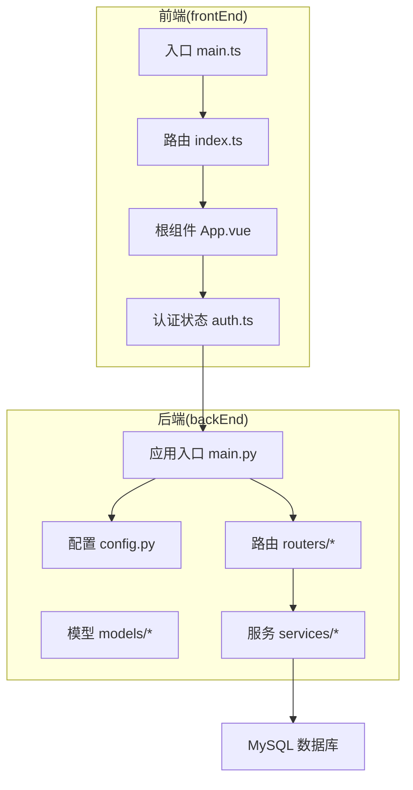
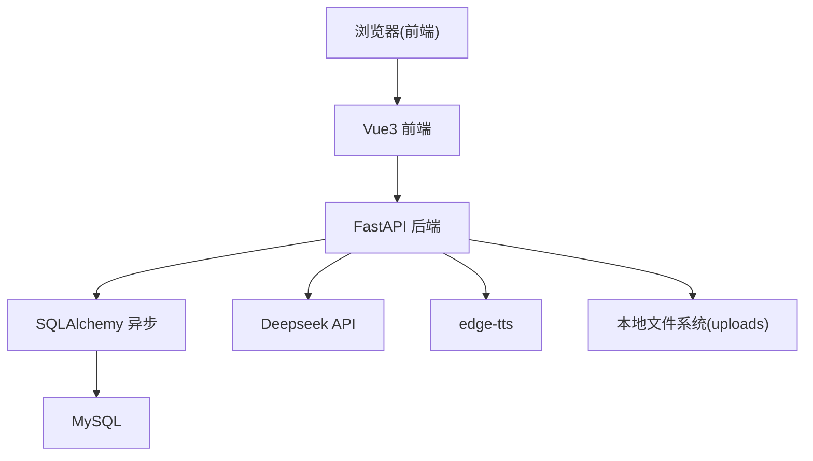
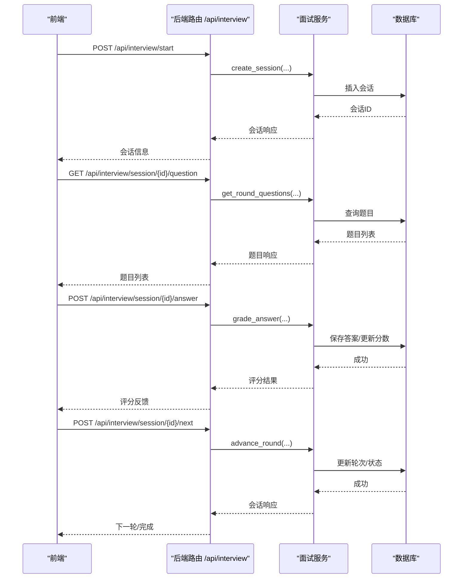
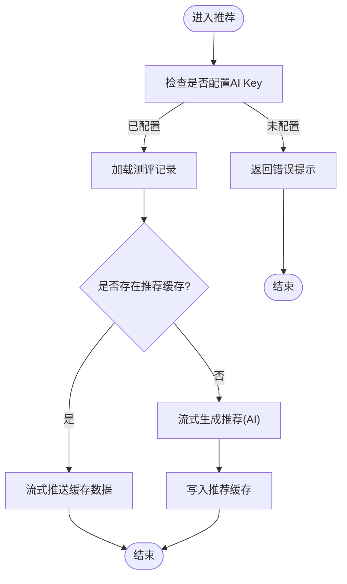
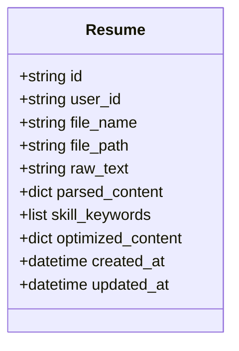
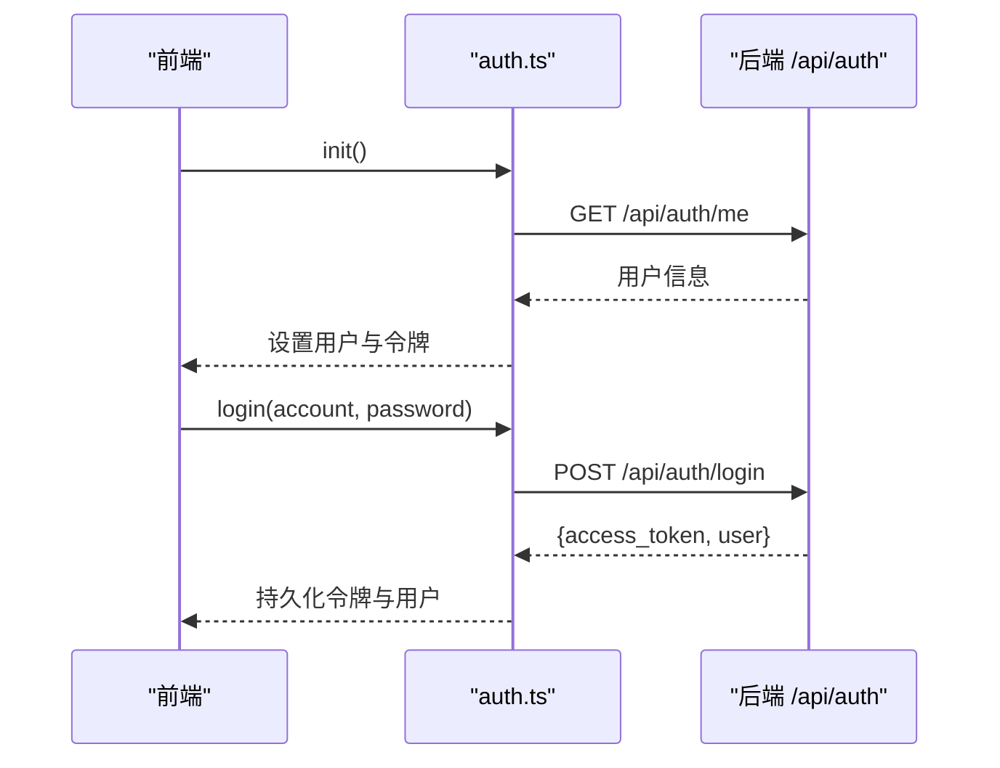
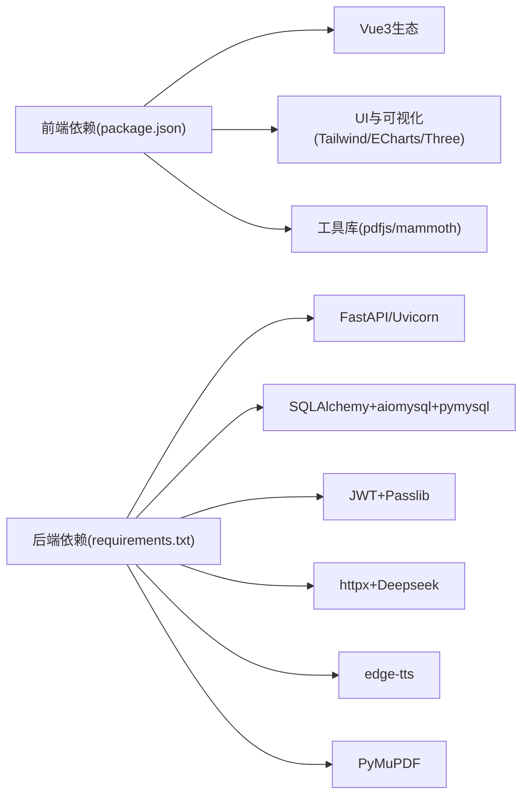

# 项目概述

<cite>
**本文引用的文件**   
- [backEnd/app/main.py](file://backEnd/app/main.py)
- [backEnd/app/config.py](file://backEnd/app/config.py)
- [backEnd/requirements.txt](file://backEnd/requirements.txt)
- [frontEnd/src/main.ts](file://frontEnd/src/main.ts)
- [frontEnd/package.json](file://frontEnd/package.json)
- [start.cmd](file://start.cmd)
- [backEnd/app/models/__init__.py](file://backEnd/app/models/__init__.py)
- [backEnd/app/models/user.py](file://backEnd/app/models/user.py)
- [backEnd/app/models/interview.py](file://backEnd/app/models/interview.py)
- [backEnd/app/models/career.py](file://backEnd/app/models/career.py)
- [backEnd/app/models/resume.py](file://backEnd/app/models/resume.py)
- [backEnd/app/routers/interview.py](file://backEnd/app/routers/interview.py)
- [backEnd/app/routers/career.py](file://backEnd/app/routers/career.py)
- [backEnd/app/routers/resume.py](file://backEnd/app/routers/resume.py)
- [frontEnd/src/App.vue](file://frontEnd/src/App.vue)
- [frontEnd/src/router/index.ts](file://frontEnd/src/router/index.ts)
- [frontEnd/src/stores/auth.ts](file://frontEnd/src/stores/auth.ts)
</cite>

## 目录
1. [简介](#简介)
2. [项目结构](#项目结构)
3. [核心组件](#核心组件)
4. [架构总览](#架构总览)
5. [详细组件分析](#详细组件分析)
6. [依赖分析](#依赖分析)
7. [性能考虑](#性能考虑)
8. [故障排查指南](#故障排查指南)
9. [结论](#结论)
10. [附录：快速开始](#附录快速开始)

## 简介
HR XF AI面试辅助系统是一个基于现代技术栈的AI驱动面试辅助平台，提供完整的前后端实现。系统围绕以下核心用例构建：
- AI面试模拟：支持多轮次、多题型（选择、判断、编程、开放问答）与语音交互，具备切屏检测与评分报告生成。
- 职业发展测评：提供多种测评类型（如Holland、MBTI、职业价值观），并基于结果进行岗位匹配推荐。
- 在线编程平台：题目管理与提交执行能力（由后端服务支撑）。
- 简历优化服务：上传PDF/文本，结构化解析与措辞优化，支持流式输出与缓存。
- 社区论坛：帖子、评论、点赞、标签等基础社交功能。
- 管理员后台：用户、题目、帖子等管理界面。

技术栈选择与优势：
- 前端：Vue3 + TypeScript + Vite + Pinia + Vue Router + TailwindCSS，具备高开发效率、强类型保障与现代化构建体验。
- 后端：FastAPI + SQLAlchemy 2.0异步 + Alembic迁移 + Pydantic配置，具备高性能异步I/O、清晰的数据校验与可维护的数据库抽象。
- 数据库：MySQL（通过aiomysql/pymysql连接），适合关系型数据与JSON字段扩展。
- AI集成：HTTP客户端调用Deepseek API；TTS使用edge-tts；PDF解析使用PyMuPDF。
- 部署与运行：提供一键启动脚本，前后端并行启动，开箱即用。

## 项目结构
仓库采用前后端分离组织方式：
- backEnd：FastAPI应用，包含路由、服务、模型、配置、迁移与静态资源挂载。
- frontEnd：Vue3工程，包含页面视图、组件、状态管理、路由与构建配置。
- 根目录：SQL初始化脚本与Windows一键启动脚本。

图表来源
- [backEnd/app/main.py:1-90](file://backEnd/app/main.py#L1-L90)
- [backEnd/app/config.py:1-71](file://backEnd/app/config.py#L1-L71)
- [frontEnd/src/main.ts:1-19](file://frontEnd/src/main.ts#L1-L19)
- [frontEnd/src/router/index.ts:1-167](file://frontEnd/src/router/index.ts#L1-L167)
- [frontEnd/src/App.vue:1-21](file://frontEnd/src/App.vue#L1-L21)
- [frontEnd/src/stores/auth.ts:1-314](file://frontEnd/src/stores/auth.ts#L1-L314)

章节来源
- [backEnd/app/main.py:1-90](file://backEnd/app/main.py#L1-L90)
- [frontEnd/src/main.ts:1-19](file://frontEnd/src/main.ts#L1-L19)
- [frontEnd/src/router/index.ts:1-167](file://frontEnd/src/router/index.ts#L1-L167)
- [frontEnd/src/App.vue:1-21](file://frontEnd/src/App.vue#L1-L21)

## 核心组件
- 应用生命周期与中间件
  - FastAPI应用启动时自动创建表结构并初始化种子数据；注册CORS、挂载静态文件、统一异常处理与健康检查。
- 配置中心
  - 集中管理数据库、JWT、CORS、AI API、编译器路径等环境变量，并提供同步/异步数据库URL与CORS列表。
- 数据模型
  - 用户、面试会话/题目/答案、职业测评、简历等实体，广泛使用JSON字段承载灵活内容。
- 路由与服务
  - 按业务域划分路由（面试、测评、简历、认证、题目、帖子、管理、TTS），服务层封装业务逻辑与外部调用。
- 前端应用
  - 应用入口恢复登录态；路由守卫控制访问权限；Pinia集中管理用户与业务状态。

章节来源
- [backEnd/app/main.py:27-49](file://backEnd/app/main.py#L27-L49)
- [backEnd/app/config.py:7-71](file://backEnd/app/config.py#L7-L71)
- [backEnd/app/models/__init__.py:1-12](file://backEnd/app/models/__init__.py#L1-L12)
- [frontEnd/src/main.ts:14-18](file://frontEnd/src/main.ts#L14-L18)
- [frontEnd/src/router/index.ts:136-164](file://frontEnd/src/router/index.ts#L136-L164)

## 架构总览
系统采用前后端分离的微服务风格单体架构：前端通过REST/SSE与后端交互，后端以异步ORM访问MySQL，并通过HTTP客户端调用外部AI服务。

图表来源
- [backEnd/app/main.py:51-73](file://backEnd/app/main.py#L51-L73)
- [backEnd/app/config.py:47-65](file://backEnd/app/config.py#L47-L65)
- [backEnd/requirements.txt:1-27](file://backEnd/requirements.txt#L1-L27)
- [frontEnd/src/stores/auth.ts:37-61](file://frontEnd/src/stores/auth.ts#L37-L61)

## 详细组件分析

### 面试模块（Interview）
- 关键流程
  - 开始面试：创建会话并返回当前轮次与进度。
  - 获取题目：根据当前轮次返回题目集合。
  - 提交答案：记录答案并评分，支持时长统计。
  - 下一轮：推进轮次，达到完成条件后生成多维评分报告。
  - AI对话：SSE流式返回AI回复，用于语音或文字交互。
  - 切屏上报：累计作弊次数，影响最终评价。
  - 中止面试：标记为中止，满足条件仍生成报告。
  - 历史与报告：分页查询历史记录，按需生成或读取报告。
- 数据模型
  - InterviewSession：会话主记录，含轮次、模式、状态、分数与报告JSON。
  - InterviewQuestion：题库，含题型、岗位类别、内容与标准答案。
  - InterviewAnswer：答题记录，关联会话与题目，含得分与反馈。

图表来源
- [backEnd/app/routers/interview.py:36-158](file://backEnd/app/routers/interview.py#L36-L158)
- [backEnd/app/models/interview.py:19-114](file://backEnd/app/models/interview.py#L19-L114)

章节来源
- [backEnd/app/routers/interview.py:1-317](file://backEnd/app/routers/interview.py#L1-L317)
- [backEnd/app/models/interview.py:1-114](file://backEnd/app/models/interview.py#L1-L114)

### 职业测评模块（Career）
- 关键流程
  - 获取题目：按测评类型返回题目集。
  - 提交答案：保存原始答案并计算结构化结果与摘要。
  - 历史记录：分页查询用户的测评记录。
  - 结果详情：按ID获取单条测评详情。
  - 岗位推荐（SSE）：优先返回缓存，否则调用AI生成并缓存结果。
- 数据模型
  - CareerAssessment：测评记录，含类型、原始答案、结果JSON、摘要与推荐缓存。

图表来源
- [backEnd/app/routers/career.py:96-158](file://backEnd/app/routers/career.py#L96-L158)
- [backEnd/app/models/career.py:11-56](file://backEnd/app/models/career.py#L11-L56)

章节来源
- [backEnd/app/routers/career.py:1-158](file://backEnd/app/routers/career.py#L1-L158)
- [backEnd/app/models/career.py:1-56](file://backEnd/app/models/career.py#L1-L56)

### 简历模块（Resume）
- 关键流程
  - 上传简历：保存原始文件与文本，若配置AI Key则自动结构化提取。
  - 手动分析：触发AI结构化解析，更新技能关键词与结构化内容。
  - 措辞优化：优先返回缓存，否则同步或流式调用AI优化，并缓存结果。
  - PDF文本提取：服务端使用PyMuPDF提取PDF文本，提升可靠性。
- 数据模型
  - Resume：每用户一条简历，含文件名、路径、原始文本、结构化内容、技能关键词与优化缓存。

图表来源
- [backEnd/app/models/resume.py:11-67](file://backEnd/app/models/resume.py#L11-L67)

章节来源
- [backEnd/app/routers/resume.py:1-215](file://backEnd/app/routers/resume.py#L1-L215)
- [backEnd/app/models/resume.py:1-67](file://backEnd/app/models/resume.py#L1-L67)

### 认证与路由守卫（Auth & Router）
- 前端认证状态
  - 应用启动时从本地恢复token并验证有效性，失败则清除会话。
  - 提供注册、登录、登出、资料更新、头像上传、账号注销等方法。
- 路由守卫
  - 普通用户：需要登录的页面未登录跳转至登录页；已登录访问登录页跳转至仪表盘。
  - 管理员：需要管理员权限的页面未登录跳转至管理员登录页。

图表来源
- [frontEnd/src/stores/auth.ts:72-83](file://frontEnd/src/stores/auth.ts#L72-L83)
- [frontEnd/src/stores/auth.ts:119-134](file://frontEnd/src/stores/auth.ts#L119-L134)
- [frontEnd/src/router/index.ts:136-164](file://frontEnd/src/router/index.ts#L136-L164)

章节来源
- [frontEnd/src/stores/auth.ts:1-314](file://frontEnd/src/stores/auth.ts#L1-L314)
- [frontEnd/src/router/index.ts:1-167](file://frontEnd/src/router/index.ts#L1-L167)
- [frontEnd/src/App.vue:1-21](file://frontEnd/src/App.vue#L1-L21)

## 依赖分析
- 后端依赖
  - FastAPI、Uvicorn、Pydantic Settings、SQLAlchemy异步、aiomysql/pymysql、Alembic、cryptography、python-jose、passlib、httpx、PyMuPDF、edge-tts等。
- 前端依赖
  - Vue3、Vue Router、Pinia、TailwindCSS、ECharts、Three.js与VRM、PDF.js、Mammoth等。
- 运行时依赖
  - MySQL数据库、可选的编译器路径（Python/GCC/G++/Java/Node）、Deepseek API Key。

图表来源
- [frontEnd/package.json:1-35](file://frontEnd/package.json#L1-L35)
- [backEnd/requirements.txt:1-27](file://backEnd/requirements.txt#L1-L27)

章节来源
- [frontEnd/package.json:1-35](file://frontEnd/package.json#L1-L35)
- [backEnd/requirements.txt:1-27](file://backEnd/requirements.txt#L1-L27)

## 性能考虑
- 异步I/O：后端使用SQLAlchemy异步与FastAPI，提高并发处理能力。
- SSE流式：面试AI对话、测评推荐与简历优化采用SSE，降低首字节延迟，提升用户体验。
- 缓存策略：测评推荐与简历优化结果落库缓存，避免重复AI调用。
- 静态资源：uploads目录直接挂载，减少存储层压力。
- 数据库索引：对常用查询字段建立索引（如用户ID、会话状态、测评类型等）。

[本节为通用指导，不直接分析具体文件]

## 故障排查指南
- 常见错误
  - 未配置AI Key：简历分析与测评推荐接口会返回明确错误提示，需在.env中设置DEEPSEEK_API_KEY。
  - 数据库连接失败：检查config中的数据库参数与网络连通性。
  - CORS跨域问题：确认前端域名在CORS白名单中。
  - 文件上传失败：检查uploads目录权限与磁盘空间。
- 健康检查
  - 使用GET /api/health验证后端可用性。
- 日志与调试
  - 后端启动脚本启用reload便于开发调试；前端Vite默认热重载。

章节来源
- [backEnd/app/routers/resume.py:89-97](file://backEnd/app/routers/resume.py#L89-L97)
- [backEnd/app/routers/career.py:103-104](file://backEnd/app/routers/career.py#L103-L104)
- [backEnd/app/main.py:87-90](file://backEnd/app/main.py#L87-L90)
- [backEnd/app/config.py:31-37](file://backEnd/app/config.py#L31-L37)

## 结论
HR XF AI面试辅助系统以清晰的模块化设计与现代技术栈为基础，提供了完整的AI面试模拟、职业发展测评、在线编程、简历优化、社区与管理后台能力。通过SSE流式与缓存机制，系统在实时性与性能之间取得良好平衡；同时借助严格的配置与异常处理，提升了系统的可维护性与健壮性。

[本节为总结性内容，不直接分析具体文件]

## 附录：快速开始
- 环境准备
  - 安装Python虚拟环境与依赖：参考requirements.txt。
  - 安装Node.js与前端依赖：参考package.json。
  - 准备MySQL数据库与连接参数。
- 启动服务
  - 双击运行start.cmd，将自动启动后端（端口8000）与前端（端口5173），并在浏览器打开前端地址。
- 访问文档
  - 后端API文档：http://localhost:8000/docs
- 注意事项
  - 如需AI功能，请在.env中配置DEEPSEEK_API_KEY。
  - 首次启动会自动创建表结构与初始化种子数据。

章节来源
- [start.cmd:1-36](file://start.cmd#L1-L36)
- [backEnd/app/main.py:27-41](file://backEnd/app/main.py#L27-L41)
- [backEnd/app/config.py:7-37](file://backEnd/app/config.py#L7-L37)